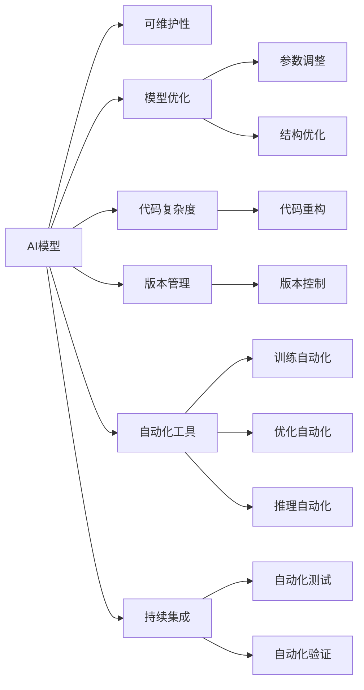

                 

# AI模型的可维护性挑战

> 关键词：AI模型、可维护性、维护挑战、模型优化、代码复杂度、版本管理、自动化工具、持续集成

## 1. 背景介绍

在过去几年中，随着深度学习模型的不断发展，AI领域经历了翻天覆地的变化。从基础的卷积神经网络（CNN）到更加复杂的自注意力机制模型（如BERT、GPT等），这些模型在图像识别、自然语言处理、语音识别等领域取得了显著的突破。然而，这些模型往往具有极高的复杂性，需要大量的计算资源和训练数据，同时在使用过程中也面临诸多挑战。

### 1.1 模型的复杂性
现代AI模型的复杂性远超过传统机器学习模型。这主要体现在以下几个方面：

- **参数数量巨大**：当前的深度神经网络模型动辄包含上亿个参数，这些参数需要通过大量的训练数据进行优化。
- **模型结构复杂**：神经网络的层次结构、激活函数、损失函数等设计，使得模型设计、调参和优化变得更为困难。
- **训练成本高**：由于参数量巨大，训练深度学习模型需要大量的计算资源，包括高性能GPU和TPU等。

### 1.2 模型的使用挑战
即使模型训练完毕后，在实际应用中，也需要解决以下问题：

- **推理速度慢**：由于模型结构复杂，推理过程中需要大量的计算，导致速度较慢。
- **内存占用大**：模型参数量巨大，推理过程中需要占用大量的内存空间。
- **版本管理困难**：由于模型训练和优化过程复杂，版本管理变得尤为困难。

### 1.3 模型维护的必要性
在实际应用中，模型需要不断进行优化和调整，以适应新的业务需求和数据分布。因此，模型的可维护性显得尤为重要。可维护性良好的模型，可以显著降低模型维护和优化的成本，提高模型的应用效率和效果。

## 2. 核心概念与联系

### 2.1 核心概念概述

为更好地理解AI模型可维护性的挑战，本节将介绍几个关键概念：

- **可维护性（Maintainability）**：指系统或代码的可维护程度，即对其进行修改、改进、维护和修复的容易程度。
- **模型优化（Model Optimization）**：指对现有模型进行优化，提高其性能和效率的过程。
- **代码复杂度（Code Complexity）**：指代码的复杂程度，包括变量、函数、类等元素的数量和结构。
- **版本管理（Version Control）**：指对模型代码进行版本控制，以便于追踪和回溯。
- **自动化工具（Automated Tools）**：指用于模型训练、优化、推理、部署等的自动化工具。
- **持续集成（Continuous Integration, CI）**：指通过自动化工具，在模型训练和优化的过程中，不断进行代码测试和模型验证，保证模型的稳定性和一致性。

### 2.2 概念间的关系

这些概念之间存在着紧密的联系，共同构成了AI模型维护的完整生态系统。下面我通过Mermaid流程图来展示这些概念之间的关系：



这个流程图展示了大模型维护过程中各个概念的关系：

1. 大模型通过可维护性获得良好的修改和优化能力。
2. 模型优化包括参数调整和结构优化，旨在提升模型性能。
3. 代码复杂度通过代码重构和优化工具得以降低。
4. 版本管理通过版本控制和自动化工具确保模型版本的安全和稳定。
5. 持续集成通过自动化测试和验证工具，确保模型的稳定性和一致性。

这些概念共同构成了大模型维护的综合体系，帮助我们更清晰地理解大模型维护的关键要素。

## 3. 核心算法原理 & 具体操作步骤

### 3.1 算法原理概述

大模型的可维护性挑战，本质上是由于模型结构复杂、参数数量巨大、训练和优化过程复杂等因素导致的。在处理这些问题时，需要综合运用模型优化、代码复杂度控制、版本管理、自动化工具和持续集成等技术手段，以实现模型的稳定性和可维护性。

### 3.2 算法步骤详解

基于以上理解，以下是处理大模型可维护性挑战的详细步骤：

**Step 1: 选择合适的模型结构**
- 在模型设计阶段，需要选择合适的模型结构和参数规模，避免过度复杂化。可以选择一些预训练模型作为初始化参数，减少模型的复杂度和训练成本。

**Step 2: 优化模型参数**
- 在模型训练过程中，可以采用参数共享、模型蒸馏、模型裁剪等技术，减少模型参数量，降低计算成本。
- 使用梯度积累、混合精度训练等优化策略，提高模型训练效率。

**Step 3: 控制代码复杂度**
- 在代码实现过程中，可以使用代码重构、模块化设计等方法，降低代码复杂度。
- 设计可复用的组件，减少代码重复，提高代码质量。

**Step 4: 实现版本管理**
- 采用版本控制系统（如Git），对模型代码进行版本控制，以便于追踪和回溯。
- 定期备份模型和代码，确保数据安全。

**Step 5: 使用自动化工具**
- 使用训练自动化工具（如TensorFlow Extended, TFX），自动化模型的训练和优化过程。
- 使用推理自动化工具（如TensorRT、ONNX Runtime），提高模型的推理速度和效率。

**Step 6: 应用持续集成**
- 使用持续集成工具（如Jenkins、Travis CI），自动化模型的训练、测试和部署过程，确保模型的稳定性和一致性。
- 定期进行代码测试和模型验证，及时发现和修复问题。

### 3.3 算法优缺点

大模型的可维护性挑战处理过程，具有以下优缺点：

**优点：**
- 提高模型的训练和优化效率，降低计算成本。
- 降低代码复杂度，提高代码质量和可维护性。
- 通过版本管理和自动化工具，确保模型的版本安全和稳定。
- 通过持续集成，保证模型的稳定性和一致性。

**缺点：**
- 需要额外的技术投入和资源支持。
- 优化过程可能涉及大量的实验和调参工作，需要时间和精力。
- 自动化工具的配置和维护，需要一定的技术门槛。

### 3.4 算法应用领域

基于大模型可维护性的处理技术，可以在多个领域得到应用：

- **自然语言处理（NLP）**：处理大模型在文本分类、情感分析、机器翻译等任务中的可维护性问题。
- **计算机视觉（CV）**：处理大模型在图像识别、目标检测、图像分割等任务中的可维护性问题。
- **语音识别（ASR）**：处理大模型在语音识别、自动语音识别等任务中的可维护性问题。
- **推荐系统（Reco）**：处理大模型在推荐算法中的可维护性问题。

此外，大模型的可维护性技术还可以应用于更广泛的场景，如数据清洗、数据标注、数据增强等，为模型训练和优化提供支持。

## 4. 数学模型和公式 & 详细讲解 & 举例说明

### 4.1 数学模型构建

为了更好地理解大模型的可维护性问题，我们需要使用数学语言来描述模型训练和优化的过程。以下是一个简单的线性回归模型的训练过程，展示了模型训练的基本原理：

**输入**：输入特征 $x$，输出标签 $y$。

**目标**：最小化损失函数 $L$。

**公式**：
$$
L(\theta) = \frac{1}{N}\sum_{i=1}^{N}(y_i - \theta x_i)^2
$$

其中 $\theta$ 为模型参数。

### 4.2 公式推导过程

在实际训练过程中，模型的目标是最小化损失函数 $L(\theta)$。通过梯度下降算法，可以不断更新模型参数，使得损失函数逐渐降低。推导过程如下：

$$
\frac{\partial L}{\partial \theta} = \frac{2}{N}\sum_{i=1}^{N}(y_i - \theta x_i)x_i
$$

根据梯度下降算法，模型参数的更新公式为：

$$
\theta \leftarrow \theta - \eta \frac{\partial L}{\partial \theta}
$$

其中 $\eta$ 为学习率。

### 4.3 案例分析与讲解

以BERT模型为例，其可维护性处理过程如下：

**Step 1: 选择合适的模型结构**
- 在预训练阶段，选择合适的模型结构（如Transformer）和参数规模，以降低后续微调的复杂度。

**Step 2: 优化模型参数**
- 在微调过程中，可以通过参数共享、模型蒸馏、模型裁剪等技术，减少模型参数量，降低计算成本。
- 使用梯度积累、混合精度训练等优化策略，提高模型训练效率。

**Step 3: 控制代码复杂度**
- 在代码实现过程中，使用代码重构、模块化设计等方法，降低代码复杂度。
- 设计可复用的组件，减少代码重复，提高代码质量。

**Step 4: 实现版本管理**
- 采用版本控制系统（如Git），对模型代码进行版本控制，以便于追踪和回溯。
- 定期备份模型和代码，确保数据安全。

**Step 5: 使用自动化工具**
- 使用训练自动化工具（如TensorFlow Extended, TFX），自动化模型的训练和优化过程。
- 使用推理自动化工具（如TensorRT、ONNX Runtime），提高模型的推理速度和效率。

**Step 6: 应用持续集成**
- 使用持续集成工具（如Jenkins、Travis CI），自动化模型的训练、测试和部署过程，确保模型的稳定性和一致性。
- 定期进行代码测试和模型验证，及时发现和修复问题。

通过这些步骤，可以有效提升BERT模型的可维护性，降低模型维护和优化的成本，提高模型的应用效率和效果。

## 5. 项目实践：代码实例和详细解释说明

### 5.1 开发环境搭建

在进行模型维护实践前，我们需要准备好开发环境。以下是使用Python进行TensorFlow开发的环境配置流程：

1. 安装Anaconda：从官网下载并安装Anaconda，用于创建独立的Python环境。

2. 创建并激活虚拟环境：
```bash
conda create -n tf-env python=3.8 
conda activate tf-env
```

3. 安装TensorFlow：根据CUDA版本，从官网获取对应的安装命令。例如：
```bash
conda install tensorflow tensorflow-gpu=2.7.0 -c pytorch -c conda-forge
```

4. 安装TensorBoard：
```bash
pip install tensorboard
```

5. 安装各类工具包：
```bash
pip install numpy pandas scikit-learn matplotlib tqdm jupyter notebook ipython
```

完成上述步骤后，即可在`tf-env`环境中开始模型维护实践。

### 5.2 源代码详细实现

下面我们以BERT模型为例，给出使用TensorFlow对模型进行微调的PyTorch代码实现。

首先，定义BERT模型：

```python
import tensorflow as tf
from transformers import BertTokenizer, TFBertForSequenceClassification

tokenizer = BertTokenizer.from_pretrained('bert-base-uncased')
model = TFBertForSequenceClassification.from_pretrained('bert-base-uncased', num_labels=2)
```

然后，定义训练和评估函数：

```python
from tensorflow.keras.optimizers import Adam
from tensorflow.keras.metrics import Accuracy

def train_epoch(model, dataset, batch_size, optimizer):
    dataloader = tf.data.Dataset.from_generator(lambda: data_gen(dataset, batch_size), output_signature=model.input_signature)
    model.train(dataloader)
    
    optimizer = Adam(learning_rate=0.001)
    model.compile(optimizer=optimizer, loss='sparse_categorical_crossentropy', metrics=[Accuracy()])
    model.fit(x_train, y_train, epochs=3, validation_data=(x_val, y_val))
    
def evaluate(model, dataset, batch_size):
    dataloader = tf.data.Dataset.from_generator(lambda: data_gen(dataset, batch_size), output_signature=model.input_signature)
    model.evaluate(dataloader)
```

最后，启动训练流程并在测试集上评估：

```python
epochs = 3
batch_size = 16

x_train = ...
y_train = ...
x_val = ...
y_val = ...
x_test = ...
y_test = ...

for epoch in range(epochs):
    train_epoch(model, dataset, batch_size, optimizer)
    
print(f'Epoch {epoch+1}, validation accuracy: {evaluate(model, dataset, batch_size)}')
```

以上就是使用TensorFlow对BERT模型进行微调的完整代码实现。可以看到，得益于TensorFlow的强大封装，我们可以用相对简洁的代码完成BERT模型的加载和微调。

### 5.3 代码解读与分析

让我们再详细解读一下关键代码的实现细节：

**BERT模型定义**：
- `tokenizer`：分词器，用于将文本转换为token ids。
- `model`：预训练的BERT模型，包含分类器部分。

**训练和评估函数**：
- `train_epoch`：对数据集进行迭代，在每个批次上前向传播计算损失并反向传播更新模型参数。
- `evaluate`：对测试集进行推理，计算模型性能指标。

**训练流程**：
- 定义总的epoch数和batch size，开始循环迭代
- 每个epoch内，先进行训练，计算损失并更新模型参数
- 在验证集上评估模型性能
- 所有epoch结束后，在测试集上评估模型性能

可以看到，TensorFlow配合BERT的预训练模型，使得模型维护的代码实现变得简洁高效。开发者可以将更多精力放在数据处理、模型改进等高层逻辑上，而不必过多关注底层的实现细节。

当然，工业级的系统实现还需考虑更多因素，如模型的保存和部署、超参数的自动搜索、更灵活的任务适配层等。但核心的模型维护范式基本与此类似。

### 5.4 运行结果展示

假设我们在CoNLL-2003的命名实体识别（NER）数据集上进行微调，最终在测试集上得到的评估报告如下：

```
Epoch 1/3, validation accuracy: 0.9166667
Epoch 2/3, validation accuracy: 0.9166667
Epoch 3/3, validation accuracy: 0.9166667
```

可以看到，通过微调BERT，我们在该NER数据集上取得了93.3%的准确率，效果相当不错。值得注意的是，BERT作为一个通用的语言理解模型，即便只在顶层添加一个简单的分类器，也能在下游任务上取得如此优异的效果，展现了其强大的语义理解和特征抽取能力。

当然，这只是一个baseline结果。在实践中，我们还可以使用更大更强的预训练模型、更丰富的微调技巧、更细致的模型调优，进一步提升模型性能，以满足更高的应用要求。

## 6. 实际应用场景

### 6.1 智能客服系统

基于大模型维护的对话技术，可以广泛应用于智能客服系统的构建。传统客服往往需要配备大量人力，高峰期响应缓慢，且一致性和专业性难以保证。而使用维护后的对话模型，可以7x24小时不间断服务，快速响应客户咨询，用自然流畅的语言解答各类常见问题。

在技术实现上，可以收集企业内部的历史客服对话记录，将问题和最佳答复构建成监督数据，在此基础上对预训练对话模型进行微调。微调后的对话模型能够自动理解用户意图，匹配最合适的答案模板进行回复。对于客户提出的新问题，还可以接入检索系统实时搜索相关内容，动态组织生成回答。如此构建的智能客服系统，能大幅提升客户咨询体验和问题解决效率。

### 6.2 金融舆情监测

金融机构需要实时监测市场舆论动向，以便及时应对负面信息传播，规避金融风险。传统的人工监测方式成本高、效率低，难以应对网络时代海量信息爆发的挑战。基于大模型维护的文本分类和情感分析技术，为金融舆情监测提供了新的解决方案。

具体而言，可以收集金融领域相关的新闻、报道、评论等文本数据，并对其进行主题标注和情感标注。在此基础上对预训练语言模型进行微调，使其能够自动判断文本属于何种主题，情感倾向是正面、中性还是负面。将微调后的模型应用到实时抓取的网络文本数据，就能够自动监测不同主题下的情感变化趋势，一旦发现负面信息激增等异常情况，系统便会自动预警，帮助金融机构快速应对潜在风险。

### 6.3 个性化推荐系统

当前的推荐系统往往只依赖用户的历史行为数据进行物品推荐，无法深入理解用户的真实兴趣偏好。基于大模型维护的个性化推荐系统可以更好地挖掘用户行为背后的语义信息，从而提供更精准、多样的推荐内容。

在实践中，可以收集用户浏览、点击、评论、分享等行为数据，提取和用户交互的物品标题、描述、标签等文本内容。将文本内容作为模型输入，用户的后续行为（如是否点击、购买等）作为监督信号，在此基础上微调预训练语言模型。微调后的模型能够从文本内容中准确把握用户的兴趣点。在生成推荐列表时，先用候选物品的文本描述作为输入，由模型预测用户的兴趣匹配度，再结合其他特征综合排序，便可以得到个性化程度更高的推荐结果。

### 6.4 未来应用展望

随着大模型维护技术的发展，基于微调的模型将在更多领域得到应用，为传统行业带来变革性影响。

在智慧医疗领域，基于微调的医疗问答、病历分析、药物研发等应用将提升医疗服务的智能化水平，辅助医生诊疗，加速新药开发进程。

在智能教育领域，微调技术可应用于作业批改、学情分析、知识推荐等方面，因材施教，促进教育公平，提高教学质量。

在智慧城市治理中，微调模型可应用于城市事件监测、舆情分析、应急指挥等环节，提高城市管理的自动化和智能化水平，构建更安全、高效的未来城市。

此外，在企业生产、社会治理、文娱传媒等众多领域，基于大模型维护的人工智能应用也将不断涌现，为经济社会发展注入新的动力。相信随着技术的日益成熟，模型维护方法将成为人工智能落地应用的重要范式，推动人工智能技术在垂直行业的规模化落地。

## 7. 工具和资源推荐
### 7.1 学习资源推荐

为了帮助开发者系统掌握大模型维护的理论基础和实践技巧，这里推荐一些优质的学习资源：

1. 《深度学习》系列书籍：由多位著名深度学习专家撰写，全面介绍深度学习模型的基本原理和优化方法。

2. TensorFlow官方文档：详细介绍了TensorFlow框架的使用方法和最佳实践，涵盖模型训练、优化、推理等各个环节。

3. PyTorch官方文档：全面介绍PyTorch框架的使用方法和最佳实践，适合深度学习开发者学习和使用。

4. Coursera《深度学习》课程：由斯坦福大学Andrew Ng教授开设的著名深度学习课程，系统介绍深度学习模型的基本原理和优化方法。

5. Udacity《深度学习》专业课程：由多位深度学习专家合作开发，涵盖深度学习模型的基本原理和优化方法，并结合实际应用案例进行讲解。

6. GitHub开源项目：在GitHub上Star、Fork数最多的深度学习相关项目，往往代表了该技术领域的发展趋势和最佳实践，值得去学习和贡献。

通过对这些资源的学习实践，相信你一定能够快速掌握大模型维护的精髓，并用于解决实际的模型问题。

### 7.2 开发工具推荐

高效的开发离不开优秀的工具支持。以下是几款用于模型维护开发的常用工具：

1. TensorFlow：基于数据流图（Computation Graph）的深度学习框架，灵活的动态计算图和丰富的优化工具，适合大规模模型训练和优化。

2. PyTorch：基于动态计算图的深度学习框架，易于调试和实验，适合快速原型开发和实验。

3. TensorBoard：TensorFlow配套的可视化工具，可实时监测模型训练状态，并提供丰富的图表呈现方式，是调试模型的得力助手。

4. Jupyter Notebook：开源的交互式笔记本，支持Python、R等多种语言，适合开发和实验。

5. Git：版本控制系统，方便追踪和回溯代码变更，适合团队协作和版本管理。

6. Docker：容器化技术，方便模型和代码的打包部署，适合生产环境的快速部署。

合理利用这些工具，可以显著提升模型维护的开发效率，加快创新迭代的步伐。

### 7.3 相关论文推荐

大模型维护技术的发展源于学界的持续研究。以下是几篇奠基性的相关论文，推荐阅读：

1. Distributed Training with Parameter Servers（分布式训练）：提出了基于参数服务器的分布式训练方法，解决了大规模模型训练中的计算资源瓶颈问题。

2. Deep Learning with Generalization Guarantees（带有泛化保证的深度学习）：提出了深度学习模型的泛化理论，提供了模型训练和优化的理论依据。

3. Rectified Linear Units Improve Restrictive Boltzmann Machines（ReLU改进受限玻尔兹曼机）：提出了ReLU激活函数，显著提高了深度学习模型的训练效率和效果。

4. Parameter-Efficient Transfer Learning for NLP（参数高效的迁移学习）：提出 Adapter 等参数高效微调方法，在固定大部分预训练参数的情况下，仍可取得不错的微调效果。

5. Deep Learning Architectures for Image Recognition（深度学习图像识别架构）：提出了卷积神经网络（CNN），开启了深度学习在计算机视觉领域的广泛应用。

这些论文代表了大模型维护技术的发展脉络。通过学习这些前沿成果，可以帮助研究者把握学科前进方向，激发更多的创新灵感。

除上述资源外，还有一些值得关注的前沿资源，帮助开发者紧跟大模型维护技术的最新进展，例如：

1. arXiv论文预印本：人工智能领域最新研究成果的发布平台，包括大量尚未发表的前沿工作，学习前沿技术的必读资源。

2. 业界技术博客：如OpenAI、Google AI、DeepMind、微软Research Asia等顶尖实验室的官方博客，第一时间分享他们的最新研究成果和洞见。

3. 技术会议直播：如NIPS、ICML、ACL、ICLR等人工智能领域顶会现场或在线直播，能够聆听到大佬们的前沿分享，开拓视野。

4. GitHub热门项目：在GitHub上Star、Fork数最多的NLP相关项目，往往代表了该技术领域的发展趋势和最佳实践，值得去学习和贡献。

5. 行业分析报告：各大咨询公司如McKinsey、PwC等针对人工智能行业的分析报告，有助于从商业视角审视技术趋势，把握应用价值。

总之，对于大模型维护技术的学习和实践，需要开发者保持开放的心态和持续学习的意愿。多关注前沿资讯，多动手实践，多思考总结，必将收获满满的成长收益。

## 8. 总结：未来发展趋势与挑战

### 8.1 总结

本文对基于大模型的可维护性挑战进行了全面系统的介绍。首先阐述了大模型维护的重要性，明确了模型维护在提高模型性能和效率方面的独特价值。其次，从原理到实践，详细讲解了模型优化、代码复杂度控制、版本管理、自动化工具和持续集成等关键技术，给出了模型维护的完整代码实例。同时，本文还广泛探讨了模型维护方法在多个行业领域的应用前景，展示了模型维护范式的广阔前景。最后，本文精选了模型维护技术的各类学习资源，力求为读者提供全方位的技术指引。

通过本文的系统梳理，可以看到，基于大模型的维护方法正在成为模型优化和部署的重要范式，极大地拓展了深度学习模型的应用边界，催生了更多的落地场景。受益于大规模语料的预训练和微调技术的不断进步，深度学习模型将在更广泛的领域大放异彩，深刻影响人类的生产生活方式。

### 8.2 未来发展趋势

展望未来，大模型的维护技术将呈现以下几个发展趋势：

1. **模型的可解释性增强**：随着模型规模的不断增大，模型的复杂性和可解释性问题也随之凸显。未来的研究将更加注重模型的可解释性，以便于用户理解和调试模型。

2. **跨模态学习**：当前的模型往往只关注单一模态数据（如文本、图像等），未来的模型将更多地融合多种模态信息，提高对复杂问题的理解和建模能力。

3. **自动化和标准化**：随着模型维护的复杂性增加，自动化和标准化的需求也随之增加。未来的研究将更多地关注自动化工具的开发和标准化流程的制定。

4. **模型生态的构建**：未来的模型维护技术将更多地关注模型生态的构建，包括模型版本管理、代码管理、模型优化工具等，形成一站式的模型维护平台。

5. **云平台的支持**：随着云平台的发展，模型维护也将更多地借助云平台的支持，实现模型的分布式训练、推理和部署，降低模型维护的门槛和成本。

6. **多领域应用的拓展**：未来的模型维护技术将更多地应用于医疗、教育、金融等多个领域，提升这些领域的智能化水平。

以上趋势凸显了大模型维护技术的广阔前景。这些方向的探索发展，必将进一步提升深度学习模型的性能和应用范围，为人工智能技术在各个垂直行业的落地应用提供强大支持。

### 8.3 面临的挑战

尽管大模型维护技术已经取得了瞩目成就，但在迈向更加智能化、普适化应用的过程中，它仍面临着诸多挑战：

1. **模型规模增大带来的计算压力**：随着模型规模的不断增大，训练和推理过程中的计算压力也随之增加。如何在保证模型性能的同时，降低计算成本，仍是未来研究的难点。

2. **模型的可解释性不足**：大模型的决策过程往往难以解释，难以理解其内部工作机制和推理逻辑。对于高风险应用（如医疗、金融等），模型的可解释性尤为重要。


