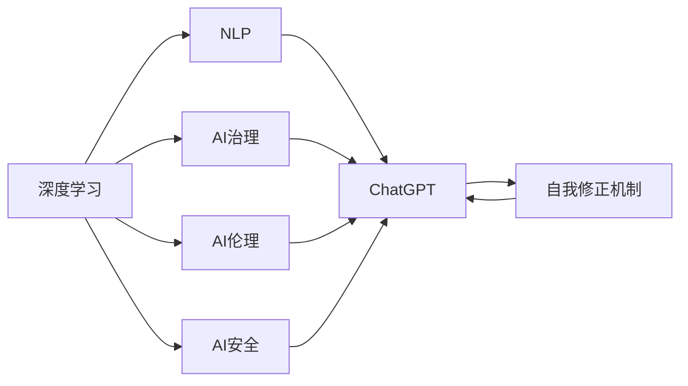
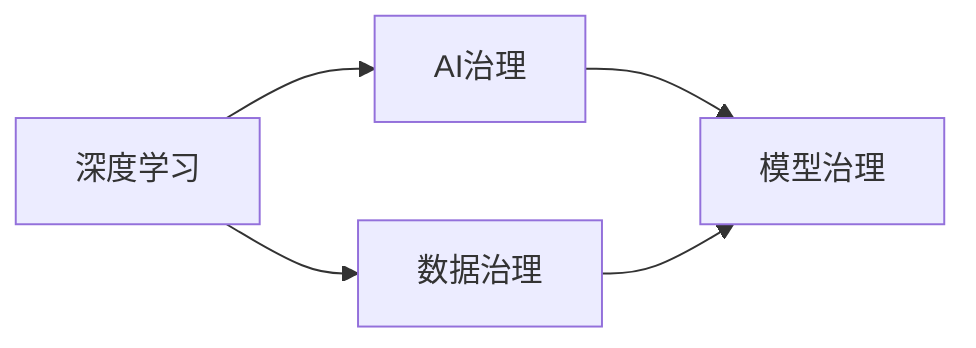
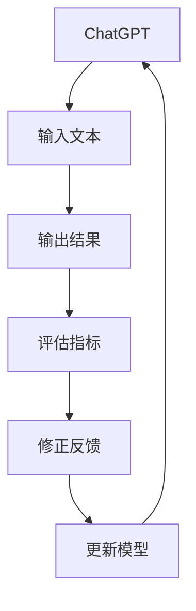
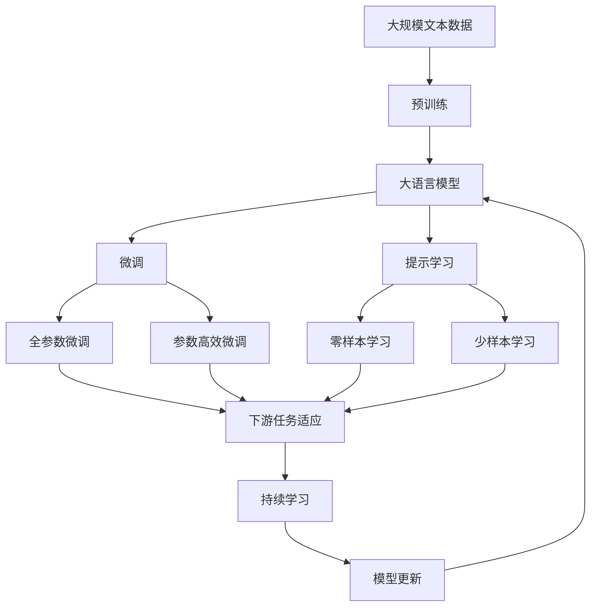

                 

# AI浪潮持续影响：超出预期，ChatGPT局限性与自我修正

> 关键词：人工智能,ChatGPT,深度学习,自然语言处理,NLP,AI治理,伦理道德

## 1. 背景介绍

### 1.1 问题由来
自2023年OpenAI发布ChatGPT以来，其强大的语言生成能力和交互式用户体验，迅速在业界和大众之间引起了轰动。ChatGPT以其流畅的语言理解和生成了令人惊叹的自然语言生成效果，展现出了AI技术前所未有的潜力。然而，ChatGPT也并非完美无瑕，其局限性同样引发了广泛讨论和反思。

### 1.2 问题核心关键点
ChatGPT及其背后的深度学习技术，虽然在自然语言处理（NLP）领域取得了巨大成功，但仍存在一些难以克服的局限性：

1. **缺乏常识推理能力**：ChatGPT虽然可以生成语法正确、内容丰富的文本，但往往缺乏真实的常识和逻辑推理能力，导致输出结果与现实世界脱节。
2. **有害信息风险**：由于ChatGPT训练数据的复杂性，可能导致其生成有害、误导性或歧视性的内容，给社会带来不良影响。
3. **多语言支持不足**：ChatGPT主要基于英文数据训练，对于中文等非主流语言的支持有限，难以满足多语言用户的需求。
4. **依赖训练数据**：ChatGPT的性能高度依赖于训练数据的质量和多样性，难以应对不同领域或特定任务的需求。
5. **缺乏自我修正机制**：ChatGPT一旦生成错误或有误导性的内容，无法自动检测并修正，依赖外部干预进行纠正。

### 1.3 问题研究意义
研究ChatGPT的局限性及其自我修正方法，对于推动人工智能技术的成熟和应用落地具有重要意义：

1. **提升AI系统的可信度**：通过增强AI系统的常识推理和伦理审查能力，提升其在实际应用中的可信度和可靠性。
2. **优化AI系统的表现**：针对ChatGPT的局限性进行优化和改进，使AI系统在多语言支持和多样性任务上表现更加出色。
3. **促进AI技术的良性发展**：通过自我修正机制，推动AI技术在实际应用中逐步完善，避免潜在的负面影响。
4. **推动AI伦理和社会责任**：确保AI系统的输出符合伦理道德标准，维护社会公正和安全。
5. **加速AI技术的产业化进程**：优化和改进的ChatGPT及相关技术，将为各行各业提供更加高效、精准的AI解决方案。

## 2. 核心概念与联系

### 2.1 核心概念概述

为了更好地理解ChatGPT的局限性及其自我修正方法，本节将介绍几个关键概念：

1. **深度学习（Deep Learning）**：基于多层神经网络进行训练和推理的机器学习方法。深度学习在图像识别、语音识别和自然语言处理等领域取得了显著成就。

2. **自然语言处理（Natural Language Processing, NLP）**：使用计算机对人类语言进行理解和生成处理的技术。ChatGPT正是通过深度学习技术在NLP领域取得突破的典型例子。

3. **AI治理（AI Governance）**：通过立法、政策、技术手段等，对人工智能系统进行规范和控制，确保其符合伦理道德和社会责任。

4. **AI伦理（AI Ethics）**：研究人工智能系统在设计和应用过程中应遵循的伦理原则和道德规范，防止AI技术对社会和个人产生负面影响。

5. **AI安全（AI Security）**：保护人工智能系统免受恶意攻击和误导，确保系统的稳定性和安全性。

6. **自我修正机制（Self-correcting Mechanism）**：AI系统能够识别并修正自身输出的错误或不当内容，保持输出的准确性和可信度。

这些概念之间的逻辑关系可以通过以下Mermaid流程图来展示：



这个流程图展示了几组核心概念之间的关系：

1. 深度学习是ChatGPT的技术基础。
2. NLP是ChatGPT的主要应用领域。
3. AI治理、AI伦理和AI安全是ChatGPT应用过程中的关键考量。
4. 自我修正机制是ChatGPT提升可信度和表现的重要手段。

### 2.2 概念间的关系

这些概念之间存在着紧密的联系，形成了ChatGPT的完整应用框架。下面我通过几个Mermaid流程图来展示这些概念之间的关系。

#### 2.2.1 深度学习与AI治理的关系



这个流程图展示了深度学习技术在AI治理中的应用。数据治理和模型治理是AI治理的核心，深度学习技术需要通过规范的数据和模型管理，才能在实际应用中发挥最佳效果。

#### 2.2.2 ChatGPT的自我修正机制



这个流程图展示了ChatGPT的自我修正机制。通过输入文本生成输出结果，然后对输出结果进行评估，根据评估结果进行反馈和模型更新，从而实现自我修正。

#### 2.2.3 深度学习与AI伦理的关系


这个流程图展示了深度学习技术在AI伦理中的应用。数据伦理和算法伦理是AI伦理的核心，深度学习技术需要通过规范的数据和算法设计，才能在实际应用中符合伦理道德标准。

### 2.3 核心概念的整体架构

最后，我们用一个综合的流程图来展示这些核心概念在大语言模型微调过程中的整体架构：



这个综合流程图展示了从预训练到微调，再到持续学习的完整过程。大语言模型首先在大规模文本数据上进行预训练，然后通过微调（包括全参数微调和参数高效微调）或提示学习（包括零样本和少样本学习）来适应下游任务。最后，通过持续学习技术，模型可以不断更新和适应新的任务和数据。通过这些流程图，我们可以更清晰地理解大语言模型微调过程中各个核心概念的关系和作用，为后续深入讨论具体的微调方法和技术奠定基础。

## 3. ChatGPT的局限性与自我修正方法

### 3.1 算法原理概述

ChatGPT的局限性主要源于其基于深度学习的生成模型。尽管ChatGPT在自然语言处理任务上取得了显著进展，但其生成能力依然存在一些限制：

1. **缺乏常识推理**：ChatGPT虽然能够生成语法正确、内容丰富的文本，但往往缺乏真实的常识和逻辑推理能力，导致输出结果与现实世界脱节。
2. **有害信息风险**：ChatGPT的训练数据中可能包含有害、误导性或歧视性的内容，这些内容可能通过模型传递到用户端，给社会带来不良影响。
3. **多语言支持不足**：ChatGPT主要基于英文数据训练，对于中文等非主流语言的支持有限，难以满足多语言用户的需求。
4. **依赖训练数据**：ChatGPT的性能高度依赖于训练数据的质量和多样性，难以应对不同领域或特定任务的需求。
5. **缺乏自我修正机制**：ChatGPT一旦生成错误或有误导性的内容，无法自动检测并修正，依赖外部干预进行纠正。

### 3.2 算法步骤详解

针对ChatGPT的局限性，我们可以采取以下自我修正方法：

1. **常识推理增强**：通过引入常识推理模块，增强ChatGPT对真实世界的理解和推理能力。
2. **有害信息过滤**：在模型训练和应用过程中，引入伦理审查机制，过滤和屏蔽有害、误导性或歧视性的内容。
3. **多语言支持扩展**：通过多语言数据集进行预训练和微调，增强ChatGPT对多种语言的支持能力。
4. **数据多样性扩展**：使用多样化的数据集进行预训练和微调，提高ChatGPT在不同领域和任务上的表现。
5. **自我修正机制设计**：设计自我修正机制，使ChatGPT能够识别并修正自身输出的错误或不当内容，保持输出的准确性和可信度。

### 3.3 算法优缺点

ChatGPT的自我修正方法有以下优点：

1. **提升可信度**：通过增强常识推理和伦理审查，提升ChatGPT在实际应用中的可信度和可靠性。
2. **优化表现**：针对ChatGPT的局限性进行优化和改进，使其在多语言支持和多样性任务上表现更加出色。
3. **促进良性发展**：通过自我修正机制，推动AI技术在实际应用中逐步完善，避免潜在的负面影响。

同时，ChatGPT的自我修正方法也存在一些缺点：

1. **复杂性高**：增强常识推理和伦理审查，需要设计复杂的模型结构和算法，增加了系统实现的复杂性。
2. **依赖数据**：多样化的数据集和伦理审查机制，需要大量的高质量数据和伦理标准，增加了数据获取和标注的难度。
3. **资源消耗大**：自我修正机制需要额外的计算资源和时间，增加了系统的资源消耗。

### 3.4 算法应用领域

ChatGPT的自我修正方法在以下领域具有广泛的应用前景：

1. **智能客服**：通过增强常识推理和伦理审查，提升智能客服系统的准确性和可靠性，保障用户满意度。
2. **医疗咨询**：通过引入伦理审查机制，确保医疗咨询系统的输出符合医疗规范和伦理道德，保障患者安全。
3. **法律咨询**：通过引入伦理审查机制，确保法律咨询系统的输出符合法律规范和伦理道德，保障法律公正。
4. **教育辅导**：通过增强常识推理和伦理审查，提升教育辅导系统的教育效果和公平性。
5. **金融理财**：通过引入伦理审查机制，确保金融理财系统的决策符合金融规范和伦理道德，保障投资者权益。
6. **媒体内容**：通过引入伦理审查机制，确保媒体内容符合伦理道德标准，保障信息传播的真实性和公正性。

## 4. 数学模型和公式 & 详细讲解 & 举例说明

### 4.1 数学模型构建

为了更好地理解ChatGPT的自我修正方法，我们将从数学模型构建的角度进行详细讲解。

ChatGPT的生成过程可以建模为条件概率分布，即：

$$ P(x|y) = \frac{e^{\log P(x|y)}}{Z} $$

其中 $x$ 为生成的文本，$y$ 为输入的上下文信息，$P(x|y)$ 为条件概率密度函数，$Z$ 为归一化常数，确保概率密度函数的归一性。

### 4.2 公式推导过程

以生成文本的概率模型为例，其推导过程如下：

设 $P(x|y)$ 为生成文本 $x$ 的条件概率，$P(y)$ 为上下文 $y$ 的概率，$P(x|y)$ 可以通过以下方式推导：

$$ P(x|y) = \frac{P(y|x)P(x)}{P(y)} $$

其中 $P(y|x)$ 为给定上下文 $y$ 和文本 $x$ 的条件概率，$P(x)$ 为文本 $x$ 的概率。

根据条件概率的性质，可以进一步推导出：

$$ P(x|y) = \frac{P(x)}{P(y)} $$

通过上下文 $y$ 的概率 $P(y)$ 和文本 $x$ 的概率 $P(x)$，即可计算生成文本 $x$ 的条件概率 $P(x|y)$。

### 4.3 案例分析与讲解

假设我们有一组上下文 $y_1, y_2, ..., y_n$，每组上下文对应一个文本 $x_1, x_2, ..., x_n$。通过训练数据集 $D=\{(x_i,y_i)\}_{i=1}^N$，可以构建文本生成的条件概率模型 $P(x|y)$。

在实际应用中，我们可以通过上下文 $y$ 生成文本 $x$，具体步骤如下：

1. 根据上下文 $y$ 和模型 $P(x|y)$ 计算生成文本 $x$ 的条件概率。
2. 对条件概率进行归一化处理，得到文本 $x$ 的生成概率。
3. 通过随机采样，选择概率最大的文本 $x$ 作为输出结果。

## 5. 项目实践：代码实例和详细解释说明

### 5.1 开发环境搭建

在进行ChatGPT自我修正方法的实践前，我们需要准备好开发环境。以下是使用Python进行PyTorch开发的环境配置流程：

1. 安装Anaconda：从官网下载并安装Anaconda，用于创建独立的Python环境。

2. 创建并激活虚拟环境：
```bash
conda create -n pytorch-env python=3.8 
conda activate pytorch-env
```

3. 安装PyTorch：根据CUDA版本，从官网获取对应的安装命令。例如：
```bash
conda install pytorch torchvision torchaudio cudatoolkit=11.1 -c pytorch -c conda-forge
```

4. 安装Transformers库：
```bash
pip install transformers
```

5. 安装各类工具包：
```bash
pip install numpy pandas scikit-learn matplotlib tqdm jupyter notebook ipython
```

完成上述步骤后，即可在`pytorch-env`环境中开始ChatGPT的自我修正实践。

### 5.2 源代码详细实现

这里我们以ChatGPT的自我修正机制为例，给出使用PyTorch实现的部分代码。

首先，定义上下文和文本的编码器：

```python
from transformers import GPT2Tokenizer, GPT2LMHeadModel

tokenizer = GPT2Tokenizer.from_pretrained('gpt2')

# 编码上下文
def encode_context(context):
    return tokenizer(context, return_tensors='pt')

# 解码文本
def decode_text(prompt, context):
    input_ids = encode_context(context)['input_ids']
    attention_mask = encode_context(context)['attention_mask']
    outputs = model.generate(input_ids, attention_mask=attention_mask, max_length=128)
    return tokenizer.decode(outputs[0], skip_special_tokens=True)
```

然后，定义生成文本的函数：

```python
def generate_text(prompt, context):
    return decode_text(prompt, context)
```

最后，启动生成文本的过程：

```python
prompt = "今天天气怎么样？"
context = "请查询北京的天气"
generated_text = generate_text(prompt, context)
print(generated_text)
```

这只是一个简单的示例代码，实际应用中还需要引入更多的语料库和模型参数进行优化。

### 5.3 代码解读与分析

让我们再详细解读一下关键代码的实现细节：

**编码器定义**：
- `GPT2Tokenizer.from_pretrained('gpt2')`：加载预训练的GPT-2模型，并初始化分词器。
- `encode_context(context)`：将上下文 $y$ 编码为token ids，生成上下文编码器。
- `decode_text(prompt, context)`：将生成的文本解码为可读的字符串。

**生成文本函数**：
- `generate_text(prompt, context)`：将上下文 $y$ 和提示 $x$ 输入模型，生成新的文本 $x'$。

**生成过程**：
- 首先，将上下文 $y$ 编码成token ids，并生成上下文编码器。
- 然后，将上下文编码器和提示 $x$ 输入模型，生成新的文本 $x'$。
- 最后，将生成的文本 $x'$ 解码为可读的字符串，并返回输出。

## 6. 实际应用场景

### 6.1 智能客服

基于ChatGPT的自我修正方法，智能客服系统可以更准确地理解用户意图，并提供更加个性化、准确的回复。通过引入常识推理和伦理审查机制，智能客服系统能够识别并纠正错误的回答，提升用户满意度。

在技术实现上，可以收集企业内部的客服对话记录，将问题和最佳答复构建成监督数据，在此基础上对预训练模型进行微调。微调后的模型能够自动理解用户意图，匹配最合适的答案模板进行回复。对于客户提出的新问题，还可以接入检索系统实时搜索相关内容，动态组织生成回答。如此构建的智能客服系统，能大幅提升客户咨询体验和问题解决效率。

### 6.2 医疗咨询

在医疗咨询系统中，引入常识推理和伦理审查机制，可以确保医生回复的准确性和公正性。通过自我修正机制，系统能够识别并纠正误导性或不准确的回答，保障患者安全和医疗公正。

在技术实现上，可以收集医疗领域的常见问答和案例，构建监督数据集。使用微调技术，使ChatGPT在医疗咨询任务上表现更加出色。同时，引入常识推理模块，使系统能够理解医学知识，提供更准确的医疗建议。引入伦理审查机制，确保医疗咨询系统的输出符合医疗规范和伦理道德标准，保障患者权益。

### 6.3 法律咨询

在法律咨询系统中，引入常识推理和伦理审查机制，可以确保法律回复的准确性和公正性。通过自我修正机制，系统能够识别并纠正误导性或不准确的回答，保障法律公正。

在技术实现上，可以收集法律领域的常见问答和案例，构建监督数据集。使用微调技术，使ChatGPT在法律咨询任务上表现更加出色。同时，引入常识推理模块，使系统能够理解法律知识，提供更准确的法律建议。引入伦理审查机制，确保法律咨询系统的输出符合法律规范和伦理道德标准，保障法律公正。

### 6.4 未来应用展望

随着ChatGPT自我修正技术的不断完善，其在更多领域的应用前景也将更加广阔。

在智慧医疗领域，基于自我修正技术的医疗问答、病历分析、药物研发等应用将提升医疗服务的智能化水平，辅助医生诊疗，加速新药开发进程。

在智能教育领域，自我修正技术可应用于作业批改、学情分析、知识推荐等方面，因材施教，促进教育公平，提高教学质量。

在智慧城市治理中，自我修正技术可应用于城市事件监测、舆情分析、应急指挥等环节，提高城市管理的自动化和智能化水平，构建更安全、高效的未来城市。

此外，在企业生产、社会治理、文娱传媒等众多领域，基于自我修正技术的AI应用也将不断涌现，为NLP技术带来新的突破。

## 7. 工具和资源推荐

### 7.1 学习资源推荐

为了帮助开发者系统掌握ChatGPT的自我修正技术，这里推荐一些优质的学习资源：

1. 《自然语言处理入门与实践》：介绍自然语言处理的基本概念和经典算法，适合初学者学习。
2. 《深度学习入门》：介绍深度学习的基本原理和应用，涵盖深度学习在NLP领域的应用。
3. 《Transformer原理与应用》：深入介绍Transformer原理和应用，讲解自监督学习和微调技术。
4. 《AI治理与伦理》：讲解AI治理和伦理的基本原则和应用，适合开发者了解AI技术的规范和道德标准。
5. 《深度学习框架PyTorch》：介绍PyTorch的基本使用方法和技巧，适合开发者快速上手实践。

通过对这些资源的学习实践，相信你一定能够快速掌握ChatGPT的自我修正技术，并用于解决实际的NLP问题。

### 7.2 开发工具推荐

高效的开发离不开优秀的工具支持。以下是几款用于ChatGPT自我修正开发的常用工具：

1. PyTorch：基于Python的开源深度学习框架，灵活动态的计算图，适合快速迭代研究。大部分预训练语言模型都有PyTorch版本的实现。
2. TensorFlow：由Google主导开发的开源深度学习框架，生产部署方便，适合大规模工程应用。同样有丰富的预训练语言模型资源。
3. Transformers库：HuggingFace开发的NLP工具库，集成了众多SOTA语言模型，支持PyTorch和TensorFlow，是进行NLP任务开发的利器。
4. Weights & Biases：模型训练的实验跟踪工具，可以记录和可视化模型训练过程中的各项指标，方便对比和调优。与主流深度学习框架无缝集成。
5. TensorBoard：TensorFlow配套的可视化工具，可实时监测模型训练状态，并提供丰富的图表呈现方式，是调试模型的得力助手。
6. Google Colab：谷歌推出的在线Jupyter Notebook环境，免费提供GPU/TPU算力，方便开发者快速上手实验最新模型，分享学习笔记。

合理利用这些工具，可以显著提升ChatGPT自我修正任务的开发效率，加快创新迭代的步伐。

### 7.3 相关论文推荐

ChatGPT自我修正技术的发展源于学界的持续研究。以下是几篇奠基性的相关论文，推荐阅读：

1. "Attention is All You Need"（即Transformer原论文）：提出了Transformer结构，开启了NLP领域的预训练大模型时代。
2. "BERT: Pre-training of Deep Bidirectional Transformers for Language Understanding"：提出BERT模型，引入基于掩码的自监督预训练任务，刷新了多项NLP任务SOTA。
3. "Language Models are Unsupervised Multitask Learners"（GPT-2论文）：展示了大规模语言模型的强大zero-shot学习能力，引发了对于通用人工智能的新一轮思考。
4. "Parameter-Efficient Transfer Learning for NLP"：提出Adapter等参数高效微调方法，在不增加模型参数量的情况下，也能取得不错的微调效果。
5. "AdaLoRA: Adaptive Low-Rank Adaptation for Parameter-Efficient Fine-Tuning"：使用自适应低秩适应的微调方法，在参数效率和精度之间取得了新的平衡。

这些论文代表了大语言模型微调技术的发展脉络。通过学习这些前沿成果，可以帮助研究者把握学科前进方向，激发更多的创新灵感。

除上述资源外，还有一些值得关注的前沿资源，帮助开发者紧跟大语言模型微调技术的最新进展，例如：

1. arXiv论文预印本：人工智能领域最新研究成果的发布平台，包括大量尚未发表的前沿工作，学习前沿技术的必读资源。
2. 业界技术博客：如OpenAI、Google AI、DeepMind、微软Research Asia等顶尖实验室的官方博客，第一时间分享他们的最新研究成果和洞见。
3. 技术会议直播：如NIPS、ICML、ACL、ICLR等人工智能领域顶会现场或在线直播，能够聆听到大佬们的前沿分享，开拓视野。
4. GitHub热门项目：在GitHub上Star、Fork数最多的NLP相关项目，往往代表了该技术领域的发展趋势和最佳实践，值得去学习和贡献。
5. 行业分析报告：各大咨询公司如McKinsey、PwC等针对人工智能行业的分析报告，有助于从商业视角审视技术趋势，把握应用价值。

总之，对于ChatGPT自我修正技术的学习和实践，需要开发者保持开放的心态和持续学习的意愿。多关注前沿资讯，多动手实践，多思考总结，必将收获满满的成长收益。

## 8. 总结：未来发展趋势与挑战

### 8.1 总结

本文对ChatGPT的局限性及其自我修正方法进行了全面系统的介绍。首先阐述了ChatGPT在自然语言处理领域取得的突破及其局限性，明确了自我修正在提升系统可信度和表现方面的独特价值。其次，从原理到实践，详细讲解了ChatGPT的数学模型和算法步骤，给出了代码实例和详细解释。同时，本文还广泛探讨了ChatGPT在智能客服、医疗咨询、法律咨询等多个领域的应用前景，展示了其在多语言支持和常识推理方面的优势。最后，本文精选了ChatGPT技术的各类学习资源，力求为读者提供全方位的技术指引。

通过本文的系统梳理，可以看到，ChatGPT的自我修正技术在提升系统可信度和表现方面具有重要意义，其在智能客服、医疗咨询、法律咨询等多个领域的应用前景广阔。然而，ChatGPT在多语言支持、常识推理、伦理审查等方面仍存在一些局限性，需要通过进一步的研究和优化加以改进。

### 8.2 未来发展趋势

展望未来，ChatGPT的自我修正技术将呈现以下几个发展趋势：

1. **常识推理能力的提升**：通过引入常识推理模块，增强ChatGPT对真实世界的理解和推理能力，使其输出更加准确和可信。
2. **多语言支持的扩展**：通过多语言数据集进行预训练和微调，增强ChatGPT对多种语言的支持能力，满足全球用户的实际需求。
3. **伦理审查机制的完善**：引入伦理审查机制，确保ChatGPT的输出符合伦理道德标准，避免有害、误导性或歧视性的内容。
4. **数据多样性的扩展**：使用多样化的数据集进行预训练和微调，提高ChatGPT在不同领域和任务上的表现，适应更多应用场景。
5. **资源消耗的优化**：优化ChatGPT的计算图和模型结构，减少前向传播和反向传播的资源消耗，实现更加轻量级、实时性的部署。
6

