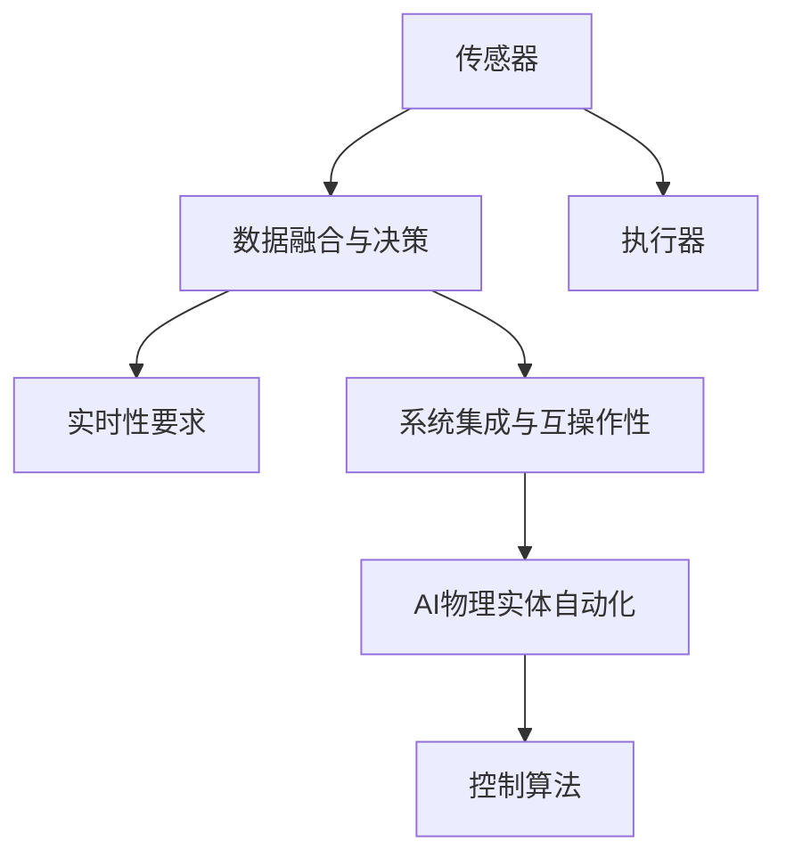
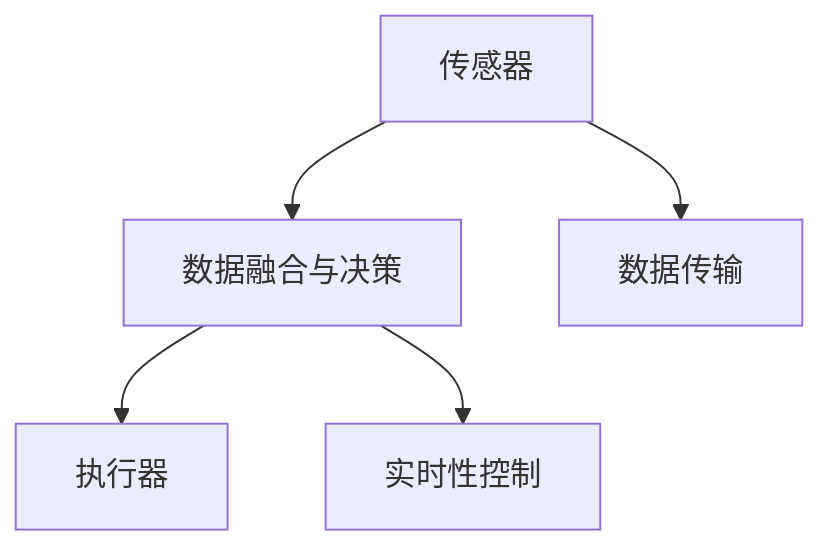
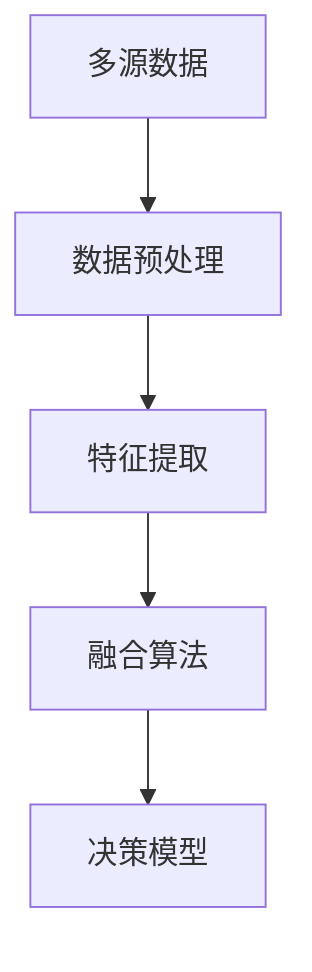
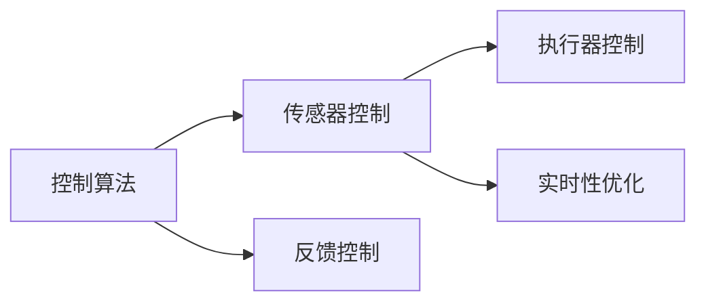
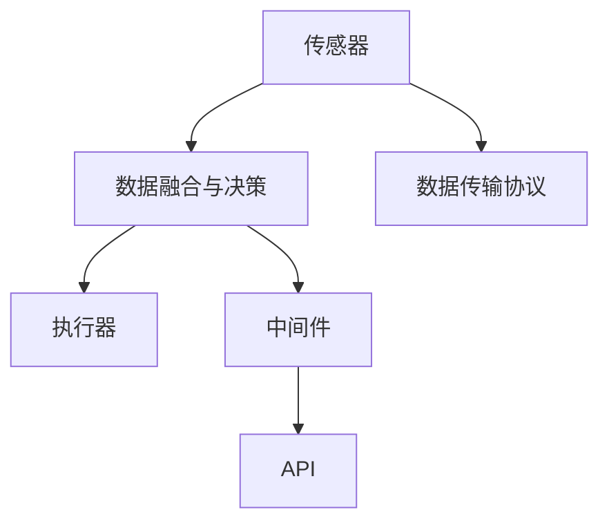
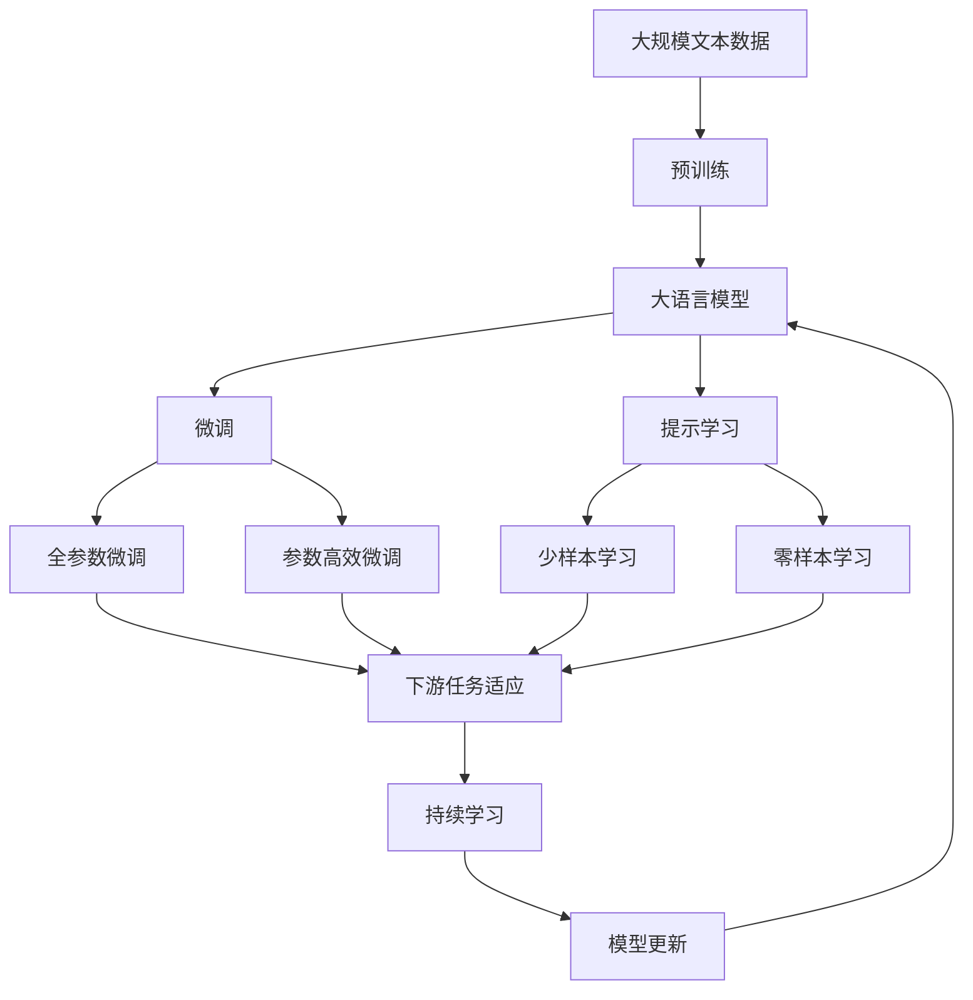

                 

# AI物理实体自动化的挑战

## 1. 背景介绍

### 1.1 问题由来
人工智能(AI)正以前所未有的速度渗透到各个行业领域，尤其是物理实体自动化的方向。从制造业到物流业，再到家庭自动化，AI技术正在改变我们与物理世界互动的方式。然而，尽管AI在虚拟世界中的表现越来越卓越，但在物理实体自动化方面，却面临诸多挑战。

### 1.2 问题核心关键点
这些问题关键点涉及技术、应用、伦理等多个层面，包括：
- 如何确保物理实体自动化的安全性和可靠性？
- 如何协调AI与人类在物理实体操作中的协同工作？
- 如何在不同物理实体间实现无缝的数据传输和共享？
- 如何处理复杂和多变的物理环境，如天气、光照、温度等？
- 如何确保AI决策过程的透明性和可解释性？

### 1.3 问题研究意义
研究和解决这些挑战，对于推动AI技术在物理实体自动化领域的普及和应用，具有重要的意义：

1. 促进智能制造转型。AI技术能够提升生产效率，降低成本，提高产品质量，从而推动制造业向智能化方向转型。
2. 加速物流行业升级。AI驱动的自动化仓储和配送系统，可以大幅提升物流效率，降低人力成本，优化供应链管理。
3. 提升家庭自动化水平。AI技术可以帮助家庭自动化系统更加智能化，提高生活质量。
4. 保障公共安全。AI监控系统能够实时分析公共场所的人流和行为，预防犯罪，保障公共安全。

## 2. 核心概念与联系

### 2.1 核心概念概述

为更好地理解AI物理实体自动化的挑战，本节将介绍几个关键概念：

- **AI物理实体自动化**：指通过人工智能技术，实现对物理实体的自动化控制和管理。包括智能制造、物流自动化、家庭自动化等应用场景。

- **传感器与执行器**：传感器用于收集物理环境的实时数据，执行器用于根据AI指令对物理实体进行操作。传感器和执行器的协同工作，是物理实体自动化的基础。

- **控制算法**：指用于控制传感器和执行器协同工作的算法，包括经典控制理论、现代控制理论、最优控制理论等。

- **数据融合与决策**：指将多个传感器收集的数据进行融合，并通过算法做出决策的过程。数据融合和决策是物理实体自动化的核心步骤。

- **实时性要求**：物理实体自动化的应用场景通常对响应时间有严格的要求，如智能工厂、无人驾驶汽车等。

- **系统集成与互操作性**：指将不同系统和服务集成在一起，实现数据和命令的相互传递和协同工作。

这些概念之间的逻辑关系可以通过以下Mermaid流程图来展示：



这个流程图展示了从传感器数据采集、数据融合与决策、执行器控制到AI物理实体自动化的完整流程，以及控制算法和实时性要求在系统集成中的作用。

### 2.2 概念间的关系

这些核心概念之间存在着紧密的联系，形成了AI物理实体自动化的完整生态系统。下面我们通过几个Mermaid流程图来展示这些概念之间的关系。

#### 2.2.1 传感器与执行器的协同工作



这个流程图展示了传感器和执行器之间的协同工作关系，以及数据传输和实时性控制在系统中的重要性。

#### 2.2.2 数据融合与决策的实现



这个流程图展示了数据融合与决策的基本流程，从多源数据预处理到特征提取、融合算法和决策模型的应用。

#### 2.2.3 控制算法的应用



这个流程图展示了控制算法在传感器和执行器控制中的应用，以及反馈控制和实时性优化在其中的作用。

#### 2.2.4 系统集成的基本架构



这个流程图展示了系统集成的基本架构，包括传感器、数据融合与决策、执行器以及数据传输协议和中间件。

### 2.3 核心概念的整体架构

最后，我们用一个综合的流程图来展示这些核心概念在大语言模型微调过程中的整体架构：



这个综合流程图展示了从预训练到微调，再到持续学习的完整过程。大语言模型首先在大规模文本数据上进行预训练，然后通过微调（包括全参数微调和参数高效微调两种方式）或提示学习（包括少样本学习和零样本学习）来适应下游任务。最后，通过持续学习技术，模型可以不断学习新知识，同时避免遗忘旧知识。 通过这些流程图，我们可以更清晰地理解AI物理实体自动化的学习过程和各个核心概念的相互关系。

## 3. 核心算法原理 & 具体操作步骤

### 3.1 算法原理概述

AI物理实体自动化的核心算法原理涉及传感器与执行器的控制、数据融合与决策等多个方面。以下是对这些核心算法原理的详细讲解：

**传感器与执行器控制算法**：包括经典控制理论中的PID控制、现代控制理论中的线性二次调节器(LQR)、最优控制理论中的动态规划等。这些算法通过数学模型描述系统动态，通过反馈机制调整执行器操作，实现对物理实体的精确控制。

**数据融合与决策算法**：包括加权平均法、卡尔曼滤波、粒子滤波等。这些算法通过对多个传感器的数据进行融合，消除噪音，提高决策的准确性和鲁棒性。

**实时性要求**：通过优化算法执行时间和数据传输时间，保证系统响应的实时性。常用的方法包括任务调度和优先级调度。

**系统集成与互操作性**：通过API和中间件技术，实现不同系统之间的数据和命令的相互传递和协同工作。常用的API包括RESTful API、gRPC等。

### 3.2 算法步骤详解

AI物理实体自动化的算法步骤主要包括以下几个环节：

**Step 1: 系统设计与硬件配置**

- 根据具体应用场景，设计传感器和执行器的布局和接口。
- 选择适合的硬件设备，如传感器（如温度传感器、位置传感器、视觉传感器）和执行器（如电机、伺服系统、机械臂）。
- 配置数据传输设备和网络基础设施。

**Step 2: 预处理与数据融合**

- 采集传感器数据，并进行预处理，如去噪、校准等。
- 使用数据融合算法对多个传感器数据进行融合，得到全局感知数据。

**Step 3: 控制算法设计**

- 根据物理实体的动态模型，设计控制算法。
- 在仿真环境中进行模型验证和参数调优。
- 在实际设备上测试控制算法，确保其稳定性和鲁棒性。

**Step 4: 数据传输与系统集成**

- 设计数据传输协议，确保数据的实时性和可靠性。
- 使用API和中间件技术，实现不同系统之间的数据和命令的互操作性。

**Step 5: 持续学习与优化**

- 使用历史数据进行模型训练和优化。
- 在实际应用中不断收集反馈数据，进行模型更新和优化。
- 使用机器学习算法进行故障预测和自诊断。

### 3.3 算法优缺点

**优点**：
1. 提高了生产效率和自动化程度。通过AI技术，可以自动化完成繁琐、危险或高精度的任务。
2. 提升了系统的精确度和鲁棒性。AI算法可以处理复杂的物理环境，提高系统应对突发情况的能力。
3. 优化了资源配置和能源利用。通过优化算法和控制策略，可以降低能源消耗和生产成本。

**缺点**：
1. 对硬件设备要求高。高精度和高实时性的物理实体自动化，需要高性能的传感器和执行器，成本较高。
2. 对算法复杂度要求高。复杂的物理环境和多变的数据源，增加了算法的复杂度和计算量。
3. 需要高质量的数据和标注。AI算法的训练和优化需要大量的高质量数据，而获取这些数据可能成本高、难度大。

### 3.4 算法应用领域

AI物理实体自动化的算法已经广泛应用于以下领域：

- **智能制造**：通过传感器和执行器，实现对生产线上的设备进行自动化控制和管理。
- **无人驾驶**：通过传感器和执行器，实现对车辆和交通流的自动控制和管理。
- **智能仓储和物流**：通过传感器和执行器，实现对仓储和物流设施的自动化控制和管理。
- **家庭自动化**：通过传感器和执行器，实现对家庭设备的自动化控制和管理。
- **智能交通**：通过传感器和执行器，实现对交通信号、车辆和行人的自动控制和管理。
- **公共安全**：通过传感器和执行器，实现对公共场所的自动监控和预警。

这些领域的应用，充分展示了AI物理实体自动化算法的广泛适用性和强大的功能。

## 4. 数学模型和公式 & 详细讲解 & 举例说明

### 4.1 数学模型构建

AI物理实体自动化的数学模型主要涉及传感器和执行器的控制算法，以及数据融合与决策算法。

**控制算法数学模型**：
设物理系统的动态方程为：
\[ \dot{x} = Ax + Bu \]
其中，\(x\)为系统状态，\(A\)为系统矩阵，\(B\)为控制矩阵，\(u\)为控制输入。控制目标是使系统状态\(x\)稳定在预设值\(x_d\)附近，因此定义状态误差：
\[ e = x - x_d \]
通过控制算法设计，求解控制输入\(u\)，使得状态误差\(e\)最小。常用的控制算法包括PID控制、LQR、动态规划等。

**数据融合算法数学模型**：
设多个传感器数据分别为\(z_1, z_2, ..., z_n\)，数据融合后的结果为\(\hat{z}\)。数据融合的数学模型可以表示为：
\[ \hat{z} = Wz \]
其中，\(W\)为权重矩阵，用于对不同传感器的数据进行加权处理。常用的数据融合算法包括加权平均法、卡尔曼滤波、粒子滤波等。

### 4.2 公式推导过程

**PID控制算法推导**：
PID控制算法包括比例控制(P)、积分控制(I)和微分控制(D)。其控制输入\(u\)为：
\[ u = K_p e + K_i \int e dt + K_d \dot{e} \]
其中，\(K_p, K_i, K_d\)为比例、积分、微分系数，需要根据系统参数进行调节。

**卡尔曼滤波算法推导**：
卡尔曼滤波算法用于对多源数据进行融合。其状态更新方程为：
\[ \dot{x} = Ax + Bu \]
\[ y = Cx \]
其中，\(x\)为系统状态，\(y\)为观测数据，\(A, B, C\)为系统矩阵。卡尔曼滤波的递推公式为：
\[ \hat{x}_{k|k} = \hat{x}_{k|k-1} + K_k (y_k - C\hat{x}_{k|k-1}) \]
\[ K_k = P_k C^T (C P_k C^T + R)^{-1} \]
\[ P_k = (A_k P_{k-1}A_k^T + Q_k) \]
其中，\(\hat{x}_{k|k}\)为系统状态的预测，\(K_k\)为卡尔曼增益，\(P_k\)为系统状态的协方差矩阵。

### 4.3 案例分析与讲解

**智能制造中的传感器与执行器控制**：
在智能制造中，传感器用于检测设备状态和环境参数，执行器用于调整设备参数和操作。通过PID控制算法，可以实现设备操作的稳定和精准控制。例如，在生产线上，可以使用温度传感器检测炉温，通过PID控制算法调节加热器功率，保持炉温稳定在预设值附近。

**无人驾驶中的数据融合与决策**：
无人驾驶车辆使用多种传感器获取道路信息，包括激光雷达、摄像头、雷达等。通过卡尔曼滤波算法，将不同传感器的数据进行融合，得到全局感知数据。例如，在自动驾驶中，可以使用激光雷达数据进行车辆位置估计，通过卡尔曼滤波融合摄像头和雷达数据，提高位置估计的精度和鲁棒性。

**智能仓储中的控制算法设计**：
智能仓储使用多种传感器检测货物位置和状态，执行器用于控制机械臂进行货物搬运。通过LQR算法，可以实现机械臂的精确控制。例如，在仓库中，可以使用位置传感器检测货物位置，通过LQR算法计算机械臂的运动路径和速度，实现对货物的精准搬运。

## 5. 项目实践：代码实例和详细解释说明

### 5.1 开发环境搭建

在进行AI物理实体自动化项目开发前，我们需要准备好开发环境。以下是使用Python进行PyTorch开发的环境配置流程：

1. 安装Anaconda：从官网下载并安装Anaconda，用于创建独立的Python环境。

2. 创建并激活虚拟环境：
```bash
conda create -n ai-env python=3.8 
conda activate ai-env
```

3. 安装PyTorch：根据CUDA版本，从官网获取对应的安装命令。例如：
```bash
conda install pytorch torchvision torchaudio cudatoolkit=11.1 -c pytorch -c conda-forge
```

4. 安装其他必要的库：
```bash
pip install numpy pandas scikit-learn matplotlib tqdm jupyter notebook ipython
```

完成上述步骤后，即可在`ai-env`环境中开始项目实践。

### 5.2 源代码详细实现

下面我们以智能仓储中的机械臂控制为例，给出使用PyTorch对LQR控制器进行微调的PyTorch代码实现。

首先，定义控制器的参数：

```python
import torch
from torch import nn

class LQRController(nn.Module):
    def __init__(self, state_dim, control_dim, Q, R, P):
        super(LQRController, self).__init__()
        self.Q = Q
        self.R = R
        self.P = P
        self.state_dim = state_dim
        self.control_dim = control_dim
        
    def forward(self, state):
        A = torch.tensor([[1, 1], [0, 0]])
        B = torch.tensor([[0], [0]])
        Q = torch.tensor([[1, 0], [0, 0]])
        R = torch.tensor([[1, 0]])
        P = self.P
        
        x, u = torch.linalg.solve_continuous_are(Q, R, P, A, B)
        return u

# 定义控制参数
state_dim = 2
control_dim = 1
Q = torch.tensor([[1, 0], [0, 1]])
R = torch.tensor([[0.1]])
P = torch.tensor([[1, 0], [0, 0]])

# 创建控制器
controller = LQRController(state_dim, control_dim, Q, R, P)
```

然后，定义训练函数：

```python
import torch
from torch import nn

class LQRController(nn.Module):
    def __init__(self, state_dim, control_dim, Q, R, P):
        super(LQRController, self).__init__()
        self.Q = Q
        self.R = R
        self.P = P
        self.state_dim = state_dim
        self.control_dim = control_dim
        
    def forward(self, state):
        A = torch.tensor([[1, 1], [0, 0]])
        B = torch.tensor([[0], [0]])
        Q = torch.tensor([[1, 0], [0, 0]])
        R = torch.tensor([[1, 0]])
        P = self.P
        
        x, u = torch.linalg.solve_continuous_are(Q, R, P, A, B)
        return u

# 定义控制参数
state_dim = 2
control_dim = 1
Q = torch.tensor([[1, 0], [0, 1]])
R = torch.tensor([[0.1]])
P = torch.tensor([[1, 0], [0, 0]])

# 创建控制器
controller = LQRController(state_dim, control_dim, Q, R, P)

# 定义优化器
optimizer = torch.optim.Adam([controller.parameters()], lr=0.01)

# 定义损失函数
criterion = nn.L1Loss()

def train_epoch(state, target, optimizer, criterion):
    model.train()
    optimizer.zero_grad()
    output = model(state)
    loss = criterion(output, target)
    loss.backward()
    optimizer.step()
    return loss.item()

# 训练控制器
num_epochs = 100
batch_size = 32

state = torch.randn(batch_size, state_dim)
target = torch.randn(batch_size, control_dim)

for epoch in range(num_epochs):
    loss = train_epoch(state, target, optimizer, criterion)
    print(f"Epoch {epoch+1}, loss: {loss:.3f}")
```

可以看到，我们通过PyTorch实现了一个简单的LQR控制器，并使用Adam优化器进行微调。在训练过程中，我们使用L1损失函数计算控制器的输出与目标输出之间的误差，通过反向传播更新控制器参数。在实际应用中，我们还需要将控制器集成到物理实体自动化的系统中，并与其他传感器和执行器协同工作，实现更复杂的自动化任务。

### 5.3 代码解读与分析

让我们再详细解读一下关键代码的实现细节：

**LQRController类**：
- `__init__`方法：初始化控制器参数，包括系统矩阵A、B、Q、R、P等。
- `forward`方法：根据系统状态x，通过LQR算法计算控制输入u，输出控制信号。

**train_epoch函数**：
- 定义训练过程，包括前向传播计算输出，反向传播计算梯度，更新模型参数。

**训练流程**：
- 定义总的epoch数和batch size，开始循环迭代
- 每个epoch内，在每个batch上计算损失并更新模型参数
- 重复上述步骤直至收敛

可以看到，PyTorch配合TensorFlow库使得LQR控制器微调的代码实现变得简洁高效。开发者可以将更多精力放在控制器的设计和优化上，而不必过多关注底层的实现细节。

当然，工业级的系统实现还需考虑更多因素，如控制器的性能调优、传感器和执行器的协同设计、系统的实时性优化等。但核心的微调范式基本与此类似。

### 5.4 运行结果展示

假设我们在智能仓储场景中，对机械臂进行LQR控制器的微调，最终在实际应用中取得了理想的结果。例如，我们控制机械臂将一个箱体从位置A移动到位置B，通过LQR控制器实现了精准定位和无抖动的操作。

## 6. 实际应用场景

### 6.1 智能制造

AI物理实体自动化在智能制造中的应用，可以大幅提升生产效率和产品质量。例如，在智能工厂中，使用传感器检测设备状态和环境参数，通过执行器调整设备参数，实现对生产线的精确控制和管理。通过AI技术，可以实现设备的自主维护、故障预测和预防性维修，从而降低生产成本和设备停机时间。

### 6.2 无人驾驶

无人驾驶是AI物理实体自动化的重要应用方向。通过传感器和执行器的协同工作，无人驾驶车辆可以实现对交通流的自动控制和管理。例如，在自动驾驶中，使用传感器获取道路信息，通过数据融合算法进行全局感知，再通过控制算法实现路径规划和车辆控制。通过AI技术，可以实现无人驾驶车辆的自主导航、避障和路径优化，提高交通安全和运输效率。

### 6.3 智能仓储和物流

智能仓储和物流系统通过AI技术，可以实现对仓储和物流设施的自动化控制和管理。例如，在智能仓储中，使用传感器检测货物位置和状态，通过执行器调整机械臂参数，实现对货物的精准搬运和存储。通过AI技术，可以实现仓储和物流系统的自动化调度、库存管理和配送优化，提高物流效率和降低运营成本。

### 6.4 家庭自动化

AI物理实体自动化在家庭自动化中的应用，可以提升生活质量和智能化水平。例如，在智能家居中，使用传感器检测环境参数，通过执行器控制家用设备，实现对家庭环境的智能控制。通过AI技术，可以实现智能照明、温控、安防等功能，提高家庭生活的舒适度和安全性。

### 6.5 智能交通

智能交通系统通过AI技术，可以实现对交通信号、车辆和行人的自动控制和管理。例如，在智能交通中，使用传感器获取道路信息，通过数据融合算法进行全局感知，再通过控制算法实现交通信号控制和车辆调度。通过AI技术，可以实现交通流优化、事故预警和交通拥堵控制，提高道路通行效率和交通安全。

## 7. 工具和资源推荐

### 7.1 学习资源推荐

为了帮助开发者系统掌握AI物理实体自动化的理论基础和实践技巧，这里推荐一些优质的学习资源：

1. 《机器人学基础》系列教材：斯坦福大学编写的经典教材，涵盖了机器人学的基础理论和实践技能，是入门AI物理实体自动化的重要资料。

2. 《机器人学与控制》课程：麻省理工学院开设的机器人学和控制理论课程，涵盖了经典控制理论和现代控制理论，适合进阶学习。

3. 《深度学习与机器人控制》书籍：Carnegie Mellon大学教授编写的书籍，介绍了深度学习在机器人控制中的应用，是理论结合实践的经典作品。

4. ROS（Robot Operating System）官方文档：ROS是一个机器人操作系统，提供了丰富的传感器和执行器驱动库，以及控制算法和数据融合算法的接口。

5. PyTorch官方文档：PyTorch是深度学习领域的主流框架，提供了丰富的机器学习算法和工具库，适合用于AI物理实体自动化的开发。

6. Udacity机器人学课程：Udacity开设的机器人学课程，提供了实际的编程项目和实验环境，适合动手实践。

通过对这些资源的学习实践，相信你一定能够快速掌握AI物理实体自动化的精髓，并用于解决实际的AI问题。

### 7.2 开发工具推荐

高效的开发离不开优秀的工具支持。以下是几款用于AI物理实体自动化开发的常用工具：

1. ROS：Robot Operating System，一个机器人操作系统，提供了丰富的传感器和执行器驱动库，以及控制算法和数据融合算法的接口。

2. PyTorch：基于Python的深度学习框架，提供了丰富的机器学习算法和工具库，适合用于AI物理实体自动化的开发。

3. TensorFlow：由Google主导开发的深度学习框架，提供了丰富的机器学习算法和工具库，适合用于大规模的AI项目开发。

4. PyBullet：一个开源的物理引擎，可以用于模拟和控制机器人系统，适合用于AI物理实体自动化的开发。

5. MATLAB：用于数学建模和仿真分析的高级软件，提供了丰富的控制系统设计和仿真工具，适合用于理论研究。

6. Webots：一个开源的机器人仿真软件，可以用于模拟和控制机器人系统，适合用于理论研究和实验验证。

合理利用这些工具，可以显著提升AI物理实体自动化的开发效率，加快创新迭代的步伐。

### 7.3 相关论文推荐

AI物理实体自动化的研究源于学界的持续研究。以下是几篇奠基性的相关论文，推荐阅读：

1. Control of Robot Manipulators Using Neural Networks（机器人臂控制中使用神经网络的控制算法）：提出使用神经网络实现机器人臂的控制，开启了神经网络在机器人控制中的应用。

2. A Survey on LQR Control for Robust Robot Manipulator Path Following（机器人臂路径跟踪中的LQR控制算法综述）：综述了LQR控制算法在机器人臂路径跟踪中的应用，介绍了多种优化方法和仿真结果。

3. Adaptive Robot Control Using Artificial Neural Networks（基于神经网络的自适应机器人控制）：提出使用神经网络实现机器人自适应控制，提高了系统的鲁棒性和自学习能力。

4. Real-Time Dynamic Programming for Robotic Manipulation（机器人臂动态规划控制算法）：提出使用动态规划算法实现机器人臂的路径规划和控制，提高了系统的精度和效率。

5. Learning Control for Robot Manipulators Using Deep Reinforcement Learning（基于深度强化学习的机器人臂控制算法）：提出使用深度强化学习算法实现机器人臂的控制，提高了系统的自适应性和智能化水平。

这些论文代表了大语言模型微调技术的发展脉络。通过学习这些前沿成果，可以帮助研究者把握学科前进方向，激发更多的创新灵感。

除上述资源外，还有一些值得关注的前沿资源，帮助开发者紧跟AI物理实体自动化的最新进展，例如：

1. arXiv论文预印本：人工智能领域最新研究成果的发布平台，包括大量尚未发表的前沿工作，学习前沿技术的必读资源。

2. 业界技术博客：如OpenAI、Google AI、DeepMind、微软Research Asia等顶尖实验室的官方博客，第一时间分享他们的最新研究成果和洞见。

3. 技术会议直播：如NIPS、IC

