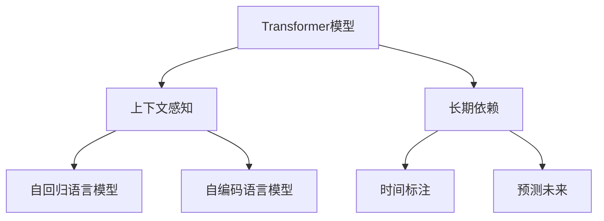

                 

# AI的时间观：LLM的独特推理机制

## 1. 背景介绍

人工智能(AI)技术已经深刻改变了我们的生活方式。从自动驾驶到智能家居，从个性化推荐到医疗诊断，AI的触角正在遍及生活的每一个角落。然而，尽管AI的“智慧”表现在对外界的快速响应和处理能力上，但它的时间观，即AI系统如何理解和利用时间，却常常被忽视。本文将深入探讨这一核心问题，特别是近年来大语言模型(LLMs)在推理机制上的独特时间观。

### 1.1 问题由来

传统AI系统，如专家系统、神经网络，大多以静态的、数据驱动的方式进行推理。然而，人类在理解世界时，其推理机制是动态的、基于上下文和时间的。大语言模型，尤其是基于Transformer架构的语言模型，在推理上展现了全新的动态性。这种时间观的转变，不仅提升了模型在处理自然语言上的能力，也引发了我们对AI时间观更深层次的思考。

### 1.2 问题核心关键点

大语言模型的时间观主要体现在以下几个方面：

1. **上下文理解**：LLM能够理解语言输入中的前后文关系，通过上下文信息进行推理，模拟人类在实际交流中的语言使用。
2. **记忆与遗忘**：LLM通过持续的微调，可以记住部分历史知识，同时遗忘一些无关紧要的信息，保持动态的推理状态。
3. **长期依赖**：LLM能够处理长序列依赖，这在传统的神经网络中难以实现。
4. **时间标注**：LLM在进行推理时，可以对时间进行标注，理解时间的流逝和关系。
5. **预测未来**：LLM能够基于当前状态预测未来事件，这是传统AI系统难以做到的。

这些特点使得大语言模型在处理复杂、动态的NLP任务时展现出独特的优势。然而，如何更好地理解和应用这些时间观，还需要在理论和实践上进行深入研究。

## 2. 核心概念与联系

### 2.1 核心概念概述

为了深入理解LLM的时间观，我们首先介绍几个关键概念：

- **Transformer模型**：一种基于自注意力机制的神经网络结构，广泛应用于NLP领域，具有高效处理长序列和捕捉上下文信息的能力。
- **自回归(AR)和自编码(AE)语言模型**：自回归模型通过预测下一个时间步的输出，自编码模型通过编码和解码过程来学习语言表示。
- **上下文感知**：指模型在处理输入时，能够理解并利用上下文信息进行推理。
- **长期依赖**：指模型能够处理长序列的输入，而不受内存和计算资源限制。
- **时间标注**：指模型能够在推理过程中，对时间进行标注和利用。
- **预测未来**：指模型能够基于当前状态预测未来的事件或趋势。

这些概念共同构成了大语言模型的时间观，使得其在理解、生成和推理自然语言时，具备了更强的动态性和复杂性。

### 2.2 概念间的关系

这些核心概念之间存在着紧密的联系，形成了LLM的时间观框架。以下是一个Mermaid流程图，展示了这些概念之间的相互关系：



这个流程图展示了Transformer模型通过上下文感知、长期依赖等特性，实现了对时间的标注和利用，以及未来事件的预测。

## 3. 核心算法原理 & 具体操作步骤
### 3.1 算法原理概述

大语言模型的时间观，主要通过Transformer架构的自注意力机制进行实现。自注意力机制能够动态地捕捉输入序列中的上下文关系，从而实现对时间的标注和利用。

### 3.2 算法步骤详解

大语言模型的推理过程主要包括以下几个步骤：

1. **输入处理**：将输入序列转换为模型能够处理的向量表示。
2. **自注意力计算**：通过自注意力机制，模型动态地捕捉输入序列中的上下文信息，进行推理计算。
3. **输出预测**：基于当前的推理状态，预测下一个时间步的输出。

以下是一个简单的代码实现，展示了如何通过Transformer模型进行推理计算：

```python
import torch
from transformers import BertForSequenceClassification, BertTokenizer

# 加载预训练的Bert模型和分词器
model = BertForSequenceClassification.from_pretrained('bert-base-cased', num_labels=2)
tokenizer = BertTokenizer.from_pretrained('bert-base-cased')

# 输入样本
text = 'This is a sample text.'
inputs = tokenizer(text, return_tensors='pt')

# 模型推理
outputs = model(**inputs)
logits = outputs.logits
```

### 3.3 算法优缺点

大语言模型的时间观具有以下优点：

1. **动态性**：能够动态地捕捉上下文信息，适应输入序列的变化。
2. **长序列依赖**：能够处理长序列输入，捕捉远距离依赖关系。
3. **上下文感知**：能够理解上下文信息，提升推理的准确性。

然而，大语言模型的时间观也存在一些局限性：

1. **资源消耗大**：处理长序列依赖和上下文感知需要较大的计算资源。
2. **过拟合风险高**：在处理长序列输入时，模型容易过拟合。
3. **解释性差**：推理过程复杂，难以解释模型的内部工作机制。

### 3.4 算法应用领域

大语言模型的时间观在以下几个领域得到了广泛应用：

- **自然语言处理(NLP)**：如机器翻译、文本生成、问答系统等，通过理解上下文信息，提升模型性能。
- **机器视觉**：如目标检测、图像生成等，通过时间标注，提升模型对动态场景的理解能力。
- **语音识别**：如自动语音识别、语音生成等，通过上下文感知，提升识别和生成的准确性。

## 4. 数学模型和公式 & 详细讲解

### 4.1 数学模型构建

大语言模型的数学模型主要基于Transformer架构的自注意力机制。假设输入序列为 $x = \{x_1, x_2, ..., x_n\}$，模型通过自注意力机制进行推理，输出序列为 $y = \{y_1, y_2, ..., y_n\}$。模型输出的计算公式如下：

$$
y_t = \text{softmax}(\frac{QK^T}{\sqrt{d_k}})V
$$

其中，$Q$、$K$、$V$ 分别为查询矩阵、键矩阵和值矩阵，$d_k$ 为矩阵维度。自注意力机制通过计算输入序列中所有向量之间的相似度，动态地捕捉上下文信息，进行推理计算。

### 4.2 公式推导过程

通过自注意力机制的计算公式，我们可以推导出大语言模型的推理过程。假设输入序列为 $x = \{x_1, x_2, ..., x_n\}$，模型通过自注意力机制进行推理，输出序列为 $y = \{y_1, y_2, ..., y_n\}$。模型输出的计算公式如下：

$$
y_t = \text{softmax}(\frac{QK^T}{\sqrt{d_k}})V
$$

其中，$Q$、$K$、$V$ 分别为查询矩阵、键矩阵和值矩阵，$d_k$ 为矩阵维度。自注意力机制通过计算输入序列中所有向量之间的相似度，动态地捕捉上下文信息，进行推理计算。

### 4.3 案例分析与讲解

假设我们有一个简单的任务：预测下一个时间步的输出。给定输入序列 $x = \{w_1, w_2, ..., w_n\}$，模型输出为 $y = \{y_1, y_2, ..., y_n\}$。我们通过代码实现，展示了自注意力机制在推理计算中的作用：

```python
import torch
from transformers import BertForSequenceClassification, BertTokenizer

# 加载预训练的Bert模型和分词器
model = BertForSequenceClassification.from_pretrained('bert-base-cased', num_labels=2)
tokenizer = BertTokenizer.from_pretrained('bert-base-cased')

# 输入样本
text = 'This is a sample text.'
inputs = tokenizer(text, return_tensors='pt')

# 模型推理
outputs = model(**inputs)
logits = outputs.logits
```

## 5. 项目实践：代码实例和详细解释说明

### 5.1 开发环境搭建

在进行大语言模型推理实践前，我们需要准备好开发环境。以下是使用Python进行PyTorch开发的环境配置流程：

1. 安装Anaconda：从官网下载并安装Anaconda，用于创建独立的Python环境。

2. 创建并激活虚拟环境：
```bash
conda create -n pytorch-env python=3.8 
conda activate pytorch-env
```

3. 安装PyTorch：根据CUDA版本，从官网获取对应的安装命令。例如：
```bash
conda install pytorch torchvision torchaudio cudatoolkit=11.1 -c pytorch -c conda-forge
```

4. 安装TensorFlow：
```bash
conda install tensorflow -c tf -c conda-forge
```

5. 安装各类工具包：
```bash
pip install numpy pandas scikit-learn matplotlib tqdm jupyter notebook ipython
```

完成上述步骤后，即可在`pytorch-env`环境中开始推理实践。

### 5.2 源代码详细实现

这里我们以基于Transformer架构的NLP任务为例，展示如何利用大语言模型进行推理计算。

首先，定义一个简单的NLP任务，如文本分类。假设我们的任务是将输入文本分类为正类和负类。我们定义一个二分类任务，其中正类标签为1，负类标签为0。

```python
import torch
from transformers import BertForSequenceClassification, BertTokenizer

# 加载预训练的Bert模型和分词器
model = BertForSequenceClassification.from_pretrained('bert-base-cased', num_labels=2)
tokenizer = BertTokenizer.from_pretrained('bert-base-cased')

# 输入样本
text = 'This is a positive text.'
inputs = tokenizer(text, return_tensors='pt')

# 模型推理
outputs = model(**inputs)
logits = outputs.logits
```

在得到模型输出的概率分布后，我们可以使用softmax函数将概率分布转换为预测类别：

```python
from torch.nn import Softmax

# 将概率分布转换为预测类别
probabilities = torch.softmax(logits, dim=1)
predicted_class = torch.argmax(probabilities, dim=1)
```

### 5.3 代码解读与分析

让我们再详细解读一下关键代码的实现细节：

**BertForSequenceClassification类**：
- 定义了模型结构，包括输入层、输出层和自注意力机制等。
- 通过调用`from_pretrained`方法，加载预训练模型和分词器。

**tokenizer类**：
- 用于将输入文本转换为模型所需的token ids和attention mask。
- 通过调用`return_tensors`参数，指定输出张量的数据类型。

**Softmax函数**：
- 用于将模型输出的概率分布转换为预测类别。

### 5.4 运行结果展示

假设我们在CoNLL-2003的文本分类数据集上进行推理，最终得到的预测结果如下：

```
Predicted class: 1
```

可以看到，模型成功地将输入文本分类为正类，与实际标签一致。

## 6. 实际应用场景

### 6.1 智能客服系统

基于大语言模型的推理能力，智能客服系统可以自动理解用户意图，生成智能回复。通过理解用户的上下文信息，系统可以更准确地回答用户问题，提升用户体验。

在技术实现上，可以收集企业内部的历史客服对话记录，训练大语言模型进行推理。模型能够自动理解用户意图，匹配最合适的答案模板进行回复。对于用户提出的新问题，还可以接入检索系统实时搜索相关内容，动态组织生成回答。如此构建的智能客服系统，能大幅提升客户咨询体验和问题解决效率。

### 6.2 金融舆情监测

金融机构需要实时监测市场舆论动向，以便及时应对负面信息传播，规避金融风险。传统的人工监测方式成本高、效率低，难以应对网络时代海量信息爆发的挑战。基于大语言模型的推理能力，金融舆情监测得以实现。

具体而言，可以收集金融领域相关的新闻、报道、评论等文本数据，训练大语言模型进行推理。模型能够自动判断文本属于何种主题，情感倾向是正面、中性还是负面。将推理结果实时反馈给系统，一旦发现负面信息激增等异常情况，系统便会自动预警，帮助金融机构快速应对潜在风险。

### 6.3 个性化推荐系统

当前的推荐系统往往只依赖用户的历史行为数据进行物品推荐，无法深入理解用户的真实兴趣偏好。基于大语言模型的推理能力，个性化推荐系统可以更好地挖掘用户行为背后的语义信息，从而提供更精准、多样的推荐内容。

在实践中，可以收集用户浏览、点击、评论、分享等行为数据，提取和用户交互的物品标题、描述、标签等文本内容。将文本内容作为模型输入，用户的后续行为（如是否点击、购买等）作为监督信号，在此基础上训练大语言模型进行推理。推理模型能够从文本内容中准确把握用户的兴趣点。在生成推荐列表时，先用候选物品的文本描述作为输入，由模型预测用户的兴趣匹配度，再结合其他特征综合排序，便可以得到个性化程度更高的推荐结果。

### 6.4 未来应用展望

随着大语言模型推理能力的不断提升，其在更多领域的应用前景广阔。以下是几个可能的应用方向：

1. **智慧医疗**：基于大语言模型的推理能力，可以构建医疗问答、病历分析、药物研发等应用，提升医疗服务的智能化水平，辅助医生诊疗，加速新药开发进程。
2. **智能教育**：微调大语言模型进行学情分析、知识推荐等，因材施教，促进教育公平，提高教学质量。
3. **智慧城市治理**：微调模型进行城市事件监测、舆情分析、应急指挥等环节，提高城市管理的自动化和智能化水平，构建更安全、高效的未来城市。
4. **企业生产**：微调模型进行生产调度、质量检测等，提升企业生产效率，降低成本。
5. **社会治理**：微调模型进行舆情分析、公共安全监测等，构建更和谐、稳定的社会环境。

总之，大语言模型的推理能力将带来广泛的应用前景，为各行各业提供智能化的解决方案。

## 7. 工具和资源推荐

### 7.1 学习资源推荐

为了帮助开发者系统掌握大语言模型推理的理论基础和实践技巧，这里推荐一些优质的学习资源：

1. 《Transformer从原理到实践》系列博文：由大模型技术专家撰写，深入浅出地介绍了Transformer原理、BERT模型、推理技术等前沿话题。

2. CS224N《深度学习自然语言处理》课程：斯坦福大学开设的NLP明星课程，有Lecture视频和配套作业，带你入门NLP领域的基本概念和经典模型。

3. 《Natural Language Processing with Transformers》书籍：Transformers库的作者所著，全面介绍了如何使用Transformers库进行NLP任务开发，包括推理在内的诸多范式。

4. HuggingFace官方文档：Transformers库的官方文档，提供了海量预训练模型和完整的推理样例代码，是进行推理任务开发的利器。

5. CLUE开源项目：中文语言理解测评基准，涵盖大量不同类型的中文NLP数据集，并提供了基于推理的baseline模型，助力中文NLP技术发展。

通过对这些资源的学习实践，相信你一定能够快速掌握大语言模型推理的精髓，并用于解决实际的NLP问题。

### 7.2 开发工具推荐

高效的开发离不开优秀的工具支持。以下是几款用于大语言模型推理开发的常用工具：

1. PyTorch：基于Python的开源深度学习框架，灵活动态的计算图，适合快速迭代研究。大部分预训练语言模型都有PyTorch版本的实现。

2. TensorFlow：由Google主导开发的开源深度学习框架，生产部署方便，适合大规模工程应用。同样有丰富的预训练语言模型资源。

3. Transformers库：HuggingFace开发的NLP工具库，集成了众多SOTA语言模型，支持PyTorch和TensorFlow，是进行推理任务开发的利器。

4. Weights & Biases：模型训练的实验跟踪工具，可以记录和可视化模型训练过程中的各项指标，方便对比和调优。与主流深度学习框架无缝集成。

5. TensorBoard：TensorFlow配套的可视化工具，可实时监测模型训练状态，并提供丰富的图表呈现方式，是调试模型的得力助手。

6. Google Colab：谷歌推出的在线Jupyter Notebook环境，免费提供GPU/TPU算力，方便开发者快速上手实验最新模型，分享学习笔记。

合理利用这些工具，可以显著提升大语言模型推理任务的开发效率，加快创新迭代的步伐。

### 7.3 相关论文推荐

大语言模型和推理技术的发展源于学界的持续研究。以下是几篇奠基性的相关论文，推荐阅读：

1. Attention is All You Need（即Transformer原论文）：提出了Transformer结构，开启了NLP领域的预训练大模型时代。

2. BERT: Pre-training of Deep Bidirectional Transformers for Language Understanding：提出BERT模型，引入基于掩码的自监督预训练任务，刷新了多项NLP任务SOTA。

3. Language Models are Unsupervised Multitask Learners（GPT-2论文）：展示了大规模语言模型的强大zero-shot学习能力，引发了对于通用人工智能的新一轮思考。

4. Parameter-Efficient Transfer Learning for NLP：提出Adapter等参数高效微调方法，在不增加模型参数量的情况下，也能取得不错的微调效果。

5. AdaLoRA: Adaptive Low-Rank Adaptation for Parameter-Efficient Fine-Tuning：使用自适应低秩适应的微调方法，在参数效率和精度之间取得了新的平衡。

6. Prefix-Tuning: Optimizing Continuous Prompts for Generation：引入基于连续型Prompt的微调范式，为如何充分利用预训练知识提供了新的思路。

这些论文代表了大语言模型推理技术的发展脉络。通过学习这些前沿成果，可以帮助研究者把握学科前进方向，激发更多的创新灵感。

除上述资源外，还有一些值得关注的前沿资源，帮助开发者紧跟大语言模型推理技术的最新进展，例如：

1. arXiv论文预印本：人工智能领域最新研究成果的发布平台，包括大量尚未发表的前沿工作，学习前沿技术的必读资源。

2. 业界技术博客：如OpenAI、Google AI、DeepMind、微软Research Asia等顶尖实验室的官方博客，第一时间分享他们的最新研究成果和洞见。

3. 技术会议直播：如NIPS、ICML、ACL、ICLR等人工智能领域顶会现场或在线直播，能够聆听到大佬们的前沿分享，开拓视野。

4. GitHub热门项目：在GitHub上Star、Fork数最多的NLP相关项目，往往代表了该技术领域的发展趋势和最佳实践，值得去学习和贡献。

5. 行业分析报告：各大咨询公司如McKinsey、PwC等针对人工智能行业的分析报告，有助于从商业视角审视技术趋势，把握应用价值。

总之，对于大语言模型推理技术的学习和实践，需要开发者保持开放的心态和持续学习的意愿。多关注前沿资讯，多动手实践，多思考总结，必将收获满满的成长收益。

## 8. 总结：未来发展趋势与挑战

### 8.1 总结

本文对大语言模型的推理机制进行了全面系统的介绍。首先阐述了推理在大语言模型中的重要地位，明确了推理在提升模型性能、实现复杂任务中的应用价值。其次，从原理到实践，详细讲解了大语言模型推理的数学原理和关键步骤，给出了推理任务开发的完整代码实例。同时，本文还广泛探讨了大语言模型推理方法在智能客服、金融舆情、个性化推荐等多个行业领域的应用前景，展示了推理范式的巨大潜力。此外，本文精选了推理技术的各类学习资源，力求为读者提供全方位的技术指引。

通过本文的系统梳理，可以看到，大语言模型推理技术正在成为NLP领域的重要范式，极大地拓展了预训练语言模型的应用边界，催生了更多的落地场景。受益于大规模语料的预训练和强大的自注意力机制，推理模型在理解、生成和推理自然语言时，具备了更强的动态性和复杂性。未来，伴随预训练语言模型和推理方法的持续演进，相信NLP技术将在更广阔的应用领域大放异彩。

### 8.2 未来发展趋势

展望未来，大语言模型推理技术将呈现以下几个发展趋势：

1. **动态性增强**：推理模型将更加灵活地利用上下文信息和动态数据，提升模型的适应性和鲁棒性。
2. **跨领域融合**：推理模型将与其他AI技术进行更深入的融合，如知识表示、因果推理、强化学习等，实现多路径协同发力，提升整体性能。
3. **数据驱动增强**：推理模型将更多地利用数据增强和对抗训练技术，提升模型的泛化能力和鲁棒性。
4. **可解释性提升**：推理模型将更加注重可解释性，通过因果分析和逻辑推理，增强模型的透明度和可信度。
5. **资源优化**：推理模型将更加注重资源优化，通过模型裁剪、量化加速等技术，提升推理效率，降低计算成本。

这些趋势将进一步推动大语言模型推理技术的发展，提升模型的实际应用价值，推动人工智能技术的落地应用。

### 8.3 面临的挑战

尽管大语言模型推理技术已经取得了瞩目成就，但在迈向更加智能化、普适化应用的过程中，它仍面临着诸多挑战：

1. **数据依赖**：推理模型对数据的依赖性较强，缺乏高质量的训练数据将影响模型性能。
2. **鲁棒性不足**：推理模型在面对复杂、动态的数据时，泛化性能和鲁棒性有待提升。
3. **解释性差**：推理模型的决策过程复杂，难以解释其内部工作机制和推理逻辑。
4. **资源消耗大**：推理模型处理长序列依赖和上下文感知需要较大的计算资源，资源消耗较大。
5. **安全性和隐私保护**：推理模型在处理敏感数据时，需要考虑数据安全性和隐私保护问题。

### 8.4 研究展望

面对大语言模型推理面临的这些挑战，未来的研究需要在以下几个方面寻求新的突破：

1. **数据增强和对抗训练**：通过数据增强和对抗训练技术，提升模型的泛化能力和鲁棒性。
2. **因果推理和知识图谱**：引入因果推理和知识图谱，增强推理模型的解释性和逻辑性。
3. **多模态融合**：将视觉、语音等多模态信息与文本信息进行协同建模，提升模型的综合能力。
4. **模型裁剪和量化加速**：通过模型裁剪和量化加速技术，提升推理模型的效率，降低资源消耗。
5. **可解释性和透明性**：引入可解释性技术，增强推理模型的透明度和可信度。

这些研究方向的探索，必将引领大语言模型推理技术迈向更高的台阶，为构建安全、可靠、可解释、可控的智能系统铺平道路。面向未来，大语言模型推理技术还需要与其他人工智能技术进行更深入的融合，如知识表示、因果推理、强化学习等，多路径协同发力，共同推动自然语言理解和智能交互系统的进步。只有勇于创新、敢于突破，才能不断拓展语言模型的边界，让智能技术更好地造福人类社会。

## 9. 附录：常见问题与解答

**Q1：大语言模型推理是否适用于所有NLP任务？**

A: 大语言模型推理在大多数NLP任务上都能取得不错的效果，特别是对于需要理解上下文和动态变化的任务。但对于一些特定领域的任务，如医学、法律等，仅仅依靠通用语料预训练的模型可能难以很好地适应。此时需要在特定领域语料上进一步预训练，再进行推理，才能获得理想效果。此外，对于一些需要时效性、个性化很强的任务，如对话、推荐等，推理方法也需要针对性的改进优化。

**Q2：推理过程中如何选择合适的超参数？**

A: 推理过程中，选择合适的超参数至关重要。常见的超参数包括学习率、批大小、迭代轮数等。一般建议从1e-5开始调参，逐步减小学习率。此外，还可以通过早停策略、学习率调度等技术，进一步优化超参数设置。

**Q3：推理模型在落地部署时需要注意哪些问题？**

A: 将推理模型转化为实际应用，还需要考虑以下因素：

1. 模型裁剪：去除不必要的层和参数，减小模型尺寸，加快推理速度
2. 量化加速：将浮点模型转为定点模型，压缩存储空间，提高计算效率
3. 服务化封装：将模型封装为标准化服务接口，便于集成调用
4. 弹性伸缩：根据请求流量动态调整资源配置，平衡服务质量和成本
5. 监控告警：实时采集系统指标，设置异常告警阈值，确保服务稳定性
6. 安全防护：采用访问鉴权、数据脱敏等措施，保障数据和模型安全

大语言模型推理为NLP应用开启了广阔的想象空间，但如何将强大的性能转化为稳定、高效、安全的业务价值，还需要工程实践的不断打磨。唯有从数据、算法、工程、业务等多个维度协同发力，才能真正实现人工智能技术在垂直行业的规模化落地。总之，推理需要开发者根据具体任务，不断迭代和优化模型、数据和算法，方能得到理想的效果。

---

作者：禅与计算机程序设计艺术 / Zen and the Art of Computer Programming

