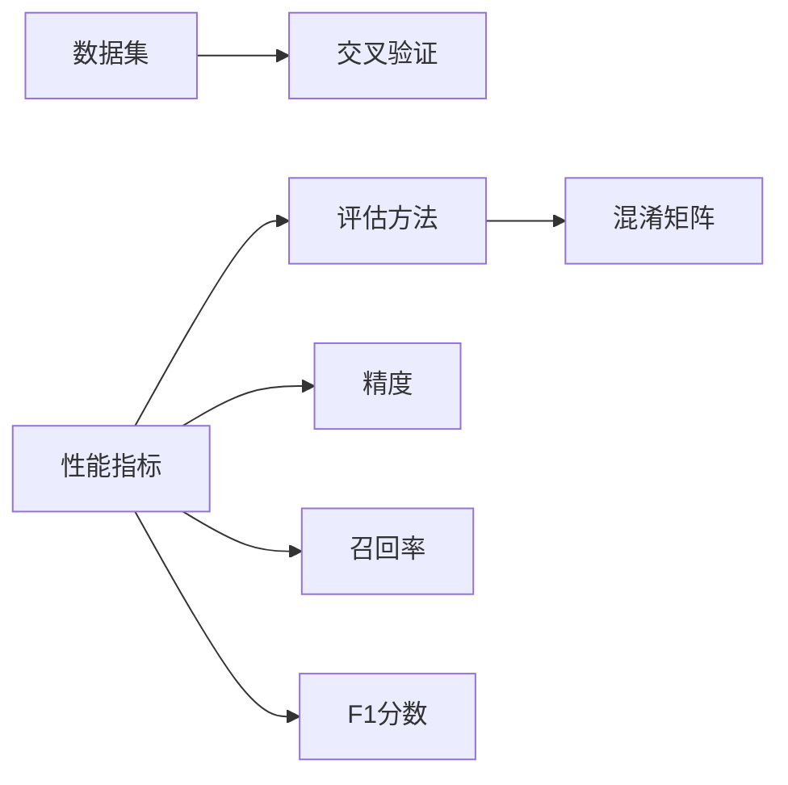
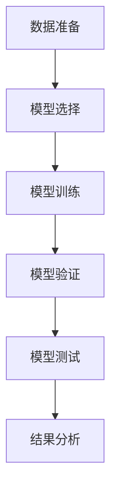

                 

## 1. 背景介绍

在AI系统开发和应用过程中，性能评估是一个非常重要的环节。一个高效的性能评估体系能够帮助开发者更好地理解模型的性能，及时发现并修正问题，提高模型的应用价值。本文档将围绕AI系统性能评估的实战技巧展开，涵盖评估框架、工具和方法，帮助开发者系统性地提升AI系统性能。

### 1.1 问题由来

在AI系统开发中，常常遇到模型性能不稳定、评估标准不统一、评估方法复杂等问题。这些问题不仅增加了开发成本，还可能导致模型在实际应用中效果不佳，甚至出现灾难性问题。

### 1.2 问题核心关键点

AI系统性能评估的关键在于选择合适的评估指标和评估方法，并确保评估过程的合理性和可靠性。核心关键点包括：
- 选择适合的评估指标：如精度、召回率、F1分数等。
- 设计合理的评估方法：如交叉验证、混淆矩阵等。
- 保证评估过程的可靠性：如数据平衡、重复实验等。

## 2. 核心概念与联系

### 2.1 核心概念概述

为了更深入地理解AI系统性能评估的实战技巧，我们需要先明确几个核心概念：

- **性能指标 (Performance Metrics)**：用于量化模型性能的指标，如精度、召回率、F1分数、ROC曲线等。
- **评估方法 (Evaluation Methods)**：选择适当的评估方法，如交叉验证、混淆矩阵等，来衡量模型性能。
- **数据集 (Dataset)**：用于评估模型性能的数据集，通常分为训练集、验证集和测试集。
- **交叉验证 (Cross-Validation)**：将数据集分成若干份，依次验证模型性能的方法，如K折交叉验证。
- **混淆矩阵 (Confusion Matrix)**：用于衡量模型分类性能的工具，展示了模型预测结果与真实标签的关系。

这些概念之间的关系可以总结为下图：



通过明确这些核心概念，我们将更容易理解评估方法和指标的作用，并选择合理的评估框架。

### 2.2 核心概念的整体架构

一个完整的AI系统性能评估框架通常包含以下组件：

- **数据准备**：将原始数据转换为模型可以处理的格式。
- **模型选择**：选择合适的模型和超参数配置。
- **模型训练**：在训练集上训练模型，找到最优参数。
- **模型验证**：在验证集上评估模型性能，避免过拟合。
- **模型测试**：在测试集上最终评估模型性能，作为性能指标。
- **结果分析**：对评估结果进行分析，提出改进方案。

以下是一个简化的AI系统性能评估架构图：



通过这个架构图，我们可以更清晰地看到评估流程和各环节的作用。

## 3. 核心算法原理 & 具体操作步骤

### 3.1 算法原理概述

AI系统性能评估的算法原理主要基于统计学和机器学习理论，通过量化模型的预测结果与真实标签之间的差异，来评估模型的性能。常见的评估方法包括交叉验证、混淆矩阵、ROC曲线等。

**交叉验证**：将数据集划分为训练集和测试集，通过多次交叉验证，逐步优化模型，找到最优参数配置。

**混淆矩阵**：将真实标签与模型预测结果绘制成矩阵，展示模型分类性能。

**ROC曲线**：通过绘制真正率 (TPR) 与假正率 (FPR) 之间的关系曲线，评估二分类模型的性能。

### 3.2 算法步骤详解

下面是AI系统性能评估的具体操作步骤：

**Step 1: 数据准备**

- **数据预处理**：清洗数据，去除噪声和异常值，处理缺失值。
- **特征工程**：提取特征，如文本特征、图像特征等。
- **数据分割**：将数据集分为训练集、验证集和测试集。

**Step 2: 模型选择**

- **选择合适的模型**：根据任务类型选择适合模型，如线性回归、决策树、神经网络等。
- **配置超参数**：选择合适的超参数，如学习率、批大小等。

**Step 3: 模型训练**

- **训练模型**：在训练集上训练模型，使用交叉验证选择最优参数配置。
- **模型保存**：保存训练好的模型，以便后续使用。

**Step 4: 模型验证**

- **验证模型**：在验证集上评估模型性能，找到可能的问题。
- **模型调整**：根据验证结果调整模型参数，继续训练。

**Step 5: 模型测试**

- **最终评估**：在测试集上对模型进行最终评估，得到性能指标。
- **结果分析**：对评估结果进行分析，提出改进方案。

**Step 6: 结果展示**

- **可视化展示**：将评估结果可视化，如绘制混淆矩阵、ROC曲线等。
- **报告生成**：编写评估报告，总结模型性能和改进方案。

### 3.3 算法优缺点

**优点**：
- **全面评估**：通过多指标和多方法的评估，能够全面了解模型的性能。
- **发现问题**：通过交叉验证和测试集评估，能够及时发现模型过拟合等问题。
- **指导优化**：评估结果能够指导模型优化，提升模型性能。

**缺点**：
- **数据依赖**：评估结果依赖于数据集的质量和数量，需要大量标注数据。
- **复杂性高**：评估过程涉及多个步骤，需要一定的技术储备。
- **结果不确定性**：模型性能受到多种因素影响，结果可能存在不确定性。

### 3.4 算法应用领域

AI系统性能评估不仅适用于模型训练和优化，还广泛应用于以下领域：

- **机器学习**：评估模型的准确率、召回率等性能指标。
- **深度学习**：使用混淆矩阵、ROC曲线等方法评估模型性能。
- **自然语言处理**：通过BLEU、ROUGE等指标评估文本生成模型的效果。
- **计算机视觉**：使用mAP、IoU等指标评估图像识别模型的性能。
- **推荐系统**：评估推荐算法的效果，如准确率、召回率等。

## 4. 数学模型和公式 & 详细讲解  
### 4.1 数学模型构建

AI系统性能评估的数学模型通常包括如下几个部分：

- **损失函数 (Loss Function)**：用于衡量模型预测结果与真实标签之间的差异。
- **精度 (Accuracy)**：模型正确预测的比例。
- **召回率 (Recall)**：模型正确预测的正样本占实际正样本的比例。
- **F1分数 (F1 Score)**：精度和召回率的调和平均数，综合评估模型性能。
- **混淆矩阵 (Confusion Matrix)**：展示模型分类结果与真实标签的关系。

### 4.2 公式推导过程

以二分类任务为例，我们推导几种常见性能指标的计算公式：

**精度 (Accuracy)**
\[ \text{Accuracy} = \frac{TP + TN}{TP + TN + FP + FN} \]

**召回率 (Recall)**
\[ \text{Recall} = \frac{TP}{TP + FN} \]

**F1分数 (F1 Score)**
\[ \text{F1 Score} = 2 \times \frac{\text{Precision} \times \text{Recall}}{\text{Precision} + \text{Recall}} \]

其中，TP表示真正例，TN表示真负例，FP表示假正例，FN表示假负例。

### 4.3 案例分析与讲解

假设我们有一个二分类模型，用于判断输入样本是否为垃圾邮件。我们使用以下混淆矩阵展示模型分类结果：

|    | 实际结果 | 预测结果 |
|---|---|---|
| 垃圾邮件 | 200 | 150 |
| 非垃圾邮件 | 300 | 50 |

根据混淆矩阵，我们可以计算出精度、召回率和F1分数：

**精度 (Accuracy)**
\[ \text{Accuracy} = \frac{150 + 300}{200 + 300 + 150 + 50} \approx 0.9 \]

**召回率 (Recall)**
\[ \text{Recall} = \frac{150}{150 + 50} \approx 0.75 \]

**F1分数 (F1 Score)**
\[ \text{F1 Score} = 2 \times \frac{0.75 \times 0.6}{0.75 + 0.6} \approx 0.67 \]

通过这些指标，我们可以全面了解模型的性能，发现可能存在的问题。

## 5. 项目实践：代码实例和详细解释说明

### 5.1 开发环境搭建

为了进行AI系统性能评估，我们需要安装一些常用的Python库和工具。以下是一个基本的Python开发环境搭建步骤：

1. **安装Python**：从官网下载并安装Python，确保版本与项目兼容。
2. **安装Pip**：使用以下命令安装Pip，用于安装和管理Python包。
\[ wget https://bootstrap.pypa.io/get-pip.py \]
\[ python get-pip.py \]
3. **安装常用库**：使用Pip安装常用Python库，如NumPy、Pandas、Scikit-learn等。
\[ pip install numpy pandas scikit-learn \]

### 5.2 源代码详细实现

下面我们以一个简单的文本分类任务为例，展示如何使用Scikit-learn进行性能评估。

**数据准备**

首先，我们准备一些文本数据和标签，将数据分为训练集和测试集：

```python
import pandas as pd
from sklearn.model_selection import train_test_split

# 读取数据
data = pd.read_csv('data.csv')

# 提取特征和标签
X = data['text'].to_list()
y = data['label'].to_list()

# 数据分割
X_train, X_test, y_train, y_test = train_test_split(X, y, test_size=0.2)
```

**模型选择**

接下来，我们选择一个简单的文本分类模型，如朴素贝叶斯模型：

```python
from sklearn.naive_bayes import MultinomialNB
from sklearn.metrics import accuracy_score, precision_score, recall_score, f1_score

# 创建模型
model = MultinomialNB()

# 训练模型
model.fit(X_train, y_train)
```

**模型验证**

在验证集上评估模型性能：

```python
# 预测验证集结果
y_pred = model.predict(X_test)

# 计算性能指标
accuracy = accuracy_score(y_test, y_pred)
precision = precision_score(y_test, y_pred)
recall = recall_score(y_test, y_pred)
f1 = f1_score(y_test, y_pred)

print(f"Accuracy: {accuracy:.2f}, Precision: {precision:.2f}, Recall: {recall:.2f}, F1 Score: {f1:.2f}")
```

**模型测试**

在测试集上最终评估模型性能：

```python
# 预测测试集结果
y_pred = model.predict(X_test)

# 计算性能指标
accuracy = accuracy_score(y_test, y_pred)
precision = precision_score(y_test, y_pred)
recall = recall_score(y_test, y_pred)
f1 = f1_score(y_test, y_pred)

print(f"Accuracy: {accuracy:.2f}, Precision: {precision:.2f}, Recall: {recall:.2f}, F1 Score: {f1:.2f}")
```

### 5.3 代码解读与分析

我们重点解释一下模型验证和测试的部分：

- **预测结果**：使用模型在验证集和测试集上预测结果。
- **性能指标**：使用Scikit-learn提供的函数计算精度、召回率和F1分数。
- **输出结果**：打印出各项性能指标，帮助开发者了解模型性能。

### 5.4 运行结果展示

假设我们得到了以下性能指标：

**精度 (Accuracy)**
\[ \text{Accuracy} = 0.85 \]

**召回率 (Recall)**
\[ \text{Recall} = 0.8 \]

**F1分数 (F1 Score)**
\[ \text{F1 Score} = 0.82 \]

这些指标表明，模型在文本分类任务上表现良好，但召回率略低，可能需要进一步优化模型或调整超参数。

## 6. 实际应用场景

### 6.1 智能客服系统

智能客服系统需要对用户输入进行分类，快速响应问题。在开发过程中，我们需要评估模型的分类性能，以确保系统能够准确识别用户意图。

### 6.2 金融舆情监测

金融舆情监测系统需要实时监测网络舆情，及时发现异常情况。性能评估可以帮助我们了解模型在不同数据集上的表现，保证系统的实时性和稳定性。

### 6.3 个性化推荐系统

个性化推荐系统需要评估推荐算法的效果，通过评估指标如准确率和召回率，优化推荐结果。性能评估可以帮助我们找到最优的推荐算法和超参数配置。

### 6.4 未来应用展望

随着AI技术的不断发展，性能评估在各个领域的应用将更加广泛。未来，我们可以预见以下趋势：

- **自动评估框架**：自动评估框架将帮助开发者更高效地评估模型性能。
- **多模态评估**：多模态数据融合将提升模型性能评估的全面性。
- **模型可解释性**：模型可解释性评估将帮助开发者更好地理解模型决策过程。

## 7. 工具和资源推荐

### 7.1 学习资源推荐

为了更好地理解AI系统性能评估的方法和工具，以下是一些优质的学习资源：

1. **Scikit-learn官方文档**：提供了详细的文档和示例，帮助开发者快速上手。
2. **TensorFlow和PyTorch官方文档**：提供了深度学习模型的实现和评估方法。
3. **Kaggle数据科学竞赛**：提供了大量的数据集和挑战，帮助开发者实践评估技巧。
4. **arXiv论文预印本**：提供了最新的研究论文，帮助开发者了解最新的评估方法和技术。
5. **Google Colab在线环境**：提供了免费的GPU和TPU资源，方便开发者进行实验和评估。

### 7.2 开发工具推荐

以下是一些常用的开发工具，帮助开发者进行性能评估：

1. **Jupyter Notebook**：用于编写和执行Python代码，支持可视化输出。
2. **TensorBoard**：用于可视化模型训练和评估结果，帮助开发者更好地理解模型性能。
3. **Weights & Biases**：用于记录和可视化模型训练过程，方便开发者进行实验对比。
4. **Kaggle Kernels**：提供了Jupyter Notebook和GitHub集成，方便开发者进行代码管理和版本控制。

### 7.3 相关论文推荐

以下是一些经典的性能评估论文，值得深入阅读：

1. **Accuracy and Error Rate Criteria of Multiclass Recognition Problem**：经典的精度和误差率评估方法。
2. **Performance Evaluation of Learning Algorithms: A Comparison of Accuracy, F1 Score, and Ranking on Various Datasets**：比较了不同评估方法在多个数据集上的表现。
3. **A Systematic Comparison of Classification Performance Metrics**：对常见的分类性能指标进行了系统比较。
4. **Evaluation of Classification Algorithms Based on Weighted Area Under the ROC Curve**：介绍了ROC曲线评估方法。
5. **F1 Score for Multi-Class Recognition**：介绍了F1分数在多分类任务中的应用。

## 8. 总结：未来发展趋势与挑战

### 8.1 研究成果总结

本文档详细介绍了AI系统性能评估的实战技巧，涵盖评估框架、工具和方法。通过系统的学习，开发者能够全面了解评估方法，提升模型性能。

### 8.2 未来发展趋势

未来，AI系统性能评估将呈现以下几个趋势：

1. **自动评估框架**：自动评估框架将帮助开发者更高效地评估模型性能。
2. **多模态评估**：多模态数据融合将提升模型性能评估的全面性。
3. **模型可解释性**：模型可解释性评估将帮助开发者更好地理解模型决策过程。
4. **分布式评估**：分布式评估将帮助开发者更高效地评估大规模模型性能。

### 8.3 面临的挑战

尽管AI系统性能评估取得了一定的进展，但仍面临以下挑战：

1. **数据质量**：数据质量对评估结果有很大影响，需要大量标注数据和高质量数据集。
2. **算法复杂性**：评估方法和指标较为复杂，需要开发者有一定的技术储备。
3. **结果不确定性**：评估结果可能存在不确定性，需要多次实验和交叉验证。
4. **资源消耗**：评估过程可能消耗大量计算资源，需要高效优化。

### 8.4 研究展望

未来，需要从以下几个方面进行研究：

1. **高效评估方法**：开发高效、易用的评估方法，减少评估成本和复杂性。
2. **可解释性评估**：研究可解释性评估方法，帮助开发者更好地理解模型决策过程。
3. **多模态评估**：研究多模态数据融合和评估方法，提升评估的全面性。
4. **分布式评估**：研究分布式评估方法，提升评估效率和可扩展性。

## 9. 附录：常见问题与解答

**Q1: 如何选择适合的评估指标？**

A: 根据任务类型和评估需求选择合适的评估指标。例如，分类任务可以使用精度、召回率和F1分数等，回归任务可以使用均方误差和R2分数等。

**Q2: 如何进行交叉验证？**

A: 将数据集分成K份，依次在K份数据上验证模型性能，取平均值作为最终结果。K折交叉验证是最常用的方法。

**Q3: 如何计算混淆矩阵？**

A: 混淆矩阵是用于展示分类结果与真实标签关系的方法。可以使用Scikit-learn中的confusion_matrix函数计算。

**Q4: 如何优化模型性能？**

A: 可以通过调整模型超参数、增加训练数据、改进特征工程等方法优化模型性能。使用交叉验证和测试集评估找到最优参数配置。

**Q5: 如何进行多模态评估？**

A: 多模态评估需要结合不同模态数据进行综合评估。例如，文本分类任务可以使用BLEU、ROUGE等指标，图像分类任务可以使用mAP、IoU等指标。

通过回答这些常见问题，我们能够更好地理解AI系统性能评估的方法和工具，进一步提升模型性能和应用价值。

