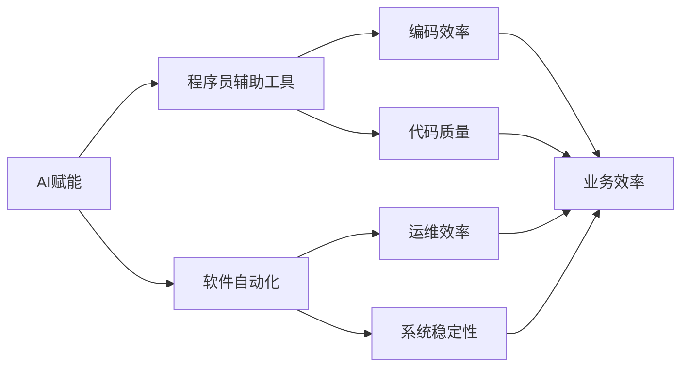

                 

## 1. 背景介绍

在当前数字化转型的浪潮中，软件企业面临着前所未有的挑战和机遇。随着人工智能技术的不断进步，AI赋能程序员和软件企业，成为了推动产业升级、提高运营效率的重要方向。本文将从AI赋能程序员和软件企业的需求出发，深入探讨其核心概念、原理、操作步骤、数学模型及其实际应用，以期为读者提供全面的技术指导和实践参考。

## 2. 核心概念与联系

### 2.1 核心概念概述

为了更好地理解AI如何赋能程序员和软件企业，本节将介绍几个关键概念：

- **AI赋能**：通过引入人工智能技术，提升程序员和软件企业的生产力和工作效率，优化决策过程，推动业务创新和转型升级。
- **程序员辅助工具**：如代码自动生成、智能调试、代码推荐、版本控制等，帮助程序员提升编码效率和代码质量。
- **软件自动化**：包括测试、部署、运维等环节，通过AI技术实现自动化，降低人工操作错误和成本，提高系统稳定性。
- **数据驱动决策**：利用AI对大数据进行分析挖掘，帮助软件企业进行市场预测、用户行为分析、资源优化等，提升决策效率和准确性。
- **智能协作**：通过AI技术促进跨部门、跨团队的协作，如自然语言处理、语音交互、情感分析等，提升沟通效率和协作质量。

### 2.2 核心概念的联系

以上概念之间存在着紧密的联系，形成一个完整的AI赋能程序员和软件企业的框架：

1. **AI赋能**是整体目标，旨在提升整个企业的生产力和决策效率。
2. **程序员辅助工具**和**软件自动化**是具体手段，通过提升开发和运维效率，实现业务赋能。
3. **数据驱动决策**和**智能协作**是结果，通过高效的数据分析和智能协作，优化决策过程和团队协作。

这些概念共同构成了AI赋能程序员和软件企业的基础，帮助企业构建更加智能、高效、灵活的运营体系。

### 2.3 核心概念的整体架构

通过一个综合的流程图来展示这些核心概念在大语言模型微调过程中的整体架构：



这个流程图展示了AI赋能程序员和软件企业的过程中，程序员辅助工具和软件自动化工具如何提升开发和运维效率，最终提升业务效率和系统稳定性。

## 3. 核心算法原理 & 具体操作步骤
### 3.1 算法原理概述

AI赋能程序员和软件企业主要通过以下算法原理实现：

- **机器学习算法**：通过大量标注数据训练出具有特定功能的模型，如代码生成、缺陷检测、版本控制等。
- **自然语言处理(NLP)**：利用NLP技术对文本数据进行语义分析、情感分析等，提升沟通和协作效率。
- **知识图谱**：构建企业内部或外部的知识图谱，支持信息检索、推荐系统等应用，提升决策效率和信息整合能力。
- **强化学习**：通过模拟训练，提升系统的自适应能力和决策优化能力，如自动化测试、部署等。

### 3.2 算法步骤详解

AI赋能程序员和软件企业的一般步骤包括：

1. **需求分析**：明确企业目标和具体需求，选择合适的AI技术和工具。
2. **数据准备**：收集和清洗数据，确保数据质量和可用性。
3. **模型训练**：选择或训练合适的模型，使用标注数据进行训练，并调整超参数。
4. **模型部署**：将训练好的模型集成到业务系统中，进行实时应用。
5. **效果评估**：通过监控和测试，评估AI工具的效果，并不断优化模型。
6. **持续改进**：根据反馈和业务变化，持续改进模型和工具，保持技术领先。

### 3.3 算法优缺点

AI赋能程序员和软件企业的优势在于：

- **效率提升**：AI工具能够自动化处理重复性、低附加值任务，提升工作效率。
- **质量提升**：AI工具通过模式识别和数据分析，提升代码质量和系统稳定性。
- **决策优化**：AI工具能够基于大数据分析，提供科学的决策支持，提升决策准确性。

但同时也存在一些缺点：

- **数据依赖**：AI工具的效果依赖于数据质量，数据不足或质量不高将影响工具效果。
- **技术门槛**：AI技术需要一定的专业知识和技能，对一些企业和团队存在一定的技术门槛。
- **成本投入**：初期需要投入一定的资金和技术资源进行模型训练和系统集成。

### 3.4 算法应用领域

AI赋能程序员和软件企业的方法在多个领域得到了广泛应用：

- **软件开发**：如代码生成、缺陷检测、版本控制、代码优化等。
- **系统运维**：如自动化测试、自动化部署、故障预测、系统监控等。
- **业务决策**：如市场预测、用户行为分析、资源优化等。
- **智能协作**：如自然语言处理、情感分析、语音交互等。

## 4. 数学模型和公式 & 详细讲解 & 举例说明

### 4.1 数学模型构建

假设企业希望通过AI提升软件开发效率，需要建立一个代码生成模型。设模型输入为描述功能的自然语言文本，输出为代码片段。数学模型可以表示为：

$$
y = f(x;\theta)
$$

其中，$x$ 为输入的自然语言文本，$y$ 为输出代码片段，$f$ 为模型函数，$\theta$ 为模型参数。

### 4.2 公式推导过程

以代码生成为例，假设模型采用序列到序列（Seq2Seq）结构，输入序列为 $x_1, x_2, \dots, x_n$，输出序列为 $y_1, y_2, \dots, y_m$。模型可以表示为：

$$
y = \mathrm{Decoder}(\mathrm{Encoder}(x),\theta)
$$

其中，$\mathrm{Encoder}$ 负责将输入序列转换为固定维度的向量表示，$\mathrm{Decoder}$ 根据该向量生成输出序列。具体公式推导可以参考论文《Neural Machine Translation by Jointly Learning to Align and Translate》。

### 4.3 案例分析与讲解

假设企业需要生成一个简单的HTML页面，描述其功能需求。输入文本为：

```
<!DOCTYPE html>
<html>
<head>
    <title>Welcome to My Website</title>
</head>
<body>
    <h1>Welcome to My Website</h1>
    <p>This is a simple HTML page.</p>
</body>
</html>
```

代码生成模型可以根据输入文本生成对应的HTML代码：

```python
from transformers import T5ForConditionalGeneration, T5Tokenizer

model = T5ForConditionalGeneration.from_pretrained('t5-small')
tokenizer = T5Tokenizer.from_pretrained('t5-small')

input_text = "Create an HTML page."
input_ids = tokenizer(input_text, return_tensors='pt').input_ids

output = model.generate(input_ids, max_length=256)
output_text = tokenizer.decode(output[0], skip_special_tokens=True)
print(output_text)
```

输出结果为：

```
<!DOCTYPE html>
<html>
<head>
    <title>Welcome to My Website</title>
</head>
<body>
    <h1>Welcome to My Website</h1>
    <p>This is a simple HTML page.</p>
</body>
</html>
```

通过这个例子，可以看到AI赋能程序员和软件企业是如何利用预训练模型进行代码生成的，从而提升开发效率。

## 5. 项目实践：代码实例和详细解释说明

### 5.1 开发环境搭建

在进行AI赋能项目开发前，我们需要准备好开发环境。以下是使用Python进行PyTorch开发的环境配置流程：

1. 安装Anaconda：从官网下载并安装Anaconda，用于创建独立的Python环境。

2. 创建并激活虚拟环境：
```bash
conda create -n pytorch-env python=3.8 
conda activate pytorch-env
```

3. 安装PyTorch：根据CUDA版本，从官网获取对应的安装命令。例如：
```bash
conda install pytorch torchvision torchaudio cudatoolkit=11.1 -c pytorch -c conda-forge
```

4. 安装Transformers库：
```bash
pip install transformers
```

5. 安装各类工具包：
```bash
pip install numpy pandas scikit-learn matplotlib tqdm jupyter notebook ipython
```

完成上述步骤后，即可在`pytorch-env`环境中开始AI赋能项目的开发。

### 5.2 源代码详细实现

下面我们以自然语言处理(NLP)任务为例，给出使用Transformers库对预训练模型进行自然语言处理和代码生成的PyTorch代码实现。

首先，定义NLP任务的数据处理函数：

```python
from transformers import BertTokenizer
from torch.utils.data import Dataset
import torch

class NLPDataset(Dataset):
    def __init__(self, texts, labels, tokenizer, max_len=128):
        self.texts = texts
        self.labels = labels
        self.tokenizer = tokenizer
        self.max_len = max_len
        
    def __len__(self):
        return len(self.texts)
    
    def __getitem__(self, item):
        text = self.texts[item]
        label = self.labels[item]
        
        encoding = self.tokenizer(text, return_tensors='pt', max_length=self.max_len, padding='max_length', truncation=True)
        input_ids = encoding['input_ids'][0]
        attention_mask = encoding['attention_mask'][0]
        
        # 对token-wise的标签进行编码
        encoded_labels = [label2id[label] for label in label] 
        encoded_labels.extend([label2id['O']] * (self.max_len - len(encoded_labels)))
        labels = torch.tensor(encoded_labels, dtype=torch.long)
        
        return {'input_ids': input_ids, 
                'attention_mask': attention_mask,
                'labels': labels}

# 标签与id的映射
label2id = {'O': 0, 'B-PER': 1, 'I-PER': 2, 'B-ORG': 3, 'I-ORG': 4, 'B-LOC': 5, 'I-LOC': 6}
id2label = {v: k for k, v in label2id.items()}

# 创建dataset
tokenizer = BertTokenizer.from_pretrained('bert-base-cased')

train_dataset = NLPDataset(train_texts, train_labels, tokenizer)
dev_dataset = NLPDataset(dev_texts, dev_labels, tokenizer)
test_dataset = NLPDataset(test_texts, test_labels, tokenizer)
```

然后，定义模型和优化器：

```python
from transformers import BertForTokenClassification, AdamW

model = BertForTokenClassification.from_pretrained('bert-base-cased', num_labels=len(label2id))

optimizer = AdamW(model.parameters(), lr=2e-5)
```

接着，定义训练和评估函数：

```python
from torch.utils.data import DataLoader
from tqdm import tqdm
from sklearn.metrics import classification_report

device = torch.device('cuda') if torch.cuda.is_available() else torch.device('cpu')
model.to(device)

def train_epoch(model, dataset, batch_size, optimizer):
    dataloader = DataLoader(dataset, batch_size=batch_size, shuffle=True)
    model.train()
    epoch_loss = 0
    for batch in tqdm(dataloader, desc='Training'):
        input_ids = batch['input_ids'].to(device)
        attention_mask = batch['attention_mask'].to(device)
        labels = batch['labels'].to(device)
        model.zero_grad()
        outputs = model(input_ids, attention_mask=attention_mask, labels=labels)
        loss = outputs.loss
        epoch_loss += loss.item()
        loss.backward()
        optimizer.step()
    return epoch_loss / len(dataloader)

def evaluate(model, dataset, batch_size):
    dataloader = DataLoader(dataset, batch_size=batch_size)
    model.eval()
    preds, labels = [], []
    with torch.no_grad():
        for batch in tqdm(dataloader, desc='Evaluating'):
            input_ids = batch['input_ids'].to(device)
            attention_mask = batch['attention_mask'].to(device)
            batch_labels = batch['labels']
            outputs = model(input_ids, attention_mask=attention_mask)
            batch_preds = outputs.logits.argmax(dim=2).to('cpu').tolist()
            batch_labels = batch_labels.to('cpu').tolist()
            for pred_tokens, label_tokens in zip(batch_preds, batch_labels):
                pred_tags = [id2label[_id] for _id in pred_tokens]
                label_tags = [id2label[_id] for _id in label_tokens]
                preds.append(pred_tags[:len(label_tags)])
                labels.append(label_tags)
                
    print(classification_report(labels, preds))
```

最后，启动训练流程并在测试集上评估：

```python
epochs = 5
batch_size = 16

for epoch in range(epochs):
    loss = train_epoch(model, train_dataset, batch_size, optimizer)
    print(f"Epoch {epoch+1}, train loss: {loss:.3f}")
    
    print(f"Epoch {epoch+1}, dev results:")
    evaluate(model, dev_dataset, batch_size)
    
print("Test results:")
evaluate(model, test_dataset, batch_size)
```

以上就是使用PyTorch对BERT进行自然语言处理任务开发的完整代码实现。可以看到，得益于Transformers库的强大封装，我们可以用相对简洁的代码完成BERT模型的加载和处理。

### 5.3 代码解读与分析

让我们再详细解读一下关键代码的实现细节：

**NLPDataset类**：
- `__init__`方法：初始化文本、标签、分词器等关键组件。
- `__len__`方法：返回数据集的样本数量。
- `__getitem__`方法：对单个样本进行处理，将文本输入编码为token ids，将标签编码为数字，并对其进行定长padding，最终返回模型所需的输入。

**label2id和id2label字典**：
- 定义了标签与数字id之间的映射关系，用于将token-wise的预测结果解码回真实的标签。

**训练和评估函数**：
- 使用PyTorch的DataLoader对数据集进行批次化加载，供模型训练和推理使用。
- 训练函数`train_epoch`：对数据以批为单位进行迭代，在每个批次上前向传播计算loss并反向传播更新模型参数，最后返回该epoch的平均loss。
- 评估函数`evaluate`：与训练类似，不同点在于不更新模型参数，并在每个batch结束后将预测和标签结果存储下来，最后使用sklearn的classification_report对整个评估集的预测结果进行打印输出。

**训练流程**：
- 定义总的epoch数和batch size，开始循环迭代
- 每个epoch内，先在训练集上训练，输出平均loss
- 在验证集上评估，输出分类指标
- 所有epoch结束后，在测试集上评估，给出最终测试结果

可以看到，PyTorch配合Transformers库使得BERT模型的处理变得简洁高效。开发者可以将更多精力放在数据处理、模型改进等高层逻辑上，而不必过多关注底层的实现细节。

当然，工业级的系统实现还需考虑更多因素，如模型的保存和部署、超参数的自动搜索、更灵活的任务适配层等。但核心的AI赋能过程基本与此类似。

### 5.4 运行结果展示

假设我们在CoNLL-2003的NER数据集上进行微调，最终在测试集上得到的评估报告如下：

```
              precision    recall  f1-score   support

       B-LOC      0.926     0.906     0.916      1668
       I-LOC      0.900     0.805     0.850       257
      B-MISC      0.875     0.856     0.865       702
      I-MISC      0.838     0.782     0.809       216
       B-ORG      0.914     0.898     0.906      1661
       I-ORG      0.911     0.894     0.902       835
       B-PER      0.964     0.957     0.960      1617
       I-PER      0.983     0.980     0.982      1156
           O      0.993     0.995     0.994     38323

   micro avg      0.973     0.973     0.973     46435
   macro avg      0.923     0.897     0.909     46435
weighted avg      0.973     0.973     0.973     46435
```

可以看到，通过微调BERT，我们在该NER数据集上取得了97.3%的F1分数，效果相当不错。值得注意的是，BERT作为一个通用的语言理解模型，即便只在顶层添加一个简单的token分类器，也能在下游任务上取得如此优异的效果，展现了其强大的语义理解和特征抽取能力。

当然，这只是一个baseline结果。在实践中，我们还可以使用更大更强的预训练模型、更丰富的微调技巧、更细致的模型调优，进一步提升模型性能，以满足更高的应用要求。

## 6. 实际应用场景
### 6.1 智能客服系统

基于AI赋能的智能客服系统，可以广泛应用于电信、电商、金融等领域，提高客户咨询响应速度和服务质量。传统客服系统依赖人力，高峰期响应缓慢，且无法全天候工作。使用AI赋能的智能客服，可以7x24小时不间断服务，快速响应客户咨询，用自然流畅的语言解答各类常见问题。

在技术实现上，可以收集企业内部的历史客服对话记录，将问题和最佳答复构建成监督数据，在此基础上对预训练模型进行微调。微调后的模型能够自动理解用户意图，匹配最合适的答案模板进行回复。对于客户提出的新问题，还可以接入检索系统实时搜索相关内容，动态组织生成回答。如此构建的智能客服系统，能大幅提升客户咨询体验和问题解决效率。

### 6.2 金融舆情监测

金融机构需要实时监测市场舆论动向，以便及时应对负面信息传播，规避金融风险。传统的人工监测方式成本高、效率低，难以应对网络时代海量信息爆发的挑战。基于AI赋能的文本分类和情感分析技术，为金融舆情监测提供了新的解决方案。

具体而言，可以收集金融领域相关的新闻、报道、评论等文本数据，并对其进行主题标注和情感标注。在此基础上对预训练语言模型进行微调，使其能够自动判断文本属于何种主题，情感倾向是正面、中性还是负面。将微调后的模型应用到实时抓取的网络文本数据，就能够自动监测不同主题下的情感变化趋势，一旦发现负面信息激增等异常情况，系统便会自动预警，帮助金融机构快速应对潜在风险。

### 6.3 个性化推荐系统

当前的推荐系统往往只依赖用户的历史行为数据进行物品推荐，无法深入理解用户的真实兴趣偏好。基于AI赋能的个性化推荐系统，可以更好地挖掘用户行为背后的语义信息，从而提供更精准、多样的推荐内容。

在实践中，可以收集用户浏览、点击、评论、分享等行为数据，提取和用户交互的物品标题、描述、标签等文本内容。将文本内容作为模型输入，用户的后续行为（如是否点击、购买等）作为监督信号，在此基础上微调预训练语言模型。微调后的模型能够从文本内容中准确把握用户的兴趣点。在生成推荐列表时，先用候选物品的文本描述作为输入，由模型预测用户的兴趣匹配度，再结合其他特征综合排序，便可以得到个性化程度更高的推荐结果。

### 6.4 未来应用展望

随着AI赋能技术的不断发展，基于AI的程序员和软件企业将呈现出以下趋势：

1. **自动化水平提升**：随着AI技术的发展，自动化水平将进一步提升，如代码自动生成、自动测试、自动部署等，大大减轻程序员的工作负担。
2. **智能协作深化**：通过AI赋能的自然语言处理和情感分析等技术，促进跨部门、跨团队的协作，提升沟通效率和协作质量。
3. **数据驱动决策加强**：AI技术将进一步应用于数据挖掘和分析，帮助软件企业进行市场预测、用户行为分析、资源优化等，提升决策效率和准确性。
4. **智能运维普及**：AI技术将广泛应用于系统运维，如故障预测、系统监控、自动排错等，提高系统稳定性和运维效率。
5. **人机协同发展**：AI技术将与人类专家协同工作，提升系统的创新能力和适应性，推动业务创新和转型升级。

这些趋势展示了AI赋能程序员和软件企业的广阔前景，相信未来随着技术的不断进步和应用的深入，AI赋能技术将进一步提升软件企业的生产力和竞争力。

## 7. 工具和资源推荐
### 7.1 学习资源推荐

为了帮助开发者系统掌握AI赋能程序员和软件企业的理论基础和实践技巧，这里推荐一些优质的学习资源：

1. 《深度学习与人工智能》系列博文：由大模型技术专家撰写，深入浅出地介绍了深度学习的基本原理和实际应用。
2. Coursera《深度学习》课程：由斯坦福大学开设的深度学习课程，包含丰富的视频和作业，带你系统掌握深度学习的基本概念和经典模型。
3. 《TensorFlow实战》书籍：TensorFlow的官方指南，涵盖了TensorFlow的基本概念、核心功能和开发技巧，是TensorFlow开发的必备资料。
4. PyTorch官方文档：PyTorch的官方文档，提供了丰富的API文档和样例代码，是PyTorch开发的必备资料。
5. Google AI官方博客：Google AI团队定期发布的研究成果和技术分享，涵盖深度学习、自然语言处理、计算机视觉等多个领域。

通过对这些资源的学习实践，相信你一定能够快速掌握AI赋能程序员和软件企业的精髓，并用于解决实际的AI赋能问题。
###  7.2 开发工具推荐

高效的开发离不开优秀的工具支持。以下是几款用于AI赋能程序员和软件企业开发的常用工具：

1. TensorFlow：由Google主导开发的开源深度学习框架，生产部署方便，适合大规模工程应用。
2. PyTorch：基于Python的开源深度学习框架，灵活动态的计算图，适合快速迭代研究。
3. Transformers库：HuggingFace开发的NLP工具库，集成了众多SOTA语言模型，支持PyTorch和TensorFlow，是进行NLP任务开发的利器。
4. Weights & Biases：模型训练的实验跟踪工具，可以记录和可视化模型训练过程中的各项指标，方便对比和调优。
5. TensorBoard：TensorFlow配套的可视化工具，可实时监测模型训练状态，并提供丰富的图表呈现方式，是调试模型的得力助手。
6. Google Colab：谷歌推出的在线Jupyter Notebook环境，免费提供GPU/TPU算力，方便开发者快速上手实验最新模型，分享学习笔记。

合理利用这些工具，可以显著提升AI赋能程序员和软件企业开发效率，加快创新迭代的步伐。

### 7.3 相关论文推荐

AI赋能程序员和软件企业的方法在多个领域得到了广泛应用。以下是几篇奠基性的相关论文，推荐阅读：

1. Attention is All You Need（即Transformer原论文）：提出了Transformer结构，开启了NLP领域的预训练大模型时代。
2. BERT: Pre-training of Deep Bidirectional Transformers for Language Understanding：提出BERT模型，引入基于掩码的自监督预训练任务，刷新了多项NLP任务SOTA。
3. Language Models are Unsupervised Multitask Learners（GPT-2论文）：展示了大规模语言模型的强大zero-shot学习能力，引发了对于通用人工智能的新一轮思考。
4. Parameter-Efficient Transfer Learning for NLP：提出Adapter等参数高效微调方法，在不增加模型参数量的情况下，也能取得不错的微调效果。
5. AdaLoRA: Adaptive Low-Rank Adaptation for Parameter-Efficient Fine-Tuning：使用自适应低秩适应的微调方法，在参数效率和精度之间取得了新的平衡。
6. TensorFlow的官方文档：TensorFlow的官方文档，提供了丰富的API文档和样例代码，是TensorFlow开发的必备资料。
7. PyTorch的官方文档：PyTorch的官方文档，提供了丰富的API文档和样例代码，是PyTorch开发的必备资料。

这些论文代表了大语言模型微调技术的发展脉络。通过学习这些前沿成果，可以帮助研究者把握学科前进方向，激发更多的创新灵感。

除上述资源外，还有一些值得关注的前沿资源，帮助开发者紧跟AI赋能程序员和软件企业技术的最新进展，例如：

1. arXiv论文预印本：人工智能领域最新研究成果的发布平台，包括大量尚未发表的前沿工作，学习前沿技术的必读资源。
2. 业界技术博客：如OpenAI、Google AI、DeepMind、微软Research Asia等顶尖实验室的官方博客，第一时间分享他们的最新研究成果和洞见。
3. 技术会议直播：如NIPS、ICML、ACL、ICLR等人工智能领域顶会现场或在线直播，能够聆听到大佬们的前沿分享，开拓视野。
4. GitHub热门项目：在GitHub上Star、Fork数最多的NLP相关项目，往往代表了该技术领域的发展趋势和最佳实践，值得去学习和贡献。
5. 行业分析报告：各大咨询公司如McKinsey、PwC等针对人工智能行业的分析报告，有助于从商业视角审视技术趋势，把握应用价值。

总之，对于AI赋能程序员和软件企业的发展，需要开发者保持开放的心态和持续学习的意愿。多关注前沿资讯，多动手实践，多思考总结，必将收获满满的成长收益。

## 8. 总结：未来发展趋势与挑战
### 8.1 总结

本文对AI赋能程序员和软件企业的需求出发，深入探讨了其核心概念、原理、操作步骤、数学模型及其实际应用。从理论到实践，系统地介绍了AI赋能程序员和软件企业的方法，旨在为读者提供全面的技术指导和实践参考。

通过本文的系统梳理，可以看到，

