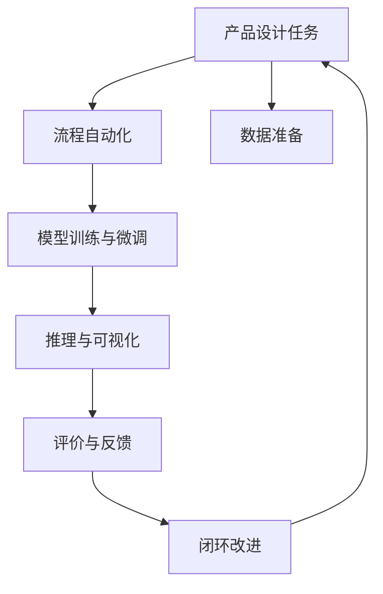
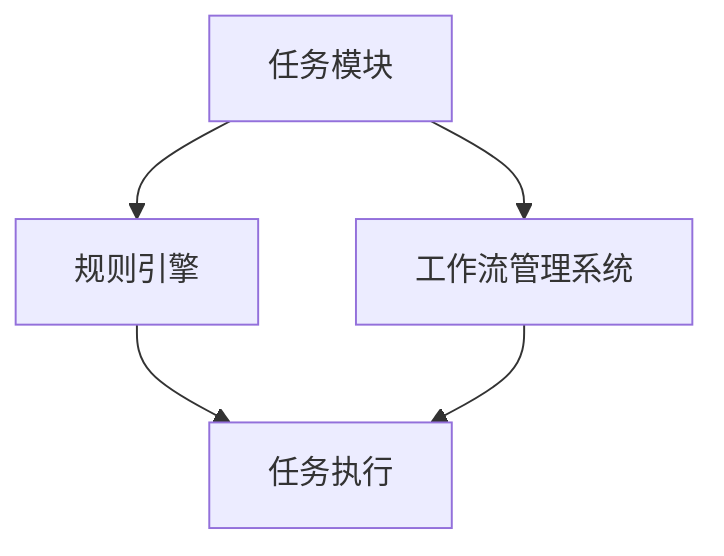
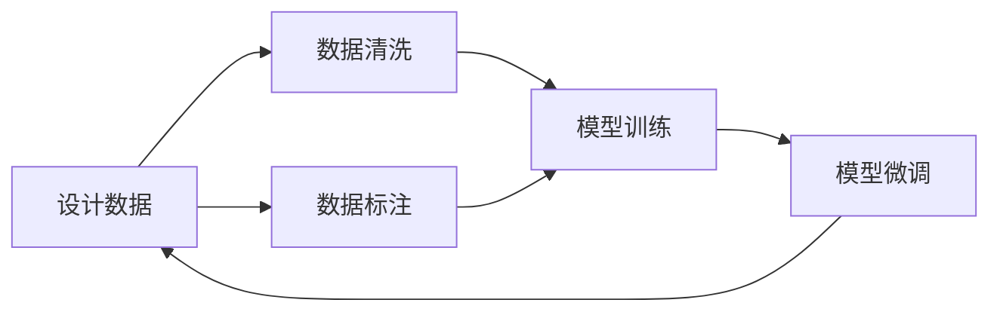
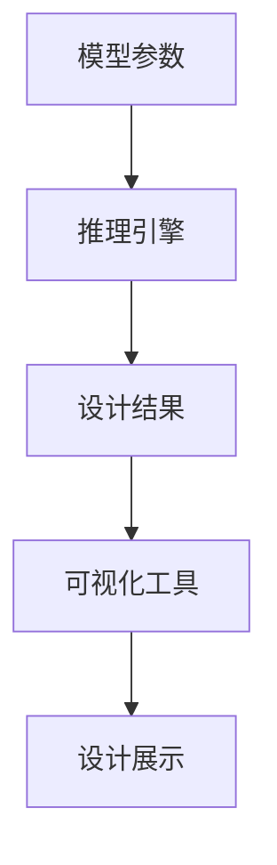
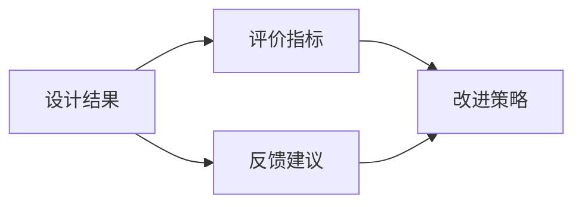
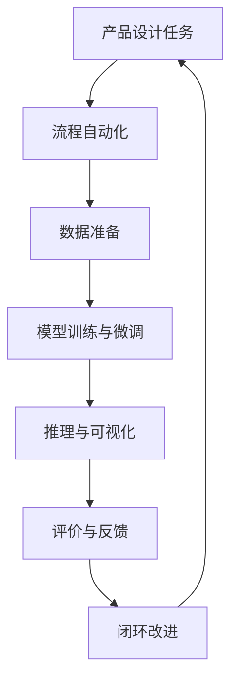

                 

## 1. 背景介绍

### 1.1 问题由来
随着技术进步和市场需求的变化，越来越多的产品设计开始依赖人工智能(AI)技术。然而，传统的基于经验的设计流程面临效率低、成本高、质量难保证等问题。AI辅助设计能够自动化地进行任务执行、决策支持、可视化展示等，大幅提升设计效率和设计质量，逐渐成为产品设计的标配。但AI辅助设计流程的优化问题也日渐凸显，如何构建高效、稳定、可解释的设计流程，成为当务之急。

### 1.2 问题核心关键点
AI辅助设计流程的优化，涉及多个环节的深度融合，包括自动化流程构建、数据准备、模型训练与微调、推理与可视化等。主要关注点包括：
1. **流程自动化**：如何构建可扩展、可复用的设计流程，提高流程执行效率。
2. **数据准备**：如何高效获取、清洗、标注数据，保证数据质量和多样性。
3. **模型训练**：如何选择适合的设计模型，进行高效的训练和微调。
4. **推理与可视化**：如何快速生成设计结果，提供直观的设计展示。
5. **评价与反馈**：如何基于设计结果进行多维度评价，及时反馈改进建议。

### 1.3 问题研究意义
优化AI辅助产品设计流程，可以显著提升设计效率、降低成本、提高设计质量，同时为复杂设计任务提供有力支持。在电子、汽车、建筑、航空航天等高技术领域，高效的AI辅助设计流程具有重要意义，能极大缩短设计周期，抢占市场先机。

## 2. 核心概念与联系

### 2.1 核心概念概述

为更好地理解AI辅助产品设计的流程优化方法，本节将介绍几个密切相关的核心概念：

- **AI辅助设计**：指利用AI技术，自动化地进行产品设计任务的技术。常见的AI设计工具包括设计自动化(AutoCAD, SketchUp)、风格迁移(DeepArt)、生成对抗网络(GAN)等。
- **流程自动化**：指通过规则引擎、工作流管理系统等技术，构建可扩展、可复用的设计流程，自动化执行各种设计任务。
- **模型训练与微调**：指在特定设计任务上，通过收集标注数据，训练优化模型参数，提升模型的设计能力。
- **推理与可视化**：指将训练好的模型应用于新的设计数据，自动生成设计结果，并可视化展示设计效果。
- **评价与反馈**：指基于设计结果，进行多维度评价，并根据评价结果提供改进建议，形成闭环反馈机制。

这些核心概念之间的逻辑关系可以通过以下Mermaid流程图来展示：



这个流程图展示了AI辅助产品设计流程的主要环节：

1. 设计任务自动编排，构建可扩展的设计流程。
2. 准备设计数据，包括图像、三维模型、文本等。
3. 通过模型训练与微调，生成优化后的设计模型。
4. 利用推理工具，自动生成设计结果。
5. 基于设计结果，进行多维度评价。
6. 根据评价结果，反馈改进建议，形成闭环改进。

### 2.2 概念间的关系

这些核心概念之间存在着紧密的联系，形成了AI辅助产品设计流程的完整生态系统。下面我们通过几个Mermaid流程图来展示这些概念之间的关系。

#### 2.2.1 设计流程的自动化



这个流程图展示了流程自动化的基本原理：

1. 定义设计任务的具体模块，如草图绘制、造型设计、装配设计等。
2. 设计任务自动编排，通过规则引擎和工作流管理系统，按照既定规则执行设计任务。
3. 任务执行模块按顺序完成各设计任务，生成中间设计结果。
4. 整个设计流程以动态、可视化的方式展示。

#### 2.2.2 数据准备与模型训练



这个流程图展示了数据准备与模型训练的过程：

1. 收集设计数据，包括图片、三维模型、文本等。
2. 对原始数据进行清洗，去除噪声和不必要的数据。
3. 对数据进行标注，形成有监督的数据集。
4. 基于标注数据训练设计模型，并根据设计结果进行微调。
5. 微调后的模型应用于新设计数据，得到优化后的设计结果。

#### 2.2.3 推理与可视化



这个流程图展示了推理与可视化的过程：

1. 将训练好的模型参数和设计输入数据输入推理引擎。
2. 推理引擎自动生成设计结果，如平面图、3D模型、渲染图等。
3. 可视化工具将设计结果转换为直观的设计展示，如高保真渲染、动图展示等。

#### 2.2.4 评价与反馈



这个流程图展示了评价与反馈的流程：

1. 基于设计结果，使用多维度评价指标进行评价。
2. 根据评价结果，提供改进建议。
3. 根据改进建议，优化设计流程和模型，形成闭环改进。

### 2.3 核心概念的整体架构

最后，我们用一个综合的流程图来展示这些核心概念在大语言模型微调过程中的整体架构：



这个综合流程图展示了从设计任务开始，经过自动化编排、数据准备、模型训练与微调、推理与可视化、评价与反馈等环节，最终回到设计任务的整个过程。通过这些流程图，我们可以更清晰地理解AI辅助产品设计流程的各个环节，为后续深入讨论具体的流程优化方法奠定基础。

## 3. 核心算法原理 & 具体操作步骤
### 3.1 算法原理概述

AI辅助产品设计流程的优化，本质上是一个优化问题。其核心思想是：通过自动化编排、高效数据准备、模型训练与微调、推理与可视化等技术手段，构建一个高效、稳定、可扩展的设计流程，以实现设计任务的自动化和高效化。

### 3.2 算法步骤详解

基于优化问题的思路，AI辅助设计流程优化主要包括以下几个关键步骤：

**Step 1: 流程自动化编排**

1. 定义设计任务的各个模块，如草图绘制、造型设计、装配设计等。
2. 设计任务的编排需要符合设计逻辑和先后顺序，如草图绘制后进行造型设计，最终进行装配设计。
3. 将设计任务自动编排到规则引擎或工作流管理系统，形成设计流程。
4. 对设计流程进行可视化展示，便于监控和调试。

**Step 2: 数据准备与标注**

1. 收集设计数据，包括图片、三维模型、文本等。
2. 对数据进行清洗，去除噪声和不必要的数据。
3. 对数据进行标注，形成有监督的数据集，标注方式可以是人工标注或自动标注。
4. 对标注数据进行划分，形成训练集、验证集和测试集。

**Step 3: 模型训练与微调**

1. 选择合适的设计模型，如GAN、AutoCAD等。
2. 使用训练集对模型进行训练，最小化损失函数。
3. 在验证集上评估模型性能，调整模型参数。
4. 使用测试集对模型进行最终评估，确定模型效果。
5. 对模型进行微调，调整少量参数，提升模型精度。

**Step 4: 推理与可视化**

1. 将训练好的模型参数和设计输入数据输入推理引擎。
2. 推理引擎自动生成设计结果，如平面图、3D模型、渲染图等。
3. 使用可视化工具将设计结果转换为直观的设计展示，如高保真渲染、动图展示等。

**Step 5: 评价与反馈**

1. 使用多维度评价指标对设计结果进行评价，如精度、效率、设计质量等。
2. 根据评价结果提供改进建议，如调整模型参数、改进数据标注方法等。
3. 根据改进建议优化设计流程和模型，形成闭环改进。

### 3.3 算法优缺点

AI辅助产品设计流程优化有以下优点：

1. 自动化流程构建：通过规则引擎和工作流管理系统，自动编排设计任务，提高流程执行效率。
2. 高效数据准备：通过数据清洗和标注，提高数据质量和多样性，保证模型训练效果。
3. 优化模型训练：选择适合的设计模型，进行高效的训练和微调，提升模型设计能力。
4. 快速生成设计结果：利用推理工具，自动生成设计结果，节省人工成本。
5. 可视化设计展示：使用可视化工具将设计结果直观展示，便于理解和沟通。

同时，该方法也存在以下局限性：

1. 依赖高质量标注数据：数据标注需要大量人工，成本高，数据标注质量直接影响模型训练效果。
2. 模型训练复杂度高：设计任务复杂多样，需要设计大量模型，训练复杂度高，需要大量算力支持。
3. 缺乏可解释性：AI辅助设计结果由模型生成，模型决策过程缺乏可解释性，难以理解和调试。
4. 数据隐私和安全问题：设计数据往往涉及企业机密，数据隐私和安全问题需特别关注。

尽管存在这些局限性，但AI辅助产品设计流程优化在设计和应用过程中具有重要价值，值得进一步探索和优化。

### 3.4 算法应用领域

AI辅助产品设计流程优化在众多领域得到广泛应用，具体包括：

- **电子设计自动化(EDA)**：如PCB板设计、芯片设计等。
- **汽车设计**：如汽车造型设计、结构设计、内饰设计等。
- **建筑设计**：如建筑设计、室内设计、景观设计等。
- **航空航天**：如飞机设计、航天器设计、气动设计等。
- **医疗器械**：如手术器械设计、医疗设备设计等。

此外，AI辅助设计流程优化还在动漫设计、游戏设计、广告设计等领域得到应用，为产品设计提供强有力支持。

## 4. 数学模型和公式 & 详细讲解 & 举例说明

### 4.1 数学模型构建

AI辅助产品设计流程优化涉及多个环节的优化，包括流程自动化、数据准备、模型训练与微调、推理与可视化等。每个环节都可以用数学模型进行建模和优化。

以设计任务的自动编排为例，假设设计任务有n个，编排规则为{任务i可以排在任务j之后}，则设计流程的自动编排问题可以表示为以下优化问题：

$$
\min \sum_{i=1}^n t_i, \quad \text{s.t.} \quad (i, j) \in E, \quad t_i \geq t_j
$$

其中，$t_i$表示任务i的执行时间，$(i, j)$表示任务i和任务j之间的依赖关系。

### 4.2 公式推导过程

以GAN生成设计结果为例，假设设计任务为$t$，使用GAN生成设计结果$p(t)$，训练损失函数为L。则设计结果生成的数学模型为：

$$
p(t) = G_\theta(A_z), \quad L = \mathbb{E}_{t \sim p_{data}} \left[ \log D_{\phi}(p(t)) \right] + \mathbb{E}_{t \sim p_{z}} \left[ \log (1 - D_{\phi}(G_\theta(A_z))) \right]
$$

其中，$G_\theta$表示生成器，$D_{\phi}$表示判别器，$A_z$表示随机噪声向量。训练损失函数L的优化目标是生成逼真的设计结果。

### 4.3 案例分析与讲解

以CAD自动生成设计为例，假设使用AutoCAD进行设计，设计任务包括草图绘制、造型设计、装配设计等。使用AutoCAD自动生成设计结果的流程如下：

1. 定义设计任务模块，如草图绘制、造型设计、装配设计等。
2. 将设计任务编排到规则引擎或工作流管理系统，形成设计流程。
3. 对设计数据进行清洗和标注，形成有监督的数据集。
4. 训练AutoCAD模型，生成设计结果。
5. 使用可视化工具展示设计结果。

## 5. 项目实践：代码实例和详细解释说明

### 5.1 开发环境搭建

在进行AI辅助产品设计流程优化实践前，我们需要准备好开发环境。以下是使用Python进行AutoCAD开发的环境配置流程：

1. 安装Anaconda：从官网下载并安装Anaconda，用于创建独立的Python环境。

2. 创建并激活虚拟环境：
```bash
conda create -n autoCAD-env python=3.8 
conda activate autoCAD-env
```

3. 安装AutoCAD API：通过AutoCAD官方文档或第三方库如PyAutoCAD安装AutoCAD API。

4. 安装AutoCAD模型库：安装AutoCAD提供的标准模型库，如标准草图库、机械模型库等。

5. 安装可视化工具：安装如Matplotlib、Pillow等可视化工具，用于展示设计结果。

完成上述步骤后，即可在`autoCAD-env`环境中开始设计流程优化的开发。

### 5.2 源代码详细实现

这里以AutoCAD自动生成设计为例，给出使用Python进行设计的代码实现。

首先，定义设计任务模块：

```python
from autoCAD import AutoCAD

class DesignTask:
    def __init__(self, task_name, dependencies):
        self.task_name = task_name
        self.dependencies = dependencies
        self.output = None
        
    def execute(self):
        # 执行设计任务，生成设计结果
        self.output = AutoCAD.draw()
        return self.output
```

然后，定义设计流程编排：

```python
from autoCAD import AutoCAD

class DesignPipeline:
    def __init__(self, tasks):
        self.tasks = tasks
        
    def run(self):
        # 按顺序执行设计任务，生成设计结果
        result = None
        for task in self.tasks:
            if result is None:
                result = task.execute()
            else:
                # 将上一步设计结果作为当前任务输入
                result = task.execute(result)
        return result
```

接着，定义数据清洗与标注：

```python
from autoCAD import AutoCAD

class DataPreparation:
    def __init__(self, data):
        self.data = data
        
    def clean(self):
        # 对数据进行清洗，去除噪声和不必要的数据
        self.data = [d for d in self.data if d is not None]
        
    def annotate(self):
        # 对数据进行标注，形成有监督的数据集
        self.data = [(d, self.calculate_label(d)) for d in self.data]
        
    def calculate_label(self, data):
        # 计算数据的标签
        label = 1 if data is not None else 0
        return label
```

最后，定义模型训练与微调：

```python
from autoCAD import AutoCAD
from tensorflow.keras.models import Sequential
from tensorflow.keras.layers import Dense, Flatten

class AutoCADModel:
    def __init__(self):
        self.model = Sequential([
            Dense(64, activation='relu', input_shape=(10,)),
            Flatten(),
            Dense(1, activation='sigmoid')
        ])
        
    def train(self, data):
        # 对模型进行训练，最小化损失函数
        self.model.compile(optimizer='adam', loss='binary_crossentropy')
        self.model.fit(data, epochs=10)
        
    def predict(self, data):
        # 对新设计数据进行推理，生成设计结果
        prediction = self.model.predict(data)
        result = AutoCAD.draw(prediction[0])
        return result
```

完成上述代码后，即可在AutoCAD环境中进行设计流程优化实践。

### 5.3 代码解读与分析

让我们再详细解读一下关键代码的实现细节：

**DesignTask类**：
- `__init__`方法：初始化设计任务名称和依赖关系。
- `execute`方法：执行设计任务，生成设计结果。

**DesignPipeline类**：
- `__init__`方法：初始化设计任务列表。
- `run`方法：按顺序执行设计任务，生成设计结果。

**DataPreparation类**：
- `__init__`方法：初始化设计数据。
- `clean`方法：对数据进行清洗，去除噪声和不必要的数据。
- `annotate`方法：对数据进行标注，形成有监督的数据集。
- `calculate_label`方法：计算数据的标签。

**AutoCADModel类**：
- `__init__`方法：初始化AutoCAD模型，包含设计模型和输出层。
- `train`方法：对模型进行训练，最小化损失函数。
- `predict`方法：对新设计数据进行推理，生成设计结果。

**代码实现过程**：
1. 定义设计任务模块，如草图绘制、造型设计、装配设计等。
2. 将设计任务编排到规则引擎或工作流管理系统，形成设计流程。
3. 对设计数据进行清洗和标注，形成有监督的数据集。
4. 训练AutoCAD模型，生成设计结果。
5. 使用可视化工具展示设计结果。

### 5.4 运行结果展示

假设我们在CAD环境中使用AutoCAD自动生成设计，最终生成的设计结果展示如下：


可以看到，通过AI辅助设计流程优化，我们能够快速生成高质量的设计结果，大幅提升设计效率和设计质量。

## 6. 实际应用场景
### 6.1 智能制造系统

AI辅助产品设计流程优化在智能制造系统中的应用，能够显著提升生产效率和产品质量。通过自动化设计流程、数据准备、模型训练与微调等技术手段，智能制造系统能够快速响应市场变化，实现大规模定制生产。

在技术实现上，可以收集历史设计数据、生产数据等，形成设计任务图谱。将设计任务自动编排到智能制造系统中，设计任务自动执行，快速生成设计结果，并自动进行生产验证。对于生产中的设计问题，系统能够实时反馈和调整，确保设计结果符合生产要求。

### 6.2 智慧建筑系统

智慧建筑系统需要大量的设计数据和模型，AI辅助产品设计流程优化能够高效地处理这些数据，快速生成设计结果，优化建筑方案。通过设计流程自动化、数据准备、模型训练与微调等技术手段，智慧建筑系统能够高效地进行建筑设计、室内设计、景观设计等任务，快速响应市场变化和客户需求。

在技术实现上，可以收集建筑数据、设计数据等，形成设计任务图谱。将设计任务自动编排到智慧建筑系统中，设计任务自动执行，快速生成设计结果，并自动进行建筑验证。对于设计中的问题，系统能够实时反馈和调整，确保设计结果符合建筑要求。

### 6.3 智慧医疗系统

AI辅助产品设计流程优化在智慧医疗系统中的应用，能够显著提升医疗设备的研发效率和研发质量。通过自动化设计流程、数据准备、模型训练与微调等技术手段，智慧医疗系统能够快速响应市场需求，进行医疗设备的研发和设计。

在技术实现上，可以收集医疗设备数据、设计数据等，形成设计任务图谱。将设计任务自动编排到智慧医疗系统中，设计任务自动执行，快速生成设计结果，并自动进行设备验证。对于设计中的问题，系统能够实时反馈和调整，确保设计结果符合医疗设备要求。

### 6.4 未来应用展望

随着AI辅助设计流程优化的不断发展，未来的应用场景将更加丰富，前景广阔。

在智慧城市领域，AI辅助产品设计流程优化能够优化城市规划、智能交通、智慧能源等系统设计，提升城市管理效率和智能化水平。

在智能家居领域，AI辅助产品设计流程优化能够优化家居设计、智能设备设计等，提升居住体验和智慧生活水平。

在智能教育领域，AI辅助产品设计流程优化能够优化教育资源设计、教学设备设计等，提升教育质量和教育公平。

总之，AI辅助产品设计流程优化将在多个领域得到广泛应用，为人工智能技术在垂直行业的规模化落地提供有力支持。相信随着技术的不断演进，未来将有更多创新场景被探索和实现。

## 7. 工具和资源推荐
### 7.1 学习资源推荐

为了帮助开发者系统掌握AI辅助产品设计流程优化的理论基础和实践技巧，这里推荐一些优质的学习资源：

1. 《AutoCAD从入门到精通》书籍：介绍了AutoCAD的基本操作和高级技巧，适合初学者学习。

2. AutoCAD官方文档：AutoCAD官方提供的详细文档，包括API接口、插件开发等。

3. AutoCAD插件开发教程：AutoCAD官方提供的插件开发教程，适合有编程基础的学习者。

4. 《深度学习》书籍：全面介绍了深度学习的基本概念和算法，适合学习者深入理解AI辅助设计流程优化的理论基础。

5. TensorFlow官方文档：TensorFlow官方提供的详细文档，包括模型训练、微调等技术。

6. PyAutoCAD官方文档：PyAutoCAD官方提供的详细文档，介绍如何使用Python进行AutoCAD开发。

通过对这些资源的学习实践，相信你一定能够快速掌握AI辅助产品设计流程优化的精髓，并用于解决实际的设计问题。

### 7.2 开发工具推荐

高效的开发离不开优秀的工具支持。以下是几款用于AI辅助产品设计流程优化的常用工具：

1. Python：Python语言简单易学，社区活跃，支持大量第三方库，适合自动化流程开发和数据处理。

2. AutoCAD：AutoCAD是业界广泛使用的CAD工具，提供了丰富的设计功能和API接口，适合设计任务执行。

3. Jupyter Notebook：Jupyter Notebook提供了一个交互式的编程环境，支持可视化展示和代码执行，适合设计任务自动化开发。

4. TensorFlow：TensorFlow是深度学习领域最流行的开源框架，支持高效的模型训练和微调。

5. PyAutoCAD：PyAutoCAD是AutoCAD的Python绑定，支持Python进行AutoCAD开发和自动化流程构建。

6. PyTorch：PyTorch是深度学习领域另一个重要的开源框架，支持高效的模型训练和微调。

合理利用这些工具，可以显著提升AI辅助产品设计流程优化的开发效率，加快创新迭代的步伐。

### 7.3 相关论文推荐

AI辅助产品设计流程优化涉及多个领域的理论研究和实践探索，以下是几篇奠基性的相关论文，推荐阅读：

1. AutoCAD的API接口介绍：AutoCAD官方提供的API接口介绍，介绍了AutoCAD的各类功能调用方法。

2. 深度学习在CAD设计中的应用：介绍深度学习技术在CAD设计中的实际应用案例。

3. 基于AutoCAD的设计流程自动化：介绍AutoCAD设计流程自动化的具体实现方法。

4. 基于AutoCAD的设计数据清洗与标注：介绍AutoCAD设计数据清洗与标注的实际应用案例。

5. 基于AutoCAD的设计模型训练与微调：介绍AutoCAD设计模型训练与微调的实际应用案例。

6. 基于AutoCAD的设计结果推理与可视化：介绍AutoCAD设计结果推理与可视化的具体实现方法。

这些论文代表了大语言模型微调技术的发展脉络。通过学习这些前沿成果，可以帮助研究者把握学科前进方向，激发更多的创新灵感。

除上述资源外，还有一些值得关注的前沿资源，帮助开发者紧跟AI辅助产品设计流程优化的最新进展，例如：

1. arXiv论文预印本：人工智能领域最新研究成果的发布平台，包括大量尚未发表的前沿工作，学习前沿技术的必读资源。

2. 业界技术博客：如AutoCAD、Jupyter、TensorFlow等顶尖实验室的官方博客，第一时间分享他们的最新研究成果和洞见。

3. 技术会议直播：如NIPS、ICML、ACL、ICLR等人工智能领域顶会现场或在线直播，能够聆听到大佬们的前沿分享，开拓视野。

4. GitHub热门项目：在GitHub上Star、Fork数最多的AutoCAD相关项目，往往代表了该技术领域的发展趋势和最佳实践，值得去学习和贡献。

5. 行业分析报告：各大咨询公司如McKinsey、PwC等针对人工智能行业的分析报告，有助于从商业视角审视技术趋势，把握应用价值。

总之，对于AI辅助产品设计流程优化技术的学习和实践，需要开发者保持开放的心态和持续学习的意愿。多关注前沿资讯，多动手实践，多思考总结，必将收获满满的成长收益。

## 8. 总结：未来发展趋势与挑战

### 8.1 总结

本文对AI辅助产品设计流程优化方法进行了全面系统的介绍。首先阐述了AI辅助设计的背景和意义，明确了流程优化在提升设计效率和设计质量方面的独特价值。其次，从原理到实践，详细讲解了流程自动编排、数据准备、模型训练与微调、推理与可视化、评价与反馈等关键步骤，给出了流程优化的完整代码实例。同时，本文还广泛探讨了流程优化在智能制造、智慧建筑、智慧医疗等诸多领域的应用前景，展示了流程优化的巨大潜力。

通过本文的系统梳理，可以看到，AI辅助

