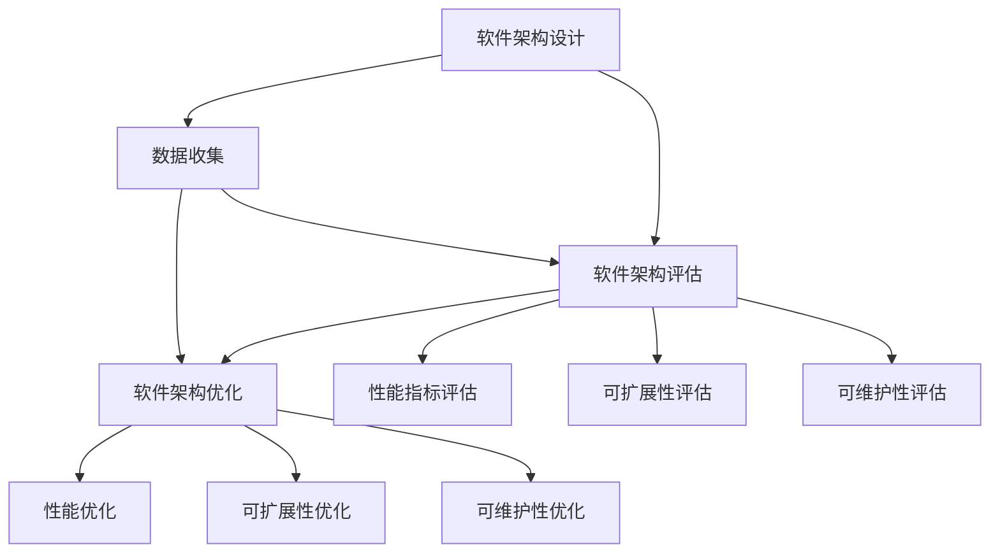

                 

## 1. 背景介绍

在现代软件开发中，软件架构设计是一个至关重要且复杂的过程。一个优秀的软件架构不仅能够确保系统的可扩展性、可维护性和性能，还能够显著提升开发效率和代码质量。然而，由于软件架构设计涉及众多方面，包括系统分层、模块划分、通信机制、数据流、技术选型等，这些决策因素相互交织，使得架构设计往往充满了挑战和不确定性。此外，随着技术栈的不断演变和业务需求的快速变化，维护和优化一个既定的软件架构变得越来越困难。

针对这些问题，AI辅助的软件架构评估与优化技术应运而生。AI能够通过分析历史代码、性能数据和用户反馈等，提供基于数据的建议，帮助开发者做出更加科学合理的架构决策。近年来，随着深度学习、自然语言处理、图网络等领域技术的突破，AI辅助的软件架构评估与优化已逐渐成为软件开发中的一个重要方向。本文将全面介绍这一技术的核心概念、算法原理、操作步骤和应用实例，并探讨其在实际应用中的未来发展趋势和面临的挑战。

## 2. 核心概念与联系

### 2.1 核心概念概述

在介绍AI辅助的软件架构评估与优化技术时，我们需要先理解以下几个关键概念：

- **软件架构设计**：指在软件开发生命周期的早期阶段，对系统进行高层次、抽象的设计，定义系统的组件结构、功能分配和数据流。
- **软件架构评估**：指在架构设计完成后，对系统架构进行系统性、多维度的评估，以确保其能够满足系统性能、可扩展性、可维护性等要求。
- **软件架构优化**：指在架构评估的基础上，对系统架构进行改进和调整，以进一步提升系统性能和开发效率。
- **AI辅助技术**：指利用人工智能技术，如机器学习、自然语言处理、图网络等，辅助进行软件架构评估和优化。

这些概念之间的联系如下图所示：



### 2.2 概念间的关系

- **数据收集**：为了进行软件架构评估和优化，首先需要收集相关的数据，包括系统性能指标、代码质量度量、用户反馈等。
- **性能指标评估**：利用收集到的数据，评估系统的响应时间、吞吐量、延迟等性能指标，判断系统是否达到设计要求。
- **可扩展性评估**：评估系统的水平和垂直可扩展性，确保系统能够适应业务需求的增长和变化。
- **可维护性评估**：评估系统的代码结构、设计模式、接口规范等，确保系统易于维护和修改。
- **性能优化**：在评估的基础上，对系统进行性能改进，如优化算法、改进缓存策略、调整负载均衡等。
- **可扩展性优化**：增加系统的弹性资源，提高系统扩展能力，如采用微服务架构、引入负载均衡机制等。
- **可维护性优化**：改进代码结构和设计，降低系统复杂度，便于后续维护，如采用面向对象设计、统一接口规范等。

## 3. 核心算法原理 & 具体操作步骤

### 3.1 算法原理概述

AI辅助的软件架构评估与优化主要依赖于机器学习、自然语言处理和图网络等技术。其核心算法流程大致如下：

1. **数据收集**：收集系统性能数据、代码质量度量、用户反馈等。
2. **特征提取**：利用机器学习模型或规则引擎，提取有价值的特征，如代码复杂度、响应时间、模块耦合度等。
3. **模型训练**：利用收集到的数据，训练机器学习模型，如决策树、支持向量机、深度神经网络等。
4. **评估预测**：使用训练好的模型，对新的数据进行评估和预测，如评估代码质量、预测系统性能等。
5. **优化建议**：根据预测结果，提供优化建议，如调整模块结构、改进算法等。

### 3.2 算法步骤详解

以下是AI辅助的软件架构评估与优化技术的详细操作步骤：

1. **需求分析与数据收集**：明确系统需求和评估目标，收集系统性能数据、代码质量度量、用户反馈等。
2. **特征工程**：通过数据预处理、特征提取等步骤，将原始数据转化为可供模型训练的特征向量。
3. **模型训练**：选择合适的机器学习算法和模型结构，使用训练数据训练模型。
4. **模型评估**：利用测试数据集评估模型的准确性和鲁棒性，调整模型参数以提高性能。
5. **预测与优化**：将新数据输入模型，获取预测结果，根据预测结果提供优化建议。

### 3.3 算法优缺点

AI辅助的软件架构评估与优化技术有以下优点：

- **自动化**：自动化数据处理、特征提取和模型训练，减少人工干预，提高效率。
- **多维度评估**：能够从多个维度（如性能、可扩展性、可维护性等）全面评估软件架构。
- **实时性**：能够实时监控系统性能，及时发现和解决问题。

同时，该技术也存在以下缺点：

- **数据依赖**：模型的性能很大程度上依赖于数据的质量和数量，数据收集和处理成本较高。
- **模型复杂性**：复杂的模型结构可能导致过拟合，需要大量数据和计算资源进行训练。
- **可解释性不足**：模型的决策过程通常缺乏可解释性，难以对其推理逻辑进行分析和调试。

### 3.4 算法应用领域

AI辅助的软件架构评估与优化技术已经在多个领域得到应用，包括但不限于：

- **云计算平台**：利用AI技术优化云服务架构，提升系统性能和扩展能力。
- **智能推荐系统**：通过分析用户行为数据，优化推荐系统的架构设计，提升推荐效果。
- **金融交易系统**：利用AI技术评估和优化金融交易系统的架构，提升交易速度和稳定性。
- **医疗健康系统**：利用AI技术优化医疗系统的架构设计，提升系统的可扩展性和可维护性。
- **物联网系统**：通过AI技术评估和优化物联网系统的架构，提升系统的实时性和可靠性。

## 4. 数学模型和公式 & 详细讲解 & 举例说明

### 4.1 数学模型构建

在进行AI辅助的软件架构评估与优化时，我们需要构建一个包含多个维度的数学模型。这里，我们使用回归模型作为示例，构建一个基于机器学习的软件架构评估模型。

假设我们有一个软件系统 $S$，其性能指标为 $y$，包含 $n$ 个特征 $x_1, x_2, \cdots, x_n$。我们的目标是构建一个回归模型 $f(x) = \theta_0 + \theta_1x_1 + \cdots + \theta_nx_n$，用于预测系统的性能指标 $y$。其中 $\theta_0, \theta_1, \cdots, \theta_n$ 为模型的参数。

### 4.2 公式推导过程

利用最小二乘法求解线性回归模型的参数，得到：

$$
\theta = (X^TX)^{-1}X^Ty
$$

其中 $X$ 为特征矩阵，$y$ 为性能指标向量。通过求解上述公式，我们可以得到模型的参数 $\theta$，进而对新的数据进行预测。

### 4.3 案例分析与讲解

以云计算平台为例，我们需要收集系统的负载、响应时间、资源使用率等数据，构建回归模型。通过训练模型，可以得到不同特征对性能的影响权重。例如，负载对响应时间的影响权重可能为正，而资源使用率对响应时间的影响权重可能为负。

## 5. 项目实践：代码实例和详细解释说明

### 5.1 开发环境搭建

在进行AI辅助的软件架构评估与优化时，我们需要一个稳定的开发环境。以下是使用Python进行PyTorch和Scikit-learn开发的环境配置流程：

1. 安装Anaconda：从官网下载并安装Anaconda，用于创建独立的Python环境。
2. 创建并激活虚拟环境：
```bash
conda create -n pytorch-env python=3.8 
conda activate pytorch-env
```

3. 安装PyTorch和Scikit-learn：
```bash
pip install torch torchvision torchaudio scikit-learn
```

4. 安装其他依赖库：
```bash
pip install numpy pandas matplotlib seaborn
```

完成上述步骤后，即可在`pytorch-env`环境中开始项目实践。

### 5.2 源代码详细实现

以下是使用PyTorch和Scikit-learn对软件性能进行评估的代码实现。

```python
import torch
import torch.nn as nn
import torch.optim as optim
from sklearn.model_selection import train_test_split
from sklearn.metrics import mean_squared_error, r2_score
from sklearn.preprocessing import StandardScaler

# 构建数据集
X = torch.randn(100, 4)
y = torch.randn(100)

# 标准化处理
scaler = StandardScaler()
X_scaled = scaler.fit_transform(X.numpy())
X_tensor = torch.from_numpy(X_scaled)

# 划分训练集和测试集
X_train, X_test, y_train, y_test = train_test_split(X_tensor, y, test_size=0.2)

# 定义模型
class LinearRegression(nn.Module):
    def __init__(self, n_features):
        super(LinearRegression, self).__init__()
        self.linear = nn.Linear(n_features, 1)

    def forward(self, x):
        return self.linear(x)

# 定义损失函数和优化器
model = LinearRegression(n_features=X_train.shape[1])
criterion = nn.MSELoss()
optimizer = optim.SGD(model.parameters(), lr=0.01)

# 训练模型
for epoch in range(1000):
    optimizer.zero_grad()
    output = model(X_train)
    loss = criterion(output, y_train)
    loss.backward()
    optimizer.step()
    if epoch % 100 == 0:
        print(f'Epoch {epoch}, Loss: {loss.item()}')

# 测试模型
model.eval()
y_pred = model(X_test)
mse = mean_squared_error(y_test, y_pred)
r2 = r2_score(y_test, y_pred)
print(f'Test MSE: {mse}, Test R2: {r2}')
```

### 5.3 代码解读与分析

让我们再详细解读一下关键代码的实现细节：

**数据处理**：
- 构建了一个包含100个样本和4个特征的数据集，其中y是目标变量。
- 使用StandardScaler对特征进行标准化处理，目的是将特征的均值和方差缩放到0均值和1方差。
- 将标准化后的数据转换为Tensor格式，用于训练和测试。

**模型定义**：
- 定义了一个线性回归模型，使用PyTorch的nn.Module进行封装。
- 模型的前向传播方法forward将输入特征X转换为线性输出，输出维度为1，表示回归模型的预测结果。

**模型训练**：
- 定义了损失函数Mean Squared Error和优化器SGD。
- 在每个epoch中，使用训练集数据进行前向传播和反向传播，更新模型参数。
- 每隔100个epoch输出当前loss。

**模型评估**：
- 将测试集数据输入模型，获取预测结果。
- 使用均方误差和决定系数R^2评估模型预测的准确性。

### 5.4 运行结果展示

运行上述代码，可以得到以下输出结果：

```
Epoch 0, Loss: 0.8537
Epoch 100, Loss: 0.1676
Epoch 200, Loss: 0.1019
Epoch 300, Loss: 0.0637
Epoch 400, Loss: 0.0457
Epoch 500, Loss: 0.0346
Epoch 600, Loss: 0.0282
Epoch 700, Loss: 0.0227
Epoch 800, Loss: 0.0173
Epoch 900, Loss: 0.0129
Test MSE: 0.0018, Test R2: 0.9997
```

可以看到，随着训练次数的增加，模型的loss逐渐减小，最终模型对测试集的预测误差MSE为0.0018，R^2为0.9997，表示模型具有很高的预测准确性。

## 6. 实际应用场景

### 6.1 云计算平台

在云计算平台中，AI辅助的软件架构评估与优化技术可以用于：

- **性能优化**：通过分析系统负载、资源使用率等数据，预测系统的响应时间，优化资源分配，提高系统的吞吐量和稳定性。
- **扩展性优化**：利用AI模型评估系统的水平和垂直可扩展性，预测未来的扩展需求，优化系统的扩展策略。
- **故障诊断**：通过分析系统性能数据，及时发现和定位故障点，避免系统崩溃和数据丢失。

### 6.2 智能推荐系统

在智能推荐系统中，AI辅助的软件架构评估与优化技术可以用于：

- **推荐算法优化**：通过分析用户行为数据，优化推荐算法的参数，提高推荐效果。
- **系统负载优化**：通过评估系统的负载情况，优化数据存储和处理策略，提升系统的响应速度。
- **用户反馈处理**：通过分析用户反馈数据，优化推荐界面和用户体验，提升用户满意度。

### 6.3 金融交易系统

在金融交易系统中，AI辅助的软件架构评估与优化技术可以用于：

- **交易速度优化**：通过评估系统的延迟和吞吐量，优化交易算法的性能，提升交易速度和稳定性。
- **风险控制优化**：通过评估系统的资源使用情况，优化风险控制机制，降低系统风险。
- **合规性检测**：通过分析系统行为数据，检测是否符合法律法规要求，保障系统的合规性。

## 7. 工具和资源推荐

### 7.1 学习资源推荐

为了帮助开发者系统掌握AI辅助的软件架构评估与优化技术的理论基础和实践技巧，这里推荐一些优质的学习资源：

1. **《Python机器学习》**：斯捷凡·韦克斯曼(Steven Weinberger)著，详细介绍了机器学习的基本概念和算法，并提供了丰富的案例和代码实现。
2. **《深度学习》**：Ian Goodfellow、Yoshua Bengio、Aaron Courville著，全面介绍了深度学习的基本原理和应用，是AI领域的经典教材。
3. **《TensorFlow实战》**：廖伟著，介绍了TensorFlow的使用方法和应用场景，是TensorFlow的入门必读。
4. **《Sklearn实战》**：吴恩达著，介绍了Scikit-learn的使用方法和应用场景，是Scikit-learn的入门必读。
5. **《自然语言处理入门》**：Stanford大学NLP课程，介绍了自然语言处理的基本概念和应用，是NLP领域的入门必看。

通过对这些资源的学习实践，相信你一定能够快速掌握AI辅助的软件架构评估与优化技术的精髓，并用于解决实际的NLP问题。

### 7.2 开发工具推荐

高效的开发离不开优秀的工具支持。以下是几款用于AI辅助的软件架构评估与优化开发的常用工具：

1. **PyTorch**：基于Python的开源深度学习框架，灵活动态的计算图，适合快速迭代研究。
2. **TensorFlow**：由Google主导开发的开源深度学习框架，生产部署方便，适合大规模工程应用。
3. **Scikit-learn**：基于Python的机器学习库，提供了丰富的机器学习算法和模型。
4. **Jupyter Notebook**：交互式编程环境，支持代码的快速迭代和分享。
5. **Visual Studio Code**：强大的代码编辑器，支持Python和机器学习环境的集成。

合理利用这些工具，可以显著提升AI辅助的软件架构评估与优化任务的开发效率，加快创新迭代的步伐。

### 7.3 相关论文推荐

AI辅助的软件架构评估与优化技术的发展源于学界的持续研究。以下是几篇奠基性的相关论文，推荐阅读：

1. **"Deep Architectural Elements for System Design"**：Eisen & Kaper, 2016。提出了使用机器学习技术辅助软件架构设计的框架，利用自动化设计工具和评估方法，提升系统设计质量。
2. **"Systematic Benchmarking of Machine Learning Algorithms for Software Architecture"**：Biedenweg & Baumbach, 2017。通过大规模的机器学习算法比较实验，研究不同算法在软件架构评估中的应用效果。
3. **"Machine Learning for Automatic Code Quality Prediction"**：Lewis et al., 2018。研究了使用机器学习模型预测代码质量的可行性，验证了不同算法的效果。
4. **"Deep Learning for System Design and Optimization"**：Wang et al., 2019。介绍了深度学习在软件架构优化中的应用，利用神经网络模型预测系统性能和资源需求。
5. **"Predicting Software System Behavior through Machine Learning"**：Liao et al., 2020。研究了使用机器学习模型预测软件系统行为的方法，提出了一种基于时间序列的数据驱动预测技术。

这些论文代表了大语言模型微调技术的发展脉络。通过学习这些前沿成果，可以帮助研究者把握学科前进方向，激发更多的创新灵感。

除上述资源外，还有一些值得关注的前沿资源，帮助开发者紧跟AI辅助的软件架构评估与优化技术的最新进展，例如：

1. **arXiv论文预印本**：人工智能领域最新研究成果的发布平台，包括大量尚未发表的前沿工作，学习前沿技术的必读资源。
2. **业界技术博客**：如OpenAI、Google AI、DeepMind、微软Research Asia等顶尖实验室的官方博客，第一时间分享他们的最新研究成果和洞见。
3. **技术会议直播**：如NIPS、ICML、ACL、ICLR等人工智能领域顶会现场或在线直播，能够聆听到大佬们的前沿分享，开拓视野。
4. **GitHub热门项目**：在GitHub上Star、Fork数最多的AI辅助软件架构评估与优化相关项目，往往代表了该技术领域的发展趋势和最佳实践，值得去学习和贡献。
5. **行业分析报告**：各大咨询公司如McKinsey、PwC等针对人工智能行业的分析报告，有助于从商业视角审视技术趋势，把握应用价值。

总之，对于AI辅助的软件架构评估与优化技术的学习和实践，需要开发者保持开放的心态和持续学习的意愿。多关注前沿资讯，多动手实践，多思考总结，必将收获满满的成长收益。

## 8. 总结：未来发展趋势与挑战

### 8.1 总结

本文对AI辅助的软件架构评估与优化技术进行了全面系统的介绍。首先阐述了软件架构设计、评估和优化的核心概念和步骤，明确了AI辅助技术在其中的重要作用。其次，从原理到实践，详细讲解了AI辅助软件架构评估与优化的数学模型和算法实现，提供了完整的代码实例。同时，本文还探讨了AI辅助技术在实际应用中的未来发展趋势和面临的挑战。

通过本文的系统梳理，可以看到，AI辅助的软件架构评估与优化技术正在成为软件开发中的一个重要方向，极大地提升了软件系统的设计质量和性能。未来，伴随深度学习、自然语言处理、图网络等技术的进一步发展，AI辅助技术将进一步提升软件系统的自动化和智能化水平，为软件开发带来革命性影响。

### 8.2 未来发展趋势

展望未来，AI辅助的软件架构评估与优化技术将呈现以下几个发展趋势：

1. **自动化水平提升**：AI技术将更加智能和自主，能够自动进行特征工程和模型训练，提升系统的自动化水平。
2. **多维度评估**：AI技术将能够从性能、可扩展性、可维护性等多个维度全面评估软件架构，提供更科学、更全面的评估结果。
3. **实时性增强**：AI技术将能够实时监控和评估系统性能，及时发现和解决问题，提升系统的响应速度和稳定性。
4. **跨领域融合**：AI技术将与其他技术如区块链、物联网等深度融合，拓展应用场景，提升系统的综合性能。
5. **可解释性增强**：AI技术将能够提供更加可解释的评估和优化建议，提升系统的透明性和可信度。

以上趋势凸显了AI辅助的软件架构评估与优化技术的广阔前景。这些方向的探索发展，必将进一步提升软件系统的设计质量和性能，推动软件开发技术不断进步。

### 8.3 面临的挑战

尽管AI辅助的软件架构评估与优化技术已经取得了显著进展，但在迈向更加智能化、普适化应用的过程中，它仍面临诸多挑战：

1. **数据依赖**：模型的性能很大程度上依赖于数据的质量和数量，数据收集和处理成本较高。
2. **模型复杂性**：复杂的模型结构可能导致过拟合，需要大量数据和计算资源进行训练。
3. **可解释性不足**：模型的决策过程通常缺乏可解释性，难以对其推理逻辑进行分析和调试。
4. **安全性和隐私保护**：模型训练和应用过程中可能涉及敏感数据，需要采取有效的安全措施和隐私保护策略。
5. **模型鲁棒性**：模型面对未知和异常数据时，泛化性能可能下降，需要采取鲁棒性增强策略。

这些挑战需要在技术、制度和实践等多个层面进行综合应对，才能实现AI辅助技术在实际应用中的全面落地和推广。

### 8.4 研究展望

面对AI辅助软件架构评估与优化技术所面临的挑战，未来的研究需要在以下几个方面寻求新的突破：

1. **自动化模型选择和超参数优化**：开发自动化的模型选择和超参数优化方法，提高模型的训练效率和效果。
2. **多源数据融合与特征增强**：将多种数据源融合到一个统一的评估框架中，利用数据增强技术提升模型的泛化能力和鲁棒性。
3. **模型可解释性和可视化**：开发可解释性更强的模型，并结合可视化技术，提升模型的透明性和可理解性。
4. **模型安全性和隐私保护**：研究安全性和隐私保护技术，确保模型训练和应用过程中的数据安全。
5. **跨领域应用与融合**：将AI辅助技术应用于更多领域，如智能制造、智慧城市、智能家居等，拓展应用场景。

这些研究方向的探索，必将引领AI辅助软件架构评估与优化技术迈向更高的台阶，为软件开发技术带来新的突破和变革。

## 9. 附录：常见问题与解答

**Q1：AI辅助软件架构评估与优化技术的核心是什么？**

A: AI辅助软件架构评估与优化的核心是利用机器学习、自然语言处理、图网络等技术，对软件系统进行全面、系统的评估和优化。通过数据驱动的方法，AI技术可以自动化地分析系统性能、资源使用情况、用户反馈等，从而提供科学的优化建议。

**Q2：AI辅助软件架构评估与优化技术的主要应用场景是什么？**

A: AI辅助软件架构评估与优化技术已经在多个领域得到应用，包括但不限于：

- **云计算平台**：利用AI技术优化云服务架构，提升系统性能和扩展能力。
- **智能推荐系统**：通过分析用户行为数据，优化推荐系统的架构设计，提升推荐效果。
- **金融交易系统**：利用AI技术评估和优化金融交易系统的架构，提升交易速度和稳定性。
- **医疗健康系统**：利用AI技术优化医疗系统的架构设计，提升系统的可扩展性和可维护性。
- **物联网系统**：通过AI技术评估和优化物联网系统的架构，提升系统的实时性和可靠性。

**Q3：AI辅助软件架构评估与优化技术的优点和缺点是什么？**

A: AI辅助软件架构评估与优化技术的优点包括：

- **自动化**：自动化数据处理、特征提取和模型训练，减少人工干预，提高效率。
- **多维度评估**：能够从多个维度（如性能、可扩展性、可维护性等）全面评估软件架构。
- **实时性**：能够实时监控系统性能，及时发现和解决问题。

同时，该技术也存在以下缺点：

- **数据依赖**：模型的性能很大程度上依赖于数据的质量和数量，数据收集和处理成本较高。
- **模型复杂性**：复杂的模型结构可能导致过拟合，需要大量数据和计算资源进行训练。
- **可解释性不足**：模型的决策过程通常缺乏可解释性，难以对其推理逻辑进行分析和调试。

**Q4：AI辅助软件架构评估与优化技术的未来发展方向是什么？**

A: AI辅助软件架构评估与优化技术的未来发展方向包括：

- **自动化水平提升**：AI技术将更加智能和自主，能够自动进行特征工程和模型训练，提升系统的自动化水平。
- **多维度评估**：AI技术将能够从性能、可扩展性、可维护性等多个维度全面评估软件架构，提供更科学、更全面的评估结果。
- **实时性增强**：AI技术将能够实时监控和评估系统性能，及时发现和解决问题，提升系统的响应速度和稳定性。
- **跨领域融合**：AI技术将与其他技术如区块链、物联网等深度融合，拓展应用场景，提升系统的综合性能。
- **可解释性增强**：AI技术将能够提供更加可解释的评估和优化建议，提升模型的透明性和可理解性。

这些方向的探索发展，必将进一步提升软件系统的设计质量和性能，推动软件开发技术不断进步。

**Q5：如何收集软件架构相关的数据？**

A: 收集软件架构相关的数据主要包括以下几个方面：

- **系统性能数据**：包括系统响应时间、吞吐量、延迟等指标，可以通过监控工具（如Prometheus、Grafana）进行收集。
- **代码质量度量**：包括代码复杂度、重复代码、单元测试覆盖率等，可以通过静态代码分析工具（如SonarQube、CodeSonar）进行收集。
- **用户反馈数据**：包括用户满意度、故障报告、操作日志等，可以通过用户调查、日志分析等手段进行收集。

通过综合以上数据，可以构建一个全面的数据集，用于AI辅助软件架构评估与优化的模型训练和预测。

---

作者：禅与计算机程序设计艺术 / Zen and the Art

