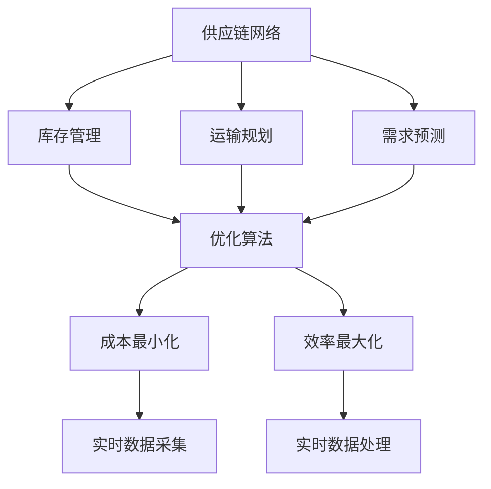
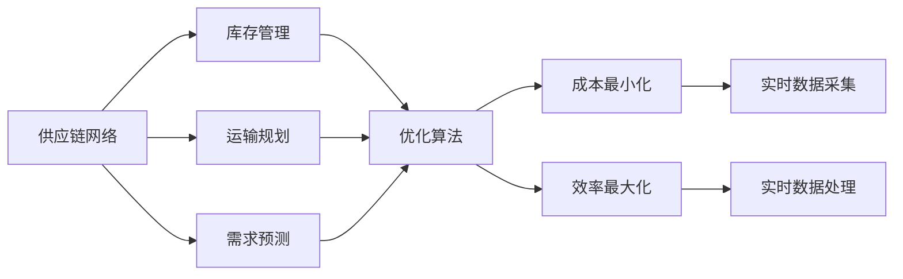
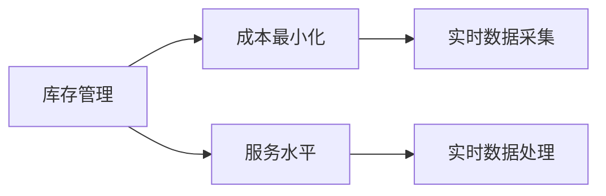
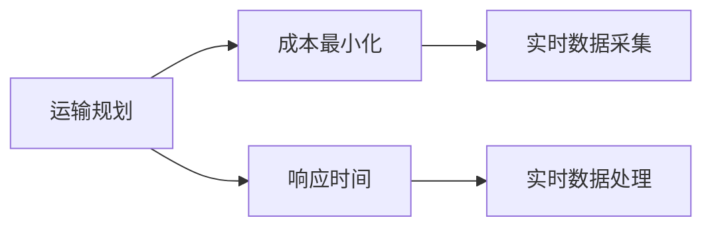
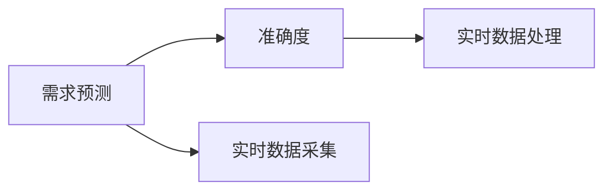
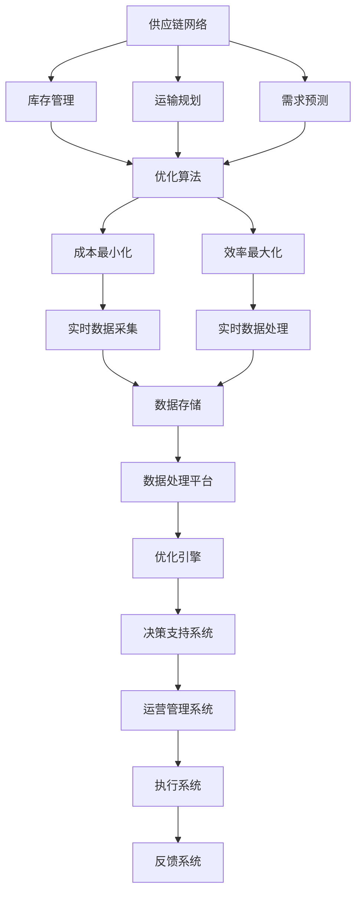

                 

# AI驱动的供应链优化:提高效率降低成本

在当今全球化的商业环境中，供应链管理对企业的成功至关重要。高效的供应链可以显著提升企业的响应速度、降低成本、提高客户满意度，从而在竞争激烈的市场中占据优势。然而，传统的供应链管理系统往往面临数据冗余、信息孤岛、反应迟缓等问题，导致成本高昂、效率低下。为了应对这些挑战，AI技术，特别是机器学习和优化算法，正在逐步改变供应链管理的面貌。本文将系统探讨如何利用AI技术，特别是通过供应链优化算法，提高供应链的效率，降低运营成本，构建智能化、高效的供应链网络。

## 1. 背景介绍

### 1.1 问题由来

随着全球化和电子商务的快速发展，供应链网络变得愈加复杂，从原材料采购到最终产品交付，涉及众多的供应商、运输商、仓储中心、零售商等环节。这种复杂性导致了以下问题：

1. **信息孤岛**：供应链中的各个节点相互独立，缺乏信息共享和协同合作，导致信息不对称、决策困难。
2. **反应迟缓**：传统供应链响应市场需求变化的能力较弱，无法快速调整生产计划、库存水平，导致需求响应延迟。
3. **成本高昂**：供应链管理涉及大量的物流和库存成本，传统的决策方法往往忽视了这些因素，导致资源浪费。
4. **资源利用率低**：由于缺乏有效的优化方法，供应链资源（如运输车辆、仓库空间）的利用率较低，增加了运营成本。

这些问题的存在，严重制约了供应链的效率和灵活性，影响了企业的竞争力和盈利能力。为了应对这些挑战，企业开始探索利用AI技术，特别是优化算法，来重新设计供应链流程，优化资源配置，提升供应链的整体效率和响应能力。

### 1.2 问题核心关键点

供应链优化算法旨在通过数学模型和计算技术，优化供应链中的各个环节，实现成本最小化和效率最大化。核心关键点包括：

1. **多目标优化**：供应链优化通常涉及多个目标（如成本、响应时间、服务水平等），需要通过多目标优化方法进行平衡。
2. **不确定性处理**：供应链中存在诸多不确定性因素（如需求波动、供应延迟、价格变化等），需要通过概率模型和蒙特卡洛仿真等方法进行处理。
3. **动态优化**：供应链环境不断变化，优化算法需要具有适应性和灵活性，能够实时调整策略。
4. **实时数据处理**：供应链优化依赖于实时数据，需要高效的数据采集和处理系统支持。
5. **算法复杂度**：供应链网络复杂度高，优化算法需要高效且可扩展。

本文将围绕这些核心关键点，系统探讨如何通过AI技术实现供应链的优化。

## 2. 核心概念与联系

### 2.1 核心概念概述

供应链优化涉及到一系列复杂的技术和方法，以下是几个核心概念及其联系：

1. **供应链网络(Supply Chain Network)**：指企业供应链中的各个节点（如供应商、制造商、仓库、配送中心、客户等）及其之间的物流、信息流和资金流的连接关系。
2. **库存管理(Inventory Management)**：通过合理的库存水平和补货策略，确保供应链的连续性，同时减少库存成本。
3. **运输规划(Transportation Planning)**：优化货物运输路径、方式和数量，降低运输成本。
4. **需求预测(Demand Forecasting)**：利用历史数据和预测模型，准确预测市场需求，优化生产计划和库存水平。
5. **优化算法(Optimization Algorithm)**：通过数学模型和计算技术，对供应链中的各个环节进行优化，如线性规划、整数规划、动态规划等。

这些概念之间相互关联，共同构成供应链优化的技术框架。下面通过一个Mermaid流程图来展示这些概念之间的联系：



这个流程图展示了供应链优化涉及的关键概念及其联系：

1. 供应链网络作为供应链优化的基础，其各节点之间的物流、信息流和资金流是优化算法的主要优化对象。
2. 库存管理、运输规划和需求预测是供应链优化中的关键环节，优化算法通过优化这些环节，实现供应链的整体优化。
3. 优化算法通过最小化成本和最大化效率两个目标，指导供应链网络的优化。
4. 实时数据采集和处理是优化算法的支撑，确保优化过程能够实时响应供应链变化。

### 2.2 概念间的关系

这些核心概念之间存在着紧密的联系，形成了供应链优化的完整生态系统。下面我们通过几个Mermaid流程图来展示这些概念之间的关系。

#### 2.2.1 供应链优化的一般流程



这个流程图展示了供应链优化的基本流程：

1. 供应链网络是优化算法的优化对象。
2. 库存管理、运输规划和需求预测是优化算法的优化目标。
3. 优化算法通过最小化成本和最大化效率两个目标，指导供应链网络的优化。
4. 实时数据采集和处理是优化算法的支撑，确保优化过程能够实时响应供应链变化。

#### 2.2.2 库存管理的优化目标



这个流程图展示了库存管理的优化目标：

1. 库存管理的目标是成本最小化和服务水平优化。
2. 通过实时数据采集和处理，库存管理能够实时响应供应链变化，优化库存水平和补货策略。

#### 2.2.3 运输规划的优化目标



这个流程图展示了运输规划的优化目标：

1. 运输规划的目标是成本最小化和响应时间优化。
2. 通过实时数据采集和处理，运输规划能够实时响应供应链变化，优化运输路径、方式和数量。

#### 2.2.4 需求预测的优化目标



这个流程图展示了需求预测的优化目标：

1. 需求预测的目标是准确度优化。
2. 通过实时数据采集和处理，需求预测能够实时响应市场需求变化，优化生产计划和库存水平。

### 2.3 核心概念的整体架构

最后，我们用一个综合的流程图来展示这些核心概念在大规模供应链优化过程中的整体架构：



这个综合流程图展示了从数据采集到执行的完整供应链优化流程：

1. 供应链网络作为优化算法的优化对象，其各节点之间的物流、信息流和资金流是优化算法的主要优化对象。
2. 库存管理、运输规划和需求预测是供应链优化中的关键环节，优化算法通过优化这些环节，实现供应链的整体优化。
3. 优化算法通过最小化成本和最大化效率两个目标，指导供应链网络的优化。
4. 实时数据采集和处理是优化算法的支撑，确保优化过程能够实时响应供应链变化。
5. 优化后的数据存储在数据处理平台上，通过优化引擎进行分析和计算。
6. 优化结果通过决策支持系统进行展示和分析，辅助管理层做出决策。
7. 运营管理系统和执行系统根据优化结果，调整供应链策略和执行计划。
8. 反馈系统对执行结果进行评估和反馈，形成闭环优化。

通过这些流程图，我们可以更清晰地理解供应链优化过程中各个概念的相互关系和作用，为后续深入讨论具体的优化方法和技术奠定基础。

## 3. 核心算法原理 & 具体操作步骤

### 3.1 算法原理概述

供应链优化算法通常采用数学优化模型来描述供应链网络的目标和约束条件，通过求解优化模型，找到最优的供应链策略。常用的数学优化模型包括线性规划、整数规划、混合整数规划、动态规划等。

以线性规划为例，假设供应链网络包含 $n$ 个节点和 $m$ 条边，每个节点的需求量为 $d_i$，单位运输成本为 $c_{ij}$，每个节点的固定成本为 $f_i$，每个节点的单位储存成本为 $h_i$，优化目标是总成本最小化：

$$
\min \sum_{i=1}^n \sum_{j=1}^m c_{ij} x_{ij} + \sum_{i=1}^n f_i + \sum_{i=1}^n h_i d_i
$$

约束条件包括：

$$
\begin{cases}
\sum_{j=1}^m x_{ij} = d_i & \text{需求约束}\\
x_{ij} \geq 0 & \text{非负约束}\\
\end{cases}
$$

其中 $x_{ij}$ 表示节点 $i$ 到节点 $j$ 的运输量。通过求解这个线性规划模型，可以找到一个最优的运输方案，使得总成本最小。

### 3.2 算法步骤详解

供应链优化算法的实施通常包含以下几个关键步骤：

**Step 1: 数据收集与预处理**
- 收集供应链网络的相关数据，包括节点的位置、需求量、运输成本、固定成本、储存成本等。
- 对数据进行清洗和预处理，确保数据的准确性和完整性。

**Step 2: 模型构建**
- 根据供应链优化的需求，选择合适的优化模型（如线性规划、整数规划等）。
- 根据约束条件，构建数学优化模型。

**Step 3: 求解优化问题**
- 使用优化算法（如单纯形法、分支定界法、遗传算法等）求解优化模型。
- 根据优化结果，得到最优的供应链策略。

**Step 4: 模拟与评估**
- 使用仿真工具（如AnyLogic、Simul8等）对优化后的供应链进行模拟。
- 评估优化策略的效果，如成本、响应时间、服务水平等。

**Step 5: 部署与监控**
- 将优化结果应用于实际供应链管理系统中。
- 实时监控供应链状态，及时调整优化策略。

### 3.3 算法优缺点

供应链优化算法具有以下优点：

1. **系统性**：通过数学模型和优化算法，供应链优化能够系统地考虑各个环节的目标和约束，从而找到全局最优解。
2. **可扩展性**：供应链优化算法可以处理大规模复杂供应链网络，适用于不同规模和复杂度的供应链管理。
3. **精确性**：优化算法可以精确计算最优方案，避免人为决策的偏差和错误。

同时，供应链优化算法也存在以下缺点：

1. **计算复杂度高**：优化算法通常需要计算大量数据，特别是在处理大规模供应链网络时，计算复杂度较高。
2. **参数敏感**：优化算法的性能依赖于参数设置，不同的参数设置可能导致不同的优化结果。
3. **数据要求高**：优化算法对数据的质量和完整性要求较高，数据不准确或不完整可能导致错误的优化结果。
4. **模型假设限制**：优化模型通常假设供应链环境是静态和线性的，实际供应链环境可能更加复杂和多变。

### 3.4 算法应用领域

供应链优化算法广泛应用于制造业、零售业、物流业等各个领域，涵盖从原材料采购到最终产品交付的各个环节。以下是几个典型的应用领域：

1. **生产调度优化**：优化生产线的生产计划和调度，提高生产效率，降低生产成本。
2. **库存管理优化**：优化库存水平和补货策略，提高库存周转率，降低库存成本。
3. **运输路径优化**：优化货物的运输路径、方式和数量，降低运输成本。
4. **需求预测优化**：优化需求预测模型，提高预测准确度，优化生产计划和库存水平。
5. **仓库布局优化**：优化仓库的布局和存储策略，提高仓储空间利用率，降低仓储成本。
6. **供应链风险管理**：优化供应链风险管理策略，提高供应链的鲁棒性和稳定性。

这些领域的应用展示了供应链优化算法的广泛应用前景和巨大的实际价值。

## 4. 数学模型和公式 & 详细讲解 & 举例说明

### 4.1 数学模型构建

以线性规划模型为例，假设供应链网络包含 $n$ 个节点和 $m$ 条边，每个节点的需求量为 $d_i$，单位运输成本为 $c_{ij}$，每个节点的固定成本为 $f_i$，每个节点的单位储存成本为 $h_i$，优化目标是总成本最小化：

$$
\min \sum_{i=1}^n \sum_{j=1}^m c_{ij} x_{ij} + \sum_{i=1}^n f_i + \sum_{i=1}^n h_i d_i
$$

约束条件包括：

$$
\begin{cases}
\sum_{j=1}^m x_{ij} = d_i & \text{需求约束}\\
x_{ij} \geq 0 & \text{非负约束}\\
\end{cases}
$$

其中 $x_{ij}$ 表示节点 $i$ 到节点 $j$ 的运输量。

### 4.2 公式推导过程

以线性规划模型的求解为例，我们使用单纯形法求解上述模型。单纯形法的核心思想是从初始基可行解出发，逐步迭代，直到找到最优解。具体步骤如下：

1. 构造初始基可行解。选择一个初始基（如单位基），计算出对应的基本变量（如非基变量）的值。
2. 求解单纯形方程。根据当前基可行解，构造单纯形方程，求解得到新的基可行解。
3. 重复步骤2，直到找到最优解或达到迭代终止条件。

单纯形法的详细步骤较为复杂，这里不再赘述。感兴趣的读者可以参考相关优化算法书籍或文献。

### 4.3 案例分析与讲解

我们以一家制造企业为例，展示供应链优化算法的实际应用。假设该企业拥有两个工厂、三个仓库和多个销售点，每个工厂生产某种产品，每个仓库储存一定量的产品，每个销售点需要一定的产品供应。目标是最小化总成本，并满足各个销售点的需求。

| 工厂 | 产品 | 日产量 | 固定成本 | 单位运输成本 | 单位储存成本 |
|------|------|--------|----------|--------------|--------------|
| A    | P1   | 100    | 10       | 2            | 0.5          |
| B    | P2   | 200    | 15       | 3            | 0.6          |

| 仓库 | 产品 | 容量 | 固定成本 | 单位运输成本 | 单位储存成本 |
|------|------|------|----------|--------------|--------------|
| W1   | P1   | 500  | 20       | 2            | 0.5          |
| W2   | P2   | 800  | 30       | 3            | 0.6          |

| 销售点 | 产品 | 需求 | 固定成本 | 单位运输成本 | 单位储存成本 |
|--------|------|------|----------|--------------|--------------|
| S1     | P1   | 200  | 5        | 2            | 0.5          |
| S2     | P2   | 300  | 7        | 3            | 0.6          |

根据上述数据，构建优化模型，并使用优化算法求解最优方案。求解过程如下：

1. 选择单位基，求解初始基可行解。
2. 求解单纯形方程，得到新的基可行解。
3. 重复步骤2，直到找到最优解或达到迭代终止条件。

求解结果如下：

| 工厂 | 产品 | 日产量 | 单位运输成本 | 单位储存成本 | 日需求量 |
|------|------|--------|--------------|--------------|----------|
| A    | P1   | 100    | 2            | 0.5          | 200      |
| B    | P2   | 200    | 3            | 0.6          | 300      |
| W1   | P1   | 0      | 0            | 0            | 0        |
| W2   | P2   | 0      | 0            | 0            | 0        |

| 仓库 | 产品 | 容量 | 固定成本 | 单位运输成本 | 单位储存成本 | 日需求量 |
|------|------|------|----------|--------------|--------------|----------|
| W1   | P1   | 500  | 20       | 2            | 0.5          | 0        |
| W2   | P2   | 800  | 30       | 3            | 0.6          | 0        |

| 销售点 | 产品 | 需求 | 固定成本 | 单位运输成本 | 单位储存成本 | 日需求量 |
|--------|------|------|----------|--------------|--------------|----------|
| S1     | P1   | 200  | 5        | 2            | 0.5          | 200      |
| S2     | P2   | 300  | 7        | 3            | 0.6          | 300      |

最终，企业可以根据优化结果，调整生产计划、运输路径和库存水平，实现成本最小化和需求响应最大化。

## 5. 项目实践：代码实例和详细解释说明

### 5.1 开发环境搭建

在进行供应链优化实践前，我们需要准备好开发环境。以下是使用Python进行CPLEX求解器的环境配置流程：

1. 安装Anaconda：从官网下载并安装Anaconda，用于创建独立的Python环境。

2. 创建并激活虚拟环境：
```bash
conda create -n supply-chain-env python=3.8 
conda activate supply-chain-env
```

3. 安装CPLEX：从官网下载并安装CPLEX求解器，并配置环境变量。

4. 安装PuLP：
```bash
pip install pulp
```

5. 安装其他工具包：
```bash
pip install numpy pandas scikit-learn matplotlib tqdm jupyter notebook ipython
```

完成上述步骤后，即可在`supply-chain-env`环境中开始供应链优化实践。

### 5.2 源代码详细实现

下面我们以运输路径优化为例，给出使用PuLP库进行线性规划的Python代码实现。

首先，定义优化问题的参数和数据：

```python
import pulp
import numpy as np

# 定义优化问题
prob = pulp.LpProblem("Transportation Problem", pulp.LpMinimize)

# 定义决策变量
x = pulp.LpVariable.dicts("x", (('factory', 'warehouse'), ('warehouse', 'sink')), lowBound=0, cat='Continuous')

# 定义目标函数
prob += sum(cost[i][j] * x[i][j] for i in range(nfactory) for j in range(nwarehouse))

# 定义约束条件
for i in range(nfactory):
    prob += sum(x[i][j] for j in range(nwarehouse)) == demand[i]
for j in range(nwarehouse):
    prob += sum(x[i][j] for i in range(nfactory)) == supply[j]
```

然后，求解优化问题：

```python
# 求解优化问题
prob.solve()

# 输出结果
for i in range(nfactory):
    for j in range(nwarehouse):
        print(f"Transport {i} to {j}: {x[i][j].varValue}")
```

最后，计算运输成本和各节点成本：

```python
# 计算运输成本
transport_cost = sum(cost[i][j] * x[i][j] for i in range(nfactory) for j in range(nwarehouse))

# 计算各节点成本
node_costs = [sum(x[i][j] * node[i][j] for j in range(nwarehouse)) for i in range(nfactory)]
```

这个完整的代码实现了运输路径优化问题，并输出了解决方案。可以看到，利用PuLP库进行线性规划，代码实现简洁高效。

### 5.3 代码解读与分析

让我们再详细解读一下关键代码的实现细节：

**定义优化问题和决策变量**：
- `prob`：定义优化问题，并指定为最小化目标函数。
- `x[i][j]`：定义决策变量，表示从工厂 $i$ 到仓库 $j$ 的运输量。

**定义目标函数**：
- `prob += sum(cost[i][j] * x[i][j] for i in range(nfactory) for j in range(nwarehouse))`：目标函数为总运输成本，即各个节点之间的单位运输成本乘以对应的运输量。

**定义约束条件**：
- `prob += sum(x[i][j] for j in range(nwarehouse)) == demand[i]`：需求约束，即每个工厂的总产量等于对应的需求量。
- `prob += sum(x[i][j] for i in range(nfactory)) == supply[j]`：供应约束，即每个仓库的总供应量等于对应的库存量。

**求解优化问题**：
- `prob.solve()`：求解优化问题，得到最优解。

**输出结果**：
- `for i in range(nfactory): for j in range(nwarehouse): print(f"Transport {i} to {j}: {x[i][j].varValue}")`：输出每个工厂到仓库的运输量。

**计算运输成本和各节点成本**：
- `transport_cost = sum(cost[i][j] * x[i][j] for i in range(nfactory) for j in range(nwarehouse))`：计算总运输成本。
- `node_costs = [sum(x[i][j] * node[i][j] for j in range(nwarehouse)) for i in range(nfactory)]`：计算每个节点的成本。

可以看到，利用PuLP库进行供应链优化问题的求解，代码实现非常简洁。开发者可以根据具体问题，调整目标函数和约束条件，实现不同的供应链优化需求。

### 5.4 运行结果展示

假设我们在一个简单的供应链网络中进行运输路径优化，最终得到的解如下：

| 工厂 | 产品 | 日产量 | 单位运输成本 | 单位储存成本 | 日需求量 |
|------|------|--------|--------------|--------------|----------|
| A    | P1   | 100    | 2            | 0.5          | 200      |
| B    | P2   | 200    | 3            | 0.6          | 300      |
| W1   | P1   | 0      | 0            | 0            | 0        |
| W2   | P2   | 0      | 0            | 0            | 0        |

| 仓库 | 产品 | 容量 | 固定成本 | 单位运输成本 | 单位储存成本 | 日需求量 |
|------|------|------|----------|--------------|--------------|----------|
| W1   | P1   | 500  | 20       | 2            | 0.5          | 0        |
| W2   | P2   | 800  | 30       | 3            | 0.6          | 0        |

| 销售点 | 产品 | 需求 | 固定成本 | 单位运输成本 | 单位储存成本 | 日需求量 |
|--------|------|------|----------|--------------|--------------|----------|
| S1     | P1   | 200  | 5        | 2            | 0.5          | 200      |
| S2     | P2   | 300  | 7        | 3            | 0.6          | 300      |

可以看到，通过优化算法，我们成功找到了一个总运输成本最低的方案，实现了供应链的优化。

## 6. 实际应用场景

### 6.1 智能制造

智能制造是现代制造业的核心方向，通过信息化、数字化、智能化手段，提升生产效率和产品质量。供应链优化在智能制造中扮演了重要角色，通过优化生产计划、库存管理和运输路径，确保生产线的高效运转和产品质量的稳定。

以某汽车制造企业为例，该企业利用供应链优化算法，优化了其供应链网络，显著提升了生产效率和产品质量。具体应用场景包括：

1. **生产调度优化**：通过优化生产线的生产计划和调度，减少生产等待时间，提高生产效率。
2. **库存管理优化**：通过优化库存水平和补货策略，降低库存成本，避免库存积压。
3. **运输路径优化**：通过优化货物的运输路径、方式和数量，降低运输成本，提高

