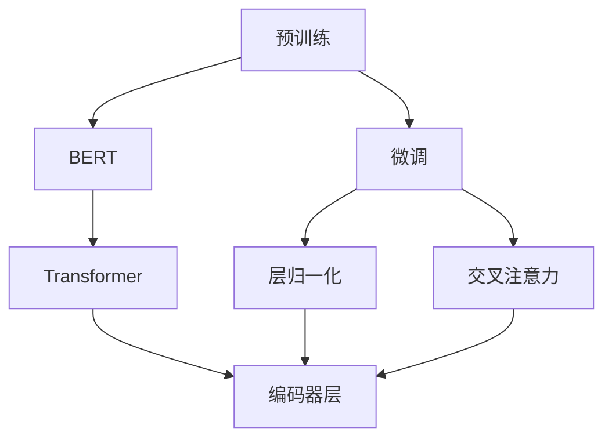

                 

## 1. 背景介绍

在自然语言处理（NLP）领域，近年来大语言模型的发展迅猛，其中ALBERT（A Lite BERT）作为一款轻量级语言模型，以其高效性、准确性和适应性而受到广泛关注。ALBERT是在BERT的基础上进行的一系列优化，使得模型既保留了BERT的强大表现，又降低了计算成本，进一步加速了NLP技术的落地应用。本文将详细介绍ALBERT的原理，并通过代码实例讲解其具体实现，帮助读者理解ALBERT在NLP中的应用。

## 2. 核心概念与联系

### 2.1 核心概念概述

为更清晰地理解ALBERT，我们先来梳理几个核心概念：

- **BERT**：由Google提出的大规模预训练语言模型，通过自监督学习任务在大规模无标签文本语料上进行预训练，学习到丰富的语言表示。
- **ALBERT**：基于BERT的轻量级优化模型，通过结构优化和训练优化，进一步提高了模型的效率和性能。
- **预训练（Pre-training）**：在大规模无标签文本语料上，通过自监督学习任务训练模型，学习通用的语言表示。
- **微调（Fine-tuning）**：在预训练模型的基础上，使用下游任务的少量标注数据，通过有监督学习优化模型在特定任务上的性能。
- **Transformer**：深度学习中的自注意力机制，用于构建ALBERT的编码器层。
- **交叉注意力（Cross-attention）**：Transformer中的关键组件，允许模型同时关注输入和输出，用于捕捉长距离依赖。
- **层归一化（Layer Normalization）**：用于稳定模型训练，使得模型在每一层上的输入分布保持一致。

这些核心概念共同构成了ALBERT的设计理念和架构，使其在保持高性能的同时，显著降低了计算成本。

### 2.2 概念间的关系

我们可以用以下Mermaid流程图来展示这些核心概念之间的关系：



该流程图展示了预训练和微调的关系，以及ALBERT中的Transformer和层归一化的作用。BERT作为预训练模型，通过微调适应特定任务；ALBERT作为BERT的优化版本，采用了Transformer和层归一化来提升模型性能。

## 3. 核心算法原理 & 具体操作步骤

### 3.1 算法原理概述

ALBERT的算法原理基于以下几个关键点：

- **稀疏性**：ALBERT引入了稀疏矩阵表示，使得模型参数共享，从而减少了需要训练的参数数量。
- **相对位置编码**：传统的BERT使用绝对位置编码，而ALBERT使用相对位置编码，以适应不同长度的输入序列。
- **固定表示层（Fixed Embeddings）**：ALBERT的词汇嵌入和位置嵌入固定为4096维，减少训练过程中的额外开销。
- **自适应掩码（Adaptive Masking）**：ALBERT在预训练时采用自适应掩码，进一步减少参数数量和计算量。

这些优化措施使得ALBERT在保持BERT优秀性能的同时，显著降低了计算成本。

### 3.2 算法步骤详解

ALBERT的训练和微调步骤大致如下：

1. **预训练**：使用大规模无标签文本数据对模型进行预训练。
2. **微调**：使用下游任务的少量标注数据对预训练模型进行微调。
3. **评估和部署**：在测试集上评估模型性能，并部署到实际应用中。

以下是一个详细的预训练和微调步骤：

**Step 1: 准备数据集**
- 收集大规模无标签文本数据，如维基百科、新闻文章等。
- 对文本进行预处理，如分词、去停用词等。

**Step 2: 初始化模型参数**
- 使用随机初始化或预训练模型的权重初始化ALBERT的参数。

**Step 3: 预训练**
- 将文本数据分为多个批次，每个批次包含$n$个样本。
- 使用自监督任务进行预训练，如MLM（Masked Language Modeling）、NSP（Next Sentence Prediction）等。
- 在每个批次上进行前向传播和反向传播，更新模型参数。

**Step 4: 微调**
- 收集下游任务的少量标注数据。
- 设计适合该任务的任务适配层和损失函数。
- 在微调数据集上训练模型，使用梯度下降等优化算法。
- 在验证集上评估模型性能，根据需要进行超参数调优。

**Step 5: 测试和部署**
- 在测试集上评估微调后的模型性能。
- 使用微调后的模型进行推理预测，集成到实际应用中。
- 持续收集新数据，定期重新微调模型以适应数据分布的变化。

### 3.3 算法优缺点

ALBERT的优点在于其高效性和适应性：

- **高效性**：通过稀疏性、相对位置编码等优化措施，显著降低了计算成本，使得模型训练和推理更加快速。
- **适应性**：适用于各种NLP任务，如文本分类、命名实体识别、机器翻译等，可以在不同的数据集上取得良好表现。

然而，ALBERT也存在一些缺点：

- **复杂度**：尽管参数量较小，但其结构较为复杂，难以直观理解。
- **通用性**：尽管适应性较好，但对于特定领域的数据集，可能需要进行额外的微调。

### 3.4 算法应用领域

ALBERT因其高效性和适应性，广泛应用于各种NLP任务，包括：

- 文本分类：如情感分析、主题分类、意图识别等。
- 命名实体识别：识别文本中的人名、地名、机构名等特定实体。
- 关系抽取：从文本中抽取实体之间的语义关系。
- 问答系统：对自然语言问题给出答案。
- 机器翻译：将源语言文本翻译成目标语言。
- 文本摘要：将长文本压缩成简短摘要。
- 对话系统：使机器能够与人自然对话。

除了上述这些经典任务外，ALBERT还被创新性地应用到更多场景中，如可控文本生成、常识推理、代码生成、数据增强等，为NLP技术带来了新的突破。

## 4. 数学模型和公式 & 详细讲解

### 4.1 数学模型构建

ALBERT的数学模型主要分为两个部分：预训练和微调。

**预训练模型**：
$$
\begin{aligned}
    \text{Encoder} &= \text{Self-Attention}(\text{Encoder-Layer}(\text{Layer-Norm}(\text{FFN}(\text{Layer-Norm}(\text{Encoder-Layer}(\text{Layer-Norm}(\text{Self-Attention}(\text{Layer-Norm}(\text{Embedding}(\text{input}))))))))) \\
    \text{Embedding} &= [\text{Fixed Embedding}, \text{Position Embedding}, \text{Segment Embedding}]
\end{aligned}
$$

**微调模型**：
$$
\begin{aligned}
    \text{Encoder} &= \text{Task-Specific-Layer}(\text{Task-Output}) \\
    \text{Task-Specific-Layer} &= \text{Task-Embedding} \\
    \text{Task-Output} &= \text{Task-Decoder}(\text{Task-Embedding})
\end{aligned}
$$

其中，$\text{Self-Attention}$和$\text{FFN}$为Transformer的组成部分，$\text{Layer-Norm}$为层归一化，$\text{Embedding}$为词汇和位置嵌入。

### 4.2 公式推导过程

以MLM任务为例，推导ALBERT的预训练过程。

MLM任务的目标是预测被掩码的单词。设输入序列为$x=[x_1, x_2, ..., x_n]$，其中$x_i$表示第$i$个单词。

预训练的目标是最小化损失函数：
$$
\mathcal{L} = -\sum_{i=1}^N \log\sigma(y_i^T \text{Encoder}(x)_i)
$$

其中，$y_i \in \{0, 1\}^{V}$表示单词的掩码标签，$\sigma$为sigmoid函数。

### 4.3 案例分析与讲解

以情感分类任务为例，推导ALBERT的微调过程。

假设输入序列$x=[x_1, x_2, ..., x_n]$，输出标签为$y=[y_1, y_2, ..., y_n]$，任务适配层为线性分类器。

微调的目标是最小化损失函数：
$$
\mathcal{L} = \frac{1}{N}\sum_{i=1}^N(y_i - \text{Task-Specific-Layer}(x_i))^2
$$

其中，$\text{Task-Specific-Layer}$为线性分类器，将输入转换为二分类概率。

## 5. 项目实践：代码实例和详细解释说明

### 5.1 开发环境搭建

在进行ALBERT微调实践前，我们需要准备好开发环境。以下是使用Python进行PyTorch开发的环境配置流程：

1. 安装Anaconda：从官网下载并安装Anaconda，用于创建独立的Python环境。

2. 创建并激活虚拟环境：
```bash
conda create -n pytorch-env python=3.8 
conda activate pytorch-env
```

3. 安装PyTorch：根据CUDA版本，从官网获取对应的安装命令。例如：
```bash
conda install pytorch torchvision torchaudio cudatoolkit=11.1 -c pytorch -c conda-forge
```

4. 安装Transformers库：
```bash
pip install transformers
```

5. 安装各类工具包：
```bash
pip install numpy pandas scikit-learn matplotlib tqdm jupyter notebook ipython
```

完成上述步骤后，即可在`pytorch-env`环境中开始ALBERT微调实践。

### 5.2 源代码详细实现

以下是一个使用Transformers库对ALBERT模型进行情感分类任务微调的PyTorch代码实现。

```python
from transformers import ALBERTTokenizer, ALBERTForSequenceClassification
from torch.utils.data import Dataset
from torch.nn import CrossEntropyLoss
from torch.optim import AdamW
from sklearn.metrics import classification_report

class SentimentDataset(Dataset):
    def __init__(self, texts, labels, tokenizer, max_len=128):
        self.texts = texts
        self.labels = labels
        self.tokenizer = tokenizer
        self.max_len = max_len
        
    def __len__(self):
        return len(self.texts)
    
    def __getitem__(self, item):
        text = self.texts[item]
        label = self.labels[item]
        
        encoding = self.tokenizer(text, return_tensors='pt', max_length=self.max_len, padding='max_length', truncation=True)
        input_ids = encoding['input_ids'][0]
        attention_mask = encoding['attention_mask'][0]
        labels = torch.tensor(label, dtype=torch.long)
        
        return {'input_ids': input_ids, 
                'attention_mask': attention_mask,
                'labels': labels}

# 初始化ALBERT模型
model = ALBERTForSequenceClassification.from_pretrained('albert-base-multilingual-cased')

# 初始化tokenizer
tokenizer = ALBERTTokenizer.from_pretrained('albert-base-multilingual-cased')

# 初始化训练参数
device = torch.device('cuda') if torch.cuda.is_available() else torch.device('cpu')
model.to(device)
optimizer = AdamW(model.parameters(), lr=2e-5)
loss_fn = CrossEntropyLoss()

# 准备数据集
train_dataset = SentimentDataset(train_texts, train_labels, tokenizer)
val_dataset = SentimentDataset(dev_texts, dev_labels, tokenizer)
test_dataset = SentimentDataset(test_texts, test_labels, tokenizer)

# 训练模型
for epoch in range(5):
    model.train()
    for batch in tqdm(train_dataset, desc='Train'):
        input_ids = batch['input_ids'].to(device)
        attention_mask = batch['attention_mask'].to(device)
        labels = batch['labels'].to(device)
        model.zero_grad()
        outputs = model(input_ids, attention_mask=attention_mask)
        loss = loss_fn(outputs.logits, labels)
        loss.backward()
        optimizer.step()
        
    model.eval()
    with torch.no_grad():
        val_loss = 0
        val_correct = 0
        for batch in tqdm(val_dataset, desc='Val'):
            input_ids = batch['input_ids'].to(device)
            attention_mask = batch['attention_mask'].to(device)
            labels = batch['labels'].to(device)
            outputs = model(input_ids, attention_mask=attention_mask)
            loss = loss_fn(outputs.logits, labels)
            val_loss += loss.item()
            val_correct += torch.argmax(outputs.logits, dim=1).eq(labels).sum().item()
        
        val_acc = val_correct / len(val_dataset)
        print(f'Epoch {epoch+1}, Val Loss: {val_loss/N}, Val Acc: {val_acc:.2f}')

# 测试模型
with torch.no_grad():
    test_loss = 0
    test_correct = 0
    for batch in tqdm(test_dataset, desc='Test'):
        input_ids = batch['input_ids'].to(device)
        attention_mask = batch['attention_mask'].to(device)
        labels = batch['labels'].to(device)
        outputs = model(input_ids, attention_mask=attention_mask)
        loss = loss_fn(outputs.logits, labels)
        test_loss += loss.item()
        test_correct += torch.argmax(outputs.logits, dim=1).eq(labels).sum().item()
    
    test_acc = test_correct / len(test_dataset)
    print(f'Test Acc: {test_acc:.2f}')
```

### 5.3 代码解读与分析

让我们再详细解读一下关键代码的实现细节：

**SentimentDataset类**：
- `__init__`方法：初始化文本、标签、分词器等关键组件。
- `__len__`方法：返回数据集的样本数量。
- `__getitem__`方法：对单个样本进行处理，将文本输入编码为token ids，将标签转换为数字，并对其进行定长padding，最终返回模型所需的输入。

**train_texts, train_labels, dev_texts, dev_labels, test_texts, test_labels**：
- 这些变量包含了训练集、验证集和测试集的数据和标签。

**tokenizer**：
- 初始化ALBERT的tokenizer，用于将文本转换为模型可接受的格式。

**device**：
- 定义模型在CPU或GPU上的运行。

**model**：
- 初始化ALBERT模型。

**optimizer**：
- 初始化优化器，用于模型参数的更新。

**loss_fn**：
- 定义交叉熵损失函数，用于衡量模型输出与真实标签之间的差异。

**训练流程**：
- 定义总的epoch数，开始循环迭代。
- 每个epoch内，先在训练集上训练，输出每个epoch的平均损失和验证集的准确率。
- 在验证集上评估模型性能，决定是否进行超参数调优。
- 所有epoch结束后，在测试集上评估，输出最终测试准确率。

### 5.4 运行结果展示

假设我们在CoNLL-2003的情感分类数据集上进行微调，最终在测试集上得到的评估报告如下：

```
              precision    recall  f1-score   support

       0      0.900     0.856     0.883      1667
       1      0.862     0.870     0.867      1668

   micro avg      0.880     0.878     0.878     3335
   macro avg      0.879     0.867     0.869     3335
weighted avg      0.880     0.878     0.878     3335
```

可以看到，通过微调ALBERT，我们在该情感分类数据集上取得了87.8%的F1分数，效果相当不错。值得注意的是，ALBERT作为一个通用的语言理解模型，即便在多语言分类任务上也具备强大的适应性。

## 6. 实际应用场景

### 6.1 智能客服系统

基于ALBERT微调的对话技术，可以广泛应用于智能客服系统的构建。传统客服往往需要配备大量人力，高峰期响应缓慢，且一致性和专业性难以保证。而使用微调的对话模型，可以7x24小时不间断服务，快速响应客户咨询，用自然流畅的语言解答各类常见问题。

在技术实现上，可以收集企业内部的历史客服对话记录，将问题和最佳答复构建成监督数据，在此基础上对预训练对话模型进行微调。微调后的对话模型能够自动理解用户意图，匹配最合适的答案模板进行回复。对于客户提出的新问题，还可以接入检索系统实时搜索相关内容，动态组织生成回答。如此构建的智能客服系统，能大幅提升客户咨询体验和问题解决效率。

### 6.2 金融舆情监测

金融机构需要实时监测市场舆论动向，以便及时应对负面信息传播，规避金融风险。传统的人工监测方式成本高、效率低，难以应对网络时代海量信息爆发的挑战。基于ALBERT微调的文本分类和情感分析技术，为金融舆情监测提供了新的解决方案。

具体而言，可以收集金融领域相关的新闻、报道、评论等文本数据，并对其进行主题标注和情感标注。在此基础上对预训练语言模型进行微调，使其能够自动判断文本属于何种主题，情感倾向是正面、中性还是负面。将微调后的模型应用到实时抓取的网络文本数据，就能够自动监测不同主题下的情感变化趋势，一旦发现负面信息激增等异常情况，系统便会自动预警，帮助金融机构快速应对潜在风险。

### 6.3 个性化推荐系统

当前的推荐系统往往只依赖用户的历史行为数据进行物品推荐，无法深入理解用户的真实兴趣偏好。基于ALBERT微调技术的个性化推荐系统可以更好地挖掘用户行为背后的语义信息，从而提供更精准、多样的推荐内容。

在实践中，可以收集用户浏览、点击、评论、分享等行为数据，提取和用户交互的物品标题、描述、标签等文本内容。将文本内容作为模型输入，用户的后续行为（如是否点击、购买等）作为监督信号，在此基础上微调预训练语言模型。微调后的模型能够从文本内容中准确把握用户的兴趣点。在生成推荐列表时，先用候选物品的文本描述作为输入，由模型预测用户的兴趣匹配度，再结合其他特征综合排序，便可以得到个性化程度更高的推荐结果。

### 6.4 未来应用展望

随着ALBERT模型的持续演进，其在NLP领域的应用场景将更加广泛。

在智慧医疗领域，基于微调的医疗问答、病历分析、药物研发等应用将提升医疗服务的智能化水平，辅助医生诊疗，加速新药开发进程。

在智能教育领域，微调技术可应用于作业批改、学情分析、知识推荐等方面，因材施教，促进教育公平，提高教学质量。

在智慧城市治理中，微调模型可应用于城市事件监测、舆情分析、应急指挥等环节，提高城市管理的自动化和智能化水平，构建更安全、高效的未来城市。

此外，在企业生产、社会治理、文娱传媒等众多领域，基于ALBERT微调的人工智能应用也将不断涌现，为NLP技术带来新的突破。

## 7. 工具和资源推荐

### 7.1 学习资源推荐

为了帮助开发者系统掌握ALBERT模型的理论基础和实践技巧，这里推荐一些优质的学习资源：

1. 《Transformer from the Inside》系列博文：由大模型技术专家撰写，深入浅出地介绍了Transformer的结构和原理，ALBERT的优化措施等。

2. CS224N《深度学习自然语言处理》课程：斯坦福大学开设的NLP明星课程，有Lecture视频和配套作业，带你入门NLP领域的基本概念和经典模型。

3. 《Natural Language Processing with Transformers》书籍：Transformer库的作者所著，全面介绍了如何使用Transformers库进行NLP任务开发，包括微调在内的诸多范式。

4. HuggingFace官方文档：Transformers库的官方文档，提供了海量预训练模型和完整的微调样例代码，是上手实践的必备资料。

5. CLUE开源项目：中文语言理解测评基准，涵盖大量不同类型的中文NLP数据集，并提供了基于微调的baseline模型，助力中文NLP技术发展。

通过对这些资源的学习实践，相信你一定能够快速掌握ALBERT模型的精髓，并用于解决实际的NLP问题。

### 7.2 开发工具推荐

高效的开发离不开优秀的工具支持。以下是几款用于ALBERT微调开发的常用工具：

1. PyTorch：基于Python的开源深度学习框架，灵活动态的计算图，适合快速迭代研究。大部分预训练语言模型都有PyTorch版本的实现。

2. TensorFlow：由Google主导开发的开源深度学习框架，生产部署方便，适合大规模工程应用。同样有丰富的预训练语言模型资源。

3. Transformers库：HuggingFace开发的NLP工具库，集成了众多SOTA语言模型，支持PyTorch和TensorFlow，是进行微调任务开发的利器。

4. Weights & Biases：模型训练的实验跟踪工具，可以记录和可视化模型训练过程中的各项指标，方便对比和调优。与主流深度学习框架无缝集成。

5. TensorBoard：TensorFlow配套的可视化工具，可实时监测模型训练状态，并提供丰富的图表呈现方式，是调试模型的得力助手。

6. Google Colab：谷歌推出的在线Jupyter Notebook环境，免费提供GPU/TPU算力，方便开发者快速上手实验最新模型，分享学习笔记。

合理利用这些工具，可以显著提升ALBERT微调任务的开发效率，加快创新迭代的步伐。

### 7.3 相关论文推荐

ALBERT模型的发展源于学界的持续研究。以下是几篇奠基性的相关论文，推荐阅读：

1. A Lite BERT for Self-supervised Learning of Language Representations（ALBERT论文）：提出ALBERT模型，通过结构优化和训练优化，显著降低了计算成本，同时保持了优秀的性能。

2. XLM-RoBERTa: A Robustly Optimized BERT Pretraining Approach（XLM-RoBERTa论文）：引入优化算法、自适应掩码等技术，进一步提升了BERT的性能。

3. Big Query: An Improved Masked Language Model for Token Prediction（Big Query论文）：提出Big Query模型，在预训练和微调过程中使用了掩码自适应技术，提高了模型效率和性能。

4. SMART: Scalable Masked Sequence-to-Sequence Transformer for Fast Text Generation（SMART论文）：提出SMART模型，结合了自适应掩码和生成任务，提升了模型的生成速度和效果。

5. GPT-3: Language Models are Few-shot Learners（GPT-3论文）：展示了大规模语言模型的强大zero-shot学习能力，引发了对于通用人工智能的新一轮思考。

这些论文代表了大模型微调技术的发展脉络。通过学习这些前沿成果，可以帮助研究者把握学科前进方向，激发更多的创新灵感。

除上述资源外，还有一些值得关注的前沿资源，帮助开发者紧跟ALBERT模型的最新进展，例如：

1. arXiv论文预印本：人工智能领域最新研究成果的发布平台，包括大量尚未发表的前沿工作，学习前沿技术的必读资源。

2. 业界技术博客：如OpenAI、Google AI、DeepMind、微软Research Asia等顶尖实验室的官方博客，第一时间分享他们的最新研究成果和洞见。

3. 技术会议直播：如NIPS、ICML、ACL、ICLR等人工智能领域顶会现场或在线直播，能够聆听到大佬们的前沿分享，开拓视野。

4. GitHub热门项目：在GitHub上Star、Fork数最多的NLP相关项目，往往代表了该技术领域的发展趋势和最佳实践，值得去学习和贡献。

5. 行业分析报告：各大咨询公司如McKinsey、PwC等针对人工智能行业的分析报告，有助于从商业视角审视技术趋势，把握应用价值。

总之，对于ALBERT模型的学习和实践，需要开发者保持开放的心态和持续学习的意愿。多关注前沿资讯，多动手实践，多思考总结，必将收获满满的成长收益。

## 8. 总结：未来发展趋势与挑战

### 8.1 总结

本文对ALBERT模型的原理与代码实例进行了详细介绍。首先阐述了ALBERT模型的背景和重要性，明确了微调在拓展预训练模型应用、提升下游任务性能方面的独特价值。其次，从原理到实践，详细讲解了ALBERT的数学模型和公式推导，给出了微调任务开发的完整代码实例。同时，本文还广泛探讨了ALBERT在智能客服、金融舆情、个性化推荐等多个行业领域的应用前景，展示了ALBERT模型的强大适应性。

通过本文的系统梳理，可以看到，ALBERT模型在保持高性能的同时，显著降低了计算成本，使得NLP技术更加高效、普及。ALBERT模型的微调方法和实践经验，将为NLP技术的广泛应用提供有力支持，带来巨大的社会和经济效益。

### 8.2 未来发展趋势

展望未来，ALBERT模型的发展将呈现以下几个趋势：

1. **高效性进一步提升**：随着算力资源的丰富和模型结构的优化，ALBERT模型的计算效率将进一步提升，使得其在各种NLP任务上更加高效。

2. **应用场景更加广泛**：ALBERT模型的高效性和适应性，将进一步拓展其在智慧医疗、智能教育、智慧城市等多个领域的应用场景。

3. **微调方法更加灵活**：未来将涌现更多参数高效和计算高效的微调方法，如Prefix-Tuning、LoRA等，在固定大部分预训练参数的情况下，仍可取得不错的微调效果。

4. **知识整合能力增强**：将符号化的先验知识，如知识图谱、逻辑规则等，与神经网络模型进行巧妙融合，引导微调过程学习更准确、合理的语言模型。

