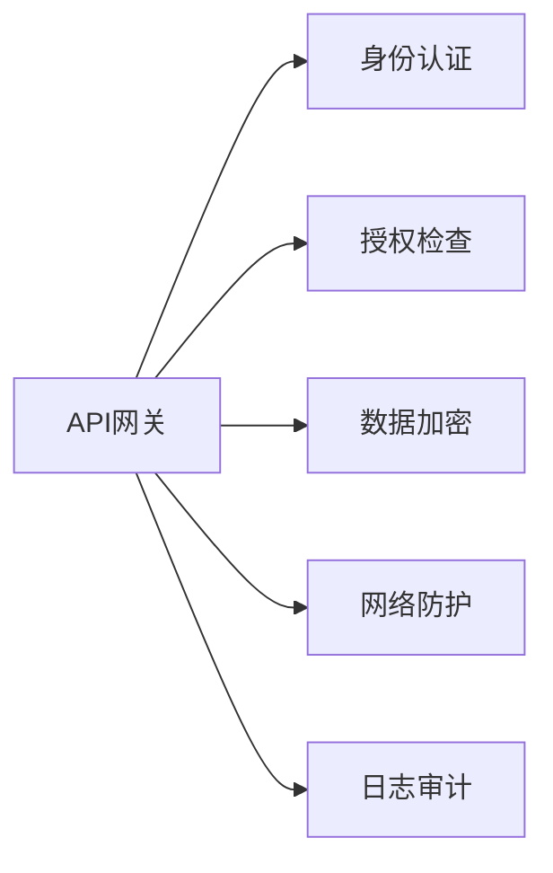
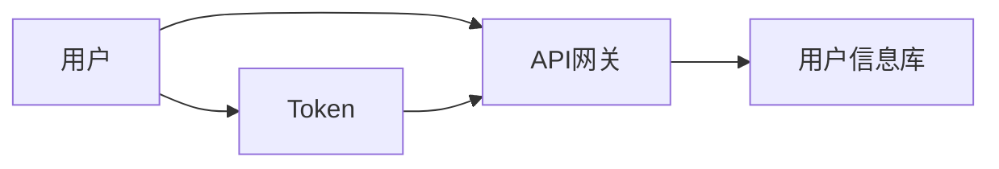
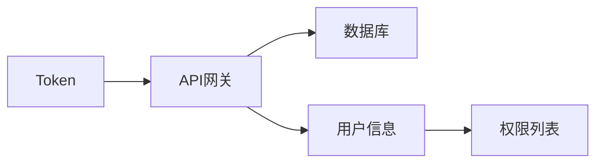
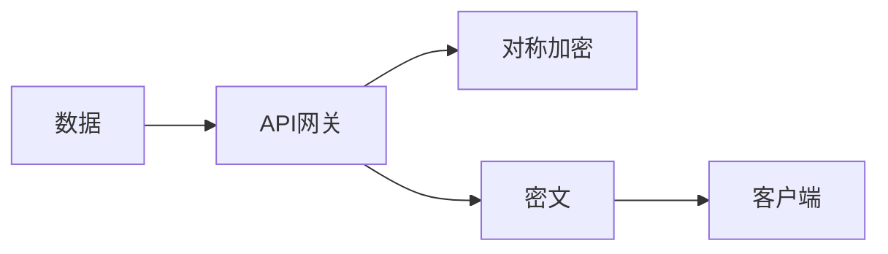
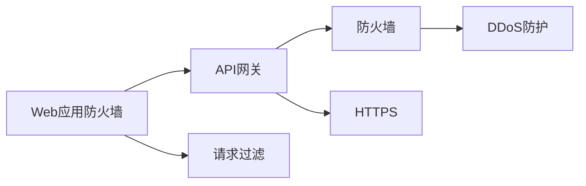
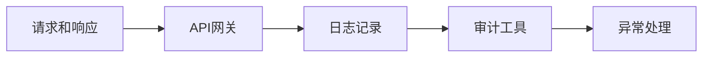

                 

# API 网关的安全功能

> 关键词：API网关, 安全, 认证, 授权, 加密, 网络安全, RESTful API, HTTPS

## 1. 背景介绍

### 1.1 问题由来

随着微服务架构的普及和云服务的兴起，API网关（API Gateway）变得越来越重要。API网关作为微服务架构的入口，负责统一管理和路由微服务，为用户提供统一的接口访问入口。然而，API网关在为微服务提供便利的同时，也面临着严峻的安全挑战。

### 1.2 问题核心关键点

API网关的安全问题主要包括以下几个方面：

- **身份认证**：验证用户的身份和权限，确保请求来自可信来源。
- **授权检查**：检查用户是否具有访问特定资源的权限。
- **数据加密**：保护传输过程中的数据不被窃听和篡改。
- **网络防护**：防止SQL注入、XSS、DDoS等常见网络攻击。
- **日志审计**：记录和审计API请求和响应，便于事后追踪和分析。

本文将详细讨论API网关的这些安全功能，并介绍如何在实践中实现这些功能。

## 2. 核心概念与联系

### 2.1 核心概念概述

- **API网关**：作为微服务的统一入口，负责API路由、负载均衡、流量控制、安全防护等功能。
- **身份认证**：验证用户身份的过程，通常使用用户名、密码、令牌等进行验证。
- **授权检查**：检查用户是否有权访问某个资源的过程，通常基于角色或权限列表。
- **数据加密**：使用加密算法对数据进行加密，保护数据在传输和存储过程中不被篡改。
- **网络防护**：使用各种技术手段保护API网关免受网络攻击，如DDoS防护、防火墙等。
- **日志审计**：记录和审计API请求和响应的过程，便于追踪和分析安全事件。

这些核心概念之间存在紧密的联系，共同构成了API网关的安全功能体系。以下是一个简单的Mermaid流程图，展示了这些概念之间的关系：



### 2.2 概念间的关系

这些核心概念之间存在着相互依赖和支持的关系。例如，身份认证是授权检查的前提，数据加密是保护传输数据的必要措施，网络防护则是为了防止外部攻击对API网关的影响，而日志审计则是对API请求和响应的全面记录，便于事后分析和安全事件的追踪。

## 3. 核心算法原理 & 具体操作步骤

### 3.1 算法原理概述

API网关的安全功能主要包括身份认证、授权检查、数据加密、网络防护和日志审计等方面。以下是这些功能的算法原理概述：

- **身份认证**：通常使用基于密码的身份验证方法，如用户名-密码、OAuth2、JWT等。
- **授权检查**：基于角色或权限列表，对请求进行授权检查，判断用户是否有权访问特定资源。
- **数据加密**：使用对称加密、非对称加密、混合加密等技术对数据进行加密。
- **网络防护**：使用防火墙、DDoS防护、Web应用防火墙等技术，防止攻击者对API网关进行网络攻击。
- **日志审计**：使用日志记录工具，记录API请求和响应，定期进行审计分析，发现潜在安全问题。

### 3.2 算法步骤详解

#### 3.2.1 身份认证

**身份认证步骤**：

1. 用户输入用户名和密码，发送登录请求到API网关。
2. API网关接收到请求后，根据配置的用户信息库进行验证，判断用户名和密码是否正确。
3. 验证通过后，生成一个Token，存储在数据库中。
4. 将Token返回给用户，用户在下一次请求时带上Token。
5. API网关接收到请求后，从请求中提取Token，进行验证。



#### 3.2.2 授权检查

**授权检查步骤**：

1. API网关接收到请求后，解析请求中的Token。
2. 根据Token从数据库中获取用户信息。
3. 根据用户角色或权限列表，判断用户是否有权访问请求的资源。
4. 如果用户没有权限，返回401未授权错误。



#### 3.2.3 数据加密

**数据加密步骤**：

1. API网关使用对称加密算法对数据进行加密，生成密文。
2. 将密文返回给客户端，客户端使用对称加密算法对数据进行解密。
3. API网关和客户端共享一个密钥，用于加密和解密数据。



#### 3.2.4 网络防护

**网络防护步骤**：

1. 使用Web应用防火墙（WAF）对请求进行过滤，防止SQL注入、XSS等攻击。
2. 使用防火墙保护API网关服务器，防止DDoS攻击。
3. 使用HTTPS协议保护传输数据，防止中间人攻击。



#### 3.2.5 日志审计

**日志审计步骤**：

1. API网关记录每个请求和响应的日志。
2. 使用日志分析工具，定期审计日志，发现异常请求和行为。
3. 根据审计结果，进行异常处理，如封禁IP、记录安全事件等。



### 3.3 算法优缺点

API网关的安全功能具有以下优点：

- **集中管理**：统一管理API的路由、安全、监控等功能，方便维护和升级。
- **细粒度控制**：可以对每个API进行细粒度的访问控制和监控。
- **跨平台支持**：支持多种平台和编程语言，易于集成到现有系统中。

同时，API网关的安全功能也存在以下缺点：

- **性能瓶颈**：大量的API请求可能对网关的性能造成影响。
- **复杂性高**：需要配置和维护大量的安全策略，增加了系统的复杂性。
- **依赖性高**：对底层系统（如数据库、防火墙）的依赖性较高，一旦底层系统出现问题，可能影响网关的安全性。

### 3.4 算法应用领域

API网关的安全功能广泛应用于各种微服务架构中，特别是在云计算、金融、电商、医疗等领域，这些领域对数据安全性和系统稳定性要求较高。例如：

- **云计算**：云平台上的API网关需要应对大量的API请求，安全防护尤为重要。
- **金融**：金融系统的API网关需要处理高价值的数据和交易，数据安全是核心需求。
- **电商**：电商系统的API网关需要处理大量的购物订单和支付交易，网络安全是关键。
- **医疗**：医疗系统的API网关需要保护敏感的患者数据，数据安全和隐私保护是首要任务。

## 4. 数学模型和公式 & 详细讲解 & 举例说明

### 4.1 数学模型构建

API网关的安全功能涉及多个数学模型和算法，以下是对这些模型的简单介绍：

- **对称加密**：使用相同的密钥对数据进行加密和解密，常用算法包括AES、DES等。
- **非对称加密**：使用公钥加密，私钥解密，常用算法包括RSA、ECC等。
- **哈希算法**：对数据进行哈希计算，常用算法包括MD5、SHA等。
- **数字签名**：使用非对称加密对数据进行签名，保证数据完整性和真实性，常用算法包括RSA、DSA等。

### 4.2 公式推导过程

#### 4.2.1 对称加密

假设原始数据为$M$，密钥为$k$，则对称加密过程如下：

1. 加密：$C=Enc_k(M)$
2. 解密：$M=Dec_k(C)$

其中，$Enc_k$和$Dec_k$分别为加密和解密算法，$C$为密文。

#### 4.2.2 非对称加密

假设原始数据为$M$，公钥为$e$，私钥为$d$，则非对称加密过程如下：

1. 加密：$C=Enc_e(M)$
2. 解密：$M=Dec_d(C)$

其中，$Enc_e$和$Dec_d$分别为加密和解密算法，$C$为密文。

#### 4.2.3 哈希算法

假设原始数据为$M$，哈希算法为$H$，则哈希计算过程如下：

$H(M) = \text{hash}(M)$

其中，$H(M)$为哈希值。

#### 4.2.4 数字签名

假设原始数据为$M$，私钥为$d$，则数字签名过程如下：

1. 计算哈希值：$H(M) = \text{hash}(M)$
2. 签名：$S=Sign_d(H(M))$
3. 验证：$Ver_M(S) = Verify_{e}(H(M), S)$

其中，$Sign_d$和$Verify_{e}$分别为签名和验证算法，$S$为签名值，$Ver_M(S)$为验证结果。

### 4.3 案例分析与讲解

**案例1：对称加密**

假设需要加密一段文本，密钥为123456，则加密和解密过程如下：

1. 加密：$C=Enc_{123456}("Hello, world!")$
2. 解密：$M=Dec_{123456}(C)$

**案例2：非对称加密**

假设需要加密一段文本，公钥为$e=65537$，私钥为$d=123456$，则加密和解密过程如下：

1. 加密：$C=Enc_{65537}("Hello, world!")$
2. 解密：$M=Dec_{123456}(C)$

**案例3：哈希算法**

假设需要对一段文本进行哈希计算，哈希算法为MD5，则计算过程如下：

$H("Hello, world!") = \text{md5}("Hello, world!")$

**案例4：数字签名**

假设需要为一段文本进行数字签名，私钥为$d=123456$，则签名和验证过程如下：

1. 计算哈希值：$H("Hello, world!") = \text{hash}("Hello, world!")$
2. 签名：$S=Sign_{123456}(H("Hello, world!"))$
3. 验证：$Ver_M(S) = Verify_{65537}(H("Hello, world!"), S)$

## 5. 项目实践：代码实例和详细解释说明

### 5.1 开发环境搭建

在开始实践之前，需要搭建好开发环境。以下是一个简单的Python开发环境搭建流程：

1. 安装Python 3.8或更高版本。
2. 安装Flask和Flask-RESTful，用于构建API网关。
3. 安装JWT和Flask-Security，用于身份认证和授权检查。
4. 安装Flask-Limiter，用于流量控制和速率限制。
5. 安装Gunicorn和Nginx，用于部署和反向代理。

### 5.2 源代码详细实现

以下是一个简单的API网关代码实现，包含身份认证、授权检查和数据加密功能。

```python
from flask import Flask, request, jsonify
from flask_restful import Resource
import jwt
import hashlib

app = Flask(__name__)

# 用户信息库
users = {
    "user1": {"password": "123456", "role": "admin"},
    "user2": {"password": "654321", "role": "user"}
}

# JWT密钥
SECRET_KEY = "secret_key"

# 加密算法
ALGORITHM = "HS256"

# 认证和授权中间件
class AuthMiddleware(Resource):
    def __init__(self, *args, **kwargs):
        self.resource = args[0]
        self.resource.decorators.append(self.verify_auth)
        super().__init__(*args, **kwargs)

    def verify_auth(self, request):
        token = request.headers.get("Authorization")
        if token is None:
            return jsonify({"error": "Missing token"}), 401
        try:
            payload = jwt.decode(token, SECRET_KEY, algorithms=[ALGORITHM])
        except jwt.ExpiredSignatureError:
            return jsonify({"error": "Token expired"}), 401
        elif jwt.exceptions.InvalidTokenError:
            return jsonify({"error": "Invalid token"}), 401
        elif "role" not in payload:
            return jsonify({"error": "No role found"}), 401
        request.payload = payload
        return request

# 数据加密
def encrypt(data, key):
    iv = hashlib.sha256(key.encode()).digest()
    cipher = AES.new(key.encode(), AES.MODE_CBC, iv)
    padded_data = pkcs7_pad(data, AES.block_size)
    ciphertext = cipher.encrypt(padded_data)
    return iv + ciphertext

# 数据解密
def decrypt(ciphertext, key):
    iv = ciphertext[:AES.block_size]
    cipher = AES.new(key.encode(), AES.MODE_CBC, iv)
    padded_data = cipher.decrypt(ciphertext[AES.block_size:])
    return pkcs7_unpad(padded_data, AES.block_size)

# 数据加密中间件
class EncryptMiddleware(Resource):
    def __init__(self, *args, **kwargs):
        self.resource = args[0]
        self.resource.decorators.append(self.encrypt_data)
        super().__init__(*args, **kwargs)

    def encrypt_data(self, request):
        data = request.data
        encrypted_data = encrypt(data, SECRET_KEY)
        request.data = encrypted_data
        return request

# 数据解密中间件
class DecryptMiddleware(Resource):
    def __init__(self, *args, **kwargs):
        self.resource = args[0]
        self.resource.decorators.append(self.decrypt_data)
        super().__init__(*args, **kwargs)

    def decrypt_data(self, request):
        data = request.data
        decrypted_data = decrypt(data, SECRET_KEY)
        request.data = decrypted_data
        return request

# 用户认证资源
class UserAuth(Resource):
    def get(self):
        token = request.headers.get("Authorization")
        if token is None:
            return jsonify({"error": "Missing token"}), 401
        try:
            payload = jwt.decode(token, SECRET_KEY, algorithms=[ALGORITHM])
        except jwt.ExpiredSignatureError:
            return jsonify({"error": "Token expired"}), 401
        elif jwt.exceptions.InvalidTokenError:
            return jsonify({"error": "Invalid token"}), 401
        elif "role" not in payload:
            return jsonify({"error": "No role found"}), 401
        return jsonify(payload["role"])

# 数据加密资源
class EncryptData(Resource):
    def post(self):
        data = request.data
        encrypted_data = encrypt(data, SECRET_KEY)
        return jsonify({"encrypted_data": encrypted_data})

# 数据解密资源
class DecryptData(Resource):
    def post(self):
        data = request.data
        decrypted_data = decrypt(data, SECRET_KEY)
        return jsonify({"decrypted_data": decrypted_data})

if __name__ == '__main__':
    app.add_url_rule('/user/auth', view_func=UserAuth.as_view('user_auth'))
    app.add_url_rule('/encrypt-data', view_func=EncryptData.as_view('encrypt_data'))
    app.add_url_rule('/decrypt-data', view_func=DecryptData.as_view('decrypt_data'))
    app.add_url_rule('/verify-auth', view_func=AuthMiddleware(UserAuth))
    app.add_url_rule('/encrypt-data', view_func=EncryptMiddleware(EncryptData))
    app.add_url_rule('/decrypt-data', view_func=DecryptMiddleware(DecryptData))
    app.run(debug=True)
```

### 5.3 代码解读与分析

这个简单的API网关代码实现中，包含了以下功能：

- **用户认证**：通过JWT实现身份认证和授权检查。
- **数据加密**：使用AES对称加密算法对数据进行加密和解密。
- **中间件**：使用中间件实现数据加密和解密。

以上代码中的关键点包括：

- **JWT认证**：使用JWT实现身份认证和授权检查，JWT（JSON Web Token）是一种轻量级的认证方式，可以在请求头中传递，便于API网关快速验证请求来源和权限。
- **对称加密**：使用AES对称加密算法对数据进行加密和解密，AES是一种常用的对称加密算法，速度快且安全性高。
- **中间件**：使用中间件实现数据加密和解密，中间件可以复用加密和解密功能，避免重复代码。

### 5.4 运行结果展示

运行以上代码，可以在浏览器中访问http://localhost:5000/user/auth，返回用户角色信息。也可以在http://localhost:5000/encrypt-data和http://localhost:5000/decrypt-data中测试加密和解密功能，验证加密数据的完整性。

## 6. 实际应用场景

### 6.1 智能客服系统

API网关在智能客服系统中发挥着重要作用，可以统一管理和路由客户请求，实现高效的客户服务和数据分析。

智能客服系统通常包含以下API：

- **客户信息查询**：根据客户ID查询客户信息，返回客户姓名、联系方式等。
- **客服机器人对话**：根据客户输入，生成客服机器人的回复。
- **客户满意度调查**：根据客户反馈生成满意度调查问卷。

通过API网关，可以统一管理和路由这些API，实现高效的客户服务和数据分析。

### 6.2 金融系统

API网关在金融系统中非常重要，可以统一管理和路由金融API，保障金融数据和交易的安全性。

金融系统通常包含以下API：

- **用户登录**：验证用户身份，生成Token。
- **账户查询**：根据用户ID查询账户信息，返回账户余额、交易记录等。
- **交易记录查询**：根据交易ID查询交易记录，返回交易时间、金额等。

通过API网关，可以统一管理和路由这些API，保障金融数据和交易的安全性。

### 6.3 电商系统

API网关在电商系统中也发挥着重要作用，可以统一管理和路由电商API，实现高效的电商服务和数据分析。

电商系统通常包含以下API：

- **商品查询**：根据商品ID查询商品信息，返回商品名称、价格、描述等。
- **购物车管理**：添加商品到购物车，删除商品等。
- **订单管理**：生成订单，查询订单状态，修改订单等。

通过API网关，可以统一管理和路由这些API，实现高效的电商服务和数据分析。

## 7. 工具和资源推荐

### 7.1 学习资源推荐

为了帮助开发者系统掌握API网关的安全功能，以下是一些优质的学习资源：

- **Flask官方文档**：详细介绍了Flask框架的使用和API开发。
- **JWT官方文档**：详细介绍了JWT认证和授权的原理和使用方法。
- **AES加密算法**：详细介绍了AES对称加密算法的原理和实现。
- **数字签名算法**：详细介绍了数字签名的原理和实现。
- **Web应用防火墙**：详细介绍了WAF的原理和实现。

### 7.2 开发工具推荐

以下是一些常用的API网关开发工具：

- **Flask**：轻量级的Python Web框架，易于开发和部署API网关。
- **Flask-RESTful**：Flask的扩展，提供了RESTful风格的API开发工具。
- **JWT**：用于实现JWT认证和授权的Python库。
- **Flask-Security**：提供了身份验证和授权的功能，可以无缝集成到Flask应用中。
- **Flask-Limiter**：提供了流量控制和速率限制的功能，可以限制API请求的速率和数量。

### 7.3 相关论文推荐

以下是几篇关于API网关安全功能的经典论文，推荐阅读：

- **"API Gateway Design Patterns and Anti-Patterns"**：探讨API网关的设计模式和反模式，提供实用的API网关设计方案。
- **"Securing Web APIs with JWT"**：详细介绍了JWT认证和授权的实现方法，提供实用的API网关安全方案。
- **"API Security Best Practices"**：提供API网关安全的最佳实践，包括身份验证、授权检查、数据加密等。
- **"Blockchain-Based API Security"**：探索区块链技术在API网关安全中的应用，提供更加安全可靠的API网关解决方案。
- **"API Gateway Security for Cloud-Native Applications"**：探讨云原生环境下的API网关安全问题，提供实用的API网关安全解决方案。

## 8. 总结：未来发展趋势与挑战

### 8.1 总结

本文对API网关的安全功能进行了全面系统的介绍。首先阐述了API网关和微服务架构的关系，明确了API网关在微服务架构中的重要性。其次，从原理到实践，详细讲解了API网关的安全功能，包括身份认证、授权检查、数据加密、网络防护和日志审计等。最后，提供了API网关的代码实现和运行结果展示。

通过本文的系统梳理，可以看到，API网关在微服务架构中扮演着重要角色，为微服务提供了统一的管理和路由功能。API网关的安全功能是保障微服务系统安全性的关键环节，需要开发者深入理解和应用。

### 8.2 未来发展趋势

展望未来，API网关的安全功能将呈现以下几个发展趋势：

1. **细粒度控制**：API网关将进一步细粒化访问控制策略，实现更严格的权限管理和审计。
2. **分布式安全**：API网关将采用分布式架构，提高系统弹性和可靠性。
3. **微服务安全**：API网关将与微服务架构紧密结合，提供更加安全可靠的服务。
4. **自动化运维**：API网关将引入自动化运维技术，降低运维成本，提高系统稳定性和安全性。
5. **云原生安全**：API网关将与云原生环境无缝集成，提供更加安全和高效的服务。

### 8.3 面临的挑战

尽管API网关的安全功能已经取得了一定的进展，但在迈向更加智能化、普适化应用的过程中，仍面临以下挑战：

1. **性能瓶颈**：API网关需要处理大量的请求，性能瓶颈是制约其扩展的关键。
2. **复杂性高**：API网关的安全策略复杂且需要配置和维护，增加了系统的复杂性。
3. **依赖性高**：API网关对底层系统（如数据库、防火墙）的依赖性较高，一旦底层系统出现问题，可能影响网关的安全性。
4. **安全性不足**：API网关的安全策略和措施可能存在漏洞，容易被攻击者利用。

### 8.4 研究展望

面对API网关的安全挑战，未来的研究需要在以下几个方面寻求新的突破：

1. **自动化安全**：引入自动化安全技术，实时检测和修复安全漏洞，保障系统的安全性。
2. **分布式安全**：采用分布式架构，提高系统的弹性和可靠性，降低单点故障的风险。
3. **微服务安全**：与微服务架构紧密结合，提供更加安全可靠的服务，实现细粒度控制和微服务安全。
4. **云原生安全**：与云原生环境无缝集成，提供更加安全和高效的服务，支持云原生架构的快速部署和扩展。

这些研究方向的探索，必将引领API网关安全技术迈向更高的台阶，为构建安全、可靠、可控的智能系统铺平道路。面向未来，API网关安全技术还需要与其他人工智能技术进行更深入的融合，如知识表示、因果推理、强化学习等，多路径协同发力，共同推动API网关安全技术的进步。

## 9. 附录：常见问题与解答

**Q1：API网关的安全功能包括哪些？**

A: API网关的安全功能主要包括身份认证、授权检查、数据加密、网络防护和日志审计等方面。

**Q2：如何实现API网关的加密和解密功能？**

A: 可以使用对称加密算法（如AES）或非对称加密算法（如RSA）对API请求和响应进行加密和解密。

**Q3：API网关的安全策略有哪些？**

A: API网关的安全策略包括身份认证、授权检查、数据加密、网络防护和日志审计等。

**Q4：API网关的安全性能如何提升？**

A: 可以通过分布式架构、负载均衡、缓存技术等提升API网关的安全性能。

**Q5：API网关的安全性如何保障？**

A: 可以通过身份认证、授权检查、数据加密、网络防护和日志审计等手段保障API网关的安全性。

这些问题的解答，可以帮助开发者更好地理解API网关的安全功能，从而在实际应用中更好地实现API网关的安全功能。

