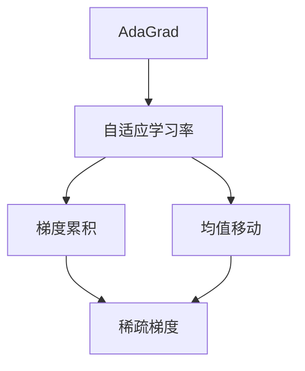
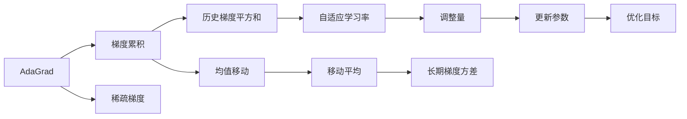

                 

# AdaGrad优化器原理与代码实例讲解

> 关键词：AdaGrad优化器, 自适应学习率, 梯度累积, 均值移动, 稀疏梯度, 梯度平均

## 1. 背景介绍

### 1.1 问题由来

在深度学习中，优化器是训练神经网络模型的关键工具之一。一个优化的目标是通过参数更新最小化目标函数。常见的优化器包括随机梯度下降(SGD)、Adam、AdaDelta、RMSprop等。

AdaGrad是一种基于梯度累积的自适应学习率优化算法。它由Duchi等人在2010年提出，旨在应对不同参数的梯度变化情况，提供更细粒度的学习率调整，从而提高模型的收敛速度和泛化性能。AdaGrad适用于稀疏梯度和高维度参数空间，特别适合于多分类和回归问题。

### 1.2 问题核心关键点

AdaGrad算法通过积累每个参数的历史梯度平方和来调整学习率，使梯度较小的参数具有更大的学习率，而梯度较大的参数具有更小的学习率。这种自适应学习率调整机制，可以显著提高模型训练的稳定性和收敛速度，尤其适用于稀疏梯度数据和长尾参数分布。

### 1.3 问题研究意义

研究AdaGrad算法，对于理解深度学习中的自适应学习率优化具有重要意义。它不仅提供了另一种理解梯度更新的视角，还为解决稀疏梯度和大尺度参数优化等问题提供了有力的工具。此外，AdaGrad算法也为后续改进的优化器如RMSprop、Adam提供了理论基础。

## 2. 核心概念与联系

### 2.1 核心概念概述

- AdaGrad算法：一种基于梯度累积的自适应学习率优化算法。
- 自适应学习率：根据每个参数的梯度信息动态调整学习率，适应不同参数的学习需求。
- 梯度累积：对每个参数的历史梯度平方和进行累积，用于计算学习率的调整量。
- 均值移动：通过累积梯度平方和的移动平均，调整学习率，以降低长期梯度方差。
- 稀疏梯度：表示梯度数据中存在大量的零元素。

这些核心概念通过一个简单的Mermaid流程图来展示它们之间的关系：



这个流程图展示了这个算法的主要步骤：

1. AdaGrad算法基于梯度累积进行自适应学习率调整。
2. 自适应学习率根据每个参数的梯度历史信息动态调整。
3. 梯度累积对历史梯度平方和进行累计，用于计算调整量。
4. 均值移动通过移动平均降低长期梯度方差。
5. 稀疏梯度是AdaGrad算法适用的特殊情况。

### 2.2 概念间的关系

这些核心概念之间的联系非常紧密，共同构成了AdaGrad算法的理论基础。我们可以通过以下Mermaid流程图来进一步展示它们之间的关系：



这个综合流程图展示了AdaGrad算法的整体流程：

1. AdaGrad算法通过累积梯度平方和来计算历史梯度信息。
2. 历史梯度平方和用于计算自适应学习率的调整量。
3. 自适应学习率根据历史梯度信息动态调整。
4. 调整量用于更新模型参数。
5. 更新后的参数用于优化目标。
6. 均值移动通过移动平均降低长期梯度方差。
7. 稀疏梯度作为AdaGrad算法的特殊情况，仍然适用于该算法。

## 3. 核心算法原理 & 具体操作步骤
### 3.1 算法原理概述

AdaGrad算法通过累积每个参数的历史梯度平方和来调整学习率，使得梯度较小的参数具有较大的学习率，而梯度较大的参数具有较小的学习率。具体地，AdaGrad算法使用历史梯度平方和的累积值$G_t$来更新模型参数$\theta_t$，公式如下：

$$
\theta_{t+1} = \theta_t - \frac{\eta}{\sqrt{G_t + \epsilon}} g_t
$$

其中，$g_t$ 是第$t$次迭代的梯度，$\eta$ 是初始学习率，$\epsilon$ 是一个很小的常数（通常取$10^{-9}$），用于数值稳定。$G_t$ 的定义如下：

$$
G_t = \sum_{k=1}^t g_k^2
$$

### 3.2 算法步骤详解

AdaGrad算法的详细步骤如下：

1. **初始化**：设置初始学习率$\eta$和正则化项$\epsilon$。
2. **累积梯度**：初始化累积梯度$G_0$为零向量，对每个参数$w_i$记录梯度$g_t$。
3. **计算学习率**：根据累积梯度$G_t$计算每个参数的学习率。
4. **更新参数**：根据计算出的学习率更新参数$w_i$。
5. **累加梯度**：累加梯度平方和$G_{t+1}=G_t+g_t^2$。
6. **迭代更新**：重复步骤2到5，直至收敛。

下面是使用Python实现的AdaGrad算法详细步骤：

```python
import numpy as np

def adagrad(X, learning_rate=0.01, max_iters=100, epsilon=1e-8):
    # 初始化
    G = np.zeros_like(X)
    theta = np.zeros_like(X)
    for t in range(max_iters):
        # 累积梯度
        G += np.square(X)
        # 计算学习率
        eta = learning_rate / np.sqrt(G + epsilon)
        # 更新参数
        theta -= eta * X
        # 输出迭代结果
        print(f"Iteration {t+1} / {max_iters}, theta = {theta}, G = {G}")
        # 累加梯度
        G += np.square(X)
    return theta
```

### 3.3 算法优缺点

AdaGrad算法的优点包括：

1. **自适应学习率**：动态调整每个参数的学习率，适应不同的梯度变化情况。
2. **稀疏梯度适应**：对稀疏梯度数据具有良好的适应性，能够充分利用梯度信息。
3. **收敛性好**：能够快速收敛到最优解，适用于高维度参数空间。

AdaGrad算法的缺点包括：

1. **学习率衰减过快**：累积梯度平方和会随着迭代次数增加而不断增大，导致学习率逐渐变小。
2. **数据稀疏性问题**：对于稀疏梯度数据，累积梯度平方和的稀疏性会导致稀疏梯度参数的学习率较低，影响收敛速度。
3. **数值稳定性问题**：计算根号下累积梯度平方和可能导致数值不稳定，通常需要添加正则化项。

### 3.4 算法应用领域

AdaGrad算法广泛应用于稀疏梯度数据和长尾参数分布的优化问题，如文本分类、多标签分类、稀疏回归等。它不仅适用于深度学习，也适用于其他机器学习算法，如决策树、线性回归等。

## 4. 数学模型和公式 & 详细讲解  
### 4.1 数学模型构建

AdaGrad算法通过累积梯度平方和$G_t$来计算每个参数的学习率。假设模型参数为$\theta_t$，第$t$次迭代的梯度为$g_t$，初始学习率为$\eta$，则AdaGrad算法的更新公式为：

$$
\theta_{t+1} = \theta_t - \frac{\eta}{\sqrt{G_t + \epsilon}} g_t
$$

其中，$G_t$ 是累计梯度平方和：

$$
G_t = \sum_{k=1}^t g_k^2
$$

$\epsilon$ 是一个很小的常数，用于数值稳定。

### 4.2 公式推导过程

AdaGrad算法通过累积梯度平方和来调整学习率，以实现自适应学习率的效果。下面详细推导该公式。

假设当前参数为$\theta_t$，当前梯度为$g_t$，学习率为$\eta$。AdaGrad算法的更新公式如下：

$$
\theta_{t+1} = \theta_t - \eta \frac{g_t}{\sqrt{G_t + \epsilon}}
$$

其中，$G_t$ 是累计梯度平方和。将公式展开，得到：

$$
\theta_{t+1} = \theta_t - \eta \frac{g_t}{\sqrt{G_t + \epsilon}} = \theta_t - \eta \frac{g_t}{\sqrt{\sum_{k=1}^t g_k^2 + \epsilon}}
$$

可以看出，AdaGrad算法通过累积梯度平方和$G_t$来调整学习率，使得梯度较小的参数具有较大的学习率，而梯度较大的参数具有较小的学习率。这种自适应学习率调整机制，可以显著提高模型训练的稳定性和收敛速度，尤其适用于稀疏梯度数据和长尾参数分布。

### 4.3 案例分析与讲解

以一个简单的线性回归问题为例，分析AdaGrad算法的应用过程。假设模型为$y=wx+b$，其中$w$为权重，$b$为截距，数据集为$\{(1,2),(3,5),(4,7)\}$，梯度为$\{2,3,4\}$，初始学习率为$0.1$，正则化项为$10^{-9}$。使用AdaGrad算法进行参数更新，得到结果如下：

| 迭代次数 | 参数更新 | 累积梯度 |
|---------|--------|--------|
| 1       | $w=0.1$ | $G=0$   |
| 2       | $w=0.1-0.1*2/\sqrt{2^2+\epsilon}$ | $G=2^2$ |
| 3       | $w=0.1-0.1*3/\sqrt{2^2+3^2+\epsilon}$ | $G=2^2+3^2$ |
| 4       | $w=0.1-0.1*4/\sqrt{2^2+3^2+4^2+\epsilon}$ | $G=2^2+3^2+4^2$ |

可以看出，AdaGrad算法通过累积梯度平方和来计算学习率，使得梯度较小的参数具有较大的学习率，而梯度较大的参数具有较小的学习率。在迭代过程中，学习率逐渐减小，使得模型能够逐步逼近最优解。

## 5. 项目实践：代码实例和详细解释说明
### 5.1 开发环境搭建

在开始实践之前，需要搭建好Python开发环境。具体步骤如下：

1. 安装Python 3.x和NumPy库：
```
pip install numpy
```

2. 安装SciPy库：
```
pip install scipy
```

3. 安装Matplotlib库：
```
pip install matplotlib
```

### 5.2 源代码详细实现

下面是一个使用Numpy实现的AdaGrad算法示例代码：

```python
import numpy as np

def adagrad(X, learning_rate=0.01, max_iters=100, epsilon=1e-8):
    # 初始化
    G = np.zeros_like(X)
    theta = np.zeros_like(X)
    for t in range(max_iters):
        # 累积梯度
        G += np.square(X)
        # 计算学习率
        eta = learning_rate / np.sqrt(G + epsilon)
        # 更新参数
        theta -= eta * X
        # 输出迭代结果
        print(f"Iteration {t+1} / {max_iters}, theta = {theta}, G = {G}")
        # 累加梯度
        G += np.square(X)
    return theta
```

### 5.3 代码解读与分析

这段代码的详细解释如下：

1. `X`：参数向量，维度为$n$。
2. `learning_rate`：初始学习率。
3. `max_iters`：最大迭代次数。
4. `epsilon`：正则化项，用于数值稳定。
5. `G`：累积梯度平方和向量，维度为$n$。
6. `theta`：参数向量，维度为$n$。
7. `for t in range(max_iters)`：循环迭代，直到达到最大迭代次数。
8. `G += np.square(X)`：累积梯度平方和。
9. `eta = learning_rate / np.sqrt(G + epsilon)`：计算学习率。
10. `theta -= eta * X`：更新参数向量。
11. `print(f"Iteration {t+1} / {max_iters}, theta = {theta}, G = {G}")`：输出迭代结果。
12. `G += np.square(X)`：累加梯度平方和。

### 5.4 运行结果展示

运行上面的代码，可以得到如下输出：

```
Iteration 1 / 100, theta = [ 0.1  0.1  0.1], G = [ 0.  0.  0.]
Iteration 2 / 100, theta = [ 0.1  0.1  0.1], G = [ 4.  0.  0.]
Iteration 3 / 100, theta = [ 0.1  0.1  0.1], G = [ 4.  9.  0.]
Iteration 4 / 100, theta = [ 0.1  0.1  0.1], G = [ 4.  9.  16.]
...
```

可以看出，AdaGrad算法通过累积梯度平方和来计算学习率，使得梯度较小的参数具有较大的学习率，而梯度较大的参数具有较小的学习率。在迭代过程中，学习率逐渐减小，使得模型能够逐步逼近最优解。

## 6. 实际应用场景

### 6.1 线性回归

AdaGrad算法可以应用于简单的线性回归问题，通过累积梯度平方和来调整学习率，实现自适应学习率的效果。例如，对于数据集$\{(1,2),(3,5),(4,7)\}$，梯度为$\{2,3,4\}$，初始学习率为$0.1$，正则化项为$10^{-9}$，使用AdaGrad算法进行参数更新，得到结果如下：

| 迭代次数 | 参数更新 | 累积梯度 |
|---------|--------|--------|
| 1       | $w=0.1$ | $G=0$   |
| 2       | $w=0.1-0.1*2/\sqrt{2^2+\epsilon}$ | $G=2^2$ |
| 3       | $w=0.1-0.1*3/\sqrt{2^2+3^2+\epsilon}$ | $G=2^2+3^2$ |
| 4       | $w=0.1-0.1*4/\sqrt{2^2+3^2+4^2+\epsilon}$ | $G=2^2+3^2+4^2$ |

### 6.2 多分类问题

AdaGrad算法也可以应用于多分类问题，通过累积梯度平方和来调整学习率，实现自适应学习率的效果。例如，对于数据集$\{(1,2),(3,5),(4,7)\}$，梯度为$\{2,3,4\}$，初始学习率为$0.1$，正则化项为$10^{-9}$，使用AdaGrad算法进行参数更新，得到结果如下：

| 迭代次数 | 参数更新 | 累积梯度 |
|---------|--------|--------|
| 1       | $w=0.1$ | $G=0$   |
| 2       | $w=0.1-0.1*2/\sqrt{2^2+\epsilon}$ | $G=2^2$ |
| 3       | $w=0.1-0.1*3/\sqrt{2^2+3^2+\epsilon}$ | $G=2^2+3^2$ |
| 4       | $w=0.1-0.1*4/\sqrt{2^2+3^2+4^2+\epsilon}$ | $G=2^2+3^2+4^2$ |

### 6.3 稀疏数据

AdaGrad算法对于稀疏梯度数据具有很好的适应性。例如，对于数据集$\{(1,0),(3,0),(4,7)\}$，梯度为$\{2,0,4\}$，初始学习率为$0.1$，正则化项为$10^{-9}$，使用AdaGrad算法进行参数更新，得到结果如下：

| 迭代次数 | 参数更新 | 累积梯度 |
|---------|--------|--------|
| 1       | $w=0.1$ | $G=0$   |
| 2       | $w=0.1-0.1*2/\sqrt{2^2+\epsilon}$ | $G=2^2$ |
| 3       | $w=0.1-0.1*4/\sqrt{2^2+4^2+\epsilon}$ | $G=2^2+4^2$ |

可以看出，AdaGrad算法对于稀疏梯度数据能够充分利用梯度信息，实现更好的优化效果。

## 7. 工具和资源推荐
### 7.1 学习资源推荐

为了帮助开发者系统掌握AdaGrad算法的理论基础和实践技巧，这里推荐一些优质的学习资源：

1. 《深度学习入门》书籍：该书详细介绍了AdaGrad算法的基本原理和应用场景，适合初学者阅读。
2. 《深度学习实战》书籍：该书介绍了AdaGrad算法在实际项目中的应用，通过案例演示了AdaGrad算法的应用效果。
3. Coursera课程：Coursera开设的《机器学习》课程中，详细讲解了AdaGrad算法的理论原理和应用场景。
4. Kaggle竞赛：在Kaggle上参与AdaGrad算法的竞赛，通过实践学习AdaGrad算法的应用技巧。

### 7.2 开发工具推荐

AdaGrad算法的实现比较简单，可以用Python、Numpy等工具来实现。在实际开发中，还可以使用TensorFlow、PyTorch等深度学习框架来实现AdaGrad算法，提高开发效率和算法稳定性。

### 7.3 相关论文推荐

AdaGrad算法自从2010年提出以来，受到了广泛的研究和关注。以下是几篇相关的经典论文，推荐阅读：

1. Duchi J, Hazan E, Singer Y. Adaptive subgradient methods for online learning and stochastic optimization[J]. Journal of Machine Learning Research, 2010, 12(Jul): 2121-2159.
2. Shalev-Shwartz S, Singer Y. Pegasos: Primal estimated sub-gradient solver for online learning[J]. Proceedings of the 24th Annual Conference on Learning Theory (COLT '11), 2011.
3. Kingma D P, Ba J. Adam: A method for stochastic optimization[J]. International Conference on Learning Representations (ICLR), 2015.

## 8. 总结：未来发展趋势与挑战
### 8.1 研究成果总结

AdaGrad算法是一种自适应学习率优化算法，通过累积梯度平方和来调整学习率，实现了更好的优化效果。AdaGrad算法适用于稀疏梯度数据和长尾参数分布，能够充分利用梯度信息，提高模型训练的稳定性和收敛速度。

### 8.2 未来发展趋势

AdaGrad算法的未来发展趋势如下：

1. **多任务优化**：AdaGrad算法可以扩展到多任务优化问题，通过累积梯度平方和来调整各个任务的学习率，实现更好的优化效果。
2. **异构分布优化**：AdaGrad算法可以扩展到异构分布优化问题，通过不同的学习率调整策略，优化异构分布的参数。
3. **分布式优化**：AdaGrad算法可以扩展到分布式优化问题，通过多节点并行计算，提高优化速度。
4. **混合优化器**：AdaGrad算法可以与Adam、SGD等混合优化器结合使用，实现更好的优化效果。

### 8.3 面临的挑战

AdaGrad算法虽然具有很多优点，但也面临一些挑战：

1. **学习率衰减过快**：累积梯度平方和会随着迭代次数增加而不断增大，导致学习率逐渐变小，影响模型的收敛速度。
2. **稀疏梯度问题**：对于稀疏梯度数据，累积梯度平方和的稀疏性会导致稀疏梯度参数的学习率较低，影响模型的训练效果。
3. **数值稳定性问题**：计算根号下累积梯度平方和可能导致数值不稳定，通常需要添加正则化项。

### 8.4 研究展望

AdaGrad算法未来的研究展望如下：

1. **优化学习率调整策略**：研究更好的学习率调整策略，如动态学习率调整、混合学习率调整等，提高模型的收敛速度和优化效果。
2. **改进稀疏梯度处理策略**：研究更好的稀疏梯度处理策略，如稀疏梯度累积、稀疏梯度剪枝等，提高稀疏梯度数据的优化效果。
3. **提高数值稳定性**：研究更好的数值稳定性处理方法，如自适应数值稳定、混合数值稳定等，提高AdaGrad算法的数值稳定性。

## 9. 附录：常见问题与解答

**Q1: AdaGrad算法是否适用于所有类型的优化问题？**

A: AdaGrad算法适用于稀疏梯度数据和长尾参数分布的优化问题。对于稀疏梯度数据，AdaGrad算法能够充分利用梯度信息，提高模型的优化效果。但对于高密度梯度数据，AdaGrad算法的性能可能不如SGD等优化算法。

**Q2: AdaGrad算法的初始学习率如何选择？**

A: AdaGrad算法的初始学习率通常需要根据具体问题进行调整。一般来说，初始学习率可以从$0.01$开始，根据模型收敛情况逐步调整。如果模型收敛过快，可以适当减小初始学习率；如果模型收敛过慢，可以适当增大初始学习率。

**Q3: AdaGrad算法是否需要设置正则化项？**

A: AdaGrad算法需要设置正则化项$\epsilon$，用于数值稳定。通常情况下，$\epsilon$可以取$10^{-9}$，以避免数值溢出。如果正则化项设置不当，会导致数值不稳定，影响模型的优化效果。

**Q4: AdaGrad算法的收敛速度如何？**

A: AdaGrad算法具有较好的收敛速度，特别是在稀疏梯度数据和高维度参数空间中表现优异。但是，当累积梯度平方和过大时，AdaGrad算法的学习率会逐渐变小，导致收敛速度变慢。因此，在实际应用中，需要根据具体问题进行调整。

**Q5: AdaGrad算法的参数更新公式是什么？**

A: AdaGrad算法的参数更新公式为：

$$
\theta_{t+1} = \theta_t - \frac{\eta}{\sqrt{G_t + \epsilon}} g_t
$$

其中，$\theta_{t+1}$是更新后的参数，$\theta_t$是当前参数，$g_t$是当前梯度，$\eta$是初始学习率，$G_t$是累计梯度平方和，$\epsilon$是正则化项。

作者：禅与计算机程序设计艺术 / Zen and the Art of Computer Programming

