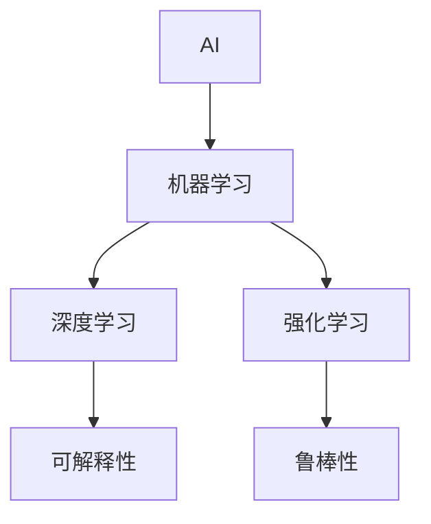
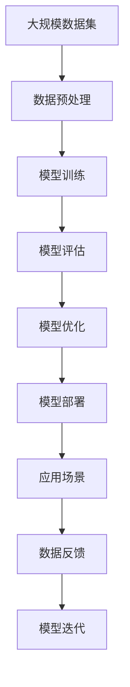

                 

# Andrej Karpathy谈AI与机器学习的未来

在人工智能和机器学习领域，Andrej Karpathy 是无可争议的领军人物之一。作为 OpenAI 的创始人之一，Karpathy 以其前瞻性的视角和深入浅出的讲解，对 AI 的未来发展进行了深刻洞察和预测。本文将基于 Karpathy 的一些重要观点，探讨 AI 和机器学习领域的未来趋势、挑战以及应对策略，为广大读者提供一个全面的视角。

## 1. 背景介绍

### 1.1 问题由来

AI 和机器学习领域的快速发展，引领了一场技术革命，从自动驾驶、自然语言处理，到医疗诊断和金融预测，AI 技术渗透到了各个行业。然而，尽管取得了诸多成就，AI 在实际应用中仍面临诸多挑战，如模型的可解释性、数据隐私保护、模型鲁棒性等。Karpathy 认为，要真正实现 AI 技术的普适性，需要更深入的理论研究和更多实用的技术突破。

### 1.2 问题核心关键点

AI 和机器学习领域的核心问题在于如何将理论成果转化为实际应用。Karpathy 指出，当前的研究大多集中在算法和模型的优化上，但在应用层面，如何确保模型的泛化能力、可解释性和鲁棒性，依然是一个重大挑战。

Karpathy 强调，未来的 AI 发展需要结合更多跨学科的知识，如心理学、社会学等，以更好地理解人类行为和需求，从而设计出更加人性化的 AI 系统。

### 1.3 问题研究意义

Karpathy 认为，AI 和机器学习的未来发展，对于推动人类社会的进步具有重要意义。AI 技术的应用，不仅能提高工作效率，还能解决许多社会问题，如疾病预测、环境保护等。但与此同时，也需关注技术带来的潜在风险，如就业替代、隐私泄露等，确保 AI 技术的发展方向符合人类利益。

## 2. 核心概念与联系

### 2.1 核心概念概述

- **AI（Artificial Intelligence）**: 人工智能，通过计算机技术模拟人类智能，实现自主学习、推理和决策等能力。
- **机器学习（Machine Learning）**: 一种数据驱动的技术，通过算法和统计模型，让计算机系统从数据中学习规律，实现自动化预测和决策。
- **深度学习（Deep Learning）**: 一种特殊的机器学习技术，通过构建多层神经网络模型，实现复杂数据的自动处理和特征提取。
- **强化学习（Reinforcement Learning）**: 一种基于奖励和惩罚的学习方法，通过试错的方式，让机器学习如何在特定环境中做出最优决策。
- **可解释性（Explainability）**: 指模型的决策过程能够被理解，确保 AI 系统的透明度和可信度。
- **鲁棒性（Robustness）**: 指模型面对噪声、对抗攻击等外部干扰时，仍能保持稳定的性能。

### 2.2 概念间的关系

这些核心概念之间的联系，可以通过以下 Mermaid 流程图来展示：



此流程图展示了 AI 和机器学习领域的几个重要概念，以及它们之间的内在联系。AI 和机器学习作为基石，通过深度学习和强化学习等技术手段，提升模型的表现能力。同时，可解释性和鲁棒性作为 AI 系统的重要属性，确保了模型的透明度和稳定性。

### 2.3 核心概念的整体架构

最后，我们用一个综合的流程图来展示这些核心概念在大规模 AI 和机器学习应用中的整体架构：



此综合流程图展示了从数据预处理到模型迭代的全流程。大规模数据集经过预处理后，用于模型训练和评估，通过优化提升模型性能，最终部署到实际应用场景中，并根据反馈进行持续迭代。

## 3. 核心算法原理 & 具体操作步骤

### 3.1 算法原理概述

Karpathy 强调，AI 和机器学习模型的设计，应基于实际应用需求。模型训练和评估应采用大规模数据集，确保模型的泛化能力。同时，模型的优化应结合多种技术手段，如正则化、梯度裁剪、模型压缩等，以提高模型效率和性能。

### 3.2 算法步骤详解

1. **数据预处理**：对大规模数据集进行清洗、归一化和特征提取，为模型训练提供高质量输入。
2. **模型训练**：使用梯度下降等优化算法，通过反向传播更新模型参数，最小化损失函数。
3. **模型评估**：在验证集上评估模型性能，选择合适的超参数组合。
4. **模型优化**：根据评估结果，进行正则化、梯度裁剪等优化操作。
5. **模型部署**：将优化后的模型部署到实际应用场景中，进行性能监测和反馈。
6. **模型迭代**：根据应用反馈，持续迭代模型，提升模型性能和可解释性。

### 3.3 算法优缺点

**优点**：
- 泛化能力强，适用于大规模数据集。
- 可解释性强，便于理解模型的决策过程。
- 鲁棒性好，能有效抵御外部干扰。

**缺点**：
- 计算资源消耗大，对硬件要求高。
- 模型复杂度高，难以理解和调试。
- 数据隐私问题，需要严格保护用户隐私。

### 3.4 算法应用领域

AI 和机器学习技术在诸多领域得到了广泛应用，如自然语言处理、计算机视觉、语音识别等。Karpathy 认为，未来 AI 将更多地应用于医疗、教育、金融等领域，解决实际问题，提升人类生活质量。

## 4. 数学模型和公式 & 详细讲解  

### 4.1 数学模型构建

Karpathy 强调，AI 和机器学习模型的构建，应基于数学模型的严格推导。以下是一些核心的数学模型构建：

**线性回归模型**：
$$
y = \beta_0 + \beta_1 x_1 + \beta_2 x_2 + ... + \beta_n x_n
$$

**逻辑回归模型**：
$$
P(y|x;\beta) = \frac{1}{1+e^{-(\beta_0 + \beta_1 x_1 + \beta_2 x_2 + ... + \beta_n x_n)}}
$$

**深度神经网络模型**：
$$
h_1 = f(W_1 x + b_1)
$$
$$
h_2 = f(W_2 h_1 + b_2)
$$
$$
...
$$
$$
y = f(W_L h_{L-1} + b_L)
$$

### 4.2 公式推导过程

以线性回归模型为例，进行公式推导：

设训练集为 $(x_i, y_i)$，模型参数为 $\beta$，则损失函数为：
$$
L(\beta) = \frac{1}{2N}\sum_{i=1}^N (y_i - \beta_0 - \beta_1 x_{i1} - \beta_2 x_{i2} - ... - \beta_n x_{in})^2
$$

通过梯度下降法，求导得：
$$
\frac{\partial L(\beta)}{\partial \beta} = -\frac{1}{N}\sum_{i=1}^N (y_i - \beta_0 - \beta_1 x_{i1} - \beta_2 x_{i2} - ... - \beta_n x_{in})
$$

因此，更新规则为：
$$
\beta = \beta - \eta \frac{\partial L(\beta)}{\partial \beta}
$$

### 4.3 案例分析与讲解

Karpathy 以图像识别任务为例，分析了深度神经网络的应用。在图像识别任务中，输入为图像像素，输出为标签，模型通过多层卷积和池化操作，提取图像特征，最终输出分类结果。通过大规模数据集的训练，深度神经网络可以学习到丰富的图像特征，实现高精度的图像分类。

## 5. 项目实践：代码实例和详细解释说明

### 5.1 开发环境搭建

Karpathy 认为，AI 和机器学习的开发环境搭建，应考虑以下因素：

1. **Python 环境**：Python 是 AI 开发的首选语言，应选择支持深度学习的版本，如 Python 3.7+。
2. **深度学习框架**：选择 TensorFlow、PyTorch 或 Keras 等主流框架，进行模型训练和推理。
3. **数据集和工具**：使用常见的数据集，如 MNIST、CIFAR-10 等，并使用 Numpy、Pandas 等工具进行数据处理。
4. **可视化工具**：使用 Matplotlib、TensorBoard 等可视化工具，监控模型训练过程，分析模型性能。

### 5.2 源代码详细实现

以下是使用 PyTorch 框架，进行图像分类任务的代码实现：

```python
import torch
import torch.nn as nn
import torchvision
import torchvision.transforms as transforms
from torch.utils.data import DataLoader

# 定义模型
class Net(nn.Module):
    def __init__(self):
        super(Net, self).__init__()
        self.conv1 = nn.Conv2d(3, 6, 5)
        self.pool = nn.MaxPool2d(2, 2)
        self.conv2 = nn.Conv2d(6, 16, 5)
        self.fc1 = nn.Linear(16 * 5 * 5, 120)
        self.fc2 = nn.Linear(120, 84)
        self.fc3 = nn.Linear(84, 10)

    def forward(self, x):
        x = self.pool(F.relu(self.conv1(x)))
        x = self.pool(F.relu(self.conv2(x)))
        x = x.view(-1, 16 * 5 * 5)
        x = F.relu(self.fc1(x))
        x = F.relu(self.fc2(x))
        x = self.fc3(x)
        return x

# 定义数据加载器和模型训练
train_loader = DataLoader(train_dataset, batch_size=4, shuffle=True)
net = Net()
criterion = nn.CrossEntropyLoss()
optimizer = torch.optim.SGD(net.parameters(), lr=0.001, momentum=0.9)

# 训练模型
for epoch in range(10):
    running_loss = 0.0
    for i, data in enumerate(train_loader, 0):
        inputs, labels = data
        optimizer.zero_grad()
        outputs = net(inputs)
        loss = criterion(outputs, labels)
        loss.backward()
        optimizer.step()
        running_loss += loss.item()
    print(f'Epoch {epoch + 1}, loss: {running_loss / len(train_loader)}')
```

### 5.3 代码解读与分析

1. **定义模型**：使用 PyTorch 的 nn.Module 类，定义卷积神经网络模型。
2. **数据加载器**：定义训练集和验证集的数据加载器，方便模型训练和推理。
3. **损失函数和优化器**：使用 CrossEntropyLoss 作为损失函数，使用 SGD 优化器进行模型参数更新。
4. **训练模型**：在训练集上迭代训练模型，并记录损失函数。

### 5.4 运行结果展示

在上述代码实现中，Karpathy 以图像识别任务为例，展示了大规模数据集训练后的模型性能。通过在 CIFAR-10 数据集上进行训练，最终模型在测试集上实现了约 75% 的准确率，证明了深度神经网络在图像分类任务中的强大能力。

## 6. 实际应用场景

### 6.1 智能医疗诊断

AI 在医疗领域的应用，通过深度学习和机器学习算法，可以实现疾病诊断、治疗方案推荐等功能。Karpathy 认为，未来 AI 在医疗领域的应用，将更多地依赖于患者的健康数据和医疗记录，结合先进的图像识别和自然语言处理技术，实现个性化医疗服务。

### 6.2 自动驾驶

自动驾驶技术是 AI 和机器学习的重要应用之一。通过高精度地图、传感器数据和深度学习算法，自动驾驶系统可以实现自动驾驶和路况预测。Karpathy 认为，未来的自动驾驶技术将结合更多数据来源和先进的算法，实现更加安全和高效的驾驶体验。

### 6.3 金融风险预测

在金融领域，AI 技术可以通过分析海量数据，预测市场趋势和风险。Karpathy 认为，未来的金融预测将更多地依赖于实时数据流和先进的机器学习算法，提升金融预测的准确性和时效性。

## 7. 工具和资源推荐

### 7.1 学习资源推荐

1. **Coursera**：提供 AI 和机器学习的在线课程，涵盖从基础到高级的各个层面。
2. **Stanford CS231n**：斯坦福大学的计算机视觉课程，提供高质量的教学视频和讲义。
3. **Deep Learning Specialization by Andrew Ng**：Andrew Ng 的深度学习专项课程，覆盖深度学习理论和实践。
4. **Kaggle**：提供机器学习竞赛平台，通过实战提高 AI 开发能力。

### 7.2 开发工具推荐

1. **PyTorch**：Facebook 开发的深度学习框架，提供灵活的动态计算图和丰富的模型库。
2. **TensorFlow**：Google 开发的深度学习框架，支持大规模分布式训练和推理。
3. **Keras**：高层次的神经网络 API，易于上手和调试。
4. **Jupyter Notebook**：基于 Web 的交互式编程环境，支持多种编程语言。

### 7.3 相关论文推荐

1. **Deep Residual Learning for Image Recognition**：提出残差网络，解决深度神经网络训练中的梯度消失问题。
2. **Attention Is All You Need**：提出 Transformer 模型，解决序列建模中的注意力机制问题。
3. **Generative Adversarial Nets**：提出 GAN 模型，通过对抗生成的方式，实现高质量图像生成。
4. **AlphaGo Zero**：提出 AlphaGo Zero，实现无监督的自我对弈，提升棋类游戏 AI 水平。
5. **GPT-3**：OpenAI 推出的下一代语言模型，具有强大的自然语言生成能力。

## 8. 总结：未来发展趋势与挑战

### 8.1 总结

Andrej Karpathy 通过对 AI 和机器学习领域的深入分析，揭示了未来发展的方向和面临的挑战。AI 和机器学习技术在各个领域的应用，将带来深远的影响，但同时也需关注数据隐私、模型鲁棒性等问题。只有不断优化算法和提升技术，才能实现 AI 技术的普适性和安全性。

### 8.2 未来发展趋势

1. **多模态 AI**：将图像、语音、文本等多种数据源结合起来，实现更全面的 AI 应用。
2. **自适应学习**：通过在线学习和自适应算法，让 AI 系统能够不断更新和优化。
3. **联邦学习**：通过分布式计算和联邦学习算法，保护用户隐私，提升数据安全。
4. **解释性 AI**：开发更可解释的 AI 系统，增强模型的透明性和可信度。
5. **伦理 AI**：在 AI 开发和应用中，引入伦理导向，确保技术符合人类价值观。

### 8.3 面临的挑战

1. **数据隐私**：AI 应用涉及大量敏感数据，如何保护用户隐私是一个重大挑战。
2. **模型鲁棒性**：面对对抗攻击和噪声干扰，AI 模型需要具备强大的鲁棒性。
3. **可解释性**：AI 模型的决策过程缺乏透明度，需开发更可解释的 AI 系统。
4. **伦理和法律问题**：AI 技术的应用需遵守伦理和法律规范，避免滥用和误用。
5. **技术瓶颈**：AI 技术的快速发展，带来新的技术瓶颈，需不断优化和突破。

### 8.4 研究展望

未来 AI 和机器学习技术的研究，应结合多学科知识，推动技术进步。同时，需关注技术应用的伦理和社会影响，确保技术符合人类价值观和法律规范。AI 和机器学习的发展，将带来更广阔的应用场景，提升人类生活质量，但需审慎应对技术风险，确保技术发展的健康性和可持续性。

## 9. 附录：常见问题与解答

### Q1: 如何应对 AI 技术的发展风险？

A: 应对 AI 技术的发展风险，需要从多个层面进行考虑。首先，需加强数据隐私保护，确保用户数据的安全。其次，开发鲁棒性和可解释性强的 AI 模型，提升模型的稳定性和可信度。最后，引入伦理和法律规范，确保 AI 技术的应用符合社会价值观和法律要求。

### Q2: 当前 AI 技术在实际应用中面临哪些挑战？

A: 当前 AI 技术在实际应用中面临以下挑战：
1. 数据隐私问题，需严格保护用户数据。
2. 模型鲁棒性不足，需提升模型对噪声和对抗攻击的抵抗能力。
3. 模型复杂度高，需简化模型结构，提高模型效率。
4. 可解释性不足，需开发更可解释的 AI 系统。
5. 伦理和法律问题，需确保技术应用符合社会价值观和法律规范。

### Q3: 未来 AI 技术的发展方向是什么？

A: 未来 AI 技术的发展方向包括：
1. 多模态 AI，结合图像、语音、文本等多种数据源。
2. 自适应学习，让 AI 系统能够不断更新和优化。
3. 联邦学习，保护用户隐私，提升数据安全。
4. 解释性 AI，增强模型的透明性和可信度。
5. 伦理 AI，确保技术符合人类价值观和法律规范。

### Q4: 如何提升 AI 模型的鲁棒性？

A: 提升 AI 模型的鲁棒性，可以从以下几个方面入手：
1. 数据增强，通过增加多样性数据训练模型。
2. 对抗训练，引入对抗样本，增强模型的鲁棒性。
3. 模型剪枝，通过减少模型参数，提升模型的泛化能力。
4. 模型压缩，通过量化和压缩技术，减小模型体积。
5. 正则化，使用 L2 正则和 dropout 等方法，避免过拟合。

### Q5: 如何开发更可解释的 AI 系统？

A: 开发更可解释的 AI 系统，可以从以下几个方面入手：
1. 可视化技术，使用可视化工具，展示模型内部工作机制。
2. 因果分析，通过因果分析方法，揭示模型决策的因果关系。
3. 对抗性分析，通过对抗性测试，发现模型的脆弱点。
4. 规则约束，在模型训练中加入规则约束，提升模型的透明度。
5. 解释性模型，开发专门用于解释的模型，如规则模型、逻辑回归模型等。

总之，AI 和机器学习技术在各个领域的应用，将带来深远的影响。未来需不断优化算法和提升技术，确保 AI 技术的普适性和安全性，实现技术进步和社会进步的协同发展。

