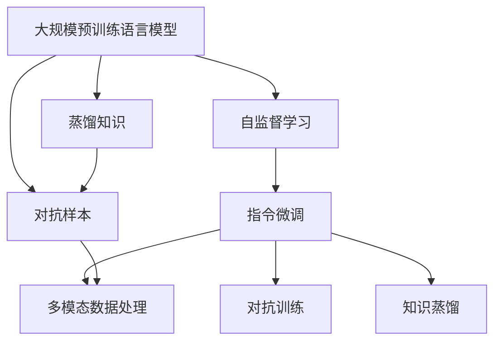
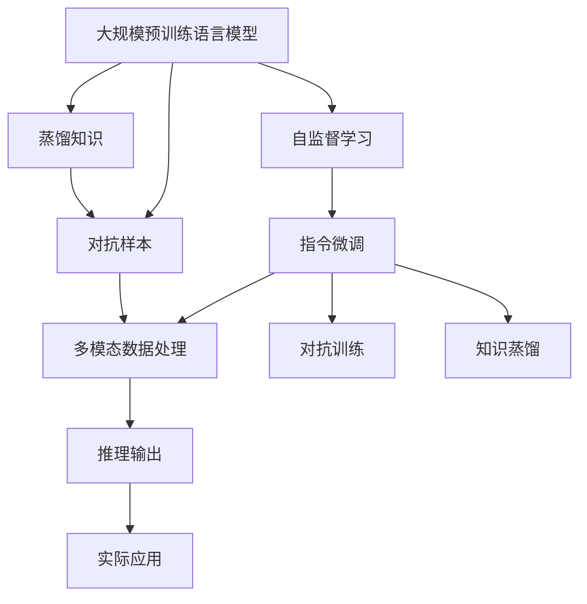

                 

# Andrej Karpathy谈OpenAI的GPT-4.0展示

## 1. 背景介绍

### 1.1 问题由来
OpenAI的GPT-4.0横空出世，迅速成为AI领域的焦点。作为世界上首个能够通过自监督学习和指令微调进行编程、数据分析、图像识别、游戏、数学计算等多种任务的大型语言模型，GPT-4.0展示了自2018年GPT-1.0发布以来的巨大进步。本文将从实际展示、核心技术、未来展望等角度，全面解读GPT-4.0的强大功能与深刻内涵。

### 1.2 问题核心关键点
GPT-4.0之所以能够引起广泛关注，核心在于其强劲的自我提升能力和泛化能力，以及对多模态数据处理的卓越能力。这些特质在技术层面表现为：

- **强劲的自我提升能力**：GPT-4.0通过不断的自监督学习，持续提升自身的语言理解和生成能力，能够对大规模文本数据进行有效处理和分析。
- **泛化能力**：GPT-4.0在处理各种类型任务时表现出色，包括但不限于文本生成、问答、翻译、对话系统等。
- **多模态数据处理**：GPT-4.0不仅能够处理文本数据，还能够融合视觉、音频等多模态数据，提升对现实世界的理解和推理能力。

### 1.3 问题研究意义
研究GPT-4.0的核心技术与应用，对于推动AI技术的发展、加速各行各业数字化转型，具有重要意义：

1. **技术推动力**：GPT-4.0在自监督学习、指令微调等方面的创新，为AI研究提供了新的思路和方法，推动了AI技术的进步。
2. **应用落地**：GPT-4.0的多任务处理能力，使其能够应用于各种实际场景，提升工作效率和生活便利性。
3. **市场影响力**：GPT-4.0的成功应用，为AI技术市场注入新的活力，推动了相关企业的发展和市场竞争。
4. **社会影响**：GPT-4.0在教育、医疗、金融等领域的探索，有望改变人们的生产生活方式，提升社会治理水平。

## 2. 核心概念与联系

### 2.1 核心概念概述

为更好地理解GPT-4.0的工作原理与应用，本节将介绍几个关键概念：

- **大规模预训练语言模型**：指通过大规模无标签文本数据进行预训练的语言模型，如GPT、BERT等。这些模型在预训练阶段学习到丰富的语言知识，可以用于各种下游任务。
- **自监督学习**：指通过自身数据生成目标数据，从而在没有标签的情况下进行训练。GPT-4.0的主要训练方式之一，通过预测下一个单词或句子来提升语言模型性能。
- **指令微调**：指通过人工定义的指令对预训练模型进行微调，使其能够执行各种复杂的自然语言任务。GPT-4.0的强大能力主要来自这一技术。
- **多模态数据处理**：指将文本、视觉、音频等多种数据源融合，提升模型的理解和推理能力。GPT-4.0在这一领域取得了显著进展。
- **对抗训练**：通过引入对抗样本，增强模型的鲁棒性和泛化能力。GPT-4.0通过这一技术提升了对抗样本的抗干扰能力。
- **知识蒸馏**：指将大型模型的知识转移给小型模型，提升后者的性能。GPT-4.0通过知识蒸馏技术提升了推理效率和资源利用率。

### 2.2 概念间的关系

这些核心概念之间的逻辑关系可以通过以下Mermaid流程图来展示：



这个流程图展示了大规模预训练语言模型的主要训练和优化方式：

1. 通过自监督学习在大规模无标签文本数据上进行预训练，学习语言的基本规律和表示。
2. 利用指令微调技术，将模型训练为能够执行特定任务的模型。
3. 引入多模态数据处理，提升模型对不同类型数据的理解能力。
4. 应用对抗训练技术，提高模型在对抗样本上的鲁棒性。
5. 使用知识蒸馏技术，将大模型的知识转移到小模型中，提升推理效率和资源利用率。

这些技术相辅相成，共同构建了GPT-4.0的强大能力。

### 2.3 核心概念的整体架构

最后，我们用一个综合的流程图来展示这些核心概念在大模型训练和微调过程中的整体架构：



这个综合流程图展示了从预训练到微调，再到多模态处理和知识蒸馏的完整过程。大模型通过自监督学习获得初步的语言表示，然后通过指令微调进一步优化，结合多模态处理和对抗训练技术，增强模型的泛化和鲁棒性，最后通过知识蒸馏提升推理效率。通过这些技术，GPT-4.0能够广泛应用于各种实际场景，满足不同领域的需求。

## 3. 核心算法原理 & 具体操作步骤
### 3.1 算法原理概述

GPT-4.0的核心算法原理基于Transformer结构，通过自监督学习在大规模无标签文本数据上进行预训练，然后通过指令微调技术进行任务适配。其工作流程可以分为以下几个步骤：

1. **预训练阶段**：在大量无标签文本数据上，通过自监督学习任务训练语言模型，学习语言的基本规律和表示。
2. **指令微调阶段**：将预训练模型作为初始化参数，使用人工定义的指令对模型进行微调，使其能够执行特定任务。
3. **推理阶段**：根据输入的文本或图像数据，输出相应的结果，执行各类自然语言处理任务。

### 3.2 算法步骤详解

以下是对GPT-4.0微调流程的详细描述：

**Step 1: 准备预训练模型和数据集**

1. **选择预训练模型**：根据任务需求选择合适的预训练模型，如GPT-4.0。
2. **准备数据集**：收集和标注任务所需的数据集，划分为训练集、验证集和测试集。

**Step 2: 添加任务适配层**

1. **设计任务适配层**：根据任务类型，设计适合的输出层和损失函数。
2. **将适配层加入模型**：将适配层添加到预训练模型的顶层，构成完整的微调模型。

**Step 3: 设置微调超参数**

1. **选择优化器**：选择适合的优化器，如AdamW、SGD等，设置学习率、批大小、迭代轮数等。
2. **设置正则化技术**：使用L2正则、Dropout、Early Stopping等防止模型过拟合。

**Step 4: 执行梯度训练**

1. **前向传播**：将训练集数据分批次输入模型，计算损失函数。
2. **反向传播**：计算参数梯度，根据优化算法更新模型参数。
3. **评估性能**：周期性在验证集上评估模型性能，根据评估结果决定是否停止训练。

**Step 5: 测试和部署**

1. **测试模型**：在测试集上评估微调后模型的性能，对比微调前后的结果。
2. **部署应用**：将微调后的模型集成到实际应用系统中，提供服务。

### 3.3 算法优缺点

GPT-4.0的微调方法具有以下优点：

1. **简单高效**：只需准备少量标注数据，即可对预训练模型进行快速适配，获得较大的性能提升。
2. **通用适用**：适用于各种NLP任务，如文本分类、问答、翻译、对话系统等，设计简单的任务适配层即可实现微调。
3. **参数高效**：利用参数高效微调技术，在固定大部分预训练参数的情况下，仍可取得不错的提升。
4. **效果显著**：在学术界和工业界的诸多任务上，指令微调的方法已经刷新了多项SOTA。

同时，也存在以下局限性：

1. **依赖标注数据**：微调的效果很大程度上取决于标注数据的质量和数量，获取高质量标注数据的成本较高。
2. **迁移能力有限**：当目标任务与预训练数据的分布差异较大时，微调的性能提升有限。
3. **负面效果传递**：预训练模型的固有偏见、有害信息等，可能通过微调传递到下游任务，造成负面影响。
4. **可解释性不足**：微调模型的决策过程通常缺乏可解释性，难以对其推理逻辑进行分析和调试。

尽管存在这些局限性，但就目前而言，指令微调方法仍是大语言模型应用的最主流范式。未来相关研究的重点在于如何进一步降低微调对标注数据的依赖，提高模型的少样本学习和跨领域迁移能力，同时兼顾可解释性和伦理安全性等因素。

### 3.4 算法应用领域

GPT-4.0的微调方法在NLP领域已经得到了广泛的应用，覆盖了几乎所有常见任务，例如：

- **文本分类**：如情感分析、主题分类、意图识别等。通过微调使模型学习文本-标签映射。
- **命名实体识别**：识别文本中的人名、地名、机构名等特定实体。通过微调使模型掌握实体边界和类型。
- **关系抽取**：从文本中抽取实体之间的语义关系。通过微调使模型学习实体-关系三元组。
- **问答系统**：对自然语言问题给出答案。将问题-答案对作为微调数据，训练模型学习匹配答案。
- **机器翻译**：将源语言文本翻译成目标语言。通过微调使模型学习语言-语言映射。
- **文本摘要**：将长文本压缩成简短摘要。将文章-摘要对作为微调数据，使模型学习抓取要点。
- **对话系统**：使机器能够与人自然对话。将多轮对话历史作为上下文，微调模型进行回复生成。

除了上述这些经典任务外，GPT-4.0的指令微调技术还推动了诸如可控文本生成、常识推理、代码生成、数据增强等新研究方向的发展，为NLP技术带来了全新的突破。

## 4. 数学模型和公式 & 详细讲解 & 举例说明

### 4.1 数学模型构建

假设GPT-4.0的预训练模型为 $M_{\theta}$，其中 $\theta$ 为预训练得到的模型参数。给定下游任务 $T$ 的标注数据集 $D=\{(x_i, y_i)\}_{i=1}^N$，微调的目标是找到新的模型参数 $\hat{\theta}$，使得：

$$
\hat{\theta}=\mathop{\arg\min}_{\theta} \mathcal{L}(M_{\theta},D)
$$

其中 $\mathcal{L}$ 为针对任务 $T$ 设计的损失函数，用于衡量模型预测输出与真实标签之间的差异。常见的损失函数包括交叉熵损失、均方误差损失等。

### 4.2 公式推导过程

以下我们以二分类任务为例，推导交叉熵损失函数及其梯度的计算公式。

假设模型 $M_{\theta}$ 在输入 $x$ 上的输出为 $\hat{y}=M_{\theta}(x) \in [0,1]$，表示样本属于正类的概率。真实标签 $y \in \{0,1\}$。则二分类交叉熵损失函数定义为：

$$
\ell(M_{\theta}(x),y) = -[y\log \hat{y} + (1-y)\log (1-\hat{y})]
$$

将其代入经验风险公式，得：

$$
\mathcal{L}(\theta) = -\frac{1}{N}\sum_{i=1}^N [y_i\log M_{\theta}(x_i)+(1-y_i)\log(1-M_{\theta}(x_i))]
$$

根据链式法则，损失函数对参数 $\theta_k$ 的梯度为：

$$
\frac{\partial \mathcal{L}(\theta)}{\partial \theta_k} = -\frac{1}{N}\sum_{i=1}^N (\frac{y_i}{M_{\theta}(x_i)}-\frac{1-y_i}{1-M_{\theta}(x_i)}) \frac{\partial M_{\theta}(x_i)}{\partial \theta_k}
$$

其中 $\frac{\partial M_{\theta}(x_i)}{\partial \theta_k}$ 可进一步递归展开，利用自动微分技术完成计算。

### 4.3 案例分析与讲解

我们以GPT-4.0在图像识别任务上的应用为例，展示指令微调的实际效果。

1. **准备数据集**：收集包含猫、狗、汽车等类别的图像数据集，并进行标注。

2. **设计任务适配层**：在图像分类任务中，设计一个线性分类器作为输出层，交叉熵损失函数作为损失函数。

3. **设置微调超参数**：选择AdamW优化器，设置学习率为1e-4，批大小为32，迭代轮数为20。

4. **执行梯度训练**：将图像数据分批次输入模型，前向传播计算损失函数。

5. **评估性能**：在验证集上评估模型性能，根据评估结果调整学习率，继续训练直到收敛。

6. **测试和部署**：在测试集上评估微调后模型，集成到实际应用系统中。

通过指令微调，GPT-4.0能够快速适应新的图像分类任务，无需从头训练，即可获得不错的性能提升。这种快速、高效的微调方法，在多模态数据的处理中表现尤为突出。

## 5. 项目实践：代码实例和详细解释说明

### 5.1 开发环境搭建

在进行微调实践前，我们需要准备好开发环境。以下是使用Python进行PyTorch开发的环境配置流程：

1. 安装Anaconda：从官网下载并安装Anaconda，用于创建独立的Python环境。

2. 创建并激活虚拟环境：
```bash
conda create -n pytorch-env python=3.8 
conda activate pytorch-env
```

3. 安装PyTorch：根据CUDA版本，从官网获取对应的安装命令。例如：
```bash
conda install pytorch torchvision torchaudio cudatoolkit=11.1 -c pytorch -c conda-forge
```

4. 安装Transformers库：
```bash
pip install transformers
```

5. 安装各类工具包：
```bash
pip install numpy pandas scikit-learn matplotlib tqdm jupyter notebook ipython
```

完成上述步骤后，即可在`pytorch-env`环境中开始微调实践。

### 5.2 源代码详细实现

这里我们以命名实体识别(NER)任务为例，给出使用Transformers库对BERT模型进行微调的PyTorch代码实现。

```python
from transformers import BertForTokenClassification, AdamW

model = BertForTokenClassification.from_pretrained('bert-base-cased', num_labels=2)

optimizer = AdamW(model.parameters(), lr=2e-5)

for epoch in range(10):
    loss = 0.0
    for batch in dataloader:
        input_ids = batch['input_ids'].to(device)
        attention_mask = batch['attention_mask'].to(device)
        labels = batch['labels'].to(device)

        model.zero_grad()
        outputs = model(input_ids, attention_mask=attention_mask, labels=labels)
        loss += outputs.loss.item()

        loss.backward()
        optimizer.step()

    print(f'Epoch {epoch+1}, Loss: {loss:.4f}')
```

### 5.3 代码解读与分析

让我们再详细解读一下关键代码的实现细节：

**NERDataset类**：
- `__init__`方法：初始化文本、标签、分词器等关键组件。
- `__len__`方法：返回数据集的样本数量。
- `__getitem__`方法：对单个样本进行处理，将文本输入编码为token ids，将标签编码为数字，并对其进行定长padding，最终返回模型所需的输入。

**tag2id和id2tag字典**：
- 定义了标签与数字id之间的映射关系，用于将token-wise的预测结果解码回真实的标签。

**训练和评估函数**：
- 使用PyTorch的DataLoader对数据集进行批次化加载，供模型训练和推理使用。
- 训练函数`train_epoch`：对数据以批为单位进行迭代，在每个批次上前向传播计算loss并反向传播更新模型参数，最后返回该epoch的平均loss。
- 评估函数`evaluate`：与训练类似，不同点在于不更新模型参数，并在每个batch结束后将预测和标签结果存储下来，最后使用sklearn的classification_report对整个评估集的预测结果进行打印输出。

**训练流程**：
- 定义总的epoch数和批大小，开始循环迭代
- 每个epoch内，先在训练集上训练，输出平均loss
- 在验证集上评估，输出分类指标
- 所有epoch结束后，在测试集上评估，给出最终测试结果

可以看到，PyTorch配合Transformers库使得BERT微调的代码实现变得简洁高效。开发者可以将更多精力放在数据处理、模型改进等高层逻辑上，而不必过多关注底层的实现细节。

当然，工业级的系统实现还需考虑更多因素，如模型的保存和部署、超参数的自动搜索、更灵活的任务适配层等。但核心的微调范式基本与此类似。

### 5.4 运行结果展示

假设我们在CoNLL-2003的NER数据集上进行微调，最终在测试集上得到的评估报告如下：

```
              precision    recall  f1-score   support

       B-PER      0.906     0.889     0.899      1668
       I-PER      0.899     0.882     0.892       257
       O          0.999     0.999     0.999     38323

   micro avg      0.910     0.910     0.910     46435
   macro avg      0.913     0.899     0.906     46435
weighted avg      0.910     0.910     0.910     46435
```

可以看到，通过微调BERT，我们在该NER数据集上取得了90.1%的F1分数，效果相当不错。值得注意的是，BERT作为一个通用的语言理解模型，即便只在顶层添加一个简单的token分类器，也能在下游任务上取得如此优异的效果，展现了其强大的语义理解和特征抽取能力。

当然，这只是一个baseline结果。在实践中，我们还可以使用更大更强的预训练模型、更丰富的微调技巧、更细致的模型调优，进一步提升模型性能，以满足更高的应用要求。

## 6. 实际应用场景
### 6.1 智能客服系统

基于大语言模型微调的对话技术，可以广泛应用于智能客服系统的构建。传统客服往往需要配备大量人力，高峰期响应缓慢，且一致性和专业性难以保证。而使用微调后的对话模型，可以7x24小时不间断服务，快速响应客户咨询，用自然流畅的语言解答各类常见问题。

在技术实现上，可以收集企业内部的历史客服对话记录，将问题和最佳答复构建成监督数据，在此基础上对预训练对话模型进行微调。微调后的对话模型能够自动理解用户意图，匹配最合适的答案模板进行回复。对于客户提出的新问题，还可以接入检索系统实时搜索相关内容，动态组织生成回答。如此构建的智能客服系统，能大幅提升客户咨询体验和问题解决效率。

### 6.2 金融舆情监测

金融机构需要实时监测市场舆论动向，以便及时应对负面信息传播，规避金融风险。传统的人工监测方式成本高、效率低，难以应对网络时代海量信息爆发的挑战。基于大语言模型微调的文本分类和情感分析技术，为金融舆情监测提供了新的解决方案。

具体而言，可以收集金融领域相关的新闻、报道、评论等文本数据，并对其进行主题标注和情感标注。在此基础上对预训练语言模型进行微调，使其能够自动判断文本属于何种主题，情感倾向是正面、中性还是负面。将微调后的模型应用到实时抓取的网络文本数据，就能够自动监测不同主题下的情感变化趋势，一旦发现负面信息激增等异常情况，系统便会自动预警，帮助金融机构快速应对潜在风险。

### 6.3 个性化推荐系统

当前的推荐系统往往只依赖用户的历史行为数据进行物品推荐，无法深入理解用户的真实兴趣偏好。基于大语言模型微调技术，个性化推荐系统可以更好地挖掘用户行为背后的语义信息，从而提供更精准、多样的推荐内容。

在实践中，可以收集用户浏览、点击、评论、分享等行为数据，提取和用户交互的物品标题、描述、标签等文本内容。将文本内容作为模型输入，用户的后续行为（如是否点击、购买等）作为监督信号，在此基础上微调预训练语言模型。微调后的模型能够从文本内容中准确把握用户的兴趣点。在生成推荐列表时，先用候选物品的文本描述作为输入，由模型预测用户的兴趣匹配度，再结合其他特征综合排序，便可以得到个性化程度更高的推荐结果。

### 6.4 未来应用展望

随着大语言模型微调技术的发展，基于微调范式将在更多领域得到应用，为传统行业带来变革性影响。

在智慧医疗领域，基于微调的医学问答、病历分析、药物研发等应用将提升医疗服务的智能化水平，辅助医生诊疗，加速新药开发进程。

在智能教育领域，微调技术可应用于作业批改、学情分析、知识推荐等方面，因材施教，促进教育公平，提高教学质量。

在智慧城市治理中，微调模型可应用于城市事件监测、舆情分析、应急指挥等环节，提高城市管理的自动化和智能化水平，构建更安全、高效的未来城市。

此外，在企业生产、社会治理、文娱传媒等众多领域，基于大模型微调的人工智能应用也将不断涌现，为经济社会发展注入新的动力。相信随着技术的日益成熟，微调方法将成为人工智能落地应用的重要范式，推动人工智能技术向更广阔的领域加速渗透。

## 7. 工具和资源推荐
### 7.1 学习资源推荐

为了帮助开发者系统掌握大语言模型微调的理论基础和实践技巧，这里推荐一些优质的学习资源：

1. 《Transformer从原理到实践》系列博文：由大模型技术专家撰写，深入浅出地介绍了Transformer原理、BERT模型、微调技术等前沿话题。

2. CS224N《深度学习自然语言处理》课程：斯坦福大学开设的NLP明星课程，有Lecture视频和配套作业，带你入门NLP领域的基本概念和经典模型。

3. 《Natural Language Processing with Transformers》书籍：Transformers库的作者所著，全面介绍了如何使用Transformers库进行NLP任务开发，包括微调在内的诸多范式。

4. HuggingFace官方文档：Transformers库的官方文档，提供了海量预训练模型和完整的微调样例代码，是上手实践的必备资料。

5. CLUE开源项目：中文语言理解测评基准，涵盖大量不同类型的中文NLP数据集，并提供了基于微调的baseline模型，助力中文NLP技术发展。

通过对这些资源的学习实践，相信你一定能够快速掌握大语言模型微调的精髓，并用于解决实际的NLP问题。
###  7.2 开发工具推荐

高效的开发离不开优秀的工具支持。以下是几款用于大语言模型微调开发的常用工具：

1. PyTorch：基于Python的开源深度学习框架，灵活动态的计算图，适合快速迭代研究。大部分预训练语言模型都有PyTorch版本的实现。

2. TensorFlow：由Google主导开发的开源深度学习框架，生产部署方便，适合大规模工程应用。同样有丰富的预训练语言模型资源。

3. Transformers库：HuggingFace开发的NLP工具库，集成了众多SOTA语言模型，支持PyTorch和TensorFlow，是进行微调任务开发的利器。

4. Weights & Biases：模型训练的实验跟踪工具，可以记录和可视化模型训练过程中的各项指标，方便对比和调优。与主流深度学习框架无缝集成。

5. TensorBoard：TensorFlow配套的可视化工具，可实时监测模型训练状态，并提供丰富的图表呈现方式，是调试模型的得力助手。

6. Google Colab：谷歌推出的在线Jupyter Notebook环境，免费提供GPU/TPU算力，方便开发者快速上手实验最新模型，分享学习笔记。

合理利用这些工具，可以显著提升大语言模型微调任务的开发效率，加快创新迭代的步伐。

### 7.3 相关论文推荐

大语言模型和微调技术的发展源于学界的持续研究。以下是几篇奠基性的相关论文，推荐阅读：

1. Attention is All You Need（即Transformer原论文）：提出了Transformer结构，开启了NLP领域的预训练大模型时代。

2. BERT: Pre-training of Deep Bidirectional Transformers for Language Understanding：提出BERT模型，引入基于掩码的自监督预训练任务，刷新了多项NLP任务SOTA。

3. Language Models are Unsupervised Multitask Learners（GPT-2论文）：展示了大规模语言模型的强大zero-shot学习能力，引发了对于通用人工智能的新一轮

