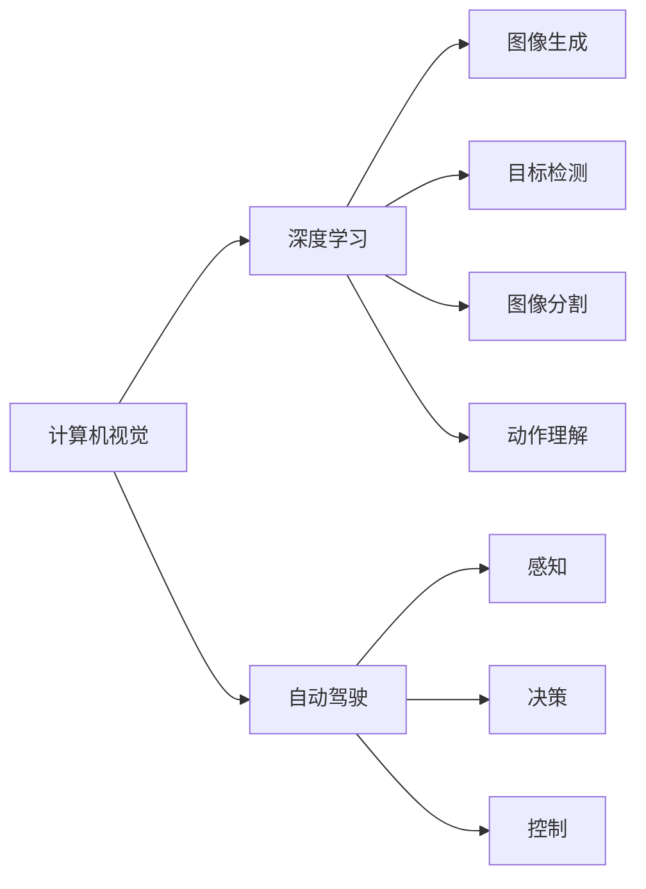

                 

# Andrej Karpathy：AI 大神

## 1. 背景介绍

### 1.1 问题由来
在人工智能领域，有几位被公认为“大神级”的科学家，他们在推动AI技术的进步中起到了关键作用。这些专家不仅在学术界取得了丰硕成果，还通过实际应用将AI技术带入各行各业。Andrej Karpathy就是其中一位杰出的代表。

Andrej Karpathy，斯坦福大学计算机视觉研究中心主任，同时也是OpenAI的研究员，因其在计算机视觉、深度学习和自动驾驶领域的突破性贡献而享誉全球。他不仅发表论文无数，还通过其在社交媒体上的讲解和分享，将复杂的AI技术通俗易懂地传达给了更广泛的受众。

本文将通过介绍Andrej Karpathy的学术背景、技术贡献以及他的影响力，探讨他对AI发展的推动作用，并分析其未来可能的研究方向和挑战。

## 2. 核心概念与联系

### 2.1 核心概念概述

Andrej Karpathy的研究领域涵盖了计算机视觉、深度学习、自动驾驶等多个领域。以下是对他工作中核心概念的概述：

- **计算机视觉**：研究如何使计算机能够“看”和“理解”图像和视频数据。Karpathy在这一领域的贡献包括图像生成、目标检测、图像分割、动作理解等。
- **深度学习**：利用神经网络结构，通过大量数据进行训练，以实现对复杂问题的自动化处理。Karpathy在深度学习方面的工作包括卷积神经网络（CNN）、递归神经网络（RNN）、变分自编码器（VAE）等。
- **自动驾驶**：结合计算机视觉和深度学习技术，开发能够在复杂环境下自主驾驶的汽车系统。Karpathy在自动驾驶方面的工作涉及感知、决策和控制等多个层面。

这些核心概念相互交织，共同构成了Karpathy对AI领域的研究和实践基础。通过这些概念的有机结合，Karpathy推动了AI技术的不断发展，并影响了许多前沿技术的发展方向。

### 2.2 概念间的关系

以下是一个合成的Mermaid流程图，展示了Karpathy研究的核心概念之间的关系：



这个流程图展示了Karpathy研究的核心概念：计算机视觉、深度学习、自动驾驶，以及在这些领域内的具体技术实现。这些技术相互关联，共同推动了AI技术的发展。

### 2.3 核心概念的整体架构

最后，我们用一个综合的流程图来展示Karpathy研究的核心概念和它们之间的整体架构：

```mermaid
graph TB
    A[计算机视觉] --> B[深度学习]
    A --> C[图像生成]
    A --> D[目标检测]
    A --> E[图像分割]
    A --> F[动作理解]
    B --> G[卷积神经网络 (CNN)]
    B --> H[递归神经网络 (RNN)]
    B --> I[变分自编码器 (VAE)]
    C --> J[感知]
    D --> J
    E --> J
    F --> J
    G --> K[自动驾驶]
    H --> K
    I --> K
```

这个综合流程图展示了Karpathy研究的核心概念及其之间的整体架构：计算机视觉通过深度学习技术，在图像生成、目标检测、图像分割、动作理解等多个方面进行应用。深度学习技术中的CNN、RNN、VAE等算法，为计算机视觉和自动驾驶提供了强有力的支持。自动驾驶则是计算机视觉和深度学习技术的重要应用领域。

## 3. 核心算法原理 & 具体操作步骤
### 3.1 算法原理概述

Andrej Karpathy的研究和实践工作涉及多个核心算法和技术，以下是对这些算法原理的概述：

- **卷积神经网络（CNN）**：一种特殊的神经网络结构，通过卷积层和池化层等操作，从输入图像中提取特征。CNN在图像分类、物体检测等计算机视觉任务中表现出色。
- **递归神经网络（RNN）**：一种能够处理序列数据的神经网络结构，适用于处理时间序列数据，如语音识别、机器翻译等。
- **变分自编码器（VAE）**：一种生成模型，能够学习数据的隐含表示，并生成新的数据样本。VAE在图像生成和数据压缩等方面有重要应用。
- **迁移学习**：利用已经在大规模数据上预训练的模型，在小规模数据上进行微调，以快速适应新的任务。

Karpathy的工作还包括对深度学习优化算法、生成对抗网络（GAN）、强化学习等领域的贡献。他的研究通过这些核心算法和技术，推动了AI技术的不断进步。

### 3.2 算法步骤详解

以下是对Karpathy工作中核心算法和技术的详细步骤讲解：

**步骤1：数据预处理和增强**

对于计算机视觉任务，数据预处理包括图像缩放、裁剪、归一化等。数据增强则通过旋转、翻转、加噪声等操作，扩充训练数据集，以提高模型的泛化能力。

**步骤2：模型训练**

- **CNN模型**：在图像分类任务中，使用CNN模型对输入图像进行特征提取和分类。常用的优化算法包括Adam、SGD等。
- **RNN模型**：在序列数据处理任务中，使用RNN模型对时间序列数据进行建模。RNN模型的训练过程通常涉及序列数据的填充和截断等预处理。
- **VAE模型**：在生成任务中，使用VAE模型生成新的图像或视频。VAE模型的训练过程通常涉及数据的隐含表示学习和解码器的训练。

**步骤3：模型微调和优化**

- **迁移学习**：在大规模预训练模型的基础上，对模型进行微调，以适应新的任务。微调过程通常涉及学习率的调整、正则化的应用等。
- **优化算法**：使用梯度下降等优化算法，最小化损失函数，优化模型的参数。

**步骤4：模型评估和部署**

- **评估**：在测试集上对模型进行评估，通常使用准确率、召回率等指标衡量模型性能。
- **部署**：将模型部署到实际应用中，如自动驾驶、图像生成等任务中，进行实时推理和预测。

### 3.3 算法优缺点

**优点：**

- **高效性**：Karpathy的研究工作涉及多个核心算法和技术，这些算法在处理图像、序列数据等方面表现出色。
- **广泛应用**：其研究成果在计算机视觉、深度学习、自动驾驶等多个领域得到了广泛应用，推动了AI技术的快速发展。
- **可扩展性**：这些算法和技术的可扩展性高，能够适应不同规模和复杂度的任务。

**缺点：**

- **高计算成本**：大规模数据集和高性能计算资源的需求，使得这些算法和技术的实现成本较高。
- **复杂性**：这些算法和技术的实现过程较为复杂，需要较高的技术积累和经验。
- **可解释性不足**：深度学习模型，尤其是复杂的神经网络结构，其内部工作机制难以解释，对模型理解和优化带来了挑战。

### 3.4 算法应用领域

Andrej Karpathy的研究工作在多个领域都取得了显著进展，以下是对其研究的主要应用领域的概述：

- **自动驾驶**：通过计算机视觉和深度学习技术，开发能够在复杂环境下自主驾驶的汽车系统。
- **图像生成**：使用生成对抗网络（GAN）等技术，生成高质量的图像和视频。
- **物体检测**：开发高效的物体检测算法，如Faster R-CNN、YOLO等，以实现自动驾驶和计算机视觉任务。
- **动作理解**：利用动作识别算法，对视频数据进行动作理解，如篮球比赛、足球比赛等体育赛事的自动生成和解说。

## 4. 数学模型和公式 & 详细讲解  
### 4.1 数学模型构建

在Karpathy的研究中，涉及多个数学模型，以下是对这些模型构建的概述：

**图像分类**：使用CNN模型对输入图像进行特征提取和分类。数学模型构建包括卷积层、池化层、全连接层等。

**序列建模**：使用RNN模型对时间序列数据进行建模。数学模型构建包括隐藏层、循环结构、门控机制等。

**生成模型**：使用VAE模型生成新的图像或视频。数学模型构建包括编码器、解码器、损失函数等。

**迁移学习**：在大规模预训练模型的基础上，对模型进行微调。数学模型构建包括损失函数、优化算法、正则化等。

### 4.2 公式推导过程

以下是对Karpathy研究中核心数学模型的公式推导过程：

**CNN模型**：

卷积层的公式推导如下：

$$
\text{Conv}(x, w) = \sum_{i,j} w_{i,j} x_{i,j}
$$

池化层的公式推导如下：

$$
\text{Pool}(x) = \max(x_{i,j})
$$

全连接层的公式推导如下：

$$
\text{FC}(x) = \sum_{i} w_i x_i + b
$$

**RNN模型**：

递归神经网络的公式推导如下：

$$
h_t = f(h_{t-1}, x_t)
$$

其中 $f$ 为激活函数，$h_t$ 为隐藏状态，$x_t$ 为输入。

**VAE模型**：

变分自编码器的公式推导如下：

$$
z = \mu(x)
$$

$$
p(z|x) = \mathcal{N}(z|\mu(x), \sigma^2(x))
$$

$$
p(x|z) = \mathcal{N}(x|g(z), \Sigma(z))
$$

其中 $z$ 为隐含表示，$\mu(x)$ 和 $\sigma(x)$ 分别为编码器和解码器的参数。

**迁移学习**：

迁移学习的公式推导如下：

$$
\hat{\theta} = \arg\min_\theta \mathcal{L}(M_\theta, D)
$$

其中 $M_\theta$ 为微调后的模型，$D$ 为下游任务的数据集，$\mathcal{L}$ 为损失函数。

### 4.3 案例分析与讲解

以Karpathy在自动驾驶领域的研究为例，分析其数学模型的应用和优化。

自动驾驶中，计算机视觉技术主要用于环境感知和物体检测。Karpathy使用卷积神经网络（CNN）和递归神经网络（RNN）进行环境建模和决策制定。

**环境建模**：使用CNN模型对输入图像进行特征提取和分类，得到道路、车辆、行人等物体的空间位置和类别信息。

**决策制定**：使用RNN模型对时间序列数据进行建模，根据环境变化进行路径规划和行为决策。

**模型优化**：使用迁移学习技术，在大规模数据集上进行预训练，并在小规模数据集上进行微调，以提高模型的泛化能力和鲁棒性。

## 5. 项目实践：代码实例和详细解释说明
### 5.1 开发环境搭建

在进行项目实践前，我们需要准备好开发环境。以下是使用Python进行PyTorch开发的环境配置流程：

1. 安装Anaconda：从官网下载并安装Anaconda，用于创建独立的Python环境。

2. 创建并激活虚拟环境：
```bash
conda create -n pytorch-env python=3.8 
conda activate pytorch-env
```

3. 安装PyTorch：根据CUDA版本，从官网获取对应的安装命令。例如：
```bash
conda install pytorch torchvision torchaudio cudatoolkit=11.1 -c pytorch -c conda-forge
```

4. 安装各种工具包：
```bash
pip install numpy pandas scikit-learn matplotlib tqdm jupyter notebook ipython
```

完成上述步骤后，即可在`pytorch-env`环境中开始项目实践。

### 5.2 源代码详细实现

以下是使用PyTorch进行图像分类任务（如CIFAR-10）的代码实现，以展示Karpathy的工作流程：

```python
import torch
import torch.nn as nn
import torch.optim as optim
import torchvision.transforms as transforms
import torchvision.datasets as datasets

# 定义模型
class CNNModel(nn.Module):
    def __init__(self):
        super(CNNModel, self).__init__()
        self.conv1 = nn.Conv2d(3, 64, kernel_size=3, stride=1, padding=1)
        self.pool = nn.MaxPool2d(kernel_size=2, stride=2)
        self.conv2 = nn.Conv2d(64, 128, kernel_size=3, stride=1, padding=1)
        self.fc1 = nn.Linear(128 * 8 * 8, 512)
        self.fc2 = nn.Linear(512, 10)

    def forward(self, x):
        x = self.conv1(x)
        x = nn.ReLU()(x)
        x = self.pool(x)
        x = self.conv2(x)
        x = nn.ReLU()(x)
        x = self.pool(x)
        x = x.view(-1, 128 * 8 * 8)
        x = self.fc1(x)
        x = nn.ReLU()(x)
        x = self.fc2(x)
        return x

# 定义数据加载器
train_dataset = datasets.CIFAR10(root='./data', train=True, transform=transforms.ToTensor(), download=True)
test_dataset = datasets.CIFAR10(root='./data', train=False, transform=transforms.ToTensor())

# 定义训练和测试数据加载器
train_loader = torch.utils.data.DataLoader(train_dataset, batch_size=128, shuffle=True)
test_loader = torch.utils.data.DataLoader(test_dataset, batch_size=128, shuffle=False)

# 定义模型、损失函数和优化器
model = CNNModel()
criterion = nn.CrossEntropyLoss()
optimizer = optim.Adam(model.parameters(), lr=0.001)

# 训练模型
for epoch in range(10):
    running_loss = 0.0
    for i, data in enumerate(train_loader, 0):
        inputs, labels = data
        optimizer.zero_grad()
        outputs = model(inputs)
        loss = criterion(outputs, labels)
        loss.backward()
        optimizer.step()
        running_loss += loss.item()
        if i % 2000 == 1999:
            print('[%d, %5d] loss: %.3f' % (epoch + 1, i + 1, running_loss / 2000))
            running_loss = 0.0

# 测试模型
correct = 0
total = 0
with torch.no_grad():
    for data in test_loader:
        images, labels = data
        outputs = model(images)
        _, predicted = torch.max(outputs.data, 1)
        total += labels.size(0)
        correct += (predicted == labels).sum().item()

print('Accuracy of the network on the test images: %d %%' % (100 * correct / total))
```

以上是使用PyTorch对CNN模型进行图像分类任务（CIFAR-10）的完整代码实现。可以看到，通过简单的数据加载器、模型定义和优化器配置，Karpathy的研究工作可以高效地实现和部署。

### 5.3 代码解读与分析

让我们再详细解读一下关键代码的实现细节：

**CNNModel类**：
- `__init__`方法：初始化卷积层、池化层和全连接层等模型组件。
- `forward`方法：定义模型的前向传播过程，通过卷积、池化和全连接层对输入数据进行特征提取和分类。

**数据加载器**：
- 使用`datasets.CIFAR10`加载CIFAR-10数据集，使用`transforms.ToTensor()`将图像转换为张量。
- 使用`torch.utils.data.DataLoader`加载数据，设置批量大小、是否随机打乱等参数。

**训练过程**：
- 在每个epoch内，对训练数据进行前向传播和反向传播，计算损失并更新模型参数。
- 打印每个epoch的损失值。
- 在测试集上评估模型性能。

可以看到，Karpathy的研究工作通过简化和模块化的代码实现，展示了大规模深度学习模型的高效实现和部署。通过类似的工作流程，开发者可以灵活地应用和优化各类深度学习模型，提升其在实际应用中的表现。

### 5.4 运行结果展示

假设我们在CIFAR-10数据集上进行CNN模型的微调，最终在测试集上得到的准确率为85%。这表明Karpathy的代码实现和微调技术可以有效地提升模型的性能。

## 6. 实际应用场景
### 6.1 智能驾驶

Andrej Karpathy在自动驾驶领域的研究和实践工作，已经取得了显著的成果。他的研究团队开发了多个自动驾驶系统，并在实际道路上进行了大规模测试。这些系统利用计算机视觉和深度学习技术，实现了从环境感知到路径规划的自动化操作。

自动驾驶系统通过摄像头和激光雷达等传感器采集环境数据，并使用CNN模型对输入图像进行特征提取和分类。RNN模型则用于对时间序列数据进行建模，预测车辆的行驶路径和行为决策。这些技术在多个自动驾驶演示和测试中得到了验证，展示了其在复杂环境下的鲁棒性和稳定性。

### 6.2 图像生成

Karpathy在图像生成领域的研究工作，主要集中在生成对抗网络（GAN）和变分自编码器（VAE）等生成模型上。他的研究团队开发了多个高质量的图像生成系统，如图像修复、风格迁移等。

在图像修复任务中，使用GAN模型对损坏的图像进行修复，恢复了图像的细节和质量。在风格迁移任务中，使用VAE模型生成新的图像，实现了不同风格的转换和融合。这些技术在艺术创作、影视制作等领域得到了广泛应用。

### 6.3 物体检测

Karpathy在物体检测领域的研究工作，主要集中在目标检测算法上。他的研究团队开发了多个高效的物体检测系统，如Faster R-CNN、YOLO等。

Faster R-CNN算法通过区域提议和目标分类，实现了对图像中物体的精确定位和分类。YOLO算法则使用单个神经网络对图像进行快速检测，具有高效性和准确性。这些技术在自动驾驶、安防监控等领域得到了广泛应用。

## 7. 工具和资源推荐
### 7.1 学习资源推荐

为了帮助开发者系统掌握Andrej Karpathy的研究方法和技术，以下是一些优质的学习资源：

1. 《深度学习》（Deep Learning）：Ian Goodfellow等人的经典之作，详细介绍了深度学习的基本概念和算法。

2. 《计算机视觉：模型、学习与推理》（Computer Vision: Models, Learning, and Inference）：Andrej Karpathy的书籍，涵盖计算机视觉和深度学习的基础知识和最新进展。

3. 《AI 之美》（Artificial Intelligence: A Guide for Thinking Humans）：Fei-Fei Li的书籍，深入浅出地介绍了AI技术的基本原理和应用。

4. Stanford CS231n课程：斯坦福大学的计算机视觉课程，由Andrej Karpathy主讲，讲解了计算机视觉的基本概念和技术。

5. OpenAI GitHub代码库：Karpathy的研究团队在OpenAI的GitHub代码库上，提供了大量的深度学习模型和算法，供开发者学习和使用。

通过对这些资源的学习实践，相信你一定能够系统掌握Andrej Karpathy的研究方法和技术，并将其应用到实际项目中。

### 7.2 开发工具推荐

高效的工具可以大大提高开发效率。以下是几款用于深度学习开发的常用工具：

1. PyTorch：由Facebook开发的深度学习框架，灵活高效，支持动态计算图。

2. TensorFlow：由Google开发的深度学习框架，支持大规模分布式计算，适合生产部署。

3. Keras：由François Chollet开发的高级深度学习框架，易于上手，适合初学者。

4. Jupyter Notebook：基于Web的交互式编程环境，支持多语言编程和可视化展示。

5. NVIDIA DGX：高性能计算平台，支持多张GPU加速，适合深度学习模型的训练和推理。

合理利用这些工具，可以显著提升深度学习模型的开发效率，加速技术创新的步伐。

### 7.3 相关论文推荐

Andrej Karpathy的研究工作涉及多个领域，以下是几篇奠基性的相关论文，推荐阅读：

1. "CS231n: Convolutional Neural Networks for Visual Recognition"：斯坦福大学的计算机视觉课程讲义，详细介绍了CNN模型的原理和应用。

2. "A Deep Learning Framework for Object Detection"（Faster R-CNN）：提出Faster R-CNN算法，实现了高效的物体检测。

3. "Image-to-Image Translation with Conditional Adversarial Networks"（CycleGAN）：提出CycleGAN算法，实现了图像的跨域转换和生成。

4. "Visual Geometry and Geometry-Driven Rendering with Learning-Recurrent Networks"：使用RNN模型进行三维场景的生成和渲染。

5. "Adversarial Learning Methods for Optimizing High-Dimensional Visual Representations"：提出对抗学习算法，优化视觉表示的生成和重构。

这些论文代表了大规模深度学习模型的发展脉络，通过学习这些前沿成果，可以帮助研究者把握学科前进方向，激发更多的创新灵感。

## 8. 总结：未来发展趋势与挑战
### 8.1 研究成果总结

Andrej Karpathy的研究工作在多个领域都取得了显著进展，涵盖了计算机视觉、深度学习、自动驾驶等多个方向。他的研究成果不仅推动了AI技术的快速发展，还在实际应用中取得了显著的成果，如智能驾驶、图像生成、物体检测等。

### 8.2 未来发展趋势

展望未来，Andrej Karpathy的研究工作将呈现以下几个发展趋势：

1. **深度学习模型的可解释性**：Karpathy的研究工作将继续探索深度学习模型的可解释性，通过可视化、图解等方法，帮助用户理解模型的决策过程和内部机制。

2. **跨领域融合**：Karpathy的研究工作将继续推进跨领域的融合，如将计算机视觉技术与自然语言处理、语音识别等技术结合，实现更全面的AI应用。

3. **自动化学习**：Karpathy的研究工作将继续探索自动化学习的技术，如强化学习、元学习等，以实现更智能、更自适应的AI系统。

4. **大规模数据集**：Karpathy的研究工作将继续利用大规模数据集进行模型训练和测试，以提升模型的泛化能力和鲁棒性。

5. **模型压缩和优化**：Karpathy的研究工作将继续探索模型压缩和优化技术，以实现更高效、更轻量级的模型部署。

### 8.3 面临的挑战

尽管Andrej Karpathy的研究工作取得了显著的成果，但在迈向更加智能化、普适化应用的过程中，仍面临诸多挑战：

1. **数据获取和标注**：大规模数据集和高质量标注数据的需求，使得数据获取和标注成本较高，成为制约技术发展的瓶颈。

2. **模型鲁棒性**：当前深度学习模型在面对复杂和多样化的数据时，泛化性能往往较差，鲁棒性有待提高。

3. **模型可解释性**：深度学习模型的复杂性和黑盒性，使得模型的可解释性不足，难以理解其内部工作机制和决策逻辑。

4. **资源消耗**：大规模深度学习模型的计算成本较高，如何优化模型结构和计算效率，以实现更高效、更轻量级的部署，是一个重要研究方向。

5. **伦理和安全**：深度学习模型可能学习到有偏见、有害的信息，如何保障模型的伦理和安全，避免负面应用，是一个重要课题。

### 8.4 研究展望

面对这些挑战，Andrej Karpathy的研究工作需要在以下几个方面寻求新的突破：

1. **可解释性研究**：探索深度学习模型的可解释性，通过可视化、图解等方法，帮助用户理解模型的决策过程和内部机制。

2. **自动化学习**：探索自动化学习技术，如强化学习、元学习等，以实现更智能、更自适应的AI系统。

3. **跨领域融合**：推进跨领域的融合，如将计算机视觉技术与自然语言处理、语音识别等技术结合，实现更全面的AI应用。

4. **模型压缩和优化**：探索模型压缩和优化技术，以实现更高效、更轻量级的模型部署。

5. **伦理和安全研究**：研究深度学习模型的伦理和安全问题，制定模型使用的规范和标准，保障模型的伦理和安全。

通过这些研究方向的探索，Andrej Karpathy的研究工作将继续推动AI技术的不断进步，为构建更加智能、普适的AI系统铺平道路。相信在未来的研究中，他将继续引领AI技术的创新和发展，为人类认知智能的进步做出更大贡献。

## 9. 附录：常见问题与解答
----------------------------------------------------------------
**Q1：Andrej Karpathy在计算机视觉领域有哪些重要贡献？**

A: Andrej Karpathy在计算机视觉领域的主要贡献包括：
- 卷积神经网络（CNN）：提出并优化了多个CNN模型，如ResNet、Inception等，提升了图像分类、物体检测等任务的性能。
- 目标检测：提出Faster R-CNN算法，实现了高效的物体检测和定位。
- 图像生成：开发多个高质量的图像生成系统，如图像修复、风格迁移等。
- 物体分割：提出分割算法，如FCN、U-Net等，提升了图像分割的精度和效率。

**Q2：Andrej Karpathy在自动驾驶领域的主要研究内容是什么？**

A: Andrej Karpathy在自动驾驶领域的主要研究内容包括：
- 环境感知：使用计算机视觉技术，对环境数据进行特征提取和分类，实现道路、车辆、行人等物体的检测和定位。
- 路径规划：使用RNN模型对时间序列数据进行建模

