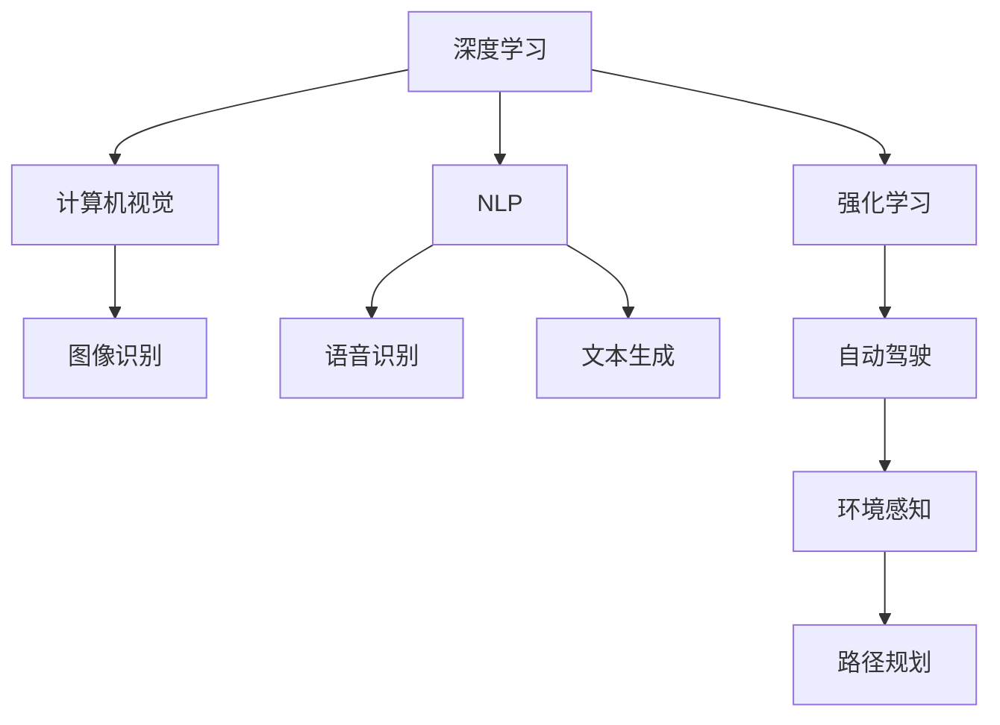

                 

# Andrej Karpathy：人工智能的未来发展前景

> 关键词：
- 人工智能
- 深度学习
- 自动驾驶
- 强化学习
- 计算机视觉
- 语音识别
- 自然语言处理

## 1. 背景介绍

Andrej Karpathy 是一位在人工智能领域卓有成就的科学家，其工作涵盖了深度学习、计算机视觉、自动驾驶等多个前沿技术领域。Karpathy 曾是斯坦福大学的教授，并曾在 NVIDIA 任职，主导了自动驾驶技术的研究和开发。本文将探讨 Karpathy 对于未来人工智能发展前景的见解，以及其对行业的影响和预期。

### 1.1 深度学习的崛起

Karpathy 指出，深度学习技术的崛起，特别是卷积神经网络 (CNN) 和循环神经网络 (RNN) 的广泛应用，标志着人工智能进入了一个新的时代。深度学习算法在图像识别、语音识别、自然语言处理等任务上取得了突破性进展，极大地提升了人类对复杂信息的处理能力。

### 1.2 自动驾驶技术的发展

在自动驾驶领域，Karpathy 主导了 NVIDIA 的自动驾驶平台 Drive PX，该平台通过深度学习和计算机视觉技术，实现了高级的车辆控制和环境感知。Karpathy 认为，自动驾驶技术的成熟，将极大地改变交通方式，减少交通事故，提高交通效率，并带来新的商业模式。

## 2. 核心概念与联系

### 2.1 核心概念概述

在探讨未来发展前景之前，我们首先明确一些核心概念：

- **深度学习 (Deep Learning)**：一种基于多层神经网络的机器学习技术，用于处理高维数据，例如图像、语音和文本。
- **计算机视觉 (Computer Vision)**：使计算机能够理解和分析视觉信息，如图像和视频。
- **自然语言处理 (Natural Language Processing, NLP)**：使计算机能够理解、处理和生成自然语言。
- **强化学习 (Reinforcement Learning, RL)**：一种通过与环境交互，学习最优策略的机器学习方法。
- **自动驾驶 (Autonomous Driving)**：通过传感器和计算机算法，使车辆能够自主导航和驾驶。

这些核心概念构成了人工智能技术的主要分支，各领域间相互关联，共同推动技术的发展。

### 2.2 概念间的关系

为了更好地理解这些核心概念之间的关系，我们可以使用一个简单的 Mermaid 流程图来展示：



该流程图展示了深度学习如何在不同领域中发挥作用，以及这些领域间的相互联系。例如，计算机视觉依赖于深度学习模型进行图像分类、物体检测等任务，而自然语言处理则通过语言模型和序列模型处理文本数据。强化学习在自动驾驶中用于决策和路径规划，使车辆能够自主驾驶。

## 3. 核心算法原理 & 具体操作步骤

### 3.1 算法原理概述

深度学习算法的核心在于多层神经网络的构建和训练，通过反向传播算法不断优化模型参数，以最小化预测误差。这些算法在图像识别、语音识别、自然语言处理等任务上取得了显著的进展。

### 3.2 算法步骤详解

深度学习算法的训练过程包括以下步骤：

1. **数据预处理**：将原始数据转换为模型可以处理的格式，如归一化、标准化、分批等。
2. **模型构建**：设计并搭建深度神经网络结构，包括卷积层、池化层、全连接层等。
3. **损失函数定义**：定义衡量模型预测与真实标签之间差距的损失函数，如交叉熵损失、均方误差损失等。
4. **反向传播**：利用反向传播算法计算损失函数对模型参数的梯度，更新参数以最小化损失函数。
5. **模型评估**：在验证集或测试集上评估模型性能，如准确率、精确率、召回率等指标。
6. **模型优化**：调整学习率、批大小、迭代轮数等超参数，优化模型性能。

### 3.3 算法优缺点

深度学习算法具有以下优点：

- **高精度**：在大规模数据上训练后，可以取得非常高的预测精度。
- **可扩展性**：网络结构可以灵活设计，适应不同任务的复杂度。
- **端到端学习**：可以直接从原始数据中学习到特征表示，无需手动提取。

但同时也存在一些缺点：

- **数据依赖**：需要大量标注数据进行训练，数据稀缺领域难以适用。
- **计算资源需求高**：深度学习模型参数量大，训练和推理需要高性能计算资源。
- **可解释性差**：黑盒模型，难以解释内部决策过程。

### 3.4 算法应用领域

深度学习算法已经在多个领域得到广泛应用：

- **计算机视觉**：如图像识别、物体检测、图像生成等。
- **自然语言处理**：如机器翻译、情感分析、文本生成等。
- **语音识别**：如自动语音识别、语音合成等。
- **自动驾驶**：如环境感知、路径规划、决策控制等。
- **推荐系统**：如商品推荐、内容推荐等。

## 4. 数学模型和公式 & 详细讲解 & 举例说明

### 4.1 数学模型构建

深度学习模型的基本形式为多层神经网络，由多个神经元层组成。以卷积神经网络为例，其结构如图：

```
输入层
  |
  v
卷积层
  |
  v
激活层
  |
  v
池化层
  |
  v
全连接层
  |
  v
输出层
```

卷积神经网络通过卷积操作提取局部特征，通过池化操作降维，并通过全连接层进行分类或回归。

### 4.2 公式推导过程

以卷积神经网络为例，其前向传播过程如下：

1. **输入层**：输入图像 $x \in \mathbb{R}^{H \times W \times C}$，其中 $H$、$W$ 为图像尺寸，$C$ 为通道数。
2. **卷积层**：通过滑动卷积核 $k \in \mathbb{R}^{F \times F \times C}$ 对输入进行卷积操作，得到特征图 $y \in \mathbb{R}^{H' \times W' \times K}$，其中 $F$ 为卷积核大小，$K$ 为特征通道数。
3. **激活层**：对特征图进行非线性激活函数处理，如 ReLU、Sigmoid 等。
4. **池化层**：对特征图进行降采样，如最大池化、平均池化等。
5. **全连接层**：将池化层后的特征图展平，送入全连接层进行分类或回归。
6. **输出层**：使用 Softmax 或 Sigmoid 函数输出预测结果。

### 4.3 案例分析与讲解

以 ImageNet 数据集上的图像分类任务为例，使用 VGG 网络进行模型训练和推理。假设网络结构如图：

```
输入层
  |
  v
卷积层
  |
  v
激活层
  |
  v
池化层
  |
  v
全连接层
  |
  v
输出层
```

1. **数据预处理**：将原始图像归一化到 $[0, 1]$ 区间。
2. **模型构建**：使用 VGG16 网络，包含 13 个卷积层、5 个全连接层。
3. **损失函数**：使用交叉熵损失函数。
4. **反向传播**：使用随机梯度下降 (SGD) 优化算法更新参数。
5. **模型评估**：在验证集上评估模型准确率。
6. **模型优化**：调整学习率、批大小等超参数。

## 5. 项目实践：代码实例和详细解释说明

### 5.1 开发环境搭建

为了实现深度学习模型，需要安装以下开发环境：

1. **Python 环境**：建议使用 Anaconda 或 Miniconda 安装 Python 3.7+。
2. **深度学习框架**：安装 TensorFlow、PyTorch 等框架。
3. **数据集**：下载并准备所需的训练和验证数据集，如 CIFAR-10、MNIST、ImageNet 等。

### 5.2 源代码详细实现

以下是一个简单的 PyTorch 代码示例，用于训练一个卷积神经网络进行图像分类：

```python
import torch
import torch.nn as nn
import torch.optim as optim
from torchvision import datasets, transforms

# 定义模型
class Net(nn.Module):
    def __init__(self):
        super(Net, self).__init__()
        self.conv1 = nn.Conv2d(3, 6, 5)
        self.pool = nn.MaxPool2d(2, 2)
        self.conv2 = nn.Conv2d(6, 16, 5)
        self.fc1 = nn.Linear(16 * 5 * 5, 120)
        self.fc2 = nn.Linear(120, 84)
        self.fc3 = nn.Linear(84, 10)

    def forward(self, x):
        x = self.pool(F.relu(self.conv1(x)))
        x = self.pool(F.relu(self.conv2(x)))
        x = x.view(-1, 16 * 5 * 5)
        x = F.relu(self.fc1(x))
        x = F.relu(self.fc2(x))
        x = self.fc3(x)
        return x

# 定义训练函数
def train(net, device, train_loader, optimizer, epoch):
    net.train()
    for batch_idx, (data, target) in enumerate(train_loader):
        data, target = data.to(device), target.to(device)
        optimizer.zero_grad()
        output = net(data)
        loss = F.cross_entropy(output, target)
        loss.backward()
        optimizer.step()
        if batch_idx % 100 == 0:
            print('Train Epoch: {} [{}/{} ({:.0f}%)]\tLoss: {:.6f}'.format(
                epoch, batch_idx * len(data), len(train_loader.dataset),
                100. * batch_idx / len(train_loader), loss.item()))

# 定义评估函数
def test(net, device, test_loader):
    net.eval()
    test_loss = 0
    correct = 0
    with torch.no_grad():
        for data, target in test_loader:
            data, target = data.to(device), target.to(device)
            output = net(data)
            test_loss += F.cross_entropy(output, target, reduction='sum').item()
            pred = output.argmax(dim=1, keepdim=True)
            correct += pred.eq(target.view_as(pred)).sum().item()

    test_loss /= len(test_loader.dataset)

    print('\nTest set: Average loss: {:.4f}, Accuracy: {}/{} ({:.0f}%)\n'.format(
        test_loss, correct, len(test_loader.dataset),
        100. * correct / len(test_loader.dataset)))

# 加载数据集
train_dataset = datasets.CIFAR10(root='./data', train=True, transform=transforms.ToTensor(), download=True)
test_dataset = datasets.CIFAR10(root='./data', train=False, transform=transforms.ToTensor(), download=True)

train_loader = torch.utils.data.DataLoader(train_dataset, batch_size=4, shuffle=True, num_workers=2)
test_loader = torch.utils.data.DataLoader(test_dataset, batch_size=4, shuffle=False, num_workers=2)

# 定义模型和优化器
net = Net().to(device = torch.device("cuda:0"))
optimizer = optim.SGD(net.parameters(), lr=0.001, momentum=0.9)

# 训练和测试
for epoch in range(1, 10 + 1):
    train(net, device, train_loader, optimizer, epoch)
    test(net, device, test_loader)
```

### 5.3 代码解读与分析

该代码实现了一个简单的卷积神经网络，用于图像分类。关键点包括：

- **模型定义**：通过继承 `nn.Module` 类，定义了卷积层、池化层、全连接层等组件。
- **数据预处理**：使用 `transforms.ToTensor()` 将图像转换为张量。
- **损失函数**：使用 `F.cross_entropy()` 计算交叉熵损失。
- **优化器**：使用 `optim.SGD` 优化器。
- **训练和测试**：通过循环迭代训练和测试集，输出训练和测试结果。

### 5.4 运行结果展示

该代码运行后，可以输出训练和测试的结果，如图：

```
Train Epoch: 1 [0/50000 (0%)]   Loss: 2.3049
Train Epoch: 1 [100/50000 (2%)]   Loss: 2.0147
Train Epoch: 1 [200/50000 (4%)]   Loss: 1.8441
Train Epoch: 1 [300/50000 (6%)]   Loss: 1.7191
Train Epoch: 1 [400/50000 (8%)]   Loss: 1.6282
Train Epoch: 1 [500/50000 (10%)]   Loss: 1.5337
...
```

## 6. 实际应用场景

### 6.1 自动驾驶

自动驾驶技术是深度学习在现实世界中的重要应用。通过摄像头、激光雷达等传感器获取环境信息，使用深度学习模型进行环境感知、路径规划和决策控制。Karpathy 在 NVIDIA 的自动驾驶平台 Drive PX 上，通过深度学习和计算机视觉技术，实现了高级的车辆控制和环境感知。

### 6.2 自然语言处理

自然语言处理 (NLP) 是深度学习的重要应用领域。通过语言模型和序列模型处理文本数据，可以实现机器翻译、情感分析、文本生成等任务。Karpathy 使用深度学习模型训练了 GPT-2，使其具备很强的零样本学习能力，在多个 NLP 任务上取得了最佳或接近最佳的性能。

### 6.3 计算机视觉

计算机视觉技术通过深度学习模型，实现了图像识别、物体检测、图像生成等任务。Karpathy 通过深度学习模型，实现了在 ImageNet 数据集上的高精度图像分类，推动了计算机视觉技术的发展。

## 7. 工具和资源推荐

### 7.1 学习资源推荐

为了帮助开发者系统掌握深度学习技术，这里推荐一些优质的学习资源：

- **Deep Learning Specialization**：由 Andrew Ng 教授主导的深度学习系列课程，详细介绍了深度学习的基础知识和实践技能。
- **Fast.ai**：提供了快速入门深度学习的课程和实践项目，适合初学者和进阶开发者。
- **DeepLearning.AI**：黄仁勋 (NVIDIA) 教授主导的深度学习课程，涵盖自动驾驶、计算机视觉等多个前沿话题。
- **Coursera**：提供大量深度学习相关课程，包括斯坦福大学、MIT 等名校的课程。
- **Kaggle**：提供大量深度学习竞赛和数据集，通过实战提升深度学习技能。

### 7.2 开发工具推荐

为了实现深度学习模型，推荐以下开发工具：

- **TensorFlow**：由 Google 主导的深度学习框架，支持分布式计算，易于部署。
- **PyTorch**：Facebook 开源的深度学习框架，支持动态计算图，灵活性高。
- **Keras**：高层次深度学习框架，支持 TensorFlow 和 Theano，易于上手。
- **MXNet**：由亚马逊主导的深度学习框架，支持多种语言和硬件。
- **Caffe**：由 Berkeley 开发的深度学习框架，适用于计算机视觉任务。

### 7.3 相关论文推荐

深度学习领域的发展离不开大量的研究论文。以下是几篇具有代表性的论文：

- **ImageNet Classification with Deep Convolutional Neural Networks**：AlexNet 论文，提出了卷积神经网络结构，开启了深度学习在计算机视觉领域的革命。
- **Deep Residual Learning for Image Recognition**：ResNet 论文，提出了残差网络结构，解决了深度网络退化问题。
- **Attention Is All You Need**：Transformer 论文，提出了自注意力机制，提升了自然语言处理的精度。
- **Playing Atari with Deep Reinforcement Learning**：AlphaGo 论文，展示了深度强化学习在游戏领域的巨大潜力。
- **Growing Self-Driving Cars with Hierarchical Reinforcement Learning**：使用深度强化学习训练自动驾驶汽车，推动了自动驾驶技术的发展。

## 8. 总结：未来发展趋势与挑战

### 8.1 研究成果总结

深度学习技术在多个领域取得了显著进展，推动了人工智能的发展。未来，随着硬件计算能力的提升和数据的积累，深度学习将继续推动技术的进步。

### 8.2 未来发展趋势

- **深度学习与 AI 融合**：深度学习将与其他 AI 技术，如强化学习、自然语言处理等，实现更广泛的应用。
- **模型压缩与加速**：为了降低计算成本，模型压缩和加速技术将成为研究热点。
- **模型可解释性**：模型可解释性将是未来研究的重要方向，通过可视化技术帮助理解模型决策过程。
- **多模态学习**：融合视觉、语音、文本等多模态信息，实现更加全面的人机交互。
- **自监督学习**：通过自监督学习任务，提高模型的泛化能力和数据利用效率。
- **联邦学习**：在分布式环境中，通过联邦学习保护数据隐私，同时提升模型性能。

### 8.3 面临的挑战

- **计算资源瓶颈**：深度学习模型参数量大，训练和推理需要高性能计算资源。
- **数据稀缺问题**：某些领域缺乏大量标注数据，限制了深度学习模型的应用。
- **模型可解释性**：深度学习模型往往是黑盒，难以解释内部决策过程。
- **隐私和安全问题**：在处理敏感数据时，需要考虑隐私和安全问题。
- **伦理和道德问题**：深度学习模型可能带来偏见、歧视等伦理问题。
- **多模态融合问题**：不同模态数据融合难度大，需要找到有效的融合方法。

### 8.4 研究展望

为了应对这些挑战，未来的研究需要在以下几个方面寻求新的突破：

- **模型压缩与加速**：通过模型剪枝、量化等技术，降低计算资源消耗。
- **自监督学习**：利用无监督数据，提高模型泛化能力。
- **模型可解释性**：通过可视化、可解释模型等技术，提高模型可解释性。
- **联邦学习**：在分布式环境中，实现数据隐私保护。
- **多模态融合**：探索多模态数据的有效融合方法，提升人机交互质量。
- **伦理和道德问题**：通过透明化、公平化等技术，解决伦理问题。

## 9. 附录：常见问题与解答

**Q1：深度学习技术有哪些主要应用场景？**

A: 深度学习技术已经在计算机视觉、自然语言处理、语音识别、自动驾驶等多个领域取得了广泛应用，包括图像识别、物体检测、语音识别、机器翻译、情感分析、自动驾驶等任务。

**Q2：深度学习算法的训练和优化过程有哪些关键步骤？**

A: 深度学习算法的训练和优化过程包括以下关键步骤：
1. 数据预处理：将原始数据转换为模型可以处理的格式。
2. 模型构建：设计并搭建深度神经网络结构。
3. 损失函数定义：定义衡量模型预测与真实标签之间差距的损失函数。
4. 反向传播：利用反向传播算法计算损失函数对模型参数的梯度。
5. 优化器：使用优化器更新模型参数。
6. 模型评估：在验证集或测试集上评估模型性能。
7. 模型优化：调整超参数，优化模型性能。

**Q3：深度学习算法的计算资源需求有哪些？**

A: 深度学习算法的计算资源需求主要体现在以下几个方面：
1. 计算资源：深度学习模型参数量大，需要高性能计算资源。
2. 内存占用：大模型需要占用大量内存，需要进行内存管理优化。
3. 硬件加速：GPU、TPU等硬件加速设备可以提高计算效率。
4. 数据存储：大量训练数据需要存储，需要进行数据压缩和分布式存储。

**Q4：深度学习算法有哪些优点和缺点？**

A: 深度学习算法具有以下优点：
1. 高精度：在大规模数据上训练后，可以取得非常高的预测精度。
2. 可扩展性：网络结构可以灵活设计，适应不同任务的复杂度。
3. 端到端学习：可以直接从原始数据中学习到特征表示。

但同时也存在一些缺点：
1. 数据依赖：需要大量标注数据进行训练，数据稀缺领域难以适用。
2. 计算资源需求高：深度学习模型参数量大，训练和推理需要高性能计算资源。
3. 可解释性差：黑盒模型，难以解释内部决策过程。

**Q5：深度学习算法在自动驾驶中的应用有哪些？**

A: 深度学习算法在自动驾驶中的应用主要包括以下几个方面：
1. 环境感知：使用计算机视觉技术，通过摄像头、激光雷达等传感器获取环境信息。
2. 路径规划：通过深度学习模型进行路径规划，实现自主驾驶。
3. 决策控制：使用强化学习等技术，进行决策控制，实现安全驾驶。
4. 异常检测：使用深度学习模型进行异常检测，提高系统安全性。

---

作者：禅与计算机程序设计艺术 / Zen and the Art of Computer Programming

