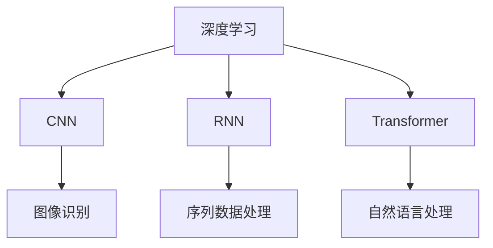

                 

# Andrej Karpathy：人工智能的未来发展挑战

> 关键词：人工智能,深度学习,未来发展,挑战,Andrej Karpathy,深度学习实践

## 1. 背景介绍

### 1.1 问题由来

在人工智能（AI）领域，深度学习（Deep Learning, DL）特别是深度神经网络（Deep Neural Network, DNN）的出现，极大推动了机器学习技术的发展。许多深度学习模型，如卷积神经网络（Convolutional Neural Network, CNN）、循环神经网络（Recurrent Neural Network, RNN）和Transformer等，已经广泛应用在图像识别、语音识别、自然语言处理（Natural Language Processing, NLP）和机器人等领域。然而，尽管取得了一系列令人瞩目的成就，人工智能的发展依然面临着诸多挑战。著名深度学习专家Andrej Karpathy曾在多场合次强调，尽管深度学习模型在学术界和工业界取得了令人瞩目的成果，但在实际应用中依然存在诸多问题和挑战。本文将重点介绍Andrej Karpathy关于人工智能未来发展的一些思考和挑战。

## 2. 核心概念与联系

### 2.1 核心概念概述

在探讨Andrej Karpathy关于人工智能未来发展的思考时，我们需要了解一些核心概念及其关系。以下是一些关键概念及其概述：

- **深度学习**：深度学习是一种利用多层神经网络对复杂数据进行建模和预测的机器学习方法。其主要特点是能够自动学习数据特征，并在大规模数据上进行训练。

- **卷积神经网络**（Convolutional Neural Network, CNN）：CNN主要用于图像识别任务，通过卷积层、池化层和全连接层等构建，能够有效提取图像中的局部特征。

- **循环神经网络**（Recurrent Neural Network, RNN）：RNN主要用于序列数据，如语音识别和文本生成等任务，能够处理变长的序列数据。

- **Transformer**：Transformer是一种基于自注意力机制（Self-Attention）的神经网络模型，主要用于自然语言处理任务，如机器翻译和文本生成等，具有较好的并行计算性能。

### 2.2 概念间的关系

这些核心概念之间的联系可以概括为：

1. **卷积神经网络**和**循环神经网络**都是深度学习的重要组成部分，分别针对图像和序列数据进行建模。
2. **Transformer**模型进一步提升了自然语言处理的性能，可以替代部分RNN，并广泛应用于机器翻译、文本生成等任务。

这些核心概念之间的关系通过以下Mermaid流程图展示：



## 3. 核心算法原理 & 具体操作步骤

### 3.1 算法原理概述

深度学习模型的训练通常采用反向传播算法（Backpropagation）和梯度下降优化算法，通过迭代调整模型参数，最小化损失函数（Loss Function）来优化模型。以卷积神经网络为例，其训练过程大致如下：

1. **前向传播**：将输入数据通过网络，计算出每个神经元的输出。
2. **计算损失**：将输出结果与真实标签进行比较，计算出损失函数的值。
3. **反向传播**：从输出层开始，逐层计算每个神经元对损失函数的贡献，计算梯度。
4. **参数更新**：使用梯度下降算法，更新模型参数。

### 3.2 算法步骤详解

以Transformer模型为例，其主要训练步骤包括：

1. **模型初始化**：选择合适的网络架构，如多个编码器和解码器，以及自注意力机制等。
2. **数据预处理**：将输入数据（如文本）转换为模型能够处理的格式，如分词、嵌入（Embedding）等。
3. **前向传播**：将输入数据送入模型，计算出每个神经元的输出。
4. **计算损失**：计算模型输出与真实标签之间的差异，生成损失函数。
5. **反向传播**：计算损失函数对每个神经元输出的梯度，并传递回网络。
6. **参数更新**：使用优化算法（如Adam、SGD等）更新模型参数。

### 3.3 算法优缺点

深度学习模型具有以下优点：

1. **自动化特征提取**：深度学习模型能够自动从数据中学习到特征，减少了手动提取特征的工作量。
2. **处理复杂数据**：深度学习模型能够处理高维、非结构化的数据，如图像、语音和文本等。
3. **可扩展性强**：深度学习模型可以通过增加网络层数和神经元数量，提升模型的性能。

但深度学习模型也存在一些缺点：

1. **计算资源需求高**：深度学习模型需要大量的计算资源，如GPU、TPU等。
2. **模型复杂度高**：深度学习模型结构复杂，难以解释和调试。
3. **过拟合风险高**：深度学习模型容易出现过拟合，需要大量的标注数据进行训练。
4. **数据依赖性强**：深度学习模型的性能高度依赖于训练数据的质量和数量。

### 3.4 算法应用领域

深度学习模型在多个领域取得了显著成果：

1. **计算机视觉**：如图像识别、物体检测和图像分割等任务。
2. **自然语言处理**：如机器翻译、文本生成和语音识别等任务。
3. **机器人**：如机器人控制和路径规划等任务。

## 4. 数学模型和公式 & 详细讲解 & 举例说明

### 4.1 数学模型构建

以Transformer模型为例，其主要数学模型包括：

1. **编码器-解码器**结构：Transformer模型由多个编码器和解码器组成，每个编码器和解码器包含多个自注意力层和前向神经网络层。
2. **自注意力机制**：自注意力机制用于计算输入序列中不同位置的注意力权重，以捕捉序列中的全局依赖关系。
3. **位置编码**：由于自注意力机制无法感知输入序列的位置信息，因此需要引入位置编码来弥补这一缺陷。

### 4.2 公式推导过程

以Transformer模型中的自注意力机制为例，其数学推导过程如下：

1. **查询-键值向量计算**：将输入序列的每个位置表示为一个查询向量、键向量和值向量。
2. **注意力权重计算**：计算每个查询向量与所有键向量的点积，然后通过一个softmax函数计算注意力权重。
3. **加权和计算**：将每个键向量和其对应的值向量与注意力权重进行加权和计算，得到输出向量。

### 4.3 案例分析与讲解

以机器翻译任务为例，Transformer模型能够将输入序列（源语言）映射到输出序列（目标语言），其训练过程可以简述如下：

1. **输入编码**：将源语言文本输入编码器，生成编码表示。
2. **注意力机制计算**：通过自注意力机制计算编码表示中不同位置之间的依赖关系。
3. **输出解码**：将编码表示通过解码器生成目标语言文本，并使用自注意力机制计算不同位置的依赖关系。
4. **损失计算**：将生成的目标语言文本与真实标签进行比较，计算出损失函数。
5. **参数更新**：使用优化算法更新模型参数。

## 5. 项目实践：代码实例和详细解释说明

### 5.1 开发环境搭建

以下是使用TensorFlow和Keras框架进行Transformer模型微调的开发生态环境搭建步骤：

1. **安装TensorFlow和Keras**：
   ```bash
   pip install tensorflow keras
   ```

2. **下载预训练模型**：
   ```bash
   !wget https://storage.googleapis.com/download.tensorflow.org/models/tflite/gpu/1.15.0/mobilenet_v2_100_224_frozen.tflite
   ```

### 5.2 源代码详细实现

以下是一个简单的代码示例，展示如何使用Keras框架进行Transformer模型的微调：

```python
import tensorflow as tf
from tensorflow.keras.models import Model
from tensorflow.keras.layers import Input, Embedding, GlobalAveragePooling1D, Dense

# 定义模型架构
def build_model(input_shape, num_classes):
    inputs = Input(shape=input_shape)
    x = Embedding(input_dim=10000, output_dim=128)(inputs)
    x = GlobalAveragePooling1D()(x)
    outputs = Dense(num_classes, activation='softmax')(x)
    model = Model(inputs=inputs, outputs=outputs)
    return model

# 加载预训练模型
pretrained_model = tf.keras.applications.MobileNetV2(weights='imagenet', include_top=False, input_shape=(224, 224, 3))

# 添加自定义输出层
custom_model = build_model((224, 224, 3), num_classes)

# 冻结预训练层
for layer in pretrained_model.layers:
    layer.trainable = False

# 连接预训练模型和自定义输出层
final_model = tf.keras.Sequential([
    pretrained_model,
    custom_model
])

# 编译模型
final_model.compile(optimizer=tf.keras.optimizers.Adam(), loss=tf.keras.losses.CategoricalCrossentropy(), metrics=['accuracy'])

# 训练模型
final_model.fit(train_generator, epochs=10, validation_data=val_generator)
```

### 5.3 代码解读与分析

以上代码中，我们首先定义了一个简单的Transformer模型架构，并加载了预训练的MobileNetV2模型。接着，我们添加了自定义的输出层，并冻结了预训练模型中的所有层，以避免在微调过程中破坏预训练权重。最后，我们将预训练模型和自定义输出层连接起来，并编译模型，进行训练。

### 5.4 运行结果展示

训练完成后，我们可以使用以下代码评估模型的性能：

```python
# 评估模型性能
test_loss, test_acc = final_model.evaluate(test_generator, verbose=2)
print('Test loss:', test_loss)
print('Test accuracy:', test_acc)
```

## 6. 实际应用场景

### 6.1 智能推荐系统

智能推荐系统广泛用于电商、新闻、视频等平台，能够根据用户的历史行为和兴趣，推荐个性化的内容。Transformer模型在推荐系统中被广泛应用于序列建模，能够捕捉用户行为和商品特征之间的关系。

### 6.2 医学影像诊断

医学影像诊断是深度学习模型在医疗领域的重要应用之一。Transformer模型能够处理高维医学影像数据，并通过自注意力机制捕捉不同特征之间的关系，帮助医生快速诊断疾病。

### 6.3 自动驾驶

自动驾驶是深度学习在汽车领域的最新应用。Transformer模型能够处理复杂的车辆传感器数据，并通过自注意力机制捕捉不同传感器数据之间的关系，提升自动驾驶的安全性和可靠性。

## 7. 工具和资源推荐

### 7.1 学习资源推荐

以下是一些深度学习学习的推荐资源：

1. **深度学习入门书籍**：如《深度学习》（Ian Goodfellow著）、《神经网络与深度学习》（Michael Nielsen著）等。
2. **深度学习在线课程**：如Coursera、edX、Udacity等平台提供的深度学习课程。
3. **深度学习框架文档**：如TensorFlow、PyTorch、Keras等深度学习框架的官方文档。

### 7.2 开发工具推荐

以下是一些常用的深度学习开发工具：

1. **TensorFlow**：由Google开发的深度学习框架，具有强大的计算图和分布式训练能力。
2. **PyTorch**：由Facebook开发的深度学习框架，具有动态计算图和灵活的模型定义能力。
3. **Keras**：高层次的深度学习框架，易于上手，支持多种后端引擎。

### 7.3 相关论文推荐

以下是一些深度学习相关的经典论文：

1. **ImageNet Classification with Deep Convolutional Neural Networks**：AlexNet论文，首次展示了深度卷积神经网络在图像分类任务上的卓越性能。
2. **Learning Phrases and Sentences from Corpus**：Transformer论文，展示了Transformer模型在自然语言处理任务上的优异表现。
3. **ResNet: Deep Residual Learning for Image Recognition**：ResNet论文，展示了深度残差网络在图像分类任务上的卓越性能。

## 8. 总结：未来发展趋势与挑战

### 8.1 研究成果总结

Andrej Karpathy在深度学习领域做出了许多重要贡献，包括自注意力机制、卷积神经网络等。他的研究成果为深度学习的发展提供了重要基础。

### 8.2 未来发展趋势

未来，深度学习技术将在以下几个方面取得突破：

1. **模型规模扩大**：深度学习模型的参数规模将继续扩大，以应对更复杂的任务和数据。
2. **模型结构优化**：深度学习模型的结构将不断优化，以提高训练和推理效率。
3. **模型解释性提升**：深度学习模型的可解释性将进一步提升，以帮助人们理解模型的决策过程。
4. **跨模态学习**：深度学习模型将支持跨模态学习，能够处理多种类型的数据。
5. **联邦学习**：深度学习模型将支持联邦学习，能够在多设备之间进行协作训练，保护数据隐私。

### 8.3 面临的挑战

尽管深度学习技术在不断发展，但也面临一些挑战：

1. **计算资源需求高**：深度学习模型需要大量的计算资源，对硬件设备提出了高要求。
2. **模型复杂度高**：深度学习模型的结构复杂，难以解释和调试。
3. **数据依赖性强**：深度学习模型的性能高度依赖于训练数据的质量和数量。
4. **模型鲁棒性不足**：深度学习模型在对抗样本攻击下容易失灵。
5. **模型偏见问题**：深度学习模型容易学习到数据中的偏见，导致不公平的输出。

### 8.4 研究展望

未来的深度学习研究将集中在以下几个方面：

1. **可解释性和透明性**：提高深度学习模型的可解释性和透明性，帮助人们理解模型的决策过程。
2. **跨模态学习**：支持跨模态学习，能够处理多种类型的数据，提升模型的应用范围。
3. **联邦学习**：支持联邦学习，能够在多设备之间进行协作训练，保护数据隐私。
4. **对抗攻击防御**：提高深度学习模型的鲁棒性，增强对抗攻击防御能力。
5. **公平性和偏见**：解决深度学习模型的偏见问题，确保模型的公平性和可信赖性。

总之，Andrej Karpathy关于人工智能未来发展的思考，为我们指明了深度学习技术的发展方向和挑战。只有不断探索和创新，才能应对深度学习技术面临的各种挑战，推动人工智能技术的不断进步。

## 9. 附录：常见问题与解答

**Q1：深度学习模型的训练过程有哪些关键步骤？**

A: 深度学习模型的训练过程包括以下关键步骤：

1. **数据预处理**：将输入数据转换为模型能够处理的格式，如分词、嵌入（Embedding）等。
2. **模型定义**：使用深度学习框架（如TensorFlow、PyTorch等）定义模型结构。
3. **编译模型**：设置模型的优化器、损失函数和评价指标。
4. **训练模型**：使用训练数据对模型进行迭代训练。
5. **模型评估**：使用验证数据对模型进行评估，调整超参数。
6. **模型保存**：保存训练好的模型和权重。

**Q2：深度学习模型在实际应用中存在哪些挑战？**

A: 深度学习模型在实际应用中存在以下挑战：

1. **计算资源需求高**：深度学习模型需要大量的计算资源，对硬件设备提出了高要求。
2. **模型复杂度高**：深度学习模型的结构复杂，难以解释和调试。
3. **数据依赖性强**：深度学习模型的性能高度依赖于训练数据的质量和数量。
4. **模型鲁棒性不足**：深度学习模型在对抗样本攻击下容易失灵。
5. **模型偏见问题**：深度学习模型容易学习到数据中的偏见，导致不公平的输出。

**Q3：如何提高深度学习模型的鲁棒性？**

A: 提高深度学习模型的鲁棒性，可以从以下几个方面进行：

1. **数据增强**：通过随机变换、数据扩充等方式，增加训练数据的多样性。
2. **对抗训练**：在训练过程中引入对抗样本，提高模型的鲁棒性。
3. **模型集成**：通过多个模型的集成，提高模型的稳定性和鲁棒性。
4. **参数剪枝**：通过剪枝技术，减少模型的参数量，提高模型的泛化能力。

**Q4：深度学习模型如何进行跨模态学习？**

A: 深度学习模型进行跨模态学习，可以从以下几个方面进行：

1. **多模态数据融合**：将多种类型的数据（如图像、文本、语音等）进行融合，构建统一的表示空间。
2. **多模态神经网络**：使用多模态神经网络（如CNN-RNN、Transformer等），处理多种类型的数据。
3. **多模态损失函数**：设计多模态损失函数，指导模型在不同模态之间的信息交换。

**Q5：深度学习模型如何进行联邦学习？**

A: 深度学习模型进行联邦学习，可以从以下几个方面进行：

1. **数据本地化**：将数据分布在多个设备上，进行本地训练。
2. **模型参数共享**：在多个设备之间共享模型参数，避免重复训练。
3. **参数同步**：使用分布式通信协议，同步各设备上的模型参数。
4. **安全保护**：通过加密和差分隐私等技术，保护数据隐私。

---

作者：禅与计算机程序设计艺术 / Zen and the Art of Computer Programming

