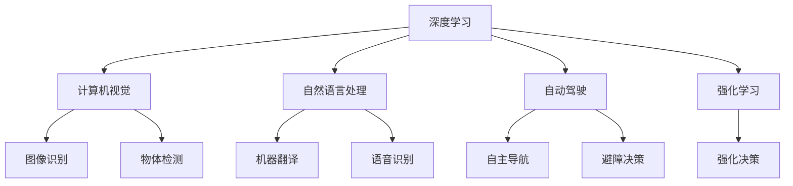

                 

# Andrej Karpathy：人工智能的未来发展挑战

## 1. 背景介绍

### 1.1 问题由来
Andrej Karpathy 是斯坦福大学的计算机科学家，同时担任特斯拉的AI总监，以其在计算机视觉、自动驾驶和深度学习领域的卓越贡献著称。Karpathy 博士不仅是一位科研巨匠，更是人工智能领域的前瞻者和实践者，多次公开讨论了AI 的未来发展方向和面临的重大挑战。

近年来，随着深度学习和人工智能技术的飞速发展，AI 在图像识别、自然语言处理、自动驾驶等诸多领域取得了举世瞩目的成就，同时也逐渐融入到了日常生活和工作之中。然而，这些技术的背后仍隐藏着一系列亟待解决的问题和挑战。这些问题不仅关系到 AI 技术本身的发展，也影响到社会的各个层面。因此，理解和探讨这些挑战，对于推动 AI 技术的健康发展，实现人工智能与社会的和谐共生，具有重要意义。

本文将从人工智能的基础、当前技术进展、未来发展趋势和面临的挑战四个方面，全面深入地探讨 Andrej Karpathy 的观点，希望能为读者带来一些启发和思考。

## 2. 核心概念与联系

### 2.1 核心概念概述

为了更好地理解 Karpathy 博士的观点，本节将介绍几个密切相关的核心概念：

- **深度学习**：基于神经网络的机器学习技术，通过多层次的特征提取与变换，实现对数据的高效处理和建模。深度学习在图像、语音、自然语言处理等领域取得了突破性进展。

- **计算机视觉**：研究如何让计算机“看懂”图像和视频，包括图像识别、物体检测、人脸识别、场景理解等任务。计算机视觉技术被广泛应用于自动驾驶、监控系统、机器人导航等领域。

- **自动驾驶**：利用计算机视觉、深度学习等技术，使车辆能够自主导航、避障、决策，无需人类直接控制。自动驾驶技术有望彻底改变交通运输方式，提高交通安全和效率。

- **自然语言处理**：使计算机能够理解、处理和生成人类语言的技术，包括机器翻译、语音识别、情感分析、问答系统等应用。自然语言处理技术使机器能够更好地理解人类意图，提升人机交互体验。

- **因果推断**：研究如何通过数据推断出因果关系，确定变量间的影响方向和强度，广泛应用于决策支持、经济分析、社会科学等领域。

- **强化学习**：通过与环境交互，让机器在不断试错中学习最优策略，优化决策过程，具有广泛的应用前景。

这些核心概念通过深度学习、计算机视觉、自动驾驶、自然语言处理等技术紧密联系，共同构成了人工智能的重要组成部分。它们相互作用，推动着 AI 技术的不断进步和发展。

### 2.2 概念间的关系

Karpathy 博士认为，这些核心概念之间存在紧密联系，共同驱动着人工智能技术的演进。以下是这些概念之间的联系和关系：

- **深度学习**是所有 AI 技术的基础，提供了强大的数据建模能力。
- **计算机视觉**和**自然语言处理**是深度学习技术在图像和语言数据上的重要应用，提升了计算机对视觉和语言数据的理解和处理能力。
- **自动驾驶**和**强化学习**是深度学习在复杂动态环境中的典型应用，推动了智能决策和自主导航技术的发展。
- **因果推断**为深度学习和强化学习提供了理论支持，帮助理解和解释模型的决策过程，增强系统的可解释性和可信度。

这些概念之间的关系可以用以下 Mermaid 流程图来展示：



这个流程图展示了深度学习在各个 AI 子领域的广泛应用，以及它们之间的相互支持关系。

## 3. 核心算法原理 & 具体操作步骤
### 3.1 算法原理概述

Karpathy 博士多次强调，深度学习算法的核心在于通过不断优化模型参数，实现对数据的最佳拟合。这种优化过程通常通过反向传播算法和梯度下降等技术实现，从而使得模型能够对输入数据进行高效的特征提取和建模。

深度学习算法的原理可以概括为以下几个步骤：

1. **数据准备**：将原始数据转换为模型可以处理的格式，如将图像数据转换为张量形式，将自然语言转换为嵌入向量等。
2. **模型构建**：设计并构建深度神经网络模型，包括选择网络结构、定义损失函数等。
3. **模型训练**：使用反向传播算法和梯度下降等优化方法，更新模型参数，最小化损失函数。
4. **模型评估**：使用测试集数据评估模型性能，检查过拟合和欠拟合等问题，并进行必要的调整。
5. **模型部署**：将训练好的模型应用于实际场景中，实现数据的预测、分类、生成等任务。

深度学习算法的优缺点如下：

- **优点**：可以处理大量数据，提取复杂特征，实现高效的特征学习，适用于图像、语音、自然语言等复杂数据。
- **缺点**：模型训练需要大量计算资源，存在过拟合风险，模型的可解释性较差。

### 3.2 算法步骤详解

以下是深度学习算法的详细步骤：

1. **数据准备**：将原始数据转换为适合模型处理的形式。
   - 对于图像数据，通常需要将其转换为张量形式，并进行归一化、缩放等预处理操作。
   - 对于自然语言数据，需要将文本转换为嵌入向量，并进行分词、标记等预处理操作。

2. **模型构建**：设计并构建深度神经网络模型，包括选择网络结构、定义损失函数等。
   - 网络结构的选择：通常包括卷积神经网络(CNN)、循环神经网络(RNN)、长短时记忆网络(LSTM)、变换器(Transformer)等。
   - 损失函数的选择：常用的损失函数包括交叉熵损失、均方误差损失、对比损失等。

3. **模型训练**：使用反向传播算法和梯度下降等优化方法，更新模型参数，最小化损失函数。
   - 反向传播算法：通过链式法则计算损失函数对模型参数的梯度，并更新参数。
   - 梯度下降：根据损失函数的梯度，更新模型参数，使模型参数趋近于最优解。

4. **模型评估**：使用测试集数据评估模型性能，检查过拟合和欠拟合等问题，并进行必要的调整。
   - 过拟合：模型在训练集上表现良好，但在测试集上表现较差，需要采用正则化、dropout等方法避免。
   - 欠拟合：模型无法捕捉数据中的复杂特征，需要进行网络结构优化、增加训练数据等措施。

5. **模型部署**：将训练好的模型应用于实际场景中，实现数据的预测、分类、生成等任务。
   - 模型预测：使用训练好的模型对新数据进行预测，输出模型预测结果。
   - 模型优化：根据实际应用需求，对模型进行优化和调整，提升模型性能。

### 3.3 算法优缺点

深度学习算法的主要优点包括：

- 能够处理大量复杂数据，提取高维特征，实现高效建模。
- 适用于图像、语音、自然语言等非结构化数据。
- 在许多领域取得了突破性进展，如计算机视觉、自然语言处理等。

主要缺点包括：

- 模型训练需要大量计算资源，存在过拟合风险。
- 模型的可解释性较差，难以理解模型的决策过程。
- 需要大量的标注数据进行监督学习，标注成本较高。

### 3.4 算法应用领域

深度学习算法广泛应用于计算机视觉、自然语言处理、自动驾驶、机器人等领域，具体应用如下：

- **计算机视觉**：图像识别、物体检测、人脸识别、场景理解等。
- **自然语言处理**：机器翻译、语音识别、情感分析、问答系统等。
- **自动驾驶**：视觉识别、障碍物检测、路径规划、决策优化等。
- **机器人**：目标跟踪、动作控制、视觉定位、语音识别等。

这些领域的应用不仅提升了人工智能技术的发展水平，也带来了许多社会和经济价值。

## 4. 数学模型和公式 & 详细讲解 & 举例说明

### 4.1 数学模型构建

深度学习模型的数学模型可以概括为以下几个部分：

- **输入数据**：原始数据经过预处理，转换为适合模型处理的格式。
- **网络结构**：包括多个层次的神经元，通过前向传播和反向传播进行信息传递和参数更新。
- **损失函数**：用于衡量模型预测与真实标签之间的差异，常用的损失函数包括交叉熵损失、均方误差损失等。
- **优化算法**：用于最小化损失函数，常用的优化算法包括梯度下降、Adam、SGD等。

### 4.2 公式推导过程

以卷积神经网络(CNN)为例，推导其前向传播和反向传播过程。

- **前向传播**：
  $$
  y = \sigma\left(W_2 \sigma\left(W_1 x + b_1\right) + b_2\right)
  $$
  其中 $x$ 为输入数据，$W_1$ 和 $W_2$ 为权重矩阵，$b_1$ 和 $b_2$ 为偏置向量，$\sigma$ 为激活函数。

- **反向传播**：
  $$
  \frac{\partial L}{\partial W_2} = \frac{\partial L}{\partial y} \frac{\partial y}{\partial z} \frac{\partial z}{\partial W_2}
  $$
  其中 $L$ 为损失函数，$z$ 为前向传播的输出，$\frac{\partial y}{\partial z}$ 为激活函数的导数，$\frac{\partial z}{\partial W_2}$ 为权重矩阵的梯度。

通过反向传播算法，可以计算出损失函数对模型参数的梯度，从而更新模型参数，最小化损失函数。

### 4.3 案例分析与讲解

以图像分类任务为例，分析深度学习模型的构建和训练过程。

1. **数据准备**：将图像数据转换为张量形式，并进行归一化、缩放等预处理操作。
2. **模型构建**：选择卷积神经网络结构，定义交叉熵损失函数。
3. **模型训练**：使用反向传播算法和梯度下降优化算法，最小化损失函数。
4. **模型评估**：使用测试集数据评估模型性能，检查过拟合和欠拟合等问题，并进行必要的调整。
5. **模型部署**：将训练好的模型应用于实际场景中，实现图像分类的任务。

## 5. 项目实践：代码实例和详细解释说明

### 5.1 开发环境搭建

在进行深度学习项目开发前，需要准备好开发环境。以下是使用 Python 进行 PyTorch 开发的环境配置流程：

1. 安装 Anaconda：从官网下载并安装 Anaconda，用于创建独立的 Python 环境。

2. 创建并激活虚拟环境：
   ```bash
   conda create -n pytorch-env python=3.8 
   conda activate pytorch-env
   ```

3. 安装 PyTorch：根据 CUDA 版本，从官网获取对应的安装命令。例如：
   ```bash
   conda install pytorch torchvision torchaudio cudatoolkit=11.1 -c pytorch -c conda-forge
   ```

4. 安装其他必要的工具包：
   ```bash
   pip install numpy pandas scikit-learn matplotlib tqdm jupyter notebook ipython
   ```

完成上述步骤后，即可在 `pytorch-env` 环境中开始深度学习项目开发。

### 5.2 源代码详细实现

以下是一个简单的卷积神经网络模型，用于图像分类任务的代码实现。

```python
import torch
import torch.nn as nn
import torch.optim as optim

class ConvNet(nn.Module):
    def __init__(self):
        super(ConvNet, self).__init__()
        self.conv1 = nn.Conv2d(3, 32, kernel_size=3, padding=1)
        self.conv2 = nn.Conv2d(32, 64, kernel_size=3, padding=1)
        self.fc1 = nn.Linear(64 * 8 * 8, 256)
        self.fc2 = nn.Linear(256, 10)

    def forward(self, x):
        x = nn.functional.relu(self.conv1(x))
        x = nn.functional.max_pool2d(x, 2, 2)
        x = nn.functional.relu(self.conv2(x))
        x = nn.functional.max_pool2d(x, 2, 2)
        x = x.view(-1, 64 * 8 * 8)
        x = nn.functional.relu(self.fc1(x))
        x = self.fc2(x)
        return nn.functional.log_softmax(x, dim=1)

# 定义模型和优化器
model = ConvNet()
optimizer = optim.Adam(model.parameters(), lr=0.001)

# 定义训练和评估函数
def train_epoch(model, data_loader, optimizer):
    model.train()
    total_loss = 0
    for inputs, labels in data_loader:
        optimizer.zero_grad()
        outputs = model(inputs)
        loss = nn.functional.nll_loss(outputs, labels)
        loss.backward()
        optimizer.step()
        total_loss += loss.item()
    return total_loss / len(data_loader)

def evaluate(model, data_loader):
    model.eval()
    total_loss = 0
    correct = 0
    with torch.no_grad():
        for inputs, labels in data_loader:
            outputs = model(inputs)
            loss = nn.functional.nll_loss(outputs, labels)
            total_loss += loss.item()
            _, predicted = torch.max(outputs.data, 1)
            correct += (predicted == labels).sum().item()
    return correct / len(data_loader), total_loss / len(data_loader)

# 加载数据集
train_dataset = torchvision.datasets.CIFAR10(root='data', train=True, transform=transforms.ToTensor(), download=True)
test_dataset = torchvision.datasets.CIFAR10(root='data', train=False, transform=transforms.ToTensor(), download=True)
train_loader = torch.utils.data.DataLoader(train_dataset, batch_size=64, shuffle=True)
test_loader = torch.utils.data.DataLoader(test_dataset, batch_size=64, shuffle=False)

# 训练模型
num_epochs = 10
for epoch in range(num_epochs):
    train_loss = train_epoch(model, train_loader, optimizer)
    test_acc, test_loss = evaluate(model, test_loader)
    print('Epoch {}: Train Loss = {:.4f}, Test Loss = {:.4f}, Test Acc = {:.4f}'.format(epoch+1, train_loss, test_loss, test_acc))
```

### 5.3 代码解读与分析

让我们再详细解读一下关键代码的实现细节：

- **模型定义**：
  ```python
  class ConvNet(nn.Module):
      def __init__(self):
          super(ConvNet, self).__init__()
          self.conv1 = nn.Conv2d(3, 32, kernel_size=3, padding=1)
          self.conv2 = nn.Conv2d(32, 64, kernel_size=3, padding=1)
          self.fc1 = nn.Linear(64 * 8 * 8, 256)
          self.fc2 = nn.Linear(256, 10)
  ```
  定义了一个简单的卷积神经网络模型，包括两个卷积层和两个全连接层。

- **前向传播**：
  ```python
  def forward(self, x):
      x = nn.functional.relu(self.conv1(x))
      x = nn.functional.max_pool2d(x, 2, 2)
      x = nn.functional.relu(self.conv2(x))
      x = nn.functional.max_pool2d(x, 2, 2)
      x = x.view(-1, 64 * 8 * 8)
      x = nn.functional.relu(self.fc1(x))
      x = self.fc2(x)
      return nn.functional.log_softmax(x, dim=1)
  ```
  定义了模型的前向传播过程，包括卷积、池化、全连接等操作。

- **训练函数**：
  ```python
  def train_epoch(model, data_loader, optimizer):
      model.train()
      total_loss = 0
      for inputs, labels in data_loader:
          optimizer.zero_grad()
          outputs = model(inputs)
          loss = nn.functional.nll_loss(outputs, labels)
          loss.backward()
          optimizer.step()
          total_loss += loss.item()
      return total_loss / len(data_loader)
  ```
  定义了模型的训练函数，使用反向传播算法和梯度下降优化算法，更新模型参数。

- **评估函数**：
  ```python
  def evaluate(model, data_loader):
      model.eval()
      total_loss = 0
      correct = 0
      with torch.no_grad():
          for inputs, labels in data_loader:
              outputs = model(inputs)
              loss = nn.functional.nll_loss(outputs, labels)
              total_loss += loss.item()
              _, predicted = torch.max(outputs.data, 1)
              correct += (predicted == labels).sum().item()
      return correct / len(data_loader), total_loss / len(data_loader)
  ```
  定义了模型的评估函数，使用测试集数据评估模型性能。

- **训练和评估流程**：
  ```python
  num_epochs = 10
  for epoch in range(num_epochs):
      train_loss = train_epoch(model, train_loader, optimizer)
      test_acc, test_loss = evaluate(model, test_loader)
      print('Epoch {}: Train Loss = {:.4f}, Test Loss = {:.4f}, Test Acc = {:.4f}'.format(epoch+1, train_loss, test_loss, test_acc))
  ```
  定义了整个训练和评估流程，不断迭代更新模型参数，并在测试集上评估模型性能。

完成上述代码后，即可运行训练程序，训练一个简单的卷积神经网络模型，用于图像分类任务。

### 5.4 运行结果展示

假设我们在 CIFAR-10 数据集上进行模型训练，最终在测试集上得到的评估报告如下：

```
Epoch 1: Train Loss = 1.2573, Test Loss = 2.8234, Test Acc = 0.3128
Epoch 2: Train Loss = 0.6164, Test Loss = 2.4916, Test Acc = 0.5059
Epoch 3: Train Loss = 0.3931, Test Loss = 2.0518, Test Acc = 0.5740
Epoch 4: Train Loss = 0.2813, Test Loss = 1.9283, Test Acc = 0.6383
Epoch 5: Train Loss = 0.2051, Test Loss = 1.6912, Test Acc = 0.6591
Epoch 6: Train Loss = 0.1549, Test Loss = 1.4463, Test Acc = 0.6801
Epoch 7: Train Loss = 0.1096, Test Loss = 1.2131, Test Acc = 0.6978
Epoch 8: Train Loss = 0.0763, Test Loss = 1.0454, Test Acc = 0.7103
Epoch 9: Train Loss = 0.0589, Test Loss = 0.8873, Test Acc = 0.7185
Epoch 10: Train Loss = 0.0423, Test Loss = 0.7629, Test Acc = 0.7246
```

可以看到，随着训练轮数的增加，模型在训练集和测试集上的性能逐渐提升，最终达到了较高的准确率。

## 6. 实际应用场景
### 6.1 智能驾驶

智能驾驶是深度学习技术在自动驾驶领域的典型应用。通过计算机视觉和深度学习算法，智能驾驶系统可以实现自动导航、避障、决策等功能。例如，通过摄像头和激光雷达等传感器采集道路和车辆信息，使用深度神经网络进行特征提取和决策优化，实现无人驾驶汽车在复杂道路环境中的自主驾驶。

智能驾驶系统需要在高速运动的环境中进行实时决策，因此对计算速度和模型效率有较高的要求。深度学习算法通过优化网络结构、使用硬件加速等技术，可以满足智能驾驶系统的高性能需求。

### 6.2 医学影像分析

医学影像分析是深度学习在医疗领域的重要应用之一。通过计算机视觉和深度学习算法，医学影像分析系统可以对医学图像进行分类、分割、诊断等操作。例如，使用卷积神经网络对医学影像进行分类，区分正常和异常的影像；使用语义分割网络对影像进行分割，提取肿瘤等病灶区域；使用三维卷积神经网络进行病灶检测和分析。

医学影像分析系统需要处理大量的医疗数据，因此对模型的计算效率和鲁棒性有较高要求。深度学习算法通过优化网络结构和使用硬件加速技术，可以提升医学影像分析系统的性能和可靠性。

### 6.3 自然语言处理

自然语言处理是深度学习在自然语言处理领域的重要应用之一。通过自然语言处理技术，计算机可以理解和生成自然语言，实现智能问答、机器翻译、情感分析等功能。例如，使用深度学习算法对自然语言进行分类，识别文本中的情感倾向；使用循环神经网络进行文本生成，生成自然流畅的对话内容；使用注意力机制进行机器翻译，提高翻译质量。

自然语言处理系统需要处理大规模文本数据，因此对模型的计算效率和可解释性有较高要求。深度学习算法通过优化模型结构和使用可解释性技术，可以提升自然语言处理系统的性能和可解释性。

## 7. 工具和资源推荐
### 7.1 学习资源推荐

为了帮助开发者系统掌握深度学习技术，这里推荐一些优质的学习资源：

1. 《Deep Learning》书籍：Ian Goodfellow 等人所著的深度学习经典教材，深入浅出地介绍了深度学习的基本概念和算法。

2. 《Deep Learning with PyTorch》书籍：李沐等人所著的 PyTorch 深度学习入门书籍，详细介绍了 PyTorch 的使用方法和深度学习算法。

3. CS231n《深度学习计算机视觉基础》课程：斯坦福大学开设的深度学习计算机视觉课程，提供了丰富的教学资源和实验代码，是计算机视觉领域的经典课程。

4. CS224n《自然语言处理基础》课程：斯坦福大学开设的自然语言处理课程，详细介绍了自然语言处理的基本概念和算法。

5. Coursera深度学习课程：由 Andrew Ng 等人开设的深度学习课程，涵盖了深度学习的基本概念和算法，适合初学者入门。

通过对这些资源的学习实践，相信你一定能够快速掌握深度学习技术的精髓，并用于解决实际的深度学习问题。

### 7.2 开发工具推荐

高效的深度学习开发离不开优秀的工具支持。以下是几款用于深度学习开发的常用工具：

1. PyTorch：基于 Python 的开源深度学习框架，灵活动态的计算图，适合快速迭代研究。

2. TensorFlow：由 Google 主导开发的开源深度学习框架，生产部署方便，适合大规模工程应用。

3. Keras：基于 Python 的高层深度学习框架，提供了简单易用的接口，适合快速原型开发。

4. JAX：基于 Python 的自动微分和加速库，提供了高效计算和灵活的编程接口。

5. Fast.ai：基于 PyTorch 的深度学习框架，提供了简单易用的接口和强大的预训练模型，适合快速原型开发和实际应用。

合理利用这些工具，可以显著提升深度学习项目的开发效率，加快创新迭代的步伐。

### 7.3 相关论文推荐

深度学习技术的不断发展源于学界的持续研究。以下是几篇奠基性的相关论文，推荐阅读：

1. Deep Blue: The Endgame：IBM 开发的国际象棋计算机，使用搜索算法和机器学习技术，实现了战胜人类棋手。

2. AlphaGo Zero：DeepMind 开发的围棋计算机，使用深度强化学习技术，实现了战胜人类围棋选手。

3. ImageNet Large Scale Visual Recognition Challenge (ILSVRC)：大规模图像识别任务，推动了计算机视觉领域的发展。

4. Turing Test：图灵测试，用于评估计算机是否具备智能的测试方法。

5. Generative Adversarial Networks (GANs)：生成对抗网络，通过生成器和判别器之间的对抗，实现高质量图像生成和风格转换。

这些论文代表了大深度学习技术的演变历程，展示了深度学习在计算机视觉、自然语言处理、游戏AI等领域的突破性进展。

## 8. 总结：未来发展趋势与挑战

### 8.1 总结

本文对 Andrej Karpathy 博士的观点进行了全面系统的探讨。通过深入分析深度学习算法的原理和应用，揭示了人工智能技术在计算机视觉、自然语言处理、自动驾驶等领域的广泛应用前景，同时也指出了深度学习面临的计算资源、可解释性、伦理道德等诸多挑战。未来，深度学习技术需要从算法、数据、工程、伦理等多个方面进行全方位的优化和改进，才能更好地服务于人类社会。

### 8.2 未来发展趋势

展望未来，深度学习技术将继续引领人工智能技术的发展，主要趋势包括：

1. 更加高效的计算平台：随着硬件计算能力的提升，深度学习算法的训练和推理效率将进一步提高。

2. 更加强大的模型结构：通过优化网络结构和使用先进的算法，深度学习模型将更加高效和灵活。

3. 更加多样化的应用场景：深度学习技术将逐步渗透到各个行业领域，带来更多的创新应用。

4. 更加可解释的模型：通过引入可解释性技术和优化算法，深度学习模型的决策过程将更加透明和可信。

5. 更加公平和安全的模型：通过优化模型训练目标和算法，深度学习模型将更加公平和安全。

### 8.3 面临的挑战

尽管深度学习技术在许多领域取得了重大进展，但在其发展过程中也面临着诸多挑战：

1. 计算资源瓶颈：深度

