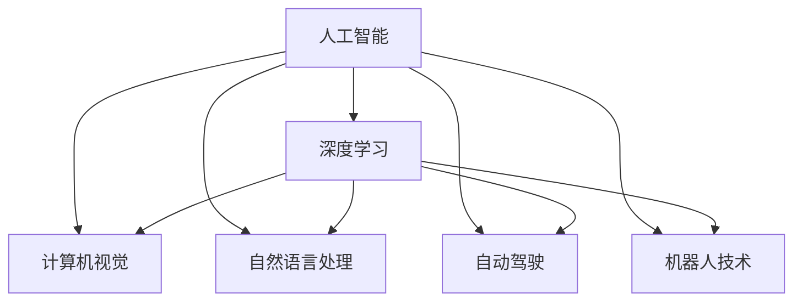

                 

# Andrej Karpathy：人工智能的未来发展方向

## 1. 背景介绍

> 在这个快速发展的科技时代，人工智能（AI）无疑是最热门的话题之一。而Andrej Karpathy，作为OpenAI的杰出研究员和深度学习专家，他的研究领域涵盖了计算机视觉、自然语言处理、自动驾驶等多个领域，对AI的未来发展有着深刻的见解。他的观点和研究成果为科技界和业界提供了重要的参考。本文将深入探讨Andrej Karpathy关于人工智能未来发展方向的见解，及其对当前科技趋势的看法。

## 2. 核心概念与联系

> 要理解Andrej Karpathy关于人工智能未来发展方向的观点，首先需要理解几个核心概念及其相互关系。本文将通过一个简化的概念图来帮助读者理解。

这个概念图展示了人工智能的各个分支，以及它们与深度学习的关系。Andrej Karpathy在多个领域都有深入研究，他的观点往往能反映出AI未来的发展方向。

## 3. 核心算法原理 & 具体操作步骤

> 本节将详细讨论Andrej Karpathy关于人工智能算法原理和具体操作步骤的看法。

### 3.1 算法原理概述

Andrej Karpathy认为，当前AI的发展主要依赖于深度学习，尤其是神经网络。他强调，深度学习通过模拟人类大脑的结构和工作方式，实现了对复杂数据的自动处理和分析。但他也指出，深度学习需要大量的数据和计算资源，且在解释性和可控性方面仍存在不足。

### 3.2 算法步骤详解

Karpathy认为，深度学习算法步骤一般包括以下几个环节：

1. **数据收集与预处理**：收集并清洗数据，确保数据质量和多样性。
2. **模型设计**：选择合适的模型架构，如卷积神经网络（CNN）、循环神经网络（RNN）等。
3. **训练**：使用大量标注数据对模型进行训练，调整模型参数，优化损失函数。
4. **验证与调整**：在验证集上评估模型性能，根据结果调整模型参数。
5. **测试与部署**：在测试集上评估模型泛化能力，部署到实际应用中。

### 3.3 算法优缺点

Karpathy指出，深度学习的优点在于其强大的数据处理能力和广泛的应用场景。但同时，它也存在以下缺点：

- **数据需求大**：需要大量标注数据进行训练，数据采集和标注成本较高。
- **计算资源消耗大**：训练和推理过程中需要大量计算资源，对硬件设备要求高。
- **可解释性不足**：深度学习模型通常被认为是"黑盒"，难以解释其决策过程。
- **过拟合风险**：模型容易过拟合，尤其是在训练数据不足或数据分布不均衡的情况下。

### 3.4 算法应用领域

Karpathy认为，深度学习在计算机视觉、自然语言处理、自动驾驶、机器人技术等领域有着广泛的应用。他以计算机视觉为例，说明了深度学习如何在图像识别、对象检测、图像生成等方面发挥重要作用。

## 4. 数学模型和公式 & 详细讲解 & 举例说明

> 数学模型和公式是理解和实现深度学习算法的关键。本节将详细讲解Andrej Karpathy在数学模型和公式方面的观点。

### 4.1 数学模型构建

Karpathy强调，深度学习模型的构建需要考虑多个方面，如模型架构、损失函数、优化算法等。他特别指出，卷积神经网络（CNN）和循环神经网络（RNN）是常用的模型架构，而交叉熵损失函数和梯度下降算法是常用的优化方法。

### 4.2 公式推导过程

Karpathy通过一系列公式推导，展示了深度学习模型的工作原理。例如，卷积神经网络中卷积层和池化层的数学公式，以及反向传播算法的推导。这些公式帮助读者理解深度学习模型的工作机制和优化方法。

### 4.3 案例分析与讲解

以图像分类任务为例，Karpathy详细讲解了如何使用CNN模型进行图像分类，包括模型架构设计、数据预处理、训练与优化等步骤。他通过具体的案例分析，展示了深度学习模型在实际应用中的效果。

## 5. 项目实践：代码实例和详细解释说明

> 理论学习需要实践验证。本节将通过具体的代码实例，详细解释深度学习模型的实现和优化。

### 5.1 开发环境搭建

Karpathy推荐使用PyTorch和TensorFlow等深度学习框架进行项目实践。他详细讲解了如何在Python环境中搭建深度学习开发环境，并介绍了TensorFlow和PyTorch的基本使用方法。

### 5.2 源代码详细实现

Karpathy以图像分类任务为例，详细讲解了如何使用PyTorch实现CNN模型，并提供了完整的代码实现。他通过代码实例，展示了模型设计、数据预处理、训练与优化等步骤的实现细节。

### 5.3 代码解读与分析

Karpathy对代码实现进行了详细解读和分析，帮助读者理解深度学习模型的实现过程。他指出，深度学习模型的实现需要关注模型的架构设计、数据处理、损失函数和优化算法等关键点。

### 5.4 运行结果展示

Karpathy展示了训练后的模型在测试集上的性能，包括准确率、损失函数等指标。他通过具体的运行结果，验证了模型的泛化能力和性能提升效果。

## 6. 实际应用场景

> 本节将探讨Andrej Karpathy关于深度学习实际应用场景的看法。

Karpathy认为，深度学习技术已经在多个领域实现了广泛应用，包括计算机视觉、自然语言处理、自动驾驶等。他特别强调了深度学习在自动驾驶领域的应用前景，认为深度学习能够实现精确的物体检测、车道保持和路径规划等功能。

## 7. 工具和资源推荐

> 为了帮助读者更好地学习和实现深度学习算法，Karpathy推荐了以下几个工具和资源。

### 7.1 学习资源推荐

Karpathy推荐了多个学习资源，包括在线课程、书籍和论文等。他特别推荐了《深度学习》（Goodfellow et al.）、《Python深度学习》（Francois et al.）等经典书籍，以及Deep Learning Specialization等在线课程。

### 7.2 开发工具推荐

Karpathy推荐了多个深度学习框架和工具，包括PyTorch、TensorFlow、Keras等。他详细讲解了这些框架的基本使用方法和功能特点，并推荐了TensorBoard和Weights & Biases等可视化工具。

### 7.3 相关论文推荐

Karpathy推荐了多篇深度学习领域的经典论文，包括《ImageNet Classification with Deep Convolutional Neural Networks》、《A Tutorial on Deep Learning》等。这些论文涵盖了深度学习模型的架构设计、训练与优化等关键问题。

## 8. 总结：未来发展趋势与挑战

> 本节将总结Andrej Karpathy关于深度学习未来发展趋势和面临的挑战的看法。

### 8.1 研究成果总结

Karpathy指出，深度学习在过去几年中取得了巨大的进步，但在可解释性、数据需求和计算资源消耗方面仍存在不足。他强调，未来的研究需要在这些方面进行突破，以实现更加高效、智能的深度学习模型。

### 8.2 未来发展趋势

Karpathy认为，深度学习未来的发展方向包括：

- **多模态学习**：深度学习模型需要能够处理多种类型的输入数据，如图像、文本和语音等。
- **自适应学习**：深度学习模型需要能够适应不同的数据分布和环境变化，提高泛化能力。
- **可解释性**：深度学习模型需要具备更好的可解释性，帮助用户理解模型的决策过程。
- **集成学习**：深度学习模型需要与其他模型和技术进行集成，提升系统的整体性能。

### 8.3 面临的挑战

Karpathy指出，深度学习在未来的发展中仍面临以下挑战：

- **数据瓶颈**：深度学习需要大量的标注数据，数据采集和标注成本高昂。
- **计算资源限制**：深度学习模型对计算资源的需求较大，硬件设备的成本较高。
- **可解释性不足**：深度学习模型通常被视为"黑盒"，难以解释其决策过程。
- **过拟合风险**：深度学习模型容易过拟合，尤其是在训练数据不足或数据分布不均衡的情况下。

### 8.4 研究展望

Karpathy认为，未来的研究需要在以下几个方面进行突破：

- **多模态深度学习**：实现对多种数据类型的处理和融合，提升模型的泛化能力。
- **自适应深度学习**：开发能够适应不同数据分布和环境变化的模型，提高泛化能力。
- **可解释深度学习**：提升深度学习模型的可解释性，帮助用户理解模型的决策过程。
- **集成深度学习**：实现深度学习模型与其他技术（如强化学习、知识图谱等）的集成，提升系统的整体性能。

## 9. 附录：常见问题与解答

> 在深度学习研究中，可能会遇到一些常见问题。本节将探讨Andrej Karpathy关于深度学习常见问题的回答。

**Q1: 深度学习与传统机器学习有何不同？**

A: 深度学习是一种基于神经网络的机器学习方法，能够自动从数据中学习特征表示。与传统机器学习相比，深度学习具有更好的泛化能力和自动特征提取能力，能够处理更加复杂和多样化的数据类型。

**Q2: 深度学习模型的训练需要多少数据？**

A: 深度学习模型的训练需要大量的标注数据，数据量和质量对模型的性能有着重要影响。但具体的训练数据需求量取决于模型的复杂度和任务类型。

**Q3: 如何防止深度学习模型的过拟合？**

A: 防止深度学习模型过拟合的方法包括：数据增强、正则化、早停等。此外，可以使用模型集成、梯度裁剪等技术来提高模型的泛化能力。

**Q4: 深度学习模型的解释性如何提升？**

A: 提升深度学习模型解释性的方法包括：可视化技术、可解释模型架构设计等。可以使用可视化工具如TensorBoard，或者采用可解释模型架构如LIME、SHAP等。

**Q5: 深度学习模型在实际应用中面临哪些挑战？**

A: 深度学习模型在实际应用中面临的挑战包括：数据瓶颈、计算资源限制、可解释性不足、过拟合风险等。需要针对具体应用场景，选择合适的方法进行优化和改进。

---

作者：禅与计算机程序设计艺术 / Zen and the Art of Computer Programming

