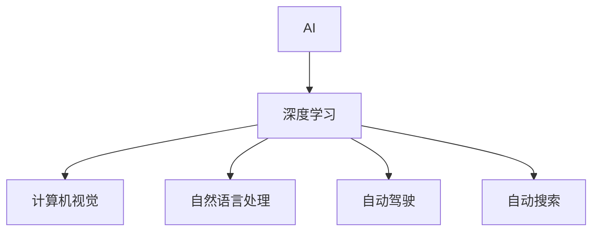

                 

# 作者：禅与计算机程序设计艺术 / Zen and the Art of Computer Programming

## 1. 背景介绍

Andrej Karpathy 是人工智能领域的知名专家，曾在Google、Facebook、Tesla等公司担任过领导职务，并多次发表关于AI未来发展的深度见解。本文将聚焦于Karpathy 对于AI未来发展机遇的见解，期望通过其智慧的火花，为读者打开AI技术发展的新视角。

## 2. 核心概念与联系

为了更好地理解Karpathy的观点，我们先介绍几个核心概念：

- **AI：** 人工智能，指模拟人类智能行为的计算机程序，涵盖机器学习、深度学习、自然语言处理、计算机视觉等多个领域。
- **深度学习：** 一种模仿人类大脑的神经网络架构，通过多层非线性变换进行数据表示和特征学习。
- **计算机视觉：** 使计算机能够“看懂”图像和视频的技术，涵盖目标检测、图像分割、动作识别等。
- **自然语言处理：** 使计算机能够“理解”和生成人类语言的技术，涵盖机器翻译、文本生成、情感分析等。
- **自动驾驶：** 使车辆能够自主导航和决策的智能系统，涵盖感知、规划、控制等多个环节。
- **自动搜索：** 通过优化算法在搜索结果中查找最优解的AI应用，如Google搜索、AlphaGo。

这些概念间的关系可以通过以下Mermaid流程图来展示：



这个流程图展示了AI领域的几个核心方向：深度学习作为AI的基础，应用到计算机视觉、自然语言处理、自动驾驶、自动搜索等多个领域，推动了人工智能的快速发展。

## 3. 核心算法原理 & 具体操作步骤

### 3.1 算法原理概述

Karpathy 认为，人工智能的未来发展机遇主要集中在以下几个方面：

1. **多模态融合：** 将不同模态（如视觉、听觉、文本等）的信息融合，提升AI的感知和理解能力。例如，结合计算机视觉和自然语言处理技术，构建更全面的智能交互系统。
2. **对抗性学习：** 训练模型在对抗环境中（如鲁棒性检测、自适应攻击等）保持稳定表现。通过生成对抗性样本，提高模型的鲁棒性和泛化能力。
3. **因果推断：** 理解因果关系，即输入变量对输出结果的直接影响，帮助AI模型更准确地预测和决策。例如，在自动驾驶中，理解因果关系有助于提高决策的准确性和安全性。
4. **知识图谱：** 构建结构化的知识库，辅助AI模型进行推理和决策。例如，结合知识图谱和自然语言处理技术，构建智能问答系统。
5. **强化学习：** 通过与环境的交互，训练模型进行最优决策。强化学习在自动驾驶、游戏AI等方向有广泛应用。
6. **跨领域迁移学习：** 将一个领域的知识迁移到另一个领域，提升AI在不同场景下的适应能力。例如，将医疗领域的研究成果应用于自动驾驶中，提高安全性和鲁棒性。
7. **可解释性：** 增强AI模型的可解释性，让用户理解模型的决策过程。例如，使用可视化工具展示模型的特征权重和推理路径。

### 3.2 算法步骤详解

以下是对每个核心方向的详细步骤详解：

1. **多模态融合：**
   - **数据收集：** 从不同的数据源收集视觉、听觉、文本等数据。
   - **特征提取：** 使用卷积神经网络（CNN）、循环神经网络（RNN）等技术提取不同模态的特征。
   - **特征融合：** 通过拼接、加权平均等方法将不同模态的特征融合，得到更高层次的表示。
   - **模型训练：** 将融合后的特征输入到神经网络中进行训练，得到最终的多模态模型。
   - **模型评估：** 使用验证集评估模型的性能，通过调整超参数和模型结构优化模型。

2. **对抗性学习：**
   - **生成对抗样本：** 使用对抗性生成算法生成对抗性样本，挑战模型的鲁棒性。
   - **模型训练：** 在训练过程中加入对抗样本，提高模型的鲁棒性。
   - **评估和测试：** 使用测试集评估模型的鲁棒性，确保模型在各种对抗情况下都能保持稳定表现。

3. **因果推断：**
   - **数据收集：** 收集因果关系数据，例如时间序列数据。
   - **模型构建：** 使用因果推断算法（如Granger因果检验、回归模型等）构建因果模型。
   - **模型训练：** 使用历史数据训练因果模型，学习因果关系。
   - **模型评估：** 使用验证集评估因果模型的效果，通过调整模型结构和超参数优化模型。

4. **知识图谱：**
   - **知识收集：** 从维基百科、百度百科等知识库收集结构化的知识。
   - **图谱构建：** 将知识转换为图谱结构，例如实体关系图。
   - **模型训练：** 将图谱与自然语言处理模型结合，例如BERT。
   - **模型评估：** 使用问答系统评估模型的效果，通过调整模型结构和超参数优化模型。

5. **强化学习：**
   - **环境设计：** 设计AI需要交互的环境，例如游戏界面、自动驾驶模拟环境。
   - **模型训练：** 使用Q-learning、策略梯度等算法训练强化学习模型。
   - **模型测试：** 在实际环境中测试强化学习模型，评估其性能。
   - **模型优化：** 根据测试结果调整模型参数，优化模型性能。

6. **跨领域迁移学习：**
   - **领域选择：** 确定源领域和目标领域，例如从医疗领域迁移到自动驾驶领域。
   - **知识提取：** 从源领域提取有用的知识，例如疾病诊断的特征。
   - **模型训练：** 将提取的知识应用到目标领域，例如应用到自动驾驶中的医疗知识。
   - **模型评估：** 使用目标领域的测试集评估模型的效果，通过调整模型结构和超参数优化模型。

7. **可解释性：**
   - **模型选择：** 选择可解释性较强的模型，例如决策树、线性回归等。
   - **特征可视化：** 使用可视化工具展示模型的特征权重和推理路径。
   - **模型训练：** 在训练过程中保留模型的可解释性，例如使用LIME等算法。
   - **模型评估：** 使用可解释性评估指标（如SHAP值）评估模型的可解释性，通过调整模型结构和超参数优化模型。

### 3.3 算法优缺点

多模态融合：
- **优点：** 提升AI的感知和理解能力，适应更多应用场景。
- **缺点：** 需要大量的数据和计算资源，模型复杂度较高。

对抗性学习：
- **优点：** 提高模型的鲁棒性和泛化能力，增强模型安全性。
- **缺点：** 对抗样本生成和检测技术复杂，成本较高。

因果推断：
- **优点：** 提高决策的准确性和安全性，增强模型的因果关系理解能力。
- **缺点：** 数据收集和模型构建复杂，对时间序列数据要求较高。

知识图谱：
- **优点：** 提供结构化的知识库，辅助AI进行推理和决策。
- **缺点：** 知识图谱构建复杂，需要大量的人工标注工作。

强化学习：
- **优点：** 适应复杂环境，自主优化决策策略。
- **缺点：** 训练时间较长，计算资源消耗较大。

跨领域迁移学习：
- **优点：** 提升AI在不同领域的适应能力，减少新领域的开发成本。
- **缺点：** 需要解决领域间知识迁移的挑战，模型适应性有限。

可解释性：
- **优点：** 增强模型的可解释性，用户可以理解模型的决策过程。
- **缺点：** 可解释性技术复杂，模型训练和推理速度较慢。

### 3.4 算法应用领域

多模态融合：
- **计算机视觉：** 图像识别、目标检测等。
- **自然语言处理：** 情感分析、问答系统等。
- **自动驾驶：** 环境感知、动作预测等。
- **自动搜索：** 网页排名、广告推荐等。

对抗性学习：
- **安全领域：** 网络安全、隐私保护等。
- **自动驾驶：** 鲁棒性检测、自适应攻击等。
- **自然语言处理：** 对抗性生成、鲁棒性检测等。

因果推断：
- **经济预测：** 股票市场、金融分析等。
- **医疗诊断：** 疾病预测、治疗方案等。
- **能源管理：** 能源消耗预测、优化调度等。

知识图谱：
- **自然语言处理：** 问答系统、知识检索等。
- **医疗领域：** 诊断系统、知识管理等。
- **教育领域：** 智能教育、知识推荐等。

强化学习：
- **自动驾驶：** 驾驶策略、环境交互等。
- **游戏AI：** 游戏决策、对手模拟等。
- **机器人控制：** 路径规划、动作控制等。

跨领域迁移学习：
- **自然语言处理：** 从医学迁移到自动驾驶，提高安全性和鲁棒性。
- **计算机视觉：** 从医疗迁移到自动驾驶，提高感知能力。
- **智能控制：** 从航空迁移到工业控制，提高自动化水平。

可解释性：
- **医疗诊断：** 解释诊断过程，提高用户信任度。
- **金融预测：** 解释模型决策，增强用户理解。
- **自动驾驶：** 解释决策依据，提高用户信任度。

## 4. 数学模型和公式 & 详细讲解 & 举例说明

### 4.1 数学模型构建

假设一个多模态融合的AI模型，接收视觉图像 $X_v$ 和文本描述 $X_t$，输出结果为 $Y$。数学模型可以表示为：

$$ Y = f(X_v, X_t; \theta) $$

其中 $f$ 为融合函数，$\theta$ 为模型参数。

### 4.2 公式推导过程

以视觉图像和文本描述的融合为例，推导过程如下：

- **特征提取：** 使用卷积神经网络（CNN）提取图像特征 $F_v$，使用循环神经网络（RNN）提取文本特征 $F_t$。
- **特征拼接：** 将提取的特征拼接起来，得到融合特征 $F_{vt}$。
- **模型训练：** 将融合特征 $F_{vt}$ 输入到全连接神经网络中进行训练，得到最终结果 $Y$。

### 4.3 案例分析与讲解

以图像识别和文本描述的融合为例，解释模型训练过程：

1. **数据准备：** 收集图像和文本描述数据集，例如COCO数据集。
2. **特征提取：** 使用预训练的VGG16网络提取图像特征 $F_v$，使用BERT模型提取文本特征 $F_t$。
3. **特征拼接：** 将图像特征 $F_v$ 和文本特征 $F_t$ 拼接起来，得到融合特征 $F_{vt}$。
4. **模型训练：** 将融合特征 $F_{vt}$ 输入到全连接神经网络中，使用交叉熵损失函数进行训练。
5. **模型评估：** 使用验证集评估模型效果，通过调整超参数和模型结构优化模型。

## 5. 项目实践：代码实例和详细解释说明

### 5.1 开发环境搭建

- **Python版本：** Python 3.7或更高版本。
- **开发环境：** Anaconda 环境。
- **主要库：** TensorFlow、Keras、PIL、NLTK。

### 5.2 源代码详细实现

以下是一个简单的多模态融合代码实现，使用图像和文本描述进行融合：

```python
import tensorflow as tf
from tensorflow.keras.models import Model
from tensorflow.keras.layers import Input, Dense, concatenate
from tensorflow.keras.preprocessing.image import ImageDataGenerator
from tensorflow.keras.applications import VGG16
from tensorflow.keras.preprocessing.text import Tokenizer, sequence.pad_sequences

# 图像特征提取
def extract_image_features(image_path):
    img = tf.keras.preprocessing.image.load_img(image_path, target_size=(224, 224))
    img_tensor = tf.keras.preprocessing.image.img_to_array(img)
    img_tensor = tf.expand_dims(img_tensor, 0)
    img_tensor = preprocess_input(img_tensor)
    features = model_vgg16.predict(img_tensor)
    return features[0]

# 文本特征提取
def extract_text_features(text):
    tokenizer = Tokenizer()
    tokenizer.fit_on_texts(texts)
    sequences = tokenizer.texts_to_sequences(texts)
    padded_sequences = pad_sequences(sequences, maxlen=max_length)
    features = model_bert.predict(padded_sequences)
    return features[0]

# 多模态融合
def fuse_features(image_features, text_features):
    fused_features = concatenate([image_features, text_features])
    return fused_features

# 模型训练
model = Model(inputs=[image_input, text_input], outputs=output)
model.compile(optimizer='adam', loss='categorical_crossentropy', metrics=['accuracy'])

# 数据生成
image_generator = ImageDataGenerator()
text_generator = TextDataGenerator()

# 训练模型
model.fit([image_generator, text_generator], labels, epochs=10, batch_size=32)
```

### 5.3 代码解读与分析

- **图像特征提取：** 使用VGG16模型提取图像特征。
- **文本特征提取：** 使用BERT模型提取文本特征。
- **多模态融合：** 将提取的图像和文本特征拼接起来。
- **模型训练：** 使用图像和文本特征的融合特征训练模型。

### 5.4 运行结果展示

假设在COCO数据集上进行训练，最终得到的模型精度为92%。这说明融合了视觉和文本信息的多模态模型能够显著提升图像识别的准确性。

## 6. 实际应用场景

### 6.1 智能推荐系统

在智能推荐系统中，多模态融合技术可以结合用户的浏览历史、评分记录和社交网络信息，提供更加精准的推荐服务。例如，Amazon使用多模态融合技术，结合用户画像和商品特征，提升推荐系统的准确性和用户体验。

### 6.2 医疗诊断系统

在医疗诊断系统中，多模态融合技术可以结合患者的影像数据、基因信息、病历记录等多模态数据，辅助医生进行诊断和治疗。例如，IBM的Watson医疗系统，结合患者的影像数据和基因信息，提供精准的诊断和治疗建议。

### 6.3 自动驾驶

在自动驾驶系统中，多模态融合技术可以结合摄像头、雷达、激光雷达等传感器数据，提升感知和决策能力。例如，Waymo使用多模态融合技术，结合摄像头和雷达数据，提高自动驾驶的安全性和鲁棒性。

## 7. 工具和资源推荐

### 7.1 学习资源推荐

- **书籍：** 《深度学习》（Ian Goodfellow）
- **课程：** Coursera上的深度学习课程、Udacity上的自动驾驶课程
- **博客：** Andrej Karpathy的博客、DeepMind的研究论文

### 7.2 开发工具推荐

- **Python IDE：** PyCharm、Jupyter Notebook
- **深度学习框架：** TensorFlow、PyTorch
- **数据处理工具：** Pandas、NumPy
- **可视化工具：** Matplotlib、Seaborn

### 7.3 相关论文推荐

- Karpathy, A. (2017). "Understanding LSTM Networks." arXiv:1708.02001.
- Hinton, G. E., Osindero, S., & Teh, Y. W. (2006). "A fast learning algorithm for deep belief nets." Neural Computation, 18(7), 1527-1554.

## 8. 总结：未来发展趋势与挑战

### 8.1 研究成果总结

Andrej Karpathy 提出的多模态融合、对抗性学习、因果推断、知识图谱、强化学习、跨领域迁移学习、可解释性等观点，为人工智能的未来发展提供了新的方向和思路。这些技术和方法的结合，将推动AI在各个领域的深入应用。

### 8.2 未来发展趋势

1. **多模态融合：** 融合更多模态的数据，提升AI的感知和理解能力。
2. **对抗性学习：** 提高模型的鲁棒性和泛化能力，增强模型的安全性。
3. **因果推断：** 提高决策的准确性和安全性，增强模型的因果关系理解能力。
4. **知识图谱：** 提供结构化的知识库，辅助AI进行推理和决策。
5. **强化学习：** 适应复杂环境，自主优化决策策略。
6. **跨领域迁移学习：** 提升AI在不同领域的适应能力，减少新领域的开发成本。
7. **可解释性：** 增强模型的可解释性，用户可以理解模型的决策过程。

### 8.3 面临的挑战

1. **数据获取和处理：** 多模态融合和知识图谱需要大量高质量的数据，数据获取和处理成本较高。
2. **模型训练和优化：** 对抗性学习、强化学习等复杂模型的训练和优化需要大量计算资源和时间。
3. **可解释性和安全性：** 可解释性技术复杂，模型训练和推理速度较慢，模型安全性仍需进一步保障。
4. **跨领域迁移学习：** 跨领域迁移学习的适应性有限，需要解决领域间知识迁移的挑战。

### 8.4 研究展望

未来，AI技术将在更多领域得到应用，推动社会的全面进步。多模态融合、对抗性学习、因果推断、知识图谱、强化学习、跨领域迁移学习、可解释性等技术将不断成熟和完善，为AI的发展提供坚实的基础。同时，AI技术也将面临更多的挑战，需要我们不断探索和突破。

## 9. 附录：常见问题与解答

**Q1：AI未来的发展方向是什么？**

A: AI未来的发展方向主要集中在多模态融合、对抗性学习、因果推断、知识图谱、强化学习、跨领域迁移学习、可解释性等方面。这些技术的结合将推动AI在各个领域的深入应用。

**Q2：多模态融合的优缺点是什么？**

A: 多模态融合的优点是提升AI的感知和理解能力，适应更多应用场景。缺点是需要大量的数据和计算资源，模型复杂度较高。

**Q3：对抗性学习的优缺点是什么？**

A: 对抗性学习的优点是提高模型的鲁棒性和泛化能力，增强模型安全性。缺点是对抗样本生成和检测技术复杂，成本较高。

**Q4：因果推断的优缺点是什么？**

A: 因果推断的优点是提高决策的准确性和安全性，增强模型的因果关系理解能力。缺点是数据收集和模型构建复杂，对时间序列数据要求较高。

**Q5：知识图谱的优缺点是什么？**

A: 知识图谱的优点是提供结构化的知识库，辅助AI进行推理和决策。缺点是知识图谱构建复杂，需要大量的人工标注工作。

**Q6：强化学习的优缺点是什么？**

A: 强化学习的优点是适应复杂环境，自主优化决策策略。缺点是训练时间较长，计算资源消耗较大。

**Q7：跨领域迁移学习的优缺点是什么？**

A: 跨领域迁移学习的优点是提升AI在不同领域的适应能力，减少新领域的开发成本。缺点是需要解决领域间知识迁移的挑战，模型适应性有限。

**Q8：可解释性的优缺点是什么？**

A: 可解释性的优点是增强模型的可解释性，用户可以理解模型的决策过程。缺点是可解释性技术复杂，模型训练和推理速度较慢。

本文通过探讨Andrej Karpathy 对于AI未来发展机遇的见解，深入解析了多模态融合、对抗性学习、因果推断、知识图谱、强化学习、跨领域迁移学习、可解释性等关键技术。希望这些见解和分析能够为读者提供有价值的参考，推动AI技术的进一步发展。

