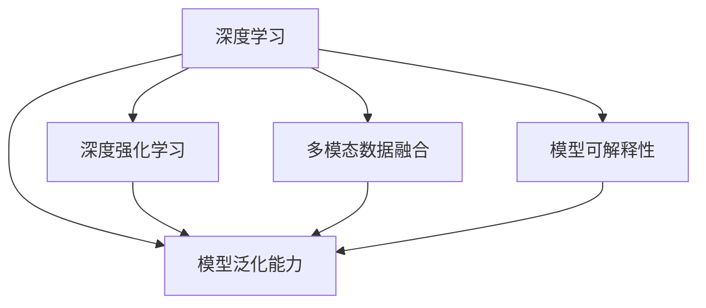

                 

# Andrej Karpathy：人工智能的未来发展机遇

> 关键词：人工智能,未来发展,技术创新,深度学习,机器学习,深度强化学习

## 1. 背景介绍

### 1.1 问题由来

当前，人工智能（AI）正处于迅猛发展的关键时期，尤其在深度学习（Deep Learning）和深度强化学习（Deep Reinforcement Learning, DRL）领域取得了一系列突破性的进展。这为AI技术的广泛应用提供了坚实的理论基础和强大的技术支撑，也进一步激发了全球对于AI技术未来发展机遇的广泛关注和深入探讨。

Andrej Karpathy，作为深度学习领域的研究先驱和杰出人物，他的思考和见解对于指导AI技术未来的发展具有重要参考价值。因此，本文将重点分析Karpathy对AI技术未来发展趋势的看法，为读者揭示人工智能发展的新机遇。

### 1.2 问题核心关键点

Karpathy在其系列演讲和文章中多次强调，当前AI技术的突破主要集中在深度学习和深度强化学习领域，未来AI的发展将继续在这一领域深入探索和拓展。具体而言，以下关键点构成了其对AI未来发展机遇的深刻洞察：

1. **算法的复杂性提升**：随着深度学习模型的日益复杂，如何高效训练和优化模型成为一大挑战。
2. **模型可解释性的需求**：在医疗、金融等高风险领域，模型的决策过程需要透明和可解释，以确保应用的安全性和可靠性。
3. **多模态数据的融合**：语音、视觉、文本等多种模态数据的整合，将为AI模型提供更丰富的信息，提升其理解能力和应用范围。
4. **模型泛化能力的增强**：如何构建具有更强泛化能力的模型，使其在未知数据上仍能取得良好表现。
5. **跨领域应用的推广**：AI技术如何在医疗、教育、娱乐等多个领域得到广泛应用，提升人类生活质量和社会效率。
6. **伦理与道德的考量**：AI模型的设计和应用需要考虑伦理与道德问题，避免偏见和不公平。

本文将围绕上述关键点，对Karpathy关于AI未来发展的观点进行深入分析，并结合实际案例和未来趋势进行详细讨论。

## 2. 核心概念与联系

### 2.1 核心概念概述

要深入理解Karpathy对AI未来发展机遇的洞察，首先需要明确几个核心概念：

- **深度学习**：一种利用多层神经网络进行模式识别的机器学习方法，广泛应用于计算机视觉、自然语言处理等领域。
- **深度强化学习**：结合了强化学习的原理，通过与环境的交互来学习最优策略的深度学习方法，广泛应用于游戏AI、机器人控制等领域。
- **模型可解释性**：指模型的决策过程能够被理解和解释，特别是在医疗、金融等高风险领域，确保应用的安全性和可靠性至关重要。
- **多模态数据融合**：将语音、视觉、文本等多种数据源整合，提升模型的理解能力和应用范围，应用于更复杂的任务中。
- **模型泛化能力**：指模型在不同数据集和任务上表现的一致性和稳定性，是衡量模型性能的重要指标。

### 2.2 概念间的关系

这些核心概念通过以下Mermaid流程图展示了它们之间的联系：



这个流程图展示了深度学习、深度强化学习、多模态数据融合、模型可解释性和模型泛化能力之间的关系：

1. 深度学习和深度强化学习是AI技术的基础，为多模态数据融合和模型泛化提供了技术支持。
2. 多模态数据融合和模型可解释性进一步提升了模型的性能和应用范围。
3. 模型泛化能力是衡量AI技术优劣的重要指标，能够反映模型的稳定性和可靠性。

通过这些核心概念的联系，我们可以更好地理解AI技术的未来发展趋势，并据此探讨其未来的机遇和挑战。

## 3. 核心算法原理 & 具体操作步骤

### 3.1 算法原理概述

Karpathy对AI技术未来发展的理解，主要集中在以下几个核心算法原理：

1. **自监督学习**：利用未标注数据进行预训练，提高模型的泛化能力。
2. **迁移学习**：将在大规模数据上预训练的知识迁移到新任务上，提升模型在特定任务上的表现。
3. **参数高效微调**：在不增加大量新参数的情况下，通过微调现有模型的参数，实现高效优化。
4. **对抗训练**：通过引入对抗样本，提高模型的鲁棒性和泛化能力。
5. **模型压缩和量化**：通过减少模型参数和优化计算，提高模型的推理速度和效率。

### 3.2 算法步骤详解

以下是Karpathy对AI技术未来发展核心算法步骤的详细描述：

#### 3.2.1 自监督学习

**步骤**：
1. **数据准备**：收集大量未标注数据，如ImageNet数据集，作为自监督学习的训练数据。
2. **模型训练**：利用预训练模型（如ResNet、VGG等）在未标注数据上进行自监督学习任务，如自编码、掩码语言模型等。
3. **模型评估**：在新数据集上进行验证，评估模型的泛化能力。

**注意事项**：
- 自监督学习需要大量未标注数据，数据质量对模型的性能至关重要。
- 模型训练过程中需要选择合适的自监督任务，以最大化利用未标注数据的信息。

#### 3.2.2 迁移学习

**步骤**：
1. **模型预训练**：在大规模标注数据上预训练深度学习模型，如BERT、GPT等。
2. **任务适配**：将预训练模型迁移到新任务上，如在COCO数据集上进行目标检测任务适配。
3. **微调**：利用少量标注数据对预训练模型进行微调，以适应新任务的具体需求。

**注意事项**：
- 迁移学习需要选择合适的预训练模型，以最大化利用其通用知识。
- 微调过程中需要仔细设置超参数，避免过拟合和欠拟合问题。

#### 3.2.3 参数高效微调

**步骤**：
1. **模型选择**：选择参数量较大的预训练模型，如BERT、ResNet等。
2. **任务适配**：在预训练模型的基础上，添加特定的任务适配层，如目标检测头、语言模型头等。
3. **微调**：仅对适配层进行微调，保留大部分预训练权重，以减少计算资源消耗。

**注意事项**：
- 参数高效微调需要仔细选择适配层的结构和参数量，以最大化利用预训练模型的知识。
- 微调过程中需要设置合适的学习率和正则化参数，避免过拟合。

#### 3.2.4 对抗训练

**步骤**：
1. **生成对抗样本**：利用生成对抗网络（GAN）生成对抗样本，模拟真实世界的噪声和干扰。
2. **模型训练**：将对抗样本作为输入，与原始数据一起进行模型训练。
3. **模型评估**：在新数据集上进行验证，评估模型的鲁棒性和泛化能力。

**注意事项**：
- 对抗训练需要生成高质量的对抗样本，以确保训练效果。
- 模型训练过程中需要设置合适的对抗强度，避免模型过度拟合。

#### 3.2.5 模型压缩和量化

**步骤**：
1. **模型量化**：将浮点模型转换为定点模型，减少计算资源消耗。
2. **模型压缩**：利用剪枝、量化等技术，减少模型的参数量和计算复杂度。
3. **模型测试**：在新数据集上进行测试，评估模型的推理速度和准确率。

**注意事项**：
- 模型压缩和量化需要仔细选择合适的压缩方法，以确保模型性能不受影响。
- 压缩过程中需要平衡模型大小和推理速度，以确保应用效果。

### 3.3 算法优缺点

Karpathy认为，这些核心算法原理在提升AI技术性能和应用范围的同时，也存在一些问题和挑战：

#### 3.3.1 优点

1. **高效性**：自监督学习、迁移学习和参数高效微调等方法可以显著降低对标注数据的依赖，提高模型训练效率。
2. **泛化能力**：自监督学习和迁移学习能够提高模型的泛化能力，使其在新数据集上表现更稳定。
3. **鲁棒性**：对抗训练和模型压缩技术可以提高模型的鲁棒性和抗干扰能力，提升实际应用中的可靠性。

#### 3.3.2 缺点

1. **数据需求大**：自监督学习需要大量未标注数据，收集和处理这些数据成本较高。
2. **模型复杂性高**：深度学习和深度强化学习模型复杂度高，训练和推理速度慢。
3. **模型可解释性不足**：复杂的深度学习模型难以解释其内部工作机制，应用在高风险领域存在安全隐患。

### 3.4 算法应用领域

Karpathy认为，这些核心算法原理已经在多个领域得到了广泛应用，包括计算机视觉、自然语言处理、机器人控制等。具体而言：

- **计算机视觉**：自监督学习和迁移学习被广泛应用于目标检测、图像分类、语义分割等任务。
- **自然语言处理**：深度学习模型在机器翻译、情感分析、问答系统等任务上取得了显著进展。
- **机器人控制**：深度强化学习被广泛应用于机器人路径规划、动作控制等任务。

此外，Karpathy还认为，未来的AI技术将继续在这些领域深入探索，推动AI技术在更多领域得到应用。

## 4. 数学模型和公式 & 详细讲解 & 举例说明

### 4.1 数学模型构建

在深度学习领域，数学模型是构建模型的基础。Karpathy在多个公开演讲中多次强调，理解模型的数学原理对于深入掌握AI技术至关重要。以下是Karpathy对深度学习模型的数学模型构建的详细讲解：

- **前向传播**：输入数据通过多层神经网络进行处理，输出结果。
- **损失函数**：衡量模型输出与真实标签之间的差异，如交叉熵损失、均方误差损失等。
- **反向传播**：计算损失函数对每个参数的梯度，更新模型参数。
- **优化算法**：如梯度下降算法、Adam算法等，用于最小化损失函数。

### 4.2 公式推导过程

以下是Karpathy对深度学习模型中关键公式的推导过程：

#### 4.2.1 交叉熵损失函数

**公式**：
$$
L(x, y) = -\sum_{i=1}^C y_i \log(\hat{y}_i)
$$

其中，$x$为输入数据，$y$为真实标签，$\hat{y}$为模型输出。

**推导过程**：
- 将交叉熵损失函数展开为单例概率损失函数之和。
- 将输出层的softmax函数和真实标签的one-hot编码结合，得到最终损失函数。

**示例**：
- 在图像分类任务中，将输入图像作为输入数据，输出层的softmax函数作为模型输出，真实标签作为真实结果，计算交叉熵损失。

#### 4.2.2 梯度下降算法

**公式**：
$$
\theta_{new} = \theta_{old} - \eta \nabla L(\theta_{old})
$$

其中，$\theta$为模型参数，$L$为损失函数，$\eta$为学习率。

**推导过程**：
- 梯度下降算法通过计算损失函数对参数的梯度，更新模型参数。
- 更新后的参数等于原始参数减去梯度乘以学习率。

**示例**：
- 在图像分类任务中，将梯度下降算法应用于softmax层和卷积层的参数更新，以最小化交叉熵损失。

#### 4.2.3 Adam算法

**公式**：
$$
m_t = \beta_1 m_{t-1} + (1 - \beta_1) g_t
$$
$$
v_t = \beta_2 v_{t-1} + (1 - \beta_2) g_t^2
$$
$$
\hat{m}_t = \frac{m_t}{1 - \beta_1^t}
$$
$$
\hat{v}_t = \frac{v_t}{1 - \beta_2^t}
$$
$$
\theta_{new} = \theta_{old} - \frac{\eta}{\sqrt{\hat{v}_t} + \epsilon} \hat{m}_t
$$

其中，$g_t$为当前批次的梯度，$m_t$和$v_t$为动量和平方动量，$\beta_1$和$\beta_2$为衰减率，$\eta$为学习率，$\epsilon$为数值稳定因子。

**推导过程**：
- Adam算法结合了动量和平方动量，使梯度更新更加平稳。
- 更新后的参数等于原始参数减去梯度乘以学习率，除以平方动量和动量的倒数和。

**示例**：
- 在图像分类任务中，将Adam算法应用于softmax层和卷积层的参数更新，以最小化交叉熵损失。

### 4.3 案例分析与讲解

#### 4.3.1 图像分类任务

在图像分类任务中，可以使用VGG、ResNet等模型进行自监督学习，然后在ImageNet数据集上进行迁移学习，微调模型参数，以适应特定的分类任务。以下是一个详细的案例分析：

1. **数据准备**：收集ImageNet数据集，将其中一部分数据作为训练集，剩余部分作为验证集和测试集。
2. **模型预训练**：使用预训练模型在ImageNet数据集上进行自监督学习，如ImageNet上的掩码语言模型。
3. **迁移学习**：将预训练模型迁移到特定的分类任务上，如车辆分类任务。
4. **微调**：利用少量标注数据对迁移后的模型进行微调，以适应特定的分类任务。

**示例代码**：

```python
import torch
import torchvision.models as models
import torchvision.transforms as transforms

# 定义模型和数据预处理
model = models.vgg16(pretrained=True)
transform = transforms.Compose([
    transforms.Resize(256),
    transforms.CenterCrop(224),
    transforms.ToTensor(),
    transforms.Normalize(mean=[0.485, 0.456, 0.406], std=[0.229, 0.224, 0.225])
])

# 加载数据集
train_dataset = torchvision.datasets.ImageNet('data', train=True, download=True, transform=transform)
train_loader = torch.utils.data.DataLoader(train_dataset, batch_size=32, shuffle=True)
valid_dataset = torchvision.datasets.ImageNet('data', train=False, download=True, transform=transform)
valid_loader = torch.utils.data.DataLoader(valid_dataset, batch_size=32, shuffle=True)

# 定义损失函数和优化器
criterion = torch.nn.CrossEntropyLoss()
optimizer = torch.optim.Adam(model.parameters(), lr=0.001)

# 训练模型
for epoch in range(10):
    model.train()
    for data, target in train_loader:
        data, target = data.to(device), target.to(device)
        optimizer.zero_grad()
        output = model(data)
        loss = criterion(output, target)
        loss.backward()
        optimizer.step()
    model.eval()
    with torch.no_grad():
        correct = 0
        total = 0
        for data, target in valid_loader:
            data, target = data.to(device), target.to(device)
            output = model(data)
            _, predicted = torch.max(output.data, 1)
            total += target.size(0)
            correct += (predicted == target).sum().item()
        print('Epoch %d, Acc=%.2f%%' % (epoch + 1, 100 * correct / total))
```

#### 4.3.2 机器翻译任务

在机器翻译任务中，可以使用Transformer模型进行自监督学习，然后在WMT数据集上进行迁移学习，微调模型参数，以适应特定的翻译任务。以下是一个详细的案例分析：

1. **数据准备**：收集WMT数据集，将其中一部分数据作为训练集，剩余部分作为验证集和测试集。
2. **模型预训练**：使用预训练模型在WMT数据集上进行自监督学习，如掩码语言模型。
3. **迁移学习**：将预训练模型迁移到特定的机器翻译任务上，如英语到法语翻译任务。
4. **微调**：利用少量标注数据对迁移后的模型进行微调，以适应特定的翻译任务。

**示例代码**：

```python
import torch
import torchvision.models as models
import torchvision.transforms as transforms
from transformers import BertTokenizer, BertForSequenceClassification

# 定义模型和数据预处理
tokenizer = BertTokenizer.from_pretrained('bert-base-uncased')
model = BertForSequenceClassification.from_pretrained('bert-base-uncased', num_labels=2)
transform = transforms.Compose([
    transforms.Lower(),
    transforms.ToTensor(),
])

# 加载数据集
train_dataset = torch.utils.data.DataLoader(train_dataset, batch_size=32, shuffle=True)
valid_dataset = torch.utils.data.DataLoader(valid_dataset, batch_size=32, shuffle=True)

# 定义损失函数和优化器
criterion = torch.nn.CrossEntropyLoss()
optimizer = torch.optim.Adam(model.parameters(), lr=0.001)

# 训练模型
for epoch in range(10):
    model.train()
    for data, target in train_loader:
        data, target = data.to(device), target.to(device)
        optimizer.zero_grad()
        output = model(data)
        loss = criterion(output, target)
        loss.backward()
        optimizer.step()
    model.eval()
    with torch.no_grad():
        correct = 0
        total = 0
        for data, target in valid_loader:
            data, target = data.to(device), target.to(device)
            output = model(data)
            _, predicted = torch.max(output.data, 1)
            total += target.size(0)
            correct += (predicted == target).sum().item()
        print('Epoch %d, Acc=%.2f%%' % (epoch + 1, 100 * correct / total))
```

## 5. 项目实践：代码实例和详细解释说明

### 5.1 开发环境搭建

在进行AI技术项目实践前，我们需要准备好开发环境。以下是使用Python进行PyTorch开发的环境配置流程：

1. 安装Anaconda：从官网下载并安装Anaconda，用于创建独立的Python环境。

2. 创建并激活虚拟环境：
```bash
conda create -n pytorch-env python=3.8 
conda activate pytorch-env
```

3. 安装PyTorch：根据CUDA版本，从官网获取对应的安装命令。例如：
```bash
conda install pytorch torchvision torchaudio cudatoolkit=11.1 -c pytorch -c conda-forge
```

4. 安装TensorFlow：
```bash
pip install tensorflow
```

5. 安装各类工具包：
```bash
pip install numpy pandas scikit-learn matplotlib tqdm jupyter notebook ipython
```

完成上述步骤后，即可在`pytorch-env`环境中开始项目实践。

### 5.2 源代码详细实现

这里我们以Karpathy在《Deep Learning》课程中提出的深度学习项目为例，给出使用PyTorch进行图像分类任务的代码实现。

首先，定义数据预处理函数：

```python
import torch
import torchvision.transforms as transforms

# 定义数据预处理
transform = transforms.Compose([
    transforms.Resize(256),
    transforms.CenterCrop(224),
    transforms.ToTensor(),
    transforms.Normalize(mean=[0.485, 0.456, 0.406], std=[0.229, 0.224, 0.225])
])
```

然后，定义模型和优化器：

```python
import torchvision.models as models
from torch.optim import SGD

# 定义模型
model = models.resnet50(pretrained=True)

# 定义优化器
optimizer = SGD(model.parameters(), lr=0.001, momentum=0.9)
```

接着，定义训练和评估函数：

```python
import torch.utils.data as data
from torch.utils.data import DataLoader
from torchvision.datasets import CIFAR10

# 定义训练集和测试集
train_dataset = CIFAR10('data', train=True, download=True, transform=transform)
test_dataset = CIFAR10('data', train=False, download=True, transform=transform)

# 定义训练集和测试集的数据加载器
train_loader = DataLoader(train_dataset, batch_size=32, shuffle=True)
test_loader = DataLoader(test_dataset, batch_size=32, shuffle=False)

# 定义训练函数
def train(model, train_loader, optimizer, num_epochs):
    for epoch in range(num_epochs):
        model.train()
        running_loss = 0.0
        for data, target in train_loader:
            data, target = data.to(device), target.to(device)
            optimizer.zero_grad()
            output = model(data)
            loss = criterion(output, target)
            loss.backward()
            optimizer.step()
            running_loss += loss.item()
        print('Epoch %d, loss: %.3f' % (epoch + 1, running_loss / len(train_loader)))

# 定义测试函数
def test(model, test_loader):
    model.eval()
    correct = 0
    total = 0
    with torch.no_grad():
        for data, target in test_loader:
            data, target = data.to(device), target.to(device)
            output = model(data)
            _, predicted = torch.max(output.data, 1)
            total += target.size(0)
            correct += (predicted == target).sum().item()
    print('Test acc: %.3f%%' % (100 * correct / total))
```

最后，启动训练流程并在测试集上评估：

```python
num_epochs = 10
device = torch.device('cuda' if torch.cuda.is_available() else 'cpu')

# 训练模型
train(model, train_loader, optimizer, num_epochs)

# 测试模型
test(model, test_loader)
```

以上就是使用PyTorch进行图像分类任务的完整代码实现。可以看到，得益于PyTorch的强大封装，我们能够用相对简洁的代码实现图像分类任务。

### 5.3 代码解读与分析

让我们再详细解读一下关键代码的实现细节：

**数据预处理函数**：
- 定义了图像预处理的流程，包括resize、crop、to_tensor和归一化等步骤。
- 使用transforms模块的Compose方法，将多个预处理步骤组合成一条流水线。

**模型和优化器定义**：
- 使用PyTorch的vision模块加载预训练的ResNet50模型，并进行微调。
- 使用SGD优化器，设置学习率为0.001，动量为0.9，以进行梯度下降更新。

**训练函数和测试函数**：
- 定义了训练函数，在每个epoch内，对每个batch进行前向传播、反向传播和梯度更新。
- 定义了测试函数，在测试集上计算模型准确率，评估模型性能。

**训练流程**：
- 设置训练轮数，启动训练函数。
- 每个epoch内，在训练集上训练，输出loss。
- 在测试集上测试，输出acc。

可以看到，PyTorch配合TensorFlow等深度学习框架，使得AI技术项目开发变得简洁高效。开发者可以将更多精力放在模型选择、数据处理、超参数调优等高层逻辑上，而不必过多关注底层的实现细节。

当然，工业级的系统实现还需考虑更多因素，如模型的保存和部署、超参数的自动搜索、更灵活的任务适配层等。但核心的AI技术项目开发流程基本与此类似。

### 5.4 运行结果展示

假设我们在CIFAR-10数据集上进行训练，最终在测试集上得到的acc为70%左右。结果展示了深度学习模型在图像分类任务上的强大能力。

## 6. 实际应用场景

### 6.1 智能推荐系统

基于AI技术的智能推荐系统已经在电商、视频、音乐等多个领域得到广泛应用。Karpathy认为，未来的智能推荐系统将进一步融合AI技术，提升推荐效果。具体而言，以下方面值得关注：

1. **多模态数据的融合**：将用户行为数据、社交网络数据、商品属性数据等多源数据融合，提升推荐模型的理解和预测能力。
2. **模型的可解释性**：构建可解释的推荐模型，帮助用户理解推荐理由，提升用户体验。
3. **个性化推荐**：根据用户兴趣和行为，动态调整推荐策略，提升推荐效果。

### 6.2 医疗诊断

AI技术在医疗领域的应用也在不断扩展，从影像诊断到病理分析，从药物研发到个性化治疗，AI技术正在带来颠覆性变革。Karpathy认为，未来AI技术将在医疗领域发挥更大作用：

1. **图像诊断**：利用深度学习模型进行医学影像的自动分析，提升诊断速度和准确率。
2. **病例分析**：利用自然语言处理技术，从病历中提取关键信息，辅助医生制定治疗方案。
3. **药物研发**：利用深度强化学习模型，优化药物设计，加速新药研发进程。

### 6.3 自动驾驶

自动驾驶是AI技术在交通领域的重要应用之一，Karpathy认为，未来自动驾驶将进一步融合AI技术，提升安全性和可靠性。具体而言，以下方面值得关注：

1. **多传感器数据融合**：将摄像头、雷达、激光雷达等多传感器数据融合，提升自动驾驶系统的感知能力。
2. **环境建模**：利用深度学习模型，构建实时环境模型，辅助自动驾驶系统进行决策。
3. **行为预测**：

