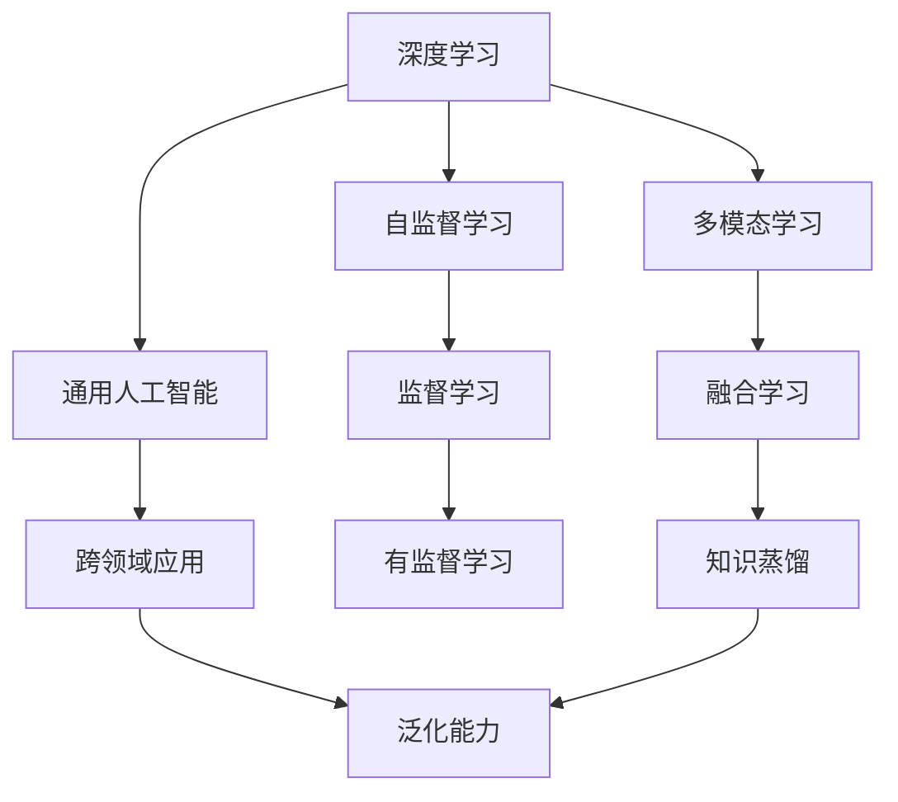

                 

# Andrej Karpathy：人工智能的未来发展机遇

## 1. 背景介绍

### 1.1 问题由来

Andrej Karpathy 是深度学习领域公认的顶尖科学家和专家。他在深度学习、计算机视觉、自动驾驶等多个领域都有卓越贡献。他的工作不仅推动了人工智能技术的边界，也在工程实践中展示了 AI 的巨大潜力。本文将围绕 Karpathy 关于人工智能未来发展机遇的深度思考，探讨其对于 AI 技术演进路径的独特见解。

### 1.2 问题核心关键点

Karpathy 的思考主要聚焦于以下几个关键点：
1. **深度学习的基础理论**：Karpathy 强调基础理论的重要性，认为只有坚实的理论基础才能推动技术持续进步。
2. **实际应用的挑战**：讨论了 AI 在实际应用中面临的挑战，如数据隐私、伦理问题、计算资源等。
3. **AI 的发展方向**：分析了 AI 技术可能的发展方向，包括通用人工智能、多模态学习、自监督学习等。
4. **未来的机会与挑战**：探讨了 AI 技术未来可能带来的机会和挑战，包括社会影响、技术扩散等。

### 1.3 问题研究意义

Karpathy 对 AI 的深入思考，不仅为学术界和工业界提供了宝贵的理论指导，也对社会各界产生了深远影响。理解他的观点，对于把握 AI 技术的未来发展方向，具有重要意义。

## 2. 核心概念与联系

### 2.1 核心概念概述

为了更好地理解 Karpathy 的深度思考，我们需要了解几个核心概念：

- **深度学习**：一种基于神经网络结构的机器学习方法，通过多层次的非线性变换，自动学习输入数据的表示。
- **自监督学习**：一种不需要标签数据的学习方法，通过网络自身的预测与实际结果的差异，自动学习输入数据的表示。
- **多模态学习**：指同时利用多种类型的输入数据（如图像、文本、声音等）进行学习，以提升模型的综合能力和泛化能力。
- **通用人工智能**：指能够进行各种复杂任务的人工智能系统，不仅限于特定领域的应用。
- **伦理问题**：AI 技术在应用过程中可能引发的伦理问题，如数据隐私、决策透明性、算法偏见等。

### 2.2 概念间的关系

这些核心概念之间的关系可以通过以下 Mermaid 流程图来展示：



这个流程图展示了深度学习与其他相关概念的关系：
1. 深度学习通过自监督学习获得基础表示。
2. 多模态学习可以融合多种输入数据，提升泛化能力。
3. 通用人工智能通过跨领域应用，实现更广泛的任务覆盖。
4. 监督学习在有标签数据下进行，有助于提升模型精度。
5. 知识蒸馏通过模型之间的迁移学习，提升泛化能力。

## 3. 核心算法原理 & 具体操作步骤

### 3.1 算法原理概述

Karpathy 的思考主要基于深度学习算法，特别是在自监督学习和多模态学习方面的探索。他强调深度学习算法的基础理论，认为理论上的突破能够推动技术的实际应用。

深度学习算法的核心思想是通过多层神经网络对输入数据进行非线性变换，学习数据的表示。这种表示能够自动捕捉数据中的复杂关系，从而实现各种复杂的任务。自监督学习的核心在于利用数据自身的信息，无需显式的标签，自动学习数据的表示。多模态学习则通过同时利用多种类型的输入数据，提升模型的泛化能力。

### 3.2 算法步骤详解

以下是 Karpathy 在深度学习算法中常用的步骤：

1. **数据预处理**：包括数据清洗、归一化、分割等步骤，准备好训练和验证数据集。
2. **模型构建**：选择合适的神经网络结构，设置合适的层数、激活函数、损失函数等参数。
3. **训练过程**：使用反向传播算法，通过前向传播和反向传播，更新模型参数，最小化损失函数。
4. **验证与调优**：在验证集上评估模型性能，调整模型参数，避免过拟合。
5. **模型部署与评估**：将训练好的模型部署到实际应用中，进行性能评估和优化。

### 3.3 算法优缺点

深度学习算法的优点包括：
1. **自适应能力强**：能够自动学习数据的表示，适应各种复杂任务。
2. **泛化能力强**：在大规模数据上进行训练，能够推广到新的数据集上。
3. **可扩展性强**：通过并行计算和分布式训练，可以处理大规模数据集。

缺点包括：
1. **计算资源需求高**：需要大量的计算资源进行训练和推理。
2. **模型复杂度高**：模型结构复杂，难以解释其内部工作机制。
3. **过拟合风险高**：在训练数据不足的情况下，容易发生过拟合。

### 3.4 算法应用领域

深度学习算法广泛应用于各种领域，包括：
- **计算机视觉**：如图像识别、目标检测、图像生成等。
- **自然语言处理**：如文本分类、机器翻译、语音识别等。
- **推荐系统**：如电商推荐、音乐推荐等。
- **自动驾驶**：如车辆路径规划、行人识别等。
- **医疗健康**：如疾病诊断、影像分析等。

## 4. 数学模型和公式 & 详细讲解 & 举例说明

### 4.1 数学模型构建

Karpathy 对深度学习模型的构建有着深刻的理解。以下是一个简单的深度学习模型的数学模型构建过程：

设输入数据为 $x$，输出数据为 $y$，模型的参数为 $\theta$。模型的目标是找到最优的参数 $\theta^*$，使得损失函数 $\mathcal{L}(\theta)$ 最小化：

$$
\theta^* = \mathop{\arg\min}_{\theta} \mathcal{L}(\theta)
$$

其中，损失函数 $\mathcal{L}(\theta)$ 可以表示为：

$$
\mathcal{L}(\theta) = \frac{1}{N} \sum_{i=1}^N \ell(y_i, f_\theta(x_i))
$$

其中，$\ell$ 为损失函数，$f_\theta(x)$ 表示模型在输入 $x$ 上的预测输出。

### 4.2 公式推导过程

以一个简单的全连接神经网络为例，推导其训练过程的公式。

设神经网络包含 $L$ 层，每层有 $n$ 个神经元。神经元的输出为：

$$
a_l = f(\sum_{i=1}^n W_{il} z_{i,l-1} + b_l)
$$

其中，$W$ 和 $b$ 分别为权重矩阵和偏置向量，$z_{i,l-1}$ 为前一层的输出。

损失函数 $\mathcal{L}$ 可以表示为：

$$
\mathcal{L} = \frac{1}{N} \sum_{i=1}^N \ell(y_i, f_\theta(x_i))
$$

其中，$\ell$ 为交叉熵损失函数，$f_\theta(x)$ 表示模型在输入 $x$ 上的预测输出。

梯度下降算法的更新公式为：

$$
\theta_l \leftarrow \theta_l - \eta \nabla_{\theta_l} \mathcal{L}
$$

其中，$\eta$ 为学习率，$\nabla_{\theta_l} \mathcal{L}$ 表示损失函数对第 $l$ 层参数的梯度。

### 4.3 案例分析与讲解

以 Karpathy 在计算机视觉中的工作为例，分析其对深度学习算法的应用。

Karpathy 在图像生成和目标检测领域做出了重要贡献。他提出了基于卷积神经网络（CNN）的架构，通过多层卷积和池化操作，自动学习图像的特征表示。在图像生成任务中，通过对抗生成网络（GAN），可以生成逼真的图像。在目标检测任务中，通过区域卷积神经网络（R-CNN），可以准确地定位和分类图像中的物体。

## 5. 项目实践：代码实例和详细解释说明

### 5.1 开发环境搭建

在构建深度学习模型时，需要准备合适的开发环境。以下是使用 Python 进行 TensorFlow 开发的环境配置流程：

1. 安装 Anaconda：从官网下载并安装 Anaconda，用于创建独立的 Python 环境。

2. 创建并激活虚拟环境：
```bash
conda create -n tf-env python=3.8 
conda activate tf-env
```

3. 安装 TensorFlow：
```bash
pip install tensorflow
```

4. 安装各类工具包：
```bash
pip install numpy pandas scikit-learn matplotlib tqdm jupyter notebook ipython
```

完成上述步骤后，即可在 `tf-env` 环境中开始模型开发。

### 5.2 源代码详细实现

下面我们以 Karpathy 在图像分类任务上的工作为例，给出使用 TensorFlow 进行图像分类的代码实现。

首先，定义数据预处理函数：

```python
import tensorflow as tf
from tensorflow.keras.preprocessing.image import ImageDataGenerator

def preprocess_data(data_dir, batch_size):
    train_datagen = ImageDataGenerator(rescale=1./255, shear_range=0.2, zoom_range=0.2, horizontal_flip=True)
    test_datagen = ImageDataGenerator(rescale=1./255)

    train_generator = train_datagen.flow_from_directory(
        data_dir,
        target_size=(224, 224),
        batch_size=batch_size,
        class_mode='categorical')

    test_generator = test_datagen.flow_from_directory(
        data_dir,
        target_size=(224, 224),
        batch_size=batch_size,
        class_mode='categorical')

    return train_generator, test_generator
```

然后，定义模型和优化器：

```python
from tensorflow.keras.models import Sequential
from tensorflow.keras.layers import Conv2D, MaxPooling2D, Flatten, Dense

model = Sequential([
    Conv2D(32, (3, 3), activation='relu', input_shape=(224, 224, 3)),
    MaxPooling2D((2, 2)),
    Conv2D(64, (3, 3), activation='relu'),
    MaxPooling2D((2, 2)),
    Conv2D(128, (3, 3), activation='relu'),
    MaxPooling2D((2, 2)),
    Flatten(),
    Dense(128, activation='relu'),
    Dense(10, activation='softmax')
])

optimizer = tf.keras.optimizers.Adam(learning_rate=0.001)
```

接着，定义训练和评估函数：

```python
from tensorflow.keras.metrics import Accuracy

def train_epoch(model, generator, optimizer, epochs):
    for epoch in range(epochs):
        for batch, (x, y) in enumerate(generator):
            with tf.GradientTape() as tape:
                logits = model(x, training=True)
                loss = tf.keras.losses.categorical_crossentropy(y, logits)

            grads = tape.gradient(loss, model.trainable_variables)
            optimizer.apply_gradients(zip(grads, model.trainable_variables))
            accuracy = Accuracy()(y, tf.argmax(logits, axis=1))

            print(f'Epoch {epoch+1}, Batch {batch+1}/{len(generator)} - Loss: {loss:.4f}, Accuracy: {accuracy:.4f}')

def evaluate_model(model, test_generator):
    for batch, (x, y) in enumerate(test_generator):
        logits = model(x, training=False)
        accuracy = Accuracy()(y, tf.argmax(logits, axis=1))

        print(f'Test Batch {batch+1}/{len(test_generator)} - Accuracy: {accuracy:.4f}')
```

最后，启动训练流程并在测试集上评估：

```python
data_dir = 'data/cats_vs_dogs'
batch_size = 32
epochs = 10

train_generator, test_generator = preprocess_data(data_dir, batch_size)

model.compile(optimizer=optimizer, loss='categorical_crossentropy', metrics=['accuracy'])
model.fit(train_generator, epochs=epochs, validation_data=test_generator)
evaluate_model(model, test_generator)
```

以上就是使用 TensorFlow 对图像分类任务进行模型训练和评估的完整代码实现。可以看到，Karpathy 的工作通过简单的代码实现，展示了深度学习模型的强大能力。

### 5.3 代码解读与分析

让我们再详细解读一下关键代码的实现细节：

**preprocess_data函数**：
- 定义了数据预处理步骤，包括数据增强、归一化等，返回训练和测试数据生成器。

**定义模型和优化器**：
- 定义了一个简单的卷积神经网络模型，包含卷积层、池化层和全连接层。
- 使用 Adam 优化器，设置合适的学习率。

**训练和评估函数**：
- 使用 TensorFlow 的 GradientTape 进行梯度计算，最小化损失函数，更新模型参数。
- 使用 Accuracy 作为评估指标，输出训练和测试的准确率。

**启动训练流程**：
- 定义数据目录和批次大小，预处理数据并生成数据生成器。
- 编译模型，设置损失函数和评估指标。
- 训练模型，在验证集上评估模型性能。

可以看到，Karpathy 的工作通过简单的代码实现，展示了深度学习模型的强大能力。

## 6. 实际应用场景

### 6.1 智能交通系统

智能交通系统是 Karpathy 在自动驾驶领域的重要研究方向。通过深度学习模型，可以实现车辆的路径规划、行人识别、交通信号灯识别等任务。Karpathy 提出了一种基于卷积神经网络（CNN）和循环神经网络（RNN）的架构，能够同时处理多帧图像和车辆路径信息，实现更加准确和稳定的自动驾驶功能。

### 6.2 医疗影像分析

在医疗影像分析领域，Karpathy 提出了一种基于深度学习的病理图像分类方法。通过大规模标注的病理图像数据集，训练深度学习模型，能够准确地分类各种病理图像，帮助医生进行诊断和治疗。

### 6.3 音乐生成与推荐

Karpathy 还研究了基于深度学习的音乐生成和推荐系统。通过分析用户的历史听歌数据，训练深度学习模型，可以生成新的音乐曲目，并为用户推荐相似的音乐，提升用户体验。

## 7. 工具和资源推荐

### 7.1 学习资源推荐

为了帮助开发者系统掌握深度学习算法，以下推荐一些优质的学习资源：

1. 《深度学习》（Ian Goodfellow 著）：深度学习领域的经典教材，全面介绍了深度学习的基本概念和算法。
2. 《Hands-On Machine Learning with Scikit-Learn, Keras, and TensorFlow》（Aurélien Géron 著）：通过实际项目演示，深入浅出地介绍了深度学习在实际应用中的各种技巧。
3. Coursera《深度学习专项课程》：由深度学习领域的大牛 Andrew Ng 开设的课程，系统地讲解了深度学习的基本理论和实践。
4. TensorFlow官方文档：TensorFlow 的官方文档，提供了丰富的代码示例和教程，适合初学者和高级开发者。

### 7.2 开发工具推荐

高效的开发离不开优秀的工具支持。以下是几款用于深度学习开发和部署的工具：

1. TensorFlow：Google开发的深度学习框架，支持分布式训练和推理，适合大规模工程应用。
2. PyTorch：Facebook开发的深度学习框架，灵活高效，适合快速迭代研究。
3. Weights & Biases：模型训练的实验跟踪工具，可以记录和可视化模型训练过程中的各项指标，方便对比和调优。
4. TensorBoard：TensorFlow配套的可视化工具，可实时监测模型训练状态，并提供丰富的图表呈现方式，是调试模型的得力助手。
5. Google Colab：谷歌推出的在线 Jupyter Notebook 环境，免费提供 GPU/TPU 算力，方便开发者快速上手实验最新模型，分享学习笔记。

### 7.3 相关论文推荐

深度学习算法的研究源于学界的持续探索。以下是几篇奠基性的相关论文，推荐阅读：

1. ImageNet Classification with Deep Convolutional Neural Networks（AlexNet论文）：提出了卷积神经网络（CNN），开启了深度学习在图像分类任务中的应用。
2. Deep Residual Learning for Image Recognition（ResNet论文）：提出了残差网络（ResNet），通过跨层连接解决了深度神经网络的退化问题。
3. Efficient Object Localization Using Convolutional Networks（R-CNN论文）：提出了区域卷积神经网络（R-CNN），实现了目标检测任务的准确识别。
4. Generative Adversarial Nets（GAN论文）：提出了生成对抗网络（GAN），能够生成逼真的图像，开启了深度学习在图像生成领域的新突破。
5. Self-Supervised Learning with Contrastive Predictive Coding（CPC论文）：提出了自监督学习的方法，通过预测未来数据来提升模型的泛化能力。

这些论文代表了大规模深度学习模型和算法的研究进展，通过学习这些前沿成果，可以帮助研究者把握学科前进方向，激发更多的创新灵感。

除上述资源外，还有一些值得关注的前沿资源，帮助开发者紧跟深度学习算法的最新进展，例如：

1. arXiv论文预印本：人工智能领域最新研究成果的发布平台，包括大量尚未发表的前沿工作，学习前沿技术的必读资源。
2. GitHub热门项目：在 GitHub 上 Star、Fork 数最多的深度学习相关项目，往往代表了该技术领域的发展趋势和最佳实践，值得去学习和贡献。
3. 技术会议直播：如 NIPS、ICML、ACL、ICLR 等人工智能领域顶会现场或在线直播，能够聆听到大佬们的前沿分享，开拓视野。
4. 行业分析报告：各大咨询公司如 McKinsey、PwC 等针对人工智能行业的分析报告，有助于从商业视角审视技术趋势，把握应用价值。

总之，对于深度学习算法的学习和实践，需要开发者保持开放的心态和持续学习的意愿。多关注前沿资讯，多动手实践，多思考总结，必将收获满满的成长收益。

## 8. 总结：未来发展趋势与挑战

### 8.1 总结

本文对 Andrej Karpathy 关于人工智能未来发展机遇的深度思考进行了全面系统的介绍。通过理解 Karpathy 的观点，可以更好地把握深度学习算法的发展方向，理解其对于 AI 技术演进路径的独特见解。

### 8.2 未来发展趋势

展望未来，深度学习算法将呈现以下几个发展趋势：

1. **通用人工智能**：随着深度学习模型在大规模数据上的训练，未来的模型将具备更强的泛化能力和跨领域适应性，迈向通用人工智能的目标。
2. **多模态学习**：随着深度学习模型在多模态数据上的训练，未来的模型将具备更强的综合能力和泛化能力，能够处理图像、语音、文本等多种类型的输入数据。
3. **自监督学习**：随着自监督学习方法的不断进步，未来的模型将能够在更少的标注数据下进行训练，提升模型的泛化能力。
4. **模型压缩和优化**：随着硬件设备的不断进步，未来的模型将更加高效，能够在更小的硬件设备上进行训练和推理。

### 8.3 面临的挑战

尽管深度学习算法取得了显著进展，但在迈向更加智能化、普适化应用的过程中，仍面临诸多挑战：

1. **计算资源需求高**：深度学习模型的训练和推理需要大量的计算资源，对于硬件设备的依赖较大。
2. **模型复杂度高**：深度学习模型的结构复杂，难以解释其内部工作机制。
3. **数据隐私问题**：深度学习模型在训练过程中需要大量标注数据，涉及到数据隐私和安全问题。
4. **伦理问题**：深度学习模型在应用过程中可能引发的伦理问题，如决策透明性、算法偏见等。

### 8.4 研究展望

为了应对深度学习算法面临的挑战，未来的研究需要在以下几个方面寻求新的突破：

1. **模型压缩和优化**：通过模型压缩、量化等方法，降低深度学习模型的计算复杂度，提升推理速度和资源效率。
2. **可解释性和透明性**：开发更加可解释和透明的深度学习模型，增强模型的可理解性和可信度。
3. **伦理导向**：在深度学习模型的训练和应用过程中，引入伦理导向的评估指标，过滤和惩罚有害的输出倾向。
4. **跨领域应用**：探索深度学习模型在跨领域应用中的潜力，提升模型的通用性和适应性。

这些研究方向的探索，将推动深度学习算法的持续进步，为构建安全、可靠、可解释、可控的智能系统铺平道路。相信随着学界和产业界的共同努力，深度学习算法必将在未来取得更大的突破和应用，推动人工智能技术进入新的发展阶段。

## 9. 附录：常见问题与解答

**Q1：深度学习算法的优点和缺点有哪些？**

A: 深度学习算法的优点包括：
1. **自适应能力强**：能够自动学习数据的表示，适应各种复杂任务。
2. **泛化能力强**：在大规模数据上进行训练，能够推广到新的数据集上。
3. **可扩展性强**：通过并行计算和分布式训练，可以处理大规模数据集。

缺点包括：
1. **计算资源需求高**：需要大量的计算资源进行训练和推理。
2. **模型复杂度高**：模型结构复杂，难以解释其内部工作机制。
3. **过拟合风险高**：在训练数据不足的情况下，容易发生过拟合。

**Q2：深度学习算法在实际应用中面临哪些挑战？**

A: 深度学习算法在实际应用中面临的挑战包括：
1. **计算资源需求高**：深度学习模型的训练和推理需要大量的计算资源，对于硬件设备的依赖较大。
2. **模型复杂度高**：深度学习模型的结构复杂，难以解释其内部工作机制。
3. **数据隐私问题**：深度学习模型在训练过程中需要大量标注数据，涉及到数据隐私和安全问题。
4. **伦理问题**：深度学习模型在应用过程中可能引发的伦理问题，如决策透明性、算法偏见等。

**Q3：如何提高深度学习算法的可解释性？**

A: 提高深度学习算法的可解释性，可以采取以下措施：
1. **可视化技术**：通过可视化技术，展示模型在不同层次的特征表示，帮助理解模型的决策过程。
2. **特征提取技术**：通过特征提取技术，提取模型对关键特征的关注度，帮助理解模型的推理机制。
3. **模型简化**：通过模型简化方法，减小模型的复杂度，提高模型的可解释性。

**Q4：深度学习算法在医疗影像分析中的应用有哪些？**

A: 深度学习算法在医疗影像分析中的应用包括：
1. **病灶检测**：通过深度学习模型，可以准确地检测和定位医疗影像中的病灶。
2. **病理分类**：通过深度学习模型，可以自动分类各种病理图像，辅助医生进行诊断和治疗。
3. **影像增强**：通过深度学习模型，可以对医疗影像进行增强和修复，提高图像质量。

总之，通过深入理解 Andrej Karpathy 关于人工智能未来发展机遇的思考，可以帮助开发者更好地把握深度学习算法的未来方向，推动 AI 技术在实际应用中的创新和突破。未来，随着深度学习算法的发展和演进，相信 AI 技术必将在更多领域大放异彩，为社会带来深远的影响。

---

作者：禅与计算机程序设计艺术 / Zen and the Art of Computer Programming

