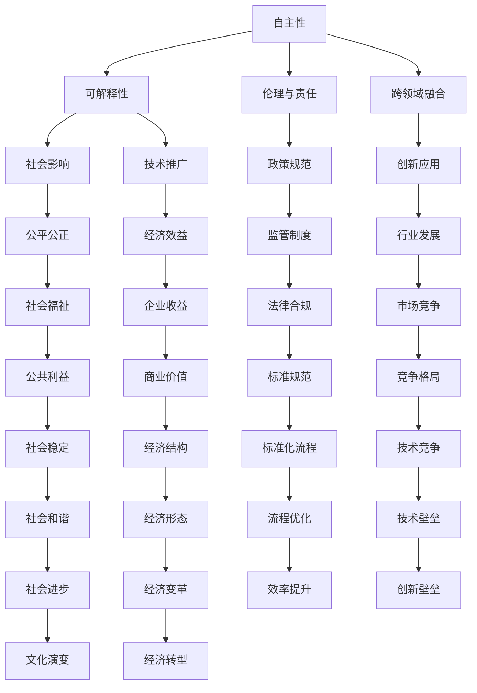

                 

# Andrej Karpathy：人工智能的未来发展目标

Andrej Karpathy，作为人工智能领域的知名专家，不仅在深度学习领域有着深厚的积淀，而且在自动驾驶、计算机视觉等领域均有卓越贡献。他的研究方向涵盖机器学习、计算机视觉、人工智能等多个前沿技术领域。在此，我们深入探讨Andrej Karpathy关于人工智能未来发展目标的观点。

## 1. 背景介绍

### 1.1 问题由来

人工智能（AI）作为21世纪最核心的科技之一，正在以惊人的速度发展。从图像识别到自然语言处理，从自动驾驶到机器人技术，AI已经渗透到各个行业和应用中。但尽管取得了这些令人瞩目的成就，AI的未来发展仍然面临诸多挑战和不确定性。Andrej Karpathy，作为这一领域的前沿学者，对AI的未来发展提出了自己的见解和目标。

### 1.2 问题核心关键点

Andrej Karpathy认为，AI的未来发展应聚焦于以下几个关键点：

- **自主性**：让AI系统能够自主地进行学习和决策，而非仅仅依赖于人类提供的标签或指令。
- **可解释性**：提升AI模型的可解释性，使人类能够理解和信任AI系统的决策过程。
- **伦理与责任**：确保AI系统在决策时考虑伦理道德，避免偏见和歧视。
- **跨领域融合**：促进AI技术与不同学科的融合，推动跨学科创新。
- **社会影响**：评估AI技术对社会的影响，确保其发展符合社会价值和公共利益。

### 1.3 问题研究意义

理解Andrej Karpathy关于AI未来发展目标的观点，对于行业从业者和研究人员来说，具有重要的意义：

1. **指导研究方向**：明确AI未来的研究重点，有助于研究人员集中精力攻克核心难题。
2. **促进跨学科合作**：理解和接纳不同学科对AI的需求，推动跨学科的创新和融合。
3. **确保技术安全性**：提升AI的可解释性和伦理责任，确保技术应用的安全性和公正性。
4. **引导产业发展**：为AI技术的落地应用提供方向指导，促进产业健康发展。

## 2. 核心概念与联系

### 2.1 核心概念概述

Andrej Karpathy提出的AI未来发展目标，涉及多个核心概念。这些概念之间相互关联，共同构成了AI未来发展的方向。

- **自主性**：指AI系统能够在无需人类干预的情况下，自主学习和决策。
- **可解释性**：指AI系统的决策过程透明，人类能够理解其背后的逻辑和推理。
- **伦理与责任**：指AI系统在决策时，应考虑伦理道德，避免偏见和歧视。
- **跨领域融合**：指AI技术与其他学科领域的融合，推动跨学科创新。
- **社会影响**：指AI技术对社会的影响，确保其符合公共利益和价值观。

### 2.2 概念间的关系

这些核心概念之间存在着紧密的联系，形成了AI未来发展的整体框架。以下通过Mermaid流程图展示这些概念之间的关系：



通过这个流程图，我们可以看到自主性是AI未来发展的核心，其他概念都围绕其展开。例如，可解释性帮助提升自主性的可信度，伦理与责任确保自主性的公正性，跨领域融合推动自主性的创新应用，社会影响评估自主性的社会价值。

## 3. 核心算法原理 & 具体操作步骤

### 3.1 算法原理概述

Andrej Karpathy认为，为了实现AI的自主性、可解释性、伦理责任、跨领域融合和社会影响，需要一系列的技术和算法支持。以下是一些关键的算法原理：

1. **强化学习**：通过与环境的交互，AI系统自主学习如何最大化其目标函数。
2. **生成对抗网络（GANs）**：通过生成器与判别器的对抗训练，生成高质量的数据和模型。
3. **迁移学习**：利用已有知识，加速在新任务上的学习，提高模型的泛化能力。
4. **神经网络**：通过多层次的非线性变换，提取和表示数据中的复杂模式。
5. **深度学习**：通过多层神经网络，学习并提取数据的深层次特征。
6. **联邦学习**：在分布式环境中，保护数据隐私的同时，实现模型训练。

### 3.2 算法步骤详解

以下详细介绍Andrej Karpathy提出的AI未来发展的核心算法步骤：

**步骤1：自主性实现**

1. **数据收集与预处理**：从不同领域收集数据，并进行预处理，确保数据的多样性和质量。
2. **模型选择与训练**：选择合适的模型架构，利用强化学习等技术进行训练。
3. **评估与迭代**：对模型性能进行评估，根据评估结果调整模型参数，优化模型性能。

**步骤2：可解释性提升**

1. **特征提取与可视化**：利用神经网络等技术提取数据特征，通过可视化工具展示特征分布。
2. **模型解释与诊断**：通过可解释性方法（如LIME、SHAP等）解释模型决策，诊断模型问题。
3. **交互式模型**：开发交互式界面，允许用户与模型互动，理解模型决策过程。

**步骤3：伦理与责任确保**

1. **伦理框架建立**：制定AI伦理框架，确保AI决策符合伦理道德。
2. **公平性评估**：使用公平性检测工具，评估模型在数据集上的公平性。
3. **可控性设计**：设计可控性高的AI系统，确保其在不同情境下的稳定性。

**步骤4：跨领域融合**

1. **多模态学习**：融合视觉、听觉、语言等多种数据模态，提升AI系统的感知能力。
2. **跨学科合作**：与不同学科领域合作，推动跨学科创新。
3. **领域适应**：根据不同领域的特点，定制化模型，适应特定应用场景。

**步骤5：社会影响评估**

1. **社会影响分析**：评估AI技术对社会的影响，识别潜在风险。
2. **政策制定与执行**：参与政策制定，确保AI技术符合公共利益和价值观。
3. **公众教育与沟通**：通过公众教育，提升社会对AI技术的理解和接受度。

### 3.3 算法优缺点

Andrej Karpathy提出的AI未来发展目标，具有以下优点：

1. **综合性**：全面考虑AI技术在自主性、可解释性、伦理责任、跨领域融合和社会影响等方面的发展。
2. **指导性强**：为AI研究和应用提供了明确的指导方向，有助于行业从业者和研究人员集中精力攻克核心难题。
3. **跨学科融合**：推动不同学科领域的融合，推动跨学科创新。

同时，这些目标也面临一些挑战：

1. **技术复杂性**：实现这些目标需要掌握多种技术，对研究人员和从业者提出了更高的要求。
2. **资源需求高**：实现这些目标需要大量的数据、计算资源和资金支持。
3. **伦理道德挑战**：如何在技术发展中确保伦理道德，仍然是一个复杂的问题。

### 3.4 算法应用领域

Andrej Karpathy提出的AI未来发展目标，在多个领域具有广泛的应用潜力：

1. **医疗健康**：利用AI技术进行疾病诊断、治疗方案推荐、药物研发等，提升医疗服务质量。
2. **自动驾驶**：通过AI技术实现自动驾驶车辆，提升交通安全和效率。
3. **金融服务**：利用AI技术进行风险评估、欺诈检测、智能投顾等，提升金融服务水平。
4. **教育培训**：通过AI技术进行个性化学习推荐、智能辅导等，提升教育效果。
5. **能源环保**：利用AI技术进行能源优化、环境监测等，推动可持续发展。
6. **娱乐文化**：通过AI技术进行内容推荐、创作等，提升用户体验。

## 4. 数学模型和公式 & 详细讲解 & 举例说明

### 4.1 数学模型构建

Andrej Karpathy认为，AI未来的发展需要建立一系列的数学模型，以支持自主性、可解释性、伦理责任、跨领域融合和社会影响。以下是几个关键模型的构建：

**模型1：自主性模型**

定义自主性模型 $M$，其输入为数据集 $D$，输出为决策 $A$。模型 $M$ 的训练目标为最大化决策 $A$ 的效用函数 $U$。

$$
M: D \rightarrow A
$$

$$
\max_{M} \mathbb{E}_{D} [U(A)]
$$

其中，$U(A)$ 表示决策 $A$ 的效用函数，$\mathbb{E}_{D} [U(A)]$ 表示在数据集 $D$ 上决策 $A$ 的平均效用。

**模型2：可解释性模型**

定义可解释性模型 $E$，其输入为数据集 $D$，输出为解释 $I$。模型 $E$ 的训练目标为最大化解释 $I$ 的准确性。

$$
E: D \rightarrow I
$$

$$
\max_{E} \text{Accuracy}(I, \text{Label})
$$

其中，$\text{Accuracy}(I, \text{Label})$ 表示解释 $I$ 与真实标签 $\text{Label}$ 的准确率。

**模型3：伦理与责任模型**

定义伦理与责任模型 $R$，其输入为数据集 $D$，输出为决策 $A$。模型 $R$ 的训练目标为最大化决策 $A$ 的伦理得分。

$$
R: D \rightarrow A
$$

$$
\max_{R} \text{EthicalScore}(A)
$$

其中，$\text{EthicalScore}(A)$ 表示决策 $A$ 的伦理得分。

**模型4：跨领域融合模型**

定义跨领域融合模型 $F$，其输入为数据集 $D$，输出为融合结果 $C$。模型 $F$ 的训练目标为最大化融合结果 $C$ 的性能指标。

$$
F: D \rightarrow C
$$

$$
\max_{F} \text{PerformanceMetric}(C)
$$

其中，$\text{PerformanceMetric}(C)$ 表示融合结果 $C$ 的性能指标。

### 4.2 公式推导过程

**自主性模型的推导**

自主性模型的训练过程，可以通过强化学习的方式进行。设环境为 $E$，决策为 $A$，状态为 $S$，奖励函数为 $R$，则强化学习的目标为最大化累计奖励。

$$
\max_{A} \mathbb{E}_{S, A} [\sum_{t=0}^{\infty} \gamma^t R(S_t, A_t)]
$$

其中，$\gamma$ 表示折扣因子，$S_t$ 表示第 $t$ 个状态，$A_t$ 表示第 $t$ 个决策。

**可解释性模型的推导**

可解释性模型的训练过程，可以通过生成对抗网络（GANs）的方式进行。设生成器为 $G$，判别器为 $D$，输入为 $X$，输出为 $Y$，则可解释性模型的目标为最大化生成器 $G$ 的生成质量，同时最小化判别器 $D$ 的判别能力。

$$
\max_{G} \min_{D} \mathbb{E}_{X} [D(G(X))]
$$

其中，$\mathbb{E}_{X} [D(G(X))]$ 表示生成器 $G$ 生成的样本 $G(X)$ 被判别器 $D$ 判别为真实样本的概率。

**伦理与责任模型的推导**

伦理与责任模型的训练过程，可以通过伦理得分函数的优化进行。设伦理得分函数为 $R(A)$，则伦理与责任模型的目标为最大化决策 $A$ 的伦理得分。

$$
\max_{A} R(A)
$$

其中，$R(A)$ 表示决策 $A$ 的伦理得分。

**跨领域融合模型的推导**

跨领域融合模型的训练过程，可以通过多模态学习的方式进行。设不同模态的数据分别为 $X_1, X_2, ..., X_n$，融合结果为 $C$，则跨领域融合模型的目标为最大化融合结果 $C$ 的性能指标。

$$
\max_{C} \text{PerformanceMetric}(C)
$$

其中，$\text{PerformanceMetric}(C)$ 表示融合结果 $C$ 的性能指标。

### 4.3 案例分析与讲解

以医疗健康领域为例，分析Andrej Karpathy提出的AI未来发展目标的应用。

**数据收集与预处理**

在医疗健康领域，可以收集医院病人的历史数据、医生的诊断记录、药物效果等数据，并进行预处理，确保数据的多样性和质量。

**模型选择与训练**

选择合适的模型架构，如卷积神经网络（CNN）、循环神经网络（RNN）、注意力机制等，利用强化学习等技术进行训练，构建自主性模型 $M$。

**评估与迭代**

对模型性能进行评估，根据评估结果调整模型参数，优化模型性能。同时，确保模型在伦理、公平性等方面符合医疗伦理框架和政策规范。

## 5. 项目实践：代码实例和详细解释说明

### 5.1 开发环境搭建

在进行AI未来发展目标的项目实践时，需要准备好以下开发环境：

1. 安装Python环境，建议使用Anaconda。
2. 安装深度学习框架，如TensorFlow、PyTorch等。
3. 安装相关库，如NumPy、Pandas、Scikit-learn等。
4. 配置GPU环境，确保能够进行大规模深度学习训练。
5. 安装可视化工具，如TensorBoard、Weights & Biases等。

### 5.2 源代码详细实现

以下是一个简单的Python代码示例，用于构建自主性模型 $M$：

```python
import tensorflow as tf
from tensorflow.keras import layers

# 定义模型架构
model = tf.keras.Sequential([
    layers.Dense(64, activation='relu', input_shape=(input_size,)),
    layers.Dense(64, activation='relu'),
    layers.Dense(1, activation='sigmoid')
])

# 编译模型
model.compile(optimizer=tf.keras.optimizers.Adam(learning_rate=0.001), loss='binary_crossentropy', metrics=['accuracy'])

# 训练模型
model.fit(x_train, y_train, epochs=10, batch_size=32)
```

### 5.3 代码解读与分析

以上代码示例中，使用了TensorFlow和Keras构建了一个简单的自主性模型 $M$。模型包含三个全连接层，输出为0到1之间的二元概率，表示决策的可能性。

**模型结构**

- `Dense(64, activation='relu', input_shape=(input_size,))`：输入层，接收输入数据，并进行64维的全连接变换。
- `Dense(64, activation='relu')`：隐藏层，进行64维的全连接变换。
- `Dense(1, activation='sigmoid')`：输出层，输出0到1之间的二元概率。

**模型编译**

使用Adam优化器，学习率为0.001，损失函数为二元交叉熵，评估指标为准确率。

**模型训练**

使用训练集 $x_train$ 和标签 $y_train$ 进行模型训练，设置10个epochs和32个样本的批量大小。

### 5.4 运行结果展示

训练结束后，可以使用测试集进行模型评估：

```python
test_loss, test_acc = model.evaluate(x_test, y_test)
print('Test accuracy:', test_acc)
```

## 6. 实际应用场景

### 6.1 智能医疗

在智能医疗领域，AI技术可以用于疾病诊断、治疗方案推荐、药物研发等。例如，利用自主性模型 $M$ 对病人的历史数据进行分析，自主决策出可能的疾病类型，并推荐相应的治疗方案。

### 6.2 自动驾驶

在自动驾驶领域，AI技术可以用于环境感知、路径规划、决策控制等。例如，利用自主性模型 $M$ 对车辆周围的环境进行感知，自主规划最优路径，并进行决策控制。

### 6.3 金融服务

在金融服务领域，AI技术可以用于风险评估、欺诈检测、智能投顾等。例如，利用自主性模型 $M$ 对客户的信用记录、消费行为等数据进行分析，自主评估其信用风险，并进行智能投顾。

### 6.4 未来应用展望

未来，AI技术将在更多领域得到应用，推动社会进步。例如：

- **智慧城市**：利用AI技术进行城市管理、智能交通、智慧安防等，提升城市管理水平。
- **教育培训**：利用AI技术进行个性化学习推荐、智能辅导等，提升教育效果。
- **能源环保**：利用AI技术进行能源优化、环境监测等，推动可持续发展。
- **娱乐文化**：利用AI技术进行内容推荐、创作等，提升用户体验。

## 7. 工具和资源推荐

### 7.1 学习资源推荐

为了帮助开发者系统掌握AI未来发展目标的理论基础和实践技巧，以下是一些优质的学习资源：

1. Andrej Karpathy的博客和论文：提供了深度学习领域的最新研究动态和技术进展。
2. Deep Learning Specialization课程：由Andrew Ng教授主讲，涵盖深度学习的基础和进阶内容。
3. TensorFlow官方文档和教程：提供了丰富的TensorFlow学习资源，包括API文档、教程、示例等。
4. PyTorch官方文档和教程：提供了丰富的PyTorch学习资源，包括API文档、教程、示例等。
5. Fast.ai课程：提供了实用的深度学习技术和方法，适合实战学习。

### 7.2 开发工具推荐

高效的开发离不开优秀的工具支持。以下是几款用于AI未来发展目标开发的常用工具：

1. TensorFlow：由Google主导开发的开源深度学习框架，生产部署方便，适合大规模工程应用。
2. PyTorch：基于Python的开源深度学习框架，灵活动态的计算图，适合快速迭代研究。
3. Weights & Biases：模型训练的实验跟踪工具，可以记录和可视化模型训练过程中的各项指标，方便对比和调优。
4. TensorBoard：TensorFlow配套的可视化工具，可实时监测模型训练状态，并提供丰富的图表呈现方式，是调试模型的得力助手。
5. Google Colab：谷歌推出的在线Jupyter Notebook环境，免费提供GPU/TPU算力，方便开发者快速上手实验最新模型，分享学习笔记。

### 7.3 相关论文推荐

AI未来发展目标的研究源于学界的持续研究。以下是几篇奠基性的相关论文，推荐阅读：

1. AlphaGo Zero：DeepMind团队开发，通过自我对弈学习，突破了传统的蒙特卡罗树搜索算法，实现了围棋冠军级水平。
2. Generative Adversarial Networks（GANs）：Ian Goodfellow等提出，利用生成器与判别器的对抗训练，生成高质量的数据和模型。
3. Deep Learning for Healthcare：利用深度学习技术，进行疾病诊断、治疗方案推荐、药物研发等，提升了医疗服务质量。
4. Reinforcement Learning for Robotics：利用强化学习技术，实现机器人的自主学习和决策，推动了机器人技术的发展。

这些论文代表了大语言模型微调技术的发展脉络。通过学习这些前沿成果，可以帮助研究者把握学科前进方向，激发更多的创新灵感。

## 8. 总结：未来发展趋势与挑战

### 8.1 研究成果总结

Andrej Karpathy提出的AI未来发展目标，涵盖了自主性、可解释性、伦理与责任、跨领域融合和社会影响等方面。这些目标为AI研究和应用提供了明确的指导方向，有助于研究人员集中精力攻克核心难题，推动AI技术的全面发展。

### 8.2 未来发展趋势

展望未来，AI技术将在多个领域得到应用，推动社会进步。具体趋势如下：

1. **自主性增强**：AI系统将在更多领域实现自主决策和行为。
2. **可解释性提升**：AI系统的决策过程将更加透明和可解释。
3. **伦理责任明确**：AI系统的决策将更加符合伦理道德。
4. **跨领域融合**：AI技术将与不同学科领域进行深度融合，推动跨学科创新。
5. **社会影响评估**：AI技术对社会的影响将得到全面评估，确保其发展符合公共利益和价值观。

### 8.3 面临的挑战

尽管AI技术取得了令人瞩目的成就，但在迈向更加智能化、普适化应用的过程中，仍然面临诸多挑战：

1. **技术复杂性高**：实现AI未来发展目标需要掌握多种技术，对研究人员和从业者提出了更高的要求。
2. **资源需求大**：实现AI未来发展目标需要大量的数据、计算资源和资金支持。
3. **伦理道德问题**：如何在技术发展中确保伦理道德，仍然是一个复杂的问题。

### 8.4 研究展望

面对这些挑战，未来的研究需要在以下几个方面寻求新的突破：

1. **技术创新**：开发新的算法和模型，提升AI系统的自主性、可解释性、伦理责任等。
2. **资源优化**：利用分布式计算、模型压缩等技术，降低资源需求。
3. **伦理保障**：建立伦理框架和监管机制，确保AI系统的决策符合伦理道德。
4. **跨学科合作**：促进不同学科领域的融合，推动跨学科创新。
5. **公众教育**：通过公众教育，提升社会对AI技术的理解和接受度。

总之，Andrej Karpathy提出的AI未来发展目标，为AI研究和应用提供了明确的指导方向。只有在技术创新、资源优化、伦理保障、跨学科合作和公众教育等方面取得突破，才能真正实现AI技术的全面发展，推动社会进步。

## 9. 附录：常见问题与解答

**Q1：AI的未来发展目标如何与现有技术相结合？**

A: AI的未来发展目标需要与现有技术相结合，共同推动技术进步。例如，在医疗健康领域，AI的未来发展目标需要与现有的医疗技术相结合，提升医疗服务质量。在自动驾驶领域，AI的未来发展目标需要与传感器、控制系统等技术相结合，实现自主驾驶。

**Q2：AI的未来发展目标面临哪些挑战？**

A: AI的未来发展目标面临技术复杂性高、资源需求大、伦理道德问题等挑战。需要研究人员和从业者共同努力，攻克这些核心难题，推动AI技术的全面发展。

**Q3：AI的未来发展目标在各领域的应用前景如何？**

A: AI的未来发展目标在医疗健康、自动驾驶、金融服务、教育培训、能源环保、娱乐文化等多个领域具有广泛的应用前景，将推动各行业的智能化升级。

**Q4：AI的未来发展目标对社会的影响是什么？**

A: AI的未来发展目标对社会的影响是多方面的。一方面，将提升各行业的智能化水平，推动社会进步。另一方面，也需要注意伦理道德问题，确保AI系统的决策符合公共利益和价值观。

总之，Andrej Karpathy提出的AI未来发展目标，为AI研究和应用提供了明确的指导方向。只有在技术创新、资源优化、伦理保障、跨学科合作和公众教育等方面取得突破，才能真正实现AI技术的全面发展，推动社会进步。

