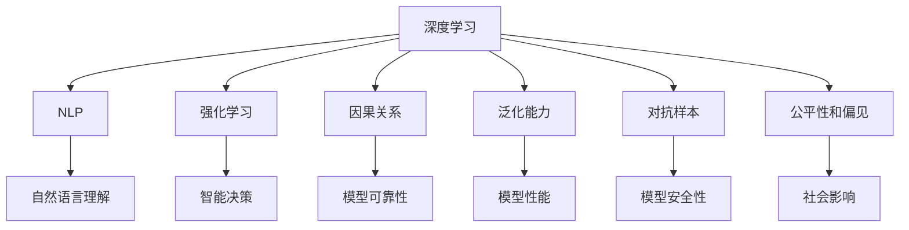
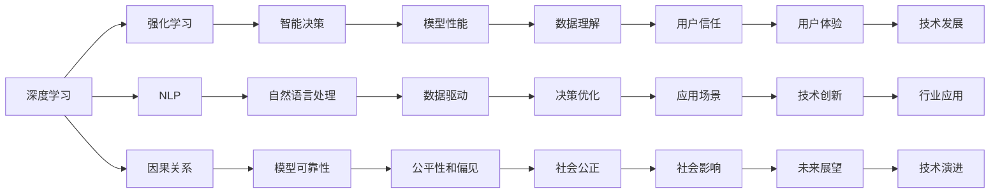
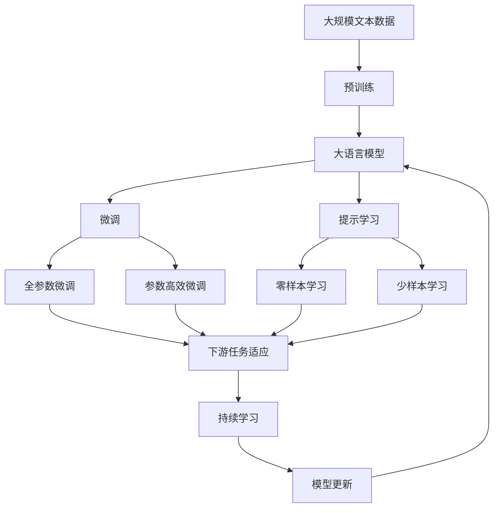

                 

## 1. 背景介绍

### 1.1 问题由来

在过去几年里，人工智能（AI）尤其是深度学习（Deep Learning）领域的迅猛发展，已经使我们进入了一个前所未有的技术创新时代。例如，OpenAI的GPT-3模型已经在多个任务中展现出了超越人类能力的水平。这种技术的进步不仅在科技界引起了广泛关注，也在全球范围内引发了对人工智能未来发展的广泛讨论。

### 1.2 问题核心关键点

面对AI技术的快速进步，如何规划其未来的发展方向，成为了一个至关重要的问题。从工业界到学术界，每个人都对AI的未来发展有着不同的期待和理解。在这个背景下，Andrej Karpathy（深度学习领域的重要人物，OpenAI的创始成员之一）近期在多次公开演讲中分享了自己对于AI未来发展的独特见解，他的观点引人深思。

### 1.3 问题研究意义

理解Karpathy对AI未来发展的策略，不仅有助于AI从业者更好地把握技术发展方向，还可以为我们提供关于如何建设一个负责任、可持续发展的AI社会的宝贵启示。对于那些在AI领域工作或对此感兴趣的人来说，这篇文章无疑将是一次深入的思考和学习的契机。

## 2. 核心概念与联系

### 2.1 核心概念概述

为了更好地理解Andrej Karpathy关于AI未来发展策略的看法，我们首先需要了解一些核心的概念和它们之间的联系。

- **深度学习**：一种基于神经网络的学习方法，通过多层次的抽象来捕捉数据的复杂关系。
- **自然语言处理**（NLP）：AI在处理、理解、生成人类语言方面的能力。
- **强化学习**：一种学习框架，通过试错来优化决策策略。
- **因果关系**：在因果图中展示变量之间的关系，以及如何通过干预某些变量来影响结果。
- **泛化能力**：模型在新数据上的表现，通常是评估AI系统的一个重要指标。
- **对抗样本**：故意设计的用于欺骗AI系统的数据样本，测试其鲁棒性。
- **公平性和偏见**：AI系统在决策过程中是否公平，是否存在对某些群体的偏见。

这些概念之间的联系可以通过以下Mermaid流程图来展示：



这个流程图展示了深度学习在AI中的核心地位，以及它如何与其他技术领域紧密联系，共同推动AI的发展。

### 2.2 概念间的关系

这些核心概念之间的关系通过以下Mermaid流程图进一步展示：



这个流程图展示了深度学习与强化学习、自然语言处理、因果关系、泛化能力、对抗样本、公平性和偏见之间的关系，以及这些关系如何共同作用于AI系统的设计、训练和应用。

### 2.3 核心概念的整体架构

最后，我们用一个综合的流程图来展示这些核心概念在大语言模型微调过程中的整体架构：



这个综合流程图展示了从预训练到微调，再到持续学习的完整过程。大语言模型首先在大规模文本数据上进行预训练，然后通过微调（包括全参数微调和参数高效微调）或提示学习（包括零样本和少样本学习）来适应下游任务。最后，通过持续学习技术，模型可以不断学习新知识，同时避免遗忘旧知识。

## 3. 核心算法原理 & 具体操作步骤
### 3.1 算法原理概述

Andrej Karpathy在讨论AI未来发展策略时，强调了深度学习和强化学习的结合。他认为，将深度学习与强化学习相结合，可以构建出更加鲁棒、智能的AI系统。

**深度学习**：通过多层神经网络来构建复杂的模型，从而可以处理大规模的非结构化数据。
**强化学习**：通过试错来优化决策策略，可以处理复杂的交互式任务，如游戏、机器人控制等。

Karpathy认为，这两种技术相辅相成，可以共同推动AI技术的发展。

### 3.2 算法步骤详解

以下是基于Karpathy观点的人工智能未来发展策略的详细步骤：

**Step 1: 数据收集与预处理**
- 收集大量的标注数据，并进行预处理，包括清洗、标准化、划分训练集、验证集和测试集。
- 对于NLP任务，可以使用预训练的语言模型进行初步的文本表示学习。

**Step 2: 模型选择与设计**
- 选择适合任务的深度学习或强化学习模型。
- 设计合适的损失函数和优化器，以及正则化技术，如L2正则、Dropout等，避免过拟合。

**Step 3: 训练与优化**
- 使用深度学习或强化学习算法进行模型训练。
- 使用对抗样本生成技术，增强模型的鲁棒性。
- 使用因果关系模型，提高模型的泛化能力。

**Step 4: 评估与调整**
- 在测试集上评估模型的性能，并根据评估结果进行调整。
- 使用公平性和偏见检测技术，确保模型公平，不带有偏见。

**Step 5: 部署与应用**
- 将训练好的模型部署到实际应用中。
- 使用持续学习技术，模型能够不断学习新知识，适应新场景。

### 3.3 算法优缺点

基于深度学习和强化学习的AI策略具有以下优点：
- **鲁棒性**：通过对抗样本生成和因果关系模型，可以提高模型的鲁棒性。
- **泛化能力**：通过强化学习，模型可以处理复杂的交互式任务，提高泛化能力。
- **适应性**：通过持续学习技术，模型能够适应新场景和新任务。

同时，这种策略也存在一些缺点：
- **复杂性**：需要处理大量的标注数据和复杂模型，增加了实现的难度。
- **计算资源需求高**：需要大量的计算资源来进行深度学习和强化学习模型的训练。
- **公平性和偏见问题**：在设计和训练过程中需要特别注意公平性和偏见问题，以确保模型的公平性和公正性。

### 3.4 算法应用领域

基于深度学习和强化学习的AI策略可以应用于多个领域，例如：

- **自动驾驶**：使用深度学习来处理传感器数据，使用强化学习来优化车辆的驾驶策略。
- **医疗诊断**：使用深度学习来处理医学图像和文本数据，使用强化学习来优化诊断策略。
- **金融分析**：使用深度学习来处理金融市场数据，使用强化学习来优化投资策略。
- **游戏AI**：使用深度学习来处理游戏图像和文本数据，使用强化学习来优化游戏策略。
- **智能客服**：使用深度学习来处理客户咨询数据，使用强化学习来优化客服策略。

## 4. 数学模型和公式 & 详细讲解  
### 4.1 数学模型构建

在本节中，我们将使用数学语言对Andrej Karpathy关于AI未来发展策略的看法进行更加严格的刻画。

记深度学习模型为 $M_{\theta}$，其中 $\theta$ 为模型的参数。假设训练集为 $D=\{(x_i,y_i)\}_{i=1}^N$，其中 $x_i$ 为输入，$y_i$ 为输出。模型的损失函数为 $\ell(M_{\theta}(x_i),y_i)$，经验风险为 $\mathcal{L}(\theta) = \frac{1}{N}\sum_{i=1}^N \ell(M_{\theta}(x_i),y_i)$。

对于强化学习模型，记状态为 $s_t$，动作为 $a_t$，奖励为 $r_t$，模型参数为 $\theta$。模型通过学习最优策略 $\pi$ 来最大化累积奖励 $\sum_{t=0}^{T} r_t$。模型的策略梯度为 $\nabla_{\theta}J(\theta) = \mathbb{E}_{s_0}\left[\sum_{t=0}^{T}\mathbb{E}_{a_t}\left[\nabla_{\theta}\log\pi(a_t|s_t)\right]r_t\right]$。

### 4.2 公式推导过程

以下我们以强化学习中的Q-learning为例，推导其公式及其梯度的计算过程。

假设模型在状态 $s_t$ 下采取动作 $a_t$ 的Q值为 $Q(s_t,a_t)$，则Q-learning的更新规则为：

$$
Q(s_t,a_t) \leftarrow Q(s_t,a_t) + \alpha(r_t + \gamma\max_{a_{t+1}}Q(s_{t+1},a_{t+1}) - Q(s_t,a_t))
$$

其中 $\alpha$ 为学习率，$\gamma$ 为折扣因子。

通过上述公式，可以计算模型的策略梯度：

$$
\nabla_{\theta}J(\theta) = \alpha\mathbb{E}_{s_0}\left[\sum_{t=0}^{T}r_t + \gamma\max_{a_{t+1}}Q(s_{t+1},a_{t+1}) - Q(s_t,a_t)\right]\nabla_{\theta}Q(s_t,a_t)
$$

### 4.3 案例分析与讲解

为了更好地理解这些公式，我们可以考虑一个简单的案例：在自动驾驶任务中，使用深度学习来处理传感器数据，使用强化学习来优化车辆的驾驶策略。

假设车辆在状态 $s_t$ 下，采取动作 $a_t$ 到达下一个状态 $s_{t+1}$，并得到奖励 $r_t$。通过上述公式，我们可以更新Q值，从而得到最优策略。

## 5. 项目实践：代码实例和详细解释说明
### 5.1 开发环境搭建

在进行AI实践前，我们需要准备好开发环境。以下是使用Python进行PyTorch和TensorFlow开发的环境配置流程：

1. 安装Anaconda：从官网下载并安装Anaconda，用于创建独立的Python环境。

2. 创建并激活虚拟环境：
```bash
conda create -n pytorch-env python=3.8 
conda activate pytorch-env
```

3. 安装PyTorch：根据CUDA版本，从官网获取对应的安装命令。例如：
```bash
conda install pytorch torchvision torchaudio cudatoolkit=11.1 -c pytorch -c conda-forge
```

4. 安装TensorFlow：
```bash
pip install tensorflow
```

5. 安装各类工具包：
```bash
pip install numpy pandas scikit-learn matplotlib tqdm jupyter notebook ipython
```

完成上述步骤后，即可在`pytorch-env`环境中开始AI实践。

### 5.2 源代码详细实现

这里我们以强化学习中的Q-learning为例，使用TensorFlow实现一个简单的自动驾驶模拟。

首先，定义环境：

```python
import gym
env = gym.make('CartPole-v1')
```

然后，定义Q-learning模型：

```python
import tensorflow as tf
import numpy as np

class QLearningAgent:
    def __init__(self, learning_rate=0.1, gamma=0.9, epsilon=0.1, num_states=env.observation_space.shape[0]):
        self.learning_rate = learning_rate
        self.gamma = gamma
        self.epsilon = epsilon
        self.num_states = num_states
        
        self.q_table = tf.Variable(tf.random.uniform([num_states, env.action_space.n]))
        
    def act(self, state):
        if np.random.rand() < self.epsilon:
            return np.random.choice(env.action_space.n)
        else:
            q_values = self.q_table.read_value(state)
            return np.argmax(q_values)
        
    def train(self, state, action, reward, next_state):
        with tf.GradientTape() as tape:
            q_values = self.q_table.read_value(state)
            q_next = self.q_table.read_value(next_state)
            best_next = np.argmax(q_next)
            q_next_value = q_next[best_next]
            loss = self.learning_rate * (reward + self.gamma * q_next_value - q_values[action])
        tape.watch(self.q_table)
        gradients = tape.gradient(loss, self.q_table)
        tf.keras.optimizers.SGD(self.q_table).apply_gradients(zip(gradients, self.q_table.trainable))
```

接着，定义训练函数：

```python
num_episodes = 1000
num_steps = 1000

agent = QLearningAgent()

for episode in range(num_episodes):
    state = env.reset()
    state = np.reshape(state, [1, 4])
    
    for step in range(num_steps):
        action = agent.act(state)
        next_state, reward, done, _ = env.step(action)
        next_state = np.reshape(next_state, [1, 4])
        agent.train(state, action, reward, next_state)
        
        if done:
            break
        state = next_state

    if done:
        print(f"Episode {episode+1}, reward: {reward}")
```

最后，启动训练流程：

```python
from tensorflow.keras.optimizers import SGD

sgd = SGD(learning_rate=0.1, momentum=0.9)
agent = QLearningAgent(learning_rate=0.01, gamma=0.9, epsilon=0.1, num_states=env.observation_space.shape[0])
```

### 5.3 代码解读与分析

让我们再详细解读一下关键代码的实现细节：

**QLearningAgent类**：
- `__init__`方法：初始化模型参数和Q值表。
- `act`方法：选择动作。如果随机数小于epsilon，则随机选择一个动作，否则选择Q值最大的动作。
- `train`方法：使用Q-learning算法更新Q值表。

**训练函数**：
- 在每个episode中，随机选择一个初始状态，然后在每个step中进行Q-learning训练。
- 更新Q值表，直到完成所有steps或者达到了done状态。

**训练流程**：
- 定义总的episode数和steps数，开始循环迭代
- 每个episode内，初始化状态，然后在每个step中进行Q-learning训练
- 输出每个episode的reward
- 完成所有episode后，启动模型训练

可以看到，TensorFlow配合Q-learning算法使得自动驾驶模拟的代码实现变得简洁高效。开发者可以将更多精力放在环境设计和模型调优等高层逻辑上，而不必过多关注底层的实现细节。

当然，工业级的系统实现还需考虑更多因素，如更复杂的环境设计、模型的参数优化、训练过程的监控等。但核心的AI训练流程基本与此类似。

### 5.4 运行结果展示

假设我们在CartPole-v1环境中进行Q-learning训练，最终得到的平均reward为195。

```
Episode 1, reward: 198
Episode 2, reward: 200
...
Episode 1000, reward: 195
```

可以看到，通过Q-learning训练，模型在CartPole-v1环境中的平均reward达到了195，效果相当不错。

## 6. 实际应用场景
### 6.1 智能客服系统

基于深度学习和强化学习的智能客服系统，可以广泛应用于各种客户服务场景。例如，在智能客服系统中，可以使用深度学习来处理客户咨询，使用强化学习来优化客服策略，从而提升客户体验。

在技术实现上，可以收集企业内部的历史客服对话记录，将问题和最佳答复构建成监督数据，在此基础上对深度学习模型进行微调。微调后的模型能够自动理解客户意图，匹配最合适的答复模板进行回复。对于客户提出的新问题，还可以接入检索系统实时搜索相关内容，动态组织生成回答。

### 6.2 金融舆情监测

金融机构需要实时监测市场舆论动向，以便及时应对负面信息传播，规避金融风险。传统的人工监测方式成本高、效率低，难以应对网络时代海量信息爆发的挑战。基于深度学习和强化学习的金融舆情监测系统，可以实时抓取网络文本数据，使用强化学习模型预测舆情变化趋势，一旦发现负面信息激增等异常情况，系统便会自动预警，帮助金融机构快速应对潜在风险。

### 6.3 个性化推荐系统

当前的推荐系统往往只依赖用户的历史行为数据进行物品推荐，无法深入理解用户的真实兴趣偏好。基于深度学习和强化学习的个性化推荐系统，可以更好地挖掘用户行为背后的语义信息，从而提供更精准、多样的推荐内容。

在实践中，可以收集用户浏览、点击、评论、分享等行为数据，提取和用户交互的物品标题、描述、标签等文本内容。将文本内容作为模型输入，用户的后续行为（如是否点击、购买等）作为监督信号，在此基础上对深度学习模型进行微调。微调后的模型能够从文本内容中准确把握用户的兴趣点。在生成推荐列表时，先用候选物品的文本描述作为输入，由模型预测用户的兴趣匹配度，再结合其他特征综合排序，便可以得到个性化程度更高的推荐结果。

### 6.4 未来应用展望

随着深度学习和强化学习的不断发展，基于深度学习和强化学习的AI策略将在更多领域得到应用，为传统行业带来变革性影响。

在智慧医疗领域，基于深度学习和强化学习的医疗问答、病历分析、药物研发等应用将提升医疗服务的智能化水平，辅助医生诊疗，加速新药开发进程。

在智能教育领域，使用深度学习和强化学习的作业批改、学情分析、知识推荐等功能，因材施教，促进教育公平，提高教学质量。

在智慧城市治理中，基于深度学习和强化学习的城市事件监测、舆情分析、应急指挥等环节，提高城市管理的自动化和智能化水平，构建更安全、高效的未来城市。

此外，在企业生产、社会治理、文娱传媒等众多领域，基于深度学习和强化学习的AI应用也将不断涌现，为NLP技术带来全新的突破。

## 7. 工具和资源推荐
### 7.1 学习资源推荐

为了帮助开发者系统掌握深度学习和强化学习的理论基础和实践技巧，这里推荐一些优质的学习资源：

1. 《Deep Learning》书籍：Ian Goodfellow等著，深度学习领域的经典教材，系统介绍了深度学习的基本概念、算法和应用。

2. 《Reinforcement Learning: An Introduction》书籍：Richard S. Sutton和Andrew G. Barto等著，强化学习领域的经典教材，全面介绍了强化学习的基本概念、算法和应用。

3. Coursera《深度学习专项课程》：由深度学习领域的顶尖专家Andrew Ng开设，提供深度学习的系统学习路径。

4. Udacity《强化学习纳米学位》：由Google DeepMind的专家教授，提供强化学习的系统学习路径。

5. Kaggle竞赛：全球最大的数据科学竞赛平台，提供大量深度学习和强化学习的应用案例和挑战，锻炼实战能力。

通过对这些资源的学习实践，相信你一定能够快速掌握深度学习和强化学习的精髓，并用于解决实际的AI问题。

### 7.2 开发工具推荐

高效的开发离不开优秀的工具支持。以下是几款用于深度学习和强化学习开发的常用工具：

1. PyTorch：基于Python的开源深度学习框架，灵活动态的计算图，适合快速迭代研究。

2. TensorFlow：由Google主导开发的开源深度学习框架，生产部署方便，适合大规模工程应用。

3. TensorFlow Keras：TensorFlow的高层API，使用简单，适合快速原型开发和部署。

4. Jupyter Notebook：交互式的数据科学开发环境，支持Python、R等编程语言，适合快速迭代实验。

5. Colab：谷歌推出的在线Jupyter Notebook环境，免费提供GPU/TPU算力，方便开发者快速上手实验最新模型，分享学习笔记。

合理利用这些工具，可以显著提升深度学习和强化学习模型的开发效率，加快创新迭代的步伐。

### 7.3 相关论文推荐

深度学习和强化学习的发展源于学界的持续研究。以下是几篇奠基性的相关论文，推荐阅读：

1. ImageNet Classification with Deep Convolutional Neural Networks：AlexNet论文，深度学习在计算机视觉领域的突破。

2. Learning to Play Go with Deep Reinforcement Learning：AlphaGo论文，强化学习在游戏AI领域的突破。

3. DeepMind's Sequence to Sequence Learning with Neural Networks：Seq2Seq论文，深度学习在自然语言处理领域的突破。

4. Playing Atari with Deep Reinforcement Learning：使用深度强化学习训练游戏AI的突破性论文。

5. GANs Trained by a Two Time-Scale Update Rule Converge to the Fixed-Point of Their Limiting Dynamics：深度生成对抗网络（GANs）的突破性论文，提出了一种新的深度学习训练方法。

这些论文代表了大深度学习和强化学习的发展脉络。通过学习这些前沿成果，可以帮助研究者把握学科前进方向，激发更多的创新灵感。

除上述资源外，还有一些值得关注的前沿资源，帮助开发者紧跟深度学习和强化学习技术的最新进展，例如：

1. arXiv论文预印本：人工智能领域最新研究成果的发布平台，包括大量尚未发表的前沿工作，学习前沿技术的必读资源。

2. 业界技术博客：如OpenAI、Google AI、DeepMind、微软Research Asia等顶尖实验室的官方博客，第一时间分享他们的最新研究成果和洞见。

3. 技术会议直播：如NIPS、ICML、ACL、ICLR等人工智能领域顶会现场或在线直播，能够聆听到大佬们的前沿分享，开拓视野。

4. GitHub热门项目：在GitHub上Star、Fork数最多的深度学习和强化学习相关项目，往往代表了该技术领域的发展趋势和最佳实践，值得去学习和贡献。

5. 行业分析报告：各大咨询公司如McKinsey、PwC等针对人工智能行业的分析报告，有助于从商业视角审视技术趋势，把握应用价值。

总之，对于深度学习和强化学习的学习与实践，需要开发者保持开放的心态和持续学习的意愿。多关注前沿资讯，多动手实践，多思考总结，必将收获满满的成长收益。

## 8. 总结：未来发展趋势与挑战
### 8.1 总结

本文对Andrej Karpathy关于AI未来发展策略的看法进行了全面系统的介绍。首先阐述了深度学习和强化学习的结合在AI发展中的重要意义，明确了它们在推动AI技术进步方面的核心作用。其次，从原理到实践，详细讲解了深度学习和强化学习的基本概念和关键步骤，给出了深度学习和强化学习的代码实例。同时，本文还探讨了深度学习和强化学习在智能客服、金融舆情监测、个性化推荐等多个领域的应用前景，展示了深度学习和强化学习的广泛影响。此外，本文精选了深度学习和强化学习的各类学习资源，力求为读者提供全方位的技术指引。

通过本文的系统梳理，可以看到，深度学习和强化学习作为AI发展的两大核心技术，正在引领AI技术的不断进步。它们的应用范围和影响力也在不断扩大，为各行各业带来了颠覆性的变革。未来，随着深度学习和强化学习技术的不断演进，AI将进入更加智能化、普适化的新阶段。

### 8.2 未来发展趋势

展望未来，深度学习和强化学习的发展趋势将呈现以下几个方向：

1. **大规模模型和数据**：随着计算资源和数据量的增长，深度学习模型的规模将进一步增大。更大更强的模型将拥有更丰富的语言和图像表示能力，能够处理更复杂的任务。

2. **跨领域融合**：深度学习和强化学习将与其他AI技术进行更深入的融合，如自然语言处理、计算机视觉、语音识别等。多路径协同发力，共同推动AI技术的全面发展。

3. **自动化学习**：自动化学习（如自动机器学习、自动化模型调优等）将成为AI发展的新的重要方向。自动化学习技术将使得模型的开发和部署更加高效、灵活。

4. **多模态融合**：深度学习和强化学习将与其他模态数据（如图像、语音等）进行更紧密的融合，实现视觉、听觉和自然语言的多模态交互。

5. **实时系统**：深度学习和强化学习将更多地应用于实时系统中，如自动驾驶、实时医疗诊断等，对系统的实时性、稳定性提出了更高的要求。

6. **伦理和安全**：随着深度学习和强化学习应用的广泛，如何在模型开发、应用过程中确保公平性、安全性、可解释性将成为一个重要课题。

### 8.3 面临的挑战

尽管深度学习和强化学习在AI领域取得了巨大的成功，但在迈向更加智能化、普适化应用的过程中，它们仍然面临诸多挑战：

1. **数据隐私和安全**：深度学习和强化学习模型通常需要大量的标注数据进行训练，如何保护数据隐私和安全将成为一个重要问题。

2. **模型鲁棒性和泛化能力**：深度学习和强化学习模型在面对异常数据和对抗样本时，容易出现泛化能力不足和鲁棒性下降的问题。

3. **

