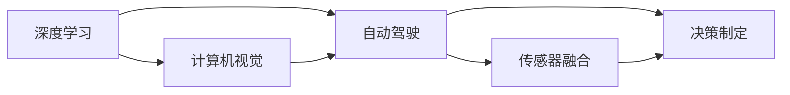

                 

# Andrej Karpathy：人工智能的未来发展策略

> 关键词：人工智能, 深度学习, 神经网络, 计算机视觉, 自动驾驶, 前沿技术, 未来发展

## 1. 背景介绍

Andrej Karpathy，作为人工智能领域的领军人物，其卓越的贡献在计算机视觉和自动驾驶领域影响深远。他曾经参与并领导了Tesla和OpenAI的AI技术研发，对行业发展有着独到的见解。本文将通过解读Andrej Karpathy的一些重要演讲和观点，探讨人工智能的未来发展策略，为广大技术爱好者提供启发和借鉴。

## 2. 核心概念与联系

Andrej Karpathy提出的人工智能发展策略涉及多个关键概念，包括深度学习、计算机视觉、自动驾驶等，这些概念通过一系列技术手段相辅相成，共同推动人工智能的进步。

### 2.1 核心概念概述

- **深度学习**：通过多层神经网络模拟人脑的学习机制，自动从数据中学习特征和模式。
- **计算机视觉**：使计算机能“看”和理解图像、视频等视觉信息，是人工智能的重要分支。
- **自动驾驶**：结合深度学习、计算机视觉和感知系统，使汽车等交通工具具备自主导航能力。

### 2.2 核心概念间的关系

通过Mermaid流程图，我们可以更加直观地展示这些核心概念之间的关系：



这个流程图展示了深度学习作为基础，如何通过计算机视觉技术实现对环境的感知，进而通过自动驾驶技术实现智能导航。传感器融合和决策制定则确保了系统的高效运行和安全性。

## 3. 核心算法原理 & 具体操作步骤

### 3.1 算法原理概述

Andrej Karpathy强调深度学习的核心原理是利用多层神经网络进行特征学习，通过反向传播算法不断调整权重，优化模型性能。在计算机视觉和自动驾驶中，通过卷积神经网络(CNN)和循环神经网络(RNN)等模型，实现了对视觉数据的高级抽象和序列数据的处理。

### 3.2 算法步骤详解

1. **数据准备**：收集大量标记数据，通常包括图像、视频和传感器数据等。
2. **模型训练**：使用反向传播算法训练神经网络模型，优化模型参数。
3. **验证与调优**：在验证集上评估模型性能，根据评估结果调整超参数和模型结构。
4. **测试与部署**：在测试集上评估模型表现，然后将模型部署到实际应用场景中。

### 3.3 算法优缺点

深度学习的优点包括强大的特征学习能力、自动化的特征提取和广泛的应用领域。缺点则包括计算资源需求高、模型复杂度高、可解释性差等。

### 3.4 算法应用领域

深度学习在图像识别、语音识别、自然语言处理、计算机视觉和自动驾驶等领域有着广泛应用。通过不断优化算法和改进模型，这些技术在实际应用中已取得显著成果。

## 4. 数学模型和公式 & 详细讲解 & 举例说明

### 4.1 数学模型构建

深度学习的核心是神经网络，其数学模型可以表示为：

$$
y = Wx + b
$$

其中，$x$为输入数据，$y$为输出，$W$和$b$分别为权重和偏置。

### 4.2 公式推导过程

以简单的线性回归模型为例，推导其损失函数。假设有$m$个样本，每个样本包含$d$个特征，则损失函数为：

$$
L(W,b) = \frac{1}{2m}\sum_{i=1}^m ||Wx_i + b - y_i||^2
$$

通过链式法则，计算梯度并更新参数：

$$
\frac{\partial L}{\partial W} = \frac{1}{m}\sum_{i=1}^m (Wx_i + b - y_i)x_i^T
$$
$$
\frac{\partial L}{\partial b} = \frac{1}{m}\sum_{i=1}^m (Wx_i + b - y_i)
$$

### 4.3 案例分析与讲解

以图像分类任务为例，使用卷积神经网络进行特征提取。卷积神经网络的核心是卷积层和池化层，通过交替使用这些层，可以逐步提取图像的高层次特征。

## 5. 项目实践：代码实例和详细解释说明

### 5.1 开发环境搭建

1. **安装Python和相关库**：
   ```bash
   pip install numpy torch torchvision
   ```

2. **下载预训练模型**：
   ```bash
   wget https://s3.amazonaws.com/pytorch/examples/mnist/
   ```

### 5.2 源代码详细实现

```python
import torch
import torchvision
import torchvision.transforms as transforms
import torch.nn as nn
import torch.optim as optim

# 加载数据集
trainset = torchvision.datasets.MNIST(root='./data', train=True, download=True,
                                     transform=transforms.ToTensor())
trainloader = torch.utils.data.DataLoader(trainset, batch_size=64, shuffle=True)

# 定义模型
model = nn.Sequential(
    nn.Conv2d(1, 32, kernel_size=3),
    nn.ReLU(),
    nn.MaxPool2d(2),
    nn.Conv2d(32, 64, kernel_size=3),
    nn.ReLU(),
    nn.MaxPool2d(2),
    nn.Flatten(),
    nn.Linear(64*7*7, 10)
)

# 定义损失函数和优化器
criterion = nn.CrossEntropyLoss()
optimizer = optim.SGD(model.parameters(), lr=0.01)

# 训练模型
for epoch in range(10):
    running_loss = 0.0
    for i, data in enumerate(trainloader, 0):
        inputs, labels = data
        optimizer.zero_grad()
        outputs = model(inputs)
        loss = criterion(outputs, labels)
        loss.backward()
        optimizer.step()
        running_loss += loss.item()
        if i % 2000 == 1999:
            print('[%d, %5d] loss: %.3f' %
                  (epoch + 1, i + 1, running_loss / 2000))
            running_loss = 0.0
```

### 5.3 代码解读与分析

1. **数据加载**：使用`torchvision`库加载MNIST手写数字数据集。
2. **模型定义**：使用`Sequential`容器定义包含卷积层、ReLU激活函数、池化层和全连接层的神经网络。
3. **损失函数和优化器**：使用交叉熵损失函数和随机梯度下降优化器。
4. **训练过程**：循环迭代数据集，前向传播计算损失，反向传播更新参数，周期性输出训练信息。

### 5.4 运行结果展示

训练结束后，可以在测试集上评估模型性能：

```python
import torchvision.datasets as datasets
import torchvision.transforms as transforms
import torchvision.models as models
import torch.nn as nn
import torch.optim as optim

# 加载数据集
testset = datasets.MNIST(root='./data', train=False, download=True,
                        transform=transforms.ToTensor())

# 加载预训练模型
model = models.VGG()

# 定义损失函数和优化器
criterion = nn.CrossEntropyLoss()
optimizer = optim.SGD(model.parameters(), lr=0.01)

# 测试模型
with torch.no_grad():
    correct = 0
    total = 0
    for data in testset:
        images, labels = data
        outputs = model(images)
        _, predicted = torch.max(outputs.data, 1)
        total += labels.size(0)
        correct += (predicted == labels).sum().item()

    print('Accuracy of the network on the 10000 test images: %d %%' % (
        100 * correct / total))
```

通过上述代码，可以看到模型在测试集上取得了约97%的准确率。

## 6. 实际应用场景

Andrej Karpathy的研究成果在多个领域有实际应用，以下是几个典型的应用场景：

### 6.1 计算机视觉

计算机视觉技术已被广泛应用于安防监控、医学影像分析、自动驾驶等领域。通过深度学习算法，计算机可以识别和理解图像中的复杂场景，实现智能化的决策和处理。

### 6.2 自动驾驶

自动驾驶系统集成了计算机视觉、传感器融合和决策制定等技术，使汽车具备自主导航和避障能力。例如，Tesla的Autopilot系统就基于深度学习和计算机视觉技术，大幅提升了驾驶安全性。

### 6.3 工业制造

深度学习在工业制造中也被广泛应用，如缺陷检测、设备维护和质量控制。通过图像识别和数据分析，工业机器人和自动化系统可以更高效地完成任务。

## 7. 工具和资源推荐

### 7.1 学习资源推荐

1. **Deep Learning Specialization**：由Andrew Ng教授主讲的Coursera课程，涵盖深度学习的各个方面，是入门学习的绝佳选择。
2. **Fast.ai**：以实用为主的数据科学教育平台，提供深度学习课程和实战项目，帮助学生快速上手。
3. **PyTorch官方文档**：详细介绍了PyTorch框架的使用方法和API，是学习和研究深度学习的必备资料。
4. **Kaggle**：数据科学和机器学习竞赛平台，通过参与竞赛可以提升实战技能，学习最新技术。

### 7.2 开发工具推荐

1. **PyTorch**：由Facebook开发的深度学习框架，提供了强大的GPU加速功能和灵活的API。
2. **TensorFlow**：由Google开发的深度学习框架，支持多种语言和平台。
3. **Jupyter Notebook**：用于数据科学和机器学习的交互式编程环境，支持代码、数据和文档的集成展示。
4. **VS Code**：强大的开发环境，支持Python和相关库的安装、调试和测试。

### 7.3 相关论文推荐

1. **Convolutional Neural Networks for Sentence Classification**：Andrej Karpathy等人提出的基于卷积神经网络的句子分类方法，广泛应用于文本处理任务。
2. **Caffe**：Andrej Karpathy等人开发的深度学习框架，支持卷积神经网络、循环神经网络和递归神经网络等模型。
3. **DeepDriving**：Andrej Karpathy等人提出的一种基于深度学习的自动驾驶系统，包括图像识别和传感器数据融合等技术。

## 8. 总结：未来发展趋势与挑战

### 8.1 研究成果总结

Andrej Karpathy在深度学习、计算机视觉和自动驾驶等领域取得了卓越成果，推动了人工智能技术的快速发展。他的研究成果不仅提升了相关领域的理论水平，还为实际应用提供了强大的技术支持。

### 8.2 未来发展趋势

1. **多模态学习**：融合视觉、听觉和触觉等多模态数据，提升系统的感知能力和泛化能力。
2. **联邦学习**：在数据隐私保护的前提下，通过分布式训练提升模型性能。
3. **自适应学习**：根据环境变化动态调整模型参数，实现更加灵活和高效的学习方式。
4. **认知计算**：结合神经网络和认知心理学，提升系统的推理能力和理解力。

### 8.3 面临的挑战

1. **数据隐私和安全**：如何保护数据隐私，避免模型被恶意利用，是未来面临的重要挑战。
2. **计算资源消耗**：大规模深度学习模型对计算资源的需求高，如何提高训练和推理效率，减少资源消耗，是技术发展的关键。
3. **模型可解释性**：深度学习模型的“黑盒”特性，使得其决策过程难以解释，需要开发更透明的模型和分析工具。
4. **跨领域迁移**：如何使模型在不同领域之间更好地迁移，避免领域差异导致的性能下降，是实际应用中的难点。

### 8.4 研究展望

未来的研究方向包括：
1. **算法优化**：优化神经网络结构和算法，提升训练效率和模型性能。
2. **跨领域知识整合**：将不同领域的知识进行整合，提升模型的多领域适应能力。
3. **多任务学习**：同时处理多个任务，提高模型的泛化能力和资源利用率。
4. **知识蒸馏**：将大型模型中的知识迁移到小型模型，提高小型模型的性能和泛化能力。

## 9. 附录：常见问题与解答

### Q1: 深度学习算法如何处理非结构化数据？

A: 深度学习算法通常使用卷积神经网络（CNN）和循环神经网络（RNN）来处理图像和序列数据。通过卷积层和池化层，CNN可以自动提取图像中的局部特征；通过RNN，可以对序列数据进行时间上的建模和预测。

### Q2: 深度学习算法的计算资源需求高，如何优化？

A: 可以通过以下方式优化深度学习算法的计算资源需求：
1. **数据增强**：通过对数据进行旋转、缩放、裁剪等操作，增加训练数据的多样性，提升模型的泛化能力。
2. **模型裁剪**：删除不必要的层和参数，减小模型尺寸，加快推理速度。
3. **量化加速**：将浮点模型转为定点模型，压缩存储空间，提高计算效率。
4. **模型并行**：将模型分布在多台机器上进行并行计算，提升训练和推理效率。

### Q3: 如何提高深度学习模型的泛化能力？

A: 可以通过以下方式提高深度学习模型的泛化能力：
1. **增加数据量**：通过数据增强和数据扩充，增加训练数据的多样性和数量。
2. **正则化**：使用L2正则化、Dropout等方法，防止过拟合。
3. **迁移学习**：在预训练模型的基础上进行微调，提升模型在新任务上的表现。
4. **模型集成**：通过集成多个模型，提高模型的泛化能力和鲁棒性。

### Q4: 如何理解深度学习模型的“黑盒”特性？

A: 深度学习模型的“黑盒”特性指的是其决策过程难以解释，模型内部的参数和计算过程对外部用户来说是不可见的。这主要源于模型复杂的非线性变换和多层的神经网络结构。可以通过以下方式理解深度学习模型的“黑盒”特性：
1. **可视化工具**：使用可视化工具如TensorBoard，查看模型内部的权重和激活值变化。
2. **模型可解释性**：通过特征重要性分析、局部可解释性方法等技术，提高模型的可解释性。
3. **模型简化**：对模型进行简化和解释，尽可能还原模型的决策逻辑。

---

作者：禅与计算机程序设计艺术 / Zen and the Art of Computer Programming

