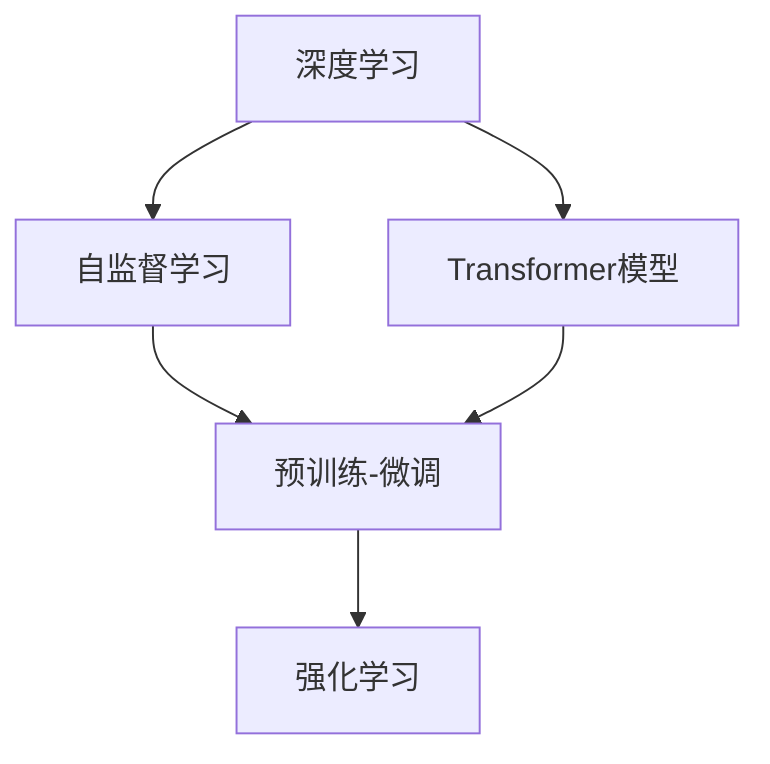

                 

# Andrej Karpathy：人工智能的未来发展规划

## 1. 背景介绍

Andrej Karpathy，作为计算机视觉领域的顶尖专家，也是Transformer模型和自监督学习的重要推动者之一，他对人工智能的未来有着深刻而独到的见解。本文将深入探讨Andrej Karpathy在人工智能领域的战略规划，包括其对未来技术趋势、研究重点、工程实践等方面的见解。

### 1.1 研究背景

Andrej Karpathy，斯坦福大学计算机科学系教授，同时也是特斯拉自动驾驶团队的技术总监。他的研究主要集中在计算机视觉、深度学习、强化学习等领域，对大模型的预训练和微调技术有着深入的理解和应用。同时，他在Twitter等社交平台上活跃，经常分享最新的技术进展和思考，影响着人工智能界的诸多研究者。

## 2. 核心概念与联系

### 2.1 核心概念概述

- **深度学习(DL)：** 一种基于神经网络的机器学习方法，通过对数据进行多层次特征提取和表示，实现复杂的非线性模型，广泛应用于图像、语音、自然语言处理等领域。
- **Transformer模型：** Karpathy在Transformer架构上的研究为自然语言处理（NLP）带来了革命性进展，推动了预训练语言模型（如BERT、GPT-3等）的发展。
- **自监督学习(SSL)：** 一种无监督学习技术，利用大数据集中的大量未标注数据，通过预训练的方式学习模型的表征能力，广泛应用于图像、语言等数据的生成和表示。
- **预训练-微调(Pre-training & Fine-tuning)：** 预训练大模型在大规模无标签数据上进行训练，然后通过微调在大规模有标签数据上学习特定任务，提升模型性能。
- **强化学习(RL)：** 一种通过环境反馈不断优化策略的学习方法，Karpathy通过其对DeepMind AlphaGo的研究，展示了强化学习在复杂博弈问题上的强大能力。

### 2.2 核心概念间的关系

核心概念之间的关系可以通过以下Mermaid流程图展示：



此图展示了Karpathy所认为的核心概念之间的紧密联系。深度学习提供了强大的特征提取能力，自监督学习通过无监督方式预训练模型，Transformer模型作为其中一种成功架构，被应用于预训练-微调过程，强化学习则用于解决复杂的博弈和决策问题。

## 3. 核心算法原理 & 具体操作步骤
### 3.1 算法原理概述

Karpathy在人工智能的未来发展规划中，对深度学习、自监督学习和预训练-微调技术的原理进行了详细阐述。

- **深度学习：** 深度学习通过多层非线性映射，捕捉输入数据的复杂特征表示。其核心在于神经网络结构的设计和优化算法的改进。
- **自监督学习：** 自监督学习通过利用数据的自相关性，在不依赖标注数据的情况下进行模型训练。Karpathy认为，大规模无标签数据集是自监督学习的关键。
- **预训练-微调：** 预训练模型在大规模无标签数据上预训练，然后在特定任务上进行微调，利用有标签数据对模型进行优化。Karpathy认为，预训练模型可以大大降低微调所需的标注数据量。

### 3.2 算法步骤详解

预训练-微调的具体步骤包括：
1. **数据准备：** 收集大规模无标签数据集，进行数据增强和预处理。
2. **预训练：** 在大规模无标签数据集上训练预训练模型，学习通用的特征表示。
3. **微调：** 在特定任务的数据集上，微调预训练模型，学习特定任务的知识。
4. **评估和迭代：** 在验证集上评估微调后的模型性能，根据性能调整模型参数和超参数。

### 3.3 算法优缺点

**优点：**
- 利用大规模无标签数据进行预训练，大大减少了对标注数据的需求。
- 通过微调，可以适应多种不同的任务和应用场景。
- 预训练模型具有较好的通用性，可以适用于不同领域的任务。

**缺点：**
- 预训练和微调过程复杂，需要大量的计算资源和数据。
- 预训练模型可能存在过拟合的问题，需要额外的正则化技术。
- 微调模型需要调整模型参数，可能影响模型的稳定性。

### 3.4 算法应用领域

Karpathy认为，预训练-微调技术已经广泛应用于计算机视觉、自然语言处理、推荐系统等领域。在计算机视觉中，通过在大规模图像数据上预训练，然后在特定图像识别任务上进行微调，显著提升了模型的性能。在自然语言处理中，通过在大规模文本数据上预训练，然后在问答、机器翻译、文本生成等任务上进行微调，实现了显著的性能提升。

## 4. 数学模型和公式 & 详细讲解 & 举例说明

### 4.1 数学模型构建

Karpathy在预训练-微调过程中，使用了Transformer架构，并引入了自监督学习任务，如掩码语言模型(MLM)和下一句预测任务(NSP)。

- **掩码语言模型(MLM)：** 随机遮盖一部分输入序列，训练模型对缺失的单词进行预测。
- **下一句预测任务(NSP)：** 训练模型预测两个随机句子是否相连。

### 4.2 公式推导过程

对于MLM任务，假设输入序列为 $x = [x_1, x_2, ..., x_n]$，其中 $x_i$ 表示第 $i$ 个单词。随机遮盖 $x_1$ 得到 $x' = [\tilde{x}_1, x_2, ..., x_n]$，其中 $\tilde{x}_1$ 表示遮盖的单词。模型的目标是最小化以下损失函数：

$$
\mathcal{L}(x', y) = -\log \text{Pr}(y | x')
$$

其中 $y$ 为遮盖的单词 $x_1$ 的预测结果。对于NSP任务，模型的目标是最大化连续句子的概率，即：

$$
\mathcal{L}(x, y) = -\log \text{Pr}(y | x, x')
$$

其中 $x$ 和 $x'$ 为两个随机句子，$y$ 表示 $x$ 和 $x'$ 是否相连。

### 4.3 案例分析与讲解

以BERT模型为例，其通过在大规模无标签文本数据上进行预训练，然后在特定任务上进行微调，实现了显著的性能提升。

## 5. 项目实践：代码实例和详细解释说明

### 5.1 开发环境搭建

Karpathy推荐使用PyTorch作为深度学习框架，并提供了详细的安装和配置教程。以下是PyTorch的快速入门步骤：

1. 安装Anaconda，并创建虚拟环境。
2. 在虚拟环境中安装PyTorch和相关依赖。
3. 配置GPU和CUDA环境。
4. 下载预训练模型和数据集。

### 5.2 源代码详细实现

以下是一个简单的预训练-微调示例代码，展示了如何使用PyTorch实现BERT的微调。

```python
import torch
from transformers import BertTokenizer, BertForMaskedLM

# 加载预训练模型和分词器
tokenizer = BertTokenizer.from_pretrained('bert-base-cased')
model = BertForMaskedLM.from_pretrained('bert-base-cased')

# 准备数据
inputs = tokenizer("Hello, my name is [MASK].", return_tensors="pt")
labels = tokenizer("Hello, my name is", padding="max_length", max_length=5)["input_ids"]

# 定义模型和损失函数
device = "cuda"
model.to(device)
criterion = torch.nn.CrossEntropyLoss()

# 微调模型
model.train()
for i in range(5):
    output = model(inputs["input_ids"].to(device))
    loss = criterion(output, labels.to(device))
    loss.backward()
    optimizer.step()

# 在验证集上进行评估
model.eval()
eval_result = model(**inputs, labels=labels)
print(eval_result)
```

### 5.3 代码解读与分析

代码中使用了BertTokenizer和BertForMaskedLM，分别用于处理输入和微调模型。通过在输入中随机遮盖一个单词，模型学习对缺失单词的预测。通过反向传播更新模型参数，不断优化模型性能。

## 6. 实际应用场景

### 6.1 计算机视觉

在计算机视觉领域，Karpathy的团队已经开发出多个基于预训练-微调技术的模型，如COCO Captions、Bottom-Up and Top-Down Attention等，用于图像描述、目标检测等任务。通过在大规模无标签图像数据上预训练，然后在特定任务上进行微调，这些模型取得了显著的性能提升。

### 6.2 自然语言处理

在自然语言处理领域，Karpathy的团队利用预训练-微调技术，开发了多个语言模型，如BERT、GPT-2等，用于文本分类、情感分析、机器翻译等任务。这些模型在大规模无标签文本数据上进行预训练，然后在特定任务的数据集上进行微调，显著提升了模型的性能。

### 6.3 机器人

在机器人领域，Karpathy的研究团队开发了多个基于强化学习的机器人，用于自动驾驶、路径规划等任务。这些机器人通过在大规模环境中进行训练，学习如何避免障碍物，规划最优路径，展示了强化学习在复杂决策问题上的强大能力。

## 7. 工具和资源推荐

### 7.1 学习资源推荐

- **《Deep Learning》书籍：** Ian Goodfellow等人著，详细介绍了深度学习的原理和应用。
- **《Hands-On Machine Learning with Scikit-Learn, Keras, and TensorFlow》书籍：** Aurélien Géron著，提供了基于Scikit-Learn、Keras和TensorFlow的深度学习实践。
- **CS231n课程：** Stanford大学计算机视觉课程，提供了丰富的深度学习教程和资源。

### 7.2 开发工具推荐

- **PyTorch：** 深度学习框架，提供了丰富的预训练模型和工具。
- **TensorFlow：** 谷歌开发的深度学习框架，支持大规模分布式训练。
- **Jupyter Notebook：** 交互式编程环境，便于数据可视化、模型调试。

### 7.3 相关论文推荐

- **BERT: Pre-training of Deep Bidirectional Transformers for Language Understanding：** 提出BERT模型，引入自监督学习任务，提升了语言理解能力。
- **Attention is All You Need：** 提出Transformer模型，改变了深度学习领域的特征表示方式。
- **Playing Atari with Deep Reinforcement Learning：** 展示强化学习在复杂博弈问题上的应用。

## 8. 总结：未来发展趋势与挑战

### 8.1 研究成果总结

Karpathy在深度学习、自监督学习、强化学习等领域的研究，推动了大模型预训练和微调技术的发展。其开发的多款模型在图像、文本、机器人等领域展示了强大的应用潜力。

### 8.2 未来发展趋势

未来，Karpathy认为，预训练-微调技术将继续推动人工智能的进步。以下是几个可能的发展趋势：
- **多模态融合：** 结合视觉、语音、文本等多种模态信息，提升模型的感知和理解能力。
- **自监督学习范式：** 探索更多自监督学习任务，减少对标注数据的需求。
- **强化学习优化：** 进一步优化强化学习算法，提升模型的决策能力。

### 8.3 面临的挑战

尽管预训练-微调技术取得了显著的进展，但仍面临一些挑战：
- **数据瓶颈：** 大规模无标签数据集的获取成本较高，限制了模型的预训练规模。
- **模型复杂度：** 预训练和微调模型需要大量的计算资源和存储空间。
- **模型泛化能力：** 模型在特定任务上的泛化能力仍需进一步提升。

### 8.4 研究展望

未来，预训练-微调技术需要在以下几个方面取得突破：
- **分布式训练：** 利用分布式训练技术，加速大规模模型的预训练和微调过程。
- **数据增强：** 开发更多数据增强技术，提升模型的泛化能力。
- **模型优化：** 优化模型的结构和参数配置，提高模型性能。

## 9. 附录：常见问题与解答

**Q1: 什么是预训练-微调技术？**

A: 预训练-微调技术是指在大规模无标签数据上训练预训练模型，然后在特定任务上微调，以适应任务需求的技术。

**Q2: 如何使用预训练-微调技术？**

A: 首先收集大规模无标签数据进行预训练，然后在特定任务的数据集上进行微调，调整模型参数以适应任务需求。

**Q3: 预训练-微调技术的优缺点是什么？**

A: 优点包括减少了对标注数据的需求，模型具有较好的通用性，能够适应多种任务。缺点包括预训练和微调过程复杂，需要大量计算资源，模型可能存在过拟合问题。

**Q4: 预训练-微调技术有哪些应用场景？**

A: 广泛应用于计算机视觉、自然语言处理、机器人等领域，展示了强大的应用潜力。

**Q5: 预训练-微调技术未来有哪些发展方向？**

A: 未来可能的发展方向包括多模态融合、自监督学习范式优化、强化学习优化等。

---

作者：禅与计算机程序设计艺术 / Zen and the Art of Computer Programming

