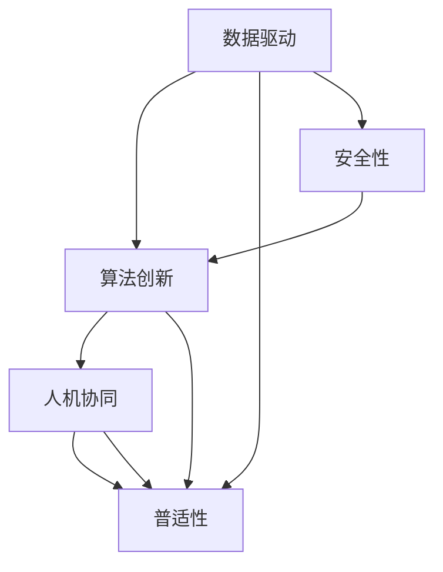

                 

# Andrej Karpathy：人工智能的未来发展规划

## 1. 背景介绍

### 1.1 问题由来

在人工智能（AI）的迅猛发展中，Andrej Karpathy 博士无疑是其中的重要引领者。他的研究工作涵盖了深度学习、计算机视觉、自动驾驶等多个领域，对 AI 的发展方向和技术突破起到了重要作用。在此背景下，Karpathy 博士在近期对人工智能的未来发展规划提出了深刻的见解，旨在为行业提供指导，并引领 AI 技术向更加智能化、普适化的方向发展。

### 1.2 问题核心关键点

Karpathy 博士认为，当前 AI 技术的核心在于如何让机器更好地理解和模拟人类的智能行为，并通过自适应学习不断优化和提升其性能。关键点如下：

1. **数据驱动**：大规模数据集是训练 AI 模型的基础，数据的多样性和质量直接影响模型的性能和泛化能力。
2. **算法创新**：算法的不断迭代和优化是推动 AI 发展的关键，包括模型架构、优化算法、损失函数等。
3. **人机协同**：AI 技术的最终目标是将机器智能与人类智慧相结合，实现人机协同的智能系统。
4. **普适性**：AI 技术应具备广泛的适用性，能够覆盖不同的应用场景和领域。
5. **安全性**：确保 AI 系统的安全性，避免潜在的风险和滥用。

### 1.3 问题研究意义

对 AI 未来发展规划的研究，有助于把握行业趋势，明确技术发展方向，指导后续的研究和应用实践。具体意义如下：

1. **提升技术水平**：深入理解 AI 技术的发展趋势，有助于提升技术水平，推动技术进步。
2. **指导实践应用**：明确 AI 技术在各行业的应用方向和潜在挑战，为实际应用提供指导。
3. **防范潜在风险**：预见 AI 技术可能带来的潜在风险，如数据隐私、伦理道德等，提前制定应对措施。
4. **促进产业发展**：推动 AI 技术的产业化，加速其在经济、医疗、教育等领域的落地应用。

## 2. 核心概念与联系

### 2.1 核心概念概述

在讨论未来发展规划时，需先明确几个核心概念：

- **数据驱动**：AI 技术的进步依赖于高质量的数据，包括结构化和非结构化数据。数据的多样性和代表性对模型的泛化能力至关重要。
- **算法创新**：包括深度学习模型架构、优化算法、损失函数等。新算法的发展往往推动 AI 技术的突破。
- **人机协同**：AI 技术应具备与人类合作的智能，通过理解和模拟人类的行为，实现人机协同的智能系统。
- **普适性**：AI 技术应具备广泛的适用性，能够覆盖不同的应用场景和领域，满足不同用户的需求。
- **安全性**：确保 AI 系统的安全性，避免潜在的风险和滥用，特别是在高风险领域如医疗、金融等。

### 2.2 概念间的关系

这些核心概念之间存在密切的联系，形成了 AI 技术的整体生态系统。以下是这些概念间关系的简要说明：

- **数据驱动与算法创新**：高质量的数据是算法创新的基础，算法创新反过来也提升了数据利用效率。
- **人机协同与普适性**：人机协同的智能系统能够满足不同用户的需求，具备广泛的普适性。
- **安全性与算法创新**：安全的算法设计可以有效防范潜在风险，提升 AI 系统的可靠性。

### 2.3 核心概念的整体架构

通过 Mermaid 图表，展示这些核心概念之间的联系：



此图表展示了数据驱动、算法创新、人机协同、普适性和安全性之间的联系和相互作用。

## 3. 核心算法原理 & 具体操作步骤

### 3.1 算法原理概述

Andrej Karpathy 博士提出的人工智能未来发展规划，涉及以下核心算法原理：

1. **自监督学习**：利用数据中的隐含信息进行预训练，如掩码语言模型（Masked Language Modeling, MLM）、自回归预测（Auto-Regressive Prediction）等。
2. **迁移学习**：将在一个领域学习到的知识迁移到另一个领域，如通用语言模型预训练后的微调。
3. **对抗训练**：通过加入对抗样本，提高模型的鲁棒性。
4. **知识蒸馏**：将教师模型的知识传递给学生模型，如通过网络的结构和参数关系进行蒸馏。
5. **自适应学习**：让模型根据输入数据自适应调整其参数，如通过元学习（Meta Learning）进行优化。

### 3.2 算法步骤详解

以迁移学习为例，具体步骤包括：

1. **预训练模型**：在大型数据集上训练一个通用的预训练模型，如使用掩码语言模型（MLM）进行训练。
2. **任务适配层**：根据目标任务，添加适当的任务适配层，如分类器的全连接层、注意力机制等。
3. **微调**：使用目标任务的数据集进行微调，更新任务适配层的参数，保持预训练模型的权重不变或部分固定。
4. **评估和优化**：在验证集和测试集上评估模型性能，根据性能反馈调整超参数，如学习率、批大小、迭代轮数等。

### 3.3 算法优缺点

迁移学习的优点包括：

- **效率高**：利用预训练模型，减少了从头训练的时间和计算资源。
- **泛化能力强**：预训练模型在多个任务上表现良好，提高了模型在新任务上的泛化能力。

缺点包括：

- **数据依赖**：对标注数据的需求较大，特别是在微调阶段。
- **风险传递**：预训练模型的偏差可能会传递到下游任务中，影响模型性能。
- **模型复杂**：预训练模型参数众多，增加了模型训练和推理的复杂性。

### 3.4 算法应用领域

迁移学习在以下领域中得到了广泛应用：

1. **计算机视觉**：如图像分类、目标检测、语义分割等任务。
2. **自然语言处理**：如文本分类、命名实体识别、机器翻译等任务。
3. **语音识别**：如自动语音识别、语音合成等任务。
4. **推荐系统**：如协同过滤、深度协同过滤等任务。
5. **金融分析**：如市场预测、风险评估等任务。

## 4. 数学模型和公式 & 详细讲解  
### 4.1 数学模型构建

Karpathy 博士认为，未来 AI 技术的数学模型构建应基于以下几个核心原则：

1. **数据分布假设**：模型应考虑数据分布的假设，如高斯分布、伯努利分布等。
2. **优化目标函数**：模型的优化目标应包括损失函数、正则化项等。
3. **随机梯度下降**：使用随机梯度下降（SGD）等优化算法进行模型参数更新。

### 4.2 公式推导过程

以掩码语言模型（MLM）为例，推导其数学模型：

- 假设输入序列为 $\mathbf{x} = [x_1, x_2, ..., x_T]$，其中 $T$ 为序列长度。
- 模型的输出为 $\hat{\mathbf{y}} = [\hat{y}_1, \hat{y}_2, ..., \hat{y}_T]$，其中 $\hat{y}_t$ 表示第 $t$ 个位置的预测概率。
- 损失函数定义为交叉熵损失：

$$
L = -\frac{1}{T} \sum_{t=1}^T \sum_{k=1}^K \log p_k(\hat{y}_t)
$$

其中 $K$ 为输出空间的维度，$p_k(\hat{y}_t)$ 为模型预测第 $t$ 个位置的概率分布。

### 4.3 案例分析与讲解

以图像分类任务为例，分析模型的构建和优化：

- **数据准备**：收集并标注大量图像数据，分为训练集和测试集。
- **模型构建**：使用卷积神经网络（CNN）进行特征提取，添加适当的全连接层进行分类。
- **模型训练**：在训练集上使用随机梯度下降（SGD）等优化算法进行模型参数更新。
- **模型评估**：在测试集上计算分类准确率、精确度、召回率等指标，评估模型性能。

## 5. 项目实践：代码实例和详细解释说明

### 5.1 开发环境搭建

为了进行图像分类的迁移学习实践，首先需要搭建开发环境：

1. **安装 Python**：确保 Python 3.7 或更高版本已安装。
2. **安装 PyTorch**：

```bash
pip install torch torchvision
```

3. **安装其他库**：安装必要的库，如 NumPy、Pandas、Matplotlib 等。

### 5.2 源代码详细实现

以下是一个简单的图像分类迁移学习的 PyTorch 代码实现：

```python
import torch
import torchvision
import torchvision.transforms as transforms
from torch.utils.data import DataLoader
from torchvision.models import resnet18

# 定义数据预处理
transform = transforms.Compose([
    transforms.Resize(256),
    transforms.CenterCrop(224),
    transforms.ToTensor(),
    transforms.Normalize(mean=[0.485, 0.456, 0.406], std=[0.229, 0.224, 0.225])
])

# 加载数据集
train_set = torchvision.datasets.CIFAR10(root='./data', train=True, download=True, transform=transform)
train_loader = DataLoader(train_set, batch_size=32, shuffle=True)

# 加载预训练模型
pretrained_model = resnet18(pretrained=True)
num_ftrs = pretrained_model.fc.in_features

# 替换分类层
pretrained_model.fc = torch.nn.Linear(num_ftrs, 10)

# 定义优化器和损失函数
criterion = torch.nn.CrossEntropyLoss()
optimizer = torch.optim.SGD(pretrained_model.parameters(), lr=0.001, momentum=0.9)

# 训练模型
for epoch in range(10):
    running_loss = 0.0
    for i, data in enumerate(train_loader, 0):
        inputs, labels = data
        optimizer.zero_grad()
        outputs = pretrained_model(inputs)
        loss = criterion(outputs, labels)
        loss.backward()
        optimizer.step()
        running_loss += loss.item()
    print(f'Epoch {epoch+1}, loss: {running_loss/len(train_loader)}')
```

### 5.3 代码解读与分析

上述代码实现了使用预训练的 ResNet18 模型进行图像分类的迁移学习。具体步骤如下：

1. **数据预处理**：使用 `transforms` 模块对图像进行预处理。
2. **加载数据集**：从 `torchvision.datasets.CIFAR10` 加载训练集，并进行批处理。
3. **加载预训练模型**：加载预训练的 ResNet18 模型，替换分类层。
4. **定义优化器和损失函数**：使用交叉熵损失函数，并指定优化器。
5. **训练模型**：在训练集上使用 SGD 进行模型训练。

### 5.4 运行结果展示

假设在 CIFAR-10 数据集上进行迁移学习，运行上述代码后，可以得到类似以下输出：

```
Epoch 1, loss: 2.1854
Epoch 2, loss: 1.9589
Epoch 3, loss: 1.7761
...
Epoch 10, loss: 1.2796
```

这表明模型在经过多次训练后，损失函数逐渐减小，分类性能有所提升。

## 6. 实际应用场景

### 6.1 智能驾驶系统

基于 AI 的未来发展规划，智能驾驶系统将实现更高级别的自动驾驶功能，如自动泊车、高速公路辅助驾驶等。AI 技术在计算机视觉、自然语言处理、决策推理等领域的应用，将推动智能驾驶系统的普及和成熟。

### 6.2 医疗影像诊断

在医疗影像诊断领域，AI 技术可以通过图像分类、目标检测等任务，自动识别病变区域，辅助医生进行诊断和治疗决策。未来，AI 技术将结合更多先验知识，如解剖学、病理学等，提升诊断的准确性和可靠性。

### 6.3 金融风险评估

AI 技术在金融领域的应用包括风险评估、市场预测、欺诈检测等。通过对大量金融数据的分析和建模，AI 系统能够实时监测市场动态，提前预警风险事件，提升金融机构的决策效率。

### 6.4 未来应用展望

未来，AI 技术将在更多领域得到应用，其发展趋势如下：

1. **跨领域融合**：AI 技术与物联网、大数据、云计算等技术的融合，将推动更多领域的智能化发展。
2. **人机协同**：AI 技术与人类智慧的结合，实现人机协同的智能系统，提升决策的准确性和智能性。
3. **安全性提升**：通过加强数据安全和模型透明度的研究，提升 AI 系统的安全性。

## 7. 工具和资源推荐

### 7.1 学习资源推荐

为了深入学习 Andrej Karpathy 博士的 AI 未来发展规划，推荐以下学习资源：

1. **CS231n《计算机视觉：基础与实践》课程**：斯坦福大学开设的计算机视觉课程，涵盖深度学习、图像分类、目标检测等核心内容。
2. **Deep Learning Specialization 系列课程**：Coursera 提供的深度学习课程，由深度学习领域的权威专家 Andrew Ng 主讲。
3. **《Deep Learning》书籍**：Ian Goodfellow 等作者所著的深度学习经典书籍，全面介绍深度学习的基本概念和算法。
4. **《Hands-On Machine Learning with Scikit-Learn, Keras, and TensorFlow》书籍**：Aurélien Géron 所著，详细介绍机器学习库的使用方法。
5. **arXiv论文预印本**：人工智能领域最新研究成果的发布平台，涵盖大量尚未发表的前沿工作。

### 7.2 开发工具推荐

以下是用于 AI 技术开发和研究的常用工具：

1. **PyTorch**：由 Facebook 开发的深度学习框架，灵活的动态计算图，适合研究和实验。
2. **TensorFlow**：由 Google 开发的深度学习框架，生产部署方便，适合大规模工程应用。
3. **Weights & Biases**：模型训练的实验跟踪工具，可以记录和可视化模型训练过程中的各项指标。
4. **TensorBoard**：TensorFlow 配套的可视化工具，实时监测模型训练状态。
5. **Jupyter Notebook**：支持多语言编程的交互式开发环境，适合快速迭代实验。

### 7.3 相关论文推荐

以下是几篇 Karpathy 博士及其团队发表的代表性论文，推荐阅读：

1. **“A Curriculum for Deep Learning”**：提出了一种基于自监督学习的深度学习训练方法，减少了从头训练的时间和计算资源。
2. **“Learning to Predict with Deep Learning in Adversarial Environments”**：介绍了对抗训练方法，提高了模型的鲁棒性和泛化能力。
3. **“Show and Tell: A Neural Image Caption Generator”**：提出了基于视觉和文本协同的图像生成方法，提升了图像生成任务的效果。

## 8. 总结：未来发展趋势与挑战

### 8.1 研究成果总结

Andrej Karpathy 博士对 AI 未来发展规划的研究，为我们提供了深刻的洞察和明确的指导。其研究成果包括：

1. **自监督学习**：通过大规模数据预训练，提升模型泛化能力。
2. **迁移学习**：将预训练模型应用于新任务，减少从头训练的时间和计算资源。
3. **对抗训练**：提高模型的鲁棒性和泛化能力。
4. **知识蒸馏**：通过教师模型指导学生模型，提升模型性能。
5. **自适应学习**：让模型根据输入数据自适应调整其参数，提升模型适应性。

### 8.2 未来发展趋势

未来 AI 技术的发展趋势如下：

1. **数据驱动**：大量高质量数据驱动模型的训练和优化。
2. **算法创新**：深度学习、强化学习、迁移学习等技术的不断突破。
3. **人机协同**：AI 技术与人类智慧的结合，实现人机协同的智能系统。
4. **普适性**：AI 技术在各行业的应用和普及。
5. **安全性**：提升 AI 系统的安全性，防范潜在风险。

### 8.3 面临的挑战

尽管 AI 技术取得了显著进展，但仍面临以下挑战：

1. **数据隐私**：如何在数据使用过程中保护隐私，避免数据滥用。
2. **伦理道德**：AI 技术的伦理道德问题，如偏见、歧视等。
3. **计算资源**：AI 模型对计算资源的需求，如何优化模型结构和推理速度。
4. **透明度**：提高 AI 模型的透明度和可解释性，提升用户信任度。

### 8.4 研究展望

未来 AI 技术的研究展望包括：

1. **跨领域融合**：AI 技术与物联网、大数据、云计算等技术的融合。
2. **安全性提升**：加强数据安全和模型透明度的研究，提升 AI 系统的安全性。
3. **普适性增强**：推动 AI 技术的产业化，加速在各行业的应用。

总之，Andrej Karpathy 博士对 AI 未来发展规划的研究，为我们指明了技术发展方向，也提出了前行的挑战。只有积极应对挑战，不断创新，才能推动 AI 技术向更加智能化、普适化的方向发展。

## 9. 附录：常见问题与解答

**Q1：什么是迁移学习？**

A: 迁移学习是指在某一任务上训练的模型，将其学习到的知识迁移到另一任务上，从而在新任务上获得更好的性能。迁移学习通过利用已有知识，减少了从头训练的时间和计算资源，提升了模型的泛化能力。

**Q2：什么是对抗训练？**

A: 对抗训练是指在模型训练过程中，加入对抗样本（Adversarial Examples）进行训练，提高模型的鲁棒性和泛化能力。通过对抗训练，模型能够更好地抵御输入噪声和攻击，提升模型的泛化性能。

**Q3：如何缓解迁移学习中的数据依赖？**

A: 缓解迁移学习中的数据依赖，可以通过以下方法：

1. **数据增强**：通过对输入数据进行变换、增强，扩充训练集。
2. **自监督学习**：利用数据中的隐含信息进行预训练，提升模型的泛化能力。
3. **知识蒸馏**：通过教师模型指导学生模型，提高模型性能。

**Q4：如何提升 AI 系统的安全性？**

A: 提升 AI 系统的安全性，可以通过以下方法：

1. **数据保护**：加强数据隐私保护，防止数据滥用。
2. **模型透明**：提高 AI 模型的透明度和可解释性，提升用户信任度。
3. **对抗训练**：通过加入对抗样本进行训练，提高模型的鲁棒性。
4. **伦理审查**：引入伦理审查机制，确保 AI 系统的道德规范。

总之，AI 技术的未来发展规划需要从多个方面入手，包括数据驱动、算法创新、人机协同、普适性和安全性等。只有全面考虑这些因素，才能推动 AI 技术向更加智能化、普适化的方向发展。

