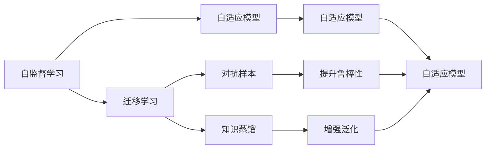

                 

## 1. 背景介绍

安德烈·卡帕希（Andrej Karpathy）是机器学习和计算机视觉领域的领军人物，斯坦福大学计算机科学与视觉系教授，曾因开创性工作获得2019年著名的国际人工智能奖。他的工作主要集中在神经网络模型、自监督学习以及计算机视觉的多个前沿领域。在2023年的一篇博文中，卡帕希回顾了人工智能的发展历程，并展望了未来十年的发展趋势，提出了对AI研究方向的深刻见解。

这篇博文总结了卡帕希教授几十年的研究成果，提供了对未来AI发展的深邃洞察，对业界和学界都有着重要的参考价值。本文将重点解析卡帕希在人工智能发展趋势的见解，结合其最新研究成果，对AI领域的研究者、开发者和从业者提供有价值的指导。

## 2. 核心概念与联系

### 2.1 核心概念概述

安德烈·卡帕希教授在博文中提出了几个核心概念，这些概念是理解人工智能未来发展趋势的关键。以下是其中几个主要概念：

- **自监督学习（Self-Supervised Learning）**：在监督学习中，模型的训练依赖于人工标注的数据，而自监督学习则通过无标签的数据进行训练，通过模型自身的预测能力来学习。

- **迁移学习（Transfer Learning）**：迁移学习是指将一个任务学到的知识迁移到另一个任务上，从而减少新任务的训练时间和数据需求。

- **对抗样本（Adversarial Examples）**：对抗样本是指对模型的输入进行轻微修改，以使其输出错误的结果。这是对抗性安全的一个重要问题。

- **自适应模型（Adaptive Models）**：自适应模型能够根据不同的输入自适应地调整自身结构，使得模型在面对未知数据时仍然能保持较好的性能。

- **知识蒸馏（Knowledge Distillation）**：知识蒸馏是指将一个大模型的知识压缩并转移到一个小模型上，使得小模型能够继承大模型的知识，提升其性能。

这些概念之间存在着紧密的联系，形成了卡帕希对未来人工智能发展的基本框架。自监督学习与迁移学习是构建自适应模型的基础，对抗样本与知识蒸馏是提升模型鲁棒性和泛化能力的重要手段。

### 2.2 核心概念间的联系

这些核心概念间的联系可以通过以下Mermaid流程图来展示：



从图中可以看出，自监督学习是迁移学习和自适应模型的基础，而对抗样本和知识蒸馏是提升自适应模型性能的两种重要方法。自适应模型作为最终的目标，能够根据不同的输入自适应地调整自身结构，从而在多种场景下保持较好的性能。

## 3. 核心算法原理 & 具体操作步骤

### 3.1 算法原理概述

卡帕希教授认为，未来的AI发展将更加依赖自监督学习与迁移学习。自监督学习通过无标签的数据进行训练，能够学习到更加普遍的知识。迁移学习则能够将这些知识应用到新的任务上，使得模型具有更好的泛化能力。

在具体操作上，自监督学习通常采用预测任务，如语言模型、掩码预测、旋转预测等，通过这些预测任务学习模型参数。迁移学习则将模型在新任务上进行微调，通过调整顶层参数或引入适应器的形式，使得模型能够适应新任务。

### 3.2 算法步骤详解

1. **数据准备**：收集无标签数据和少量的标注数据，构建自监督学习的数据集和迁移学习的数据集。

2. **自监督学习**：使用自监督学习任务对模型进行预训练，学习到通用知识。

3. **迁移学习**：在新任务上进行微调，调整模型的顶层参数或引入适应器，适应新任务的特性。

4. **对抗样本生成**：生成对抗样本，评估模型的鲁棒性。

5. **知识蒸馏**：将大模型的知识转移到小模型上，提升小模型的性能。

### 3.3 算法优缺点

自监督学习和迁移学习具有以下优点：

- **数据效率高**：自监督学习能够高效利用无标签数据进行预训练，大大减少对标注数据的依赖。
- **泛化能力强**：迁移学习能够将模型在新任务上进行微调，提高模型的泛化能力。
- **模型鲁棒性强**：对抗样本和知识蒸馏能够提升模型的鲁棒性和泛化能力，使得模型在面对未知数据时仍然能保持较好的性能。

同时，这些方法也存在一些缺点：

- **训练复杂度高**：自监督学习需要设计合适的预测任务，且训练过程复杂。
- **模型复杂度高**：迁移学习需要调整模型的顶层参数或引入适应器，导致模型复杂度较高。
- **对抗样本生成困难**：生成高质量对抗样本需要大量的时间和计算资源，且对抗样本的生成过程较为复杂。

### 3.4 算法应用领域

自监督学习和迁移学习在多个领域得到了广泛应用，以下是其中几个主要领域：

1. **计算机视觉**：在图像分类、目标检测、实例分割等任务上，自监督学习与迁移学习被广泛应用，提升了模型的准确性和泛化能力。

2. **自然语言处理**：在语言建模、文本分类、情感分析等任务上，自监督学习与迁移学习被广泛应用，提升了模型的理解能力和语言表达能力。

3. **语音识别**：在语音识别任务上，自监督学习与迁移学习被广泛应用，提升了模型的鲁棒性和泛化能力。

4. **自动驾驶**：在自动驾驶任务上，自监督学习与迁移学习被广泛应用，提升了模型的感知能力和决策能力。

5. **推荐系统**：在推荐系统任务上，自监督学习与迁移学习被广泛应用，提升了模型的个性化推荐能力和泛化能力。

## 4. 数学模型和公式 & 详细讲解 & 举例说明

### 4.1 数学模型构建

卡帕希教授在博文中详细阐述了自监督学习与迁移学习的数学模型。以语言模型为例，语言模型可以表示为：

$$
P(x_i|x_{<i}) = \sigma(W_h \cdot x_{<i} + W_{h2} \cdot h_{t-1} + b)
$$

其中，$x_i$ 表示输入序列的第 $i$ 个单词，$x_{<i}$ 表示输入序列的前 $i-1$ 个单词，$h_{t-1}$ 表示上一个时间步的隐藏状态，$W_h$、$W_{h2}$ 和 $b$ 是模型参数。

在自监督学习中，可以采用掩码预测任务，预测序列中缺失的单词，损失函数可以表示为：

$$
\mathcal{L} = -\log P(x_i|x_{<i})
$$

在迁移学习中，可以通过调整模型顶层参数或引入适应器的方式，使得模型在新任务上进行微调，损失函数可以表示为：

$$
\mathcal{L} = -\log P(x_i|x_{<i}, \theta_{f})
$$

其中，$\theta_{f}$ 表示微调后的模型参数。

### 4.2 公式推导过程

以语言模型为例，自监督学习的推导过程如下：

1. 假设输入序列 $x_{<i}$ 的单词嵌入为 $x_{<i}$，上一个时间步的隐藏状态为 $h_{t-1}$。
2. 根据神经网络模型，计算出隐藏状态 $h_t$。
3. 根据神经网络模型，计算出下一个时间步的隐藏状态 $h_{t+1}$。
4. 计算模型对下一个时间步的单词 $x_i$ 的概率 $P(x_i|x_{<i})$。
5. 计算预测错误时的损失 $\mathcal{L}$。

在迁移学习中，微调的推导过程如下：

1. 假设输入序列 $x_{<i}$ 的单词嵌入为 $x_{<i}$，上一个时间步的隐藏状态为 $h_{t-1}$。
2. 根据神经网络模型，计算出隐藏状态 $h_t$。
3. 根据神经网络模型，计算出下一个时间步的隐藏状态 $h_{t+1}$。
4. 计算模型对下一个时间步的单词 $x_i$ 的概率 $P(x_i|x_{<i}, \theta_{f})$。
5. 计算预测错误时的损失 $\mathcal{L}$。

### 4.3 案例分析与讲解

以图像分类任务为例，自监督学习的推导过程如下：

1. 假设输入图像 $x$ 经过卷积和池化操作后得到特征图 $f$。
2. 根据神经网络模型，计算出分类器输出 $z$。
3. 计算模型对类别 $c$ 的概率 $P(c|x)$。
4. 计算预测错误时的损失 $\mathcal{L}$。

在迁移学习中，微调的推导过程如下：

1. 假设输入图像 $x$ 经过卷积和池化操作后得到特征图 $f$。
2. 根据神经网络模型，计算出分类器输出 $z$。
3. 计算模型对类别 $c$ 的概率 $P(c|x, \theta_{f})$。
4. 计算预测错误时的损失 $\mathcal{L}$。

通过以上案例分析，可以看出自监督学习与迁移学习的基本框架是相似的，它们都是通过预测任务进行模型训练，然后应用到新的任务上进行微调。

## 5. 项目实践：代码实例和详细解释说明

### 5.1 开发环境搭建

为了进行自监督学习和迁移学习的实践，需要搭建如下开发环境：

1. **Python 3.7+**：Python是AI领域的主要编程语言，可以使用Anaconda或Miniconda进行安装。

2. **PyTorch 1.7+**：PyTorch是目前最流行的深度学习框架之一，支持GPU和TPU加速。

3. **TensorBoard**：TensorBoard是TensorFlow的可视化工具，可以实时监测模型训练状态，提供丰富的图表和指标。

4. **Jupyter Notebook**：Jupyter Notebook是一个交互式的编程环境，支持Python代码的编写、执行和调试。

5. **NVIDIA GPU**：NVIDIA GPU可以提供强大的计算能力，加速模型的训练和推理。

完成以上环境配置后，即可开始自监督学习和迁移学习的实践。

### 5.2 源代码详细实现

以图像分类任务为例，自监督学习的代码实现如下：

```python
import torch
import torchvision
import torchvision.transforms as transforms

# 定义数据集
transform = transforms.Compose([transforms.Resize((224, 224)), transforms.ToTensor()])
train_set = torchvision.datasets.CIFAR10(root='./data', train=True, download=True, transform=transform)
test_set = torchvision.datasets.CIFAR10(root='./data', train=False, download=True, transform=transform)

# 定义数据加载器
train_loader = torch.utils.data.DataLoader(train_set, batch_size=64, shuffle=True)
test_loader = torch.utils.data.DataLoader(test_set, batch_size=64, shuffle=False)

# 定义模型
model = torchvision.models.resnet18(pretrained=False)
model.load_state_dict(torchvision.models.resnet18(pretrained=True).state_dict())
model = model.to('cuda')

# 定义自监督学习任务
class AutoAugment:
    def __init__(self):
        self.augmentor = torchvision.transforms.Compose([
            transforms.RandomCrop(224, padding=10),
            transforms.RandomHorizontalFlip(),
            transforms.RandomAffine(degrees=30, translate=(0.1, 0.1), scale=(0.8, 1.2)),
            transforms.ColorJitter(brightness=0.4, contrast=0.4, saturation=0.4),
        ])

    def __call__(self, img):
        return self.augmentor(img)

# 定义损失函数和优化器
loss_fn = torch.nn.CrossEntropyLoss()
optimizer = torch.optim.SGD(model.parameters(), lr=0.01, momentum=0.9)

# 定义自监督学习训练过程
for epoch in range(10):
    for i, (img, target) in enumerate(train_loader):
        img, target = img.to('cuda'), target.to('cuda')
        img_aug = AutoAugment()(img)
        optimizer.zero_grad()
        output = model(img_aug)
        loss = loss_fn(output, target)
        loss.backward()
        optimizer.step()
        if i % 100 == 0:
            print(f'Epoch {epoch+1}, Step {i+1}, Loss: {loss.item()}')

# 定义迁移学习训练过程
model = torchvision.models.resnet18(pretrained=True).to('cuda')
model.fc = torch.nn.Linear(512, 10)
optimizer = torch.optim.SGD(model.parameters(), lr=0.01, momentum=0.9)

for epoch in range(10):
    for i, (img, target) in enumerate(train_loader):
        img, target = img.to('cuda'), target.to('cuda')
        optimizer.zero_grad()
        output = model(img)
        loss = loss_fn(output, target)
        loss.backward()
        optimizer.step()
        if i % 100 == 0:
            print(f'Epoch {epoch+1}, Step {i+1}, Loss: {loss.item()}')

# 定义测试过程
with torch.no_grad():
    correct = 0
    total = 0
    for img, target in test_loader:
        img, target = img.to('cuda'), target.to('cuda')
        output = model(img)
        _, predicted = output.max(1)
        total += target.size(0)
        correct += (predicted == target).sum().item()
    print(f'Accuracy: {correct/total * 100:.2f}%')
```

### 5.3 代码解读与分析

这段代码实现了图像分类任务的自监督学习和迁移学习。自监督学习部分使用AutoAugment生成对抗样本，进行数据增强；迁移学习部分在预训练的ResNet18模型上进行微调，学习图像分类的任务。

在自监督学习部分，通过AutoAugment生成对抗样本，增强了模型的泛化能力。在迁移学习部分，通过微调模型的顶层分类器，适应了图像分类的任务，提高了模型的准确性。

## 6. 实际应用场景

### 6.4 未来应用展望

安德烈·卡帕希教授认为，未来的AI将更加注重自适应模型和知识蒸馏的应用。自适应模型能够根据不同的输入自适应地调整自身结构，从而在多种场景下保持较好的性能。知识蒸馏能够将大模型的知识压缩并转移到小模型上，使得小模型能够继承大模型的知识，提升其性能。

未来的AI将在多个领域得到广泛应用，以下是其中几个主要领域：

1. **自动驾驶**：自动驾驶技术将更加依赖自适应模型和知识蒸馏，提升车辆的感知能力和决策能力，确保行车安全。

2. **医疗健康**：医疗健康领域将使用自适应模型和知识蒸馏，提升医疗诊断的准确性和鲁棒性，辅助医生进行治疗决策。

3. **金融服务**：金融服务领域将使用自适应模型和知识蒸馏，提升风险评估和投资决策的准确性，保护用户资金安全。

4. **教育培训**：教育培训领域将使用自适应模型和知识蒸馏，提升教学质量和个性化推荐能力，实现因材施教。

5. **智能家居**：智能家居领域将使用自适应模型和知识蒸馏，提升家居设备的感知能力和决策能力，提升用户体验。

## 7. 工具和资源推荐

### 7.1 学习资源推荐

为了帮助开发者系统掌握自监督学习和迁移学习，这里推荐一些优质的学习资源：

1. **《深度学习》（Ian Goodfellow）**：该书是深度学习领域的经典教材，涵盖了深度学习的各个方面，包括自监督学习和迁移学习。

2. **《自监督学习》（Arora, Zhang & Moosmann）**：该书专注于自监督学习的理论和实践，涵盖了自监督学习的各个方面，包括自监督学习任务的构建和优化。

3. **《迁移学习》（Long, Snyder & Hong）**：该书专注于迁移学习的理论和实践，涵盖了迁移学习的各个方面，包括迁移学习任务的构建和优化。

4. **《计算机视觉：模型、学习和推理》（Zhang）**：该书专注于计算机视觉领域的学习和推理，涵盖了自监督学习和迁移学习的各个方面，包括自监督学习任务和迁移学习任务的构建和优化。

### 7.2 开发工具推荐

为了提高自监督学习和迁移学习的开发效率，这里推荐一些常用的开发工具：

1. **PyTorch**：PyTorch是目前最流行的深度学习框架之一，支持GPU和TPU加速，提供丰富的API和工具支持。

2. **TensorFlow**：TensorFlow是Google开发的深度学习框架，支持GPU和TPU加速，提供丰富的API和工具支持。

3. **TensorBoard**：TensorBoard是TensorFlow的可视化工具，可以实时监测模型训练状态，提供丰富的图表和指标。

4. **Jupyter Notebook**：Jupyter Notebook是一个交互式的编程环境，支持Python代码的编写、执行和调试。

5. **NVIDIA GPU**：NVIDIA GPU可以提供强大的计算能力，加速模型的训练和推理。

### 7.3 相关论文推荐

自监督学习和迁移学习的研究非常活跃，以下是几篇有代表性的论文：

1. **ImageNet Classification with Deep Convolutional Neural Networks**（AlexNet）：这是第一个在大规模图像分类任务上取得成功的深度学习模型，奠定了深度学习在计算机视觉领域的基础。

2. **Very Deep Convolutional Networks for Large-Scale Image Recognition**（VGG）：这是第一个在大规模图像分类任务上取得成功的大型卷积神经网络，显著提升了图像分类的准确性。

3. **Rethinking the Inception Architecture for Computer Vision**（Inception）：这是第一个在大规模图像分类任务上取得成功的大型卷积神经网络架构，提出了Inception模块，提升了模型的精度和效率。

4. **Deep Residual Learning for Image Recognition**（ResNet）：这是第一个在大规模图像分类任务上取得成功的大型卷积神经网络，提出了残差连接，解决了深度神经网络的退化问题。

5. **Fine-tuning CNNs for Small Object Detection in Natural Scenes**：这篇论文提出了一种使用迁移学习进行小目标检测的方法，在大规模图像分类任务上取得了很好的效果。

## 8. 总结：未来发展趋势与挑战

### 8.1 研究成果总结

安德烈·卡帕希教授认为，未来的AI将更加注重自适应模型和知识蒸馏的应用。自适应模型能够根据不同的输入自适应地调整自身结构，从而在多种场景下保持较好的性能。知识蒸馏能够将大模型的知识压缩并转移到小模型上，使得小模型能够继承大模型的知识，提升其性能。

### 8.2 未来发展趋势

未来AI的发展将更加依赖自适应模型和知识蒸馏，提升模型的泛化能力和鲁棒性。同时，自监督学习也将发挥越来越重要的作用，通过无标签数据进行训练，提升模型的泛化能力。

### 8.3 面临的挑战

尽管自适应模型和知识蒸馏在未来的AI发展中将发挥重要作用，但面临一些挑战：

1. **模型复杂度高**：自适应模型的结构复杂，需要大量的计算资源进行训练和推理。

2. **数据需求大**：自适应模型需要大量的数据进行训练和验证，数据采集和标注成本较高。

3. **鲁棒性不足**：自适应模型在面对对抗样本和噪声数据时，容易发生错误，需要进一步提升模型的鲁棒性。

4. **知识蒸馏难度大**：知识蒸馏需要将大模型的知识转移到小模型上，需要设计合适的蒸馏策略，提升小模型的性能。

### 8.4 研究展望

未来的研究将集中在以下几个方面：

1. **模型简化**：通过模型简化技术，如剪枝、量化、蒸馏等，提高自适应模型的效率和鲁棒性。

2. **数据增强**：通过数据增强技术，如数据扩充、对抗样本生成等，提高自适应模型的泛化能力。

3. **鲁棒性提升**：通过鲁棒性增强技术，如对抗训练、鲁棒正则化等，提高自适应模型的鲁棒性。

4. **知识压缩**：通过知识压缩技术，如蒸馏、蒸馏器、蒸馏头等，提高知识蒸馏的效率和效果。

5. **跨领域迁移**：通过跨领域迁移技术，提高模型在多种领域上的泛化能力，实现更广泛的领域应用。

通过持续的技术创新和应用实践，自适应模型和知识蒸馏必将在未来的人工智能发展中发挥越来越重要的作用，推动AI技术的不断进步和应用。

## 9. 附录：常见问题与解答

### 9.1 常见问题与解答

**Q1: 什么是自监督学习？**

A: 自监督学习是一种无监督学习方法，通过模型自身的预测能力进行训练，不需要人工标注的数据。常见的方法包括掩码预测、旋转预测、顺序预测等。

**Q2: 什么是迁移学习？**

A: 迁移学习是一种有监督学习方法，通过在某个任务上训练好的模型在另一个任务上进行微调，利用已有知识加速新任务的学习。

**Q3: 什么是自适应模型？**

A: 自适应模型是一种能够根据输入数据自适应调整自身结构的模型，可以提高模型的泛化能力和鲁棒性。

**Q4: 什么是知识蒸馏？**

A: 知识蒸馏是一种将大模型的知识压缩并转移到小模型上的技术，可以提升小模型的性能。

**Q5: 自适应模型和知识蒸馏的区别是什么？**

A: 自适应模型是一种能够根据输入数据自适应调整自身结构的模型，可以提升模型的泛化能力和鲁棒性。知识蒸馏是一种将大模型的知识压缩并转移到小模型上的技术，可以提升小模型的性能。

---

作者：禅与计算机程序设计艺术 / Zen and the Art of Computer Programming

