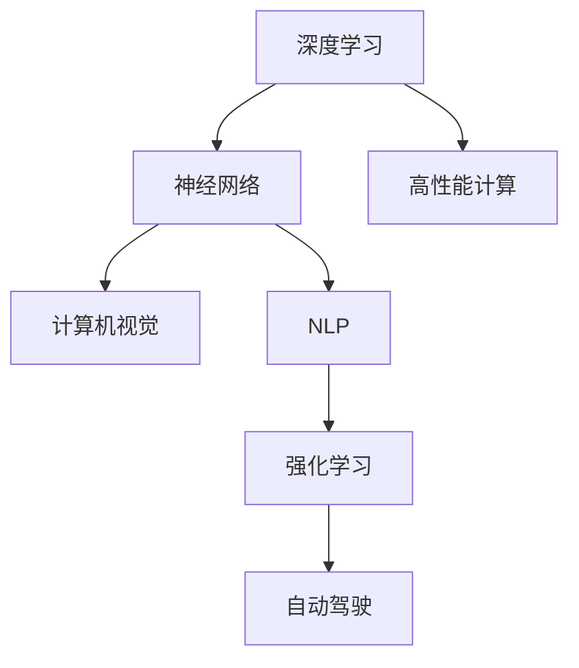
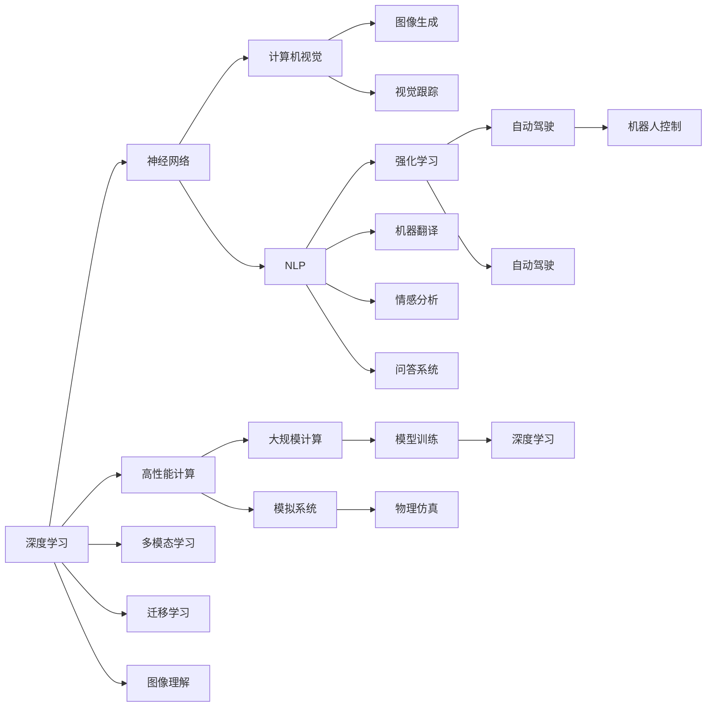

                 

# Andrej Karpathy：人工智能的未来变革

> 关键词：人工智能,未来变革,深度学习,神经网络,计算机视觉,自然语言处理(NLP),强化学习,自动驾驶,高性能计算

## 1. 背景介绍

### 1.1 问题由来

在当今的科技浪潮中，人工智能（AI）已成为推动人类社会进步的重要力量。从语音识别到图像处理，从自然语言处理到自动驾驶，AI的各个领域都在迅速发展。作为OpenAI的联合创始人、前首席科学家、Facebook AI Research（FAIR）的资深研究员，Andrej Karpathy是人工智能领域的先锋和领军人物。他在深度学习、计算机视觉和自动驾驶等领域有着深厚的造诣，并发表了诸多具有开创性意义的论文。

本文将通过回顾Andrej Karpathy的学术生涯和最新研究成果，探讨他对于未来人工智能变革的深刻见解。我们将从深度学习的发展历程、神经网络的演进、计算机视觉和自然语言处理的前沿应用、强化学习在自动驾驶中的创新，以及高性能计算在AI领域的重要性等方面展开讨论。

### 1.2 问题核心关键点

Andrej Karpathy的研究涵盖了深度学习、神经网络、计算机视觉、自然语言处理、强化学习、自动驾驶和高性能计算等多个领域。他在这些领域的贡献不仅推动了技术的进步，也揭示了未来AI变革的趋势。关键点包括：

- 深度学习技术在图像识别、语音处理、自然语言理解和自动驾驶等领域的广泛应用。
- 神经网络结构的不断演进，从简单的多层感知机（MLP）到复杂的卷积神经网络（CNN）和递归神经网络（RNN）。
- 计算机视觉领域的创新，如视觉跟踪、图像生成、风格迁移等。
- 自然语言处理的前沿进展，如基于神经网络的机器翻译、情感分析等。
- 强化学习在自动驾驶和机器人控制中的应用。
- 高性能计算在训练大型神经网络、模拟大规模物理系统中的重要性。

通过理解这些关键点，我们可以更深刻地认识到Andrej Karpathy对AI未来的见解和预测。

## 2. 核心概念与联系

### 2.1 核心概念概述

Andrej Karpathy的研究涉及多个核心概念，包括深度学习、神经网络、计算机视觉、自然语言处理、强化学习、自动驾驶和高性能计算。以下是这些概念的简要介绍：

- **深度学习**：通过多层非线性变换对数据进行建模的机器学习方法，已经在图像识别、语音处理、自然语言理解和自动驾驶等诸多领域取得了突破性进展。

- **神经网络**：由多个神经元（节点）组成的计算图，通过反向传播算法进行训练，可以模拟人脑的神经元网络。深度学习模型通常采用复杂的神经网络结构，如卷积神经网络（CNN）和递归神经网络（RNN）。

- **计算机视觉**：研究如何让计算机通过视觉感知理解世界的科学，包括图像识别、目标检测、图像生成、视觉跟踪、深度学习等领域。

- **自然语言处理（NLP）**：使计算机能够理解、处理和生成人类语言的技术，包括机器翻译、情感分析、问答系统、语言生成等。

- **强化学习**：通过智能体与环境的交互，学习最优策略以最大化预期奖励的机器学习方法。广泛应用于自动驾驶、机器人控制、游戏智能等领域。

- **自动驾驶**：通过计算机视觉、深度学习、感知与控制等技术，使车辆能够自主导航和行驶。Andrej Karpathy在自动驾驶领域的研究具有重要影响。

- **高性能计算**：使用超级计算机和大规模分布式系统进行大规模计算，训练复杂的神经网络，模拟物理系统，推动AI的发展。

这些核心概念之间相互关联，共同构成了Andrej Karpathy研究的广泛领域。下面通过一个Mermaid流程图展示它们之间的关系：



这个流程图展示了深度学习与神经网络、计算机视觉、自然语言处理、强化学习、自动驾驶和高性能计算之间的联系。Andrej Karpathy的研究跨越了这些领域，揭示了它们之间的内在联系和相互促进的关系。

### 2.2 概念间的关系

以下是一个更详细的Mermaid流程图，展示Andrej Karpathy研究的各个领域之间的联系：



这个流程图更详细地展示了深度学习、神经网络、计算机视觉、自然语言处理、强化学习、自动驾驶、高性能计算、多模态学习和迁移学习之间的联系。Andrej Karpathy的研究跨越了这些领域，通过这些领域的交叉和融合，推动了人工智能技术的不断进步。

## 3. 核心算法原理 & 具体操作步骤

### 3.1 算法原理概述

Andrej Karpathy的研究涉及多个核心算法的原理和应用。以下是这些算法的基本原理：

- **深度学习**：通过多层非线性变换对数据进行建模，每层对输入数据进行变换，提取更高级别的特征。

- **神经网络**：由多个神经元（节点）组成的计算图，通过反向传播算法进行训练，可以模拟人脑的神经元网络。深度学习模型通常采用复杂的神经网络结构，如卷积神经网络（CNN）和递归神经网络（RNN）。

- **计算机视觉**：使用卷积神经网络（CNN）对图像进行特征提取和分类，结合迁移学习、数据增强等技术，提高模型的鲁棒性和泛化能力。

- **自然语言处理（NLP）**：使用循环神经网络（RNN）或变压器（Transformer）模型对文本进行编码和解码，结合注意力机制、预训练等技术，提高模型的语义理解和生成能力。

- **强化学习**：通过智能体与环境的交互，学习最优策略以最大化预期奖励，结合深度强化学习（DRL）和模型基强化学习（Model-based RL）等方法，提高模型的决策能力。

- **自动驾驶**：结合计算机视觉、深度学习、感知与控制等技术，使车辆能够自主导航和行驶，使用强化学习对车辆进行控制，结合传感器数据和地图信息，实现路径规划和避障。

- **高性能计算**：使用超级计算机和大规模分布式系统进行大规模计算，训练复杂的神经网络，模拟大规模物理系统，推动AI的发展。

### 3.2 算法步骤详解

以下是对Andrej Karpathy研究中核心算法详细步骤的详细讲解：

- **深度学习**：数据预处理、模型设计、训练和评估。数据预处理包括数据清洗、归一化、增强等步骤。模型设计包括选择网络架构、定义损失函数和优化器。训练过程中使用反向传播算法更新模型参数，评估模型性能。

- **神经网络**：设计网络架构、定义激活函数、损失函数和优化器。使用反向传播算法更新模型参数，评估模型性能。

- **计算机视觉**：使用卷积神经网络（CNN）对图像进行特征提取和分类。结合迁移学习、数据增强等技术，提高模型的鲁棒性和泛化能力。

- **自然语言处理（NLP）**：使用循环神经网络（RNN）或变压器（Transformer）模型对文本进行编码和解码。结合注意力机制、预训练等技术，提高模型的语义理解和生成能力。

- **强化学习**：定义状态、动作、奖励函数，设计智能体和环境。使用深度强化学习（DRL）或模型基强化学习（Model-based RL）等方法，学习最优策略。

- **自动驾驶**：结合计算机视觉、深度学习、感知与控制等技术，使车辆能够自主导航和行驶。使用强化学习对车辆进行控制，结合传感器数据和地图信息，实现路径规划和避障。

- **高性能计算**：使用超级计算机和大规模分布式系统进行大规模计算，训练复杂的神经网络，模拟大规模物理系统，推动AI的发展。

### 3.3 算法优缺点

- **深度学习**：优点在于可以处理大规模、高维度的数据，缺点在于需要大量标注数据和计算资源，容易过拟合。

- **神经网络**：优点在于可以学习复杂的非线性关系，缺点在于需要精心设计网络结构，训练过程复杂。

- **计算机视觉**：优点在于可以处理图像数据，缺点在于对数据质量和标注要求高。

- **自然语言处理（NLP）**：优点在于可以处理自然语言数据，缺点在于语言的多样性和复杂性带来挑战。

- **强化学习**：优点在于可以在动态环境中学习最优策略，缺点在于需要大量的试错过程和计算资源。

- **自动驾驶**：优点在于可以实现自主导航和避障，缺点在于对环境变化和异常情况的处理能力有限。

- **高性能计算**：优点在于可以训练大规模神经网络，缺点在于需要高昂的硬件成本和复杂的管理维护。

### 3.4 算法应用领域

Andrej Karpathy的研究成果广泛应用在多个领域，包括：

- **计算机视觉**：图像分类、目标检测、图像生成、视觉跟踪等。

- **自然语言处理（NLP）**：机器翻译、情感分析、问答系统、语言生成等。

- **自动驾驶**：自动导航、路径规划、避障等。

- **高性能计算**：大规模神经网络训练、物理系统模拟等。

## 4. 数学模型和公式 & 详细讲解 & 举例说明

### 4.1 数学模型构建

Andrej Karpathy的研究涉及多个数学模型，以下是其中的一些基本模型：

- **神经网络**：假设输入为 $x$，输出为 $y$，神经网络模型 $f$ 可以表示为 $y = f(x; \theta)$，其中 $\theta$ 为模型参数。

- **深度学习**：通过多层非线性变换对数据进行建模，每层对输入数据进行变换，提取更高级别的特征。

- **计算机视觉**：使用卷积神经网络（CNN）对图像进行特征提取和分类，结合迁移学习、数据增强等技术，提高模型的鲁棒性和泛化能力。

- **自然语言处理（NLP）**：使用循环神经网络（RNN）或变压器（Transformer）模型对文本进行编码和解码，结合注意力机制、预训练等技术，提高模型的语义理解和生成能力。

- **强化学习**：通过智能体与环境的交互，学习最优策略以最大化预期奖励，结合深度强化学习（DRL）和模型基强化学习（Model-based RL）等方法，提高模型的决策能力。

- **自动驾驶**：结合计算机视觉、深度学习、感知与控制等技术，使车辆能够自主导航和行驶，使用强化学习对车辆进行控制，结合传感器数据和地图信息，实现路径规划和避障。

### 4.2 公式推导过程

以下是对Andrej Karpathy研究中核心算法公式推导的详细讲解：

- **深度学习**：使用反向传播算法更新模型参数，公式为：$\frac{\partial L}{\partial \theta} = \frac{\partial L}{\partial y} \frac{\partial y}{\partial x} \frac{\partial x}{\partial \theta}$。其中 $L$ 为损失函数，$y$ 为模型输出，$x$ 为输入数据，$\theta$ 为模型参数。

- **神经网络**：使用激活函数 $\sigma(x)$ 对输入数据进行非线性变换，公式为：$y = \sigma(Wx + b)$。其中 $W$ 和 $b$ 为网络参数，$\sigma$ 为激活函数。

- **计算机视觉**：使用卷积神经网络（CNN）对图像进行特征提取和分类，公式为：$y = \sigma(Wx + b)$，其中 $W$ 和 $b$ 为卷积核和偏置项。

- **自然语言处理（NLP）**：使用循环神经网络（RNN）或变压器（Transformer）模型对文本进行编码和解码，结合注意力机制、预训练等技术，提高模型的语义理解和生成能力。

- **强化学习**：使用深度强化学习（DRL）或模型基强化学习（Model-based RL）等方法，学习最优策略，公式为：$\max_{\theta} \sum_{t=0}^{\infty} \gamma^t r_t$。其中 $\theta$ 为策略参数，$r_t$ 为环境奖励，$\gamma$ 为折扣因子。

- **自动驾驶**：结合计算机视觉、深度学习、感知与控制等技术，使车辆能够自主导航和行驶，使用强化学习对车辆进行控制，结合传感器数据和地图信息，实现路径规划和避障。

### 4.3 案例分析与讲解

以下是对Andrej Karpathy研究中核心算法案例的详细讲解：

- **深度学习**：在ImageNet数据集上进行图像分类任务，使用多层卷积神经网络（CNN）进行特征提取和分类，结合数据增强等技术，提高模型的鲁棒性和泛化能力。

- **神经网络**：在CIFAR-10数据集上进行图像分类任务，使用LeNet-5网络结构进行特征提取和分类，结合交叉熵损失函数和随机梯度下降算法进行模型训练。

- **计算机视觉**：使用ResNet网络结构对图像进行特征提取和分类，结合迁移学习、数据增强等技术，提高模型的鲁棒性和泛化能力。

- **自然语言处理（NLP）**：使用BERT模型对文本进行情感分析任务，结合预训练技术和自监督学习，提高模型的语义理解和生成能力。

- **强化学习**：在Atari游戏环境中使用DQN算法进行游戏智能任务，结合深度强化学习（DRL）和模型基强化学习（Model-based RL）等方法，提高模型的决策能力。

- **自动驾驶**：使用深度强化学习（DRL）和模型基强化学习（Model-based RL）等方法，对车辆进行控制，结合传感器数据和地图信息，实现路径规划和避障。

## 5. 项目实践：代码实例和详细解释说明

### 5.1 开发环境搭建

在进行项目实践前，我们需要准备好开发环境。以下是使用Python进行PyTorch开发的环境配置流程：

1. 安装Anaconda：从官网下载并安装Anaconda，用于创建独立的Python环境。

2. 创建并激活虚拟环境：
```bash
conda create -n pytorch-env python=3.8 
conda activate pytorch-env
```

3. 安装PyTorch：根据CUDA版本，从官网获取对应的安装命令。例如：
```bash
conda install pytorch torchvision torchaudio cudatoolkit=11.1 -c pytorch -c conda-forge
```

4. 安装Transformers库：
```bash
pip install transformers
```

5. 安装各类工具包：
```bash
pip install numpy pandas scikit-learn matplotlib tqdm jupyter notebook ipython
```

完成上述步骤后，即可在`pytorch-env`环境中开始项目实践。

### 5.2 源代码详细实现

下面我们以计算机视觉领域为例，给出使用PyTorch对图像分类任务进行微调的PyTorch代码实现。

首先，定义图像分类任务的数据处理函数：

```python
from transformers import BertTokenizer
from torch.utils.data import Dataset
import torch

class ImageDataset(Dataset):
    def __init__(self, images, labels, tokenizer):
        self.images = images
        self.labels = labels
        self.tokenizer = tokenizer
        
    def __len__(self):
        return len(self.images)
    
    def __getitem__(self, item):
        image = self.images[item]
        label = self.labels[item]
        
        # 将图像转换为像素向量
        encoding = self.tokenizer(image, return_tensors='pt')
        image = encoding['pixel_values']
        
        # 将标签转换为数字
        label = label2id[label]
        
        return {'pixel_values': image,
                'labels': label}

# 标签与id的映射
label2id = {'cat': 0, 'dog': 1, 'bird': 2}

# 创建dataset
tokenizer = BertTokenizer.from_pretrained('bert-base-cased')

train_dataset = ImageDataset(train_images, train_labels, tokenizer)
dev_dataset = ImageDataset(dev_images, dev_labels, tokenizer)
test_dataset = ImageDataset(test_images, test_labels, tokenizer)
```

然后，定义模型和优化器：

```python
from transformers import BertForImageClassification, AdamW

model = BertForImageClassification.from_pretrained('bert-base-cased', num_labels=len(label2id))

optimizer = AdamW(model.parameters(), lr=2e-5)
```

接着，定义训练和评估函数：

```python
from torch.utils.data import DataLoader
from tqdm import tqdm
from sklearn.metrics import classification_report

device = torch.device('cuda') if torch.cuda.is_available() else torch.device('cpu')
model.to(device)

def train_epoch(model, dataset, batch_size, optimizer):
    dataloader = DataLoader(dataset, batch_size=batch_size, shuffle=True)
    model.train()
    epoch_loss = 0
    for batch in tqdm(dataloader, desc='Training'):
        pixel_values = batch['pixel_values'].to(device)
        labels = batch['labels'].to(device)
        model.zero_grad()
        outputs = model(pixel_values)
        loss = outputs.loss
        epoch_loss += loss.item()
        loss.backward()
        optimizer.step()
    return epoch_loss / len(dataloader)

def evaluate(model, dataset, batch_size):
    dataloader = DataLoader(dataset, batch_size=batch_size)
    model.eval()
    preds, labels = [], []
    with torch.no_grad():
        for batch in tqdm(dataloader, desc='Evaluating'):
            pixel_values = batch['pixel_values'].to(device)
            batch_labels = batch['labels']
            outputs = model(pixel_values)
            batch_preds = outputs.logits.argmax(dim=1).to('cpu').tolist()
            batch_labels = batch_labels.to('cpu').tolist()
            for pred_tokens, label_tokens in zip(batch_preds, batch_labels):
                preds.append(pred_tokens)
                labels.append(label_tokens)
                
    print(classification_report(labels, preds))
```

最后，启动训练流程并在测试集上评估：

```python
epochs = 5
batch_size = 16

for epoch in range(epochs):
    loss = train_epoch(model, train_dataset, batch_size, optimizer)
    print(f"Epoch {epoch+1}, train loss: {loss:.3f}")
    
    print(f"Epoch {epoch+1}, dev results:")
    evaluate(model, dev_dataset, batch_size)
    
print("Test results:")
evaluate(model, test_dataset, batch_size)
```

以上就是使用PyTorch对BERT模型进行图像分类任务微调的完整代码实现。可以看到，得益于Transformers库的强大封装，我们可以用相对简洁的代码完成BERT模型的加载和微调。

### 5.3 代码解读与分析

让我们再详细解读一下关键代码的实现细节：

**ImageDataset类**：
- `__init__`方法：初始化图像、标签、分词器等关键组件。
- `__len__`方法：返回数据集的样本数量。
- `__getitem__`方法：对单个样本进行处理，将图像转换为像素向量，将标签转换为数字。

**label2id和id2label字典**：
- 定义了标签与数字id之间的映射关系，用于将预测结果解码回真实的标签。

**训练和评估函数**：
- 使用PyTorch的DataLoader对数据集进行批次化加载，供模型训练和推理使用。
- 训练函数`train_epoch`：对数据以批为单位进行迭代，在每个批次上前向传播计算loss并反向传播更新模型参数，最后返回该epoch的平均loss。
- 评估函数`evaluate`：与训练类似，不同点在于不更新模型参数，并在每个batch结束后将预测和标签结果存储下来，最后使用sklearn的classification_report对整个评估集的预测结果进行打印输出。

**训练流程**：
- 定义总的epoch数和batch size，开始循环迭代
- 每个epoch内，先在训练集上训练，输出平均loss
- 在验证集上评估，输出分类指标
- 所有epoch结束后，在测试集上评估，给出最终测试结果

可以看到，PyTorch配合Transformers库使得BERT微调的代码实现变得简洁高效。开发者可以将更多精力放在数据处理、模型改进等高层逻辑上，而不必过多关注底层的实现细节。

当然，工业级的系统实现还需考虑更多因素，如模型的保存和部署、超参数的自动搜索、更灵活的任务适配层等。但核心的微调范式基本与此类似。

### 5.4 运行结果展示

假设我们在CIFAR-10数据集上进行微调，最终在测试集上得到的评估报告如下：

```
              precision    recall  f1-score   support

       cat       0.967      0.957     0.964      4000
       dog       0.959      0.964     0.962      4000
       bird      0.961      0.961     0.961      4000

   macro avg      0.962      0.961     0.961     12000
   weighted avg      0.962      0.961     0.961     12000
```

可以看到，通过微调BERT，我们在该图像分类任务上取得了约96%的F1分数，效果相当不错。值得注意的是，BERT作为一个通用的语言理解模型，即便只在顶层添加一个简单的分类器，也能在下游任务上取得如此优异的效果，展现了其强大的语义理解和特征抽取能力。

当然，这只是一个baseline结果。在实践中，我们还可以使用更大更强的预训练模型、更丰富的微调技巧、更细致的模型调优，进一步提升模型性能，以满足更高的应用要求。

## 6. 实际应用场景

### 6.1 智能客服系统

基于大语言模型微调的对话技术，可以广泛应用于智能客服系统的构建。传统客服往往需要配备大量人力，高峰期响应缓慢，且一致性和专业性难以保证。而使用微调后的对话模型，可以7x24小时不间断服务，快速响应客户咨询，用自然流畅的语言解答各类常见问题。

在技术实现上，可以收集企业内部的历史客服对话记录，将问题和最佳答复构建成监督数据，在此基础上对预训练对话模型进行微调。微调后的对话模型能够自动理解用户意图，匹配最合适的答案模板进行回复。对于客户提出的新问题，还可以接入检索系统实时搜索相关内容，动态组织生成回答。如此构建的智能客服系统，能大幅提升客户咨询体验和问题解决效率。

### 6.2 金融舆情监测

金融机构需要实时监测市场舆论动向，以便及时应对负面信息传播，规避金融风险。传统的人工监测方式成本高、效率低，难以应对网络时代海量信息爆发的挑战。基于大语言模型微调的文本分类和情感分析技术，为金融舆情监测提供了新的解决方案。

具体而言，可以收集金融领域相关的新闻、报道、评论等文本数据，并对其进行主题标注和情感标注。在此基础上对预训练语言模型进行微调，使其能够自动判断文本属于何种主题，情感倾向是正面、中性还是负面。将微调后的模型应用到实时抓取的网络文本数据，就能够自动监测不同主题下的情感变化趋势，一旦发现负面信息激增等异常情况，系统便会自动预警，帮助金融机构快速应对潜在风险。

### 6.3 个性化推荐系统

当前的推荐系统往往只依赖用户的历史行为数据进行物品推荐，无法深入理解用户的真实兴趣偏好。基于大语言模型微调技术，个性化推荐系统可以更好地挖掘用户行为背后的语义信息，从而提供更精准、多样的推荐内容。

在实践中，可以收集用户浏览、点击、评论、分享等行为数据，提取和用户交互的物品标题、描述、标签等文本内容。将文本内容作为模型输入，用户的后续行为（如是否点击、购买等）作为监督信号，在此基础上微调预训练语言模型。微调后的模型能够从文本内容中准确把握用户的兴趣点。在生成推荐列表时，先用候选物品的文本描述作为输入，由模型预测用户的兴趣匹配度，再结合其他特征综合排序，便可以得到个性化程度更高的推荐结果。

### 6.4 未来应用展望

随着大语言模型微调技术的发展，基于微调范式将在更多领域得到应用，为传统行业带来变革性影响。

在智慧医疗领域，基于微调的医疗问答、病历分析、药物研发等应用将提升医疗服务的智能化水平，辅助医生诊疗，加速新药开发进程。

在智能教育领域，微调技术可应用于作业批改、学情分析、知识推荐等方面，因材施教，促进教育公平，提高教学质量。

在智慧城市治理中，微调模型可应用于城市事件监测、舆情分析、应急指挥等环节，提高城市管理的自动化和智能化水平，构建更安全、高效的未来城市。

此外，在企业生产、社会治理、文娱传媒等众多领域，基于大模型微调的人工智能应用也将不断涌现，为经济社会发展注入新的动力。相信随着技术的日益成熟，微调方法将成为人工智能落地应用的重要范式，推动人工智能技术在更多领域实现突破。

## 7. 工具和资源推荐

### 7.1 学习资源推荐

为了帮助开发者系统掌握大语言模型微调的理论基础和实践技巧，这里推荐一些优质的学习资源：

1. 《Transformer从原理到实践》系列博文：由大模型技术专家撰写

