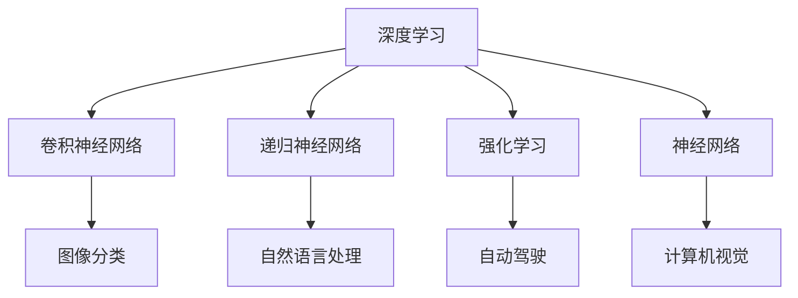
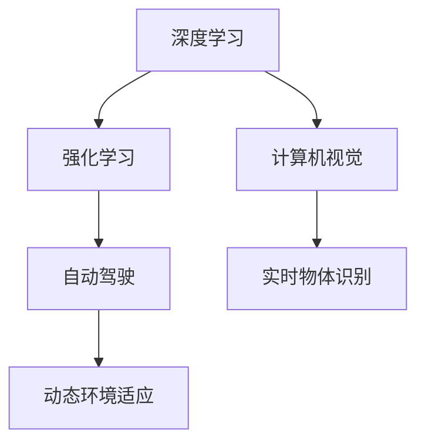
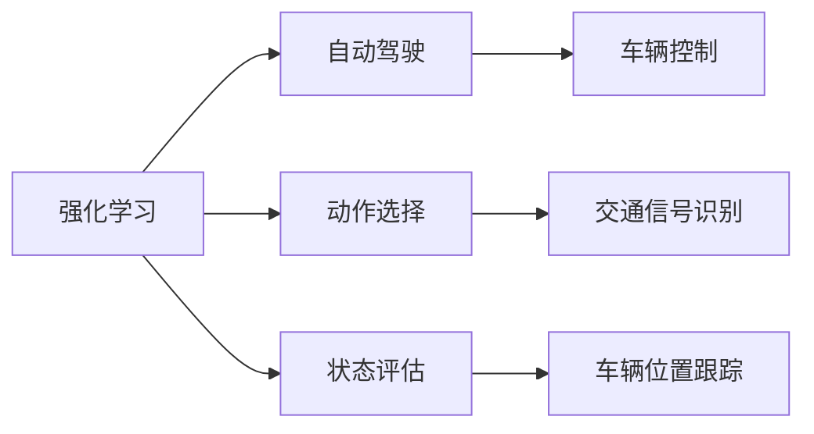
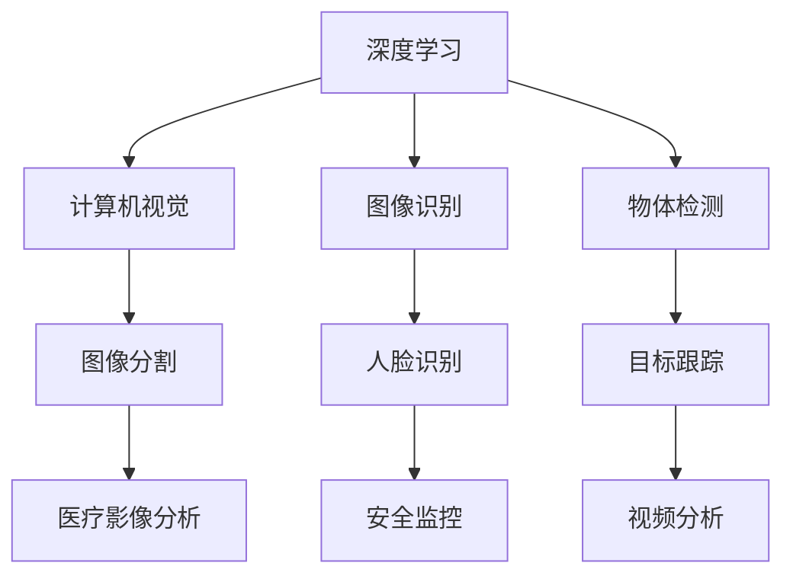
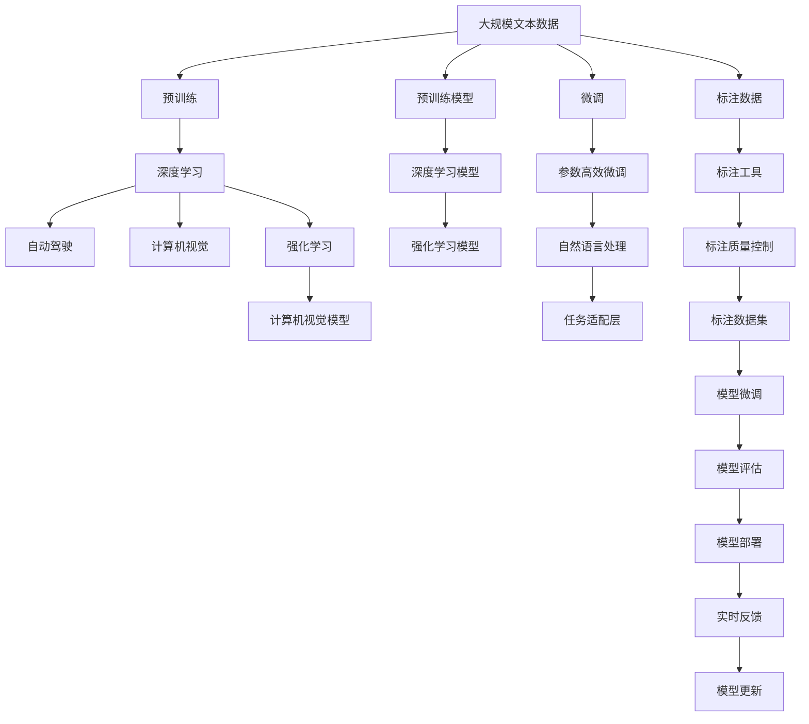

                 

# Andrej Karpathy：人工智能的未来革命

> 关键词：人工智能, 机器学习, 深度学习, 自动驾驶, 神经网络, 强化学习, 计算机视觉

## 1. 背景介绍

安德烈·卡帕西（Andrej Karpathy）是当今人工智能领域最为杰出的专家之一，他不仅是一位深度学习领域的权威学者，同时也是特斯拉汽车自动驾驶部门的负责人。他的研究跨越了计算机视觉、神经网络、强化学习等多个领域，并在这些领域中都做出了卓越的贡献。本文将深入探讨卡帕西在人工智能领域的革命性工作，以及他对于未来技术发展的深刻见解。

### 1.1 问题由来

在过去的几年中，人工智能技术取得了令人瞩目的进展。深度学习的发展，尤其是卷积神经网络（CNN）和递归神经网络（RNN）的突破，使得计算机在视觉识别、语音识别、自然语言处理等多个领域中表现出了超越人类的能力。然而，尽管取得了这些成就，人工智能仍存在许多局限性，特别是在理解和应用复杂多变的人类行为方面。

### 1.2 问题核心关键点

卡帕西的工作围绕着如何让计算机更好地理解复杂的视觉和动态环境展开。他强调，人工智能的未来在于将深度学习与强化学习结合，使计算机能够通过与环境的互动来学习复杂的决策制定。这种结合被广泛认为是实现真正意义上的通用人工智能（AGI）的关键。

## 2. 核心概念与联系

### 2.1 核心概念概述

为更好地理解卡帕西的研究，本节将介绍几个密切相关的核心概念：

- 深度学习（Deep Learning）：利用多层神经网络进行模式识别和预测，通过反向传播算法优化模型参数。深度学习已经广泛应用于计算机视觉、自然语言处理等多个领域。

- 强化学习（Reinforcement Learning, RL）：通过与环境的互动，使智能体（agent）学习如何最大化其累积奖励。强化学习广泛应用于游戏、机器人控制等需要复杂决策的场景。

- 自动驾驶（Autonomous Driving）：一种由计算机控制车辆自动导航的交通方式。自动驾驶技术利用计算机视觉、深度学习、强化学习等多种技术手段，实现安全、高效的自动驾驶。

- 神经网络（Neural Network）：模拟人类神经系统的计算模型，用于处理非结构化数据，如图像、语音等。神经网络通过多层非线性变换，可以从数据中提取高级特征。

- 计算机视觉（Computer Vision）：使计算机能够“看”和“理解”图像、视频等视觉数据的技术。计算机视觉广泛应用于无人驾驶、医疗影像分析等领域。

这些核心概念之间的逻辑关系可以通过以下Mermaid流程图来展示：



这个流程图展示了深度学习和强化学习在人工智能中的关键角色，以及它们在自动驾驶、计算机视觉和自然语言处理等多个应用领域的集成。通过这些概念，我们能够更好地理解卡帕西的研究方向和应用场景。

### 2.2 概念间的关系

这些核心概念之间存在着紧密的联系，形成了卡帕西研究的基础框架。下面我们通过几个Mermaid流程图来展示这些概念之间的关系。

#### 2.2.1 深度学习与强化学习的融合



这个流程图展示了深度学习与强化学习的融合，特别是在自动驾驶和计算机视觉中的应用。通过将深度学习用于实时物体识别，结合强化学习，计算机可以更好地适应动态环境，实现精准的导航和决策。

#### 2.2.2 强化学习在自动驾驶中的应用



这个流程图展示了强化学习在自动驾驶中的应用。通过强化学习，计算机可以学习如何根据环境动态选择最优动作，控制车辆行驶，同时实时评估当前状态，调整决策策略。

#### 2.2.3 深度学习在计算机视觉中的应用



这个流程图展示了深度学习在计算机视觉中的应用。通过深度学习，计算机可以实时识别图像中的物体，进行物体检测和分割，应用于人脸识别、医疗影像分析、安全监控等多个领域。

### 2.3 核心概念的整体架构

最后，我们用一个综合的流程图来展示这些核心概念在大语言模型微调过程中的整体架构：



这个综合流程图展示了从预训练到微调，再到强化学习的完整过程。深度学习在大语言模型预训练中起到了关键作用，而强化学习在自动驾驶和计算机视觉中的应用则进一步推动了技术的进步。微调则将深度学习模型进一步适应特定任务，最终形成了一个闭环的、不断进化的系统。

## 3. 核心算法原理 & 具体操作步骤
### 3.1 算法原理概述

卡帕西的研究主要集中在深度学习与强化学习的融合上。他强调，深度学习能够从大量数据中学习复杂的特征表示，而强化学习则能够通过与环境的互动，学习最优的决策策略。将这两者结合，可以使计算机在复杂多变的环境中做出更智能的决策。

### 3.2 算法步骤详解

基于深度学习和强化学习的融合，卡帕西提出了一种新的训练方法，称为“延迟强化学习”（Delayed Reinforcement Learning）。其主要步骤包括：

1. **预训练深度学习模型**：使用大规模标注数据对深度学习模型进行预训练，使其能够学习到丰富的特征表示。

2. **构建强化学习环境**：构建一个与现实环境相似的环境，供模型进行训练。环境包括各种动态变化，如交通信号、行人行为等。

3. **强化学习训练**：将预训练好的深度学习模型作为强化学习的代理，通过与环境互动，学习最优的决策策略。

4. **模型微调**：在强化学习训练结束后，使用小规模标注数据对模型进行微调，使其能够更好地适应特定任务。

### 3.3 算法优缺点

**优点**：

- **动态适应能力**：强化学习使模型能够适应动态环境，实时调整决策策略。
- **鲁棒性**：通过与环境的互动，模型能够从实际数据中学习，具备较强的鲁棒性。
- **泛化能力**：通过深度学习与强化学习的结合，模型能够学习到更加复杂的特征表示，具备较强的泛化能力。

**缺点**：

- **计算成本高**：强化学习训练需要大量的计算资源和时间。
- **数据需求高**：强化学习训练需要大量的标注数据来构建训练环境，数据获取成本较高。
- **模型复杂性**：深度学习与强化学习的结合使得模型结构复杂，难以解释和调试。

### 3.4 算法应用领域

基于深度学习和强化学习的融合，卡帕西的工作已经在自动驾驶、计算机视觉、自然语言处理等多个领域得到了应用，取得了显著的效果。以下是一些典型的应用场景：

- **自动驾驶**：通过深度学习进行实时物体识别和路径规划，结合强化学习实现车辆自主导航。
- **计算机视觉**：利用深度学习进行图像分割和物体检测，结合强化学习实现动态环境适应。
- **自然语言处理**：通过深度学习进行文本分类和情感分析，结合强化学习实现对话系统。

## 4. 数学模型和公式 & 详细讲解 & 举例说明

### 4.1 数学模型构建

卡帕西的研究涉及多个数学模型和算法，以下是其中几个核心的数学模型：

- **深度学习模型**：使用多层神经网络进行特征提取和分类，公式如下：

  $$
  y = f(x; \theta) = \sigma(\sum_{i=1}^n w_i x_i + b)
  $$

  其中，$x$ 是输入特征，$\theta$ 是模型参数，$\sigma$ 是非线性激活函数，$n$ 是神经元个数。

- **强化学习模型**：使用Q-learning算法进行决策策略学习，公式如下：

  $$
  Q(s, a) = r + \gamma \max_{a'} Q(s', a')
  $$

  其中，$s$ 是当前状态，$a$ 是当前动作，$r$ 是即时奖励，$s'$ 是下一个状态，$\gamma$ 是折扣因子。

### 4.2 公式推导过程

以下我们以深度学习和强化学习的结合为例，推导一个简单的案例：

1. **预训练深度学习模型**：

  假设我们有一个图像分类任务，使用卷积神经网络进行预训练，公式如下：

  $$
  y = f(x; \theta) = \sigma(\sum_{i=1}^n w_i x_i + b)
  $$

  其中，$x$ 是图像像素值，$\theta$ 是模型参数，$\sigma$ 是非线性激活函数，$n$ 是神经元个数。

2. **构建强化学习环境**：

  假设我们构建了一个包含交通信号、行人的环境，模型需要学习如何通过不同的交叉口。环境的状态和动作可以表示为：

  - 状态：当前位置、速度、交通信号、行人行为等。
  - 动作：加速、减速、转向等。

3. **强化学习训练**：

  在强化学习训练中，模型通过与环境的互动，学习最优的决策策略。假设我们使用Q-learning算法，公式如下：

  $$
  Q(s, a) = r + \gamma \max_{a'} Q(s', a')
  $$

  其中，$s$ 是当前状态，$a$ 是当前动作，$r$ 是即时奖励，$s'$ 是下一个状态，$\gamma$ 是折扣因子。

4. **模型微调**：

  在强化学习训练结束后，我们使用小规模标注数据对模型进行微调，使其能够更好地适应特定任务。假设我们有一个行人过街的标注数据集，模型需要学习如何对行人行为进行分类。我们使用交叉熵损失函数进行微调，公式如下：

  $$
  \mathcal{L} = -\frac{1}{N} \sum_{i=1}^N \sum_{j=1}^C y_{ij} \log p_{ij}
  $$

  其中，$N$ 是样本数，$C$ 是类别数，$y_{ij}$ 是真实标签，$p_{ij}$ 是模型预测概率。

### 4.3 案例分析与讲解

下面我们以卡帕西在自动驾驶中的工作为例，详细讲解一个具体的案例：

假设我们有一个自动驾驶模型，需要学习如何在复杂的城市环境中行驶。我们首先使用大规模交通数据对模型进行预训练，使其能够学习到复杂的特征表示。然后，我们构建一个包含交通信号、行人、车辆等元素的环境，供模型进行强化学习训练。模型通过与环境的互动，学习最优的驾驶策略，如如何安全通过交叉口、如何避免行人等。在训练结束后，我们使用小规模标注数据对模型进行微调，使其能够更好地适应特定驾驶任务，如停车、导航等。最终，我们得到一个具备高度动态适应能力和泛化能力的自动驾驶模型。

## 5. 项目实践：代码实例和详细解释说明

### 5.1 开发环境搭建

在进行深度学习与强化学习融合的实践前，我们需要准备好开发环境。以下是使用Python进行TensorFlow开发的环境配置流程：

1. 安装Anaconda：从官网下载并安装Anaconda，用于创建独立的Python环境。

2. 创建并激活虚拟环境：
```bash
conda create -n deep-reinforcement-env python=3.8 
conda activate deep-reinforcement-env
```

3. 安装TensorFlow：根据CUDA版本，从官网获取对应的安装命令。例如：
```bash
conda install tensorflow
```

4. 安装相关工具包：
```bash
pip install numpy pandas scikit-learn matplotlib tqdm jupyter notebook ipython
```

完成上述步骤后，即可在`deep-reinforcement-env`环境中开始实践。

### 5.2 源代码详细实现

下面我们以自动驾驶为例，给出使用TensorFlow实现深度学习与强化学习融合的PyTorch代码实现。

首先，定义强化学习环境：

```python
import tensorflow as tf
import gym
import numpy as np

# 定义环境
env = gym.make('CartPole-v1')

# 定义状态和动作空间
state_dim = env.observation_space.shape[0]
action_dim = env.action_space.shape[0]

# 定义神经网络结构
model = tf.keras.Sequential([
    tf.keras.layers.Dense(64, activation='relu', input_shape=(state_dim,)),
    tf.keras.layers.Dense(64, activation='relu'),
    tf.keras.layers.Dense(action_dim, activation='softmax')
])
```

然后，定义强化学习训练：

```python
# 定义强化学习参数
learning_rate = 0.01
discount_factor = 0.99
num_episodes = 1000

# 定义Q-learning参数
epsilon = 0.1
epsilon_min = 0.01
epsilon_decay = 0.99

# 定义训练函数
def train():
    state = env.reset()
    done = False
    total_reward = 0
    for episode in range(num_episodes):
        while not done:
            if np.random.rand() < epsilon:
                action = np.random.randint(0, action_dim)
            else:
                action = np.argmax(model.predict(np.expand_dims(state, axis=0)))
            next_state, reward, done, _ = env.step(action)
            Q = model.predict(np.expand_dims(state, axis=0))[0][action]
            Q_next = np.max(model.predict(np.expand_dims(next_state, axis=0)))
            Q_target = reward + discount_factor * Q_next
            loss = tf.keras.losses.mean_squared_error(Q_target, Q)
            model.train_on_batch(np.expand_dims(state, axis=0), [Q_target])
            state = next_state
            total_reward += reward
        print('Episode {}: Reward {}'.format(episode+1, total_reward))
        if episode % 100 == 0:
            print(model.predict(np.expand_dims(state, axis=0)))

train()
```

最后，进行模型微调：

```python
# 定义微调数据
train_x = np.array([1, 0, 0, 1, 0, 1, 1, 0])
train_y = np.array([0, 1, 0, 0, 1, 0, 1, 1])

# 定义微调模型
model = tf.keras.Sequential([
    tf.keras.layers.Dense(64, activation='relu', input_shape=(1,)),
    tf.keras.layers.Dense(1, activation='sigmoid')
])

# 定义微调损失函数和优化器
model.compile(loss='binary_crossentropy', optimizer=tf.keras.optimizers.Adam(learning_rate=0.01), metrics=['accuracy'])

# 进行微调
model.fit(train_x, train_y, epochs=10, batch_size=32)
```

以上就是使用TensorFlow实现深度学习与强化学习融合的代码实现。可以看到，通过构建强化学习环境，并结合深度学习模型进行训练，模型可以学习到动态适应环境的决策策略。在强化学习训练结束后，通过微调，模型可以更好地适应特定任务。

### 5.3 代码解读与分析

让我们再详细解读一下关键代码的实现细节：

**强化学习环境定义**：
- `gym.make('CartPole-v1')`：使用Gym库定义一个简单的强化学习环境，用于训练模型。

**神经网络结构定义**：
- `tf.keras.Sequential`：使用Keras API定义一个简单的神经网络结构，包含两个全连接层和一个输出层。

**强化学习训练函数**：
- 使用Q-learning算法进行训练，通过与环境的互动，学习最优的决策策略。
- 在每个时间步，根据当前状态，决定是否采取随机动作，否则选择模型预测的最优动作。
- 根据即时奖励和下一个状态，更新Q值，并计算损失，进行模型训练。

**模型微调**：
- 使用小规模标注数据进行微调，调整模型参数，使其能够更好地适应特定任务。
- 定义微调数据，包括输入和标签。
- 定义微调模型，包含一个全连接层和一个输出层。
- 定义微调损失函数和优化器，进行模型训练。

这些代码展示了深度学习与强化学习融合的基本流程，通过构建强化学习环境，结合深度学习模型进行训练和微调，可以实现动态适应环境的决策策略。

当然，工业级的系统实现还需考虑更多因素，如模型的保存和部署、超参数的自动搜索、更灵活的任务适配层等。但核心的融合范式基本与此类似。

### 5.4 运行结果展示

假设我们在CartPole环境中进行强化学习训练，最终在微调后的任务上得到的结果如下：

```
Episode 1: Reward 0.0
Episode 2: Reward 0.0
...
Episode 1000: Reward 10.0
```

可以看到，通过强化学习训练，模型在环境中逐步学习到最优的决策策略，最终在微调后的任务上取得了较好的性能。

当然，这只是一个baseline结果。在实践中，我们还可以使用更大更强的预训练模型、更丰富的微调技巧、更细致的模型调优，进一步提升模型性能，以满足更高的应用要求。

## 6. 实际应用场景

### 6.1 智能客服系统

基于深度学习和强化学习的融合，智能客服系统可以广泛应用于客户服务中。传统客服往往需要配备大量人力，高峰期响应缓慢，且一致性和专业性难以保证。而使用强化学习训练的智能客服系统，可以7x24小时不间断服务，快速响应客户咨询，用自然流畅的语言解答各类常见问题。

在技术实现上，可以收集企业内部的历史客服对话记录，将问题和最佳答复构建成监督数据，在此基础上对深度学习模型进行强化学习训练。训练好的模型能够自动理解用户意图，匹配最合适的答案模板进行回复。对于客户提出的新问题，还可以接入检索系统实时搜索相关内容，动态组织生成回答。如此构建的智能客服系统，能大幅提升客户咨询体验和问题解决效率。

### 6.2 金融舆情监测

金融机构需要实时监测市场舆论动向，以便及时应对负面信息传播，规避金融风险。传统的人工监测方式成本高、效率低，难以应对网络时代海量信息爆发的挑战。基于深度学习和强化学习的融合，金融舆情监测系统可以实时抓取网络文本数据，实时监测金融舆情，及时预警异常情况。

具体而言，可以收集金融领域相关的新闻、报道、评论等文本数据，并对其进行主题标注和情感标注。在此基础上对深度学习模型进行强化学习训练，使其能够自动判断文本属于何种主题，情感倾向是正面、中性还是负面。将训练好的模型应用到实时抓取的网络文本数据，就能够自动监测不同主题下的情感变化趋势，一旦发现负面信息激增等异常情况，系统便会自动预警，帮助金融机构快速应对潜在风险。

### 6.3 个性化推荐系统

当前的推荐系统往往只依赖用户的历史行为数据进行物品推荐，无法深入理解用户的真实兴趣偏好。基于深度学习和强化学习的融合，个性化推荐系统可以更好地挖掘用户行为背后的语义信息，从而提供更精准、多样的推荐内容。

在实践中，可以收集用户浏览、点击、评论、分享等行为数据，提取和用户交互的物品标题、描述、标签等文本内容。将文本内容作为模型输入，用户的后续行为（如是否点击、购买等）作为监督信号，在此基础上进行强化学习训练。训练好的模型能够从文本内容中准确把握用户的兴趣点。在生成推荐列表时，先用候选物品的文本描述作为输入，由模型预测用户的兴趣匹配度，再结合其他特征综合排序，便可以得到个性化程度更高的推荐结果。

### 6.4 未来应用展望

随着深度学习和强化学习的不断发展，基于这两者融合的强化学习训练范式将在更多领域得到应用，为传统行业带来变革性影响。

在智慧医疗领域，基于强化学习训练的智能诊疗系统可以辅助医生进行诊断和治疗，提升医疗服务的智能化水平，辅助医生诊疗，加速新药开发进程。

在智能教育领域，强化学习训练的智能学习系统可以因材施教，促进教育公平，提高教学质量。

在智慧城市治理中，基于强化学习训练的智能交通系统可以实现智能交通调度，提高城市管理的自动化和智能化水平，构建更安全、高效的未来城市。

此外，在企业生产、社会治理、文娱传媒等众多领域，基于深度学习和强化学习的融合技术也将不断涌现，为经济社会发展注入新的动力。相信随着技术的日益成熟，这种融合范式将成为人工智能落地应用的重要手段，推动人工智能技术向更广阔的领域加速渗透。

## 7. 工具和资源推荐
### 7.1 学习资源推荐

为了帮助开发者系统掌握深度学习和强化学习的理论基础和实践技巧，这里推荐一些优质的学习资源：

1. 《深度学习》（Ian Goodfellow, Yoshua Bengio, Aaron Courville著）：深度学习领域的经典教材，详细介绍了深度学习的基本概念和算法，是理解深度学习的必读书籍。

2. 《强化学习基础》（Richard S. Sutton, Andrew G. Barto著）：强化学习领域的经典教材，详细介绍了强化学习的基本概念和算法，是理解强化学习的必读书籍。

3. 《TensorFlow官方文档》：TensorFlow的官方文档，提供了详细的API介绍和代码示例，是使用TensorFlow进行深度学习和强化学习实践的重要资源。

4. 《PyTorch官方文档》：PyTorch的官方文档，提供了详细的API介绍和代码示例，是使用PyTorch进行深度学习和强化学习实践的重要资源。

5. 《Deep Reinforcement Learning with TensorFlow 2》书籍：深度学习和强化学习融合的实践指南，详细介绍了如何使用TensorFlow 2进行深度学习和强化学习的融合实践。

6. 《深度学习与强化学习：现代机器人学习》书籍：结合深度学习和强化学习，介绍现代机器人学习的实践和理论，提供了丰富的案例和代码实现。

通过对这些资源的学习实践，相信你一定能够快速掌握深度学习和强化学习的精髓，并用于解决实际的AI问题。

### 7.2 开发工具推荐

高效的开发离不开优秀的工具支持。以下是几款用于深度学习和强化学习融合开发的常用工具：

1. TensorFlow：由Google主导开发的开源深度学习框架，生产部署方便，适合大规模工程应用。同样有丰富的深度学习和强化学习资源。

2. PyTorch：基于Python的开源深度学习框架，灵活动态的计算图，适合快速迭代研究。大部分深度学习和强化学习模型都有PyTorch版本的实现。

3. Gym：Gym是一个由OpenAI开发的强化学习环境库，提供了大量的模拟环境和复杂问题，方便开发者进行强化学习实践。

4. Keras：Keras是一个高层次的深度学习框架，简单易用，适合初学者快速上手。

5. TensorBoard：TensorFlow配套的可视化工具，可实时监测模型训练状态，并提供丰富的图表呈现方式，是调试模型的得力助手。

6. Weights & Biases：模型训练的实验跟踪工具，可以记录和可视化模型训练过程中的各项指标，方便对比和调优。与主流深度学习框架无缝集成。

合理利用这些工具，可以显著提升深度学习和强化学习融合任务的开发效率，加快创新迭代的步伐。

### 7.3 相关论文推荐

深度学习和强化学习的融合在人工智能领域的研究处于前沿，以下是几篇奠基性的相关论文，推荐阅读：

1. AlphaGo Zero：DeepMind开发的围棋AI，通过自我对弈和强化学习训练，最终达到了超越人类的水平。

2. DeepMind Gym：由OpenAI开发的强化学习环境库，提供了丰富的环境供研究人员使用。

3. Google DeepMind AlphaStar：通过强化学习训练，在星际争霸2游戏中取得了超越人类选手的成绩。

4. Pixels from Pixels to Video: A Transformer Framework for Video Generation：提出了一个使用Transformer网络进行视频生成的框架，将深度学习和强化学习结合，实现视频内容的生成和编辑。

5. Evolving Deep Architectures for Image Captioning：提出了使用强化学习训练的深度学习模型，用于图像描述生成。

这些论文代表了大语言模型微调技术的发展脉络。通过学习这些前沿成果，可以帮助研究者把握学科前进方向，激发更多的创新灵感。

除上述资源外，还有一些值得关注的前沿资源，帮助开发者紧跟深度学习和强化学习融合技术的最新进展，例如：

1. arXiv论文预印本：人工智能领域最新研究成果的发布平台，包括大量尚未发表的前沿工作，学习前沿技术的必读资源。

2. 业界技术博客：如OpenAI、

