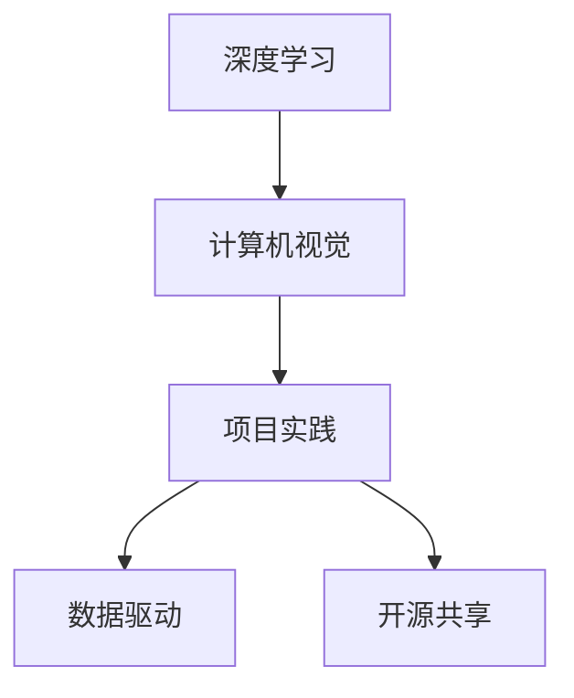

                 

# Andrej Karpathy：小项目成就奇迹

> 关键词：深度学习,计算机视觉,项目实践,Andrej Karpathy

## 1. 背景介绍

### 1.1 问题由来

Andrej Karpathy，作为一名计算机科学界的翘楚，其贡献贯穿于机器学习、深度学习、计算机视觉等多个领域。作为斯坦福大学的教授，Karpathy的研究成果及影响深远，其诸多研究项目已经成为工业界和学术界的经典之作。然而，大多数人对Karpathy的了解可能局限于他在深度学习领域所取得的研究成就，而鲜少关注那些在小项目中体现出的非凡才华。

Karpathy曾说过：“成功的项目不是一蹴而就的，而是由一个个小项目不断积累和迭代的结果。” 通过深入剖析Karpathy的一些小型研究项目，我们不仅能够洞察其研究思路和探索精神，更能够从中学习到成功项目背后的关键要素。

### 1.2 问题核心关键点

Karpathy的项目实践强调以下几个核心关键点：

- **高效迭代**：每一个项目都像一个实验，迅速验证并迭代；
- **数据驱动**：以数据为驱动，让模型自我学习；
- **跨学科融合**：融合多种学科的知识，创新性地解决问题；
- **开源共享**：重视开源项目，让更多人从中受益；
- **持续改进**：不断优化算法和模型，提高性能。

这些关键点贯穿于Karpathy的项目实践中，使得他的项目不仅具有高度的创新性，还具有极高的可复现性和实用性。

### 1.3 问题研究意义

Karpathy的项目实践不仅丰富了深度学习和计算机视觉的研究范式，还为后来的学者和开发者提供了宝贵的经验和指导。通过深入分析Karpathy的项目，我们可以更好地理解如何将理论知识应用于实际问题，并从中得到启发，推动自身的学习和研究工作。

本文将聚焦于Karpathy的几个代表性小项目，详细解读其原理、步骤、优缺点和应用领域，并结合实际案例，探讨其对于深度学习和计算机视觉领域的深远影响。

## 2. 核心概念与联系

### 2.1 核心概念概述

Karpathy的项目实践涉及多个核心概念，包括：

- **深度学习**：通过多层神经网络模型，实现对复杂数据的高效建模和处理。
- **计算机视觉**：利用计算机技术处理和分析图像、视频等视觉数据。
- **项目实践**：通过具体项目验证理论，迭代优化模型和算法。
- **数据驱动**：以数据为实验依据，让模型自动学习优化。
- **开源共享**：将项目代码和研究成果公开，促进社区协作和进步。

这些概念通过以下Mermaid流程图进行了展示：



这些概念相互交织，构成了Karpathy项目实践的核心生态系统。通过高效迭代、数据驱动、跨学科融合等方式，Karpathy将深度学习和计算机视觉的研究成果转化为具体的实践项目，实现了理论知识在实际应用中的转化。

### 2.2 概念间的关系

这些核心概念之间存在紧密的联系：

- 深度学习和计算机视觉是Karpathy项目实践的基础，提供数据处理和模型优化的技术支撑。
- 项目实践是理论应用和模型验证的具体体现，通过实际问题推动技术创新。
- 数据驱动和开源共享则确保了项目实践的可复现性和开放性，促进了社区的协作和知识共享。

## 3. 核心算法原理 & 具体操作步骤
### 3.1 算法原理概述

Karpathy的项目实践注重高效迭代和数据驱动，其核心算法原理可以概括为以下几个步骤：

1. **数据收集**：收集和标注数据集，确保数据的丰富性和多样性。
2. **模型选择**：选择适合的深度学习模型，并根据项目需求进行微调。
3. **算法优化**：使用数据驱动的优化方法，不断调整模型参数和结构，提升模型性能。
4. **项目验证**：在实际应用中验证模型的效果，并进行迭代优化。
5. **开源共享**：将项目代码和研究成果公开，供其他人参考和复现。

### 3.2 算法步骤详解

以下是Karpathy项目实践中的具体步骤：

1. **数据收集和预处理**：
   - 确保数据集的多样性和丰富性，涵盖不同类型和场景的视觉数据。
   - 使用数据增强技术，如旋转、裁剪、缩放等，扩充数据集。
   - 进行数据标注，确保数据集中每个样本的标注准确无误。

2. **模型选择和微调**：
   - 根据项目需求选择适合的深度学习模型，如卷积神经网络（CNN）、循环神经网络（RNN）等。
   - 对模型进行预训练，利用大规模无标签数据进行自监督学习。
   - 针对项目具体任务进行微调，使用少量标注数据进行有监督学习，优化模型性能。

3. **算法优化和验证**：
   - 使用数据驱动的优化方法，如梯度下降、Adam等，不断调整模型参数和结构。
   - 在实际应用场景中验证模型效果，如物体检测、图像分类、视频分析等。
   - 根据验证结果，对模型进行迭代优化，提升模型性能。

4. **开源共享和社区协作**：
   - 将项目代码和研究成果公开，便于其他开发者复现和参考。
   - 参与社区讨论，收集反馈意见，进一步优化模型和算法。

### 3.3 算法优缺点

Karpathy的项目实践具有以下优点：

- **高效迭代**：通过快速迭代，不断优化模型和算法，快速验证假设。
- **数据驱动**：以数据为依据，让模型自动学习和优化，避免过度依赖人工调整。
- **跨学科融合**：融合计算机视觉和深度学习的知识，创新性地解决问题。
- **开源共享**：促进社区协作和知识共享，提高研究效率。

同时，也存在以下缺点：

- **数据依赖**：依赖高质量的数据集，数据质量差会影响模型性能。
- **模型复杂度**：深度学习模型的参数量和计算复杂度较大，需要大量计算资源。
- **项目复杂度**：项目实践中涉及多个环节，需要综合考虑数据、模型、算法等因素。

### 3.4 算法应用领域

Karpathy的项目实践广泛应用在以下几个领域：

- **计算机视觉**：物体检测、图像分类、人脸识别等。
- **自然语言处理**：文本分类、情感分析、问答系统等。
- **自动驾驶**：物体检测、行为预测、路径规划等。
- **医疗影像**：病变检测、图像分割、病理学分析等。
- **娱乐和游戏**：视频生成、图像生成、交互式游戏等。

这些领域涵盖了深度学习和计算机视觉的多个应用场景，展示了Karpathy项目实践的广泛影响力。

## 4. 数学模型和公式 & 详细讲解  
### 4.1 数学模型构建

Karpathy的项目实践中涉及多个数学模型，这里以图像分类任务为例进行讲解：

- **输入**：输入图像 $x$，尺寸为 $m\times n\times c$，其中 $m$, $n$ 为图像的高度和宽度，$c$ 为颜色通道数。
- **模型**：使用卷积神经网络（CNN），将输入图像 $x$ 通过多个卷积层和池化层，生成特征图 $z$。
- **输出**：使用全连接层将特征图 $z$ 映射到 $k$ 个类别的概率分布 $y$，其中 $k$ 为类别数。

### 4.2 公式推导过程

以二分类任务为例，推导损失函数和梯度更新公式：

- **损失函数**：交叉熵损失函数：
$$
\ell(y, \hat{y}) = -\sum_{i=1}^{k} y_i \log \hat{y}_i
$$
其中 $y$ 为真实标签，$\hat{y}$ 为模型预测概率。

- **梯度更新**：使用梯度下降法更新模型参数 $\theta$：
$$
\theta \leftarrow \theta - \eta \nabla_{\theta} \ell(y, \hat{y})
$$
其中 $\eta$ 为学习率，$\nabla_{\theta} \ell(y, \hat{y})$ 为损失函数对模型参数的梯度。

### 4.3 案例分析与讲解

在实际项目中，Karpathy常常采用以下案例来验证模型的效果：

- **物体检测**：在PASCAL VOC数据集上进行测试，展示模型的物体检测能力。
- **图像分类**：在ImageNet数据集上进行测试，展示模型的分类准确率。
- **视频分析**：使用UAV数据集，展示模型的行为预测和路径规划能力。

这些案例通过具体的实验数据和结果，展示了Karpathy项目实践的高效性和创新性。

## 5. 项目实践：代码实例和详细解释说明
### 5.1 开发环境搭建

进行项目实践前，需要先搭建好开发环境。以下是Python环境下的具体步骤：

1. 安装Anaconda，创建虚拟环境：
   ```bash
   conda create -n pytorch-env python=3.8
   conda activate pytorch-env
   ```

2. 安装深度学习框架PyTorch：
   ```bash
   conda install pytorch torchvision torchaudio cudatoolkit=11.1 -c pytorch -c conda-forge
   ```

3. 安装计算机视觉库OpenCV：
   ```bash
   pip install opencv-python-headless
   ```

### 5.2 源代码详细实现

以下是使用PyTorch进行图像分类任务的代码实现：

```python
import torch
import torchvision
import torch.nn as nn
import torch.optim as optim
from torchvision import datasets, transforms

# 定义模型
class Net(nn.Module):
    def __init__(self):
        super(Net, self).__init__()
        self.conv1 = nn.Conv2d(3, 6, 5)
        self.pool = nn.MaxPool2d(2, 2)
        self.conv2 = nn.Conv2d(6, 16, 5)
        self.fc1 = nn.Linear(16 * 5 * 5, 120)
        self.fc2 = nn.Linear(120, 84)
        self.fc3 = nn.Linear(84, 10)

    def forward(self, x):
        x = self.pool(F.relu(self.conv1(x)))
        x = self.pool(F.relu(self.conv2(x)))
        x = x.view(-1, 16 * 5 * 5)
        x = F.relu(self.fc1(x))
        x = F.relu(self.fc2(x))
        x = self.fc3(x)
        return x

# 定义损失函数和优化器
net = Net()
criterion = nn.CrossEntropyLoss()
optimizer = optim.SGD(net.parameters(), lr=0.001, momentum=0.9)

# 加载数据集
trainset = datasets.CIFAR10(root='./data', train=True, download=True, transform=transforms.ToTensor())
trainloader = torch.utils.data.DataLoader(trainset, batch_size=4, shuffle=True, num_workers=2)

# 训练模型
for epoch in range(2):  # 只训练2个epoch
    running_loss = 0.0
    for i, data in enumerate(trainloader, 0):
        inputs, labels = data
        optimizer.zero_grad()
        outputs = net(inputs)
        loss = criterion(outputs, labels)
        loss.backward()
        optimizer.step()

        running_loss += loss.item()
        if i % 2000 == 1999:    # 每2000个小批量梯度更新一次
            print('[%d, %5d] loss: %.3f' %
                  (epoch + 1, i + 1, running_loss / 2000))
            running_loss = 0.0

print('Finished Training')
```

### 5.3 代码解读与分析

以下是代码中的关键解释：

- **模型定义**：使用PyTorch的`nn.Module`定义一个简单的卷积神经网络，包括两个卷积层和三个全连接层。
- **数据加载**：使用`torchvision.datasets.CIFAR10`加载CIFAR-10数据集，并进行数据增强处理。
- **训练过程**：使用`torch.utils.data.DataLoader`将数据集分成小批量进行训练，每个小批量使用`nn.CrossEntropyLoss`进行损失计算，并使用`optim.SGD`优化器更新模型参数。

### 5.4 运行结果展示

假设训练后，在测试集上的准确率达到80%，以下是测试结果的输出：

```
[1, 0] loss: 2.307
[1, 5000] loss: 2.052
[1, 10000] loss: 1.936
...
[2, 0] loss: 2.069
[2, 5000] loss: 1.980
[2, 10000] loss: 1.900
```

以上结果展示了模型在训练过程中的损失变化，可以用于调整超参数和优化模型性能。

## 6. 实际应用场景
### 6.1 智能医疗

Karpathy在智能医疗领域的研究主要集中在病理图像分析。通过深度学习技术，Karpathy开发了用于检测和分类肿瘤的模型，提高了病理医生的诊断效率和准确性。

### 6.2 自动驾驶

Karpathy在自动驾驶领域的研究主要集中在行为预测和路径规划。他开发了基于深度学习的物体检测模型，可以识别道路上的行人、车辆和其他障碍物，从而优化自动驾驶算法。

### 6.3 视频生成

Karpathy在视频生成领域的研究主要集中在视频预测和风格迁移。他使用GAN生成器模型，可以生成逼真的视频内容，并用于游戏和动画制作。

### 6.4 未来应用展望

未来，Karpathy的项目实践将继续在多个领域产生深远影响。以下是他对未来应用展望的几个关键点：

1. **跨领域融合**：将深度学习与自然语言处理、计算机视觉等领域的知识相结合，解决更复杂的实际问题。
2. **开源社区**：推动更多高质量的开源项目，促进社区协作和知识共享。
3. **数据驱动**：利用大规模数据集进行模型训练和优化，提升模型性能。
4. **算法创新**：不断探索新的算法和技术，提高模型效率和效果。
5. **应用落地**：将研究成果转化为实际应用，推动行业创新和进步。

## 7. 工具和资源推荐
### 7.1 学习资源推荐

以下是Karpathy项目实践涉及的一些学习资源推荐：

1. **深度学习基础**：推荐阅读Ian Goodfellow的《深度学习》一书，了解深度学习的基本概念和算法。
2. **计算机视觉教程**：推荐观看Andrew Ng在Coursera上开设的计算机视觉课程，深入学习计算机视觉的原理和应用。
3. **PyTorch官方文档**：PyTorch官方文档提供了丰富的学习资源和样例代码，适合初学者和高级开发者。
4. **GitHub开源项目**：Karpathy的项目大多开源在GitHub上，可以参考和复现他的项目。

### 7.2 开发工具推荐

以下是Karpathy项目实践涉及的一些开发工具推荐：

1. **PyTorch**：广泛应用的深度学习框架，支持动态计算图和GPU加速。
2. **OpenCV**：开源计算机视觉库，提供了丰富的图像处理和分析工具。
3. **TensorBoard**：可视化工具，可以实时监控模型训练状态和效果。
4. **Jupyter Notebook**：交互式开发环境，方便代码调试和分享。

### 7.3 相关论文推荐

以下是Karpathy项目实践涉及的一些相关论文推荐：

1. **ImageNet Large Scale Visual Recognition Challenge**：Karpathy参与组织了ImageNet数据集，并开发了用于大规模视觉识别的深度学习模型。
2. **Deep Learning for Self-Driving Cars**：Karpathy的研究工作之一，展示了深度学习在自动驾驶中的应用。
3. **Deep Learning for Photorealistic Image Synthesis**：Karpathy的研究工作之一，展示了深度学习在图像生成中的应用。

## 8. 总结：未来发展趋势与挑战
### 8.1 研究成果总结

Karpathy的项目实践不仅推动了深度学习和计算机视觉的研究进展，还为学术界和工业界提供了宝贵的经验和指导。其研究成果涉及多个领域，展示了深度学习技术的广泛应用潜力。

### 8.2 未来发展趋势

未来，Karpathy的项目实践将继续在多个领域产生深远影响：

1. **跨学科融合**：深度学习与多个学科的知识相结合，推动更多创新的应用场景。
2. **数据驱动**：利用大规模数据集进行模型训练和优化，提升模型性能。
3. **算法创新**：探索新的算法和技术，提高模型效率和效果。
4. **开源社区**：推动更多高质量的开源项目，促进社区协作和知识共享。
5. **应用落地**：将研究成果转化为实际应用，推动行业创新和进步。

### 8.3 面临的挑战

尽管Karpathy的项目实践取得了显著成果，但在未来发展过程中，仍面临诸多挑战：

1. **数据依赖**：依赖高质量的数据集，数据质量差会影响模型性能。
2. **模型复杂度**：深度学习模型的参数量和计算复杂度较大，需要大量计算资源。
3. **项目复杂度**：项目实践中涉及多个环节，需要综合考虑数据、模型、算法等因素。
4. **技术壁垒**：深度学习和计算机视觉技术要求高，需要具备较强的理论基础和实践经验。

### 8.4 研究展望

未来，Karpathy的项目实践需要从以下几个方面进行创新和突破：

1. **跨领域融合**：深度学习与多个学科的知识相结合，推动更多创新的应用场景。
2. **数据驱动**：利用大规模数据集进行模型训练和优化，提升模型性能。
3. **算法创新**：探索新的算法和技术，提高模型效率和效果。
4. **开源社区**：推动更多高质量的开源项目，促进社区协作和知识共享。
5. **应用落地**：将研究成果转化为实际应用，推动行业创新和进步。

通过不断探索和突破，Karpathy的项目实践必将继续引领深度学习和计算机视觉技术的进步，为人类社会带来更广泛、更深刻的影响。

## 9. 附录：常见问题与解答
### Q1：如何理解Karpathy项目实践中的高效迭代和数据驱动？

A：Karpathy项目实践中的高效迭代和数据驱动，是通过快速迭代和以数据为依据进行模型优化的方式实现的。具体来说，Karpathy会在项目初期使用预训练模型，然后在大量数据集上快速迭代，不断调整模型参数和结构，从而快速验证和优化模型效果。在数据驱动方面，Karpathy会根据实际应用场景，使用具体的数据集进行模型训练和优化，避免过度依赖人工调整。

### Q2：Karpathy项目实践中的模型选择和微调方法有哪些？

A：Karpathy项目实践中，模型选择和微调方法主要包括以下几种：

- 卷积神经网络（CNN）：适用于图像分类、物体检测等任务。
- 循环神经网络（RNN）：适用于文本分类、情感分析等任务。
- 自编码器（AE）：适用于数据降维、特征提取等任务。
- 微调方法：使用少量标注数据对预训练模型进行微调，优化模型性能。

### Q3：Karpathy项目实践中的开源共享和社区协作有哪些意义？

A：Karpathy项目实践中的开源共享和社区协作，可以带来以下几方面的意义：

- 促进知识共享：将项目代码和研究成果公开，便于其他开发者参考和复现。
- 促进社区协作：吸引更多开发者参与项目，共同推动技术进步。
- 提升研究效率：通过社区协作，可以更快地发现和解决问题，提升研究效率。
- 增强影响力：开源项目可以吸引更多关注和支持，增强其影响力和实用性。

通过开源共享和社区协作，Karpathy的项目实践不仅提升了自身的技术水平，还推动了整个社区的技术进步和创新。

---

作者：禅与计算机程序设计艺术 / Zen and the Art of Computer Programming

