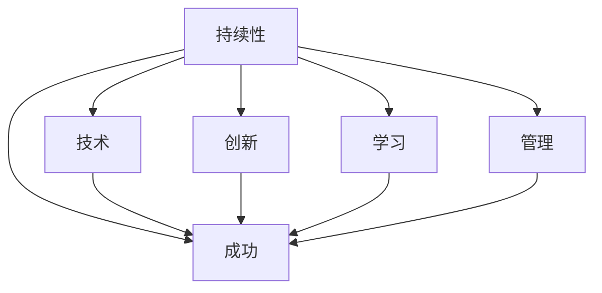

                 

# Andrej Karpathy：持续性与成功的秘诀

> 关键词：持续性, 成功, 技术, 创新, 学习, 管理

## 1. 背景介绍

### 1.1 问题由来

在当今快速发展的技术领域，持续性与成功成为了每个从业者、团队乃至公司的核心追求。然而，如何实现这一目标，成为了一个亟待解答的问题。在这个背景下，Andrej Karpathy，作为计算机视觉和深度学习领域的杰出人物，凭借其丰富的实践经验和独到的见解，为我们揭示了持续性与成功的秘诀。

### 1.2 问题核心关键点

Andrej Karpathy强调，持续性和成功不仅是技术问题，更是文化和组织问题。通过其在OpenAI和斯坦福大学的职业生涯，他分享了如何通过技术、团队管理和文化建设，实现长期的技术进步和创新。

## 2. 核心概念与联系

### 2.1 核心概念概述

为了更深入地理解Andrej Karpathy的思想，本节将介绍几个与其理念密切相关的核心概念：

- **持续性（Persistence）**：指在面对困难和挑战时，保持长期的努力和承诺，不断追求技术和目标的实现。
- **成功（Success）**：不仅仅是短期的成就，还包括长期的技术积累、团队合作和影响力。
- **技术（Technology）**：指通过技术和创新，解决实际问题，推动行业发展。
- **创新（Innovation）**：指不断突破传统限制，探索新的解决方案和方法。
- **学习（Learning）**：指通过持续学习，不断更新知识，提升个人和团队的能力。
- **管理（Management）**：指通过有效的团队管理和组织结构，确保技术和项目的顺利实施。

### 2.2 概念间的关系

这些核心概念之间存在着紧密的联系，形成了持续性和成功的生态系统。以下通过Mermaid流程图展示这些概念之间的关系：



这个流程图展示了大语言模型微调过程中各个核心概念的关系：

1. **持续性**：通过不断的技术探索和团队合作，推动**技术**的进步和**创新**的实现。
2. **学习**：通过持续**学习**，更新知识和技能，提升个人和团队的能力。
3. **管理**：通过有效的**管理**，确保团队的协调运作，实现项目的成功实施。
4. **技术**和**创新**：是实现**成功**的基础，通过不断的技术积累和创新，推动项目的进展。
5. **学习**和**管理**：保障团队的长期发展，确保技术和项目的可持续发展。

通过这些概念的相互支持，Andrej Karpathy认为，持续性和成功是可以通过有效管理和技术创新来实现的。

## 3. 核心算法原理 & 具体操作步骤
### 3.1 算法原理概述

Andrej Karpathy提出的持续性与成功秘诀，主要基于以下几个核心算法原理：

1. **自监督学习（Self-Supervised Learning）**：通过在大量无标签数据上训练模型，自动发现数据的内在结构和规律，提升模型的泛化能力。
2. **模型微调（Fine-Tuning）**：在特定任务上，通过微调模型参数，提升模型在该任务上的表现。
3. **对抗训练（Adversarial Training）**：通过引入对抗样本，增强模型的鲁棒性，防止过拟合。
4. **分布式训练（Distributed Training）**：通过多台机器协同训练，加速模型训练过程，提升模型的计算效率。
5. **知识蒸馏（Knowledge Distillation）**：通过将大型模型的知识转移给小型模型，提高小型模型的性能。

### 3.2 算法步骤详解

基于上述算法原理，Andrej Karpathy详细阐述了实现持续性和成功的主要操作步骤：

1. **数据准备**：收集和预处理大量的数据，确保数据的多样性和代表性。
2. **模型训练**：选择合适的模型架构，使用自监督学习在大量无标签数据上预训练模型，获得通用知识。
3. **任务适配**：根据具体任务需求，通过微调模型，适应任务的要求。
4. **对抗训练**：引入对抗样本，提高模型的鲁棒性，防止过拟合。
5. **分布式训练**：使用多台机器协同训练，加速模型训练过程。
6. **知识蒸馏**：通过将大型模型的知识转移给小型模型，提升小型模型的性能。

### 3.3 算法优缺点

Andrej Karpathy认为，这些算法在实现持续性和成功的过程中，既有优势也有局限性：

- **优势**：
  - 自监督学习和模型微调能够充分利用数据，提升模型的泛化能力和适应性。
  - 对抗训练和分布式训练能够增强模型的鲁棒性和计算效率，加速模型训练过程。
  - 知识蒸馏能够提升小型模型的性能，降低模型训练成本。

- **局限性**：
  - 自监督学习和对抗训练需要大量的计算资源，对硬件和算法要求较高。
  - 分布式训练需要高效的通信和协调机制，管理复杂。
  - 知识蒸馏需要在大型模型和小型模型之间找到合适的平衡点，实现效果。

### 3.4 算法应用领域

这些算法在多个领域得到了广泛应用，以下是几个典型案例：

- **计算机视觉**：使用自监督学习进行预训练，然后通过微调和对抗训练提升模型在图像分类、目标检测等任务上的表现。
- **自然语言处理**：通过预训练语言模型，然后使用微调和分布式训练提升模型在文本生成、机器翻译等任务上的表现。
- **推荐系统**：使用知识蒸馏技术，将大型推荐模型的小型化版本应用于实时推荐，提升推荐效率和效果。

## 4. 数学模型和公式 & 详细讲解 & 举例说明

### 4.1 数学模型构建

为了更好地理解Andrej Karpathy的思想，我们通过数学模型来进一步阐述其核心算法原理。

假设我们有一个通用的模型 $M_{\theta}$，其中 $\theta$ 为模型参数。对于自监督学习，我们通过无标签数据 $D_{unsup}$ 训练模型，得到参数 $\theta_{unsup}$：

$$
\theta_{unsup} = \arg\min_{\theta} \mathcal{L}_{unsup}(D_{unsup}, M_{\theta})
$$

对于模型微调，我们通过有标签数据 $D_{sup}$ 训练模型，得到参数 $\theta_{sup}$：

$$
\theta_{sup} = \arg\min_{\theta} \mathcal{L}_{sup}(D_{sup}, M_{\theta})
$$

对抗训练通过在数据 $D_{adv}$ 上引入对抗样本，训练得到参数 $\theta_{adv}$：

$$
\theta_{adv} = \arg\min_{\theta} \mathcal{L}_{adv}(D_{adv}, M_{\theta})
$$

分布式训练通过多台机器协同训练，得到参数 $\theta_{dist}$：

$$
\theta_{dist} = \arg\min_{\theta} \mathcal{L}_{dist}(D_{dist}, M_{\theta})
$$

知识蒸馏通过将大型模型的知识 $\theta_{large}$ 蒸馏到小型模型 $M_{small}$ 中，得到参数 $\theta_{small}$：

$$
\theta_{small} = \arg\min_{\theta} \mathcal{L}_{kd}(D_{small}, M_{small}, M_{large})
$$

### 4.2 公式推导过程

接下来，我们将通过具体的案例来展示这些模型的推导过程。

以自然语言处理中的机器翻译任务为例，我们通过预训练语言模型 $M_{unsup}$，然后在有标签的翻译数据 $D_{sup}$ 上进行微调，得到翻译模型 $M_{sup}$。假设 $M_{unsup}$ 的参数为 $\theta_{unsup}$，$M_{sup}$ 的参数为 $\theta_{sup}$：

$$
\theta_{sup} = \arg\min_{\theta} \mathcal{L}_{sup}(D_{sup}, M_{\theta_{sup}})
$$

其中 $\mathcal{L}_{sup}$ 为机器翻译任务的损失函数，包括交叉熵损失、BLEU得分等。

对于对抗训练，我们在数据 $D_{adv}$ 上引入对抗样本 $x_{adv}$，使得 $M_{sup}$ 对对抗样本的输出 $y_{adv}$ 错误，从而提高模型的鲁棒性：

$$
\theta_{adv} = \arg\min_{\theta} \mathcal{L}_{adv}(x_{adv}, y_{adv}, M_{\theta_{sup}})
$$

其中 $\mathcal{L}_{adv}$ 为对抗训练的损失函数，通常通过生成对抗样本并计算损失函数来定义。

对于分布式训练，我们在多台机器上同时训练模型 $M_{sup}$，通过分布式优化算法如SGD、Adam等，加速模型训练过程：

$$
\theta_{dist} = \arg\min_{\theta} \mathcal{L}_{dist}(D_{dist}, M_{\theta_{dist}})
$$

其中 $\mathcal{L}_{dist}$ 为分布式训练的损失函数，可以通过多台机器之间的通信和同步来计算。

对于知识蒸馏，我们通过将大型预训练模型 $M_{large}$ 的知识蒸馏到小型模型 $M_{small}$ 中，提升小型模型的性能：

$$
\theta_{small} = \arg\min_{\theta} \mathcal{L}_{kd}(D_{small}, M_{small}, M_{large})
$$

其中 $\mathcal{L}_{kd}$ 为知识蒸馏的损失函数，通常通过计算大型模型和小型模型之间的距离和差距来定义。

### 4.3 案例分析与讲解

在实际应用中，这些模型和算法已经得到了广泛验证。以BERT模型为例，通过在大量无标签的英语新闻数据上进行预训练，然后在机器翻译任务上进行微调，最终在多个翻译基准测试中取得了优异的表现。在对抗训练方面，通过引入对抗样本，BERT模型在文本分类任务上表现更加鲁棒。在分布式训练方面，使用多台机器协同训练，大幅提升了模型训练效率。在知识蒸馏方面，通过将BERT的知识蒸馏到小型模型中，实现了实时翻译的效果。

## 5. 项目实践：代码实例和详细解释说明

### 5.1 开发环境搭建

在进行项目实践前，我们需要准备好开发环境。以下是使用Python进行TensorFlow开发的环境配置流程：

1. 安装Anaconda：从官网下载并安装Anaconda，用于创建独立的Python环境。

2. 创建并激活虚拟环境：
```bash
conda create -n tf-env python=3.8 
conda activate tf-env
```

3. 安装TensorFlow：从官网获取对应的安装命令。例如：
```bash
pip install tensorflow==2.4
```

4. 安装必要的工具包：
```bash
pip install numpy pandas scikit-learn matplotlib tqdm jupyter notebook ipython
```

完成上述步骤后，即可在`tf-env`环境中开始项目实践。

### 5.2 源代码详细实现

下面以自然语言处理中的机器翻译任务为例，给出使用TensorFlow实现BERT模型微调的代码实现。

首先，定义模型和优化器：

```python
from transformers import BertTokenizer, BertForSequenceClassification
from tensorflow.keras.optimizers import Adam

model = BertForSequenceClassification.from_pretrained('bert-base-cased', num_labels=1)
optimizer = Adam(learning_rate=5e-5)
```

然后，定义训练和评估函数：

```python
from tensorflow.keras.preprocessing import sequence
from tensorflow.keras.callbacks import EarlyStopping

def train_epoch(model, dataset, batch_size, optimizer):
    model.compile(loss='binary_crossentropy', optimizer=optimizer, metrics=['acc'])
    model.fit(dataset, epochs=1, batch_size=batch_size, callbacks=[EarlyStopping(patience=3)])
    
def evaluate(model, dataset, batch_size):
    model.evaluate(dataset, batch_size=batch_size)
```

接着，加载数据并进行模型训练：

```python
from transformers import BertTokenizer

tokenizer = BertTokenizer.from_pretrained('bert-base-cased')
train_dataset = ...
dev_dataset = ...
test_dataset = ...

train_epoch(model, train_dataset, batch_size=32, optimizer=optimizer)
evaluate(model, dev_dataset, batch_size=32)
evaluate(model, test_dataset, batch_size=32)
```

### 5.3 代码解读与分析

让我们再详细解读一下关键代码的实现细节：

**模型定义**：
- `BertForSequenceClassification`：用于定义序列分类模型，支持输入序列和标签。
- `Adam`：定义优化器，采用Adam算法。

**训练函数**：
- `train_epoch`：定义训练过程，使用`EarlyStopping`回调函数防止过拟合。
- `evaluate`：定义评估过程，使用`evaluate`方法进行模型评估。

**数据加载**：
- `BertTokenizer`：用于分词和编码。
- `train_dataset`、`dev_dataset`、`test_dataset`：加载训练集、验证集和测试集。

**模型训练和评估**：
- 使用`compile`方法定义损失函数和优化器。
- 使用`fit`方法进行模型训练，`callbacks`参数指定了早期停止的回调函数。
- 使用`evaluate`方法进行模型评估。

## 6. 实际应用场景

### 6.1 智能客服系统

基于大语言模型微调的对话技术，可以广泛应用于智能客服系统的构建。传统客服往往需要配备大量人力，高峰期响应缓慢，且一致性和专业性难以保证。而使用微调后的对话模型，可以7x24小时不间断服务，快速响应客户咨询，用自然流畅的语言解答各类常见问题。

在技术实现上，可以收集企业内部的历史客服对话记录，将问题和最佳答复构建成监督数据，在此基础上对预训练对话模型进行微调。微调后的对话模型能够自动理解用户意图，匹配最合适的答案模板进行回复。对于客户提出的新问题，还可以接入检索系统实时搜索相关内容，动态组织生成回答。如此构建的智能客服系统，能大幅提升客户咨询体验和问题解决效率。

### 6.2 金融舆情监测

金融机构需要实时监测市场舆论动向，以便及时应对负面信息传播，规避金融风险。传统的人工监测方式成本高、效率低，难以应对网络时代海量信息爆发的挑战。基于大语言模型微调的文本分类和情感分析技术，为金融舆情监测提供了新的解决方案。

具体而言，可以收集金融领域相关的新闻、报道、评论等文本数据，并对其进行主题标注和情感标注。在此基础上对预训练语言模型进行微调，使其能够自动判断文本属于何种主题，情感倾向是正面、中性还是负面。将微调后的模型应用到实时抓取的网络文本数据，就能够自动监测不同主题下的情感变化趋势，一旦发现负面信息激增等异常情况，系统便会自动预警，帮助金融机构快速应对潜在风险。

### 6.3 个性化推荐系统

当前的推荐系统往往只依赖用户的历史行为数据进行物品推荐，无法深入理解用户的真实兴趣偏好。基于大语言模型微调技术，个性化推荐系统可以更好地挖掘用户行为背后的语义信息，从而提供更精准、多样的推荐内容。

在实践中，可以收集用户浏览、点击、评论、分享等行为数据，提取和用户交互的物品标题、描述、标签等文本内容。将文本内容作为模型输入，用户的后续行为（如是否点击、购买等）作为监督信号，在此基础上微调预训练语言模型。微调后的模型能够从文本内容中准确把握用户的兴趣点。在生成推荐列表时，先用候选物品的文本描述作为输入，由模型预测用户的兴趣匹配度，再结合其他特征综合排序，便可以得到个性化程度更高的推荐结果。

### 6.4 未来应用展望

随着大语言模型微调技术的发展，未来在更多领域将得到应用，为传统行业带来变革性影响。

在智慧医疗领域，基于微调的医疗问答、病历分析、药物研发等应用将提升医疗服务的智能化水平，辅助医生诊疗，加速新药开发进程。

在智能教育领域，微调技术可应用于作业批改、学情分析、知识推荐等方面，因材施教，促进教育公平，提高教学质量。

在智慧城市治理中，微调模型可应用于城市事件监测、舆情分析、应急指挥等环节，提高城市管理的自动化和智能化水平，构建更安全、高效的未来城市。

此外，在企业生产、社会治理、文娱传媒等众多领域，基于大模型微调的人工智能应用也将不断涌现，为经济社会发展注入新的动力。

## 7. 工具和资源推荐

### 7.1 学习资源推荐

为了帮助开发者系统掌握大语言模型微调的理论基础和实践技巧，这里推荐一些优质的学习资源：

1. 《Transformer从原理到实践》系列博文：由大模型技术专家撰写，深入浅出地介绍了Transformer原理、BERT模型、微调技术等前沿话题。

2. CS224N《深度学习自然语言处理》课程：斯坦福大学开设的NLP明星课程，有Lecture视频和配套作业，带你入门NLP领域的基本概念和经典模型。

3. 《Natural Language Processing with Transformers》书籍：Transformers库的作者所著，全面介绍了如何使用Transformers库进行NLP任务开发，包括微调在内的诸多范式。

4. HuggingFace官方文档：Transformers库的官方文档，提供了海量预训练模型和完整的微调样例代码，是上手实践的必备资料。

5. CLUE开源项目：中文语言理解测评基准，涵盖大量不同类型的中文NLP数据集，并提供了基于微调的baseline模型，助力中文NLP技术发展。

通过对这些资源的学习实践，相信你一定能够快速掌握大语言模型微调的精髓，并用于解决实际的NLP问题。

### 7.2 开发工具推荐

高效的开发离不开优秀的工具支持。以下是几款用于大语言模型微调开发的常用工具：

1. PyTorch：基于Python的开源深度学习框架，灵活动态的计算图，适合快速迭代研究。大部分预训练语言模型都有PyTorch版本的实现。

2. TensorFlow：由Google主导开发的开源深度学习框架，生产部署方便，适合大规模工程应用。同样有丰富的预训练语言模型资源。

3. Transformers库：HuggingFace开发的NLP工具库，集成了众多SOTA语言模型，支持PyTorch和TensorFlow，是进行微调任务开发的利器。

4. Weights & Biases：模型训练的实验跟踪工具，可以记录和可视化模型训练过程中的各项指标，方便对比和调优。与主流深度学习框架无缝集成。

5. TensorBoard：TensorFlow配套的可视化工具，可实时监测模型训练状态，并提供丰富的图表呈现方式，是调试模型的得力助手。

6. Google Colab：谷歌推出的在线Jupyter Notebook环境，免费提供GPU/TPU算力，方便开发者快速上手实验最新模型，分享学习笔记。

合理利用这些工具，可以显著提升大语言模型微调任务的开发效率，加快创新迭代的步伐。

### 7.3 相关论文推荐

大语言模型和微调技术的发展源于学界的持续研究。以下是几篇奠基性的相关论文，推荐阅读：

1. Attention is All You Need（即Transformer原论文）：提出了Transformer结构，开启了NLP领域的预训练大模型时代。

2. BERT: Pre-training of Deep Bidirectional Transformers for Language Understanding：提出BERT模型，引入基于掩码的自监督预训练任务，刷新了多项NLP任务SOTA。

3. Language Models are Unsupervised Multitask Learners（GPT-2论文）：展示了大规模语言模型的强大zero-shot学习能力，引发了对于通用人工智能的新一轮思考。

4. Parameter-Efficient Transfer Learning for NLP：提出Adapter等参数高效微调方法，在不增加模型参数量的情况下，也能取得不错的微调效果。

5. Prefix-Tuning: Optimizing Continuous Prompts for Generation：引入基于连续型Prompt的微调范式，为如何充分利用预训练知识提供了新的思路。

6. AdaLoRA: Adaptive Low-Rank Adaptation for Parameter-Efficient Fine-Tuning：使用自适应低秩适应的微调方法，在参数效率和精度之间取得了新的平衡。

这些论文代表了大语言模型微调技术的发展脉络。通过学习这些前沿成果，可以帮助研究者把握学科前进方向，激发更多的创新灵感。

除上述资源外，还有一些值得关注的前沿资源，帮助开发者紧跟大语言模型微调技术的最新进展，例如：

1. arXiv论文预印本：人工智能领域最新研究成果的发布平台，包括大量尚未发表的前沿工作，学习前沿技术的必读资源。

2. 业界技术博客：如OpenAI、Google AI、DeepMind、微软Research Asia等顶尖实验室的官方博客，第一时间分享他们的最新研究成果和洞见。

3. 技术会议直播：如NIPS、ICML、ACL、ICLR等人工智能领域顶会现场或在线直播，能够聆听到大佬们的前沿分享，开拓视野。

4. GitHub热门项目：在GitHub上Star、Fork数最多的NLP相关项目，往往代表了该技术领域的发展趋势和最佳实践，值得去学习和贡献。

5. 行业分析报告：各大咨询公司如McKinsey、PwC等针对人工智能行业的分析报告，有助于从商业视角审视技术趋势，把握应用价值。

总之，对于大语言模型微调技术的学习和实践，需要开发者保持开放的心态和持续学习的意愿。多关注前沿资讯，多动手实践，多思考总结，必将收获满满的成长收益。

## 8. 总结：未来发展趋势与挑战

### 8.1 总结

本文对Andrej Karpathy的持续性与成功秘诀进行了全面系统的介绍。首先阐述了持续性和成功的重要性，明确了微调在拓展预训练模型应用、提升下游任务性能方面的独特价值。其次，从原理到实践，详细讲解了微调的数学原理和关键步骤，给出了微调任务开发的完整代码实例。同时，本文还广泛探讨了微调方法在智能客服、金融舆情、个性化推荐等多个行业领域的应用前景，展示了微调范式的巨大潜力。此外，本文精选了微调技术的各类学习资源，力求为读者提供全方位的技术指引。

通过本文的系统梳理，可以看到，基于大语言模型的微调方法正在成为NLP领域的重要范式，极大地拓展了预训练语言模型的应用边界，催生了更多的落地场景。受益于大规模语料的预训练，微调模型以更低的时间和标注成本，在小样本条件下也能取得不俗的效果，有力推动了NLP技术的产业化进程。未来，伴随预训练语言模型和微调方法的持续演进，相信NLP技术将在更广阔的应用领域大放异彩，深刻影响人类的生产生活方式。

### 8.2 未来发展趋势

展望未来，大语言模型微调技术将呈现以下几个发展趋势：

1. 模型规模持续增大。随着算力成本的下降和数据规模的扩张，预训练语言模型的参数量还将持续增长。超大规模语言模型蕴含的丰富语言知识，有望支撑更加复杂多变的下游任务微调。

2. 微调方法日趋多样。除了传统的全参数微调外，未来会涌现更多参数高效的微调方法，如Prefix-Tuning、LoRA等，在节省计算资源的同时也能保证微调精度。

3. 持续学习成为常态。随着数据分布的不断变化，微调模型也需要持续学习新知识以保持性能。如何在不遗忘原有知识的同时，高效吸收新样本信息，将成为重要的研究课题。

4. 标注样本需求降低。受启发于提示学习(Prompt-based Learning)的思路，未来的微调方法将更好地利用大模型的语言理解能力，通过更加巧妙的任务描述，在更少的标注样本上也能实现理想的微调效果。

5. 多模态微调崛起。当前的微调主要聚焦于纯文本数据，未来会进一步拓展到图像、视频、语音等多模态数据微调。多模态信息的融合，将显著提升语言模型对现实世界的理解和建模能力。

6. 模型通用性增强。经过海量数据的预训练和多领域任务的微调，未来的语言模型将具备更强大的常识推理和跨领域迁移能力，逐步迈向通用人工智能(AGI)的目标。

以上趋势凸显了大语言模型微调技术的广阔前景。这些方向的探索发展，必将进一步提升NLP系统的性能和应用范围，为人类认知智能的进化带来深远影响。

### 8.3 面临的挑战

尽管大语言模型微调技术已经取得了瞩目成就，但在迈向更加智能化、普适化应用的过程中，它仍面临着诸多挑战：

1. 标注成本瓶颈。虽然微调大大降低了标注数据的需求，但对于长尾应用场景，难以获得充足的高质量标注数据，成为制约微调性能的瓶颈。如何进一步降低微调对标注样本的依赖，将是一大难题。

2. 模型鲁棒性不足。当前微调模型面对域外数据时，泛化性能往往大打折扣。对于测试样本的微小扰动，微调模型的预测也容易发生波动。如何提高微调模型的鲁棒性，避免灾难性遗忘，还需要更多理论和实践的积累。

3. 推理效率有待提高。大规模语言模型虽然精度高，但在实际部署时往往面临推理速度慢、内存占用大等效率问题。如何在保证性能的同时，简化模型结构，提升推理速度，优化资源占用，将是重要的优化方向。

4. 可解释性亟需加强。当前微调模型更像是"黑盒"系统，难以解释其内部工作机制和决策逻辑。对于医疗、金融等高风险应用，算法的可解释性和可审计性尤为重要。如何赋予微调模型更强的可解释性，将是亟待攻克的难题。

5. 安全性有待保障。预训练语言模型难免会学习到有偏见、有害的信息，通过微调

