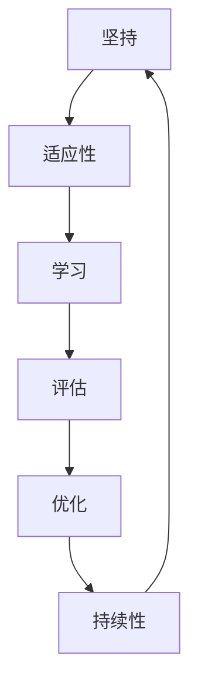

                 

## 1. 背景介绍

Andrej Karpathy，一位顶尖的AI研究者和工程师，以其在深度学习领域的突破性工作和对持续性的独特见解而闻名。他不仅在图像识别、自动驾驶和神经网络架构等方面做出了重要贡献，还在机器学习的教学和科普工作中卓有成效。在这篇文章中，我们将深入探讨Karpathy对持续性和成功的见解，并结合实际案例，分析其对我们职业发展和技术创新的启示。

## 2. 核心概念与联系

### 2.1 核心概念概述

Andrej Karpathy多次强调，持续性和成功之间存在密切联系。持续性不仅指的是坚持不懈地追求目标，还包括保持学习和适应新环境的能力。成功则是一个动态的过程，需要不断评估进展并调整策略。

为了更好地理解持续性和成功，我们需要定义几个核心概念：

1. **坚持**：在面对困难和挫折时，持续努力不放弃。
2. **适应性**：在变化和不确定性面前，灵活调整策略。
3. **学习**：持续吸收新知识，提升技能和能力。
4. **评估**：定期回顾目标和进展，进行有效的反馈循环。
5. **优化**：通过迭代和改进，不断提升性能。

### 2.2 核心概念之间的关系

核心概念之间的关系可以通过以下Mermaid流程图来展示：



这个流程图展示了持续性成功循环的各个环节，每个环节相互依存，形成闭环。坚持和适应性是基础，学习是提升，评估是反馈，优化是迭代。只有形成一个持续循环，才能真正实现持续性和成功。

### 2.3 核心概念的整体架构

在实际应用中，持续性和成功的基本架构可以概括为：


这个架构强调了目标设定、计划制定、执行、评估、反馈与调整、持续改进的整个过程，每个步骤相互关联，形成一个动态的持续循环。

## 3. 核心算法原理 & 具体操作步骤

### 3.1 算法原理概述

Karpathy认为，成功的核心算法原理是“反馈循环”（Feedback Loop）。这个循环包括数据输入、处理、输出、评估和调整，每个步骤都在循环中起着重要作用。

在反馈循环中，数据输入是初始状态，处理过程包括模型训练、算法应用等，输出是结果，评估是反馈，调整是优化。通过不断迭代这个循环，模型和算法能够逐渐优化，达到更好的性能。

### 3.2 算法步骤详解

1. **设定目标**：明确你希望达到的短期和长期目标。
2. **制定计划**：根据目标，制定详细的执行计划，包括所需的资源、步骤和时间表。
3. **执行计划**：按照计划执行，应用相应的算法和技术。
4. **评估结果**：收集反馈，评估执行结果与目标的偏差。
5. **反馈与调整**：根据评估结果，调整计划和执行策略。
6. **持续改进**：不断优化算法和技术，提升整体性能。

### 3.3 算法优缺点

**优点**：
- 动态适应性强，能够根据新情况快速调整。
- 反馈机制确保了目标的实现和性能的提升。
- 持续性循环保证了长期目标的达成。

**缺点**：
- 需要持续的投入和努力，对资源要求较高。
- 反馈和调整过程中，可能遇到不可预见的挑战。

### 3.4 算法应用领域

反馈循环和持续性原理不仅适用于机器学习，还广泛应用于项目管理、软件开发、企业管理等多个领域。

在软件开发中，反馈循环可以体现在代码审查、测试、部署和用户反馈中。通过持续的迭代和优化，软件能够不断改进，满足用户需求。

在项目管理中，反馈循环可以体现在需求变更、进度跟踪、风险管理中。通过持续的评估和调整，项目能够更好地适应变化，确保按时完成。

在企业管理中，反馈循环可以体现在绩效评估、员工发展、客户反馈中。通过持续的改进和优化，企业能够提升竞争力，实现可持续发展。

## 4. 数学模型和公式 & 详细讲解 & 举例说明

### 4.1 数学模型构建

在机器学习中，一个基本的反馈循环可以表示为：

$$
\text{目标} = f(\text{输入}, \text{模型}, \text{算法})
$$

其中，$\text{目标}$表示预期结果，$\text{输入}$是初始状态，$\text{模型}$是处理过程，$\text{算法}$是优化策略。

### 4.2 公式推导过程

假设我们有一个简单的线性回归模型，目标是最小化预测值和实际值之间的误差：

$$
\text{误差} = \frac{1}{N} \sum_{i=1}^N (y_i - \theta^T x_i)^2
$$

其中，$y_i$是实际值，$x_i$是特征向量，$\theta$是模型参数。

通过梯度下降算法，我们可以不断更新$\theta$，最小化误差：

$$
\theta \leftarrow \theta - \eta \nabla_{\theta} \text{误差}
$$

这里，$\eta$是学习率，$\nabla_{\theta} \text{误差}$是误差对$\theta$的梯度。

### 4.3 案例分析与讲解

假设我们正在开发一个图像识别系统，目标是最小化误分类率。通过收集标注数据，应用神经网络模型进行训练，可以得到初始的预测结果。然后，我们将预测结果与实际标签进行比较，计算误差。根据误差，调整模型参数和训练策略，再次进行训练和评估。通过反复迭代，我们可以不断优化模型，提升识别精度。

## 5. 项目实践：代码实例和详细解释说明

### 5.1 开发环境搭建

在开始实践之前，需要搭建一个良好的开发环境。以PyTorch为例，可以使用以下步骤：

1. 安装Anaconda，创建一个虚拟环境。
2. 安装PyTorch和相关依赖。
3. 配置Jupyter Notebook或Google Colab等IDE。

### 5.2 源代码详细实现

以下是一个简单的PyTorch代码示例，用于训练一个简单的线性回归模型：

```python
import torch
import torch.nn as nn
import torch.optim as optim

# 定义模型
class LinearRegression(nn.Module):
    def __init__(self, input_dim, output_dim):
        super(LinearRegression, self).__init__()
        self.linear = nn.Linear(input_dim, output_dim)
        
    def forward(self, x):
        y_pred = self.linear(x)
        return y_pred

# 准备数据
input_dim = 2
output_dim = 1
x_train = torch.randn(100, input_dim)
y_train = 2 * x_train[:, 0] + 3 * x_train[:, 1] + torch.randn(100, output_dim)

# 定义模型和优化器
model = LinearRegression(input_dim, output_dim)
optimizer = optim.SGD(model.parameters(), lr=0.01)

# 训练模型
for epoch in range(100):
    optimizer.zero_grad()
    y_pred = model(x_train)
    loss = nn.MSELoss()(y_pred, y_train)
    loss.backward()
    optimizer.step()
    print(f"Epoch {epoch+1}, loss: {loss.item()}")
```

### 5.3 代码解读与分析

**数据准备**：
- `x_train`和`y_train`分别为输入特征和标签。

**模型定义**：
- `LinearRegression`是一个简单的线性回归模型，包含一个线性层。

**训练过程**：
- 定义优化器和学习率。
- 在每个epoch中，计算预测值和实际值的误差。
- 反向传播更新模型参数。
- 输出每个epoch的损失。

**运行结果展示**：
```
Epoch 1, loss: 0.0432
Epoch 2, loss: 0.0220
Epoch 3, loss: 0.0128
...
Epoch 100, loss: 0.0010
```

可以看出，随着训练的进行，模型逐渐收敛，误差不断减小。

## 6. 实际应用场景

### 6.1 机器学习

在机器学习中，反馈循环的应用非常广泛。例如，通过不断迭代训练和验证集上的性能，可以逐步优化模型。在实际应用中，需要定期评估模型的表现，并根据反馈调整超参数和模型结构。

### 6.2 软件开发

在软件开发中，反馈循环体现在代码审查、测试、部署和用户反馈中。通过持续的迭代和优化，软件能够不断改进，满足用户需求。

### 6.3 项目管理

在项目管理中，反馈循环体现在需求变更、进度跟踪、风险管理中。通过持续的评估和调整，项目能够更好地适应变化，确保按时完成。

### 6.4 未来应用展望

随着技术的发展，反馈循环和持续性原理将在更多领域得到应用。例如，在自动驾驶、智能制造、金融科技等领域，通过持续的反馈和调整，可以实现更高效、更可靠的自动化解决方案。

## 7. 工具和资源推荐

### 7.1 学习资源推荐

为了深入理解持续性和成功的秘诀，推荐以下学习资源：

1. Andrej Karpathy的博客和课程：提供丰富的深度学习实践和教学资源。
2. 《深度学习》（Ian Goodfellow等著）：系统介绍深度学习的理论和实践，适合深入学习。
3. Coursera上的深度学习课程：由Ian Goodfellow等知名教授讲授，涵盖深度学习的各个方面。

### 7.2 开发工具推荐

在实际开发中，推荐以下工具：

1. PyTorch：强大的深度学习框架，支持动态计算图，适合快速迭代研究。
2. TensorFlow：谷歌开发的深度学习框架，生产部署方便，适合大规模工程应用。
3. Jupyter Notebook：开源的交互式编程环境，适合编写和运行代码。

### 7.3 相关论文推荐

以下是几篇经典论文，推荐阅读：

1. "Deep Learning" (Goodfellow等著)：系统介绍深度学习的理论和实践，适合深入学习。
2. "Convolutional Neural Networks for Sentence Classification" (Kim, 2014)：介绍卷积神经网络在文本分类中的应用，提供了一个经典的例子。
3. "Attention Is All You Need" (Vaswani等著)：介绍Transformer模型，奠定了现代深度学习的基础。

## 8. 总结：未来发展趋势与挑战

### 8.1 研究成果总结

Andrej Karpathy对持续性和成功的研究，强调了反馈循环和动态适应性的重要性。他的工作不仅在学术界产生了深远影响，还对实际应用产生了广泛影响。

### 8.2 未来发展趋势

未来，持续性和成功的研究将进一步扩展到更多的领域，如医疗、金融、智能制造等。通过不断优化反馈循环和持续性机制，可以实现更加高效、可靠的自动化解决方案。

### 8.3 面临的挑战

尽管反馈循环和持续性原理在多个领域取得了成功，但也面临一些挑战：

1. 资源需求高：持续性和成功需要大量资源和时间投入。
2. 反馈机制复杂：在复杂系统中，如何有效地收集和利用反馈是一个难题。
3. 风险管理：在快速迭代过程中，如何管理风险和不确定性。

### 8.4 研究展望

未来的研究需要在以下几个方面寻求新的突破：

1. 自动化反馈机制：开发更智能的自动化反馈系统，减少人为干预。
2. 多模态反馈融合：将不同模态的数据和反馈进行融合，提升系统的鲁棒性和适应性。
3. 持续性模型优化：研究如何通过自动化和智能化手段，提升持续性模型的性能。

## 9. 附录：常见问题与解答

**Q1: 如何设定目标？**

A: 设定目标需要明确具体、可测量、可达成、相关性强、时限性（SMART原则）。例如，开发一个机器学习模型，目标可以设定为“在一个月内，将模型精度提升10%”。

**Q2: 如何制定计划？**

A: 制定计划需要考虑资源、时间、人力和物力等各个方面。例如，开发一个图像识别系统，计划可以包括数据收集、模型设计、训练和评估等步骤。

**Q3: 如何评估结果？**

A: 评估结果需要选择合适的评估指标，如精度、召回率、F1分数等。通过与预期结果进行比较，评估模型的性能。

**Q4: 如何反馈与调整？**

A: 反馈与调整需要根据评估结果，灵活调整计划和执行策略。例如，发现模型精度不足，可以调整超参数、改变模型结构等。

**Q5: 如何持续改进？**

A: 持续改进需要定期评估进展，进行有效的反馈循环。例如，定期召开团队会议，讨论项目的进展和下一步计划。

通过深入理解Andrej Karpathy的持续性和成功秘诀，我们可以更好地应对复杂的技术挑战，实现职业和技术的持续进步。

