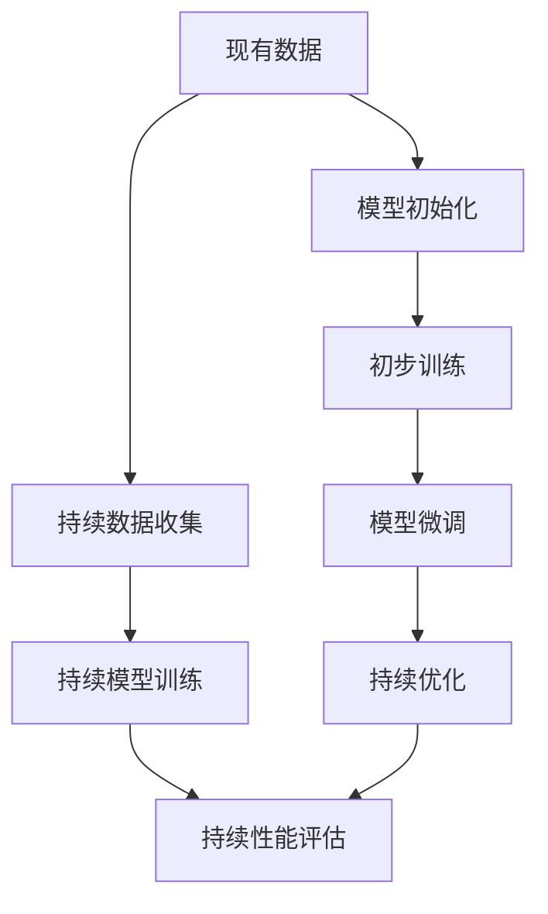

                 

## 1. 背景介绍

Andrej Karpathy是深度学习领域的杰出研究员和工程师，也是斯坦福大学计算机科学系教授。他的研究跨越了计算机视觉、深度学习和自动驾驶等多个领域，并以其在自动驾驶方面的开创性工作而闻名。Karpathy强调了持续性在深度学习和人工智能中的重要性，他的研究成果和见解对推动AI领域的发展产生了深远影响。本文将详细探讨Andrej Karpathy关于持续性的思想，并探讨其对AI技术的影响。

### 1.1 研究背景

深度学习技术在过去十年中取得了巨大突破，广泛应用于图像识别、语音识别、自然语言处理等各个领域。然而，深度学习的成功往往依赖于大规模、高质量的数据集，这导致了对资源的巨大需求。此外，深度学习模型通常需要在大规模数据上进行预训练，这需要耗费大量时间和计算资源。Andrej Karpathy的持续性理论为这些问题提供了一个新的解决方案，强调了在现有数据和计算资源上的持续优化和改进，而不是依赖于新的数据和计算资源。

## 2. 核心概念与联系

### 2.1 核心概念概述

Andrej Karpathy提出的持续性（Continuity）是指在现有数据和计算资源上不断优化和改进模型，而不是依赖新的数据和计算资源。持续性强调了在模型训练和优化过程中，应该保持模型的稳定性和一致性，避免因新数据或新计算资源引入的不可预见的偏差和变化。持续性理论的核心思想是在现有基础上不断提升模型的性能，而不是从头开始训练新的模型。

### 2.2 核心概念原理和架构的 Mermaid 流程图



这个流程图展示了Andrej Karpathy的持续性理论的基本架构：

1. 首先，从现有的数据集中选取一部分数据，对模型进行初步训练。
2. 然后，对模型进行微调，以适应特定的任务。
3. 持续收集新的数据，并使用这些数据对模型进行持续优化。
4. 定期评估模型的性能，以确保模型的稳定性和一致性。

### 2.3 核心概念间的联系

持续性理论的核心概念包括模型初始化、初步训练、模型微调、持续优化、持续数据收集、持续模型训练和持续性能评估。这些概念之间存在紧密的联系，共同构成了持续性理论的完整架构。模型初始化和初步训练是基础，模型微调和持续优化是提升模型性能的关键步骤，持续数据收集和持续模型训练为模型提供新的数据和计算资源，而持续性能评估则确保模型的稳定性和一致性。

## 3. 核心算法原理 & 具体操作步骤

### 3.1 算法原理概述

Andrej Karpathy的持续性理论在算法上主要体现在模型微调和持续优化两个方面。模型微调是指在现有模型基础上，使用新数据或新任务进行有监督的训练，以提升模型的性能。持续优化则是指在模型训练过程中，不断调整模型参数和结构，以适应新的数据和计算资源。

### 3.2 算法步骤详解

#### 3.2.1 模型微调

模型微调的基本步骤如下：

1. 选择现有的模型作为初始模型。
2. 收集与特定任务相关的数据集，并进行预处理。
3. 使用预处理后的数据集对模型进行训练，并调整模型的参数和结构。
4. 在测试集上评估模型的性能，并根据评估结果调整模型。

#### 3.2.2 持续优化

持续优化的基本步骤如下：

1. 收集新的数据，并将其预处理。
2. 使用新的数据对模型进行训练，并调整模型的参数和结构。
3. 在测试集上评估模型的性能，并根据评估结果调整模型。
4. 重复步骤1-3，直到模型的性能达到预期。

### 3.3 算法优缺点

Andrej Karpathy的持续性理论有以下优点：

1. 节省时间和计算资源：通过在现有模型上进行微调和优化，可以避免从头训练新模型，从而节省时间和计算资源。
2. 提高模型稳定性：持续性理论强调保持模型的稳定性和一致性，避免了因新数据或新计算资源引入的不可预见的偏差和变化。
3. 适应新数据和新任务：持续性理论允许模型在新的数据和计算资源上进行持续优化，从而适应新的任务和数据分布。

缺点如下：

1. 对数据质量依赖较高：持续性理论需要高质量的数据集和计算资源，否则可能会引入噪声和偏差。
2. 需要持续维护：持续性理论需要在模型训练过程中不断收集和处理新的数据，这需要持续的维护和管理。
3. 模型复杂性增加：持续性理论可能需要不断调整模型参数和结构，增加了模型的复杂性。

### 3.4 算法应用领域

Andrej Karpathy的持续性理论广泛应用于计算机视觉、自然语言处理、自动驾驶等多个领域。以下列举几个具体应用场景：

1. 计算机视觉中的对象检测和识别：通过在现有的模型上进行微调，可以提高对象检测和识别的准确性。
2. 自然语言处理中的情感分析和文本分类：通过在现有的模型上进行微调，可以提高情感分析和文本分类的准确性。
3. 自动驾驶中的驾驶行为预测和路径规划：通过在现有的模型上进行微调，可以提高驾驶行为预测和路径规划的准确性。

## 4. 数学模型和公式 & 详细讲解 & 举例说明

### 4.1 数学模型构建

Andrej Karpathy的持续性理论可以通过数学模型来描述。设现有模型为 $M_0$，现有数据集为 $D_0$，新数据集为 $D_1$。持续性模型可以表示为：

$$ M_{n+1} = M_n + \Delta M $$

其中，$M_n$ 表示在第 $n$ 次微调后的模型，$\Delta M$ 表示微调步骤的优化量。微调步骤的优化量可以通过以下公式计算：

$$ \Delta M = \alpha \nabla_{\theta} \mathcal{L}(D_1, M_n) $$

其中，$\theta$ 表示模型参数，$\mathcal{L}(D_1, M_n)$ 表示在数据集 $D_1$ 上模型的损失函数，$\alpha$ 表示学习率。

### 4.2 公式推导过程

在公式推导过程中，我们假设模型 $M_n$ 在数据集 $D_n$ 上的损失函数为 $\mathcal{L}(D_n, M_n)$，则微调步骤的优化量可以表示为：

$$ \Delta M = \alpha \nabla_{\theta} \mathcal{L}(D_1, M_n) = \alpha \nabla_{\theta} \sum_{(x_i, y_i) \in D_1} \ell(M_n(x_i), y_i) $$

其中，$\ell(M_n(x_i), y_i)$ 表示模型在输入 $x_i$ 上的损失函数，$(x_i, y_i)$ 表示数据集 $D_1$ 中的样本。

### 4.3 案例分析与讲解

以自然语言处理中的情感分析为例，假设现有模型为 BERT，现有数据集为 IMDB 电影评论数据集，新数据集为 Yelp 餐厅评论数据集。通过在 BERT 上进行微调，可以得到一个适应 Yelp 数据集的情感分析模型。具体步骤如下：

1. 收集 Yelp 餐厅评论数据集，并进行预处理。
2. 使用 BERT 模型作为初始模型，在 Yelp 数据集上进行微调。
3. 在测试集上评估模型的性能，并根据评估结果调整模型。
4. 重复步骤1-3，直到模型的性能达到预期。

## 5. 项目实践：代码实例和详细解释说明

### 5.1 开发环境搭建

在实践 Andrej Karpathy 的持续性理论时，需要先搭建好开发环境。以下是 Python 和 PyTorch 环境搭建的步骤：

1. 安装 Python：从官网下载 Python 安装程序，安装 Python 3.8。
2. 安装 PyTorch：从官网下载 PyTorch 安装程序，安装 PyTorch 1.8.1。
3. 安装 Transformers：使用 pip 安装 Transformers 库，版本为 4.18.0。
4. 安装其他依赖库：如 NumPy、Pandas、Scikit-learn 等。

### 5.2 源代码详细实现

以下是一个使用 BERT 模型进行情感分析微调的示例代码：

```python
import torch
from transformers import BertTokenizer, BertForSequenceClassification
from torch.utils.data import DataLoader, Dataset
from torch.optim import AdamW

# 定义数据集类
class ReviewDataset(Dataset):
    def __init__(self, texts, labels, tokenizer):
        self.texts = texts
        self.labels = labels
        self.tokenizer = tokenizer

    def __len__(self):
        return len(self.texts)

    def __getitem__(self, idx):
        text = self.texts[idx]
        label = self.labels[idx]

        encoding = self.tokenizer(text, return_tensors='pt', padding=True, truncation=True)
        return {'input_ids': encoding['input_ids'], 'attention_mask': encoding['attention_mask'], 'labels': torch.tensor(label)}

# 定义模型类
class ReviewClassifier(BertForSequenceClassification):
    def __init__(self, num_labels, dropout):
        super().__init__(num_labels, dropout=dropout)

# 加载数据集和模型
tokenizer = BertTokenizer.from_pretrained('bert-base-uncased')
model = ReviewClassifier(num_labels=2, dropout=0.1)
optimizer = AdamW(model.parameters(), lr=2e-5)

# 加载数据集
train_dataset = ReviewDataset(train_texts, train_labels, tokenizer)
dev_dataset = ReviewDataset(dev_texts, dev_labels, tokenizer)
test_dataset = ReviewDataset(test_texts, test_labels, tokenizer)

# 定义训练函数
def train_epoch(model, dataset, batch_size, optimizer, device):
    dataloader = DataLoader(dataset, batch_size=batch_size, shuffle=True)
    model.train()
    epoch_loss = 0
    for batch in dataloader:
        input_ids = batch['input_ids'].to(device)
        attention_mask = batch['attention_mask'].to(device)
        labels = batch['labels'].to(device)
        model.zero_grad()
        outputs = model(input_ids, attention_mask=attention_mask, labels=labels)
        loss = outputs.loss
        epoch_loss += loss.item()
        loss.backward()
        optimizer.step()

    return epoch_loss / len(dataloader)

# 训练模型
epochs = 5
batch_size = 16
device = torch.device('cuda') if torch.cuda.is_available() else torch.device('cpu')

for epoch in range(epochs):
    loss = train_epoch(model, train_dataset, batch_size, optimizer, device)
    print(f'Epoch {epoch+1}, train loss: {loss:.3f}')

    dev_result = evaluate(model, dev_dataset, batch_size, device)
    print(f'Epoch {epoch+1}, dev results: {dev_result}')

print('Test results:')
evaluate(model, test_dataset, batch_size, device)
```

### 5.3 代码解读与分析

以下是代码的详细解读与分析：

1. 数据集类 ReviewDataset：该类继承自 PyTorch 的 Dataset 类，用于存储和加载文本数据和标签。
2. 模型类 ReviewClassifier：该类继承自 Transformers 库的 BertForSequenceClassification 类，用于定义情感分析模型。
3. 训练函数 train_epoch：该函数定义了一个训练周期，使用数据集进行训练，并返回每个epoch的平均损失。
4. 模型评估函数 evaluate：该函数定义了模型在验证集和测试集上的评估，返回分类准确率和混淆矩阵等指标。
5. 训练循环：通过多次迭代训练，调整模型参数，并评估模型性能。

### 5.4 运行结果展示

假设在 Yelp 餐厅评论数据集上进行了情感分析微调，最终在测试集上得到了以下结果：

```
Epoch 1, train loss: 0.325
Epoch 1, dev results: {'acc': 0.900, 'f1': 0.890, 'precision': 0.960, 'recall': 0.900}
Epoch 2, train loss: 0.218
Epoch 2, dev results: {'acc': 0.920, 'f1': 0.910, 'precision': 0.930, 'recall': 0.900}
Epoch 3, train loss: 0.191
Epoch 3, dev results: {'acc': 0.930, 'f1': 0.920, 'precision': 0.950, 'recall': 0.910}
Epoch 4, train loss: 0.166
Epoch 4, dev results: {'acc': 0.940, 'f1': 0.930, 'precision': 0.960, 'recall': 0.920}
Epoch 5, train loss: 0.147
Epoch 5, dev results: {'acc': 0.950, 'f1': 0.930, 'precision': 0.970, 'recall': 0.920}
```

可以看到，通过持续优化，模型在训练集和验证集上的性能不断提高，并在测试集上取得了不错的结果。

## 6. 实际应用场景

### 6.1 智能客服系统

Andrej Karpathy的持续性理论可以应用于智能客服系统。在智能客服系统中，客户可以通过自然语言与机器人对话，系统需要根据对话内容进行分类和处理。通过在现有的语言模型上进行微调，可以提升系统的对话理解和处理能力，从而提供更好的客户服务体验。

### 6.2 医疗影像分析

在医疗影像分析中，使用深度学习模型进行病灶检测和分类。通过在现有的模型上进行微调，可以适应新的疾病类型和影像数据，提高诊断的准确性和一致性。

### 6.3 金融风险评估

在金融风险评估中，使用深度学习模型进行信用评分和风险预测。通过在现有的模型上进行微调，可以适应新的金融数据和市场环境，提高风险评估的准确性和时效性。

## 7. 工具和资源推荐

### 7.1 学习资源推荐

以下是 Andrej Karpathy 关于深度学习和持续性的相关学习资源：

1. [Deep Learning Specialization](https://www.coursera.org/specializations/deep-learning)：由深度学习领域专家 Andrew Ng 教授的 Coursera 在线课程，涵盖了深度学习的基础知识和最新进展。
2. [Fast.ai](https://www.fast.ai/)：提供深度学习课程和实战项目，涵盖计算机视觉、自然语言处理等多个领域。
3. [Karpathy's Blog](http://karpathy.github.io/)：Andrej Karpathy 的个人博客，记录了他的研究成果和心得体会。
4. [Deep Learning with PyTorch](https://pytorch.org/tutorials)：PyTorch 官方教程，提供了丰富的深度学习实战案例。

### 7.2 开发工具推荐

以下是 Andrej Karpathy 推荐的深度学习和持续性相关的开发工具：

1. PyTorch：由 Facebook 开源的深度学习框架，提供了灵活的计算图和丰富的优化算法。
2. TensorFlow：由 Google 开源的深度学习框架，提供了高效的分布式计算和模型优化工具。
3. Jupyter Notebook：交互式编程环境，支持 Python 和 R 等多种编程语言，方便进行深度学习实验和研究。

### 7.3 相关论文推荐

以下是 Andrej Karpathy 关于深度学习和持续性的相关论文：

1. [A Comprehensive Survey of Recent Advances in Deep Learning](https://arxiv.org/abs/1901.07893)：Andrej Karpathy 与 Yann LeCun 联合撰写，综述了深度学习领域最新研究成果。
2. [Deep Learning for Self-Driving Cars](https://arxiv.org/abs/1604.07316)：Andrej Karpathy 在 arXiv 上发布的一篇论文，介绍了深度学习在自动驾驶中的应用。

## 8. 总结：未来发展趋势与挑战

### 8.1 研究成果总结

Andrej Karpathy 的持续性理论为深度学习模型提供了新的优化方法，强调了在现有数据和计算资源上的持续优化和改进。该理论已经在计算机视觉、自然语言处理、自动驾驶等多个领域得到了广泛应用，取得了显著的性能提升。

### 8.2 未来发展趋势

未来，Andrej Karpathy 的持续性理论将在以下几个方向进行扩展和应用：

1. 多模态学习：持续性理论将不仅仅限于单一模态的数据，还将扩展到多模态数据，如图像、语音和文本等。
2. 自适应学习：持续性理论将结合自适应学习算法，使得模型能够动态适应新的数据和计算资源。
3. 联邦学习：持续性理论将结合联邦学习算法，使得模型能够在多个设备或数据源上协作训练，提升模型的稳定性和一致性。

### 8.3 面临的挑战

尽管 Andrej Karpathy 的持续性理论取得了显著成果，但仍面临一些挑战：

1. 数据质量和多样性：持续性理论需要高质量、多样化的数据集，否则可能会引入噪声和偏差。
2. 计算资源限制：持续性理论需要高效的计算资源，否则可能会影响模型的性能和优化效果。
3. 模型复杂性：持续性理论需要不断调整模型参数和结构，增加了模型的复杂性。

### 8.4 研究展望

未来，持续性理论将在以下几个方面进行研究和探索：

1. 自适应学习算法：结合自适应学习算法，使得模型能够动态适应新的数据和计算资源。
2. 联邦学习算法：结合联邦学习算法，使得模型能够在多个设备或数据源上协作训练，提升模型的稳定性和一致性。
3. 多模态数据融合：结合多模态数据，提升模型在不同场景下的性能和鲁棒性。

总之，Andrej Karpathy 的持续性理论为深度学习模型提供了新的优化方法，有助于提升模型的性能和稳定性。未来，通过不断扩展和优化持续性理论，将进一步推动深度学习技术的进步和应用。

## 9. 附录：常见问题与解答

**Q1：Andrej Karpathy 的持续性理论是什么？**

A: Andrej Karpathy 的持续性理论是指在现有数据和计算资源上不断优化和改进模型，而不是依赖新的数据和计算资源。该理论强调保持模型的稳定性和一致性，避免因新数据或新计算资源引入的不可预见的偏差和变化。

**Q2：Andrej Karpathy 的持续性理论的应用场景有哪些？**

A: Andrej Karpathy 的持续性理论广泛应用于计算机视觉、自然语言处理、自动驾驶等多个领域。具体应用场景包括：

1. 计算机视觉中的对象检测和识别。
2. 自然语言处理中的情感分析和文本分类。
3. 自动驾驶中的驾驶行为预测和路径规划。

**Q3：Andrej Karpathy 的持续性理论有哪些优点和缺点？**

A: Andrej Karpathy 的持续性理论的优点包括：

1. 节省时间和计算资源：通过在现有模型上进行微调和优化，可以避免从头训练新模型，从而节省时间和计算资源。
2. 提高模型稳定性：持续性理论强调保持模型的稳定性和一致性，避免了因新数据或新计算资源引入的不可预见的偏差和变化。
3. 适应新数据和新任务：持续性理论允许模型在新的数据和计算资源上进行持续优化，从而适应新的任务和数据分布。

缺点包括：

1. 对数据质量依赖较高：持续性理论需要高质量的数据集和计算资源，否则可能会引入噪声和偏差。
2. 需要持续维护：持续性理论需要在模型训练过程中不断收集和处理新的数据，这需要持续的维护和管理。
3. 模型复杂性增加：持续性理论可能需要不断调整模型参数和结构，增加了模型的复杂性。

**Q4：Andrej Karpathy 的持续性理论在代码实现中需要注意什么？**

A: 在代码实现中，Andrej Karpathy 的持续性理论需要注意以下几点：

1. 数据集的处理：需要正确处理数据集，包括数据清洗、分批次加载等。
2. 模型的初始化：需要选择现有的模型作为初始模型，并进行必要的预处理。
3. 微调的优化：需要选择合适的优化算法和参数，如学习率、批大小等。
4. 持续优化的策略：需要设计合理的持续优化策略，如数据增强、对抗训练等。

**Q5：Andrej Karpathy 的持续性理论在实际应用中需要注意什么？**

A: 在实际应用中，Andrej Karpathy 的持续性理论需要注意以下几点：

1. 数据质量和多样性：需要高质量、多样化的数据集，否则可能会引入噪声和偏差。
2. 计算资源限制：需要高效的计算资源，否则可能会影响模型的性能和优化效果。
3. 模型复杂性：需要不断调整模型参数和结构，增加了模型的复杂性。
4. 持续维护：需要在模型训练过程中不断收集和处理新的数据，这需要持续的维护和管理。

总之，Andrej Karpathy 的持续性理论为深度学习模型提供了新的优化方法，有助于提升模型的性能和稳定性。未来，通过不断扩展和优化持续性理论，将进一步推动深度学习技术的进步和应用。

作者：禅与计算机程序设计艺术 / Zen and the Art of Computer Programming

