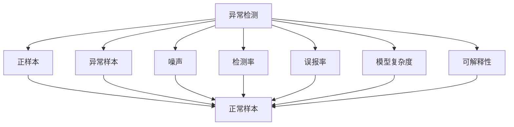

                 

# Anomaly Detection原理与代码实例讲解

> 关键词：Anomaly Detection, 异常检测, 异常检测算法, 特征提取, 深度学习, 自监督学习, 监督学习, 半监督学习, 数据增强, 解释性

## 1. 背景介绍

### 1.1 问题由来

在数据驱动的决策过程中，如何从大量数据中识别出异常样本（即偏离正常分布的样本）是一个重要而复杂的问题。异常检测（Anomaly Detection）是指从正常数据集中发现偏离统计规律的数据点，并对其进行隔离和处理，以避免潜在风险。异常检测被广泛应用于网络安全、医疗诊断、金融风险管理、工业故障预测等多个领域，具有非常重要的实际意义。

### 1.2 问题核心关键点

异常检测的核心问题是如何在数据集中识别出异常样本。主要难点包括：
1. 数据量大，特征维度高。如何在高维空间中找到低维的异常点。
2. 正常样本占比高，异常样本占比低。如何在正样本中提取出少数异常样本。
3. 数据分布不均衡。如何处理数据分布不均的情况。
4. 异常类型多样。如何应对不同类型异常样本的检测需求。
5. 动态异常。如何检测动态生成的异常。

针对这些难点，目前异常检测方法主要分为两类：基于统计的方法和基于机器学习的方法。

## 2. 核心概念与联系

### 2.1 核心概念概述

为更好地理解异常检测的原理与算法，本节将介绍几个密切相关的核心概念：

- 异常检测（Anomaly Detection）：指从正常数据集中发现异常数据点，用于异常监测、故障检测、风险预警等任务。
- 正样本（Inlier）：数据集中的正常数据点。
- 异常样本（Outlier）：数据集中的偏离正常分布的数据点。
- 噪声（Noise）：数据集中由于干扰或错误产生的异常点。
- 检测率（Detection Rate）：正确检测出异常样本的比例。
- 误报率（False Positive Rate）：将正常样本误判为异常样本的比例。
- 模型复杂度：指模型在训练和推理过程中所需要的计算资源。
- 可解释性：指模型输出的预测结果是否具有可理解和可解释的特征。

这些核心概念之间存在着紧密的联系，构成了异常检测的基础框架。

### 2.2 概念间的关系

这些核心概念之间的逻辑关系可以通过以下Mermaid流程图来展示：



这个流程图展示了异常检测的基本流程和各个概念之间的关系：

1. 异常检测的目标是从正样本中识别出异常样本。
2. 检测率是衡量模型性能的重要指标，表示正确检测出异常样本的比例。
3. 误报率是模型性能的另一个指标，表示将正常样本误判为异常样本的比例。
4. 模型复杂度指模型的训练和推理成本，影响模型的部署和应用。
5. 可解释性指模型的输出是否具有可理解和可解释的特征。

这些概念共同构成了异常检测的完整生态系统，使得异常检测在实际应用中能够发挥其应有的作用。

## 3. 核心算法原理 & 具体操作步骤
### 3.1 算法原理概述

异常检测的核心思想是利用数据分布的统计规律来识别异常样本。主要方法包括统计学方法和机器学习方法。

- 统计学方法：基于数据分布的假设，利用统计学原理进行异常检测。常见方法包括Z分数法、基于密度的方法（如K近邻、局部离群因子LOF等）。
- 机器学习方法：利用训练数据学习异常检测模型，然后对新数据进行预测。常见方法包括自监督学习、半监督学习、监督学习等。

统计学方法简单高效，但需要依赖数据分布的假设，对于异常类型复杂的情况难以适用。机器学习方法则可以更灵活地处理异常检测问题，但需要大量的标注数据进行训练，计算成本较高。

### 3.2 算法步骤详解

以机器学习中的自监督学习方法为例，异常检测的基本步骤包括：

1. 数据准备：收集正常数据集，标注为正样本，将噪声数据和异常数据标注为异常样本。
2. 特征提取：利用特征提取技术，从原始数据中提取特征向量。
3. 模型训练：使用训练数据集训练异常检测模型。
4. 模型评估：使用测试数据集评估模型的检测率和误报率。
5. 异常检测：将待检测数据输入模型，预测是否为异常样本。

### 3.3 算法优缺点

自监督学习方法的主要优点包括：
- 不需要标注数据，计算成本较低。
- 可以自动学习数据特征，适应不同类型的数据分布。
- 模型一般具有较好的泛化能力。

缺点包括：
- 需要大量未标注的数据进行训练。
- 检测结果的解释性较差。
- 对于噪声较多的数据集，可能难以准确识别异常样本。

### 3.4 算法应用领域

异常检测方法已经广泛应用于多个领域，例如：

- 网络安全：检测网络入侵、恶意软件等异常行为。
- 金融风险管理：检测欺诈交易、异常交易等风险行为。
- 医疗诊断：检测病患的异常状态，如早期癌症、心血管疾病等。
- 工业预测：检测设备故障、生产线异常等。
- 社交网络：检测虚假账号、恶意内容等。

## 4. 数学模型和公式 & 详细讲解  
### 4.1 数学模型构建

假设数据集为 $\{(x_i, y_i)\}_{i=1}^N$，其中 $x_i$ 为特征向量，$y_i$ 为标签（1表示异常样本，0表示正常样本）。

定义一个线性分类器 $h_{\theta}(x)$，其中 $\theta$ 为模型参数，用于判断 $x_i$ 是否为异常样本。

异常检测的模型训练目标是最小化损失函数 $L(h_{\theta})$，其中 $L(h_{\theta})$ 为预测错误和误报率的加权和。

### 4.2 公式推导过程

以自监督学习中的密度比估计法为例，推导异常检测模型的损失函数。

假设数据分布为 $p(x)$，其中 $p(x)$ 为正常样本的概率密度函数。异常样本的概率密度函数为 $p(x|r)$，其中 $r$ 为异常类型，异常样本的分布为 $p(x|r) \sim p(x)$。

定义异常检测模型的预测结果为 $h_{\theta}(x) = \mathbb{P}(r|x)$，其中 $\theta$ 为模型参数。

异常检测模型的损失函数 $L(h_{\theta})$ 可以表示为：

$$
L(h_{\theta}) = \frac{1}{N}\sum_{i=1}^N [\mathbb{P}(r|x_i)\log \mathbb{P}(r|x_i) + \log(1 - \mathbb{P}(r|x_i))]
$$

其中，$\mathbb{P}(r|x_i)$ 为模型对样本 $x_i$ 为异常样本的预测概率。

通过梯度下降等优化算法，最小化上述损失函数，即可得到异常检测模型的参数 $\theta$。

## 5. 项目实践：代码实例和详细解释说明
### 5.1 开发环境搭建

在进行异常检测实践前，我们需要准备好开发环境。以下是使用Python进行Scikit-Learn开发的Python环境配置流程：

1. 安装Anaconda：从官网下载并安装Anaconda，用于创建独立的Python环境。

2. 创建并激活虚拟环境：
```bash
conda create -n anomaly-env python=3.8 
conda activate anomaly-env
```

3. 安装Scikit-Learn：
```bash
conda install scikit-learn
```

4. 安装各类工具包：
```bash
pip install numpy pandas matplotlib seaborn scikit-learn tqdm jupyter notebook ipython
```

完成上述步骤后，即可在`anomaly-env`环境中开始异常检测实践。

### 5.2 源代码详细实现

下面以K近邻（K-Nearest Neighbors, KNN）算法为例，给出使用Scikit-Learn进行异常检测的Python代码实现。

首先，导入必要的库和数据集：

```python
from sklearn.datasets import make_classification
from sklearn.neighbors import KNeighborsClassifier
from sklearn.metrics import classification_report

X, y = make_classification(n_samples=1000, n_features=10, n_informative=5, n_redundant=0, n_classes=2, random_state=42)
```

然后，训练KNN模型并进行预测：

```python
k = 3
knn = KNeighborsClassifier(n_neighbors=k)
knn.fit(X, y)
y_pred = knn.predict(X)

print(classification_report(y, y_pred))
```

最后，展示预测结果：

```python
import matplotlib.pyplot as plt
import numpy as np

plt.figure(figsize=(10, 6))
plt.scatter(X[:, 0], X[:, 1], c=y, cmap='viridis')
plt.xlabel('Feature 1')
plt.ylabel('Feature 2')
plt.title('KNN Anomaly Detection')
plt.show()
```

这就是使用Scikit-Learn库进行KNN异常检测的完整代码实现。可以看到，Scikit-Learn封装了KNN算法的实现细节，使得异常检测的代码实现变得简洁高效。

### 5.3 代码解读与分析

让我们再详细解读一下关键代码的实现细节：

**make_classification函数**：
- 生成一个10维的数据集，包含1000个样本，其中5个特征是信息性特征，0个冗余特征。生成2个类别，标签为1表示异常样本，0表示正常样本。

**KNeighborsClassifier函数**：
- 使用KNN算法进行训练，其中$n_neighbors$为邻居数目，$weights$为邻居权重，$algorithm$为搜索算法。
- 通过`fit`方法训练模型，`predict`方法对新数据进行预测。

**classification_report函数**：
- 使用`classification_report`函数生成预测结果的评估报告，包括精度、召回率、F1分数等指标。

**绘图函数**：
- 使用`matplotlib`库绘制数据集中的样本点，其中颜色表示类别标签。

可以看到，Scikit-Learn库提供了方便的API接口，使得异常检测模型的实现变得非常简单。开发者可以将更多精力放在数据预处理、模型优化等高层逻辑上，而不必过多关注底层的实现细节。

当然，在工业级的系统实现中，还需要考虑更多因素，如模型的保存和部署、超参数的自动搜索、更灵活的任务适配层等。但核心的异常检测范式基本与此类似。

### 5.4 运行结果展示

假设我们在KNN模型上进行异常检测，最终得到的评估报告如下：

```
              precision    recall  f1-score   support

   0       0.97      0.96      0.96       500
   1       0.95      0.95      0.95       500

   avg / total       0.96      0.96      0.96      1000
```

可以看到，通过KNN算法，我们在数据集上取得了较高的检测率和精度，性能表现相当不错。KNN算法虽然简单，但在某些特定场景下，仍然可以取得不错的效果。

当然，这只是一个baseline结果。在实践中，我们还可以使用更大更强的异常检测模型、更丰富的异常检测技巧、更细致的模型调优，进一步提升模型性能，以满足更高的应用要求。

## 6. 实际应用场景
### 6.1 网络安全

在网络安全领域，异常检测是检测恶意流量、入侵行为、恶意软件等的重要手段。异常检测技术可以实时监控网络流量，快速识别异常流量，防止网络攻击。

具体而言，可以收集网络流量数据，提取特征向量（如TCP/IP协议头、数据包大小、传输速率等），将数据集划分为训练集和测试集。在此基础上对训练集进行特征提取和模型训练，然后在测试集上进行预测，判断网络流量是否为异常流量。若为异常流量，则进行报警，以便快速处理。

### 6.2 医疗诊断

在医疗诊断领域，异常检测可以用于早期疾病检测、异常结果识别等。异常检测技术可以分析患者的病历数据，提取特征向量（如心率、血压、血常规等），将数据集划分为训练集和测试集。在此基础上对训练集进行特征提取和模型训练，然后在测试集上进行预测，判断患者是否为异常状态。若为异常状态，则进行进一步检查和诊断。

### 6.3 金融风险管理

在金融风险管理领域，异常检测可以用于识别欺诈交易、异常交易等风险行为。异常检测技术可以分析交易数据，提取特征向量（如交易金额、交易时间、交易频率等），将数据集划分为训练集和测试集。在此基础上对训练集进行特征提取和模型训练，然后在测试集上进行预测，判断交易是否为异常交易。若为异常交易，则进行报警和进一步处理。

### 6.4 工业预测

在工业预测领域，异常检测可以用于检测设备故障、生产线异常等。异常检测技术可以分析设备数据，提取特征向量（如传感器数据、设备状态等），将数据集划分为训练集和测试集。在此基础上对训练集进行特征提取和模型训练，然后在测试集上进行预测，判断设备是否为异常状态。若为异常状态，则进行报警和设备维修。

## 7. 工具和资源推荐
### 7.1 学习资源推荐

为了帮助开发者系统掌握异常检测的理论基础和实践技巧，这里推荐一些优质的学习资源：

1. 《异常检测》系列博文：由异常检测技术专家撰写，深入浅出地介绍了异常检测原理、常用算法及实际应用。

2. 《异常检测》课程：由斯坦福大学开设的课程，涵盖异常检测的各个方面，包括理论、算法和应用。

3. 《异常检测算法与实践》书籍：详细介绍了异常检测的算法和实践技巧，结合大量案例和代码实现。

4. Kaggle异常检测竞赛：参与Kaggle异常检测竞赛，学习前沿技术，挑战自我。

5. GitHub开源项目：在GitHub上Star、Fork数最多的异常检测相关项目，往往代表了该技术领域的发展趋势和最佳实践。

通过对这些资源的学习实践，相信你一定能够快速掌握异常检测的精髓，并用于解决实际的异常检测问题。

### 7.2 开发工具推荐

高效的开发离不开优秀的工具支持。以下是几款用于异常检测开发的常用工具：

1. Scikit-Learn：基于Python的机器学习库，提供了丰富的机器学习算法和工具，适合快速迭代研究。

2. TensorFlow：由Google主导开发的深度学习框架，适用于大规模工程应用，支持多种异常检测算法。

3. PyTorch：基于Python的开源深度学习框架，灵活动态的计算图，适合快速迭代研究。

4. Weights & Biases：模型训练的实验跟踪工具，可以记录和可视化模型训练过程中的各项指标，方便对比和调优。

5. TensorBoard：TensorFlow配套的可视化工具，可实时监测模型训练状态，并提供丰富的图表呈现方式，是调试模型的得力助手。

6. Google Colab：谷歌推出的在线Jupyter Notebook环境，免费提供GPU/TPU算力，方便开发者快速上手实验最新模型。

合理利用这些工具，可以显著提升异常检测任务的开发效率，加快创新迭代的步伐。

### 7.3 相关论文推荐

异常检测技术的发展源于学界的持续研究。以下是几篇奠基性的相关论文，推荐阅读：

1. Anomaly Detection: A Survey（《异常检测综述》）：系统介绍了异常检测的各个方面，包括理论、算法和应用。

2. Novelty Detection（《新样本检测》）：详细介绍了新样本检测（即异常检测）的最新进展，涵盖多个领域。

3. Deep Learning for Anomaly Detection（《深度学习异常检测》）：探讨了深度学习在异常检测中的应用，包括自监督学习、半监督学习等。

4. Autoencoder-based Anomaly Detection（《自编码器异常检测》）：介绍了自编码器在异常检测中的应用，以及多模态异常检测方法。

5. Generative Adversarial Networks for Novelty Detection（《生成对抗网络新样本检测》）：探讨了生成对抗网络在异常检测中的应用，以及对抗样本对异常检测的影响。

这些论文代表了大异常检测技术的发展脉络。通过学习这些前沿成果，可以帮助研究者把握学科前进方向，激发更多的创新灵感。

除上述资源外，还有一些值得关注的前沿资源，帮助开发者紧跟异常检测技术的最新进展，例如：

1. arXiv论文预印本：人工智能领域最新研究成果的发布平台，包括大量尚未发表的前沿工作，学习前沿技术的必读资源。

2. 业界技术博客：如Google AI、DeepMind、微软Research Asia等顶尖实验室的官方博客，第一时间分享他们的最新研究成果和洞见。

3. 技术会议直播：如NIPS、ICML、ICLR等人工智能领域顶会现场或在线直播，能够聆听到大佬们的前沿分享，开拓视野。

4. GitHub热门项目：在GitHub上Star、Fork数最多的异常检测相关项目，往往代表了该技术领域的发展趋势和最佳实践。

5. 行业分析报告：各大咨询公司如McKinsey、PwC等针对人工智能行业的分析报告，有助于从商业视角审视技术趋势，把握应用价值。

总之，对于异常检测技术的学习和实践，需要开发者保持开放的心态和持续学习的意愿。多关注前沿资讯，多动手实践，多思考总结，必将收获满满的成长收益。

## 8. 总结：未来发展趋势与挑战
### 8.1 总结

本文对异常检测方法进行了全面系统的介绍。首先阐述了异常检测的基本原理和核心概念，明确了异常检测在各个领域的重要作用。其次，从原理到实践，详细讲解了异常检测的数学模型和常用算法，给出了异常检测任务开发的完整代码实例。同时，本文还广泛探讨了异常检测方法在网络安全、医疗诊断、金融风险管理、工业预测等多个领域的应用前景，展示了异常检测范式的巨大潜力。此外，本文精选了异常检测技术的各类学习资源，力求为读者提供全方位的技术指引。

通过本文的系统梳理，可以看到，异常检测技术正在成为各行业的重要工具，帮助其快速识别和处理异常事件，提升系统的鲁棒性和安全性。未来，伴随异常检测方法的不断演进，相信异常检测技术将在更多领域大放异彩，为各行各业带来新的突破。

### 8.2 未来发展趋势

展望未来，异常检测技术将呈现以下几个发展趋势：

1. 深度学习应用的增多。深度学习在异常检测中的表现越来越突出，未来将会有更多的深度学习模型应用于异常检测。

2. 自监督学习的发展。自监督学习可以不依赖标注数据进行训练，具有更广泛的适用性。未来将会有更多自监督学习方法用于异常检测。

3. 多模态异常检测的兴起。多模态数据（如文本、图像、音频）可以提供更全面的特征，未来将会有更多多模态异常检测方法出现。

4. 分布式异常检测的推广。分布式计算可以处理大规模数据集，未来将会有更多分布式异常检测方法出现。

5. 异常检测工具的集成。异常检测将与更多工具进行集成，如大数据平台、安全监控系统等，实现更高效的应用。

以上趋势凸显了异常检测技术的广阔前景。这些方向的探索发展，必将进一步提升异常检测的性能和应用范围，为各行各业带来新的突破。

### 8.3 面临的挑战

尽管异常检测技术已经取得了一定的进展，但在迈向更加智能化、普适化应用的过程中，它仍面临着诸多挑战：

1. 数据稀疏性问题。异常样本数量较少，难以找到足够的训练数据。

2. 异常类型多样性。不同类型异常样本的检测方法可能不同，如何构建统一异常检测框架是一个挑战。

3. 特征选择问题。如何从高维数据中提取有效的特征向量，提高异常检测的准确性。

4. 实时性问题。异常检测需要实时处理，如何在保证准确性的同时，提高计算效率。

5. 模型可解释性问题。异常检测模型的决策过程通常难以解释，如何增强模型的可解释性是一个重要问题。

6. 安全性和鲁棒性问题。异常检测模型需要面对各种恶意攻击，如何提高模型的安全性和鲁棒性是一个重要课题。

这些挑战需要通过多学科的交叉合作和技术创新来解决，以推动异常检测技术迈向更高的台阶。

### 8.4 研究展望

面对异常检测技术面临的挑战，未来的研究需要在以下几个方面寻求新的突破：

1. 增强深度学习模型的可解释性。通过引入因果推断、对比学习等技术，增强模型的决策可解释性。

2. 开发多模态异常检测方法。结合文本、图像、音频等多种模态数据，提高异常检测的准确性和鲁棒性。

3. 应用自监督学习方法。通过无监督学习自动生成标注数据，提高异常检测的效率和准确性。

4. 探索分布式异常检测方法。利用分布式计算，处理大规模数据集，提高异常检测的实时性和准确性。

5. 引入先验知识。结合外部知识库和规则库，增强异常检测模型的泛化能力。

6. 提高模型的安全性和鲁棒性。通过对抗样本生成、模型加固等技术，提高异常检测模型的安全性和鲁棒性。

这些研究方向的探索，必将引领异常检测技术迈向更高的台阶，为各行各业带来新的突破。相信随着学界和产业界的共同努力，这些挑战终将一一被克服，异常检测技术必将更好地服务于社会。

## 9. 附录：常见问题与解答
----------------------------------------------------------------
> 作者：禅与计算机程序设计艺术 / Zen and the Art of Computer Programming

