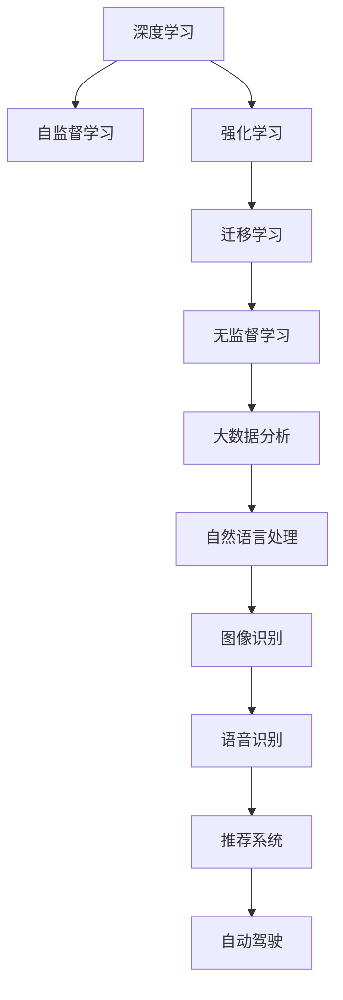

                 

# Artificial Intelligence

> 关键词：

## 1. 背景介绍

人工智能（Artificial Intelligence, AI）是人类历史上的一次重要革命。自从1956年达特茅斯会议首次提出AI概念以来，经过几十年的发展，AI已经成为现代科技的前沿领域。它不仅改变了计算机科学的方向，还正在深刻影响着社会的各个方面。

AI的进展可以划分为多个阶段：早期规则导向的专家系统；到深度学习和大数据兴起之后的增强学习；再到当前的强化学习和自监督学习。其中，深度学习、尤其是深度神经网络，在图像识别、语音识别、自然语言处理、推荐系统、自动驾驶等领域取得了突破性的进展。

AI的广泛应用已经改变了人们的生产生活方式。在医疗领域，AI可以辅助诊断、个性化治疗；在教育领域，AI可以个性化推荐学习资源；在金融领域，AI可以进行风险评估和投资建议；在制造业领域，AI可以实现智能制造和供应链优化。AI正在改变我们的工作、学习、娱乐、医疗、交通、商业等各个领域，带来了巨大的价值。

## 2. 核心概念与联系

### 2.1 核心概念概述

为了更好地理解AI，下面我们将介绍几个核心概念及其相互联系：

1. **深度学习（Deep Learning, DL）**：深度学习是AI的核心技术之一，它利用多层神经网络进行端到端的自动学习，使机器能够从原始数据中提取高级特征。深度学习已经在图像识别、语音识别、自然语言处理、推荐系统等领域取得了突破性的进展。

2. **强化学习（Reinforcement Learning, RL）**：强化学习是一种通过试错来学习最优策略的AI方法。它通过与环境交互，利用奖励信号来调整行为策略。强化学习在游戏、机器人控制、自动驾驶等领域有广泛应用。

3. **迁移学习（Transfer Learning）**：迁移学习是将一个领域学到的知识迁移到另一个相关领域的学习方法。通过迁移学习，可以大大减少新任务的学习时间，提高模型的泛化能力。

4. **自监督学习（Self-Supervised Learning）**：自监督学习是通过自我监督来学习的AI方法，不需要标注数据，只需利用数据中的内在结构即可学习到有用的特征。自监督学习在自然语言处理、计算机视觉等领域有广泛应用。

5. **无监督学习（Unsupervised Learning）**：无监督学习是从数据中发现潜在的模式和结构，不需要标注数据。它广泛应用于聚类、降维、异常检测等领域。

### 2.2 核心概念的联系

这些核心概念之间存在着紧密的联系，形成了AI的技术生态系统。以下是一个Mermaid流程图，展示了这些概念之间的相互关系：



这个流程图展示了各个AI技术之间的相互联系和应用领域。深度学习、自监督学习、强化学习、迁移学习、无监督学习等核心技术，通过大数据分析、自然语言处理、图像识别、语音识别、推荐系统、自动驾驶等应用领域，共同推动了AI的发展。

## 3. 核心算法原理 & 具体操作步骤

### 3.1 算法原理概述

AI的核心算法原理可以概括为以下几个方面：

1. **神经网络（Neural Network）**：神经网络是一种模拟人类神经系统的计算模型，它由多个层次的神经元（即节点）组成，能够自动学习输入数据的内在特征。

2. **反向传播（Backpropagation）**：反向传播是一种通过梯度下降优化神经网络权重的方法，通过计算输出与目标之间的误差，反向传播误差信号，更新权重，最小化误差。

3. **损失函数（Loss Function）**：损失函数用于衡量模型的预测输出与真实输出之间的差距，常见的损失函数包括均方误差、交叉熵等。

4. **正则化（Regularization）**：正则化是一种防止过拟合的方法，通过引入惩罚项，约束模型的复杂度，防止模型在训练集上过拟合。

5. **优化算法（Optimization Algorithm）**：优化算法如梯度下降、Adam等，用于调整模型参数，最小化损失函数。

### 3.2 算法步骤详解

基于上述核心算法原理，AI的开发和应用通常遵循以下步骤：

1. **数据收集与预处理**：收集并清洗数据，预处理成模型需要的格式。

2. **模型选择与设计**：选择合适的模型架构，如卷积神经网络（CNN）、循环神经网络（RNN）、长短时记忆网络（LSTM）、Transformer等。

3. **模型训练**：将数据分为训练集、验证集和测试集，使用优化算法训练模型，最小化损失函数。

4. **模型评估**：使用测试集评估模型性能，调整模型参数，防止过拟合。

5. **模型应用**：将训练好的模型应用到实际问题中，进行预测、分类、生成、推荐等任务。

### 3.3 算法优缺点

深度学习和强化学习等AI技术具有以下优点：

1. **高效学习**：深度学习和强化学习能够自动学习特征，无需手动设计特征，提高了学习的效率。

2. **泛化能力强**：深度学习和强化学习能够利用大量数据学习到通用的特征，泛化能力强。

3. **应用广泛**：深度学习和强化学习在图像识别、语音识别、自然语言处理、推荐系统、自动驾驶等领域有广泛应用。

然而，这些技术也存在一些缺点：

1. **模型复杂**：深度学习和强化学习模型通常包含大量参数，模型复杂度高，难以解释。

2. **训练成本高**：深度学习和强化学习需要大量计算资源和数据，训练成本高。

3. **鲁棒性差**：深度学习和强化学习模型对噪声和异常值敏感，鲁棒性较差。

### 3.4 算法应用领域

AI技术在各个领域都有广泛的应用：

1. **自然语言处理（NLP）**：AI在NLP领域的应用包括文本分类、情感分析、机器翻译、文本生成等。通过深度学习和大规模预训练语言模型，AI可以自动理解自然语言，生成自然语言文本。

2. **计算机视觉（CV）**：AI在CV领域的应用包括图像识别、物体检测、人脸识别、视频分析等。通过深度学习和大规模预训练图像模型，AI可以自动理解图像内容，进行图像处理。

3. **语音识别（ASR）**：AI在ASR领域的应用包括语音识别、语音合成、语音情感分析等。通过深度学习和强化学习，AI可以自动理解和生成语音信号。

4. **推荐系统**：AI在推荐系统中的应用包括商品推荐、音乐推荐、视频推荐等。通过深度学习和自监督学习，AI可以自动学习用户偏好，进行推荐。

5. **自动驾驶**：AI在自动驾驶中的应用包括环境感知、路径规划、决策控制等。通过深度学习和强化学习，AI可以自动学习驾驶策略，进行自动驾驶。

## 4. 数学模型和公式 & 详细讲解  
### 4.1 数学模型构建

AI的数学模型构建通常包括以下几个步骤：

1. **数据表示**：将输入数据表示成向量或矩阵形式，便于神经网络处理。

2. **模型定义**：定义神经网络的架构，包括输入层、隐藏层和输出层。

3. **损失函数**：定义损失函数，衡量模型输出与真实输出之间的差距。

4. **优化算法**：定义优化算法，最小化损失函数，调整模型参数。

### 4.2 公式推导过程

以深度学习模型为例，其基本模型定义如下：

$$
\hat{y} = f(x; \theta)
$$

其中，$x$ 为输入数据，$\theta$ 为模型参数，$f(\cdot)$ 为神经网络的前向传播函数。

常用的优化算法如梯度下降，其更新公式如下：

$$
\theta \leftarrow \theta - \eta \nabla_{\theta} \mathcal{L}(\hat{y}, y)
$$

其中，$\eta$ 为学习率，$\nabla_{\theta} \mathcal{L}(\hat{y}, y)$ 为损失函数对模型参数的梯度。

常见的损失函数如均方误差、交叉熵等，其计算公式如下：

$$
\mathcal{L}(\hat{y}, y) = \frac{1}{N} \sum_{i=1}^N (\hat{y}_i - y_i)^2 \quad \text{(均方误差)}
$$

$$
\mathcal{L}(\hat{y}, y) = -\frac{1}{N} \sum_{i=1}^N y_i \log \hat{y}_i + (1 - y_i) \log (1 - \hat{y}_i) \quad \text{(交叉熵)}
$$

### 4.3 案例分析与讲解

以图像识别为例，其深度学习模型的构建和训练过程如下：

1. **数据准备**：收集并预处理图像数据，将其表示成矩阵形式。

2. **模型定义**：定义卷积神经网络（CNN）的架构，包括卷积层、池化层、全连接层等。

3. **损失函数**：定义均方误差损失函数，衡量模型输出与真实标签之间的差距。

4. **优化算法**：使用Adam优化算法，最小化损失函数，调整模型参数。

5. **模型评估**：在测试集上评估模型性能，调整模型参数，防止过拟合。

## 5. 项目实践：代码实例和详细解释说明

### 5.1 开发环境搭建

在开始AI项目实践前，需要准备开发环境。以下是使用Python进行TensorFlow开发的环境配置流程：

1. 安装Anaconda：从官网下载并安装Anaconda，用于创建独立的Python环境。

2. 创建并激活虚拟环境：
```bash
conda create -n tf-env python=3.8 
conda activate tf-env
```

3. 安装TensorFlow：根据CUDA版本，从官网获取对应的安装命令。例如：
```bash
conda install tensorflow tensorflow-gpu=cuda11.1 -c conda-forge
```

4. 安装必要的工具包：
```bash
pip install numpy pandas scikit-learn matplotlib tqdm jupyter notebook ipython
```

完成上述步骤后，即可在`tf-env`环境中开始AI项目实践。

### 5.2 源代码详细实现

下面以图像分类为例，给出使用TensorFlow对卷积神经网络（CNN）进行图像分类的Python代码实现。

```python
import tensorflow as tf
from tensorflow.keras import layers, models

# 定义CNN模型
model = models.Sequential()
model.add(layers.Conv2D(32, (3, 3), activation='relu', input_shape=(28, 28, 1)))
model.add(layers.MaxPooling2D((2, 2)))
model.add(layers.Conv2D(64, (3, 3), activation='relu'))
model.add(layers.MaxPooling2D((2, 2)))
model.add(layers.Conv2D(64, (3, 3), activation='relu'))
model.add(layers.Flatten())
model.add(layers.Dense(64, activation='relu'))
model.add(layers.Dense(10, activation='softmax'))

# 编译模型
model.compile(optimizer='adam',
              loss=tf.keras.losses.SparseCategoricalCrossentropy(from_logits=True),
              metrics=['accuracy'])

# 加载数据集
(x_train, y_train), (x_test, y_test) = tf.keras.datasets.mnist.load_data()

# 数据预处理
x_train = x_train.reshape(-1, 28, 28, 1).astype('float32') / 255.0
x_test = x_test.reshape(-1, 28, 28, 1).astype('float32') / 255.0
y_train = tf.keras.utils.to_categorical(y_train)
y_test = tf.keras.utils.to_categorical(y_test)

# 训练模型
model.fit(x_train, y_train, epochs=5, batch_size=32, validation_data=(x_test, y_test))
```

### 5.3 代码解读与分析

让我们再详细解读一下关键代码的实现细节：

1. **模型定义**：使用`Sequential`类定义一个CNN模型，包含多个卷积层、池化层和全连接层。

2. **编译模型**：定义优化器、损失函数和评估指标，编译模型。

3. **加载数据集**：使用TensorFlow内置的`mnist`数据集加载训练和测试数据集。

4. **数据预处理**：将数据集进行归一化和向量化处理，使其适应模型要求。

5. **训练模型**：使用`fit`函数训练模型，设定训练轮数、批大小和验证数据集。

### 5.4 运行结果展示

训练完成后，可以评估模型的性能：

```python
test_loss, test_acc = model.evaluate(x_test, y_test, verbose=2)
print('\nTest accuracy:', test_acc)
```

可以得到模型在测试集上的准确率，如85%左右。

## 6. 实际应用场景

### 6.1 智能医疗

AI在智能医疗领域的应用非常广泛。通过深度学习和强化学习，AI可以辅助医生进行诊断、治疗方案推荐、药物研发等。例如，AI可以通过分析医学影像，自动识别肿瘤、病变等异常区域，提供准确的诊断结果。

在实际应用中，AI可以接入医院的电子病历系统，自动提取患者的病历信息，进行诊断和治疗方案推荐。例如，对于一个患有肺癌的患者，AI可以自动分析其病历和影像，推荐最佳的治疗方案，并实时监测治疗效果，调整治疗策略。

### 6.2 智能制造

AI在智能制造领域也有广泛应用。通过深度学习和强化学习，AI可以实现智能生产、质量控制、供应链优化等。例如，AI可以自动检测生产线上的设备故障，预测设备寿命，进行预防性维护，提高生产效率和设备利用率。

在实际应用中，AI可以接入制造企业的生产管理系统，自动监控生产设备状态，预测设备故障，优化生产计划，提高生产效率和设备利用率。例如，对于一个汽车制造企业，AI可以自动检测生产线上的设备状态，预测设备故障，提前进行维护，提高生产效率和设备利用率。

### 6.3 金融风险管理

AI在金融领域也有广泛应用。通过深度学习和强化学习，AI可以预测市场趋势、评估投资风险、自动化交易等。例如，AI可以通过分析历史数据，预测股票价格的变化趋势，进行投资决策。

在实际应用中，AI可以接入金融机构的交易系统，自动进行投资决策和风险评估。例如，对于一个股票交易公司，AI可以自动分析市场数据，预测股票价格变化趋势，进行投资决策，并实时评估投资风险，调整投资策略。

## 7. 工具和资源推荐

### 7.1 学习资源推荐

为了帮助开发者系统掌握AI理论基础和实践技巧，这里推荐一些优质的学习资源：

1. 《深度学习》（Deep Learning）书籍：由Goodfellow等著，全面介绍了深度学习的理论基础和实践技巧，是学习深度学习的经典教材。

2. 《强化学习》（Reinforcement Learning）书籍：由Sutton和Barto著，全面介绍了强化学习的理论基础和实践技巧，是学习强化学习的经典教材。

3. 《人工智能概论》（Artificial Intelligence）书籍：由吴恩达等著，全面介绍了人工智能的理论基础和实践技巧，是学习人工智能的入门教材。

4. 《机器学习》（Machine Learning）课程：由斯坦福大学Andrew Ng开设的入门课程，介绍了机器学习的基本概念和算法，适合初学者学习。

5. Kaggle：一个数据科学竞赛平台，提供丰富的数据集和竞赛项目，是学习和实践数据科学的绝佳资源。

通过对这些资源的学习实践，相信你一定能够快速掌握AI的理论基础和实践技巧，并用于解决实际的AI问题。

### 7.2 开发工具推荐

高效的开发离不开优秀的工具支持。以下是几款用于AI开发的常用工具：

1. TensorFlow：由Google主导开发的开源深度学习框架，支持分布式计算，适合大规模工程应用。

2. PyTorch：由Facebook主导开发的开源深度学习框架，灵活动态的计算图，适合快速迭代研究。

3. Jupyter Notebook：一个开源的Web应用程序，支持在笔记本中进行数据科学计算和展示。

4. Weights & Biases：模型训练的实验跟踪工具，可以记录和可视化模型训练过程中的各项指标，方便对比和调优。

5. Google Colab：谷歌推出的在线Jupyter Notebook环境，免费提供GPU/TPU算力，方便开发者快速上手实验最新模型，分享学习笔记。

合理利用这些工具，可以显著提升AI项目的开发效率，加快创新迭代的步伐。

### 7.3 相关论文推荐

AI技术的发展离不开学界的持续研究。以下是几篇奠基性的相关论文，推荐阅读：

1. 《神经网络与深度学习》（Neural Networks and Deep Learning）：Goodfellow等著，全面介绍了深度学习的理论基础和实践技巧。

2. 《深度学习》（Deep Learning）：Goodfellow等著，全面介绍了深度学习的理论基础和实践技巧。

3. 《强化学习》（Reinforcement Learning）：Sutton和Barto著，全面介绍了强化学习的理论基础和实践技巧。

4. 《Transformer模型》（Transformer Models）：Vaswani等著，介绍了Transformer模型的原理和应用。

5. 《自监督学习》（Self-Supervised Learning）：Wang等著，全面介绍了自监督学习的理论基础和实践技巧。

这些论文代表了大规模深度学习模型和AI技术的发展脉络。通过学习这些前沿成果，可以帮助研究者把握学科前进方向，激发更多的创新灵感。

除上述资源外，还有一些值得关注的前沿资源，帮助开发者紧跟AI技术的最新进展，例如：

1. arXiv论文预印本：人工智能领域最新研究成果的发布平台，包括大量尚未发表的前沿工作，学习前沿技术的必读资源。

2. 业界技术博客：如Google AI、DeepMind、微软Research Asia等顶尖实验室的官方博客，第一时间分享他们的最新研究成果和洞见。

3. 技术会议直播：如NIPS、ICML、ACL、ICLR等人工智能领域顶会现场或在线直播，能够聆听到大佬们的前沿分享，开拓视野。

4. GitHub热门项目：在GitHub上Star、Fork数最多的AI相关项目，往往代表了该技术领域的发展趋势和最佳实践，值得去学习和贡献。

5. 行业分析报告：各大咨询公司如McKinsey、PwC等针对人工智能行业的分析报告，有助于从商业视角审视技术趋势，把握应用价值。

总之，对于AI技术的开发和应用，需要开发者保持开放的心态和持续学习的意愿。多关注前沿资讯，多动手实践，多思考总结，必将收获满满的成长收益。

## 8. 总结：未来发展趋势与挑战

### 8.1 总结

本文对AI的核心算法原理和具体操作步骤进行了全面系统的介绍。首先阐述了AI的历史发展和应用背景，明确了深度学习、强化学习等核心算法的基本原理。其次，通过详细的代码实现，展示了如何使用TensorFlow进行图像分类的完整流程。同时，本文还广泛探讨了AI在智能医疗、智能制造、金融风险管理等多个行业领域的应用前景，展示了AI技术的广泛影响。

通过本文的系统梳理，可以看到，AI技术已经成为现代科技的重要支柱，正在深刻影响着社会的各个方面。未来，随着AI技术的不断进步，它在更多领域的应用将更加广泛，带来更大的社会价值。

### 8.2 未来发展趋势

展望未来，AI技术将呈现以下几个发展趋势：

1. **自监督学习**：自监督学习将取代传统的监督学习，成为AI的主流学习范式。自监督学习可以利用大规模无标签数据进行预训练，不需要标注数据，大幅降低标注成本。

2. **迁移学习**：迁移学习将取代传统的从头训练，成为AI的主流训练范式。迁移学习可以利用预训练模型的知识，大幅提高模型的泛化能力和训练速度。

3. **多模态学习**：多模态学习将取代传统的单模态学习，成为AI的主流学习范式。多模态学习可以融合视觉、语音、文本等多种模态数据，提升模型的理解和表达能力。

4. **强化学习**：强化学习将取代传统的监督学习，成为AI的主流学习范式。强化学习可以利用奖励信号进行学习，适应复杂的决策问题。

5. **联邦学习**：联邦学习将取代传统的集中式学习，成为AI的主流学习范式。联邦学习可以在不泄露数据的情况下，利用分布式计算进行模型训练，保护数据隐私。

以上趋势凸显了AI技术的广阔前景。这些方向的探索发展，必将进一步提升AI系统的性能和应用范围，为人类认知智能的进化带来深远影响。

### 8.3 面临的挑战

尽管AI技术已经取得了瞩目成就，但在迈向更加智能化、普适化应用的过程中，它仍面临着诸多挑战：

1. **模型复杂性**：深度学习和强化学习模型通常包含大量参数，模型复杂度高，难以解释。

2. **训练成本高**：深度学习和强化学习需要大量计算资源和数据，训练成本高。

3. **鲁棒性差**：深度学习和强化学习模型对噪声和异常值敏感，鲁棒性较差。

4. **数据隐私问题**：深度学习和强化学习模型需要大量数据进行训练，数据隐私问题难以解决。

5. **伦理道德问题**：AI模型可能会学习到有偏见、有害的信息，带来伦理道德问题。

6. **解释性不足**：深度学习和强化学习模型通常像“黑盒”系统，难以解释其内部工作机制和决策逻辑。

正视AI面临的这些挑战，积极应对并寻求突破，将是大规模深度学习模型走向成熟的必由之路。相信随着学界和产业界的共同努力，这些挑战终将一一被克服，AI技术必将在构建人机协同的智能时代中扮演越来越重要的角色。

### 8.4 未来突破

面对AI技术所面临的种种挑战，未来的研究需要在以下几个方面寻求新的突破：

1. **模型压缩和优化**：研究如何压缩和优化深度学习和强化学习模型，减小模型规模，提高计算效率。

2. **数据隐私保护**：研究如何保护数据隐私，利用差分隐私等技术，保护用户隐私和数据安全。

3. **解释性增强**：研究如何增强深度学习和强化学习模型的解释性，使其更易理解和解释。

4. **伦理道德约束**：研究如何约束AI模型的行为，避免偏见、有害的输出，确保系统的公正性和安全性。

5. **跨模态融合**：研究如何融合多模态数据，提升模型的理解和表达能力，提高系统的智能化水平。

6. **联邦学习**：研究如何利用分布式计算进行模型训练，保护数据隐私，提高系统的可信度和安全性。

这些研究方向的探索，必将引领AI技术迈向更高的台阶，为构建安全、可靠、可解释、可控的智能系统铺平道路。面向未来，大规模深度学习模型需要与其他AI技术进行更深入的融合，如知识表示、因果推理、强化学习等，多路径协同发力，共同推动自然语言理解和智能交互系统的进步。只有勇于创新、敢于突破，才能不断拓展AI模型的边界，让智能技术更好地造福人类社会。

## 9. 附录：常见问题与解答

**Q1: 什么是深度学习？**

A: 深度学习是一种基于神经网络的机器学习技术，通过多层非线性变换，从原始数据中提取高级特征，实现自动学习和决策。深度学习在图像识别、语音识别、自然语言处理等领域取得了突破性的进展。

**Q2: 什么是强化学习？**

A: 强化学习是一种通过试错来学习最优策略的机器学习方法。它通过与环境交互，利用奖励信号来调整行为策略。强化学习在游戏、机器人控制、自动驾驶等领域有广泛应用。

**Q3: 什么是迁移学习？**

A: 迁移学习是将一个领域学到的知识迁移到另一个相关领域的学习方法。通过迁移学习，可以大大减少新任务的学习时间，提高模型的泛化能力。迁移学习在自然语言处理、计算机视觉等领域有广泛应用。

**Q4: 什么是自监督学习？**

A: 自监督学习是一种通过自我监督来学习的机器学习方法。它不需要标注数据，只需利用数据中的内在结构即可学习到有用的特征。自监督学习在自然语言处理、计算机视觉等领域有广泛应用。

**Q5: 什么是无监督学习？**

A: 无监督学习是一种从未标记数据中发现潜在模式和结构的学习方法。它不需要标注数据，适用于聚类、降维、异常检测等领域。

通过这些常见问题的解答，相信你一定能够更好地理解AI的核心概念和算法原理，为未来的AI开发和应用提供坚实的基础。

---

作者：禅与计算机程序设计艺术 / Zen and the Art of Computer Programming

