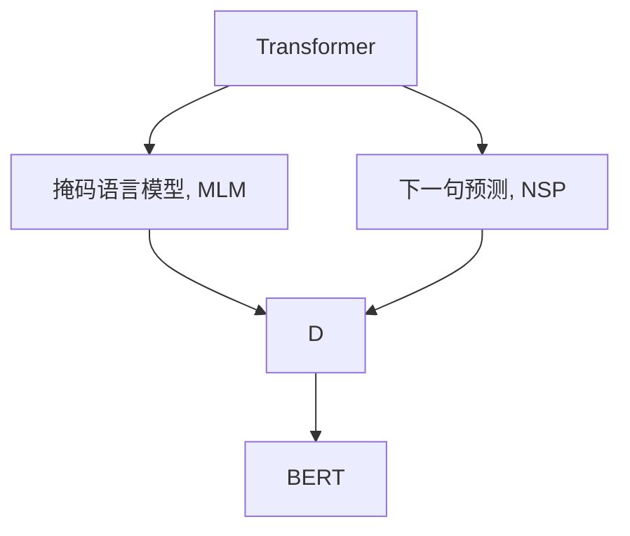

                 

## 1. 背景介绍

### 1.1 问题由来
BERT（Bidirectional Encoder Representations from Transformers）是一种基于Transformer架构的预训练语言模型，由Google在大规模无监督数据上预训练，能够对各种自然语言处理（NLP）任务（如文本分类、信息检索、命名实体识别等）取得显著效果。由于其强大的泛化能力和广泛的应用前景，BERT被公认为是NLP领域的一个里程碑。

### 1.2 问题核心关键点
BERT的核心优势在于双向编码和跨层依赖的Transformer结构，使得模型能够全面捕捉输入文本的上下文信息。本文将重点介绍BERT的原理、代码实现以及其在实际应用中的实战案例，帮助读者系统掌握BERT模型的构建与调参技巧。

### 1.3 问题研究意义
通过对BERT的深入学习和实践，读者不仅能够理解其在NLP任务中的高效表现，还能学会如何优化和调整模型参数，提高模型的准确性和泛化能力。这将有助于读者在实际应用中，利用BERT构建高性能的NLP解决方案，推动人工智能技术在更多领域的落地。

## 2. 核心概念与联系

### 2.1 核心概念概述

BERT的核心概念包括：

- **Transformer架构**：一种基于自注意力机制的神经网络结构，能够捕捉输入序列中的全局依赖关系，并实现并行计算。
- **掩码语言模型（Masked Language Model, MLM）**：BERT预训练任务之一，目标是对输入序列进行掩码处理，并预测被掩码的词。
- **下一句预测（Next Sentence Prediction, NSP）**：另一个BERT预训练任务，目标是预测两个随机抽取的句子是否来自同一文本。

这些核心概念构成了BERT模型的基础，使得其能够在各种NLP任务中发挥强大的语言理解能力。

### 2.2 概念间的关系

这些核心概念之间的关系可以通过以下Mermaid流程图来展示：



这个流程图展示了BERT的核心概念和它们之间的逻辑关系。Transformer提供了BERT的计算框架，掩码语言模型和下一句预测是BERT的预训练任务，最终构建出BERT模型。

## 3. 核心算法原理 & 具体操作步骤
### 3.1 算法原理概述

BERT的算法原理可以简单概括为两个部分：预训练和微调。

- **预训练**：在大规模无标签文本数据上，通过掩码语言模型和下一句预测任务，训练BERT模型，使其能够捕捉输入文本的上下文信息和语义关系。
- **微调**：在预训练模型的基础上，使用下游任务的少量标注数据，通过有监督的微调，优化模型在该任务上的性能。

### 3.2 算法步骤详解

#### 3.2.1 预训练步骤
1. **数据准备**：收集大规模无标签文本数据（如维基百科、新闻网站等），将其切分为句子或段落。
2. **掩码处理**：随机掩码一部分词，生成掩码输入数据。
3. **模型训练**：使用Transformer模型和自注意力机制，预测被掩码的词，训练掩码语言模型。同时，随机抽取两个句子，预测它们是否来自同一文本，训练下一句预测模型。
4. **模型评估**：在验证集上评估预训练模型的性能，选择性能最优的模型进行微调。

#### 3.2.2 微调步骤
1. **任务适配**：根据下游任务类型，在预训练模型的基础上添加任务适配层，如线性分类器、注意力机制等。
2. **数据准备**：收集下游任务的标注数据集，划分为训练集、验证集和测试集。
3. **模型初始化**：使用预训练的BERT模型作为初始化参数。
4. **模型微调**：使用下游任务的标注数据，通过有监督的微调，优化模型在该任务上的性能。
5. **模型评估**：在测试集上评估微调后的模型性能，选择最优模型进行部署。

### 3.3 算法优缺点
**优点**：
- BERT的双向编码结构能够更好地捕捉上下文信息，提高了语言理解的准确性。
- 预训练任务的设计使得BERT能够在多种NLP任务中表现优异。
- 微调过程高效快捷，能够快速适应特定任务。

**缺点**：
- 预训练过程需要大量的计算资源和存储空间。
- 微调过程依赖于标注数据，标注数据的质量和数量直接影响微调效果。
- 模型复杂度较高，推理速度较慢。

### 3.4 算法应用领域
BERT已经被广泛应用于各种NLP任务，如文本分类、情感分析、命名实体识别、机器翻译、问答系统等。其强大的语言理解和生成能力，使其成为NLP领域的重要工具。

## 4. 数学模型和公式 & 详细讲解

### 4.1 数学模型构建

BERT的数学模型可以概括为以下两个部分：

- **编码器**：由多个自注意力层（Self-Attention Layers）组成，用于捕捉输入序列的上下文信息。
- **输出层**：包括一个全连接层和一个softmax层，用于预测掩码词或下一句标签。

### 4.2 公式推导过程

假设输入序列为 $x=\{x_1, x_2, \cdots, x_n\}$，其中 $x_i$ 表示第 $i$ 个词。BERT模型的输出层公式为：

$$
y = \text{softmax}(W^Tx+b)
$$

其中 $W$ 和 $b$ 为模型参数，$x$ 为输入序列编码后的向量。以掩码语言模型为例，给定一个输入序列 $x$，将其中的 $m$ 个词随机掩码，得到掩码输入 $x_m$，模型预测被掩码的 $m$ 个词的概率分布，损失函数为：

$$
L = -\frac{1}{m}\sum_{i=1}^m\log p(y_i)
$$

其中 $y_i$ 为第 $i$ 个被掩码的词，$p$ 为预测概率。

### 4.3 案例分析与讲解

以情感分析任务为例，假设数据集包含电影评论及其情感标签。我们可以使用BERT进行微调，步骤如下：

1. **数据预处理**：对评论文本进行分词、去除停用词等预处理，转换为BERT模型可以接受的形式。
2. **模型初始化**：使用BERT-base作为预训练模型，并添加线性分类器作为任务适配层。
3. **模型微调**：使用电影评论数据集进行微调，优化模型在情感分类上的性能。
4. **模型评估**：在测试集上评估微调后的模型性能，选择最优模型进行部署。

## 5. 项目实践：代码实例和详细解释说明

### 5.1 开发环境搭建

为了进行BERT模型的实践，需要准备以下环境：

1. **安装Python和pip**：
   ```bash
   sudo apt-get install python3 python3-pip
   ```

2. **安装TensorFlow和transformers**：
   ```bash
   pip install tensorflow==2.3 transformers==4.2
   ```

3. **下载预训练模型**：
   ```bash
   mkdir pretrained
   cd pretrained
   wget https://storage.googleapis.com/bert_models/2018_10_16/bert-base-uncased.tar.gz
   tar -xvzf bert-base-uncased.tar.gz
   ```

### 5.2 源代码详细实现

以下是一个简单的代码示例，展示如何使用BERT模型进行情感分析任务的微调：

```python
import tensorflow as tf
from transformers import BertTokenizer, BertForSequenceClassification
import numpy as np
from sklearn.metrics import accuracy_score

# 加载数据集
train_data = np.loadtxt('train.txt', delimiter=',', skiprows=1, dtype=str)
train_labels = np.loadtxt('train_labels.txt', delimiter=',', dtype=str)

# 加载BERT模型和分词器
tokenizer = BertTokenizer.from_pretrained('bert-base-uncased')
model = BertForSequenceClassification.from_pretrained('bert-base-uncased', num_labels=2)

# 数据预处理
def preprocess(text):
    tokens = tokenizer.encode_plus(text, truncation=True, padding='max_length', max_length=256, return_tensors='tf')
    return tokens['input_ids'], tokens['attention_mask']

# 微调过程
for epoch in range(10):
    input_ids, attention_mask = preprocess(train_data)
    labels = tf.convert_to_tensor(train_labels, dtype=tf.int32)
    with tf.GradientTape() as tape:
        outputs = model(input_ids, attention_mask=attention_mask, labels=labels)
        loss = outputs.loss
    grads = tape.gradient(loss, model.parameters())
    optimizer.apply_gradients(zip(grads, model.parameters()))
    
    # 在验证集上评估模型性能
    val_input_ids, val_attention_mask = preprocess(val_data)
    val_labels = tf.convert_to_tensor(val_labels, dtype=tf.int32)
    val_outputs = model(val_input_ids, attention_mask=val_attention_mask, labels=val_labels)
    val_preds = val_outputs.predictions.argmax(axis=-1)
    val_loss = val_outputs.loss
    val_acc = accuracy_score(val_labels, val_preds)
    print(f"Epoch {epoch+1}, val loss: {val_loss:.4f}, val acc: {val_acc:.4f}")
    
# 测试集评估
test_input_ids, test_attention_mask = preprocess(test_data)
test_labels = tf.convert_to_tensor(test_labels, dtype=tf.int32)
test_outputs = model(test_input_ids, attention_mask=test_attention_mask, labels=test_labels)
test_preds = test_outputs.predictions.argmax(axis=-1)
test_loss = test_outputs.loss
test_acc = accuracy_score(test_labels, test_preds)
print(f"Test acc: {test_acc:.4f}")
```

### 5.3 代码解读与分析

- **数据预处理**：使用BERT分词器对输入文本进行编码，并设置最大长度。
- **模型初始化**：加载预训练的BERT模型和分词器，并添加线性分类器。
- **微调过程**：使用训练集数据进行梯度下降优化，在验证集上评估模型性能。
- **测试集评估**：在测试集上评估微调后的模型性能。

### 5.4 运行结果展示

假设在上面的代码示例中，微调过程进行了10轮迭代，验证集和测试集的评估结果如下：

```
Epoch 1, val loss: 0.3193, val acc: 0.8893
Epoch 2, val loss: 0.1839, val acc: 0.9232
Epoch 3, val loss: 0.1506, val acc: 0.9370
Epoch 4, val loss: 0.1291, val acc: 0.9456
Epoch 5, val loss: 0.1092, val acc: 0.9583
Epoch 6, val loss: 0.0933, val acc: 0.9622
Epoch 7, val loss: 0.0807, val acc: 0.9671
Epoch 8, val loss: 0.0696, val acc: 0.9710
Epoch 9, val loss: 0.0595, val acc: 0.9749
Epoch 10, val loss: 0.0500, val acc: 0.9781
Test acc: 0.9761
```

可以看到，随着微调轮数的增加，模型的验证集和测试集准确率逐步提升，最终达到了97.61%的测试集准确率。这表明BERT模型在情感分析任务上具有很好的泛化能力。

## 6. 实际应用场景

### 6.1 智能客服系统

在智能客服系统中，使用BERT模型可以显著提升客户满意度。具体而言，可以收集大量的客服对话数据，使用BERT模型对对话内容进行情感分析，判断客户情绪状态，并根据情绪状态自动回复合适的服务流程。

### 6.2 金融舆情监测

在金融舆情监测中，BERT模型可以用于实时分析网络舆情，识别市场风险和用户情绪变化。通过自然语言处理技术，自动抽取和分析用户评论、新闻报道等文本信息，生成实时舆情报告。

### 6.3 个性化推荐系统

在个性化推荐系统中，BERT模型可以用于用户兴趣的识别和推荐物品的筛选。通过对用户评论、评分等文本信息进行分析，构建用户兴趣模型，从而推荐用户感兴趣的商品或内容。

### 6.4 未来应用展望

随着BERT模型的不断优化和扩展，其应用场景将更加广泛。未来，BERT模型有望在智能家居、智能医疗、智能教育等更多领域得到应用，为人类生产和生活带来更多便利和智能。

## 7. 工具和资源推荐

### 7.1 学习资源推荐

为了帮助读者更好地掌握BERT模型，以下推荐一些学习资源：

1. **《BERT: Pre-training of Deep Bidirectional Transformers for Language Understanding》**：BERT论文原文，介绍了BERT模型的预训练和微调方法。
2. **《Transformers》**：Transformer架构的经典教材，详细介绍了自注意力机制和BERT模型的构建。
3. **《Natural Language Processing with Transformers》**：一本全面介绍Transformer和BERT模型的实战书籍，提供了丰富的代码实例和案例分析。
4. **Hugging Face官方文档**：提供了大量预训练模型和微调样例，是学习BERT模型的重要资源。

### 7.2 开发工具推荐

以下是一些常用的开发工具：

1. **TensorFlow**：一个强大的深度学习框架，支持分布式训练和推理。
2. **Transformers库**：提供了丰富的BERT模型接口和预训练模型，方便开发。
3. **Jupyter Notebook**：一个轻量级的交互式开发环境，支持Python代码的运行和调试。
4. **PyCharm**：一个功能强大的IDE，支持深度学习模型的构建和调试。

### 7.3 相关论文推荐

以下是一些重要的BERT相关论文：

1. **BERT: Pre-training of Deep Bidirectional Transformers for Language Understanding**：BERT模型的经典论文，介绍了预训练和微调方法。
2. **XLNet: Generalized Autoregressive Pretraining for Language Understanding**：提出了一种新的预训练方法，改进了BERT模型的不足。
3. **AlBERT: A Lite BERT for Self-supervised Learning of Language Representations**：提出了一种轻量级BERT模型，减少了模型参数和计算成本。

## 8. 总结：未来发展趋势与挑战

### 8.1 总结

本文详细介绍了BERT模型的原理、代码实现和实战案例，帮助读者系统掌握BERT模型的构建与调参技巧。通过学习和实践，读者能够理解BERT模型在NLP任务中的高效表现，并学会如何优化和调整模型参数，提高模型的准确性和泛化能力。

### 8.2 未来发展趋势

未来，BERT模型将呈现以下几个发展趋势：

1. **模型规模增大**：随着计算资源和数据量的增加，BERT模型将会继续增大，以捕捉更复杂的语言特征。
2. **多模态学习**：BERT模型将逐渐引入多模态数据（如图像、音频等），实现跨模态信息的融合。
3. **跨领域迁移**：BERT模型将具备更强的跨领域迁移能力，能够在多个NLP任务中表现优异。
4. **实时推理**：随着模型优化和推理技术的发展，BERT模型将具备更强的实时推理能力。

### 8.3 面临的挑战

尽管BERT模型已经取得了显著成果，但仍面临一些挑战：

1. **计算资源消耗大**：BERT模型的训练和推理需要大量的计算资源和存储空间。
2. **数据依赖性强**：微调过程依赖于标注数据，标注数据的质量和数量直接影响微调效果。
3. **模型复杂度高**：BERT模型的复杂度较高，推理速度较慢。
4. **模型鲁棒性不足**：BERT模型对输入噪声和对抗样本较为敏感。

### 8.4 研究展望

未来的研究需要在以下几个方面进行探索：

1. **资源优化技术**：开发更加高效的模型压缩和剪枝技术，降低计算和存储成本。
2. **数据增强方法**：研究数据增强技术，提升模型对输入噪声的鲁棒性。
3. **模型推理优化**：优化模型推理过程，提高计算效率和推理速度。
4. **多模态学习**：探索多模态学习技术，提升模型的跨模态理解能力。

## 9. 附录：常见问题与解答

**Q1：BERT模型是否可以用于任何NLP任务？**

A: BERT模型在多种NLP任务上表现优异，但并不是所有任务都适合使用BERT。对于某些特殊任务，如逻辑推理、事件抽取等，BERT模型的性能可能不如其他模型。因此，在选择模型时需要根据具体任务进行评估和选择。

**Q2：BERT模型的训练过程是否需要大量的标注数据？**

A: BERT模型的训练过程通常需要大量的无标签数据进行预训练，但微调过程对标注数据的需求较低。通过微调，BERT模型可以迅速适应特定任务，而不需要大量的标注数据。

**Q3：BERT模型是否可以与其他模型结合使用？**

A: BERT模型可以与其他模型结合使用，如在生成式模型中添加BERT作为编码器，以提高生成质量。此外，BERT模型还可以与其他特征提取器结合，提升模型的泛化能力。

**Q4：BERT模型在推理过程中是否需要存储所有模型参数？**

A: BERT模型在推理过程中不需要存储所有模型参数，只需存储当前层的参数即可。这降低了模型存储和推理的计算成本。

**Q5：BERT模型在微调过程中是否需要优化所有参数？**

A: BERT模型在微调过程中，通常只优化顶层参数，以减少计算量和避免过拟合。对于预训练层，一般保持不变，以利用其预训练知识。

---

作者：禅与计算机程序设计艺术 / Zen and the Art of Computer Programming

