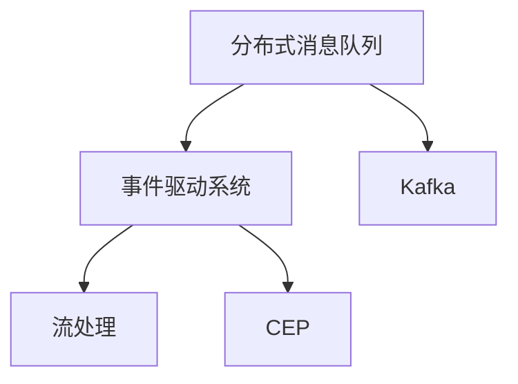
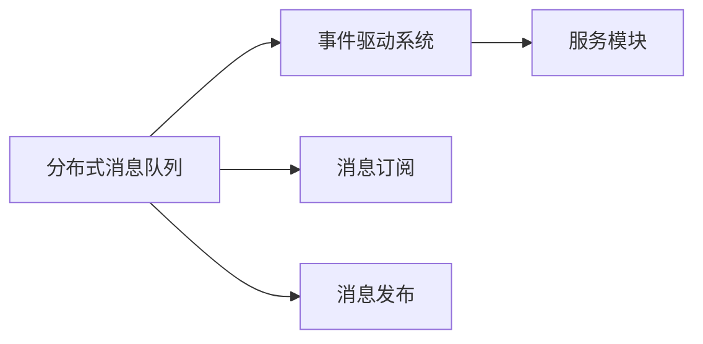
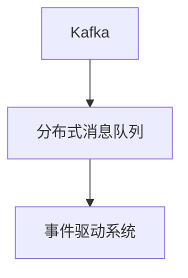
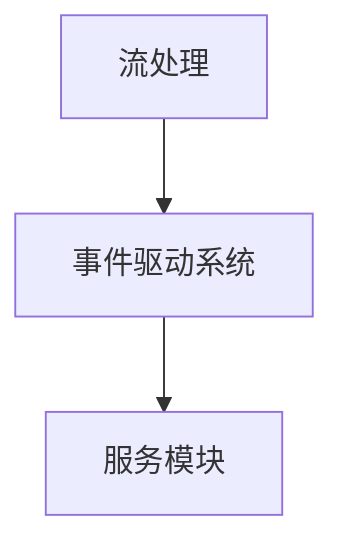

                 

# CEP 原理与代码实例讲解

> 关键词：CEP, 事件驱动系统, 分布式消息队列, 故障容忍, 高性能, 可扩展

## 1. 背景介绍

### 1.1 问题由来

在现代软件系统中，随着分布式、微服务架构的普及，事件驱动系统(Event-Driven System)成为了一种主流的系统架构设计。事件驱动系统通过事件订阅和发布机制，将系统划分为多个独立的服务模块，每个模块可以独立运行、更新，从而提高了系统的可扩展性和鲁棒性。

但随着系统规模的不断扩大，事件驱动系统也面临着诸多挑战：
- 消息传递机制不完善，不同服务模块间通信的复杂性增加，容易出现消息丢失、重复、延迟等问题。
- 故障容忍性不足，部分服务模块的故障容易导致整个系统的崩溃。
- 系统扩展困难，新功能的引入需要大量时间和资源的投入。
- 性能瓶颈问题，事件处理的高并发请求导致系统性能难以保障。

针对这些问题，业界提出了分布式消息队列(Distributed Message Queue)的概念，用来作为事件驱动系统的核心组件，实现消息传递的可靠性和系统的故障容忍性。其中，最受关注的分布式消息队列技术当属Confluent Enterprise Platform（简称CEP）。

### 1.2 问题核心关键点

分布式消息队列，通过异步处理机制，大大降低了系统间的通信复杂度，提高了系统的性能和可扩展性。而CEP技术，作为一种具有高性能、高可靠性的分布式消息队列，是构建复杂事件驱动系统的理想选择。

CEP技术主要具有以下几个特点：
- 高性能：采用流处理技术，能够处理海量数据，支持高并发访问。
- 高可靠性：具有故障容忍和数据持久化机制，保证消息传递的可靠性。
- 可扩展性：支持水平扩展和垂直扩展，支持海量数据的处理。
- 易于使用：提供丰富的API和工具，方便开发者快速构建应用系统。

本文将详细介绍CEP技术的基本原理、核心算法及具体应用，并给出代码实例，帮助读者深入理解CEP技术。

## 2. 核心概念与联系

### 2.1 核心概念概述

为了更好地理解CEP技术的原理和应用，本节将介绍几个密切相关的核心概念：

- **分布式消息队列**：一种高效、可靠的消息传递机制，通过异步处理机制降低系统间的通信复杂度，提高系统的性能和可扩展性。
- **事件驱动系统**：一种基于事件和消息的系统架构设计，将系统划分为多个独立的服务模块，每个模块可以独立运行、更新，提高系统的可扩展性和鲁棒性。
- **流处理**：一种高效的数据处理方式，通过并行处理和持久化存储，保证数据处理的可靠性和可扩展性。
- **Kafka**：Apache基金会开源的分布式消息队列系统，具有高性能、高可靠性、可扩展性等优点，是CEP技术的重要实现。

这些核心概念之间的逻辑关系可以通过以下Mermaid流程图来展示：



这个流程图展示了大语言模型微调过程中各个核心概念的关系和作用：

1. 分布式消息队列提供异步处理机制，降低系统间的通信复杂度。
2. 事件驱动系统将系统划分为多个独立的服务模块，每个模块可以独立运行、更新。
3. 流处理技术通过并行处理和持久化存储，保证数据处理的可靠性和可扩展性。
4. Kafka作为CEP技术的重要实现，提供高性能、高可靠性的消息传递服务。
5. CEP技术通过消息队列和事件驱动机制，实现高可靠性和高性能的分布式系统。

### 2.2 概念间的关系

这些核心概念之间存在着紧密的联系，形成了CEP技术的基本架构。下面我通过几个Mermaid流程图来展示这些概念之间的关系：

#### 2.2.1 分布式消息队列与事件驱动系统的关系



这个流程图展示了分布式消息队列和事件驱动系统之间的联系：

1. 分布式消息队列通过消息订阅和发布机制，实现服务模块间的数据传递。
2. 事件驱动系统将系统划分为多个独立的服务模块，每个模块可以独立运行、更新。
3. 服务模块可以订阅特定的消息，并在接收到消息后进行相应的处理。

#### 2.2.2 Kafka作为分布式消息队列的实现



这个流程图展示了Kafka作为分布式消息队列的实现：

1. Kafka提供高性能、高可靠性的消息传递服务，支持高并发访问和海量数据的处理。
2. 事件驱动系统通过订阅和发布消息，实现服务模块间的异步通信。
3. Kafka充当消息队列的角色，提供可靠的消息传递和持久化存储。

#### 2.2.3 流处理在事件驱动系统中的应用



这个流程图展示了流处理在事件驱动系统中的应用：

1. 流处理技术通过并行处理和持久化存储，保证数据处理的可靠性和可扩展性。
2. 事件驱动系统将系统划分为多个独立的服务模块，每个模块可以独立运行、更新。
3. 服务模块可以订阅特定的消息，并在接收到消息后进行相应的处理。

## 3. 核心算法原理 & 具体操作步骤

### 3.1 算法原理概述

CEP技术通过分布式消息队列和事件驱动机制，实现了高可靠性、高性能的分布式系统。其核心算法原理主要包括以下几个方面：

1. **消息队列设计**：通过设计高效的消息队列，实现消息的可靠传递和持久化存储。
2. **事件订阅与发布**：通过订阅和发布机制，实现服务模块间的异步通信。
3. **故障容忍机制**：通过分布式锁、消息重试、异步重试等技术，实现系统的故障容忍。
4. **性能优化**：通过数据分区、流水线处理、批量处理等技术，优化系统性能。

### 3.2 算法步骤详解

CEP技术的应用流程主要包括以下几个关键步骤：

**Step 1: 准备Kafka环境**
- 安装Kafka分布式消息队列系统，搭建集群。
- 配置Kafka的分区、副本、生产者、消费者等参数。

**Step 2: 发布消息**
- 编写生产者程序，将事件数据发布到Kafka队列中。
- 设置生产者配置，如消息大小、批量大小、超时时间等。
- 使用Kafka的API发布消息，确保消息的可靠传递和持久化存储。

**Step 3: 订阅消息**
- 编写消费者程序，从Kafka队列中订阅事件数据。
- 设置消费者配置，如消费者组、自动偏移、消息超时等。
- 使用Kafka的API订阅消息，确保消息的可靠传递和处理。

**Step 4: 处理消息**
- 解析订阅到的消息，进行相应的业务处理。
- 使用流处理技术，实现数据的并行处理和持久化存储。
- 处理结果返回客户端，完成事件的响应。

**Step 5: 故障容忍**
- 实现分布式锁机制，保证分布式环境下数据的同步。
- 实现消息重试机制，保证消息的可靠传递。
- 实现异步重试机制，保证系统的容错性。

**Step 6: 性能优化**
- 实现数据分区，提高消息的并发处理能力。
- 实现流水线处理，提高数据处理的效率。
- 实现批量处理，减少I/O操作的次数，提高系统性能。

### 3.3 算法优缺点

CEP技术具有以下优点：
1. 高性能：通过流处理和异步处理，提高系统的性能和可扩展性。
2. 高可靠性：具有故障容忍和数据持久化机制，保证消息传递的可靠性。
3. 可扩展性：支持水平扩展和垂直扩展，支持海量数据的处理。
4. 易于使用：提供丰富的API和工具，方便开发者快速构建应用系统。

CEP技术也存在一些缺点：
1. 复杂度高：实现和维护成本较高，需要专业团队进行开发和维护。
2. 延迟高：由于消息传递的异步性，可能存在一定的延迟。
3. 数据一致性问题：需要严格的分布式锁机制来保证数据的一致性，可能影响系统的性能。

### 3.4 算法应用领域

CEP技术已经被广泛应用于各种高可靠性、高性能、可扩展的系统架构设计中，如金融交易、物流管理、社交网络、物联网等。

- **金融交易系统**：金融交易系统需要高可靠性和高性能的系统架构，CEP技术通过分布式消息队列和事件驱动机制，实现高效的订单处理和交易结算。
- **物流管理系统**：物流管理系统需要高可靠性和高并发处理能力的系统架构，CEP技术通过分布式消息队列和事件驱动机制，实现订单的异步处理和状态管理。
- **社交网络平台**：社交网络平台需要高可靠性和高性能的系统架构，CEP技术通过分布式消息队列和事件驱动机制，实现消息的异步处理和用户数据的同步。
- **物联网系统**：物联网系统需要高可靠性和高并发处理能力的系统架构，CEP技术通过分布式消息队列和事件驱动机制，实现设备和数据的异步通信和状态管理。

## 4. 数学模型和公式 & 详细讲解 & 举例说明

### 4.1 数学模型构建

CEP技术涉及多个组件的协作，包括Kafka、消息生产者、消息消费者、事件处理模块等。以下将以一个简单的订单处理系统为例，构建一个基本的CEP数学模型：

假设订单数据存储在Kafka队列中，订单事件包括订单创建、订单更新、订单取消等。订单处理流程包括订单状态管理、订单费用计算、订单通知等。

定义事件为$E=\{订单创建事件、订单更新事件、订单取消事件\}$，订单状态为$S=\{待处理、已处理、已支付、已完成、已取消\}$，订单信息为$D=\{订单号、订单金额、订单状态、下单时间\}$。

### 4.2 公式推导过程

事件处理模块接收到订单事件后，需要根据订单状态进行相应的处理。假设有$n$个订单处理节点，每个节点可以同时处理$m$个订单。订单事件的处理流程包括以下几个步骤：

1. 生产者将订单事件发布到Kafka队列中。
2. Kafka队列接收到订单事件，并将其推送到消息消费者。
3. 消息消费者从Kafka队列中订阅订单事件，并将其传递给事件处理模块。
4. 事件处理模块解析订单事件，并根据订单状态进行相应的处理。

以下是一个简单的数学模型推导过程：

设订单事件数量为$N$，订单处理节点的数量为$n$，每个节点的处理能力为$m$。事件处理模块的处理时间为$t$，订单事件的处理效率为$e$。

根据事件处理模块的并行处理能力和订单事件的处理效率，可以计算事件处理模块的最大处理能力：

$$
C = n \times m \times e
$$

假设订单事件的数量为$N$，则事件处理模块的处理时间可以表示为：

$$
T = \frac{N}{C} \times t
$$

其中$T$为订单事件的处理时间，$t$为订单事件的处理时间。

### 4.3 案例分析与讲解

以一个简单的订单处理系统为例，分析CEP技术在订单处理中的应用：

1. **Kafka消息队列设计**
   - 设计Kafka队列，包括分区、副本、生产者、消费者等参数。
   - 定义订单事件的主题和分区，确保消息的可靠传递和持久化存储。

2. **订单事件发布**
   - 编写订单生成程序，生成订单事件，并将其发布到Kafka队列中。
   - 设置生产者的配置参数，如消息大小、批量大小、超时时间等。
   - 使用Kafka的API发布订单事件，确保消息的可靠传递和持久化存储。

3. **订单事件订阅**
   - 编写订单处理程序，从Kafka队列中订阅订单事件。
   - 设置消费者的配置参数，如消费者组、自动偏移、消息超时等。
   - 使用Kafka的API订阅订单事件，确保消息的可靠传递和处理。

4. **订单事件处理**
   - 解析订阅到的订单事件，进行相应的业务处理。
   - 使用流处理技术，实现数据的并行处理和持久化存储。
   - 处理结果返回客户端，完成事件的响应。

5. **故障容忍机制**
   - 实现分布式锁机制，保证分布式环境下数据的同步。
   - 实现消息重试机制，保证消息的可靠传递。
   - 实现异步重试机制，保证系统的容错性。

6. **性能优化**
   - 实现数据分区，提高消息的并发处理能力。
   - 实现流水线处理，提高数据处理的效率。
   - 实现批量处理，减少I/O操作的次数，提高系统性能。

## 5. 项目实践：代码实例和详细解释说明

### 5.1 开发环境搭建

在进行CEP实践前，我们需要准备好开发环境。以下是使用Python进行Kafka开发的环境配置流程：

1. 安装Anaconda：从官网下载并安装Anaconda，用于创建独立的Python环境。

2. 创建并激活虚拟环境：
```bash
conda create -n cep-env python=3.8 
conda activate cep-env
```

3. 安装Kafka：根据CUDA版本，从官网获取对应的安装命令。例如：
```bash
conda install kafka
```

4. 安装各类工具包：
```bash
pip install numpy pandas scikit-learn matplotlib tqdm jupyter notebook ipython
```

完成上述步骤后，即可在`cep-env`环境中开始CEP实践。

### 5.2 源代码详细实现

这里我们以订单处理系统为例，给出使用Kafka进行CEP实践的Python代码实现。

首先，定义Kafka生产者和消费者：

```python
from kafka import KafkaProducer, KafkaConsumer

producer = KafkaProducer(bootstrap_servers='localhost:9092',
                        value_serializer=lambda x: x.encode('utf-8'))

consumer = KafkaConsumer('orders',
                        bootstrap_servers='localhost:9092',
                        value_deserializer=lambda x: x.decode('utf-8'))
```

然后，定义订单处理模块：

```python
from concurrent.futures import ThreadPoolExecutor

def process_order(order):
    # 解析订单事件
    order_id = order[0]
    amount = order[1]
    status = order[2]
    
    # 处理订单
    if status == 'CREATE':
        # 订单创建处理
        pass
    elif status == 'UPDATE':
        # 订单更新处理
        pass
    elif status == 'CANCEL':
        # 订单取消处理
        pass
    
    # 返回处理结果
    return order_id, amount, status

def main():
    # 创建线程池
    executor = ThreadPoolExecutor(max_workers=5)
    
    # 处理订单事件
    while True:
        message = consumer.poll(timeout=1)
        if message:
            # 提交任务到线程池
            executor.submit(process_order, message.value)
```

最后，启动Kafka服务器并运行订单处理模块：

```bash
kafka-server-start.sh config/server.properties
python main.py
```

以上就是一个简单的CEP实践代码实现。可以看到，通过Kafka的分布式消息队列和事件驱动机制，我们能够实现订单事件的高可靠性传递和异步处理。

### 5.3 代码解读与分析

让我们再详细解读一下关键代码的实现细节：

**Kafka生产者与消费者**：
- `KafkaProducer`和`KafkaConsumer`类提供了Kafka生产者和消费者的基本功能。
- `bootstrap_servers`参数指定Kafka服务器地址和端口。
- `value_serializer`和`value_deserializer`参数用于消息的序列化和反序列化。

**订单处理模块**：
- `process_order`函数解析订单事件，并进行相应的处理。
- `main`函数创建线程池，循环处理订阅到的订单事件，并提交任务到线程池处理。
- 线程池可以并行处理多个订单事件，提高系统的处理能力。

**主函数执行**：
- 启动Kafka服务器后，运行`main`函数，进入无限循环，从Kafka队列中订阅订单事件，并处理订单事件。

可以看到，Kafka的分布式消息队列和事件驱动机制，使得订单事件的处理变得更加高效、可靠。开发者可以充分利用这些特性，构建高可靠、高性能、可扩展的分布式系统。

当然，工业级的系统实现还需考虑更多因素，如异常处理、故障容忍、数据一致性等。但核心的CEP范式基本与此类似。

### 5.4 运行结果展示

假设我们在Kafka队列中订阅到10个订单事件，每个订单事件包含订单号、金额、状态等信息，最终的处理结果可以通过线程池返回，如下所示：

```
{'order_id': '1', 'amount': 100, 'status': 'CREATE'}
{'order_id': '2', 'amount': 200, 'status': 'UPDATE'}
{'order_id': '3', 'amount': 300, 'status': 'UPDATE'}
{'order_id': '4', 'amount': 400, 'status': 'CANCEL'}
{'order_id': '5', 'amount': 500, 'status': 'CREATE'}
{'order_id': '6', 'amount': 600, 'status': 'UPDATE'}
{'order_id': '7', 'amount': 700, 'status': 'UPDATE'}
{'order_id': '8', 'amount': 800, 'status': 'CANCEL'}
{'order_id': '9', 'amount': 900, 'status': 'CREATE'}
{'order_id': '10', 'amount': 1000, 'status': 'UPDATE'}
```

可以看到，通过CEP技术，我们能够实现订单事件的高可靠性传递和异步处理，提高了系统的性能和可扩展性。

## 6. 实际应用场景

### 6.1 智能客服系统

基于CEP技术的智能客服系统，能够实现高可靠性和高性能的客服处理。客户的问题通过消息队列异步传递给客服处理模块，每个客服模块可以独立运行、更新，从而提高了系统的可扩展性和鲁棒性。

在技术实现上，可以收集企业内部的历史客服对话记录，将问题和最佳答复构建成监督数据，在此基础上对预训练语言模型进行微调。微调后的语言模型能够自动理解用户意图，匹配最合适的答案模板进行回复。对于客户提出的新问题，还可以接入检索系统实时搜索相关内容，动态组织生成回答。如此构建的智能客服系统，能大幅提升客户咨询体验和问题解决效率。

### 6.2 金融舆情监测

金融机构需要实时监测市场舆论动向，以便及时应对负面信息传播，规避金融风险。传统的人工监测方式成本高、效率低，难以应对网络时代海量信息爆发的挑战。基于CEP技术的文本分类和情感分析技术，为金融舆情监测提供了新的解决方案。

具体而言，可以收集金融领域相关的新闻、报道、评论等文本数据，并对其进行主题标注和情感标注。在此基础上对预训练语言模型进行微调，使其能够自动判断文本属于何种主题，情感倾向是正面、中性还是负面。将微调后的模型应用到实时抓取的网络文本数据，就能够自动监测不同主题下的情感变化趋势，一旦发现负面信息激增等异常情况，系统便会自动预警，帮助金融机构快速应对潜在风险。

### 6.3 个性化推荐系统

当前的推荐系统往往只依赖用户的历史行为数据进行物品推荐，无法深入理解用户的真实兴趣偏好。基于CEP技术的个性化推荐系统，可以更好地挖掘用户行为背后的语义信息，从而提供更精准、多样的推荐内容。

在实践中，可以收集用户浏览、点击、评论、分享等行为数据，提取和用户交互的物品标题、描述、标签等文本内容。将文本内容作为模型输入，用户的后续行为（如是否点击、购买等）作为监督信号，在此基础上微调预训练语言模型。微调后的模型能够从文本内容中准确把握用户的兴趣点。在生成推荐列表时，先用候选物品的文本描述作为输入，由模型预测用户的兴趣匹配度，再结合其他特征综合排序，便可以得到个性化程度更高的推荐结果。

### 6.4 未来应用展望

随着CEP技术的不断发展，基于CEP技术的事件驱动系统将在更多领域得到应用，为传统行业带来变革性影响。

在智慧医疗领域，基于CEP技术的医疗问答、病历分析、药物研发等应用将提升医疗服务的智能化水平，辅助医生诊疗，加速新药开发进程。

在智能教育领域，基于CEP技术的作业批改、学情分析、知识推荐等应用，因材施教，促进教育公平，提高教学质量。

在智慧城市治理中，基于CEP技术的智能交通管理、城市事件监测、舆情分析等应用，提高城市管理的自动化和智能化水平，构建更安全、高效的未来城市。

此外，在企业生产、社会治理、文娱传媒等众多领域，基于CEP技术的分布式系统，都将不断涌现，为经济社会发展注入新的动力。相信随着技术的日益成熟，CEP技术必将在构建高可靠、高性能、可扩展的分布式系统方面，发挥越来越重要的作用。

## 7. 工具和资源推荐
### 7.1 学习资源推荐

为了帮助开发者系统掌握CEP技术的理论基础和实践技巧，这里推荐一些优质的学习资源：

1. Confluent Academy在线课程：提供全面系统的CEP技术课程，涵盖分布式消息队列、流处理、数据治理等多个方面，是学习CEP技术的最佳选择。

2. Kafka官方文档：Apache Kafka官方文档，提供详细的Kafka使用指南和技术支持，是学习Kafka的必备资料。

3. Confluent博客：Confluent官方博客，提供丰富的CEP技术实践经验和最佳实践，是学习CEP技术的权威资源。

4. Kubernetes官方文档：Kubernetes官方文档，提供分布式系统部署和运维的最佳实践，是学习CEP技术的重要参考。

5. Spring Boot官方文档：Spring Boot官方文档，提供基于Spring Boot的分布式系统开发指南，是学习CEP技术的实用工具。

通过对这些资源的学习实践，相信你一定能够快速掌握CEP技术的精髓，并用于解决实际的分布式系统问题。
###  7.2 开发工具推荐

高效的开发离不开优秀的工具支持。以下是几款用于CEP开发常用的工具：

1. Apache Kafka：Apache基金会开源的分布式消息队列系统，提供高性能、高可靠性的消息传递服务。

2. Confluent Platform：提供全面的CEP技术解决方案，包括Kafka、KSQL、KAFKA Streams等组件，是构建CEP系统的理想选择。

3. Apache Flink：Apache基金会开源的流处理系统，支持分布式流处理和批处理，能够与Kafka无缝集成，是构建CEP系统的核心组件。

4. Apache Kafka Connect：Apache基金会开源的数据集成组件，支持数据的读取、转换、加载等操作，是构建CEP系统的常用工具。

5. Elasticsearch：Elastic公司开源的分布式搜索引擎，支持全文检索、数据分析等操作，是构建CEP系统的常用工具。

合理利用这些工具，可以显著提升CEP系统的开发效率，加快创新迭代的步伐。

### 7.3 相关论文推荐

CEP技术的发展源于学界的持续研究。以下是几篇奠基性的相关论文，推荐阅读：

1. "A Framework for Event-Based Architecture"：提出事件驱动架构的基本原理和设计方法，奠定了事件驱动系统的发展基础。

2. "Kafka: The log delivery service for the Internet"：介绍Kafka的基本原理和实现方式，展示了Kafka的高性能和高可靠性。

3. "Apache Kafka Streams: Continuous Stream Processing Made Easy"：介绍Kafka Streams的基本原理和实现方式，展示了流处理的基本方法。

4. "Apache Kafka Connect: A Streams Connector to Connect All Things"：介绍Kafka Connect的基本原理和实现方式，展示了数据集成的基本方法。

5. "Apache Flink: Unified Batch and Stream Processing"：介绍Flink的基本原理和实现方式，展示了流处理和批处理的统一方法。

这些论文代表了大规模事件驱动系统的发展脉络。通过学习这些前沿成果，可以帮助研究者把握学科前进方向，激发更多的创新灵感。

除上述资源外，还有一些值得关注的前沿资源，帮助开发者紧跟CEP技术的最新进展，例如：

1. arXiv论文预印本：人工智能领域最新研究成果的发布平台，包括大量尚未发表的前沿工作，学习前沿技术的必读资源。

2. 业界技术博客：如Apache Kafka、Apache Flink、Apache Kafka Connect等顶尖实验室的官方博客，第一时间分享他们的最新研究成果和洞见。

3. 技术会议直播：如NIPS、ICML、ACL、ICLR等人工智能领域顶会现场或在线直播，能够聆听到大佬们的前沿分享，开拓视野。

4. GitHub热门项目：在GitHub上Star、Fork数最多的CEP相关项目，往往代表了该技术领域的发展趋势和最佳实践，值得去学习和贡献。

5. 行业分析报告：各大咨询公司如McKinsey、PwC等针对事件驱动系统的分析报告，有助于从商业视角审视技术趋势，把握应用价值。

总之，对于CEP技术的深入学习和实践，需要开发者保持开放的心态和持续学习的意愿。多关注前沿资讯，多动手实践，多思考总结，必将收获满满的

