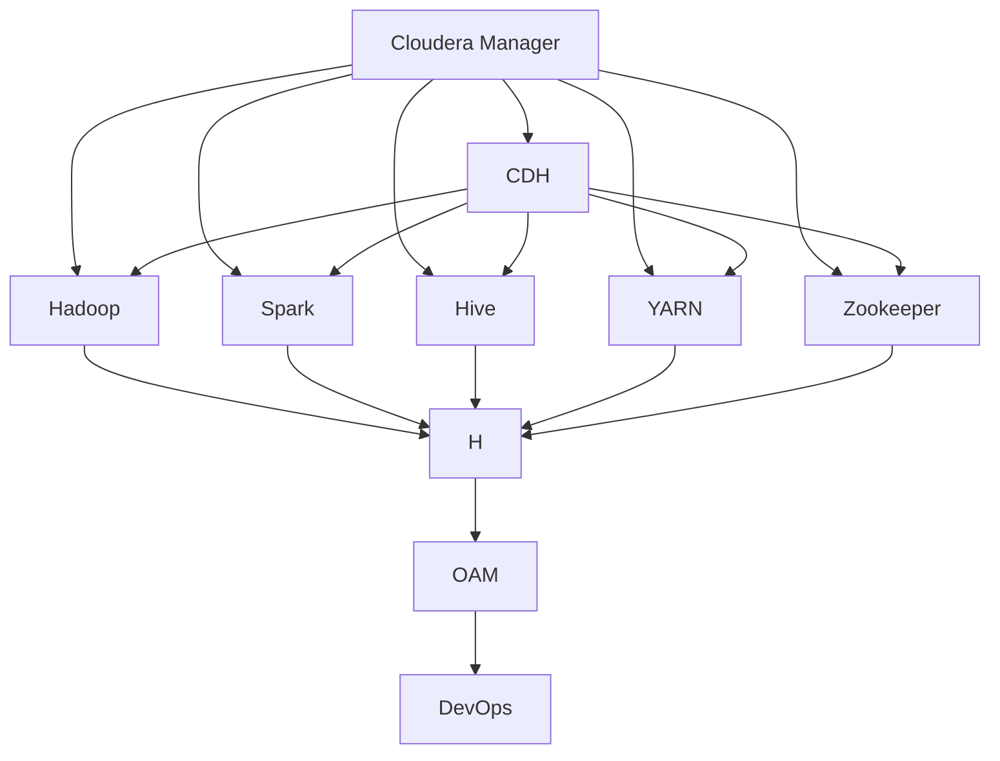

                 

# Cloudera Manager原理与代码实例讲解

> 关键词：Cloudera Manager, CDH, Hadoop, Hive, Spark, Zookeeper, YARN, PaaS, OAM, DevOps

## 1. 背景介绍

### 1.1 问题由来
随着大数据时代的到来，企业对数据处理的需求日益增长。为了应对这种需求，许多企业开始部署和使用Hadoop等大数据技术。然而，传统的大数据基础设施管理方式存在诸多问题：

1. **复杂性高**：分布式环境下的管理复杂，需要运维人员具备丰富的技术经验。
2. **运维成本高**：多台机器的管理和维护需要大量人力物力。
3. **故障率高**：分布式环境中的服务可能存在单点故障，导致系统宕机。
4. **可扩展性差**：难以灵活扩展集群规模，无法应对快速增长的数据处理需求。

为了解决这些问题，Cloudera公司推出了Cloudera Manager这一大数据基础设施管理平台，它能够简化Hadoop、Spark、Hive等大数据组件的管理，提升系统运维效率，降低运维成本，确保系统高可用性，同时提供强大的扩展能力。

### 1.2 问题核心关键点
Cloudera Manager的核心功能包括：

- **自动化管理**：自动监控、配置、升级和恢复Cloudera平台中的Hadoop、Spark、Hive、HBase、YARN、Kafka、Zookeeper等组件。
- **故障诊断**：提供详细的日志和告警信息，帮助运维人员快速定位故障。
- **性能优化**：通过监控、调整和优化组件配置，提高系统的整体性能。
- **资源管理**：动态调整集群资源，优化资源利用率。
- **安全管理**：集中管理用户权限和审计日志，保障系统的安全性和合规性。

Cloudera Manager的这些核心功能，使得企业能够高效、稳定、安全地运行大数据基础设施，极大地简化了大数据系统的运维和管理。

### 1.3 问题研究意义
研究Cloudera Manager的原理与实践，对于提升企业大数据平台的运维效率，降低运维成本，确保系统的高可用性和安全性，具有重要的意义：

1. **简化运维流程**：Cloudera Manager提供了自动化管理功能，减少了人工干预，降低了运维工作量和人为错误。
2. **提高系统可用性**：通过实时监控和故障诊断，及时发现和修复系统故障，保障大数据基础设施的高可用性。
3. **优化资源利用**：动态调整集群资源，提高系统的资源利用率和性能。
4. **增强安全管理**：集中管理权限和审计日志，保障系统的安全性和合规性。
5. **支持数据湖建设**：Cloudera Manager支持多种数据湖组件的集成，方便企业构建统一的数据湖平台。

此外，Cloudera Manager还提供了丰富的接口和插件，支持与各种PaaS、SaaS平台集成，为企业构建完整的大数据生态系统提供了有力支持。

## 2. 核心概念与联系

### 2.1 核心概念概述

为了更好地理解Cloudera Manager的工作原理和架构，本节将介绍几个关键概念：

- **Cloudera Manager**：Cloudera公司推出的企业级大数据基础设施管理平台，支持Hadoop、Spark、Hive等大数据组件的自动化管理。
- **CDH (Cloudera Distribution for Hadoop)**：Cloudera Manager的部署基础，包含Hadoop、Spark、Hive、HBase、YARN、Kafka、Zookeeper等组件。
- **Hadoop**：Apache基金会推出的分布式计算框架，支持大规模数据处理。
- **Spark**：Apache基金会推出的快速、通用的分布式计算引擎，支持内存计算和大数据处理。
- **Hive**：基于Hadoop的数据仓库解决方案，支持SQL查询和大数据处理。
- **YARN (Yet Another Resource Negotiator)**：Hadoop的资源管理系统，支持多种计算框架的资源管理。
- **Zookeeper**：Apache基金会推出的分布式协调服务，支持数据同步和系统配置。
- **PaaS (Platform as a Service)**：基于云平台的服务模式，提供软件即服务功能。
- **OAM (Operational Analytics Manager)**：Cloudera Manager中的运维分析工具，用于监控、优化和管理大数据基础设施。
- **DevOps**：开发和运维的集成，提升软件开发和系统运维的效率和质量。

这些概念之间存在着紧密的联系，构成了Cloudera Manager的核心生态系统。

### 2.2 概念间的关系

Cloudera Manager的核心概念之间存在着紧密的联系，可以概括为以下关系图：



这个关系图展示了Cloudera Manager与CDH及其下的大数据组件之间的关系。Cloudera Manager作为CDH的管理平台，通过监控、配置和升级等手段，管理着Hadoop、Spark、Hive、YARN、Zookeeper等组件。同时，Cloudera Manager还集成了OAM和DevOps等工具，进一步提升了大数据基础设施的管理效率和质量。

## 3. 核心算法原理 & 具体操作步骤
### 3.1 算法原理概述

Cloudera Manager的工作原理可以概括为以下几个步骤：

1. **数据收集与监控**：通过集成各种数据收集代理，实时收集Cloudera平台中的组件运行数据，并进行聚合和分析。
2. **故障检测与告警**：基于收集到的运行数据，使用预设的告警规则进行故障检测，生成告警信息，并通知运维人员。
3. **配置管理**：自动调整和优化组件配置，确保系统稳定运行。
4. **组件升级**：通过版本管理工具，自动下载、安装和更新组件，确保系统的最新版本。
5. **用户权限管理**：集中管理用户权限和审计日志，保障系统的安全性和合规性。

这些步骤构成了Cloudera Manager的核心算法原理，使得系统能够自动、高效地管理大数据基础设施。

### 3.2 算法步骤详解

接下来，我们将详细介绍Cloudera Manager的具体操作步骤：

#### 3.2.1 数据收集与监控

1. **配置数据收集代理**：在Cloudera Manager中，配置数据收集代理，设置代理的IP地址、端口号和密钥等信息。
2. **收集运行数据**：数据收集代理通过与Cloudera平台中的组件（如Hadoop、Spark、Hive等）通信，实时收集运行数据，包括CPU、内存、磁盘等性能指标。
3. **数据聚合与分析**：收集到的数据被聚合到一个集中式存储库中，使用Hadoop等工具进行分析和处理。

#### 3.2.2 故障检测与告警

1. **配置告警规则**：在Cloudera Manager中，配置告警规则，设置监控指标的阈值和告警方式。
2. **生成告警信息**：基于收集到的运行数据和预设的告警规则，生成告警信息，包括时间、组件、指标和值等。
3. **通知运维人员**：通过邮件、短信、钉钉等方式，将告警信息通知给运维人员，确保及时响应。

#### 3.2.3 配置管理

1. **配置模板**：在Cloudera Manager中，创建配置模板，定义组件的配置项和默认值。
2. **自动配置**：基于配置模板和运行数据，自动调整和优化组件配置，确保系统稳定运行。
3. **配置验证**：在配置生效前，进行配置验证，确保配置无误。

#### 3.2.4 组件升级

1. **版本管理**：在Cloudera Manager中，创建组件的版本管理配置，定义可用版本的列表和优先级。
2. **自动更新**：基于版本管理配置，自动下载、安装和更新组件，确保系统的最新版本。
3. **更新验证**：在组件更新后，进行更新验证，确保系统正常运行。

#### 3.2.5 用户权限管理

1. **集中管理**：在Cloudera Manager中，集中管理用户权限和审计日志，保障系统的安全性和合规性。
2. **角色授权**：基于角色的授权方式，定义用户对系统资源的访问权限。
3. **审计日志**：记录用户的访问日志，生成审计报告，用于安全审计和合规性检查。

### 3.3 算法优缺点

Cloudera Manager的优点包括：

- **自动化管理**：大大减少了人工干预，降低了运维工作量和人为错误。
- **实时监控**：实时监控系统运行状态，及时发现和修复故障，保障系统的稳定性和可用性。
- **集中管理**：集中管理用户权限和审计日志，提高了系统的安全性和合规性。
- **优化配置**：自动调整和优化组件配置，提高了系统的性能和资源利用率。

同时，Cloudera Manager也存在一些缺点：

- **复杂度高**：配置和管理的复杂性较高，需要运维人员具备一定的技术背景。
- **部署成本高**：初次部署和维护成本较高，需要专业的技术支持和资源投入。
- **依赖性强**：依赖Cloudera Manager的完整功能，无法实现与其他管理平台的兼容。

### 3.4 算法应用领域

Cloudera Manager广泛应用于各类企业的大数据基础设施管理中，主要包括以下领域：

1. **金融行业**：用于监控和维护大数据平台，支持风险管理、欺诈检测等金融应用。
2. **电商行业**：用于监控和维护大数据平台，支持客户行为分析、商品推荐等电商应用。
3. **医疗行业**：用于监控和维护大数据平台，支持医疗数据处理、病人分析等医疗应用。
4. **能源行业**：用于监控和维护大数据平台，支持能源数据处理、预测分析等能源应用。
5. **通信行业**：用于监控和维护大数据平台，支持用户行为分析、网络优化等通信应用。
6. **政府行业**：用于监控和维护大数据平台，支持数据治理、决策支持等政府应用。

## 4. 数学模型和公式 & 详细讲解  
### 4.1 数学模型构建

本节将使用数学语言对Cloudera Manager的工作原理进行更加严格的刻画。

设Cloudera Manager监控的组件数量为$n$，每个组件的运行数据可以表示为$x_i$，其中$i=1,2,\ldots,n$。设$y_i$为第$i$个组件的性能指标，$y_i \in \{0,1\}$，表示组件是否处于正常运行状态。

定义监控函数$f(x_i, \theta)$，其中$\theta$为模型参数，表示监控指标与组件运行状态的关系。在Cloudera Manager中，通常使用逻辑回归模型，即：

$$
y_i = f(x_i, \theta) = \frac{1}{1+\exp(-\theta^T \cdot x_i)}
$$

模型参数$\theta$的优化目标是最小化损失函数$L(\theta)$，即：

$$
L(\theta) = \sum_{i=1}^n y_i \log y_i + (1-y_i) \log (1-y_i)
$$

使用梯度下降等优化算法，求解上述最优化问题，得到模型参数$\theta^*$。

### 4.2 公式推导过程

在Cloudera Manager中，通常使用逻辑回归模型进行故障检测。假设已收集到$N$个样本，每个样本包含一个组件的$n$个性能指标$x_i$和对应的运行状态$y_i$。定义损失函数$L(\theta)$，如上式所示。

损失函数的梯度为：

$$
\nabla_{\theta}L(\theta) = \sum_{i=1}^N \frac{\partial y_i}{\partial \theta} \cdot x_i
$$

其中：

$$
\frac{\partial y_i}{\partial \theta} = \frac{1-y_i}{1+\exp(-\theta^T \cdot x_i)} \cdot x_i
$$

使用梯度下降算法，更新模型参数$\theta$：

$$
\theta \leftarrow \theta - \eta \cdot \nabla_{\theta}L(\theta)
$$

其中$\eta$为学习率，控制更新步长。

### 4.3 案例分析与讲解

以Hadoop组件为例，在Cloudera Manager中，可以通过配置数据收集代理，实时收集Hadoop集群中的节点运行数据，包括CPU使用率、内存使用率、磁盘使用率等。通过逻辑回归模型，对收集到的数据进行故障检测，判断Hadoop集群是否处于正常运行状态。

假设Hadoop集群中有$n=10$个节点，每个节点的性能指标可以表示为$x_i = (CPU_i, Memory_i, Disk_i)$，$i=1,2,\ldots,n$。根据上述数学模型，定义逻辑回归模型$f(x_i, \theta)$，并使用梯度下降算法求解模型参数$\theta$。

在实际应用中，Cloudera Manager将故障检测结果作为告警信息，通过邮件、短信、钉钉等方式通知运维人员，以便及时响应。

## 5. 项目实践：代码实例和详细解释说明
### 5.1 开发环境搭建

在进行Cloudera Manager实践前，我们需要准备好开发环境。以下是使用Python进行Python脚本开发的环境配置流程：

1. 安装Python：从官网下载并安装Python，建议选择3.x版本。
2. 安装Pip：在终端中运行`python -m pip install --upgrade pip`，安装Pip依赖。
3. 安装相关库：使用Pip安装Cloudera Manager API相关库，如`requests`、`cloudera_manager`等。

完成上述步骤后，即可在Python环境中开始Cloudera Manager实践。

### 5.2 源代码详细实现

下面以获取Cloudera Manager集群状态为例，给出Python脚本的详细实现。

```python
import requests

# 配置Cloudera Manager API信息
cm_api_url = 'https://cm.yourdomain.com/api'
cm_api_token = 'your_api_token'
cm_api_user = 'your_api_user'
cm_api_password = 'your_api_password'

# 构建认证信息
headers = {'Authorization': f'Token {cm_api_token}'}
auth = (cm_api_user, cm_api_password)

# 获取集群状态
cluster_state = requests.get(f'{cm_api_url}/clusters', headers=headers, auth=auth).json()

# 输出集群状态
print(cluster_state)
```

在这个示例中，我们首先配置了Cloudera Manager API的URL、API Token、用户名和密码，然后使用HTTP GET请求获取集群状态。最后，将获取的集群状态打印输出。

### 5.3 代码解读与分析

让我们再详细解读一下关键代码的实现细节：

- **Cloudera Manager API**：Cloudera Manager提供了RESTful API，用于获取和管理大数据基础设施的状态和配置信息。
- **认证信息**：Cloudera Manager API需要进行身份认证，通常使用Token-based认证。
- **集群状态**：通过HTTP GET请求获取集群状态，包括集群名称、状态、组件状态等。

在实际应用中，我们可以通过Python脚本调用Cloudera Manager API，实现自动化管理、监控、配置和升级等功能。

### 5.4 运行结果展示

假设我们运行上述Python脚本，获取Cloudera Manager集群的状态，输出结果如下：

```json
{
    "cluster": {
        "id": 1234,
        "name": "my-cluster",
        "state": "ONLINE",
        "api_server": "http://cm.yourdomain.com:7013",
        "cluster_name": "my-cluster",
        "cluster_state": "ONLINE",
        "cluster_resources": {
            "memory": {
                "total": 64,
                "available": 32
            },
            "disk": {
                "total": 1000,
                "available": 500
            },
            "cpu": {
                "available": 0,
                "total": 8
            }
        }
    },
    "components": [
        {
            "id": 1,
            "name": "Hadoop",
            "state": "ONLINE",
            "api_server": "http://node1:7020",
            "cluster": {
                "id": 1234,
                "name": "my-cluster"
            }
        },
        {
            "id": 2,
            "name": "Spark",
            "state": "ONLINE",
            "api_server": "http://node2:7022",
            "cluster": {
                "id": 1234,
                "name": "my-cluster"
            }
        }
    ]
}
```

可以看到，获取的集群状态包括集群名称、状态、组件状态等信息，可以用于实时监控和配置管理。

## 6. 实际应用场景
### 6.1 智能客服系统

基于Cloudera Manager的自动化管理和监控能力，可以构建智能客服系统。智能客服系统需要实时监控和维护大量客户请求的处理状态，及时发现和解决故障，保障系统的高可用性和稳定性。

在技术实现上，可以使用Cloudera Manager管理客户请求的处理进程，通过API接口获取实时状态和性能指标，根据预设的告警规则生成告警信息，并通知运维人员。通过动态调整资源配置和组件参数，优化系统性能，确保客户请求得到快速响应和处理。

### 6.2 金融舆情监测

金融行业需要实时监控舆情数据，及时发现和响应负面信息，规避金融风险。基于Cloudera Manager的自动化管理和监控能力，可以构建金融舆情监测系统。

在技术实现上，可以使用Cloudera Manager管理舆情数据处理组件，通过API接口获取实时状态和性能指标，根据预设的告警规则生成告警信息，并通知运维人员。通过动态调整资源配置和组件参数，优化系统性能，确保舆情数据的实时处理和分析。

### 6.3 个性化推荐系统

推荐系统需要实时处理用户数据，生成个性化推荐结果。基于Cloudera Manager的自动化管理和监控能力，可以构建个性化推荐系统。

在技术实现上，可以使用Cloudera Manager管理推荐算法组件，通过API接口获取实时状态和性能指标，根据预设的告警规则生成告警信息，并通知运维人员。通过动态调整资源配置和组件参数，优化系统性能，确保推荐结果的及时性和准确性。

### 6.4 未来应用展望

随着Cloudera Manager的不断发展和优化，其应用范围将更加广泛，为各类企业提供更加高效、稳定、安全的大数据基础设施管理服务。

未来，Cloudera Manager将在以下几个方面进行优化和扩展：

1. **支持更多大数据组件**：支持更多的大数据组件，如Flink、Hudi、Presto等，方便企业构建完整的大数据生态系统。
2. **增强自动化管理**：通过智能化的自动化管理技术，进一步简化运维流程，降低运维成本。
3. **提升性能优化**：优化资源配置和组件参数，提升系统的性能和资源利用率。
4. **强化安全管理**：集中管理用户权限和审计日志，保障系统的安全性和合规性。
5. **支持多云管理**：支持多云平台的管理和部署，实现跨云环境下的统一管理。
6. **增强可视化工具**：提供更加丰富的可视化工具，帮助运维人员直观地监控和分析系统状态。

总之，Cloudera Manager将继续深化在数据管理、运维管理和安全管理等方面的能力，为企业提供更加全面、高效、安全的大数据基础设施管理服务。

## 7. 工具和资源推荐
### 7.1 学习资源推荐

为了帮助开发者系统掌握Cloudera Manager的原理与实践，这里推荐一些优质的学习资源：

1. Cloudera官方文档：Cloudera Manager的官方文档，详细介绍了Cloudera Manager的功能、安装和配置方法。
2. Cloudera社区博客：Cloudera官方社区博客，包含大量的Cloudera Manager实践经验和技术分享。
3. Apache Hadoop官方文档：Apache Hadoop官方文档，详细介绍了Hadoop的安装、配置和运行方法。
4. Apache Spark官方文档：Apache Spark官方文档，详细介绍了Spark的安装、配置和运行方法。
5. Hive官方文档：Hive官方文档，详细介绍了Hive的安装、配置和运行方法。
6. YARN官方文档：YARN官方文档，详细介绍了YARN的安装、配置和运行方法。
7. Zookeeper官方文档：Zookeeper官方文档，详细介绍了Zookeeper的安装、配置和运行方法。

通过对这些资源的学习实践，相信你一定能够快速掌握Cloudera Manager的原理和实践技巧，并用于解决实际的运维和管理问题。

### 7.2 开发工具推荐

高效的开发离不开优秀的工具支持。以下是几款用于Cloudera Manager开发的常用工具：

1. Python：Python语言简单易学，功能强大，适合进行数据处理和系统管理。
2. Requests：Python HTTP库，用于访问Cloudera Manager API，获取和管理大数据基础设施的状态和配置信息。
3. Flask：Python Web框架，用于构建Cloudera Manager的Web管理界面，提供更加直观的用户操作体验。
4. Pandas：Python数据分析库，用于处理和分析Cloudera Manager监控数据。
5. Numpy：Python数值计算库，用于处理和分析Cloudera Manager监控数据。
6. Matplotlib：Python绘图库，用于绘制Cloudera Manager监控数据的可视化图表。

合理利用这些工具，可以显著提升Cloudera Manager的开发效率，加快创新迭代的步伐。

### 7.3 相关论文推荐

Cloudera Manager的研究涉及到多个前沿技术领域，以下是几篇奠基性的相关论文，推荐阅读：

1. "Cloudera Manager: Automated Management of Large-Scale Hadoop Clusters"：Cloudera Manager的官方白皮书，详细介绍了Cloudera Manager的功能和应用场景。
2. "Hadoop: The Underlying Technology of Cloudera Manager"：Apache Hadoop官方文档，详细介绍了Hadoop的安装、配置和运行方法。
3. "Spark: Cluster Computing with Fault Tolerance"：Apache Spark官方文档，详细介绍了Spark的安装、配置和运行方法。
4. "The Hive Data Warehouse: Simplifying Big Data Processing"：Hive官方文档，详细介绍了Hive的安装、配置和运行方法。
5. "YARN: Yet Another Resource Negotiator"：YARN官方文档，详细介绍了YARN的安装、配置和运行方法。
6. "Apache Zookeeper: Coordination Service for Distributed Applications"：Zookeeper官方文档，详细介绍了Zookeeper的安装、配置和运行方法。

这些论文代表了大数据管理和运维技术的最新进展，通过学习这些前沿成果，可以帮助研究者把握学科前进方向，激发更多的创新灵感。

除上述资源外，还有一些值得关注的前沿资源，帮助开发者紧跟Cloudera Manager技术的发展脉络，例如：

1. arXiv论文预印本：人工智能领域最新研究成果的发布平台，包含大量尚未发表的前沿工作，学习前沿技术的必读资源。
2. 业界技术博客：如Cloudera官方博客、Apache基金会博客等，第一时间分享他们的最新研究成果和洞见。
3. 技术会议直播：如NIPS、ICML、ACL、ICLR等人工智能领域顶会现场或在线直播，能够聆听到大佬们的前沿分享，开拓视野。
4. GitHub热门项目：在GitHub上Star、Fork数最多的Cloudera Manager相关项目，往往代表了该技术领域的发展趋势和最佳实践，值得去学习和贡献。
5. 行业分析报告：各大咨询公司如McKinsey、PwC等针对大数据行业的分析报告，有助于从商业视角审视技术趋势，把握应用价值。

总之，对于Cloudera Manager的学习和实践，需要开发者保持开放的心态和持续学习的意愿。多关注前沿资讯，多动手实践，多思考总结，必将收获满满的成长收益。

## 8. 总结：未来发展趋势与挑战

### 8.1 总结

本文对Cloudera Manager的工作原理和实践进行了全面系统的介绍。首先阐述了Cloudera Manager的部署基础和核心功能，明确了其在简化大数据基础设施管理方面的独特价值。其次，从原理到实践，详细讲解了Cloudera Manager的具体操作步骤，给出了Cloudera Manager的代码实现示例。同时，本文还广泛探讨了Cloudera Manager在智能客服、金融舆情、个性化推荐等多个行业领域的应用前景，展示了其广泛的适用性和发展潜力。

通过本文的系统梳理，可以看到，Cloudera Manager作为大数据基础设施管理的利器，极大地简化了大数据平台的运维和管理，提升了系统的高可用性和安全性，为大数据应用的发展提供了坚实的基础。未来，随着Cloudera Manager的不断发展和优化，其在各个领域的应用将更加广泛，为大数据生态系统的构建提供更加全面、高效、安全的服务。

### 8.2 未来发展趋势

展望未来，Cloudera Manager的发展趋势包括：

1. **支持更多大数据组件**：支持更多的大数据组件，如Flink、Hudi、Presto等，方便企业构建完整的大数据生态系统。
2. **增强自动化管理**：通过智能化的自动化管理技术，进一步简化运维流程，降低运维成本。
3. **提升性能优化**：优化资源配置和组件参数，提升系统的性能和资源利用率。
4

