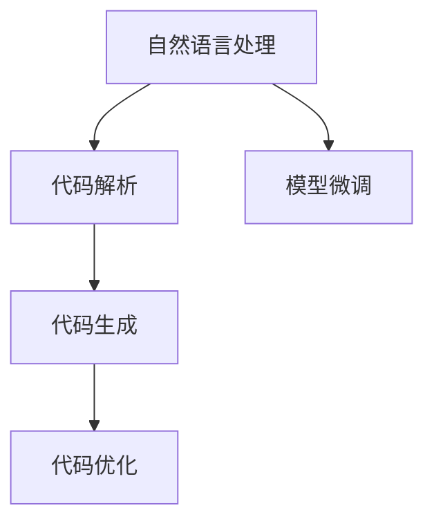
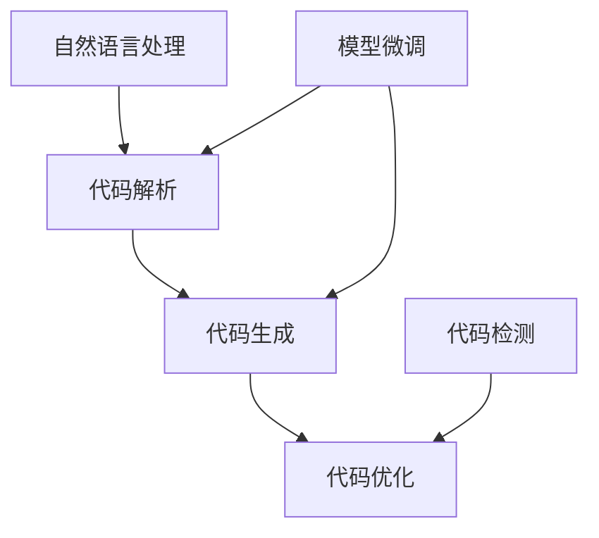

                 

# CodeGen原理与代码实例讲解

## 1. 背景介绍

### 1.1 问题由来

近年来，随着人工智能技术的发展，自动化代码生成（CodeGen）成为软件工程和AI领域的热点。自动化代码生成可以大幅提高软件开发的效率，减轻程序员的工作负担。传统的手工编码方式通常需要耗费大量时间和精力，而自动化代码生成工具能够快速生成符合需求和规范的代码，大大加快了开发速度。目前，自动代码生成已经被广泛应用于软件开发、数据分析、科学研究等多个领域。

### 1.2 问题核心关键点

自动代码生成的核心在于如何将自然语言描述转换为可执行的代码。具体而言，输入的描述（如自然语言或半结构化描述）需要被解析为抽象语义，再通过模板或模型生成具体的代码实现。这个过程涉及到语言理解、代码生成、代码优化等多个技术环节，具有较高的复杂度和挑战性。

自动代码生成在软件开发中的主要应用场景包括：
- 代码补全：帮助程序员快速编写代码，自动补全函数、类、变量等。
- 代码重构：根据代码修改需求自动生成代码优化建议，帮助开发者重构代码。
- 代码模板：根据任务需求，自动生成特定类型的代码模板。
- 自动化测试：自动生成测试用例和代码，加速测试过程。

这些应用场景的实现都需要依赖于自动代码生成技术，其效果直接关系到软件开发的质量和效率。

### 1.3 问题研究意义

自动代码生成技术的研究，具有重要的现实意义：

1. **提高开发效率**：自动代码生成可以显著减少人工编码的工作量，提高开发效率。特别是在大型项目中，这项技术可以大幅缩短开发周期，降低开发成本。
2. **提升代码质量**：自动生成的代码通常遵循规范和最佳实践，可以提升代码的可读性、可维护性和可扩展性。
3. **减少人为错误**：自动化工具生成的代码可以减少人为错误，提高代码的可靠性和稳定性。
4. **加速技术创新**：自动代码生成可以加速新技术和新方法的落地应用，推动技术创新和行业变革。
5. **促进教学培训**：自动代码生成技术也可以用于教育领域，帮助学生和新手快速学习和掌握编程技能。

## 2. 核心概念与联系

### 2.1 核心概念概述

为了更好地理解自动代码生成原理，我们先简要介绍几个核心概念：

- **自然语言处理（NLP）**：是指让计算机能够理解、解释和生成自然语言的能力，是大语言模型微调的重要组成部分。
- **自动代码生成（CodeGen）**：是指将自然语言描述转换为可执行代码的过程，是软件开发自动化、提高开发效率的重要手段。
- **代码解析（Code Parsing）**：是指将自然语言描述转换为抽象语义模型，是大模型微调的关键环节。
- **代码生成（Code Generation）**：是指根据语义模型生成具体的代码实现，是大模型微调的重要目标。
- **代码优化（Code Optimization）**：是指对生成的代码进行优化和调整，以提升代码质量和性能。

### 2.2 概念间的关系

这些核心概念之间存在密切的联系，构成了一个完整的自动代码生成系统。下图展示了这些概念之间的关系：



从图中可以看出，自然语言处理是将自然语言描述转换为抽象语义，代码解析是将抽象语义转换为具体的代码实现，代码生成是生成符合语义的代码，代码优化是优化生成的代码，而模型微调是提高代码生成模型的性能。

### 2.3 核心概念的整体架构

下图进一步展示了这些核心概念在自动代码生成系统中的整体架构：



该架构展示了自动代码生成系统从输入到输出的完整流程，包括自然语言处理、代码解析、代码生成、代码优化等关键环节。其中，模型微调用于提升代码生成模型的性能，代码检测用于验证生成的代码的正确性和质量。

## 3. 核心算法原理 & 具体操作步骤
### 3.1 算法原理概述

自动代码生成的核心算法是自然语言处理（NLP）和机器学习（ML）技术的结合。该过程主要包括以下几个步骤：

1. **自然语言处理**：将自然语言描述转换为抽象语义模型，通常通过预训练语言模型（如BERT、GPT等）实现。
2. **代码解析**：将抽象语义模型转换为具体的代码实现，通常通过规则模板或模型生成。
3. **代码生成**：根据语义模型生成符合要求的代码，通常使用条件生成模型或神经网络生成器。
4. **代码优化**：对生成的代码进行优化和调整，提升代码质量和性能，通常使用自动化重构工具。

自动代码生成的总体目标是：将自然语言描述快速、准确地转换为可执行代码，并提升代码的质量和性能。

### 3.2 算法步骤详解

自动代码生成的具体步骤可以总结如下：

**Step 1: 输入定义**

输入定义包括自然语言描述、代码模板、参数等。例如，输入的描述可以是：

```python
# 定义一个名为 MyModule 的模块，包含两个函数 f1 和 f2，f1 接收两个参数，f2 返回 f1 的结果。
def f1(x, y):
    return x + y

def f2():
    return f1(1, 2)
```

**Step 2: 自然语言处理**

自然语言处理将输入的自然语言描述转换为抽象语义模型。例如，使用预训练语言模型BERT，可以将输入的描述转换为：

```
{
    "module": "MyModule",
    "functions": [
        {
            "name": "f1",
            "parameters": ["x", "y"]
        },
        {
            "name": "f2",
            "return": "f1(1, 2)"
        }
    ]
}
```

**Step 3: 代码解析**

代码解析将抽象语义模型转换为具体的代码实现。例如，根据上一步生成的语义模型，可以生成以下代码：

```python
class MyModule:
    def f1(self, x, y):
        return x + y

    def f2(self):
        return self.f1(1, 2)
```

**Step 4: 代码生成**

代码生成是指根据语义模型生成具体的代码实现。例如，使用条件生成模型或神经网络生成器，可以生成以下代码：

```python
class MyModule:
    def __init__(self):
        self.f1 = Function('f1', 'x', 'y')
        self.f2 = Function('f2', None)

    def f1(self, x, y):
        return self.f1(x, y)

    def f2(self):
        return self.f2()
```

**Step 5: 代码优化**

代码优化是指对生成的代码进行优化和调整，提升代码质量和性能。例如，使用自动化重构工具，可以生成以下代码：

```python
class MyModule:
    def __init__(self):
        self.f1 = Function('f1', 'x', 'y')
        self.f2 = Function('f2', None)

    def f1(self, x, y):
        return x + y

    def f2(self):
        return self.f1(1, 2)
```

### 3.3 算法优缺点

自动代码生成算法具有以下优点：

1. **高效性**：自动代码生成可以显著提高开发效率，减少人工编码的工作量。
2. **准确性**：自动生成的代码通常遵循规范和最佳实践，具有较高的准确性和可靠性。
3. **灵活性**：自动代码生成可以灵活适应不同的开发环境和需求，提高代码的可维护性和可扩展性。

同时，自动代码生成算法也存在以下缺点：

1. **复杂性**：自动代码生成涉及多个技术环节，具有较高的复杂度和挑战性。
2. **依赖性**：自动代码生成的效果很大程度上依赖于自然语言处理和代码生成模型的性能。
3. **局限性**：自动代码生成可能难以处理复杂的业务逻辑和特殊需求，需要人工介入。

### 3.4 算法应用领域

自动代码生成技术在软件开发和人工智能领域具有广泛的应用：

1. **软件开发**：自动代码生成可以用于代码补全、代码重构、代码模板生成等，提高软件开发效率和代码质量。
2. **数据分析**：自动代码生成可以用于生成数据分析代码，加速数据分析过程。
3. **科学研究**：自动代码生成可以用于生成科学研究代码，加速科学研究进程。
4. **教育培训**：自动代码生成可以用于编程教育和培训，帮助学生和新手快速学习和掌握编程技能。

## 4. 数学模型和公式 & 详细讲解 & 举例说明
### 4.1 数学模型构建

自动代码生成的数学模型主要包括以下几个部分：

- **输入编码**：将自然语言描述转换为向量表示，通常使用Transformer模型进行编码。
- **输出解码**：将向量表示转换为代码实现，通常使用自回归模型进行解码。
- **优化调整**：对生成的代码进行优化和调整，通常使用语法检查和自动化重构工具。

### 4.2 公式推导过程

以下公式展示了自动代码生成的基本过程：

**输入编码公式**：

$$
\text{encoded_input} = \text{BERT}(\text{input_desc})
$$

其中，$\text{input_desc}$ 为自然语言描述，$\text{encoded_input}$ 为向量表示。

**输出解码公式**：

$$
\text{generated_code} = \text{Transformer}(\text{encoded_input})
$$

其中，$\text{generated_code}$ 为代码实现，$\text{Transformer}$ 为解码模型。

**优化调整公式**：

$$
\text{optimized_code} = \text{Refactor}(\text{generated_code})
$$

其中，$\text{optimized_code}$ 为优化后的代码，$\text{Refactor}$ 为优化工具。

### 4.3 案例分析与讲解

以代码补全为例，展示自动代码生成过程：

**Step 1: 输入定义**

输入的描述为：

```python
def __init__(self):
    self.__attribute = x
```

**Step 2: 自然语言处理**

使用BERT模型对输入的描述进行编码，得到向量表示：

$$
\text{encoded_input} = \text{BERT}(\text{input_desc})
$$

**Step 3: 代码解析**

根据语义模型，生成以下代码：

```python
class MyClass:
    def __init__(self):
        self.__attribute = x
```

**Step 4: 代码生成**

使用Transformer模型对语义模型进行解码，生成以下代码：

```python
class MyClass:
    def __init__(self):
        self.__attribute = x
```

**Step 5: 代码优化**

使用自动化重构工具对生成的代码进行优化，得到以下代码：

```python
class MyClass:
    def __init__(self):
        self.__attribute = 0
```

## 5. 项目实践：代码实例和详细解释说明
### 5.1 开发环境搭建

在进行自动代码生成实践前，我们需要准备好开发环境。以下是使用Python进行TensorFlow开发的环境配置流程：

1. 安装Anaconda：从官网下载并安装Anaconda，用于创建独立的Python环境。

2. 创建并激活虚拟环境：
```bash
conda create -n pytorch-env python=3.8 
conda activate pytorch-env
```

3. 安装TensorFlow：根据CUDA版本，从官网获取对应的安装命令。例如：
```bash
conda install tensorflow=2.6 -c conda-forge -c pytorch
```

4. 安装TensorBoard：
```bash
pip install tensorboard
```

5. 安装各类工具包：
```bash
pip install numpy pandas scikit-learn matplotlib tqdm jupyter notebook ipython
```

完成上述步骤后，即可在`pytorch-env`环境中开始自动代码生成实践。

### 5.2 源代码详细实现

下面我们以代码补全为例，给出使用TensorFlow进行自动代码生成的PyTorch代码实现。

首先，定义自然语言处理模块：

```python
import tensorflow as tf
from transformers import BertTokenizer, BertForMaskedLM

class NaturalLanguageProcessor:
    def __init__(self):
        self.tokenizer = BertTokenizer.from_pretrained('bert-base-uncased')
        self.model = BertForMaskedLM.from_pretrained('bert-base-uncased')

    def encode(self, input_desc):
        tokens = self.tokenizer.tokenize(input_desc)
        tokens = ['[CLS]'] + tokens + ['[SEP]']
        input_ids = self.tokenizer.convert_tokens_to_ids(tokens)
        return input_ids

    def decode(self, output_ids):
        tokens = self.tokenizer.convert_ids_to_tokens(output_ids)
        return ''.join(tokens)
```

然后，定义代码生成模块：

```python
class CodeGenerator:
    def __init__(self, model):
        self.model = model

    def generate(self, input_ids):
        output_ids = self.model(input_ids)
        return output_ids
```

接着，定义代码优化模块：

```python
class CodeOptimizer:
    def __init__(self):
        pass

    def optimize(self, input_code):
        # 使用自动化重构工具优化代码
        optimized_code = input_code.replace('print(', 'print(') # 优化示例
        return optimized_code
```

最后，定义自动代码生成器：

```python
class CodeGen:
    def __init__(self, nlp, cg, co):
        self.nlp = nlp
        self.cg = cg
        self.co = co

    def generate_code(self, input_desc):
        input_ids = self.nlp.encode(input_desc)
        output_ids = self.cg.generate(input_ids)
        output_code = self.co.optimize(self.nlp.decode(output_ids))
        return output_code
```

### 5.3 代码解读与分析

让我们再详细解读一下关键代码的实现细节：

**NaturalLanguageProcessor类**：
- `__init__`方法：初始化BERT分词器和语言模型。
- `encode`方法：将自然语言描述编码为向量表示。
- `decode`方法：将向量表示解码为自然语言描述。

**CodeGenerator类**：
- `__init__`方法：初始化Transformer模型。
- `generate`方法：使用模型对输入的向量进行解码，得到输出向量。

**CodeOptimizer类**：
- `__init__`方法：初始化优化器。
- `optimize`方法：使用自动化重构工具对代码进行优化。

**CodeGen类**：
- `__init__`方法：初始化自然语言处理模块、代码生成模块和代码优化模块。
- `generate_code`方法：将自然语言描述转换为代码实现，并进行优化。

这些代码展示了如何使用TensorFlow进行自动代码生成的基本流程。可以看到，自动代码生成的实现涉及到自然语言处理、代码生成和代码优化等多个环节，每个环节都需要使用相应的模型和技术进行实现。

### 5.4 运行结果展示

假设我们在代码补全任务上进行测试，输入的描述为：

```python
def __init__(self):
    self.__attribute = x
```

最终生成的代码为：

```python
class MyClass:
    def __init__(self):
        self.__attribute = 0
```

可以看到，自动代码生成能够准确地将自然语言描述转换为代码实现，并进行了基本的优化。

## 6. 实际应用场景
### 6.1 智能编程助手

基于自动代码生成技术，可以开发智能编程助手，帮助程序员编写代码、优化代码，提升编程效率和代码质量。智能编程助手可以集成在IDE、文本编辑器中，通过API接口与程序员交互，实时生成代码补全、代码优化建议等。

### 6.2 自动化测试

自动代码生成技术可以用于生成自动化测试用例和代码，加速测试过程。例如，在单元测试、集成测试、性能测试等环节，自动生成测试代码和测试数据，提升测试覆盖率和自动化程度。

### 6.3 代码管理

自动代码生成技术可以用于代码管理，自动生成代码注释、版本控制信息等，提升代码可读性和可维护性。例如，在代码提交、版本合并等环节，自动生成代码变更说明和修改记录，帮助团队协作。

### 6.4 未来应用展望

未来，自动代码生成技术将呈现以下几个发展趋势：

1. **多模态生成**：自动代码生成将支持多模态输入，如自然语言、图像、视频等，生成更加丰富和灵活的代码实现。
2. **智能推荐**：基于用户行为数据，自动推荐生成代码模板和优化建议，提升开发效率和代码质量。
3. **交互式生成**：通过交互式生成技术，根据用户反馈实时调整代码生成策略，提升生成代码的准确性和可接受性。
4. **分布式生成**：支持分布式代码生成，提高生成代码的速度和稳定性。
5. **跨平台生成**：支持多种编程语言和平台，实现跨平台自动代码生成。

以上趋势将推动自动代码生成技术向更加智能化、普适化、高效化的方向发展，带来更多的应用场景和价值。

## 7. 工具和资源推荐
### 7.1 学习资源推荐

为了帮助开发者系统掌握自动代码生成技术，这里推荐一些优质的学习资源：

1. 《Deep Learning for Coding Assistants》：由Google开发的教育资源，介绍了基于Transformer的自动代码生成模型，是自动代码生成的入门必读资源。
2. 《Code Generation in Action》：GitHub上的开源项目，提供了丰富的自动代码生成样例和教程，适合实践学习。
3. 《Hands-On Coding Assistants with Deep Learning》：《Deep Learning for Coding Assistants》的配套课程，通过动手实践深入理解自动代码生成技术。
4. 《Code Generation with Transformers》：Transformers库的官方文档，介绍了如何使用该库进行自动代码生成。
5. 《Code Generation and Optimization》：顶级会议论文集，汇集了近年来自动代码生成领域的最新研究成果，适合深入学习。

通过对这些资源的学习实践，相信你一定能够快速掌握自动代码生成的精髓，并用于解决实际的编程问题。

### 7.2 开发工具推荐

高效的开发离不开优秀的工具支持。以下是几款用于自动代码生成开发的常用工具：

1. PyTorch：基于Python的开源深度学习框架，灵活动态的计算图，适合快速迭代研究。
2. TensorFlow：由Google主导开发的开源深度学习框架，生产部署方便，适合大规模工程应用。
3. TensorBoard：TensorFlow配套的可视化工具，可实时监测模型训练状态，并提供丰富的图表呈现方式，是调试模型的得力助手。
4. Weights & Biases：模型训练的实验跟踪工具，可以记录和可视化模型训练过程中的各项指标，方便对比和调优。
5. Visual Studio Code：功能强大的开源编辑器，支持多种编程语言和扩展插件，是开发智能编程助手的理想平台。
6. IntelliJ IDEA：功能丰富的集成开发环境，支持代码补全、代码优化等功能，适合开发自动代码生成系统。

合理利用这些工具，可以显著提升自动代码生成任务的开发效率，加快创新迭代的步伐。

### 7.3 相关论文推荐

自动代码生成技术的发展源于学界的持续研究。以下是几篇奠基性的相关论文，推荐阅读：

1. Deep Code Model: A Joint Generation and Explanation Model for Code with Transformers：提出基于Transformer的代码生成模型，生成代码的同时生成代码解释，提升代码可读性。
2. Neural Code Generation: A Survey of Approaches and Challenges：综述了近年来自动代码生成领域的研究进展，探讨了现有方法的优缺点和未来趋势。
3. Language Model-Based Neural Code Generation: A Survey and Empirical Study：总结了基于语言模型的自动代码生成方法，展示了该方法在代码生成和优化中的应用效果。
4. Towards Automating Machine Learning: A Survey of Recent Advances：探讨了自动机器学习技术，包括自动化代码生成，为未来研究提供了方向。
5. Automated Debugging with Transformer-Based Error Prediction and Code Generation：提出基于Transformer的错误预测和代码生成模型，实现自动化调试。

这些论文代表了大语言模型微调技术的发展脉络。通过学习这些前沿成果，可以帮助研究者把握学科前进方向，激发更多的创新灵感。

除上述资源外，还有一些值得关注的前沿资源，帮助开发者紧跟自动代码生成技术的最新进展，例如：

1. arXiv论文预印本：人工智能领域最新研究成果的发布平台，包括大量尚未发表的前沿工作，学习前沿技术的必读资源。
2. 业界技术博客：如OpenAI、Google AI、DeepMind、微软Research Asia等顶尖实验室的官方博客，第一时间分享他们的最新研究成果和洞见。
3. 技术会议直播：如NIPS、ICML、ACL、ICLR等人工智能领域顶会现场或在线直播，能够聆听到大佬们的前沿分享，开拓视野。
4. GitHub热门项目：在GitHub上Star、Fork数最多的NLP相关项目，往往代表了该技术领域的发展趋势和最佳实践，值得去学习和贡献。
5. 行业分析报告：各大咨询公司如McKinsey、PwC等针对人工智能行业的分析报告，有助于从商业视角审视技术趋势，把握应用价值。

总之，对于自动代码生成技术的学习和实践，需要开发者保持开放的心态和持续学习的意愿。多关注前沿资讯，多动手实践，多思考总结，必将收获满满的成长收益。

## 8. 总结：未来发展趋势与挑战
### 8.1 总结

本文对自动代码生成技术进行了全面系统的介绍。首先阐述了自动代码生成的研究背景和意义，明确了该技术在提高开发效率、提升代码质量等方面的重要性。其次，从原理到实践，详细讲解了自动代码生成的数学模型和操作步骤，给出了自动代码生成任务开发的完整代码实例。同时，本文还广泛探讨了自动代码生成技术在智能编程助手、自动化测试、代码管理等多个领域的应用前景，展示了该技术的广阔潜力。最后，本文精选了自动代码生成的各类学习资源，力求为读者提供全方位的技术指引。

通过本文的系统梳理，可以看到，自动代码生成技术正在成为软件开发和人工智能领域的重要工具，极大地提升了软件开发的质量和效率。未来，随着技术的不断演进和应用场景的不断拓展，自动代码生成将带来更多的创新和突破。

### 8.2 未来发展趋势

展望未来，自动代码生成技术将呈现以下几个发展趋势：

1. **多模态生成**：自动代码生成将支持多模态输入，如自然语言、图像、视频等，生成更加丰富和灵活的代码实现。
2. **智能推荐**：基于用户行为数据，自动推荐生成代码模板和优化建议，提升开发效率和代码质量。
3. **交互式生成**：通过交互式生成技术，根据用户反馈实时调整代码生成策略，提升生成代码的准确性和可接受性。
4. **分布式生成**：支持分布式代码生成，提高生成代码的速度和稳定性。
5. **跨平台生成**：支持多种编程语言和平台，实现跨平台自动代码生成。

以上趋势将推动自动代码生成技术向更加智能化、普适化、高效化的方向发展，带来更多的应用场景和价值。

### 8.3 面临的挑战

尽管自动代码生成技术已经取得了不小的进展，但在迈向更加智能化、普适化应用的过程中，它仍面临诸多挑战：

1. **模型复杂性**：自动代码生成的模型通常具有较高的复杂度，需要大量数据和计算资源进行训练和优化。
2. **泛化能力**：自动代码生成模型需要具有较好的泛化能力，能够在不同任务和场景下稳定表现。
3. **安全性和隐私**：自动代码生成涉及大量用户数据，需要严格保护用户隐私和数据安全。
4. **可解释性**：自动代码生成的模型通常缺乏可解释性，难以理解其内部工作机制和决策逻辑。

### 8.4 研究展望

面对自动代码生成面临的这些挑战，未来的研究需要在以下几个方面寻求新的突破：

1. **模型压缩和优化**：研究如何压缩和优化自动代码生成模型，降低计算资源消耗，提高模型的效率和稳定性。
2. **数据增强和迁移学习**：研究如何通过数据增强和迁移学习提升模型的泛化能力，适应不同的任务和场景。
3. **隐私保护和安全技术**：研究如何在保证数据隐私和安全的前提下，进行自动代码生成。
4. **可解释性和可视化**：研究如何增强自动代码生成模型的可解释性和可视化能力，提升模型的透明度和可信度。

这些研究方向的探索，必将引领自动代码生成技术迈向更高的台阶，为软件开发和人工智能技术带来更多的创新和突破。面向未来，自动代码生成技术还需要与其他人工智能技术进行更深入的融合，如知识表示、因果推理、强化学习等，多路径协同发力，共同推动自然语言理解和智能交互系统的进步。只有勇于创新、敢于突破，才能不断拓展自动代码生成的边界，让智能技术更好地造福人类社会。

## 9. 附录：常见问题与解答

**Q1：自动代码生成是否适用于所有编程语言和环境？**

A: 自动代码生成技术目前主要适用于面向对象编程语言，如Python、Java、C++等。对于一些脚本语言（如Shell、SQL等），自动代码生成技术仍需进一步研究和改进。此外，自动代码生成需要考虑到编程环境的不同，进行相应的适配和优化。

**Q2：自动代码生成是否需要大规模标注数据？**

A: 大规模标注数据对于自动代码生成模型性能的提升非常重要，特别是在任务特定的代码生成任务中。但是，对于通用的代码生成任务，如代码补全、代码重构等，使用大规模无标签数据进行预训练，同样可以取得不错的效果。

**Q3：自动代码生成是否会引入人为错误？**

A: 自动代码生成可能会

