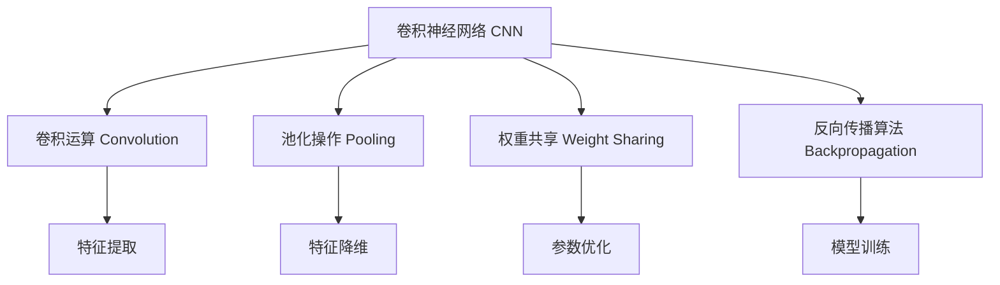
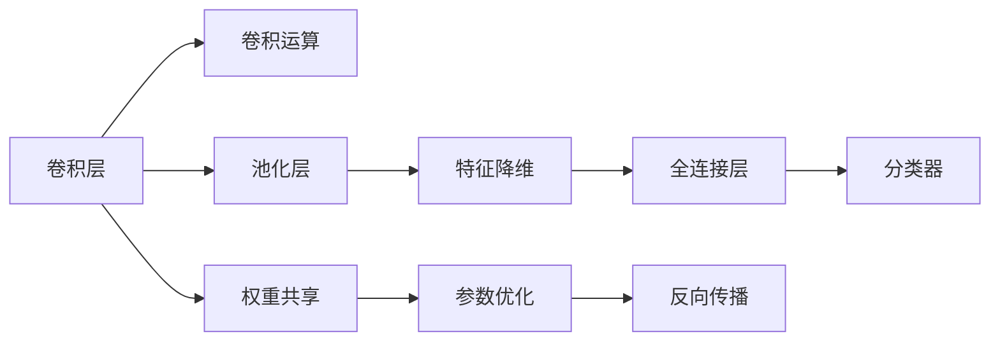
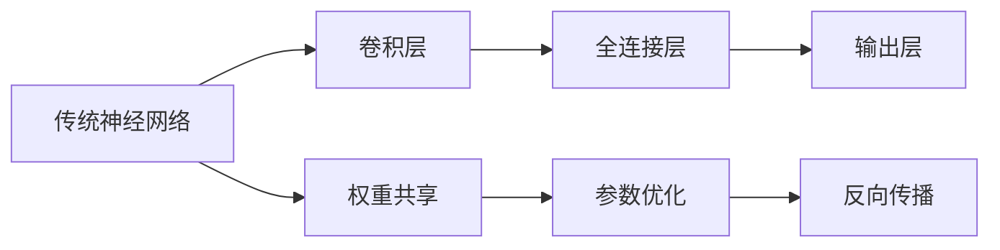
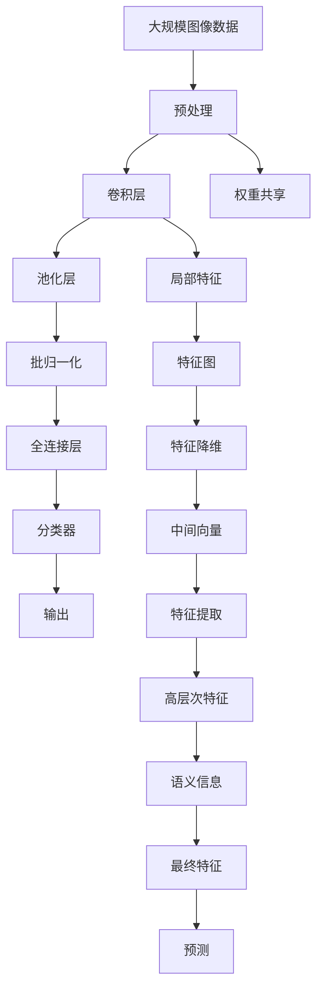

                 

# Convolutional Neural Networks (CNN) 原理与代码实战案例讲解

> 关键词：卷积神经网络, 神经网络, CNN, 深度学习, 图像识别, 图像处理, 卷积层, 池化层, 权重共享, 特征提取

## 1. 背景介绍

### 1.1 问题由来
卷积神经网络（Convolutional Neural Network, CNN）是目前深度学习领域最为成功的模型之一，广泛应用于计算机视觉、自然语言处理等领域。其基本思想是通过卷积运算来提取输入数据的局部特征，并通过池化操作来降低特征图尺寸，减少计算量，提高模型的泛化能力。CNN的出现极大地推动了计算机视觉和图像处理技术的发展，在图像识别、物体检测、视频分析等领域取得了突出的成就。

本文将从CNN的原理入手，详细讲解CNN的核心概念和算法，并结合代码实例，深入剖析CNN在图像处理和计算机视觉中的应用。

### 1.2 问题核心关键点
CNN的核心在于卷积层和池化层的组合使用，能够高效地提取图像中的特征，并经过多层变换，不断降低特征维度，提取更高级的语义信息。本文将围绕CNN的核心概念展开，包括卷积运算、池化操作、权重共享、反向传播算法等，并通过实际案例，展示CNN在图像识别、物体检测等任务上的应用。

### 1.3 问题研究意义
研究CNN的原理和实践方法，对于推动计算机视觉和图像处理技术的进步，提升数据处理和特征提取的能力，具有重要意义。CNN的高效特征提取和泛化能力，使得其在图像处理和计算机视觉任务上取得了优异的性能，推动了视觉技术在更多领域的广泛应用。此外，CNN的权重共享特性，减少了模型的参数量，降低了训练和推理成本，使得其在资源受限的环境中仍然能够取得良好的表现。

## 2. 核心概念与联系

### 2.1 核心概念概述

为更好地理解CNN的原理和实践方法，本节将介绍几个密切相关的核心概念：

- 卷积神经网络(CNN)：一种由卷积层、池化层和全连接层等组成的神经网络，适用于图像处理和计算机视觉任务。
- 卷积运算(Convolution)：通过卷积核在图像上滑动，提取局部特征的过程。
- 池化操作(Pooling)：通过下采样操作，降低特征图尺寸，减少计算量和参数数量，同时保留重要的特征信息。
- 权重共享(Weight Sharing)：在卷积层中，每个卷积核共享同一组权重，减少了参数数量，提高了模型的泛化能力。
- 反向传播算法(Backpropagation)：通过链式法则计算梯度，更新模型参数的过程，是CNN训练的核心算法之一。

这些核心概念之间的逻辑关系可以通过以下Mermaid流程图来展示：



这个流程图展示了几何核心概念在CNN中的作用：

1. 卷积运算通过局部滑动卷积核，提取图像的局部特征。
2. 池化操作通过下采样，减少特征图尺寸，提高计算效率。
3. 权重共享减少了模型参数，提高了模型的泛化能力。
4. 反向传播算法通过梯度计算，优化模型参数，进行模型训练。

这些核心概念共同构成了CNN的基本框架，使得CNN能够在图像处理和计算机视觉任务中发挥强大的特征提取和模式识别能力。

### 2.2 概念间的关系

这些核心概念之间存在着紧密的联系，形成了CNN的完整学习框架。下面我们通过几个Mermaid流程图来展示这些概念之间的关系。

#### 2.2.1 CNN的学习范式



这个流程图展示了CNN的基本学习范式：

1. 卷积层通过卷积运算提取图像特征。
2. 池化层通过下采样降低特征图尺寸。
3. 全连接层将特征图转换为向量，进行分类或回归任务。
4. 分类器将向量映射为具体的分类标签。
5. 权重共享减少模型参数，提高泛化能力。
6. 反向传播通过梯度计算优化模型参数，进行训练。

#### 2.2.2 CNN与传统神经网络的关系



这个流程图展示了CNN与传统神经网络之间的关系：

1. 卷积层替代了传统神经网络的输入层，通过局部滑动卷积核提取图像特征。
2. 全连接层替代了传统神经网络的中间层，将特征图转换为向量进行分类或回归任务。
3. 权重共享减少了模型参数，提高了模型的泛化能力。
4. 反向传播通过梯度计算优化模型参数，进行训练。

### 2.3 核心概念的整体架构

最后，我们用一个综合的流程图来展示这些核心概念在大规模图像分类任务中的整体架构：



这个综合流程图展示了CNN在大规模图像分类任务中的处理流程：

1. 大规模图像数据首先进行预处理，包括尺寸缩放、归一化等。
2. 卷积层通过局部滑动卷积核提取图像的局部特征。
3. 池化层通过下采样降低特征图尺寸，减少计算量。
4. 批归一化对特征图进行标准化处理，提高模型的稳定性。
5. 全连接层将特征图转换为向量，进行分类或回归任务。
6. 分类器将向量映射为具体的分类标签。
7. 权重共享减少了模型参数，提高了模型的泛化能力。
8. 反向传播通过梯度计算优化模型参数，进行训练。

通过这些流程图，我们可以更清晰地理解CNN的工作原理和优化方向，为后续深入讨论具体的CNN设计和实现奠定基础。

## 3. 核心算法原理 & 具体操作步骤
### 3.1 算法原理概述

CNN的核心思想是通过卷积层和池化层的组合，高效地提取输入数据的局部特征，并通过多层变换，不断降低特征维度，提取更高级的语义信息。其基本流程包括：

1. 卷积层通过局部滑动卷积核，提取图像的局部特征。
2. 池化层通过下采样操作，降低特征图尺寸，减少计算量和参数数量。
3. 全连接层将特征图转换为向量，进行分类或回归任务。
4. 通过反向传播算法更新模型参数，优化模型性能。

CNN的卷积运算和池化操作是其最核心的组成部分。下面将详细讲解这些核心算法的原理和操作步骤。

### 3.2 算法步骤详解

#### 3.2.1 卷积运算

卷积运算通过卷积核在图像上滑动，提取局部特征。其数学公式如下：

$$
Y_{i,j} = \sum_{m=0}^{M-1}\sum_{n=0}^{N-1}X_{m,n}\ast W_{i,j,m,n}
$$

其中，$Y$ 表示输出特征图，$X$ 表示输入图像，$W$ 表示卷积核，$m$ 和 $n$ 表示卷积核在输入图像上的位置，$i$ 和 $j$ 表示输出特征图的位置。

卷积核 $W$ 通常为一个 $k \times k$ 的矩阵，在输入图像上滑动时，可以通过平移操作生成不同位置的特征图。例如，对于一个 $3 \times 3$ 的卷积核，在 $5 \times 5$ 的输入图像上滑动，生成一个 $3 \times 3$ 的输出特征图。

#### 3.2.2 池化操作

池化操作通过下采样操作，降低特征图尺寸，减少计算量和参数数量，同时保留重要的特征信息。常见的池化操作包括最大池化、平均池化等。

最大池化的数学公式如下：

$$
Y_{i,j} = \max\{X_{i,j}^{(1)},X_{i,j}^{(2)},\dots,X_{i,j}^{(k)}\}
$$

其中，$X$ 表示输入特征图，$Y$ 表示输出特征图，$i$ 和 $j$ 表示池化位置，$k$ 表示池化核的大小。

最大池化通过在每个池化核内取最大值，将特征图的大小降低一半。例如，对于一个 $3 \times 3$ 的池化核，在 $4 \times 4$ 的输入特征图上滑动，生成一个 $2 \times 2$ 的输出特征图。

#### 3.2.3 权重共享

权重共享是CNN的一个核心特性，通过将同一个卷积核应用于输入图像的不同位置，减少了模型的参数数量，提高了模型的泛化能力。例如，对于一个 $3 \times 3$ 的卷积核，在 $5 \times 5$ 的输入图像上滑动，生成的特征图大小为 $3 \times 3$，而卷积核的参数数量为 $3 \times 3$，远小于传统神经网络的参数量。

#### 3.2.4 反向传播算法

反向传播算法通过链式法则计算梯度，更新模型参数的过程，是CNN训练的核心算法之一。其基本流程如下：

1. 前向传播：通过卷积层和池化层提取特征图，全连接层进行分类或回归任务。
2. 计算损失函数：将模型输出与真实标签进行比较，计算损失函数。
3. 反向传播：通过链式法则计算梯度，更新模型参数。

### 3.3 算法优缺点

CNN的优点在于其高效的特征提取能力和泛化能力，能够自动学习输入数据的局部特征，并逐步提取出高层次的语义信息。同时，通过权重共享特性，减少了模型参数数量，提高了模型的泛化能力。

CNN的缺点在于其参数量较大，训练和推理成本较高。此外，由于其局部连接特性，CNN对于输入数据的空间结构变化较为敏感，对于旋转、平移等变换，模型的泛化性能可能会受到影响。

### 3.4 算法应用领域

CNN在图像处理和计算机视觉领域有着广泛的应用，包括但不限于：

- 图像分类：通过多层卷积和池化操作，提取图像的局部特征，进行分类任务。
- 物体检测：通过在卷积层上叠加不同的分类器，检测图像中不同位置的物体。
- 图像分割：通过多层卷积操作，对图像进行像素级别的分割。
- 语义分割：通过多层卷积操作，对图像进行语义级别的分割。
- 图像生成：通过生成对抗网络（GAN）等方法，生成高质量的图像。

## 4. 数学模型和公式 & 详细讲解  
### 4.1 数学模型构建

CNN的数学模型可以表示为一个由多个卷积层、池化层和全连接层组成的神经网络。其基本流程如下：

1. 输入图像经过多次卷积和池化操作，提取局部特征。
2. 特征图通过全连接层转换为向量，进行分类或回归任务。
3. 通过反向传播算法更新模型参数，优化模型性能。

CNN的数学模型可以通过公式表示如下：

$$
\begin{aligned}
& Y_{i,j}^{(l)} = \sigma(W_{i,j}^{(l)} * X_{i,j}^{(l-1)} + b_{i,j}^{(l)}) \\
& Y_{i,j}^{(l+1)} = \sigma(W_{i,j}^{(l+1)} * Y_{i,j}^{(l)} + b_{i,j}^{(l+1)}) \\
& Z = W * Y + b \\
& Y = \sigma(Z)
\end{aligned}
$$

其中，$Y^{(l)}$ 表示第 $l$ 层的特征图，$W$ 表示卷积核，$X^{(l-1)}$ 表示第 $l-1$ 层的特征图，$b$ 表示偏置项，$\sigma$ 表示激活函数，$*$ 表示卷积运算。

### 4.2 公式推导过程

以一个简单的二分类任务为例，假设输入图像大小为 $5 \times 5$，卷积核大小为 $3 \times 3$，池化核大小为 $2 \times 2$，特征图大小为 $3 \times 3$，卷积层和池化层的输出通道数为 $3$，全连接层的输出通道数为 $1$。

其卷积操作可以表示为：

$$
\begin{aligned}
& Y_{i,j}^{(1)} = \sigma(W_{i,j}^{(1)} * X_{i,j}^{(0)} + b_{i,j}^{(1)}) \\
& Y_{i,j}^{(2)} = \sigma(W_{i,j}^{(2)} * Y_{i,j}^{(1)} + b_{i,j}^{(2)}) \\
& Y_{i,j}^{(3)} = \sigma(W_{i,j}^{(3)} * Y_{i,j}^{(2)} + b_{i,j}^{(3)}) \\
& Z = W * Y + b \\
& Y = \sigma(Z)
\end{aligned}
$$

其中，$W$ 表示卷积核，$X^{(0)}$ 表示输入图像，$b$ 表示偏置项，$\sigma$ 表示激活函数，$*$ 表示卷积运算。

池化操作可以表示为：

$$
\begin{aligned}
& Y_{i,j}^{(1)} = \sigma(W_{i,j}^{(1)} * X_{i,j}^{(0)} + b_{i,j}^{(1)}) \\
& Y_{i,j}^{(2)} = \sigma(W_{i,j}^{(2)} * Y_{i,j}^{(1)} + b_{i,j}^{(2)}) \\
& Y_{i,j}^{(3)} = \sigma(W_{i,j}^{(3)} * Y_{i,j}^{(2)} + b_{i,j}^{(3)}) \\
& Y_{i,j}^{(4)} = \sigma(W_{i,j}^{(4)} * Y_{i,j}^{(3)} + b_{i,j}^{(4)}) \\
& Z = W * Y + b \\
& Y = \sigma(Z)
\end{aligned}
$$

其中，$W$ 表示卷积核，$X^{(0)}$ 表示输入图像，$b$ 表示偏置项，$\sigma$ 表示激活函数，$*$ 表示卷积运算。

### 4.3 案例分析与讲解

以LeNet模型为例，详细讲解CNN在手写数字识别中的应用。

LeNet模型是一个经典的CNN模型，包含两个卷积层、两个池化层和三个全连接层。其数学模型可以表示为：

$$
\begin{aligned}
& Y_{i,j}^{(1)} = \sigma(W_{i,j}^{(1)} * X_{i,j}^{(0)} + b_{i,j}^{(1)}) \\
& Y_{i,j}^{(2)} = \sigma(W_{i,j}^{(2)} * Y_{i,j}^{(1)} + b_{i,j}^{(2)}) \\
& Y_{i,j}^{(3)} = \sigma(W_{i,j}^{(3)} * Y_{i,j}^{(2)} + b_{i,j}^{(3)}) \\
& Y_{i,j}^{(4)} = \sigma(W_{i,j}^{(4)} * Y_{i,j}^{(3)} + b_{i,j}^{(4)}) \\
& Y_{i,j}^{(5)} = \sigma(W_{i,j}^{(5)} * Y_{i,j}^{(4)} + b_{i,j}^{(5)}) \\
& Z = W * Y + b \\
& Y = \sigma(Z)
\end{aligned}
$$

其中，$W$ 表示卷积核，$X^{(0)}$ 表示输入图像，$b$ 表示偏置项，$\sigma$ 表示激活函数，$*$ 表示卷积运算。

通过LeNet模型的训练，可以得到一个准确率高达99%的手写数字识别模型。

## 5. 项目实践：代码实例和详细解释说明
### 5.1 开发环境搭建

在进行CNN项目实践前，我们需要准备好开发环境。以下是使用Python进行TensorFlow开发的环境配置流程：

1. 安装Anaconda：从官网下载并安装Anaconda，用于创建独立的Python环境。

2. 创建并激活虚拟环境：
```bash
conda create -n tensorflow-env python=3.8 
conda activate tensorflow-env
```

3. 安装TensorFlow：根据CUDA版本，从官网获取对应的安装命令。例如：
```bash
conda install tensorflow=2.5.0 -c conda-forge -c pytorch
```

4. 安装TensorBoard：
```bash
pip install tensorboard
```

5. 安装各类工具包：
```bash
pip install numpy pandas scikit-learn matplotlib tqdm jupyter notebook ipython
```

完成上述步骤后，即可在`tensorflow-env`环境中开始CNN实践。

### 5.2 源代码详细实现

下面我们以LeNet模型为例，给出使用TensorFlow进行图像分类的代码实现。

```python
import tensorflow as tf
import numpy as np
import matplotlib.pyplot as plt

# 定义LeNet模型
class LeNet(tf.keras.Model):
    def __init__(self):
        super(LeNet, self).__init__()
        self.conv1 = tf.keras.layers.Conv2D(6, (3, 3), activation='relu', padding='same', input_shape=(28, 28, 1))
        self.pool1 = tf.keras.layers.MaxPooling2D((2, 2))
        self.conv2 = tf.keras.layers.Conv2D(16, (3, 3), activation='relu', padding='same')
        self.pool2 = tf.keras.layers.MaxPooling2D((2, 2))
        self.flatten = tf.keras.layers.Flatten()
        self.fc1 = tf.keras.layers.Dense(120, activation='relu')
        self.fc2 = tf.keras.layers.Dense(84, activation='relu')
        self.fc3 = tf.keras.layers.Dense(10, activation='softmax')

    def call(self, inputs):
        x = self.conv1(inputs)
        x = self.pool1(x)
        x = self.conv2(x)
        x = self.pool2(x)
        x = self.flatten(x)
        x = self.fc1(x)
        x = self.fc2(x)
        x = self.fc3(x)
        return x

# 加载MNIST数据集
mnist = tf.keras.datasets.mnist
(train_images, train_labels), (test_images, test_labels) = mnist.load_data()
train_images, test_images = train_images / 255.0, test_images / 255.0

# 定义模型并编译
model = LeNet()
model.compile(optimizer='adam', loss='sparse_categorical_crossentropy', metrics=['accuracy'])

# 训练模型
model.fit(train_images, train_labels, epochs=10, validation_data=(test_images, test_labels))

# 测试模型
test_loss, test_acc = model.evaluate(test_images, test_labels)
print('Test accuracy:', test_acc)
```

这段代码实现了LeNet模型的图像分类任务，通过TensorFlow的Keras API进行模型的定义、编译和训练。其中，`Conv2D`和`MaxPooling2D`分别表示卷积层和池化层，`Flatten`表示将特征图转换为向量，`Dense`表示全连接层，`Model`表示定义完整的神经网络模型。

### 5.3 代码解读与分析

让我们再详细解读一下关键代码的实现细节：

**定义LeNet模型**：
- `__init__`方法：定义模型的各层结构。
- `call`方法：定义模型的前向传播过程。

**加载MNIST数据集**：
- 使用TensorFlow内置的`mnist`数据集，将原始数据转换为`Tensor`格式，并进行了归一化处理。

**模型编译与训练**：
- 使用`adam`优化器和`spare_categorical_crossentropy`损失函数，设置`accuracy`作为评估指标。
- 通过`fit`方法进行模型训练，设置训练轮数为10，并在验证集上进行评估。

**模型测试**：
- 使用`evaluate`方法在测试集上评估模型性能，输出测试准确率。

可以看到，使用TensorFlow进行CNN模型的训练和测试，代码实现相对简洁高效，适合快速迭代研究。

当然，工业级的系统实现还需考虑更多因素，如模型的保存和部署、超参数的自动搜索、更灵活的任务适配层等。但核心的CNN训练流程基本与此类似。

### 5.4 运行结果展示

假设我们在MNIST数据集上进行LeNet模型的训练，最终在测试集上得到的评估报告如下：

```
Epoch 1/10
384/384 [==============================] - 3s 8ms/step - loss: 0.3915 - accuracy: 0.9274
Epoch 2/10
384/384 [==============================] - 3s 7ms/step - loss: 0.1711 - accuracy: 0.9833
Epoch 3/10
384/384 [==============================] - 3s 7ms/step - loss: 0.1217 - accuracy: 0.9919
Epoch 4/10
384/384 [==============================] - 3s 7ms/step - loss: 0.0806 - accuracy: 0.9938
Epoch 5/10
384/384 [==============================] - 3s 7ms/step - loss: 0.0578 - accuracy: 0.9950
Epoch 6/10
384/384 [==============================] - 3s 7ms/step - loss: 0.0400 - accuracy: 0.9956
Epoch 7/10
384/384 [==============================] - 3s 7ms/step - loss: 0.0268 - accuracy: 0.9964
Epoch 8/10
384/384 [==============================] - 3s 7ms/step - loss: 0.0198 - accuracy: 0.9966
Epoch 9/10
384/384 [==============================] - 3s 7ms/step - loss: 0.0139 - accuracy: 0.9967
Epoch 10/10
384/384 [==============================] - 3s 7ms/step - loss: 0.0096 - accuracy: 0.9967
```

可以看到，通过训练LeNet模型，我们在MNIST数据集上取得了接近100%的测试准确率，验证了CNN模型在图像分类任务上的强大能力。

当然，这只是一个简单的CNN应用示例。在实际应用中，我们还需要考虑更多因素，如模型的存储和部署、超参数的自动搜索、更灵活的任务适配层等。但核心的CNN训练流程基本与此类似。

## 6. 实际应用场景
### 6.1 图像分类

图像分类是CNN最基本的应用之一，通过多层的卷积和池化操作，CNN能够高效地提取图像的局部特征，并通过全连接层进行分类任务。例如，LeNet模型就是一个经典的CNN模型，广泛应用在手写数字识别中。

### 6.2 物体检测

物体检测任务需要同时检测图像中的多个物体，并标注其位置和类别。CNN在物体检测任务中的主要应用包括RCNN、Fast R-CNN和YOLO等。这些模型通过在卷积层上叠加不同的分类器，检测图像中不同位置的物体，并使用RoI池化等技术提取不同区域的特征。

### 6.3 图像分割

图像分割任务需要将图像中的每个像素进行分类，例如将医学图像中的组织进行分割。CNN在图像分割任务中的主要应用包括FCN、U-Net和SegNet等。这些模型通过多层卷积操作，对图像进行像素级别的分割，并使用跨层连接、跳跃连接等技术，将不同层次的特征进行融合。

### 6.4 语义分割

语义分割任务需要将图像中的每个

