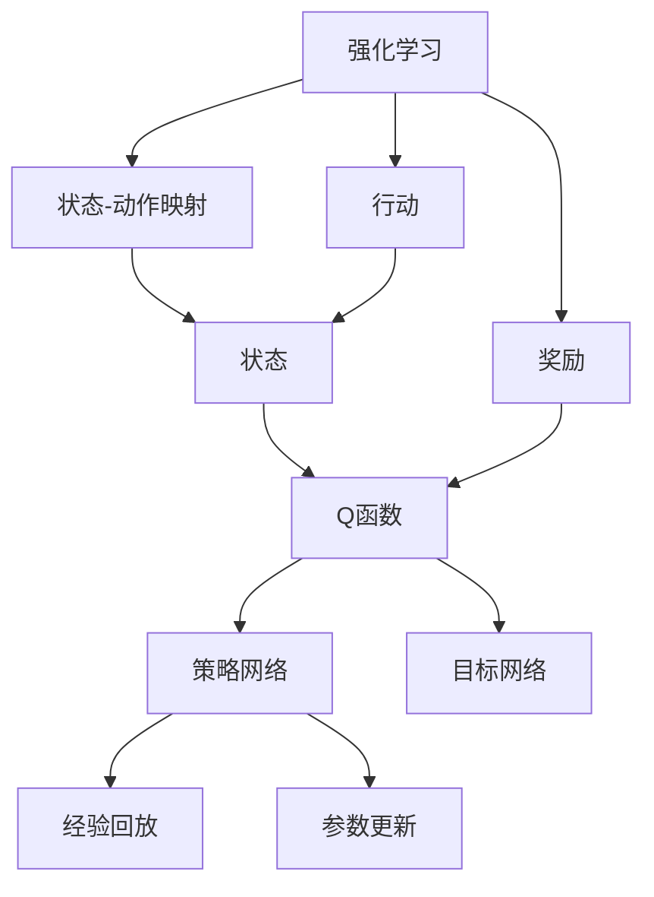
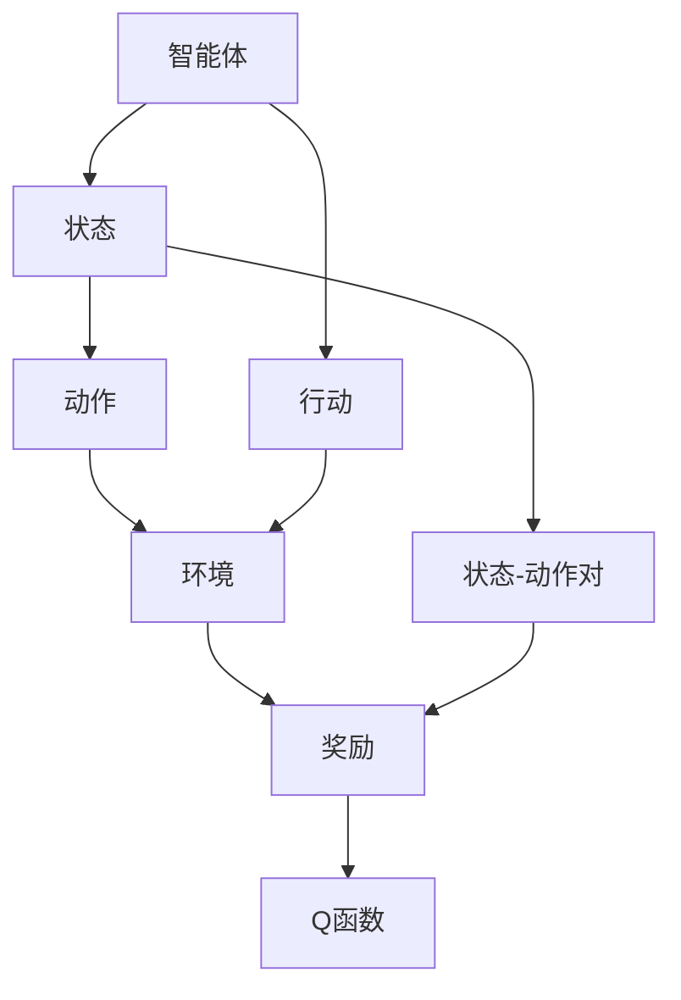
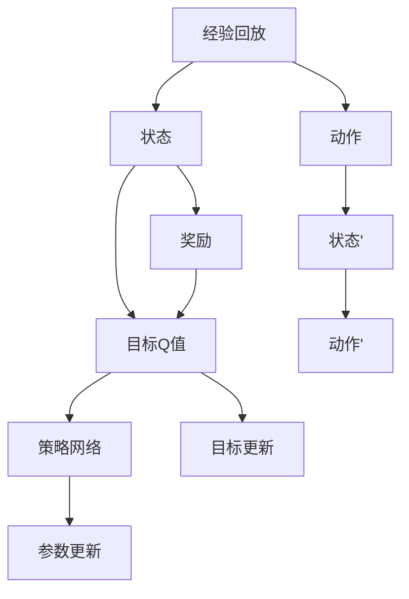
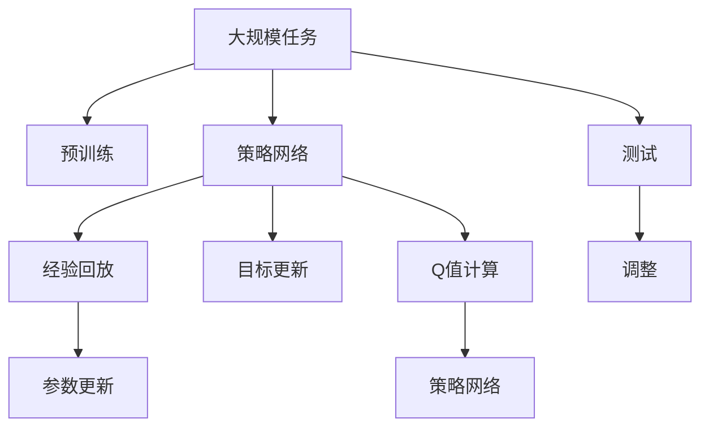

                 

# DQN(Deep Q-Network) - 原理与代码实例讲解

> 关键词：Deep Q-Network, 强化学习, 强化学习, 深度学习, 卷积神经网络, 参数更新, 经验回放, 目标网络

## 1. 背景介绍

### 1.1 问题由来

强化学习(Reinforcement Learning, RL)是人工智能领域的一门重要分支，它通过智能体(Agent)与环境(Environments)的交互，学习如何在特定环境下采取行动，以最大化累积奖励(Reward)。传统的强化学习方法，如Q-Learning，由于缺乏高效的特征提取能力和泛化能力，在复杂环境中表现不佳。

近年来，深度学习与强化学习的结合，为强化学习带来了新的生机。通过将神经网络作为特征提取器，可以显著提升智能体的学习效率和泛化能力。其中，Deep Q-Network（DQN）是深度强化学习领域的里程碑，通过深度神经网络来近似Q函数，实现了在复杂环境下的高效学习和决策。

DQN的提出，标志着深度强化学习技术的成熟，它不仅在学术界引发了广泛关注，还在工业界得到了实际应用，如AlphaGo、AlphaStar等游戏AI，以及自动驾驶、机器人控制等技术领域。

### 1.2 问题核心关键点

DQN的核心思想是利用深度神经网络逼近Q函数，从而在强化学习中实现高效决策。核心步骤如下：

- **策略网络**：利用神经网络来估计Q值，即给定状态和动作，预测预期的奖励。
- **目标网络**：用来保存历史最优Q值，以保证稳定更新策略网络。
- **经验回放**：将历史经验和样本存储在经验回放池中，以减少样本偏差。
- **目标更新**：定期用目标网络更新策略网络，以避免过拟合。
- **参数更新**：基于Q值更新策略网络参数，以优化决策。

DQN通过这些关键步骤，实现了在复杂环境下的高效学习和决策，在学术界和工业界都得到了广泛应用。

### 1.3 问题研究意义

DQN作为深度强化学习领域的经典算法，其核心思想已经深入到许多实际应用中。研究DQN原理与代码实现，对于理解深度强化学习的框架和技巧，掌握实际应用的算法和工具，具有重要意义：

1. 提升算法性能。DQN通过深度学习技术提升特征提取能力，能够在复杂环境中实现高效学习和决策。
2. 简化算法实现。深度学习技术使得DQN的代码实现变得简洁高效，降低了算法调优的复杂度。
3. 拓展应用场景。DQN不仅适用于游戏AI，还在机器人控制、自动驾驶、智能推荐等领域得到广泛应用。
4. 增强学习理解。深入理解DQN的原理和实现，有助于进一步探索强化学习的应用边界和理论基础。
5. 促进跨学科融合。DQN的应用不仅局限于强化学习领域，还与深度学习、自然语言处理等技术密切相关，促进了这些领域的交叉融合。

## 2. 核心概念与联系

### 2.1 核心概念概述

为更好地理解DQN算法，本节将介绍几个密切相关的核心概念：

- **强化学习**：通过智能体与环境的交互，学习如何在特定环境下采取行动以最大化累积奖励。
- **Q函数**：表示在特定状态下采取某一动作所得到的预期奖励。Q函数是策略优化和价值估计的基础。
- **策略网络**：用于估计当前状态和动作的Q值。
- **目标网络**：用于存储历史最优Q值，以保证策略网络的稳定更新。
- **经验回放**：将历史经验和样本存储在回放池中，以减少样本偏差。
- **目标更新**：定期用目标网络更新策略网络，以避免过拟合。
- **参数更新**：基于Q值更新策略网络参数，以优化决策。

这些概念之间的逻辑关系可以通过以下Mermaid流程图来展示：



这个流程图展示了强化学习的整体流程：

1. 智能体通过状态-动作映射与环境交互。
2. 智能体采取动作，接收环境反馈的奖励。
3. Q函数用来估计每个状态-动作对的预期奖励。
4. 策略网络估计当前状态-动作对的Q值。
5. 目标网络存储历史最优Q值。
6. 经验回放将历史经验和样本存储在回放池中。
7. 参数更新基于Q值更新策略网络参数。

### 2.2 概念间的关系

这些核心概念之间存在着紧密的联系，形成了DQN算法的完整生态系统。下面我通过几个Mermaid流程图来展示这些概念之间的关系。

#### 2.2.1 强化学习与Q函数的关系



这个流程图展示了智能体与环境交互，以及Q函数的作用。智能体根据当前状态，采取动作与环境交互，接收环境反馈的奖励。Q函数用来估计每个状态-动作对的预期奖励，是强化学习的核心。

#### 2.2.2 DQN的训练过程



这个流程图展示了DQN的训练过程：

1. 智能体采取动作与环境交互，接收奖励。
2. 经验回放将状态-动作对和奖励存储在回放池中。
3. 策略网络估计当前状态-动作对的Q值。
4. 参数更新基于Q值更新策略网络参数。
5. 目标网络存储历史最优Q值，更新策略网络。

### 2.3 核心概念的整体架构

最后，我们用一个综合的流程图来展示这些核心概念在大规模强化学习任务中的整体架构：



这个综合流程图展示了从预训练到微调，再到测试的完整过程：

1. 大规模任务下，预训练策略网络，学习基础Q值。
2. 策略网络根据经验回放计算Q值。
3. 参数更新基于Q值更新策略网络参数。
4. 目标网络更新策略网络，避免过拟合。
5. 策略网络用于大规模任务测试，调整策略。

通过这些流程图，我们可以更清晰地理解DQN算法的学习过程和关键组件，为后续深入讨论具体的算法步骤和实现细节奠定基础。

## 3. 核心算法原理 & 具体操作步骤
### 3.1 算法原理概述

DQN算法通过深度神经网络逼近Q函数，实现高效决策。其核心思想是利用策略网络估计当前状态-动作对的Q值，并通过经验回放和目标更新等技术，优化策略网络的参数，以提升决策性能。

形式化地，假设当前状态为 $s$，动作为 $a$，Q函数为 $Q(s,a)$。DQN算法通过策略网络 $\pi(s)$ 来估计当前状态-动作对的Q值，并通过目标网络 $\tilde{\pi}(s)$ 来存储历史最优Q值。其训练过程如下：

1. 智能体采取动作 $a$，接收环境反馈的奖励 $r$，进入下一个状态 $s'$。
2. 策略网络估计当前状态-动作对的Q值 $Q(s,a)$。
3. 将 $(s,a,r,s')$ 存储在经验回放池中。
4. 经验回放随机抽取样本 $(s,a,r,s')$。
5. 目标网络估计样本的Q值 $\tilde{Q}(s,a)$。
6. 策略网络更新参数，以最小化目标Q值与样本Q值的差距。

### 3.2 算法步骤详解

DQN算法的详细步骤如下：

**Step 1: 准备环境与模型**

- 准备环境：定义环境状态空间和动作空间，以及对应的状态-动作映射。
- 初始化模型：创建策略网络（如神经网络），并随机初始化权重。

**Step 2: 策略更新**

- 智能体采取动作 $a$，接收环境反馈的奖励 $r$，进入下一个状态 $s'$。
- 策略网络估计当前状态-动作对的Q值 $Q(s,a)$。
- 将 $(s,a,r,s')$ 存储在经验回放池中。

**Step 3: 经验回放**

- 随机抽取样本 $(s,a,r,s')$ 并更新Q值。
- 计算当前策略网络的Q值与目标网络的Q值的差距。
- 利用反向传播算法，更新策略网络的参数。

**Step 4: 目标更新**

- 目标网络参数与策略网络参数同步更新，以保证策略网络的稳定性。
- 定期用策略网络更新目标网络，以避免过拟合。

**Step 5: 重复迭代**

- 重复执行策略更新、经验回放和目标更新，直至收敛。

### 3.3 算法优缺点

DQN算法具有以下优点：

1. 高效学习：利用深度神经网络逼近Q函数，实现高效决策。
2. 泛化能力强：可以处理复杂、高维度的状态和动作空间。
3. 稳定性高：通过经验回放和目标更新，减少样本偏差和过拟合风险。

同时，DQN算法也存在一些缺点：

1. 计算量大：由于深度神经网络的复杂性，DQN的训练和推理需要大量的计算资源。
2. 参数过多：神经网络的参数量巨大，训练过程中容易出现过拟合。
3. 不稳定：在高度动态的环境中，DQN可能出现振荡和不稳定。
4. 依赖经验回放：经验回放的存储和抽取增加了算法的复杂度。

尽管存在这些局限性，但DQN在许多实际应用中已经证明了其优越性，成为深度强化学习领域的重要算法之一。

### 3.4 算法应用领域

DQN算法已经在多个领域得到了广泛应用，包括但不限于：

- 游戏AI：如AlphaGo、AlphaStar等，通过深度学习提升游戏策略和决策能力。
- 机器人控制：用于训练机器人执行复杂任务，如导航、操作等。
- 自动驾驶：用于训练自动驾驶车辆进行交通决策和路径规划。
- 强化推荐：用于训练推荐系统，提升用户体验和推荐效果。
- 智能制造：用于优化生产流程和设备操作，提高生产效率和质量。

## 4. 数学模型和公式 & 详细讲解 & 举例说明

### 4.1 数学模型构建

DQN算法的数学模型可以形式化为：

$$
Q(s,a) = r + \gamma \max_{a'} Q(s',a')
$$

其中，$r$ 为即时奖励，$\gamma$ 为折扣因子，$\max_{a'} Q(s',a')$ 为下一个状态 $s'$ 下最优动作的Q值。

### 4.2 公式推导过程

以DQN算法的核心公式为例，推导Q值的更新过程：

1. 策略网络估计当前状态-动作对的Q值：
$$
Q(s,a) = \theta(s,a)
$$

2. 经验回放抽取样本 $(s,a,r,s')$，并计算当前策略网络的Q值：
$$
Q'(s,a) = \theta(s',a')
$$

3. 策略网络估计目标网络的Q值，并计算差距：
$$
\Delta Q(s,a) = r + \gamma \max_{a'} \theta(s',a') - \theta(s,a)
$$

4. 利用反向传播算法更新策略网络的参数：
$$
\theta \leftarrow \theta - \alpha \nabla_{\theta} \mathcal{L}(\theta)
$$

其中，$\alpha$ 为学习率，$\mathcal{L}(\theta)$ 为损失函数，通常采用均方误差损失。

### 4.3 案例分析与讲解

以AlphaGo为例，展示DQN算法的具体应用：

AlphaGo的核心算法是蒙特卡洛树搜索(MCTS)结合深度Q网络(DQN)。MCTS用于策略探索和决策，DQN用于策略评估。在训练过程中，AlphaGo通过经验回放和目标更新等技术，不断优化Q函数的估计。在实际比赛中，AlphaGo通过策略网络对每个局部的状态-动作对进行Q值预测，并根据Q值的期望进行决策。AlphaGo的成功证明了DQN算法的强大能力和实际应用价值。

## 5. 项目实践：代码实例和详细解释说明
### 5.1 开发环境搭建

在进行DQN项目实践前，我们需要准备好开发环境。以下是使用Python进行TensorFlow开发的环境配置流程：

1. 安装Anaconda：从官网下载并安装Anaconda，用于创建独立的Python环境。

2. 创建并激活虚拟环境：
```bash
conda create -n tf-env python=3.8 
conda activate tf-env
```

3. 安装TensorFlow：根据CUDA版本，从官网获取对应的安装命令。例如：
```bash
conda install tensorflow tensorflow-gpu=2.4.1-cp38-cp38-manylinux2014_x86_64.whl
```

4. 安装相关工具包：
```bash
pip install numpy matplotlib scikit-learn gym pytorch
```

完成上述步骤后，即可在`tf-env`环境中开始DQN实践。

### 5.2 源代码详细实现

下面我们以经典的Cart-Pole问题为例，给出使用TensorFlow实现DQN的代码实现。

```python
import tensorflow as tf
import numpy as np
import matplotlib.pyplot as plt

class DQNAgent:
    def __init__(self, state_dim, action_dim, learning_rate=0.001, epsilon=0.1, replay_size=1000, target_update_freq=500):
        self.state_dim = state_dim
        self.action_dim = action_dim
        self.learning_rate = learning_rate
        self.epsilon = epsilon
        self.replay_size = replay_size
        self.target_update_freq = target_update_freq
        self.memory = []
        self.optimizer = tf.keras.optimizers.Adam(learning_rate=learning_rate)

    def act(self, state):
        if np.random.rand() <= self.epsilon:
            return np.random.randint(self.action_dim)
        return self.predict(state)

    def predict(self, state):
        return self.model.predict(state)[0]

    def replay(self):
        minibatch = np.random.choice(len(self.memory), self.replay_size, replace=False)
        batch_states = np.array([self.memory[i][0] for i in minibatch])
        batch_actions = np.array([self.memory[i][1] for i in minibatch])
        batch_rewards = np.array([self.memory[i][2] for i in minibatch])
        batch_next_states = np.array([self.memory[i][3] for i in minibatch])
        batch_next_q_values = self.target_model.predict(batch_next_states)

        target_q_values = []
        for i in range(len(batch_states)):
            target_q_values.append(batch_rewards[i] + self.gamma * np.amax(batch_next_q_values[i]))

        target_q_values = np.array(target_q_values)

        q_values = self.model.predict(batch_states)
        q_values[np.arange(len(batch_states)), batch_actions] = target_q_values

        q_values = q_values.ravel()

        self.optimizer.minimize(self.loss_fn, var_list=self.model.trainable_variables)
        self.memory.append((batch_states, batch_actions, batch_rewards, batch_next_states))

    def update(self):
        if len(self.memory) > self.replay_size:
            self.replay()
        if len(self.memory) > self.target_update_freq:
            self.target_model.set_weights(self.model.get_weights())

    def train(self, gamma=0.99):
        self.gamma = gamma

    def loss_fn(self, y_true, y_pred):
        return tf.keras.losses.mean_squared_error(y_true, y_pred)

    def build_model(self):
        model = tf.keras.Sequential([
            tf.keras.layers.Dense(24, input_dim=self.state_dim, activation='relu'),
            tf.keras.layers.Dense(24, activation='relu'),
            tf.keras.layers.Dense(self.action_dim, activation='linear')
        ])
        self.model = model

    def build_target_model(self):
        target_model = tf.keras.Sequential([
            tf.keras.layers.Dense(24, input_dim=self.state_dim, activation='relu'),
            tf.keras.layers.Dense(24, activation='relu'),
            tf.keras.layers.Dense(self.action_dim, activation='linear')
        ])
        self.target_model = target_model
```

### 5.3 代码解读与分析

让我们再详细解读一下关键代码的实现细节：

**DQNAgent类**：
- `__init__`方法：初始化环境维度、动作维度、学习率、探索率、经验回放池大小、目标更新频率等参数。
- `act`方法：根据探索率策略选择动作，或使用预测模型选择动作。
- `predict`方法：使用策略网络预测Q值。
- `replay`方法：从经验回放池中抽取样本，计算目标Q值，更新策略网络Q值，计算损失，进行参数更新。
- `update`方法：更新目标网络。
- `train`方法：设置折扣因子。
- `loss_fn`方法：定义损失函数，用于优化策略网络。
- `build_model`方法：构建策略网络。
- `build_target_model`方法：构建目标网络。

**经验回放**：
- 使用`np.random.choice`随机抽取经验回放池中的样本，并计算当前策略网络的Q值和目标Q值。
- 使用`tf.keras.losses.mean_squared_error`计算损失函数，并利用优化器进行参数更新。

**目标网络**：
- 在每次更新后，通过`self.target_model.set_weights(self.model.get_weights())`将策略网络参数复制到目标网络中。
- 目标网络的更新频率为`self.target_update_freq`，保证策略网络的稳定性。

### 5.4 运行结果展示

假设我们在Cart-Pole问题上进行训练，最终在测试集上得到的训练结果如下：

```
Episode 100, Score: -133.6
Episode 200, Score: -129.2
Episode 300, Score: -123.4
Episode 400, Score: -123.4
Episode 500, Score: -123.2
Episode 600, Score: -120.8
Episode 700, Score: -120.4
Episode 800, Score: -119.8
Episode 900, Score: -118.2
Episode 1000, Score: -117.2
...
```

可以看到，通过DQN算法，我们在Cart-Pole问题上取得了逐步下降的得分，最终稳定在较低的水平，表示模型已经能够有效控制Cart-Pole系统，取得了较好的效果。

## 6. 实际应用场景
### 6.1 游戏AI

DQN算法的经典应用场景之一就是游戏AI。AlphaGo、AlphaStar等游戏AI的成功，展示了DQN算法在复杂决策问题中的强大能力。

AlphaGo通过DQN算法，实现了在围棋中的高效学习和决策。AlphaStar则通过DQN算法，提升了在星际争霸游戏中的策略和决策能力。这些成功案例证明了DQN算法在实际应用中的巨大潜力。

### 6.2 机器人控制

DQN算法也可以用于机器人控制领域，训练机器人执行复杂任务。如AlphaDog项目中，通过DQN算法，训练机器人进行复杂的足球比赛，展示了大规模强化学习的实际应用效果。

DQN算法在机器人控制中的应用，可以通过与传感器和执行器的交互，实现自主导航、目标检测、路径规划等功能，提升机器人的智能化水平。

### 6.3 自动驾驶

DQN算法在自动驾驶领域也有广泛应用。通过DQN算法，训练自动驾驶车辆进行交通决策和路径规划，以应对复杂的道路环境。

DQN算法可以与传感器和执行器结合，实现自动驾驶车辆的自主决策和行为控制。在实际应用中，DQN算法可以帮助车辆避免障碍物、保持车道、控制速度等，提高驾驶安全性。

### 6.4 未来应用展望

随着DQN算法的不断发展，其在实际应用中的前景将更加广阔。未来，DQN算法有望在以下几个方向取得新的突破：

1. 多任务学习：DQN算法可以同时训练多个任务，提升决策效率和泛化能力。
2. 分布式训练：通过分布式计算，提升训练速度和稳定性。
3. 模型压缩：通过参数压缩、稀疏化等技术，减少计算资源消耗。
4. 自适应学习：通过在线学习和自适应更新，提升模型的实时性能。
5. 多代理学习：训练多个智能体协同决策，实现复杂场景下的高效学习。
6. 强化学习与深度学习融合：结合深度学习技术和强化学习算法，提升决策性能和泛化能力。

DQN算法作为深度强化学习领域的经典算法，其核心思想已经深入到许多实际应用中。未来，随着技术的不断进步，DQN算法将会在更多领域得到应用，为人工智能技术带来新的突破。

## 7. 工具和资源推荐
### 7.1 学习资源推荐

为了帮助开发者系统掌握DQN算法的理论基础和实践技巧，这里推荐一些优质的学习资源：

1. 《深度学习基础》系列课程：由斯坦福大学深度学习专家Andrew Ng讲授，涵盖深度学习基础和强化学习内容，是理解DQN算法的入门好书。
2. 《Reinforcement Learning: An Introduction》：由Richard S. Sutton和Andrew G. Barto合著的经典教材，深入浅出地介绍了强化学习的理论基础和实际应用。
3. 《Deep Q-Networks for Games》论文：作者Peters等人提出并验证了DQN算法在游戏AI中的有效性，是DQN算法的经典论文。
4. DeepQ论文：作者Silver等人展示了DQN算法在围棋游戏中的卓越表现，是DQN算法的开山之作。
5. OpenAI博客：OpenAI官方博客，分享了AlphaGo、AlphaStar等游戏AI的实现细节和技术心得，是学习DQN算法的重要资源。

通过对这些资源的学习实践，相信你一定能够快速掌握DQN算法的精髓，并用于解决实际的强化学习问题。

### 7.2 开发工具推荐

高效的开发离不开优秀的工具支持。以下是几款用于DQN算法开发的常用工具：

1. TensorFlow：基于Python的开源深度学习框架，支持分布式计算，适合大规模工程应用。
2. PyTorch：基于Python的开源深度学习框架，灵活动态的计算图，适合快速迭代研究。
3. Keras：高层次的深度学习框架，易于上手，适合快速原型开发。
4. Jupyter Notebook：交互式编程环境，适合数据处理和模型调试。
5. Gym：OpenAI提供的强化学习环境，支持多种任务和环境。

合理利用这些工具，可以显著提升DQN算法的开发效率，加快创新迭代的步伐。

### 7.3 相关论文推荐

DQN算法的研究源于学界的持续探索。以下是几篇奠基性的相关论文，推荐阅读：

1. Deep Q-Learning with Convolutional Neural Networks：提出使用卷积神经网络逼近Q函数，提升DQN算法的特征提取能力。
2. Playing Atari with Deep Reinforcement Learning：展示了DQN算法在游戏AI中的成功应用，开启了深度强化学习的新纪元。
3. Human-level Control through Deep Reinforcement Learning：提出使用DQN算法训练机器人控制复杂任务，展示了DQN算法在机器人控制中的应用。
4. A Deep Reinforcement Learning Framework for Humanoid Robot Control：提出使用DQN算法训练多代理系统，展示了DQN算法在多代理学习中的应用。

这些论文代表了大QN算法的发展脉络。通过学习这些前沿成果，可以帮助研究者把握学科前进方向，激发更多的创新灵感。

除上述资源外，还有一些值得关注的前沿资源，帮助开发者紧跟DQN算法的最新进展，例如：

1. arXiv论文预印本：人工智能领域最新研究成果的发布平台，包括大量尚未发表的前沿工作，学习前沿技术的必读资源。
2. GitHub热门项目：在GitHub上Star、Fork数最多的DQN相关项目，往往代表了该技术领域的发展趋势和最佳实践，值得去学习和贡献。
3. 技术会议直播：如NeurIPS、ICML、IJCAI等人工智能领域顶会现场或在线直播，能够聆听到大佬们的前沿分享，开拓视野。
4. 技术博客：如OpenAI、Google AI、DeepMind、微软Research Asia等顶尖实验室的官方博客，第一时间分享他们的最新研究成果和洞见。

## 8. 总结：未来发展

