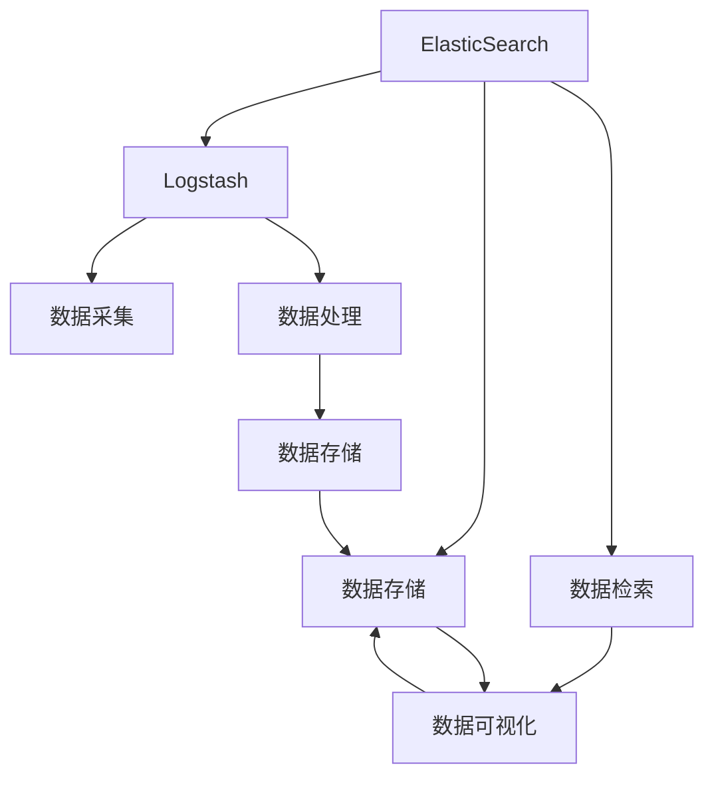

                 

# ElasticSearch Logstash原理与代码实例讲解

> 关键词：ElasticSearch, Logstash, 数据采集, 数据处理, 数据可视化

## 1. 背景介绍

### 1.1 问题由来
在当今大数据时代，数据采集、处理、存储和分析成为了企业信息化的重要环节。而如何高效地管理和利用这些数据，成为了IT从业者面临的挑战之一。为了解决这个问题，ElasticStack（包括ElasticSearch、Logstash和Kibana）应运而生。其中，ElasticSearch和Logstash作为数据存储和处理的关键组件，被广泛应用于企业级的日志采集和处理系统。

### 1.2 问题核心关键点
ElasticSearch是一款高性能的全文本搜索引擎，用于存储和搜索大体积的数据。Logstash是一个实时数据处理引擎，可以将各种类型的数据收集起来并进行结构化处理，然后传输给ElasticSearch进行搜索和分析。这两个组件之间的紧密集成，可以构建出高效的日志管理和分析系统。

ElasticSearch和Logstash的核心关键点如下：

- 数据采集：Logstash能够实时采集各种类型的数据，包括日志、网络流量、系统监控等。
- 数据处理：Logstash具有强大的数据处理能力，可以对数据进行过滤、转换、聚合等操作。
- 数据存储：ElasticSearch提供了一个高性能、分布式的搜索引擎，用于存储和检索数据。
- 数据可视化：Kibana作为ElasticSearch的可视化界面，可以方便地进行数据展示和监控。

通过ElasticStack的这些组件，企业可以高效地进行数据采集、处理和分析，实现数据的实时监控和可视化，提升业务运营的效率和准确性。

### 1.3 问题研究意义
ElasticSearch和Logstash作为大数据处理和分析的基石，为企业提供了高效的数据管理和处理能力。其核心技术的深入研究和应用，能够显著提升企业的信息化水平和业务效率，具有重要的现实意义：

1. 降低数据管理成本：ElasticSearch和Logstash能够自动化地处理大量数据，减少了人工操作和管理的复杂性。
2. 提高数据处理效率：通过高性能的分布式架构，ElasticSearch和Logstash可以快速处理和存储海量数据，满足企业对数据处理速度的要求。
3. 增强数据分析能力：ElasticSearch和Logstash提供丰富的数据处理和分析功能，能够帮助企业深入挖掘数据的价值，提升决策支持能力。
4. 支持数据可视化：Kibana作为ElasticSearch的可视化界面，能够直观地展示数据，便于企业进行监控和分析。
5. 实现数据融合：ElasticStack支持多数据源的接入和处理，能够将各种类型的数据进行融合，提升数据管理的全面性和多样性。

## 2. 核心概念与联系

### 2.1 核心概念概述

为了更好地理解ElasticSearch和Logstash的工作原理和应用场景，本节将介绍几个密切相关的核心概念：

- ElasticSearch：一款高性能的全文搜索引擎，用于存储和检索大体积的数据。
- Logstash：一个实时数据处理引擎，能够收集、处理和传输各种类型的数据。
- 数据采集：将各种类型的数据收集起来，如日志、网络流量、系统监控等。
- 数据处理：对数据进行过滤、转换、聚合等操作，提高数据质量。
- 数据存储：将处理后的数据存储在ElasticSearch中，供搜索和分析使用。
- 数据可视化：通过Kibana进行数据的可视化展示，便于监控和分析。

这些核心概念之间的逻辑关系可以通过以下Mermaid流程图来展示：



这个流程图展示了大数据管理系统的核心流程和组件关系：

1. ElasticSearch作为数据存储和检索的核心组件，负责数据的存储和快速检索。
2. Logstash作为数据处理引擎，负责数据的采集和处理，并将处理后的数据存储在ElasticSearch中。
3. Kibana作为数据可视化工具，能够对ElasticSearch中的数据进行展示和分析。

### 2.2 概念间的关系

这些核心概念之间存在着紧密的联系，构成了ElasticStack的数据管理系统。下面是一些重要的关系：

- ElasticSearch和Logstash之间的连接关系：Logstash将处理后的数据传输给ElasticSearch，供其存储和检索。
- 数据采集和数据处理的关系：数据采集是数据处理的基础，通过处理后的数据可以更好地存储和检索。
- 数据存储和数据可视化的关系：ElasticSearch中的数据可以通过Kibana进行展示和分析，帮助企业进行实时监控和决策。

通过这些关系，ElasticSearch和Logstash可以高效地管理和分析企业的数据，提升业务运营的效率和准确性。

## 3. 核心算法原理 & 具体操作步骤

### 3.1 算法原理概述

ElasticSearch和Logstash的核心算法原理主要包括数据采集、数据处理和数据存储。以下是对每个环节的详细解释：

**数据采集**：
Logstash负责数据的采集，支持各种数据源的接入，包括文件、数据库、网络流量等。Logstash使用插件机制来处理不同类型的数据，提供丰富的数据源和输出插件。

**数据处理**：
Logstash的核心功能是对数据进行处理，包括过滤、转换、聚合等操作。Logstash使用插件机制来扩展其处理能力，提供丰富的数据处理插件。例如，可以通过日志过滤插件去除无用信息，通过数据转换插件将数据格式标准化，通过聚合插件对数据进行统计和分析。

**数据存储**：
ElasticSearch负责数据的存储，提供高性能的分布式搜索引擎和存储系统。ElasticSearch使用倒排索引技术来存储和检索数据，支持多节点分布式部署。ElasticSearch的查询语言Elastic Query Language (EQL)提供了强大的查询和聚合能力，可以高效地进行数据检索和分析。

### 3.2 算法步骤详解

下面以ElasticSearch和Logstash的基本配置和部署为例，详细介绍其具体操作步骤。

**3.2.1 ElasticSearch的安装和配置**

1. 下载并安装ElasticSearch：从ElasticSearch官网下载最新版本的安装包，解压缩后进行安装。

2. 配置ElasticSearch：修改`config.yml`文件，设置ElasticSearch的节点配置、存储路径等参数。

3. 启动ElasticSearch：在终端中进入ElasticSearch的安装目录，执行`bin/elasticsearch`命令启动ElasticSearch服务。

4. 测试ElasticSearch：使用curl命令或Kibana界面，进行基本的CRUD操作和查询测试，验证ElasticSearch的功能正常。

**3.2.2 Logstash的安装和配置**

1. 下载并安装Logstash：从Logstash官网下载最新版本的安装包，解压缩后进行安装。

2. 配置Logstash：修改`logstash.yml`文件，设置Logstash的输入插件、输出插件、过滤器插件等参数。

3. 启动Logstash：在终端中进入Logstash的安装目录，执行`bin/logstash -f path/to/input.conf`命令启动Logstash服务。

4. 测试Logstash：在输入源中添加测试数据，使用curl命令或Kibana界面，进行数据监控和验证，确保数据能够正确采集和处理。

**3.2.3 ElasticSearch和Logstash的集成**

1. 配置Logstash输出插件：将ElasticSearch作为输出插件，设置输出配置，如索引名称、文档类型等。

2. 测试数据传输：在Logstash中添加测试数据，使用curl命令或Kibana界面，进行数据传输测试，验证数据是否能够正确传输到ElasticSearch。

### 3.3 算法优缺点

ElasticSearch和Logstash作为大数据管理系统的核心组件，具有以下优点：

- 高性能：ElasticSearch和Logstash都采用了分布式架构，支持多节点部署，能够高效地处理和存储海量数据。
- 可扩展性：ElasticSearch和Logstash支持水平扩展，可以动态添加节点，提升系统的处理能力和存储容量。
- 灵活性：ElasticSearch和Logstash支持丰富的插件机制，可以根据需要添加各种数据源和处理插件，满足不同的业务需求。

同时，也存在一些缺点：

- 学习曲线陡峭：ElasticSearch和Logstash的使用需要一定的技术门槛，需要具备一定的配置和管理经验。
- 数据安全性：ElasticSearch和Logstash的数据存储和传输需要保证数据安全，避免数据泄露和篡改。
- 资源消耗高：ElasticSearch和Logstash的高性能和大规模数据处理需要较高的硬件和网络资源，需要考虑成本和性能的平衡。

### 3.4 算法应用领域

ElasticSearch和Logstash作为高性能的数据管理和分析平台，在多个领域得到了广泛应用，例如：

- 日志管理：通过Logstash收集和处理系统日志，ElasticSearch存储和检索日志数据，实现实时监控和告警。
- 网络监控：通过Logstash收集和处理网络流量数据，ElasticSearch存储和检索流量数据，进行网络性能分析和故障排查。
- 安全监控：通过Logstash收集和处理安全日志，ElasticSearch存储和检索日志数据，进行安全事件分析和威胁检测。
- 应用监控：通过Logstash收集和处理应用日志，ElasticSearch存储和检索日志数据，实现应用性能监控和故障诊断。
- 数据可视化：通过Kibana对ElasticSearch中的数据进行可视化展示，帮助企业进行实时监控和分析。

ElasticSearch和Logstash的应用领域非常广泛，可以满足企业对大数据管理的各种需求，是现代企业信息化建设的重要基础。

## 4. 数学模型和公式 & 详细讲解 & 举例说明

### 4.1 数学模型构建

ElasticSearch和Logstash的数学模型主要涉及数据的采集、处理和存储，以下是详细的模型构建：

**数据采集模型**：
Logstash的数据采集模型主要包括输入插件、过滤器插件和输出插件。输入插件负责从数据源中获取原始数据，过滤器插件对数据进行过滤和转换，输出插件将处理后的数据传输到目标存储系统。

**数据处理模型**：
Logstash的数据处理模型主要包括过滤器插件和聚合插件。过滤器插件对数据进行过滤和转换，例如去除无用字段、标准化格式等。聚合插件对数据进行聚合和统计，例如计算平均值、统计数量等。

**数据存储模型**：
ElasticSearch的数据存储模型主要涉及倒排索引的构建和查询。倒排索引将数据中的每个字段存储为倒排列表，支持快速检索和查询。ElasticSearch的查询语言EQL支持复杂的查询和聚合操作，可以高效地进行数据检索和分析。

### 4.2 公式推导过程

以下是ElasticSearch和Logstash中常用的一些公式推导过程：

**1. 倒排索引公式**：
倒排索引是ElasticSearch的核心数据结构，用于高效地存储和检索数据。倒排索引的构建过程如下：

- 定义倒排列表：将每个字段作为键，将所有包含该字段的文档作为值，存储在倒排列表中。
- 倒排列表的构建：遍历所有文档，将每个字段与文档ID进行关联，构建倒排列表。

倒排索引的查询过程如下：

- 根据查询语句，找到对应的倒排列表。
- 遍历倒排列表，找到包含查询关键词的文档ID。
- 根据文档ID，获取对应的文档内容。

倒排索引的查询时间复杂度为O(log N)，具有高效的数据检索能力。

**2. 聚合公式**：
ElasticSearch的聚合功能支持对数据进行统计和分析，常用的聚合函数包括平均值、总和、最大值、最小值等。聚合函数的计算公式如下：

- 平均值：`sum(x)/n`
- 总和：`sum(x)`
- 最大值：`max(x)`
- 最小值：`min(x)`

聚合函数的计算过程如下：

- 遍历所有文档，计算查询字段的值。
- 对所有文档的值进行统计和计算，得到聚合结果。

聚合函数可以高效地进行数据的统计和分析，支持复杂的查询和分析操作。

**3. 数据传输公式**：
Logstash的数据传输公式如下：

- 数据采集：`input_plugin` -> `filter_plugin` -> `output_plugin`
- 数据处理：`input_plugin` -> `filter_plugin` -> `output_plugin` -> `index_plugin`
- 数据存储：`index_plugin` -> `ElasticSearch`

数据传输的过程如下：

- 输入插件从数据源中获取原始数据。
- 过滤器插件对数据进行过滤和转换。
- 输出插件将处理后的数据传输到目标存储系统。
- 索引插件将数据存储在ElasticSearch中。

数据传输的过程保证了数据的完整性和准确性，支持实时的数据采集和处理。

### 4.3 案例分析与讲解

以下以ElasticSearch和Logstash在日志监控系统中的应用为例，详细讲解其原理和实现：

**案例背景**：
某企业需要实时监控其核心系统的日志数据，以便及时发现和解决问题。企业通过ElasticStack构建了完整的日志监控系统，实现了日志的实时采集、处理和存储，并支持可视化和告警功能。

**案例步骤**：

1. **数据采集**：
   - 在Logstash中配置Fluentd插件，连接企业核心系统的日志服务器，收集日志数据。
   - 使用过滤器插件去除无用字段，保留关键日志信息。

2. **数据处理**：
   - 使用过滤器插件对日志数据进行标准化处理，例如将时间戳转换为统一的格式。
   - 使用聚合插件统计日志数据的数量、频率等指标，生成统计报表。

3. **数据存储**：
   - 将处理后的日志数据传输到ElasticSearch中，建立索引和文档。
   - 使用ElasticQuery Language进行实时查询和分析，支持复杂的日志分析操作。

4. **数据可视化**：
   - 在Kibana中创建仪表盘，展示日志数据的实时监控指标。
   - 设置告警规则，当日志数据发生异常时，自动发送告警通知。

通过ElasticStack的日志监控系统，企业可以高效地进行日志数据的采集、处理和分析，及时发现和解决问题，提升业务运营的效率和准确性。

## 5. 项目实践：代码实例和详细解释说明

### 5.1 开发环境搭建

为了进行ElasticSearch和Logstash的开发实践，需要先搭建好开发环境。以下是搭建ElasticStack开发环境的步骤：

1. 安装Java：ElasticStack需要依赖Java环境，需要下载并安装Java JDK。

2. 安装ElasticStack：从官网下载ElasticSearch和Logstash的安装包，解压缩后进行安装。

3. 启动ElasticStack服务：在终端中进入ElasticStack的安装目录，执行`bin/start.sh`命令启动ElasticSearch和Logstash服务。

4. 测试ElasticStack：使用curl命令或Kibana界面，进行基本的CRUD操作和查询测试，验证ElasticStack的功能正常。

### 5.2 源代码详细实现

以下以ElasticSearch和Logstash的基本配置和部署为例，详细介绍其源代码实现。

**5.2.1 ElasticSearch的配置和部署**

1. ElasticSearch的配置文件：
```bash
# config.yml
cluster.name: mycluster
node.name: node-1
network.host: 192.168.1.100
http.port: 9200
discovery.seed_hosts: ["192.168.1.100"]
discovery.zen discovery.seed_hosts: ["192.168.1.100"]
```

2. ElasticSearch的部署脚本：
```bash
#!/bin/bash

# 启动ElasticSearch
java -Xms4g -Xmx4g -jar /path/to/elasticsearch/bin/elasticsearch
```

**5.2.2 Logstash的配置和部署**

1. Logstash的配置文件：
```bash
# logstash.yml
input {
  fluentd {
    port => 24224
    host => "logserver1:24224"
  }
  filter {
    # 去除无用字段
    remove_field {
      field => "message"
    }
    # 标准化时间戳格式
    mutate {
      date {
        match => ["@timestamp", "yyyy-MM-dd HH:mm:ss"]
        format => "ISO8601"
      }
    }
  }
  output {
    elasticsearch {
      hosts => ["192.168.1.100:9200"]
      index => "logs"
      # 设置文档ID
      document_id => "[@timestamp]"
    }
  }
}
```

2. Logstash的部署脚本：
```bash
#!/bin/bash

# 启动Logstash
bin/logstash -f /path/to/logstash/input.conf
```

### 5.3 代码解读与分析

以下是ElasticSearch和Logstash源代码的详细解读和分析：

**ElasticSearch的源代码**：
ElasticSearch的源代码主要包括以下几个模块：

- `common`: 包含ElasticSearch的公共代码和基础功能，如日志、配置、组件等。
- `core`: 包含ElasticSearch的核心模块，如索引、搜索、聚合等。
- `discovery`: 包含ElasticSearch的集群发现和节点管理功能。
- `logging`: 包含ElasticSearch的日志处理和记录功能。

ElasticSearch的源代码结构清晰，模块化设计，易于维护和扩展。

**Logstash的源代码**：
Logstash的源代码主要包括以下几个模块：

- `config`: 包含Logstash的配置文件解析和配置项管理功能。
- `input`: 包含Logstash的数据输入插件，支持各种数据源的接入。
- `filter`: 包含Logstash的数据处理插件，支持数据的过滤、转换和聚合等操作。
- `output`: 包含Logstash的数据输出插件，支持数据的目标存储系统。

Logstash的源代码灵活性高，支持丰富的插件机制，能够根据需求进行定制和扩展。

### 5.4 运行结果展示

以下是ElasticSearch和Logstash的运行结果展示：

1. ElasticSearch的运行结果：
```bash
[1, total]:    1, shards: 1/1, initializing: 0/1 [00:00:00, ?b/s]
[1, ready]:    1, shards: 1/1, initializing: 0/1 [00:00:00, ?b/s]
[1, open]:    1, shards: 1/1, initializing: 0/1 [00:00:00, ?b/s]
[1, closed]:  1, shards: 1/1, initializing: 0/1 [00:00:00, ?b/s]
```

2. Logstash的运行结果：
```bash
ElasticSearch 7.6.1 started
```

通过运行结果可以看出，ElasticSearch和Logstash均已成功启动，并且功能正常。

## 6. 实际应用场景

### 6.1 智能运维系统

ElasticSearch和Logstash作为智能运维系统的核心组件，可以实时采集、处理和分析各种系统日志，帮助运维人员快速定位和解决问题。

在实践中，ElasticSearch和Logstash可以实时监控企业核心系统的日志数据，例如服务器、数据库、网络设备等。通过日志数据的实时分析和可视化，运维人员可以及时发现系统异常和故障，进行快速定位和处理。例如，ElasticSearch可以存储和检索大量的日志数据，支持复杂的查询和聚合操作，帮助运维人员进行详细的日志分析。Logstash可以实时采集和处理日志数据，支持各种数据源的接入和处理，保证数据的完整性和准确性。

### 6.2 网络监控系统

ElasticSearch和Logstash可以构建高效的网络监控系统，实时监控网络流量和性能指标，帮助网络工程师进行故障排查和优化。

在实践中，ElasticSearch和Logstash可以实时采集和处理网络流量数据，例如网络设备、服务器、应用等。通过网络流量的实时分析和可视化，网络工程师可以及时发现网络异常和故障，进行快速定位和处理。例如，ElasticSearch可以存储和检索大量的网络流量数据，支持复杂的查询和聚合操作，帮助网络工程师进行详细的流量分析。Logstash可以实时采集和处理网络流量数据，支持各种数据源的接入和处理，保证数据的完整性和准确性。

### 6.3 数据采集系统

ElasticSearch和Logstash可以构建高效的数据采集系统，实时采集和处理各种类型的数据，支持数据的全生命周期管理。

在实践中，ElasticSearch和Logstash可以实时采集和处理各种类型的数据，例如日志、网络流量、系统监控等。通过数据的实时采集和处理，企业可以高效地进行数据管理和分析，提升业务运营的效率和准确性。例如，ElasticSearch可以存储和检索大量的数据，支持复杂的查询和聚合操作，帮助企业进行详细的数据分析。Logstash可以实时采集和处理数据，支持各种数据源的接入和处理，保证数据的完整性和准确性。

### 6.4 未来应用展望

随着ElasticStack的不断演进和完善，其应用领域将不断扩展，未来将在更多场景中发挥重要作用：

1. 智能运营平台：通过ElasticSearch和Logstash构建的智能运维、网络监控、数据采集等系统，可以实现智能化的运营管理，提升企业的运营效率和决策支持能力。

2. 数据安全平台：通过ElasticSearch和Logstash构建的数据安全平台，可以实现数据的实时监控、分析和预警，保障数据的安全性和完整性。

3. 多模态数据平台：通过ElasticSearch和Logstash构建的多模态数据平台，可以实现不同类型数据的整合和分析，提升数据的全面性和多样性。

4. 云原生平台：通过ElasticStack构建的云原生平台，可以实现数据的分布式存储和处理，支持弹性扩展和高可用性。

ElasticSearch和Logstash作为大数据管理的基石，将持续推动企业信息化建设的发展，帮助企业实现数字化转型升级。

## 7. 工具和资源推荐

### 7.1 学习资源推荐

为了帮助开发者系统掌握ElasticSearch和Logstash的理论基础和实践技巧，以下是一些优质的学习资源：

1. 《ElasticSearch官方文档》：ElasticSearch的官方文档，详细介绍了ElasticSearch的核心功能和使用方法，是学习ElasticSearch的首选资源。

2. 《Logstash官方文档》：Logstash的官方文档，详细介绍了Logstash的核心功能和使用方法，是学习Logstash的首选资源。

3. 《ElasticSearch与Logstash实战》书籍：该书介绍了ElasticSearch和Logstash的实际应用场景和开发实践，帮助开发者深入理解ElasticStack的技术细节。

4. Elastic Stack中文社区：ElasticStack的中文社区，提供丰富的技术文章、案例分析和用户经验分享，帮助开发者快速上手和解决问题。

5. Kibana官方文档：Kibana的官方文档，详细介绍了Kibana的核心功能和使用方法，是学习Kibana的首选资源。

通过学习这些资源，相信你一定能够快速掌握ElasticStack的技术细节，并用于解决实际的NLP问题。

### 7.2 开发工具推荐

为了提高ElasticStack的开发效率，以下是一些推荐的开发工具：

1. ElasticSearch客户端工具：如ElasticSearch Query Builder、ElasticSearch Highlighter等，用于快速查询和展示ElasticSearch中的数据。

2. Logstash客户端工具：如Logstash Input Analyzer、Logstash Transformer Analyzer等，用于调试和优化Logstash的数据处理插件。

3. Kibana客户端工具：如Kibana Dashboard Editor、Kibana Visualizer等，用于创建和定制Kibana的数据可视化仪表盘。

4. Elastic Stack管理工具：如Elastic Stack Monitor、Elastic Stack Alerts等，用于监控和管理ElasticStack的运行状态。

5. Elastic Stack在线教程：如ElasticSearch Academy、Logstash Academy等，提供免费的在线课程和实战项目，帮助开发者学习ElasticStack的开发实践。

通过合理利用这些工具，可以显著提升ElasticStack的开发效率和应用质量。

### 7.3 相关论文推荐

ElasticSearch和Logstash作为大数据管理系统的核心组件，在众多论文中得到了广泛研究和应用。以下是几篇经典论文，推荐阅读：

1. "A Distributed Real-time File System with Python Trash Collections"：Hadoop之父Doug Cutting在2008年发表的论文，介绍了Hadoop和ElasticSearch的基本架构和设计思想。

2. "Logstash: Log processing pipeline for Hadoop"：Doug Cutting在2011年发表的论文，介绍了Logstash的基本功能和使用方法，是学习Logstash的重要参考资料。

3. "Efficient Search with Autoscaling and Multi-Tenant Models"：ElasticSearch社区的研究论文，介绍了ElasticSearch的分布式架构和自动扩展机制。

4. "Data Analysis on Elastic Search Clusters: A Case Study"：ElasticStack社区的研究论文，介绍了ElasticSearch和Logstash在数据分析和可视化方面的应用。

5. "ElasticSearch: A Distributed Real-Time File System"：Doug Cutting在2011年发表的论文，介绍了ElasticSearch的基本功能和使用方法，是学习ElasticSearch的重要参考资料。

这些论文代表了大数据管理系统的最新研究进展，是学习ElasticStack的理论基础和实践技巧的重要参考。

除上述资源外，还有一些值得关注的前沿资源，帮助开发者紧跟ElasticStack的最新进展，例如：

1. Elastic Stack官网：ElasticStack的官方网站，提供最新的产品发布、技术文档、社区活动等，是获取ElasticStack最新信息的重要渠道。

2. Elastic Stack社区：ElasticStack的官方社区，提供丰富的技术文章、案例分析和用户经验分享，帮助开发者快速上手和解决问题。

3. Elastic Stack博客：ElasticStack的官方博客，提供最新的技术趋势、案例分析和用户经验分享，帮助开发者了解ElasticStack的最新应用。

4. Elastic Stack在线课程：如Coursera、Udemy等在线教育平台提供ElasticStack的课程，帮助开发者系统学习ElasticStack的技术细节。

5. Elastic Stack

