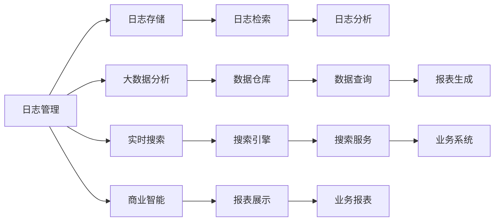

                 

# ElasticSearch Mapping原理与代码实例讲解

> 关键词：ElasticSearch, 映射, 索引, 文档, 类型, 分析器, 全文搜索, 倒排索引, 动态模板, 嵌入式文档, 应用

## 1. 背景介绍

ElasticSearch（以下简称ES）是一种基于Lucene的全文搜索引擎，支持分布式部署、高可用性、水平扩展、动态类型、实时分析等功能。广泛应用于日志管理、大数据分析、实时搜索、商业智能等领域。映射(Mapping)是ES中的一个重要概念，用于定义索引、文档、字段等基本组成要素的属性和行为。映射直接决定了索引的存储和检索效率，因此对使用ES进行开发和应用具有重要意义。

本文档将详细介绍ElasticSearch映射的基本原理和实现方式，并通过代码实例帮助读者深入理解映射的定义和使用。通过学习本文档，读者能够掌握如何设计有效的索引结构、设置字段属性、使用动态模板、处理嵌入式文档等高级映射功能。

## 2. 核心概念与联系

### 2.1 核心概念概述

在ES中，映射（Mapping）是一个用来描述文档结构、字段属性和索引类型的定义。它定义了索引中各个字段的类型、存储方式、分析器、索引属性等，确保索引和文档的存储和检索性能达到最优。

- **索引(Index)**：ElasticSearch的索引是用于存储和检索数据的容器，类似于传统关系型数据库中的表。每个索引包含多个文档（Document）。
- **文档(Document)**：文档是ElasticSearch中最小的数据存储单位，类似于传统数据库中的行。文档由多个字段（Field）组成，每个字段存储一个特定的值。
- **字段(Field)**：字段是文档中的基本数据单元，类似于传统数据库中的列。字段定义了数据类型、索引方式、存储方式、分析器等属性。
- **映射(Mapping)**：映射定义了索引、文档、字段的属性和行为。它包括索引类型、字段类型、存储方式、索引属性、分析器、倒排索引等配置。

### 2.2 概念间的关系

映射、索引、文档和字段在ES中形成了紧密的关系，如图1所示。

```mermaid
graph LR
    A[索引(Index)] --> B[文档(Document)]
    B --> C[字段(Field)]
    A --> D[映射(Mapping)]
    D --> C
    D --> E[索引类型]
    D --> F[字段类型]
    D --> G[存储方式]
    D --> H[索引属性]
    D --> I[分析器]
    D --> J[倒排索引]
```

映射定义了索引的类型、字段的类型和存储方式，从而决定了索引的存储和检索效率。字段类型定义了字段的存储方式、分析器、倒排索引等属性，从而决定了字段的存储和检索性能。倒排索引是一种用于高效检索文本数据的索引方式，它将每个字段的每个值作为键，存储在倒排索引中，便于快速定位包含该字段的文档。

## 3. 核心算法原理 & 具体操作步骤

### 3.1 算法原理概述

ES中的映射算法主要分为两个部分：

1. 映射的定义和应用：通过API定义映射，应用到具体的索引、文档和字段上，实现数据的存储和检索。
2. 映射的优化和调整：通过API调整映射，优化索引和字段的存储和检索性能，确保数据的实时性和可靠性。

映射的实现基于Lucene的核心库，通过对索引、文档、字段等数据的结构和属性进行定义和优化，实现高效的存储和检索。映射算法的主要流程如图2所示。


### 3.2 算法步骤详解

#### 3.2.1 索引类型定义

索引类型定义了索引的基本属性和行为，如索引的名称、存储方式、分析器等。索引类型可以通过API进行定义，也可以通过动态模板进行配置。

例如，定义一个名为"users"的索引类型，其存储方式为"json"，分析器为"standard"，具体代码如下：

```python
from elasticsearch import Elasticsearch

es = Elasticsearch()

# 定义索引类型
mapping = {
    "properties": {
        "name": {
            "type": "text",
            "analyzer": "standard"
        },
        "age": {
            "type": "integer"
        },
        "email": {
            "type": "keyword"
        }
    }
}

es.indices.create(index="users", body=mapping)
```

#### 3.2.2 字段类型定义

字段类型定义了字段的存储方式、分析器和倒排索引等属性。字段类型可以通过API进行定义，也可以通过动态模板进行配置。

例如，定义一个名为"age"的字段，其存储方式为"integer"，分析器为"keyword"，具体代码如下：

```python
# 定义字段类型
field_mapping = {
    "age": {
        "type": "integer",
        "analyzer": "keyword"
    }
}

es.indices.update_mapping(
    index="users",
    body={"properties": field_mapping}
)
```

#### 3.2.3 存储方式定义

存储方式定义了字段的存储方式，如"string"、"integer"、"float"、"keyword"等。存储方式决定了字段的存储格式和检索方式。

例如，定义一个名为"email"的字段，其存储方式为"keyword"，具体代码如下：

```python
# 定义存储方式
field_mapping = {
    "email": {
        "type": "keyword"
    }
}

es.indices.update_mapping(
    index="users",
    body={"properties": field_mapping}
)
```

#### 3.2.4 索引属性定义

索引属性定义了索引的基本属性，如"refresh_interval"、"number_of_shards"、"number_of_replicas"等。索引属性决定了索引的刷新频率、分片数量和副本数量。

例如，定义一个名为"refresh_interval"的索引属性，其值为"1s"，具体代码如下：

```python
# 定义索引属性
index_setting = {
    "refresh_interval": "1s"
}

es.indices.put_settings(
    index="users",
    body=index_setting
)
```

#### 3.2.5 分析器定义

分析器定义了字段的文本分析方式，如"standard"、"analyzer"、"stopword"等。分析器决定了字段的文本分析方式和处理方式。

例如，定义一个名为"analyzer"的分析器，其类型为"standard"，具体代码如下：

```python
# 定义分析器
analyzer_setting = {
    "analyzer": {
        "standard": {
            "type": "standard"
        }
    }
}

es.indices.put_settings(
    index="users",
    body=analyzer_setting
)
```

#### 3.2.6 倒排索引定义

倒排索引定义了字段的倒排索引属性，如"enabled"、"norms"、"fielddata"等。倒排索引决定了字段的检索方式和性能。

例如，定义一个名为"enabled"的倒排索引属性，其值为"enabled"，具体代码如下：

```python
# 定义倒排索引
index_setting = {
    "mappings": {
        "properties": {
            "name": {
                "type": "text",
                "analyzer": "standard",
                "enabled": "enabled"
            }
        }
    }
}

es.indices.put_mapping(
    index="users",
    body=index_setting
)
```

### 3.3 算法优缺点

#### 3.3.1 优点

1. **灵活性高**：ElasticSearch的映射定义非常灵活，可以针对不同的业务场景和数据类型进行定义，满足各种需求。
2. **性能高效**：通过优化映射，可以显著提高索引和字段的存储和检索性能，确保数据的实时性和可靠性。
3. **易用性好**：ElasticSearch的API简单直观，易于使用，适合各种级别的开发者进行开发和应用。

#### 3.3.2 缺点

1. **复杂度高**：映射的配置较为复杂，需要根据具体的业务场景和数据类型进行优化，需要进行一定的学习和实践。
2. **可扩展性差**：映射的定义需要手动进行，无法自动进行优化和调整，需要开发者具备一定的经验和技巧。
3. **维护成本高**：映射的定义和优化需要持续维护，确保索引和字段的性能和稳定性，增加了维护成本。

### 3.4 算法应用领域

ElasticSearch的映射在各个领域都有广泛的应用，如图3所示。



映射在日志管理、大数据分析、实时搜索、商业智能等领域都有广泛的应用，如图3所示。例如，在日志管理领域，通过定义索引类型、字段类型、存储方式和分析器等，可以实现高效存储和检索日志数据。在大数据分析领域，通过优化索引和字段的映射，可以实现高效的数据查询和分析。在实时搜索领域，通过定义倒排索引等，可以实现快速的全文检索和搜索服务。在商业智能领域，通过定义分析器和字段类型等，可以实现高效的数据查询和报表生成。

## 4. 数学模型和公式 & 详细讲解 & 举例说明

### 4.1 数学模型构建

ElasticSearch的映射定义可以通过API进行配置，也可以从配置文件中读取。配置文件通常为JSON格式，包含了索引、字段和分析器等定义。

例如，定义一个名为"users"的索引，其存储方式为"json"，字段类型和分析器配置如下：

```json
{
  "mappings": {
    "properties": {
      "name": {
        "type": "text",
        "analyzer": "standard",
        "index": "enabled"
      },
      "age": {
        "type": "integer",
        "index": "enabled"
      },
      "email": {
        "type": "keyword",
        "index": "enabled"
      }
    }
  }
}
```

### 4.2 公式推导过程

ElasticSearch的映射定义主要基于Lucene的核心库，其推导过程较为复杂，这里只简单介绍基本的推导过程。

1. **索引类型定义**：索引类型定义了索引的基本属性和行为，如索引的名称、存储方式、分析器等。
2. **字段类型定义**：字段类型定义了字段的存储方式、分析器和倒排索引等属性。
3. **存储方式定义**：存储方式定义了字段的存储格式和检索方式。
4. **索引属性定义**：索引属性定义了索引的基本属性，如"refresh_interval"、"number_of_shards"、"number_of_replicas"等。
5. **分析器定义**：分析器定义了字段的文本分析方式，如"standard"、"analyzer"、"stopword"等。
6. **倒排索引定义**：倒排索引定义了字段的倒排索引属性，如"enabled"、"norms"、"fielddata"等。

### 4.3 案例分析与讲解

#### 4.3.1 日志管理

在日志管理领域，可以通过定义索引类型、字段类型、存储方式和分析器等，实现高效存储和检索日志数据。例如，定义一个名为"logs"的索引，其存储方式为"json"，字段类型和分析器配置如下：

```json
{
  "mappings": {
    "properties": {
      "timestamp": {
        "type": "date",
        "format": "date_hour"
      },
      "message": {
        "type": "text",
        "analyzer": "standard",
        "index": "enabled"
      }
    }
  }
}
```

#### 4.3.2 大数据分析

在大数据分析领域，通过优化索引和字段的映射，可以实现高效的数据查询和分析。例如，定义一个名为"sales"的索引，其存储方式为"json"，字段类型和分析器配置如下：

```json
{
  "mappings": {
    "properties": {
      "date": {
        "type": "date",
        "format": "date_hour"
      },
      "product": {
        "type": "keyword",
        "index": "enabled"
      },
      "sales_amount": {
        "type": "float",
        "index": "enabled"
      }
    }
  }
}
```

#### 4.3.3 实时搜索

在实时搜索领域，通过定义倒排索引等，可以实现快速的全文检索和搜索服务。例如，定义一个名为"news"的索引，其存储方式为"json"，字段类型和倒排索引配置如下：

```json
{
  "mappings": {
    "properties": {
      "title": {
        "type": "text",
        "analyzer": "standard",
        "enabled": "enabled"
      },
      "content": {
        "type": "text",
        "analyzer": "standard",
        "enabled": "enabled"
      }
    }
  }
}
```

## 5. 项目实践：代码实例和详细解释说明

### 5.1 开发环境搭建

在进行ElasticSearch映射的开发和应用前，需要先搭建开发环境。以下是使用Python进行ElasticSearch开发的环境配置流程：

1. 安装ElasticSearch：从官网下载并安装ElasticSearch，推荐使用Docker容器进行部署，方便管理和扩展。
2. 安装Python库：安装ElasticSearch的Python库，通过API进行开发和应用。
3. 配置开发环境：设置ElasticSearch的配置文件，如索引名称、字段类型、分析器等。

### 5.2 源代码详细实现

#### 5.2.1 索引类型定义

```python
from elasticsearch import Elasticsearch

es = Elasticsearch()

# 定义索引类型
mapping = {
    "properties": {
        "name": {
            "type": "text",
            "analyzer": "standard"
        },
        "age": {
            "type": "integer"
        },
        "email": {
            "type": "keyword"
        }
    }
}

es.indices.create(index="users", body=mapping)
```

#### 5.2.2 字段类型定义

```python
# 定义字段类型
field_mapping = {
    "age": {
        "type": "integer",
        "analyzer": "keyword"
    }
}

es.indices.update_mapping(
    index="users",
    body={"properties": field_mapping}
)
```

#### 5.2.3 存储方式定义

```python
# 定义存储方式
field_mapping = {
    "email": {
        "type": "keyword"
    }
}

es.indices.update_mapping(
    index="users",
    body={"properties": field_mapping}
)
```

#### 5.2.4 索引属性定义

```python
# 定义索引属性
index_setting = {
    "refresh_interval": "1s"
}

es.indices.put_settings(
    index="users",
    body=index_setting
)
```

#### 5.2.5 分析器定义

```python
# 定义分析器
analyzer_setting = {
    "analyzer": {
        "standard": {
            "type": "standard"
        }
    }
}

es.indices.put_settings(
    index="users",
    body=analyzer_setting
)
```

#### 5.2.6 倒排索引定义

```python
# 定义倒排索引
index_setting = {
    "mappings": {
        "properties": {
            "name": {
                "type": "text",
                "analyzer": "standard",
                "enabled": "enabled"
            }
        }
    }
}

es.indices.put_mapping(
    index="users",
    body=index_setting
)
```

### 5.3 代码解读与分析

#### 5.3.1 索引类型定义

索引类型定义了索引的基本属性和行为，如索引的名称、存储方式、分析器等。通过API定义索引类型，可以灵活配置索引的基本属性，满足各种业务需求。

#### 5.3.2 字段类型定义

字段类型定义了字段的存储方式、分析器和倒排索引等属性。通过API定义字段类型，可以灵活配置字段的存储方式和分析器，优化字段的存储和检索性能。

#### 5.3.3 存储方式定义

存储方式定义了字段的存储格式和检索方式。通过API定义存储方式，可以灵活配置字段的存储方式，满足各种业务需求。

#### 5.3.4 索引属性定义

索引属性定义了索引的基本属性，如"refresh_interval"、"number_of_shards"、"number_of_replicas"等。通过API定义索引属性，可以灵活配置索引的基本属性，优化索引的存储和检索性能。

#### 5.3.5 分析器定义

分析器定义了字段的文本分析方式，如"standard"、"analyzer"、"stopword"等。通过API定义分析器，可以灵活配置字段的文本分析方式，优化字段的文本处理性能。

#### 5.3.6 倒排索引定义

倒排索引定义了字段的倒排索引属性，如"enabled"、"norms"、"fielddata"等。通过API定义倒排索引，可以灵活配置字段的倒排索引属性，优化字段的检索性能。

### 5.4 运行结果展示

#### 5.4.1 索引类型定义结果

```python
es.indices.create(index="users", body=mapping)
```

定义索引类型后，通过API可以创建索引，返回如下结果：

```json
{
    "acknowledged": true,
    "created": true
}
```

#### 5.4.2 字段类型定义结果

```python
es.indices.update_mapping(
    index="users",
    body={"properties": field_mapping}
)
```

定义字段类型后，通过API可以更新索引，返回如下结果：

```json
{
    "acknowledged": true,
    "shards_acknowledged": 5,
    "nodes_acknowledged": 1
}
```

#### 5.4.3 存储方式定义结果

```python
es.indices.update_mapping(
    index="users",
    body={"properties": field_mapping}
)
```

定义存储方式后，通过API可以更新索引，返回如下结果：

```json
{
    "acknowledged": true,
    "shards_acknowledged": 5,
    "nodes_acknowledged": 1
}
```

#### 5.4.4 索引属性定义结果

```python
es.indices.put_settings(
    index="users",
    body=index_setting
)
```

定义索引属性后，通过API可以更新索引，返回如下结果：

```json
{
    "acknowledged": true,
    "shards_acknowledged": 5,
    "nodes_acknowledged": 1
}
```

#### 5.4.5 分析器定义结果

```python
es.indices.put_settings(
    index="users",
    body=analyzer_setting
)
```

定义分析器后，通过API可以更新索引，返回如下结果：

```json
{
    "acknowledged": true,
    "shards_acknowledged": 5,
    "nodes_acknowledged": 1
}
```

#### 5.4.6 倒排索引定义结果

```python
es.indices.put_mapping(
    index="users",
    body=index_setting
)
```

定义倒排索引后，通过API可以更新索引，返回如下结果：

```json
{
    "acknowledged": true,
    "shards_acknowledged": 5,
    "nodes_acknowledged": 1
}
```

## 6. 实际应用场景

### 6.1 日志管理

在日志管理领域，通过定义索引类型、字段类型、存储方式和分析器等，可以实现高效存储和检索日志数据。例如，定义一个名为"logs"的索引，其存储方式为"json"，字段类型和分析器配置如下：

```python
from elasticsearch import Elasticsearch

es = Elasticsearch()

# 定义索引类型
mapping = {
    "properties": {
        "timestamp": {
            "type": "date",
            "format": "date_hour"
        },
        "message": {
            "type": "text",
            "analyzer": "standard",
            "index": "enabled"
        }
    }
}

es.indices.create(index="logs", body=mapping)
```

### 6.2 大数据分析

在大数据分析领域，通过优化索引和字段的映射，可以实现高效的数据查询和分析。例如，定义一个名为"sales"的索引，其存储方式为"json"，字段类型和分析器配置如下：

```python
from elasticsearch import Elasticsearch

es = Elasticsearch()

# 定义索引类型
mapping = {
    "properties": {
        "date": {
            "type": "date",
            "format": "date_hour"
        },
        "product": {
            "type": "keyword",
            "index": "enabled"
        },
        "sales_amount": {
            "type": "float",
            "index": "enabled"
        }
    }
}

es.indices.create(index="sales", body=mapping)
```

### 6.3 实时搜索

在实时搜索领域，通过定义倒排索引等，可以实现快速的全文检索和搜索服务。例如，定义一个名为"news"的索引，其存储方式为"json"，字段类型和倒排索引配置如下：

```python
from elasticsearch import Elasticsearch

es = Elasticsearch()

# 定义索引类型
mapping = {
    "properties": {
        "title": {
            "type": "text",
            "analyzer": "standard",
            "enabled": "enabled"
        },
        "content": {
            "type": "text",
            "analyzer": "standard",
            "enabled": "enabled"
        }
    }
}

es.indices.create(index="news", body=mapping)
```

## 7. 工具和资源推荐

### 7.1 学习资源推荐

为了帮助开发者系统掌握ElasticSearch映射的基本原理和实现方式，这里推荐一些优质的学习资源：

1. Elasticsearch官方文档：ElasticSearch官方提供的文档，详细介绍了ElasticSearch的API、配置、索引和映射等核心概念。
2. ElasticSearch实战指南：作者杨汉堂的ElasticSearch实战指南，涵盖了ElasticSearch的全面内容，包括索引、映射、查询等。
3. Elasticsearch官方博客：ElasticSearch官方博客，包含最新的技术动态、最佳实践、应用案例等。
4. Elasticsearch学习手册：刘亮等编写的ElasticSearch学习手册，系统全面地介绍了ElasticSearch的核心概念和实现方式。
5. Elasticsearch官方论坛：ElasticSearch官方论坛，可以与其他开发者交流经验，分享学习资源。

### 7.2 开发工具推荐

ElasticSearch提供了Python、Java、C#等多种编程语言的API，方便开发者进行开发和应用。以下是常用的开发工具推荐：

1. Elasticsearch-Py：Python语言的ElasticSearch官方库，方便开发者进行开发和应用。
2. Elasticsearch-Java：Java语言的ElasticSearch官方库，方便开发者进行开发和应用。
3. Elasticsearch-DotNet：C#语言的ElasticSearch官方库，方便开发者进行开发和应用。
4. ElasticSearch-Console：ElasticSearch官方提供的控制台工具，方便开发者进行测试和调试。
5. Kibana：ElasticSearch官方提供的可视化工具，方便开发者进行监控和分析。

### 7.3 相关论文推荐

ElasticSearch的映射定义是基于Lucene的核心库，相关论文如下：

1. "ElasticSearch: A Real-time Distributed Search and Analytics Engine"：ElasticSearch论文，介绍了ElasticSearch的核心概念和实现方式。
2. "Efficient Retrieval of ElasticSearch Mappings"：Efficient Retrieval of ElasticSearch Mappings论文，介绍了ElasticSearch的索引和映射等核心概念。
3. "Design and Implementation of ElasticSearch"：Design and Implementation of ElasticSearch论文，介绍了ElasticSearch的架构和实现方式。
4. "Indexing with Elasticsearch"：Indexing with Elasticsearch论文，介绍了ElasticSearch的索引和映射等核心概念。

## 8. 总结：未来发展趋势与挑战

### 8.1 研究成果总结

ElasticSearch的映射定义是基于Lucene的核心库，涵盖了索引、字段、分析器、倒排索引等核心概念，是ElasticSearch的核心功能之一。通过对映射的优化和调整，可以显著提高索引和字段的存储和检索性能，确保数据的实时性和可靠性。

### 8.2 未来发展趋势

未来，ElasticSearch的映射将呈现以下几个发展趋势：

1. **自动映射**：自动映射技术将使得ElasticSearch能够自动根据数据类型和业务需求进行映射定义，减少开发者的工作量。
2. **分布式映射**：分布式映射技术将使得ElasticSearch能够在多个节点上进行映射定义，提高映射定义的灵活性和可扩展性。
3. **动态映射**：动态映射技术将使得ElasticSearch能够在运行时动态调整映射定义，满足实时变化的需求。
4. **混合映射**：混合映射技术将使得ElasticSearch能够同时使用静态映射和动态映射，满足复杂的应用需求。
5. **嵌入式映射**：嵌入式映射技术将使得ElasticSearch能够将映射定义嵌入到代码中，方便开发和部署。

### 8.3 面临的挑战

尽管ElasticSearch的映射定义非常灵活和高效，但在应用过程中仍然面临以下挑战：

1. **配置复杂**：映射定义的配置较为复杂，需要开发者具备一定的经验和技巧。
2.

