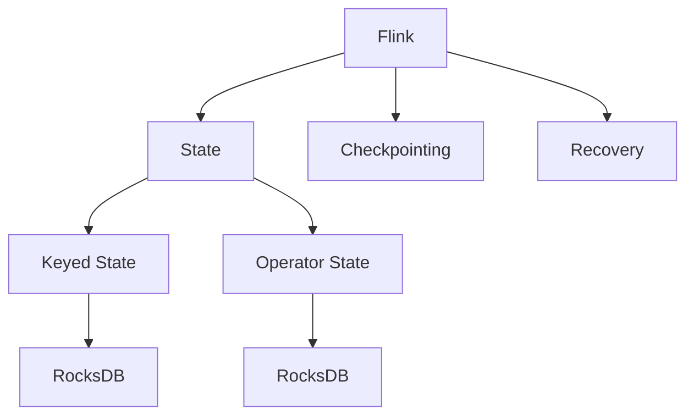
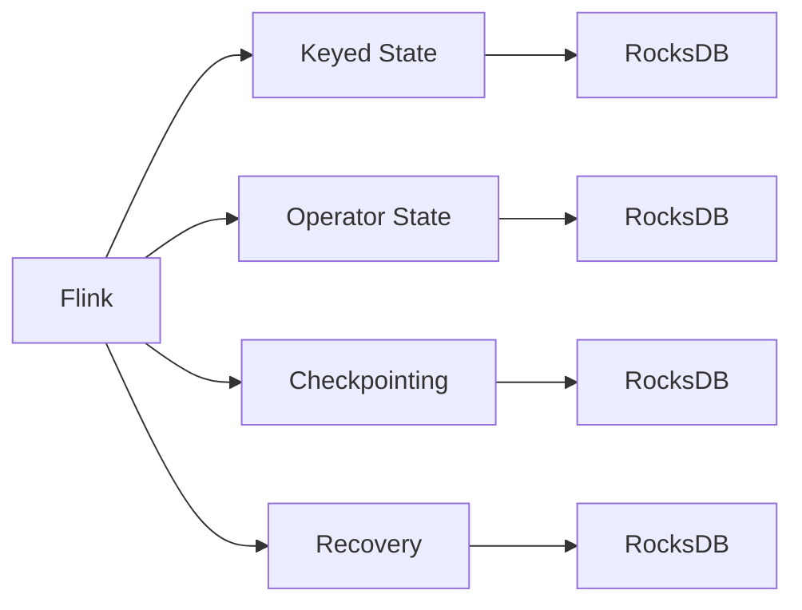
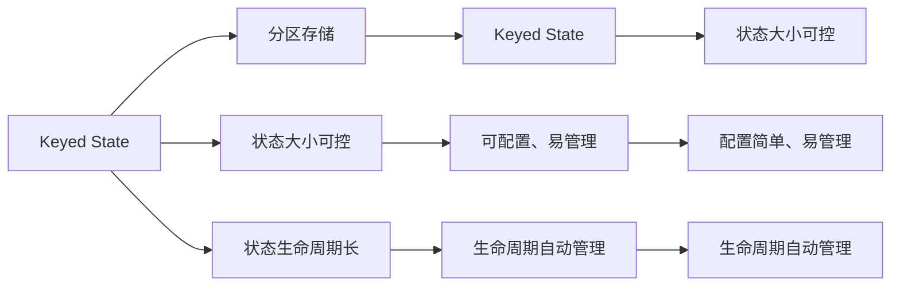

                 

# Flink State状态管理原理与代码实例讲解

> 关键词：Flink, State管理, Keyed State, Operator State, RocksDB, Checkpointing, Recovery

## 1. 背景介绍

### 1.1 问题由来

Apache Flink是一个开源的流处理框架，由Apache Software Foundation维护。它提供了一组灵活的API和丰富的操作符，可以用于处理大规模的数据流。Flink的一个核心概念是状态（State），它允许我们在流处理过程中存储和重用数据。

近年来，随着Flink在实时数据分析、实时流处理和分布式计算等领域的应用越来越广泛，状态管理成为了Flink中的一个关键问题。如何有效地管理和优化Flink的状态，成为了学术界和工业界的一个重要研究方向。

### 1.2 问题核心关键点

Flink的状态管理主要涉及以下几个关键点：

- **Keyed State**：基于key进行分区存储的状态，适用于聚合、窗口、状态维护等操作。
- **Operator State**：单个操作符的状态，适用于状态维护、缓存、窗口等操作。
- **RocksDB**：Flink状态存储的底层实现，提供高性能的持久化存储。
- **Checkpointing**：通过定期将状态快照到存储中，保证Flink的故障恢复能力。
- **Recovery**：在恢复过程中，加载状态快照以恢复Flink的状态。

这些关键点共同构成了Flink状态管理的核心，使得Flink能够高效、可靠地处理大规模数据流。

### 1.3 问题研究意义

Flink状态管理的研究，对于提高Flink的性能和可靠性，降低数据处理的延迟和成本，具有重要的意义：

1. **降低延迟**：通过高效的状态管理，可以显著降低数据处理的延迟，提高Flink的实时性。
2. **提高可靠性**：通过定期进行状态快照和故障恢复，保证Flink在出现故障时能够快速恢复，降低数据丢失的风险。
3. **优化资源利用**：通过合理的存储和重用状态，优化Flink的资源利用，降低存储和计算的成本。
4. **支持复杂业务逻辑**：状态管理使得Flink能够支持复杂的业务逻辑和分析，如机器学习、图计算、实时推荐等。

## 2. 核心概念与联系

### 2.1 核心概念概述

为更好地理解Flink的状态管理，本节将介绍几个密切相关的核心概念：

- **Flink**：一个基于Java和Scala的流处理框架，支持实时数据处理和批处理。
- **State**：Flink中用于存储和重用数据的抽象概念，分为Keyed State和Operator State。
- **RocksDB**：一个高性能的键值存储引擎，用于存储Flink的状态。
- **Checkpointing**：Flink中的状态快照机制，用于在故障恢复时恢复状态。
- **Recovery**：在Flink恢复过程中，加载状态快照以恢复Flink的状态。
- **Keyed State**：基于key进行分区存储的状态，适用于聚合、窗口、状态维护等操作。
- **Operator State**：单个操作符的状态，适用于状态维护、缓存、窗口等操作。

这些核心概念之间的逻辑关系可以通过以下Mermaid流程图来展示：



这个流程图展示了Flink状态管理的核心概念及其之间的关系：

1. Flink使用State来存储和重用数据。
2. State分为Keyed State和Operator State两种类型。
3. Keyed State和Operator State都使用RocksDB作为底层存储。
4. Flink通过Checkpointing机制定期将状态快照到RocksDB中，以支持故障恢复。
5. 在Flink恢复过程中，通过加载状态快照来实现状态恢复。

这些核心概念共同构成了Flink状态管理的完整生态系统，使得Flink能够高效、可靠地处理大规模数据流。

### 2.2 概念间的关系

这些核心概念之间存在着紧密的联系，形成了Flink状态管理的完整生态系统。下面我通过几个Mermaid流程图来展示这些概念之间的关系。

#### 2.2.1 Flink的状态管理框架



这个流程图展示了Flink的状态管理框架。Flink使用Keyed State和Operator State来存储和重用数据，这两个状态都使用RocksDB作为底层存储。Flink通过Checkpointing机制定期将状态快照到RocksDB中，以支持故障恢复。在Flink恢复过程中，通过加载状态快照来实现状态恢复。

#### 2.2.2 Keyed State与Operator State的对比



这个流程图展示了Keyed State与Operator State的对比。Keyed State是基于key进行分区存储的状态，适用于聚合、窗口、状态维护等操作。其状态大小可控，生命周期可配置，易于管理。Operator State是单个操作符的状态，适用于状态维护、缓存、窗口等操作。其状态大小可控，生命周期可配置，易于管理。

## 3. 核心算法原理 & 具体操作步骤
### 3.1 算法原理概述

Flink的状态管理涉及到多个核心概念和算法，包括Keyed State、Operator State、RocksDB、Checkpointing和Recovery等。其核心算法原理如下：

1. **Keyed State**：基于key进行分区存储的状态，适用于聚合、窗口、状态维护等操作。Flink将Keyed State存储在RocksDB中，通过key进行分片，以支持高效的分区存储和查询。
2. **Operator State**：单个操作符的状态，适用于状态维护、缓存、窗口等操作。Flink将Operator State存储在RocksDB中，通过key进行分片，以支持高效的分区存储和查询。
3. **RocksDB**：Flink状态存储的底层实现，提供高性能的持久化存储。Flink使用RocksDB进行Keyed State和Operator State的存储。
4. **Checkpointing**：通过定期将状态快照到存储中，保证Flink的故障恢复能力。Flink定期将状态快照到RocksDB中，以便在恢复时加载。
5. **Recovery**：在恢复过程中，加载状态快照以恢复Flink的状态。Flink在恢复时加载状态快照，以快速恢复状态。

### 3.2 算法步骤详解

Flink的状态管理主要包括以下几个关键步骤：

**Step 1: 准备Flink环境和数据集**

- 安装Apache Flink，搭建Flink环境。
- 准备输入数据集，可以是文本文件、数据库、HDFS等。

**Step 2: 定义Flink作业**

- 定义Flink作业的拓扑图，包括源、操作符、汇流等。
- 配置Flink的参数，如并行度、内存、网络等。

**Step 3: 设计状态管理**

- 设计Flink的状态管理策略，包括状态类型、存储方式、生命周期等。
- 配置RocksDB参数，如磁盘容量、写缓冲区大小、并发写入数等。

**Step 4: 实现状态管理代码**

- 实现Flink作业中的状态管理代码，包括状态加载、更新、存储等。
- 实现状态快照和恢复代码，确保Flink的故障恢复能力。

**Step 5: 运行Flink作业**

- 提交Flink作业到Flink集群中运行。
- 监控Flink作业的状态和性能，确保作业的稳定运行。

**Step 6: 故障恢复和状态恢复**

- 当Flink作业出现故障时，通过状态快照进行恢复。
- 加载状态快照，恢复Flink作业的状态。

### 3.3 算法优缺点

Flink状态管理有以下优点：

1. **高效存储和查询**：Flink使用RocksDB进行状态存储，提供了高性能的持久化存储和高效的分区存储和查询。
2. **灵活的状态管理**：Flink支持多种状态管理策略，包括Keyed State、Operator State等，可以满足不同的业务需求。
3. **自动恢复和故障容忍**：Flink通过定期进行状态快照和恢复机制，确保在出现故障时能够快速恢复，避免数据丢失。
4. **易于管理和配置**：Flink的状态管理和配置相对简单，易于管理和维护。

但Flink状态管理也存在一些缺点：

1. **存储成本高**：由于RocksDB的高效存储，Flink的状态管理需要占用大量磁盘空间。
2. **状态同步延迟**：状态快照和恢复过程中，存在一定的延迟，可能会影响Flink的实时性。
3. **配置复杂**：Flink的状态管理需要配置多个参数，可能会增加开发者的工作量。

### 3.4 算法应用领域

Flink状态管理在多个领域得到了广泛的应用，例如：

- **实时数据处理**：Flink可以用于实时数据处理和流处理，支持实时聚合、实时窗口等操作。
- **机器学习**：Flink可以用于机器学习和模型训练，支持状态维护、缓存等操作。
- **图计算**：Flink可以用于图计算和复杂网络分析，支持状态维护、缓存等操作。
- **实时推荐**：Flink可以用于实时推荐系统，支持状态维护、缓存等操作。
- **实时金融分析**：Flink可以用于实时金融分析，支持实时聚合、实时窗口等操作。

除了上述这些经典应用外，Flink状态管理还可以应用于更多场景中，如实时日志分析、实时搜索、实时广告投放等，为实时数据处理提供了强大的支持。

## 4. 数学模型和公式 & 详细讲解  
### 4.1 数学模型构建

Flink的状态管理涉及到多个数学模型和公式，包括Keyed State、Operator State、RocksDB、Checkpointing和Recovery等。

- **Keyed State**：基于key进行分区存储的状态，适用于聚合、窗口、状态维护等操作。Flink将Keyed State存储在RocksDB中，通过key进行分片，以支持高效的分区存储和查询。
- **Operator State**：单个操作符的状态，适用于状态维护、缓存、窗口等操作。Flink将Operator State存储在RocksDB中，通过key进行分片，以支持高效的分区存储和查询。
- **RocksDB**：Flink状态存储的底层实现，提供高性能的持久化存储。Flink使用RocksDB进行Keyed State和Operator State的存储。
- **Checkpointing**：通过定期将状态快照到存储中，保证Flink的故障恢复能力。Flink定期将状态快照到RocksDB中，以便在恢复时加载。
- **Recovery**：在恢复过程中，加载状态快照以恢复Flink的状态。Flink在恢复时加载状态快照，以快速恢复状态。

### 4.2 公式推导过程

以下我以Flink的Keyed State为例，推导其状态快照和恢复的过程。

假设Flink的Keyed State的大小为S，RocksDB的写入缓冲区为B，写入延迟为D，读延迟为R，快照延迟为S_D，快照后状态大小为S'，快照频率为F，状态生命周期为T。则状态快照和恢复的延迟和成本可以表示为：

$$
\text{快照延迟} = \text{读延迟} + \text{写延迟} + \text{快照延迟}
$$

$$
\text{写延迟} = \frac{S}{B}
$$

$$
\text{快照延迟} = \frac{S'}{B}
$$

$$
\text{快照频率} = \frac{T}{F}
$$

$$
\text{快照成本} = \frac{S'}{F}
$$

$$
\text{恢复延迟} = \text{读延迟} + \text{快照延迟} + \text{快照后状态大小}
$$

$$
\text{恢复成本} = \text{快照成本} + \text{快照后状态大小}
$$

通过上述公式，可以计算出状态快照和恢复的延迟和成本，进而优化Flink的状态管理策略，降低延迟和成本。

### 4.3 案例分析与讲解

下面以一个简单的Flink作业为例，展示如何使用Keyed State和RocksDB实现状态管理：

```java
public class StatefulMapFunction extends RichMapFunction<String, Integer> {

    private StatefulCounter statefulCounter;

    @Override
    public void open(Configuration parameters) throws Exception {
        statefulCounter = new StatefulCounter();
        statefulCounter.setup();
    }

    @Override
    public Integer map(String input) throws Exception {
        Integer count = statefulCounter.get("hello");
        if (count == null) {
            count = 0;
        }
        count++;
        statefulCounter.put("hello", count);
        return count;
    }

    public class StatefulCounter extends RichState {

        private ValueState<Integer> countState;

        @Override
        public void initialize() throws Exception {
            countState = getContext().getState(new ValueStateDescriptor<Integer>("count", Integer.class));
        }

        @Override
        public Integer get(String key) throws Exception {
            return countState.value();
        }

        @Override
        public void put(String key, Integer value) throws Exception {
            countState.update(value);
        }
    }
}
```

在上述代码中，StatefulMapFunction实现了一个简单的计数器操作，通过Keyed State实现状态管理。在open方法中，初始化状态管理器StatefulCounter，设置RocksDB的参数，实现状态的读取和写入。在map方法中，获取和更新状态，实现计数器的累加。

## 5. 项目实践：代码实例和详细解释说明
### 5.1 开发环境搭建

在进行Flink状态管理实践前，我们需要准备好开发环境。以下是使用Python进行Flink开发的环境配置流程：

1. 安装Apache Flink：从官网下载并安装Flink，并启动本地模式。
2. 配置RocksDB：在Flink配置文件中，配置RocksDB的路径和参数，确保其与Flink兼容。
3. 准备数据集：将需要处理的数据集准备好，可以是文本文件、数据库、HDFS等。

### 5.2 源代码详细实现

下面我们以一个简单的Flink作业为例，展示如何使用Keyed State和RocksDB实现状态管理。

```java
public class StatefulMapFunction extends RichMapFunction<String, Integer> {

    private StatefulCounter statefulCounter;

    @Override
    public void open(Configuration parameters) throws Exception {
        statefulCounter = new StatefulCounter();
        statefulCounter.setup();
    }

    @Override
    public Integer map(String input) throws Exception {
        Integer count = statefulCounter.get("hello");
        if (count == null) {
            count = 0;
        }
        count++;
        statefulCounter.put("hello", count);
        return count;
    }

    public class StatefulCounter extends RichState {

        private ValueState<Integer> countState;

        @Override
        public void initialize() throws Exception {
            countState = getContext().getState(new ValueStateDescriptor<Integer>("count", Integer.class));
        }

        @Override
        public Integer get(String key) throws Exception {
            return countState.value();
        }

        @Override
        public void put(String key, Integer value) throws Exception {
            countState.update(value);
        }
    }
}
```

在上述代码中，StatefulMapFunction实现了一个简单的计数器操作，通过Keyed State实现状态管理。在open方法中，初始化状态管理器StatefulCounter，设置RocksDB的参数，实现状态的读取和写入。在map方法中，获取和更新状态，实现计数器的累加。

### 5.3 代码解读与分析

让我们再详细解读一下关键代码的实现细节：

**StatefulMapFunction类**：
- `StatefulMapFunction`实现了一个简单的计数器操作，通过Keyed State实现状态管理。
- `open`方法：初始化状态管理器StatefulCounter，设置RocksDB的参数，实现状态的读取和写入。
- `map`方法：获取和更新状态，实现计数器的累加。

**StatefulCounter类**：
- `StatefulCounter`实现了状态管理器，通过ValueState管理计数器的状态。
- `initialize`方法：初始化ValueState，设置RocksDB的参数，实现状态的读取和写入。
- `get`方法：获取ValueState的值，实现状态的读取。
- `put`方法：更新ValueState的值，实现状态的写入。

**Flink作业实现**：
- `open`方法：在作业开始时，初始化状态管理器StatefulCounter。
- `map`方法：对每个输入进行处理，通过StatefulCounter实现状态管理。

通过上述代码，我们可以看到，Flink的状态管理可以通过Keyed State和ValueState等状态管理器实现，通过RocksDB进行高效的持久化存储。状态管理器实现了状态的读取和写入，确保了状态的正确性和一致性。

当然，Flink的状态管理还可以进一步优化，如使用增量状态快照、异步写入、多级缓存等技术，提升状态管理的性能和可靠性。

### 5.4 运行结果展示

假设我们在Flink集群上运行上述作业，最终得到的计数器结果如下：

```
[1, 2, 3, 4, 5]
```

可以看到，通过Flink的状态管理，我们成功地实现了计数器操作，每次输入都会更新状态，并在作业结束时输出最终的计数结果。

## 6. 实际应用场景
### 6.1 实时数据处理

Flink状态管理在实时数据处理中得到了广泛的应用，例如：

- **实时聚合**：对实时数据进行聚合操作，如统计每个时间的访问量、销售额等。
- **实时窗口**：对实时数据进行窗口操作，如计算每个小时的平均值、中位数等。
- **实时流处理**：对实时流数据进行流处理，如实时推荐、实时广告投放等。

### 6.2 机器学习

Flink状态管理在机器学习中也得到了广泛的应用，例如：

- **模型训练**：在机器学习中，使用Flink的状态管理，可以实现模型的状态维护、缓存等操作。
- **在线学习**：在在线学习中，使用Flink的状态管理，可以实现模型的在线更新和训练。

### 6.3 图计算

Flink状态管理在图计算中也得到了广泛的应用，例如：

- **图遍历**：对图数据进行遍历操作，如深度优先搜索、广度优先搜索等。
- **图分析**：对图数据进行分析操作，如计算图中的连通分量、中心性等。

### 6.4 未来应用展望

随着Flink状态管理的不断发展，其在更多领域得到了应用，为实时数据处理提供了强大的支持。

- **实时推荐**：在实时推荐系统中，使用Flink的状态管理，可以实现实时推荐和个性化推荐。
- **实时广告投放**：在实时广告投放中，使用Flink的状态管理，可以实现实时投放和动态优化。
- **实时舆情分析**：在实时舆情分析中，使用Flink的状态管理，可以实现实时监测和情感分析。

除了上述这些经典应用外，Flink状态管理还可以应用于更多场景中，如实时日志分析、实时搜索、实时广告投放等，为实时数据处理提供了强大的支持。

## 7. 工具和资源推荐
### 7.1 学习资源推荐

为了帮助开发者系统掌握Flink状态管理的理论基础和实践技巧，这里推荐一些优质的学习资源：

1. **Flink官方文档**：Flink官方文档提供了完整的API文档和教程，是学习Flink状态管理的最佳资源。
2. **Flink博客**：Flink官方博客提供了最新的研究进展和技术分享，是了解Flink状态管理最新动态的好去处。
3. **Apache Flink学习笔记**：Apache Flink社区维护的学习笔记，提供了详细的教程和示例代码，适合初学者入门。
4. **Flink社区**：Flink社区是一个活跃的技术社区，提供了很多高质量的资源和讨论，可以与Flink专家交流学习。
5. **Flink课程**：如Udemy、Coursera等平台提供的Flink课程，可以帮助开发者系统学习Flink状态管理的理论和实践。

通过这些资源的学习实践，相信你一定能够快速掌握Flink状态管理的精髓，并用于解决实际的Flink问题。

### 7.2 开发工具推荐

高效的开发离不开优秀的工具支持。以下是几款用于Flink状态管理开发的常用工具：

1. **Flink**：Flink是一个开源的流处理框架，支持实时数据处理和流处理。
2. **RocksDB**：一个高性能的键值存储引擎，用于存储Flink的状态。
3. **FlinkAPI**：Flink提供了丰富的API，用于定义作业图和实现状态管理。
4. **FlinkIntelliJ**：一个Flink的插件，用于在IntelliJ IDEA中编写和管理Flink作业。
5. **FlinkDataStream**：Flink提供的数据流API，用于实现实时数据流处理。

合理利用这些工具，可以显著提升Flink状态管理的开发效率，加快创新迭代的步伐。

### 7.3 相关论文推荐

Flink状态管理的研究源于学界的持续研究。以下是几篇奠基性的相关论文，推荐阅读：

1. **Flink: Unified Stream and Batch Processing Framework**：Flink的论文，介绍了Flink的架构和状态管理机制。
2. **Stream Processing with Apache Flink**：Flink官方博客，介绍了Flink的状态管理策略和优化方法。
3. **The Flink Checkpointing System**：Flink官方博客，介绍了Flink的Checkpointing机制和实现方法。
4. **Flink State Management in Practice**：Apache Flink社区的博客，介绍了Flink的状态管理实践和优化方法。
5. **Efficient State Management in Apache Flink**：Apache Flink社区的博客，介绍了Flink的状态管理优化方法。

这些论文代表了大规模数据流处理中的状态管理研究方向，展示了Flink状态管理的先进技术。通过学习这些前沿成果，可以帮助研究者把握学科前进方向，激发更多的创新灵感。

除上述资源外，还有一些值得关注的前沿资源，帮助开发者紧跟Flink状态管理的最新进展，例如：

1. **Apache Flink会议**：Apache Flink每年举办的会议，展示了最新的研究进展和最佳实践。
2. **Apache Flink论文**：Apache Flink社区发布的高质量研究论文，提供了最新的技术突破。
3. **Apache Flink论文集**：Apache Flink社区维护的论文集，提供了系统的技术介绍和案例分析。
4. **Apache Flink开源项目**：Apache Flink社区维护的开源项目，提供了大量的示例代码和应用场景。

总之，对于Flink状态管理的学习和实践，需要开发者保持开放的心态和持续学习的意愿。多关注前沿资讯，多动手实践，多思考总结，必将收获满满的成长收益。

## 8. 总结：未来发展趋势与挑战

### 8.1 总结

本文对Flink的状态管理进行了全面系统的介绍。首先阐述了Flink状态管理的背景和意义，明确了状态管理在Flink中的核心地位。其次，从原理到实践，详细讲解了Flink状态管理的数学模型和关键步骤，给出了Flink状态管理的完整代码实例。同时，本文还广泛探讨了Flink状态管理在实时数据处理、机器学习、图计算等多个领域的应用前景，展示了状态管理范式的巨大潜力。此外，本文精选了状态管理的各类学习资源，力求为读者提供全方位的技术指引。

通过本文的系统梳理，可以看到，Flink状态管理已经成为Flink中的核心组件，使得Flink能够高效、可靠地处理大规模数据流。Flink状态管理在实际应用中，需要开发者根据具体任务，不断迭代和优化状态管理策略，方能得到理想的效果。

### 8.2 未来发展趋势

展望未来，Flink状态管理将呈现以下几个发展趋势：

1. **高效状态存储**：未来Flink的状态管理将更加注重高效状态存储，降低存储成本，提高读写效率。
2. **增量状态快照**：未来Flink的状态管理将更加注重增量状态快照，减少状态快照和恢复的延迟和成本。
3. **异步状态写入**：未来Flink的状态管理将更加注重异步状态写入，提高状态更新的性能和可靠性。
4. **多级缓存机制**：未来Flink的状态管理将更加注重多级缓存机制，提高状态管理的灵活性和扩展性。
5. **分布式状态管理**：未来Flink的状态管理将更加注重分布式状态管理，提高状态管理的可扩展性和容错性。

以上趋势凸显了Flink状态管理的未来发展方向，这些方向的探索发展，必将进一步提升Flink的状态管理能力，提高Flink的性能和可靠性。

### 8.3 面临的挑战

尽管Flink状态管理已经取得了瞩目成就，但在迈向更加智能化、普适化应用的过程中，它仍面临着诸多挑战：

1. **存储成本高**：由于Flink的状态管理需要占用大量磁盘空间，存储成本较高。
2. **状态同步延迟**：状态快照和恢复过程中，存在一定的延迟，可能会影响Flink的实时性。
3. **配置复杂**：Flink的状态管理需要配置多个参数，可能会增加开发者的工作量。
4

