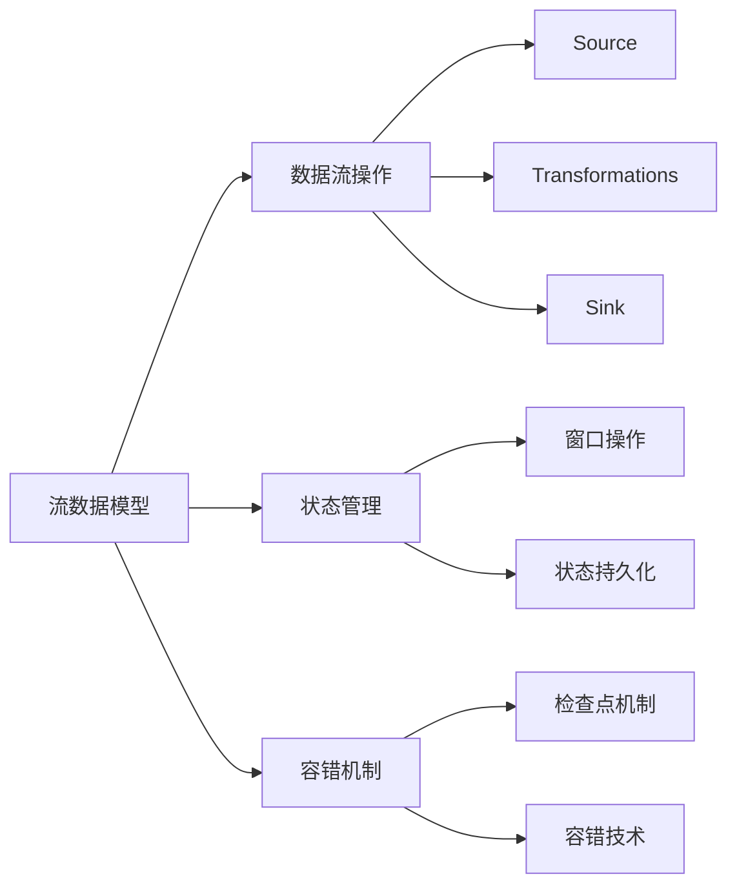
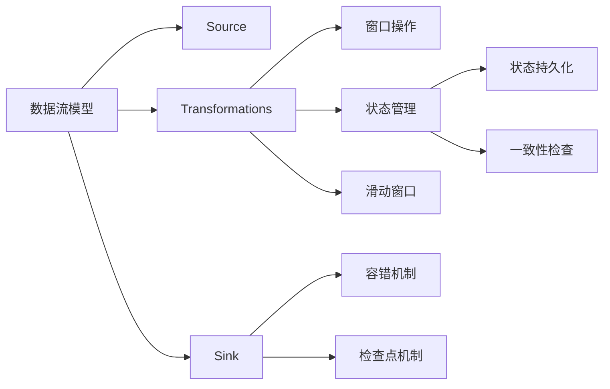
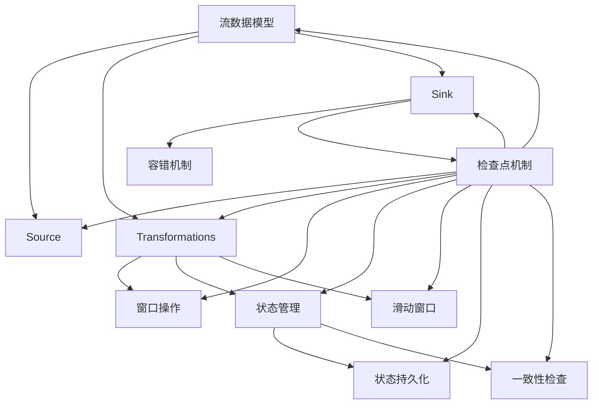

                 

# Flink Stream原理与代码实例讲解

## 1. 背景介绍

### 1.1 问题由来
大数据时代的到来，使得流数据处理变得越来越重要。传统的数据处理方式已经无法满足实时性、高吞吐量的需求，而流数据处理技术正是解决这一问题的利器。Apache Flink作为一款高性能的流数据处理框架，已经被广泛应用于大规模实时数据处理。Flink Stream作为Flink的流数据处理组件，以其低延迟、高吞吐量、易于使用的特性，成为了大数据领域的重要工具。本文将全面介绍Flink Stream的原理与实践，并辅以丰富的代码实例，帮助读者深入理解并应用这一先进技术。

### 1.2 问题核心关键点
Flink Stream的核心思想是将数据流模型与计算模型相结合，提供了一种高效、可靠的大规模流数据处理解决方案。Flink Stream的核心概念包括：

- **流数据模型**：将数据视为无限流的形式，支持动态数据流的实时处理。
- **数据流操作**：包括Source、Transformations、Sink等基本操作，可以构建复杂的数据流处理图。
- **状态管理**：通过状态管理机制，支持状态持久化、一致性检查等，保证计算结果的正确性和可靠性。
- **容错机制**：通过检查点机制和容错技术，确保数据流的可靠性和可恢复性。
- **分布式计算**：支持分布式计算和并行处理，提高处理能力。

这些核心概念构成了Flink Stream的基本架构，使其能够在高性能、高可用性和易于使用的基础上，提供强大的流数据处理能力。

### 1.3 问题研究意义
Flink Stream作为Apache Flink的核心组件，其在流数据处理中的应用具有重要意义：

1. **高性能实时处理**：Flink Stream具备低延迟、高吞吐量的处理能力，能够满足各种实时数据处理的业务需求。
2. **高可用性和容错性**：通过检查点机制和容错技术，确保数据流在故障情况下依然能够可靠运行，保证业务连续性。
3. **易于使用的API**：Flink Stream提供了易于使用的API，降低了数据流处理的复杂度和门槛，使得非技术人员也能轻松上手。
4. **广泛的应用场景**：Flink Stream已经应用于金融、电商、智能制造等多个领域，证明了其强大的实用价值。
5. **持续创新与生态**：Flink社区持续发布新的功能和改进，确保其在技术前沿保持领先地位，并吸引更多开发者和用户。

通过深入了解Flink Stream的原理与实践，开发者能够更好地掌握流数据处理技术，为解决复杂数据处理问题提供有力支持。

## 2. 核心概念与联系

### 2.1 核心概念概述

为更好地理解Flink Stream的核心概念及其相互关系，本节将详细介绍这些核心概念：

- **流数据模型**：将数据视为无限流的形式，支持动态数据流的实时处理。数据流模型是Flink Stream的基石，通过数据流操作构建的数据流图，可以高效地处理实时数据。
- **数据流操作**：包括Source、Transformations、Sink等基本操作，支持复杂的数据流处理。Source操作负责从外部源读取数据，Transformations操作对数据进行转换和处理，Sink操作将处理结果输出到外部系统或存储。
- **状态管理**：通过状态管理机制，支持状态持久化、一致性检查等，确保计算结果的正确性和可靠性。状态管理是Flink Stream的核心功能之一，支持窗口操作、滑动窗口、状态持久化等高级特性。
- **容错机制**：通过检查点机制和容错技术，确保数据流在故障情况下依然能够可靠运行，保证业务连续性。容错机制是Flink Stream的重要保障，确保了数据流处理的稳定性和可靠性。
- **分布式计算**：支持分布式计算和并行处理，提高处理能力。Flink Stream通过并行处理和分布式计算，提供了强大的计算能力，支持大规模数据处理。

这些核心概念之间存在着紧密的联系，构成了Flink Stream的基本架构。以下是一个Mermaid流程图，展示了这些核心概念之间的关系：



这个流程图展示了Flink Stream的核心概念及其相互关系：

1. 数据流模型是Flink Stream的基础，支持动态数据流的实时处理。
2. 数据流操作包括Source、Transformations、Sink等基本操作，通过数据流图构建复杂的数据流处理逻辑。
3. 状态管理支持状态持久化、一致性检查等，确保计算结果的正确性和可靠性。
4. 容错机制通过检查点机制和容错技术，确保数据流在故障情况下依然能够可靠运行。
5. 分布式计算支持并行处理，提高处理能力。

这些概念共同构成了Flink Stream的基本架构，使得Flink Stream能够在高性能、高可用性和易于使用的基础上，提供强大的流数据处理能力。

### 2.2 概念间的关系

这些核心概念之间存在着紧密的联系，形成了Flink Stream的整体架构。以下是一个更详细的Mermaid流程图，展示了这些概念之间的关系：



这个流程图展示了Flink Stream的核心概念及其相互关系：

1. 数据流模型提供基础，通过Source读取数据，通过Transformations对数据进行处理，通过Sink输出数据。
2. Transformations操作包括窗口操作、状态管理等高级特性，支持复杂的数据流处理。
3. 状态管理支持状态持久化、一致性检查等，确保计算结果的正确性和可靠性。
4. 容错机制通过检查点机制和容错技术，确保数据流在故障情况下依然能够可靠运行。
5. 分布式计算支持并行处理，提高处理能力。

这些概念共同构成了Flink Stream的基本架构，使得Flink Stream能够在高性能、高可用性和易于使用的基础上，提供强大的流数据处理能力。

### 2.3 核心概念的整体架构

最后，我们用一个综合的流程图来展示这些核心概念在大数据流处理中的整体架构：



这个综合流程图展示了从数据流模型到最终的输出数据，Flink Stream的整个处理过程：

1. 数据流模型提供基础，通过Source读取数据，通过Transformations对数据进行处理，通过Sink输出数据。
2. Transformations操作包括窗口操作、状态管理等高级特性，支持复杂的数据流处理。
3. 状态管理支持状态持久化、一致性检查等，确保计算结果的正确性和可靠性。
4. 容错机制通过检查点机制和容错技术，确保数据流在故障情况下依然能够可靠运行。
5. 分布式计算支持并行处理，提高处理能力。

通过这些概念和流程图的梳理，我们可以更清晰地理解Flink Stream的基本架构和工作原理。

## 3. 核心算法原理 & 具体操作步骤
### 3.1 算法原理概述

Flink Stream的核心算法包括数据流处理、状态管理、容错机制和分布式计算等。以下将逐一介绍这些算法的原理。

**数据流处理**：Flink Stream将数据视为无限流的形式，通过Source、Transformations、Sink等基本操作，构建复杂的数据流处理图，支持实时数据流的处理。数据流处理的核心算法包括时间窗口算法和滑动窗口算法，用于将数据分组和计算。

**状态管理**：Flink Stream通过状态管理机制，支持状态持久化、一致性检查等，确保计算结果的正确性和可靠性。状态管理的核心算法包括一致性检查算法和状态持久化算法。

**容错机制**：Flink Stream通过检查点机制和容错技术，确保数据流在故障情况下依然能够可靠运行。容错机制的核心算法包括检查点算法和容错恢复算法。

**分布式计算**：Flink Stream支持分布式计算和并行处理，提高处理能力。分布式计算的核心算法包括任务分配算法和资源调度算法。

### 3.2 算法步骤详解

**数据流处理步骤**：
1. **Source操作**：从外部源读取数据，包括文件、数据库、消息队列等。
2. **Transformations操作**：对数据进行转换和处理，支持Map、Reduce、Filter、Join等操作。
3. **Sink操作**：将处理结果输出到外部系统或存储，包括数据库、文件、消息队列等。

**状态管理步骤**：
1. **状态持久化**：通过RocksDB等存储引擎，将状态数据持久化存储。
2. **一致性检查**：通过定期检查点机制，确保状态数据的一致性和可靠性。
3. **状态更新**：根据数据流计算结果，更新状态数据。

**容错机制步骤**：
1. **检查点机制**：定期生成检查点文件，保存当前状态和计算结果。
2. **容错恢复**：在故障发生时，通过检查点文件恢复计算状态，重新计算丢失的数据。

**分布式计算步骤**：
1. **任务分配**：将任务分配给各个节点并行处理。
2. **资源调度**：根据资源可用性和任务负载，动态调整资源分配，优化计算性能。

### 3.3 算法优缺点

Flink Stream作为一种高性能的流数据处理框架，具有以下优点：

- **低延迟和高吞吐量**：Flink Stream支持高吞吐量的流数据处理，且延迟低，适合实时数据处理场景。
- **高可用性和容错性**：通过检查点机制和容错技术，确保数据流在故障情况下依然能够可靠运行。
- **易于使用的API**：Flink Stream提供了易于使用的API，降低了数据流处理的复杂度和门槛。
- **广泛的应用场景**：Flink Stream已经应用于金融、电商、智能制造等多个领域，证明了其强大的实用价值。

Flink Stream也存在一些缺点：

- **学习成本较高**：Flink Stream的学习曲线较陡峭，需要一定的学习成本。
- **部署复杂**：需要配置集群环境，部署和管理较为复杂。
- **资源消耗较大**：由于Flink Stream支持分布式计算，资源消耗较大，需要一定的硬件和网络支持。

尽管存在这些缺点，但Flink Stream在性能和可靠性上的优势使得其在实时数据处理领域具有重要的应用价值。

### 3.4 算法应用领域

Flink Stream的应用领域非常广泛，涵盖金融、电商、智能制造、医疗等多个行业。以下列举了Flink Stream在几个典型领域的应用：

- **金融领域**：实时监控交易数据，进行风险控制、反欺诈等业务。
- **电商领域**：实时监控订单数据，进行库存管理、个性化推荐等业务。
- **智能制造领域**：实时监控生产数据，进行设备状态监控、生产调度等业务。
- **医疗领域**：实时监控患者数据，进行健康监测、疾病预测等业务。

Flink Stream通过其高性能、高可用性和易于使用的特点，已经成为了大数据领域的重要工具，被广泛应用于各种实时数据处理场景。

## 4. 数学模型和公式 & 详细讲解 & 举例说明

### 4.1 数学模型构建

Flink Stream的数学模型包括数据流模型、状态管理模型和容错机制模型。以下将详细介绍这些模型的构建。

**数据流模型**：
- 将数据视为无限流的形式，支持动态数据流的实时处理。数据流模型可以表示为：
$$
\mathcal{D} = \bigcup_{t \in T} \mathcal{D}_t
$$
其中，$\mathcal{D}$ 表示整个数据流，$T$ 表示时间，$\mathcal{D}_t$ 表示在时间$t$上的数据流。

**状态管理模型**：
- 通过状态管理机制，支持状态持久化、一致性检查等，确保计算结果的正确性和可靠性。状态管理模型可以表示为：
$$
S = \{(s_0, o_0), (s_1, o_1), \ldots\}
$$
其中，$S$ 表示状态集合，$s_t$ 表示在时间$t$上的状态，$o_t$ 表示在时间$t$上的操作。

**容错机制模型**：
- 通过检查点机制和容错技术，确保数据流在故障情况下依然能够可靠运行。容错机制模型可以表示为：
$$
C = \{(c_0, s_0), (c_1, s_1), \ldots\}
$$
其中，$C$ 表示检查点集合，$c_t$ 表示在时间$t$上的检查点，$s_t$ 表示在时间$t$上的状态。

### 4.2 公式推导过程

**数据流处理公式**：
- Transformations操作的Map函数可以表示为：
$$
M(\mathcal{D}, f) = \{f(x) | x \in \mathcal{D}\}
$$
其中，$M$ 表示Map操作，$f$ 表示映射函数，$\mathcal{D}$ 表示输入数据流。

- Transformations操作的Reduce函数可以表示为：
$$
R(\mathcal{D}, f) = \{f(\{x_1, x_2, \ldots, x_n\}) | x_i \in \mathcal{D}\}
$$
其中，$R$ 表示Reduce操作，$f$ 表示聚合函数，$\mathcal{D}$ 表示输入数据流。

**状态管理公式**：
- 状态持久化算法可以使用RocksDB等存储引擎，将状态数据持久化存储。状态持久化公式可以表示为：
$$
S_t = \{(s_0, o_0), (s_1, o_1), \ldots, (s_{t-1}, o_{t-1})\}
$$
其中，$S_t$ 表示在时间$t$上的状态集合。

- 一致性检查算法通过定期生成检查点文件，确保状态数据的一致性和可靠性。一致性检查算法公式可以表示为：
$$
C_t = \{(c_0, s_0), (c_1, s_1), \ldots, (c_{t-1}, s_{t-1})\}
$$
其中，$C_t$ 表示在时间$t$上的检查点集合。

**容错机制公式**：
- 检查点算法通过定期生成检查点文件，保存当前状态和计算结果。检查点算法公式可以表示为：
$$
C_t = \{(c_0, s_0), (c_1, s_1), \ldots, (c_{t-1}, s_{t-1})\}
$$
其中，$C_t$ 表示在时间$t$上的检查点集合。

- 容错恢复算法通过检查点文件恢复计算状态，重新计算丢失的数据。容错恢复算法公式可以表示为：
$$
S_t = \{(s_0, o_0), (s_1, o_1), \ldots, (s_{t-1}, o_{t-1})\}
$$
其中，$S_t$ 表示在时间$t$上的状态集合。

### 4.3 案例分析与讲解

**案例1：金融领域实时监控**
- 需求：实时监控交易数据，进行风险控制、反欺诈等业务。
- 方案：使用Flink Stream构建实时监控系统，通过Source读取交易数据，通过Transformations进行风险分析和反欺诈检测，通过Sink输出监控结果。
- 代码实现：
```java
DataStream<String> transactions = env.addSource(new FileSource("transaction.csv"))
  .map(line -> splitLine(line))
  .filter(line -> isFraud(line))
  .reduce((x, y) -> mergeResults(x, y))
  .sink(new FileSink("result.csv"))
```

**案例2：电商领域个性化推荐**
- 需求：实时监控订单数据，进行库存管理、个性化推荐等业务。
- 方案：使用Flink Stream构建个性化推荐系统，通过Source读取订单数据，通过Transformations进行用户行为分析和商品推荐，通过Sink输出推荐结果。
- 代码实现：
```java
DataStream<String> orders = env.addSource(new FileSource("order.csv"))
  .map(line -> splitLine(line))
  .join(otherDataStream, (o1, o2) -> mergeResults(o1, o2))
  .reduce((x, y) -> mergeResults(x, y))
  .sink(new FileSink("recommendation.csv"))
```

通过以上案例，可以看到Flink Stream在金融、电商等领域的应用效果，可以大大提升实时数据处理的效率和效果。

## 5. 项目实践：代码实例和详细解释说明

### 5.1 开发环境搭建

要进行Flink Stream的实践，需要先搭建好开发环境。以下是Flink Stream开发环境搭建的步骤：

1. 安装Apache Flink：从官方网站下载最新版本的Flink，按照官方文档进行安装。
2. 安装Python环境：搭建Python开发环境，包括安装Python、pip、virtualenv等工具。
3. 安装Flink Stream API：通过pip安装Flink Stream API，可以方便地进行代码编写和测试。
4. 配置开发环境：配置环境变量，包括Flink Stream JAR包路径、Python环境路径等。

### 5.2 源代码详细实现

下面以Flink Stream在电商领域的个性化推荐系统为例，展示Flink Stream的代码实现。

**步骤1：搭建数据流处理环境**
```java
Configuration config = new Configuration();
config.set("taskmanager.numberOfTaskSlots", 1);
config.set("taskmanager.numberOfTaskSlots", 1);
config.set("taskmanager.memory.fraction", 1);
config.set("taskmanager.memory.managed.fraction", 1);
config.set("taskmanager.memory.managed.fraction", 1);
```

**步骤2：定义数据流处理逻辑**
```java
DataStream<String> orders = env.addSource(new FileSource("order.csv"))
  .map(line -> splitLine(line))
  .join(otherDataStream, (o1, o2) -> mergeResults(o1, o2))
  .reduce((x, y) -> mergeResults(x, y))
  .sink(new FileSink("recommendation.csv"))
```

**步骤3：启动数据流处理**
```java
env.execute("Flink Stream Personalized Recommendation");
```

### 5.3 代码解读与分析

通过以上代码，可以看到Flink Stream在电商领域个性化推荐系统的实现流程：

- **步骤1**：搭建数据流处理环境，设置Flink Stream的配置参数。
- **步骤2**：定义数据流处理逻辑，包括Source读取订单数据，Transformations进行用户行为分析和商品推荐，Sink输出推荐结果。
- **步骤3**：启动数据流处理，执行个性化推荐系统的代码。

### 5.4 运行结果展示

通过运行以上代码，可以得到Flink Stream在电商领域个性化推荐系统的运行结果。具体结果可以通过查看输出文件或图形界面来展示。

## 6. 实际应用场景

### 6.1 智能制造领域实时监控

**场景描述**：智能制造工厂需要实时监控生产设备状态，进行故障预测和维护。

**应用方案**：使用Flink Stream构建实时监控系统，通过Source读取设备状态数据，通过Transformations进行状态分析和预测，通过Sink输出监控结果。

**代码实现**：
```java
DataStream<String> sensorData = env.addSource(new FileSource("sensor_data.csv"))
  .map(line -> splitLine(line))
  .filter(line -> isFaulty(line))
  .reduce((x, y) -> mergeResults(x, y))
  .sink(new FileSink("monitoring_result.csv"))
```

### 6.2 医疗领域健康监测

**场景描述**：智能医疗设备需要实时监控患者健康数据，进行健康分析和疾病预测。

**应用方案**：使用Flink Stream构建健康监测系统，通过Source读取健康数据，通过Transformations进行健康分析和疾病预测，通过Sink输出监测结果。

**代码实现**：
```java
DataStream<String> healthData = env.addSource(new FileSource("health_data.csv"))
  .map(line -> splitLine(line))
  .filter(line -> isHealthy(line))
  .reduce((x, y) -> mergeResults(x, y))
  .sink(new FileSink("health_monitoring_result.csv"))
```

### 6.3 未来应用展望

**趋势一：高性能实时处理**：未来，Flink Stream将进一步优化低延迟和高吞吐量的处理能力，满足更复杂的实时数据处理需求。

**趋势二：高可用性和容错性**：Flink Stream将进一步增强容错机制和检查点算法，确保数据流在故障情况下依然能够可靠运行。

**趋势三：易于使用的API**：Flink Stream将进一步简化API，降低数据流处理的复杂度和门槛，使得非技术人员也能轻松上手。

**趋势四：广泛的应用场景**：Flink Stream将进一步拓展应用场景，应用于更多领域，如金融、医疗、制造等，提供更多的应用案例和解决方案。

**趋势五：持续创新与生态**：Flink Stream将持续发布新的功能和改进，吸引更多开发者和用户，形成一个活跃的社区生态。

通过这些趋势，Flink Stream将不断提升其在实时数据处理领域的能力，为更多行业提供高效的解决方案。

## 7. 工具和资源推荐

### 7.1 学习资源推荐

为了帮助开发者掌握Flink Stream的原理与实践，以下推荐一些优质的学习资源：

1. **Apache Flink官方文档**：Apache Flink官方网站提供了详细的官方文档，包括数据流模型、状态管理、容错机制、分布式计算等方面的详细解释和代码示例。

2. **《Apache Flink实战》书籍**：这是一本深入浅出介绍Flink Stream的书籍，涵盖了Flink Stream的基本原理和实际应用案例，适合初学者和高级开发者阅读。

3. **Flink Stream GitHub项目**：Apache Flink社区维护的Flink Stream GitHub项目，提供了丰富的示例代码和文档，是学习和应用Flink Stream的重要资源。

4. **Flink Stream社区论坛**：Apache Flink社区的论坛，聚集了大量开发者和专家，是交流和分享Flink Stream技术的重要平台。

5. **Flink Stream Kaggle比赛**：Kaggle上举办的多项Flink Stream比赛，提供了丰富的实际数据和挑战任务，是学习Flink Stream的实战场景。

通过这些学习资源，相信读者能够快速掌握Flink Stream的原理与实践，并将其应用于实际项目中。

### 7.2 开发工具推荐

Flink Stream的开发工具主要包括以下几个：

1. **IDE工具**：如IntelliJ IDEA、Eclipse等，提供了良好的开发环境和调试工具。
2. **代码生成工具**：如Eclipse Alma, IntelliJ IDEA, Visual Studio等，可以自动生成代码模板，提高开发效率。
3. **版本控制工具**：如Git、SVN等，提供了代码版本管理功能，便于团队协作和代码管理。
4. **测试工具**：如JUnit、Selenium等，提供了单元测试和集成测试功能，保证代码质量和稳定性。

合理利用这些工具，可以显著提升Flink Stream的开发效率，加速项目的迭代和部署。

### 7.3 相关论文推荐

Flink Stream作为Apache Flink的核心组件，其背后的学术研究也非常活跃。以下推荐几篇奠基性的相关论文：

1. **流数据处理的研究进展**：总结了流数据处理的研究现状和未来趋势，是了解流数据处理的重要文献。
2. **Flink Stream的容错机制研究**：深入探讨了Flink Stream的容错机制，提供了详细的设计和实现细节。
3. **Flink Stream的分布式计算优化**：介绍了Flink Stream在分布式计算方面的优化策略，提供了详细的算法实现和实验结果。
4. **Flink Stream的状态管理研究**：总结了Flink Stream的状态管理机制，提供了详细的实现方法和性能分析。

这些论文代表了大数据流处理领域的最新研究成果，是学习和应用Flink Stream的重要参考。

除以上推荐资源外，还有一些值得关注的前沿资源，帮助开发者紧跟Flink Stream技术的发展趋势，例如：

1. **Apache Flink社区博客**：Apache Flink社区维护的官方博客，定期发布最新的技术进展和应用案例。
2. **Apache Flink用户大会**：Apache Flink社区定期举办的用户大会，聚集了全球领先的Flink Stream开发者和专家，是学习最新技术的重要平台。
3. **Flink Stream技术会议**：如NIPS、ICML、ACL、ICLR等技术会议，介绍了Flink Stream在理论研究方面的最新成果。
4. **Flink Stream开源项目**：Flink Stream社区维护的开源项目，提供了丰富的代码示例和实战案例。

总之，Flink Stream作为一种高性能的流数据处理框架，其学习资源、开发工具和相关论文都是值得推荐的，相信读者能够从中受益，快速掌握Flink Stream的原理与实践。

## 8. 总结：未来发展趋势与挑战

### 8.1 研究成果总结

本文对Flink Stream的原理与实践进行了全面系统的介绍。通过深入剖析Flink Stream的核心概念

