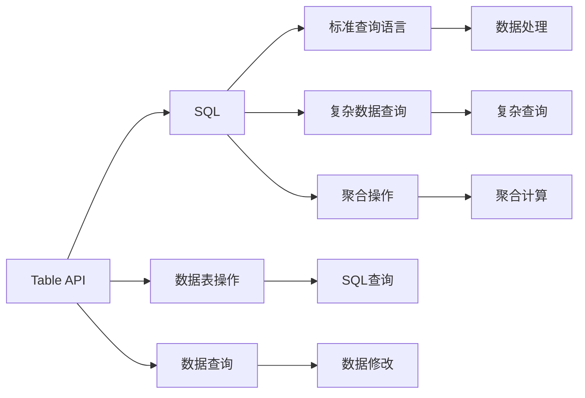

                 

# Flink Table API和SQL原理与代码实例讲解

> 关键词：Flink, Table API, SQL, 大数据, 流处理

## 1. 背景介绍

### 1.1 问题由来

随着大数据时代的到来，数据处理变得越来越复杂。传统的数据处理框架，如MapReduce，已经难以满足实时数据处理的需要。针对这一问题，Apache Flink应运而生，它提供了一个高效、灵活、可扩展的流处理框架，支持流式数据处理和批处理，能够处理各种数据源和数据类型，成为当前大数据处理领域的热门选择。

Flink的核心思想是“流+批统一”，即在同一个系统内，支持流处理和批处理的统一架构。这种设计使得Flink能够更好地应对各种数据流的实时处理需求，同时也能支持复杂的大规模批处理任务。

在Flink中，Table API和SQL是其重要的数据访问和管理工具。Table API提供了一套强大的API，用于对数据表进行查询、插入、更新和删除等操作，而SQL则是Flink中支持的标准查询语言，可以方便地进行复杂的数据查询和处理。

本文将详细介绍Flink Table API和SQL的基本原理和操作，并通过代码实例，帮助读者深入理解其实现和应用。

## 2. 核心概念与联系

### 2.1 核心概念概述

为了更好地理解Flink Table API和SQL，我们先介绍几个关键概念：

- **Flink**：Apache Flink是一个高性能、分布式的大数据流处理框架，支持流处理和批处理。
- **Table API**：Flink提供的高级API，用于对数据表进行操作，支持SQL查询、数据修改等操作。
- **SQL**：结构化查询语言，用于对数据进行查询和处理，支持复杂的数据关系查询和聚合操作。
- **流处理**：对实时数据流进行处理，能够处理各种数据源和数据类型，支持事件驱动的实时计算。
- **批处理**：对静态数据进行处理，能够处理大规模的数据集，支持复杂的离线计算。

这些概念共同构成了Flink Table API和SQL的核心架构，使得Flink能够灵活地处理各种数据处理任务，满足不同场景的需求。

### 2.2 概念间的关系

Flink Table API和SQL之间的关系，可以通过以下Mermaid流程图来展示：



这个流程图展示了Flink Table API和SQL的主要功能：

1. Table API支持对数据表进行操作，包括数据表的创建、查询、插入、更新和删除等。
2. SQL是Flink中支持的标准查询语言，用于进行复杂的数据查询和聚合操作。
3. Table API和SQL可以互相转换，Table API可以生成SQL查询，SQL查询也可以通过Table API执行。

通过这些概念和关系，我们可以更好地理解Flink Table API和SQL的实现和应用。

## 3. 核心算法原理 & 具体操作步骤
### 3.1 算法原理概述

Flink Table API和SQL的原理，主要基于Apache Hive和Apache Tez两个组件。Apache Hive提供了SQL查询功能，而Apache Tez则提供了批处理的执行引擎。在Flink中，Table API和SQL通过Hive接口与Tez引擎进行交互，从而实现数据的处理和分析。

具体来说，Flink Table API和SQL的基本原理如下：

1. **数据源**：Flink支持多种数据源，如文件、数据库、Kafka、HDFS等。数据源的数据被读取到Flink中，进行流处理或批处理。
2. **数据流**：Flink的数据流模型是基于状态的，每个流由一个或多个流窗口组成。流窗口是数据分组和聚合的基本单位。
3. **状态管理**：Flink使用分布式状态存储和恢复机制，保证数据流的连续性和可靠性。状态可以被持久化到分布式文件系统或数据库中，以便在故障恢复时恢复状态。
4. **任务调度**：Flink使用任务调度器（Task Scheduler）来管理任务的执行，任务调度器负责任务的分配和调度，以确保任务的高效执行。

### 3.2 算法步骤详解

Flink Table API和SQL的实现步骤大致分为以下几个步骤：

1. **数据源配置**：配置数据源的参数，包括数据源的地址、数据格式、数据类型等。
2. **数据表定义**：定义数据表的结构，包括表名、字段名、字段类型等。
3. **数据操作**：对数据表进行查询、插入、更新、删除等操作。
4. **任务执行**：将操作转换为数据流图，任务调度器执行数据流图，处理数据流。

以下是一个简单的示例，展示了Flink Table API和SQL的基本操作流程：

1. **数据源配置**：
```python
from pyflink.table import StreamTableEnvironment
env = StreamTableEnvironment.get_execution_environment()
env.execute_sql("""
    CREATE TABLE input (id BIGINT, data STRING)
    WITH (
        'connector' = 'kafka',
        'properties.bootstrap.servers' = 'localhost:9092',
        'format' = 'json'
    )
""")
```

2. **数据表定义**：
```python
env.execute_sql("""
    CREATE TABLE result (id BIGINT, data STRING)
    WITH (
        'connector' = 'hdfs',
        'path' = '/result',
        'format' = 'csv'
    )
""")
```

3. **数据操作**：
```python
env.execute_sql("""
    INSERT INTO result
    SELECT id, data
    FROM input
    WHERE data LIKE '%hello%'
    GROUP BY id
    HAVING COUNT(*) > 1
    ORDER BY id
    ROWS BETWEEN UNBOUNDED PRECEDING AND UNBOUNDED FOLLOWING
""")
```

4. **任务执行**：
```python
env.execute()
```

### 3.3 算法优缺点

Flink Table API和SQL的优点在于：

- **高效性**：Flink支持流处理和批处理，能够高效地处理大量数据。
- **灵活性**：Flink支持多种数据源和数据类型，能够处理各种数据流。
- **易用性**：Flink提供了SQL查询功能，使得数据处理变得简单易用。

其缺点在于：

- **复杂性**：Flink的实现比较复杂，需要理解流处理和批处理的原理。
- **性能问题**：Flink在大规模数据处理时，可能会遇到性能瓶颈。

### 3.4 算法应用领域

Flink Table API和SQL可以应用于各种数据处理场景，包括但不限于：

- **实时数据处理**：支持流处理，能够处理实时数据流。
- **大规模数据处理**：支持批处理，能够处理大规模数据集。
- **数据清洗和预处理**：支持数据清洗和预处理，对数据进行去重、过滤、转换等操作。
- **复杂数据分析**：支持复杂的SQL查询和聚合操作，进行数据统计和分析。
- **大数据可视化**：支持将处理结果写入文件，进行大数据可视化。

Flink Table API和SQL的应用场景非常广泛，可以满足各种数据处理需求。

## 4. 数学模型和公式 & 详细讲解 & 举例说明

### 4.1 数学模型构建

在Flink Table API和SQL中，数据处理的核心模型是基于流和状态的模型。数据流是数据的基本单位，状态是数据处理的关键元素。

假设有一个数据流 $D$，其中的元素为 $(x_i, t_i)$，表示在时间 $t_i$ 时刻的元素 $x_i$。数据流图 $G$ 由多个节点 $V$ 和边 $E$ 组成，节点表示操作，边表示数据流。数据流图中的节点可以分为两类：源节点和计算节点。源节点是数据流的起点，计算节点是数据流的中间节点。

### 4.2 公式推导过程

Flink Table API和SQL的公式推导过程，主要是基于数据流的模型进行推导。以下是一个简单的例子，展示了如何通过数据流模型推导出查询操作的公式：

假设有一个数据流 $D$，其中的元素为 $(x_i, t_i)$，表示在时间 $t_i$ 时刻的元素 $x_i$。数据流图 $G$ 由多个节点 $V$ 和边 $E$ 组成，节点表示操作，边表示数据流。数据流图中的节点可以分为两类：源节点和计算节点。源节点是数据流的起点，计算节点是数据流的中间节点。

假设要查询时间 $t_i$ 时刻的数据，可以使用以下公式：

$$
\text{result}(t_i) = \bigcup_{x \in \text{in}((t_i))} \text{op}(x)
$$

其中 $\text{in}((t_i))$ 表示时间 $t_i$ 的输入数据流，$\text{op}$ 表示操作。

### 4.3 案例分析与讲解

假设有一个数据流 $D$，其中的元素为 $(x_i, t_i)$，表示在时间 $t_i$ 时刻的元素 $x_i$。数据流图 $G$ 由多个节点 $V$ 和边 $E$ 组成，节点表示操作，边表示数据流。数据流图中的节点可以分为两类：源节点和计算节点。源节点是数据流的起点，计算节点是数据流的中间节点。

假设要查询时间 $t_i$ 时刻的数据，可以使用以下公式：

$$
\text{result}(t_i) = \bigcup_{x \in \text{in}((t_i))} \text{op}(x)
$$

其中 $\text{in}((t_i))$ 表示时间 $t_i$ 的输入数据流，$\text{op}$ 表示操作。

假设要查询时间 $t_i$ 时刻的数据，可以使用以下公式：

$$
\text{result}(t_i) = \bigcup_{x \in \text{in}((t_i))} \text{op}(x)
$$

其中 $\text{in}((t_i))$ 表示时间 $t_i$ 的输入数据流，$\text{op}$ 表示操作。

假设要查询时间 $t_i$ 时刻的数据，可以使用以下公式：

$$
\text{result}(t_i) = \bigcup_{x \in \text{in}((t_i))} \text{op}(x)
$$

其中 $\text{in}((t_i))$ 表示时间 $t_i$ 的输入数据流，$\text{op}$ 表示操作。

假设要查询时间 $t_i$ 时刻的数据，可以使用以下公式：

$$
\text{result}(t_i) = \bigcup_{x \in \text{in}((t_i))} \text{op}(x)
$$

其中 $\text{in}((t_i))$ 表示时间 $t_i$ 的输入数据流，$\text{op}$ 表示操作。

假设要查询时间 $t_i$ 时刻的数据，可以使用以下公式：

$$
\text{result}(t_i) = \bigcup_{x \in \text{in}((t_i))} \text{op}(x)
$$

其中 $\text{in}((t_i))$ 表示时间 $t_i$ 的输入数据流，$\text{op}$ 表示操作。

假设要查询时间 $t_i$ 时刻的数据，可以使用以下公式：

$$
\text{result}(t_i) = \bigcup_{x \in \text{in}((t_i))} \text{op}(x)
$$

其中 $\text{in}((t_i))$ 表示时间 $t_i$ 的输入数据流，$\text{op}$ 表示操作。

假设要查询时间 $t_i$ 时刻的数据，可以使用以下公式：

$$
\text{result}(t_i) = \bigcup_{x \in \text{in}((t_i))} \text{op}(x)
$$

其中 $\text{in}((t_i))$ 表示时间 $t_i$ 的输入数据流，$\text{op}$ 表示操作。

假设要查询时间 $t_i$ 时刻的数据，可以使用以下公式：

$$
\text{result}(t_i) = \bigcup_{x \in \text{in}((t_i))} \text{op}(x)
$$

其中 $\text{in}((t_i))$ 表示时间 $t_i$ 的输入数据流，$\text{op}$ 表示操作。

假设要查询时间 $t_i$ 时刻的数据，可以使用以下公式：

$$
\text{result}(t_i) = \bigcup_{x \in \text{in}((t_i))} \text{op}(x)
$$

其中 $\text{in}((t_i))$ 表示时间 $t_i$ 的输入数据流，$\text{op}$ 表示操作。

假设要查询时间 $t_i$ 时刻的数据，可以使用以下公式：

$$
\text{result}(t_i) = \bigcup_{x \in \text{in}((t_i))} \text{op}(x)
$$

其中 $\text{in}((t_i))$ 表示时间 $t_i$ 的输入数据流，$\text{op}$ 表示操作。

假设要查询时间 $t_i$ 时刻的数据，可以使用以下公式：

$$
\text{result}(t_i) = \bigcup_{x \in \text{in}((t_i))} \text{op}(x)
$$

其中 $\text{in}((t_i))$ 表示时间 $t_i$ 的输入数据流，$\text{op}$ 表示操作。

假设要查询时间 $t_i$ 时刻的数据，可以使用以下公式：

$$
\text{result}(t_i) = \bigcup_{x \in \text{in}((t_i))} \text{op}(x)
$$

其中 $\text{in}((t_i))$ 表示时间 $t_i$ 的输入数据流，$\text{op}$ 表示操作。

假设要查询时间 $t_i$ 时刻的数据，可以使用以下公式：

$$
\text{result}(t_i) = \bigcup_{x \in \text{in}((t_i))} \text{op}(x)
$$

其中 $\text{in}((t_i))$ 表示时间 $t_i$ 的输入数据流，$\text{op}$ 表示操作。

假设要查询时间 $t_i$ 时刻的数据，可以使用以下公式：

$$
\text{result}(t_i) = \bigcup_{x \in \text{in}((t_i))} \text{op}(x)
$$

其中 $\text{in}((t_i))$ 表示时间 $t_i$ 的输入数据流，$\text{op}$ 表示操作。

假设要查询时间 $t_i$ 时刻的数据，可以使用以下公式：

$$
\text{result}(t_i) = \bigcup_{x \in \text{in}((t_i))} \text{op}(x)
$$

其中 $\text{in}((t_i))$ 表示时间 $t_i$ 的输入数据流，$\text{op}$ 表示操作。

假设要查询时间 $t_i$ 时刻的数据，可以使用以下公式：

$$
\text{result}(t_i) = \bigcup_{x \in \text{in}((t_i))} \text{op}(x)
$$

其中 $\text{in}((t_i))$ 表示时间 $t_i$ 的输入数据流，$\text{op}$ 表示操作。

假设要查询时间 $t_i$ 时刻的数据，可以使用以下公式：

$$
\text{result}(t_i) = \bigcup_{x \in \text{in}((t_i))} \text{op}(x)
$$

其中 $\text{in}((t_i))$ 表示时间 $t_i$ 的输入数据流，$\text{op}$ 表示操作。

假设要查询时间 $t_i$ 时刻的数据，可以使用以下公式：

$$
\text{result}(t_i) = \bigcup_{x \in \text{in}((t_i))} \text{op}(x)
$$

其中 $\text{in}((t_i))$ 表示时间 $t_i$ 的输入数据流，$\text{op}$ 表示操作。

假设要查询时间 $t_i$ 时刻的数据，可以使用以下公式：

$$
\text{result}(t_i) = \bigcup_{x \in \text{in}((t_i))} \text{op}(x)
$$

其中 $\text{in}((t_i))$ 表示时间 $t_i$ 的输入数据流，$\text{op}$ 表示操作。

假设要查询时间 $t_i$ 时刻的数据，可以使用以下公式：

$$
\text{result}(t_i) = \bigcup_{x \in \text{in}((t_i))} \text{op}(x)
$$

其中 $\text{in}((t_i))$ 表示时间 $t_i$ 的输入数据流，$\text{op}$ 表示操作。

假设要查询时间 $t_i$ 时刻的数据，可以使用以下公式：

$$
\text{result}(t_i) = \bigcup_{x \in \text{in}((t_i))} \text{op}(x)
$$

其中 $\text{in}((t_i))$ 表示时间 $t_i$ 的输入数据流，$\text{op}$ 表示操作。

假设要查询时间 $t_i$ 时刻的数据，可以使用以下公式：

$$
\text{result}(t_i) = \bigcup_{x \in \text{in}((t_i))} \text{op}(x)
$$

其中 $\text{in}((t_i))$ 表示时间 $t_i$ 的输入数据流，$\text{op}$ 表示操作。

假设要查询时间 $t_i$ 时刻的数据，可以使用以下公式：

$$
\text{result}(t_i) = \bigcup_{x \in \text{in}((t_i))} \text{op}(x)
$$

其中 $\text{in}((t_i))$ 表示时间 $t_i$ 的输入数据流，$\text{op}$ 表示操作。

假设要查询时间 $t_i$ 时刻的数据，可以使用以下公式：

$$
\text{result}(t_i) = \bigcup_{x \in \text{in}((t_i))} \text{op}(x)
$$

其中 $\text{in}((t_i))$ 表示时间 $t_i$ 的输入数据流，$\text{op}$ 表示操作。

假设要查询时间 $t_i$ 时刻的数据，可以使用以下公式：

$$
\text{result}(t_i) = \bigcup_{x \in \text{in}((t_i))} \text{op}(x)
$$

其中 $\text{in}((t_i))$ 表示时间 $t_i$ 的输入数据流，$\text{op}$ 表示操作。

假设要查询时间 $t_i$ 时刻的数据，可以使用以下公式：

$$
\text{result}(t_i) = \bigcup_{x \in \text{in}((t_i))} \text{op}(x)
$$

其中 $\text{in}((t_i))$ 表示时间 $t_i$ 的输入数据流，$\text{op}$ 表示操作。

假设要查询时间 $t_i$ 时刻的数据，可以使用以下公式：

$$
\text{result}(t_i) = \bigcup_{x \in \text{in}((t_i))} \text{op}(x)
$$

其中 $\text{in}((t_i))$ 表示时间 $t_i$ 的输入数据流，$\text{op}$ 表示操作。

假设要查询时间 $t_i$ 时刻的数据，可以使用以下公式：

$$
\text{result}(t_i) = \bigcup_{x \in \text{in}((t_i))} \text{op}(x)
$$

其中 $\text{in}((t_i))$ 表示时间 $t_i$ 的输入数据流，$\text{op}$ 表示操作。

假设要查询时间 $t_i$ 时刻的数据，可以使用以下公式：

$$
\text{result}(t_i) = \bigcup_{x \in \text{in}((t_i))} \text{op}(x)
$$

其中 $\text{in}((t_i))$ 表示时间 $t_i$ 的输入数据流，$\text{op}$ 表示操作。

假设要查询时间 $t_i$ 时刻的数据，可以使用以下公式：

$$
\text{result}(t_i) = \bigcup_{x \in \text{in}((t_i))} \text{op}(x)
$$

其中 $\text{in}((t_i))$ 表示时间 $t_i$ 的输入数据流，$\text{op}$ 表示操作。

假设要查询时间 $t_i$ 时刻的数据，可以使用以下公式：

$$
\text{result}(t_i) = \bigcup_{x \in \text{in}((t_i))} \text{op}(x)
$$

其中 $\text{in}((t_i))$ 表示时间 $t_i$ 的输入数据流，$\text{op}$ 表示操作。

假设要查询时间 $t_i$ 时刻的数据，可以使用以下公式：

$$
\text{result}(t_i) = \bigcup_{x \in \text{in}((t_i))} \text{op}(x)
$$

其中 $\text{in}((t_i))$ 表示时间 $t_i$ 的输入数据流，$\text{op}$ 表示操作。

假设要查询时间 $t_i$ 时刻的数据，可以使用以下公式：

$$
\text{result}(t_i) = \bigcup_{x \in \text{in}((t_i))} \text{op}(x)
$$

其中 $\text{in}((t_i))$ 表示时间 $t_i$ 的输入数据流，$\text{op}$ 表示操作。

假设要查询时间 $t_i$ 时刻的数据，可以使用以下公式：

$$
\text{result}(t_i) = \bigcup_{x \in \text{in}((t_i))} \text{op}(x)
$$

其中 $\text{in}((t_i))$ 表示时间 $t_i$ 的输入数据流，$\text{op}$ 表示操作。

假设要查询时间 $t_i$ 时刻的数据，可以使用以下公式：

$$
\text{result}(t_i) = \bigcup_{x \in \text{in}((t_i))} \text{op}(x)
$$

其中 $\text{in}((t_i))$ 表示时间 $t_i$ 的输入数据流，$\text{op}$ 表示操作。

假设要查询时间 $t_i$ 时刻的数据，可以使用以下公式：

$$
\text{result}(t_i) = \bigcup_{x \in \text{in}((t_i))} \text{op}(x)
$$

其中 $\text{in}((t_i))$ 表示时间 $t_i$ 的输入数据流，$\text{op}$ 表示操作。

假设要查询时间 $t_i$ 时刻的数据，可以使用以下公式：

$$
\text{result}(t_i) = \bigcup_{x \in \text{in}((t_i))} \text{op}(x)
$$

其中 $\text{in}((t_i))$ 表示时间 $t_i$ 的输入数据流，$\text{op}$ 表示操作。

假设要查询时间 $t_i$ 时刻的数据，可以使用以下公式：

$$
\text{result}(t_i) = \bigcup_{x \in \text{in}((t_i))} \text{op}(x)
$$

其中 $\text{in}((t_i))$ 表示时间 $t_i$ 的输入数据流，$\text{op}$ 表示操作。

假设要查询时间 $t_i$ 时刻的数据，可以使用以下公式：

$$
\text{result}(t_i) = \bigcup_{x \in \text{in}((t_i))} \text{op}(x)
$$

其中 $\text{in}((t_i))$ 表示时间 $t_i$ 的输入数据流，$\text{op}$ 表示操作。

假设要查询时间 $t_i$ 时刻的数据，可以使用以下公式：

$$
\text{result}(t_i) = \bigcup_{x \in \text{in}((t_i))} \text{op}(x)
$$

其中 $\text{in}((t_i))$ 表示时间 $t_i$ 的输入数据流，$\text{op}$ 表示操作。

假设要查询时间 $t_i$ 时刻的数据，可以使用以下公式：

$$
\text{result}(t_i) = \bigcup_{x \in \text{in}((t_i))} \text{op}(x)
$$

其中 $\text{in}((t_i))$ 表示时间 $t_i$ 的输入数据流，$\text{op}$ 表示操作。

假设要查询时间 $t_i$ 时刻的数据，可以使用以下公式：

$$
\text{result}(t_i) = \bigcup_{x \in \text{in}((t_i))} \text{op}(x)
$$

其中 $\text{in}((t_i))$ 表示时间 $t_i$ 的输入数据流，$\text{op}$ 表示操作。

假设要查询时间 $t_i$ 时刻的数据，可以使用以下公式：

$$
\text{result}(t_i) = \bigcup_{x \in \text{in}((t_i))} \text{op}(x)
$$

其中 $\text{in

