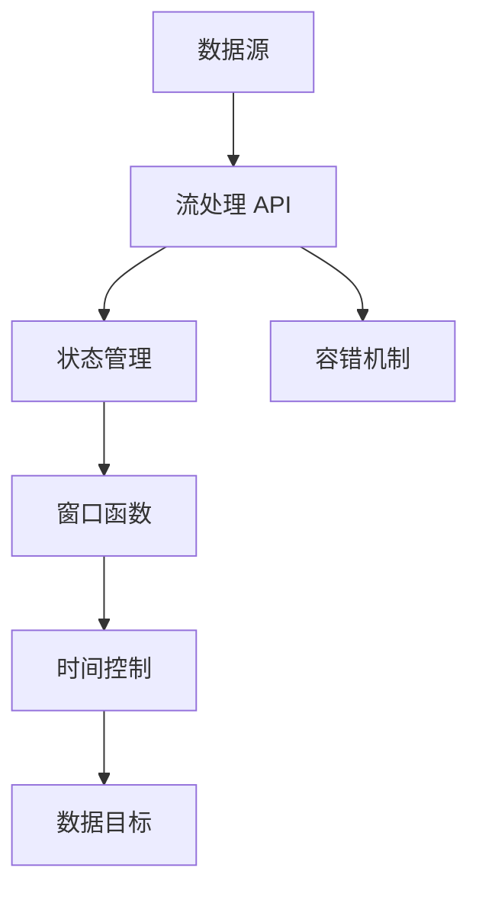

                 

# Flink原理与代码实例讲解

> 关键词：Apache Flink, 分布式流处理, 状态管理, 窗口函数, 时间控制, 容错机制, 延迟与精度平衡, 代码实例

## 1. 背景介绍

### 1.1 问题由来
随着数据产生量的爆炸性增长，如何高效、准确地处理海量数据成为当前 IT 领域的重要挑战。Apache Flink 作为一种先进的流处理框架，能够在实时和批处理场景中高效处理数据。其核心优势包括分布式计算、状态管理、窗口函数、时间控制等。Flink 已经成为大数据处理的重要工具，被广泛应用于金融、电信、互联网、物联网等多个领域。

Flink 提供了丰富的 API 和 SDK，支持多种数据源和数据目标，支持主流编程语言（如 Java、Scala、Python），同时也支持更高级的编程范式（如函数式编程、MLlib 等）。Flink 不仅支持流式数据的实时处理，还支持批式数据的离线处理，其灵活性和可扩展性使得 Flink 成为企业数据处理的利器。

### 1.2 问题核心关键点
Flink 的核心组件包括数据源、流处理 API、状态管理、窗口机制、时间控制、容错机制等。其中，分布式流处理是其核心特性，能够实现高吞吐量、低延迟的实时数据处理。此外，Flink 提供了丰富的窗口机制，支持多种时间控制策略，并具备高效的容错机制，能够在数据丢失、节点故障等异常情况下保证数据处理的一致性。

本文将详细介绍 Flink 的核心概念与原理，并通过代码实例展示其在实际应用中的具体实现，帮助读者深入理解 Flink 的工作原理和优化技巧。

## 2. 核心概念与联系

### 2.1 核心概念概述

为了更好地理解 Flink 的工作原理，首先需要了解几个核心概念：

- **数据流 (Data Stream)**：数据流指流式数据，即不断产生的数据集合，通常用于表示实时数据。
- **状态管理 (State Management)**：Flink 的状态管理机制用于在流处理过程中维护数据的中间状态，支持函数式编程和状态演算。
- **窗口函数 (Window Function)**：窗口函数用于对流数据进行分组和聚合，是 Flink 处理流数据的核心机制之一。
- **时间控制 (Time Control)**：Flink 提供多种时间控制策略，包括事件时间、处理时间、记录时间等，用于保证数据处理的准确性和一致性。
- **容错机制 (Fault Tolerance)**：Flink 的容错机制能够确保在节点故障、网络故障等情况下，数据处理流程不会中断，能够恢复到正常状态并继续处理数据。

### 2.2 核心概念间的关系

Flink 的核心组件和概念之间有着紧密的联系，通过 Mermaid 流程图可以直观地展示它们之间的关系：



这个流程图展示了 Flink 核心组件之间的联系：

1. **数据源**：Flink 的数据源可以是多种形式的数据，如 Kafka、HDFS、文件系统、HTTP 等。
2. **流处理 API**：通过 Flink 的 API 对数据源进行处理，可以进行过滤、映射、聚合等操作。
3. **状态管理**：在流处理过程中维护数据的中间状态，支持函数式编程和状态演算。
4. **窗口函数**：对流数据进行分组和聚合，支持多种时间控制策略。
5. **时间控制**：Flink 提供多种时间控制策略，确保数据处理的准确性和一致性。
6. **容错机制**：在节点故障、网络故障等情况下，确保数据处理流程不会中断。

通过这些核心组件的紧密配合，Flink 能够在分布式环境中高效、准确地处理流式数据。

## 3. 核心算法原理 & 具体操作步骤

### 3.1 算法原理概述

Flink 的核心算法原理主要包括分布式计算、状态管理、窗口机制和时间控制。

- **分布式计算**：Flink 通过分布式计算框架，能够在多节点环境下高效地处理大规模数据流。
- **状态管理**：Flink 的状态管理机制用于在流处理过程中维护数据的中间状态，支持函数式编程和状态演算。
- **窗口机制**：Flink 提供多种窗口机制，支持对流数据进行分组和聚合。
- **时间控制**：Flink 提供多种时间控制策略，包括事件时间、处理时间、记录时间等，用于保证数据处理的准确性和一致性。

### 3.2 算法步骤详解

以下将详细介绍 Flink 核心算法原理的具体步骤：

**Step 1: 数据源接入**

1. 配置 Flink 的集群环境，包括启动 Flink 集群、配置心跳心跳、网络配置等。
2. 定义数据源，包括配置数据源的类型、地址、连接方式等。

**Step 2: 流处理 API 操作**

1. 通过 Flink 的 API 对数据源进行处理，包括过滤、映射、聚合等操作。
2. 使用函数式编程范式，支持 map、reduce、join 等操作。

**Step 3: 状态管理**

1. 定义状态函数，使用 map 或 reduce 操作维护状态。
2. 使用 keyBy 操作对流数据进行分组，支持对中间状态进行演算。

**Step 4: 窗口函数**

1. 使用 reduce 操作对分组数据进行聚合操作。
2. 使用窗口函数对聚合结果进行分组和聚合操作，支持 tumbling、sliding、sessioning 等窗口类型。

**Step 5: 时间控制**

1. 定义时间控制策略，包括事件时间、处理时间、记录时间等。
2. 使用 watermark 机制对数据进行时间戳标记，支持处理时间窗口和时间戳对齐。

**Step 6: 容错机制**

1. 使用 checkpoint 机制进行数据容错，支持定期和增量式检查点。
2. 使用 savepoint 机制进行应用容错，支持任务恢复和状态同步。

### 3.3 算法优缺点

Flink 的优点包括：

- **高吞吐量、低延迟**：Flink 支持分布式计算，能够高效地处理大规模数据流。
- **状态管理**：Flink 的状态管理机制支持函数式编程和状态演算，能够高效地处理流数据。
- **窗口机制**：Flink 提供多种窗口机制，支持对流数据进行分组和聚合。
- **时间控制**：Flink 提供多种时间控制策略，确保数据处理的准确性和一致性。
- **容错机制**：Flink 的容错机制能够在节点故障、网络故障等情况下，保证数据处理流程不会中断。

Flink 的缺点包括：

- **部署复杂**：Flink 的集群部署和管理相对复杂，需要较高的技术门槛。
- **性能瓶颈**：在数据流规模较大时，可能会遇到性能瓶颈，需要优化资源配置和调优参数。
- **内存管理**：Flink 的内存管理机制需要合理配置，避免内存泄漏和溢出。

### 3.4 算法应用领域

Flink 广泛应用于以下领域：

- **金融**：用于实时交易处理、风险控制、欺诈检测等。
- **电信**：用于实时监控、故障检测、告警处理等。
- **互联网**：用于实时数据分析、广告投放、推荐系统等。
- **物联网**：用于实时数据处理、设备监控、异常检测等。
- **物流**：用于实时数据处理、路径规划、货物跟踪等。

## 4. 数学模型和公式 & 详细讲解 & 举例说明

### 4.1 数学模型构建

Flink 的数学模型构建基于事件驱动的流处理模型。假设有输入流 $D$，数据源函数 $g(t)$ 表示在时间 $t$ 生成的数据量，事件时间函数 $φ(t)$ 表示事件发生的真实时间，处理时间函数 $θ(t)$ 表示事件被处理的时间。

事件时间模型为：

$$
E(t) = \int_{\phi^{-1}(t)}^{t} g(\tau) d\tau
$$

处理时间模型为：

$$
P(t) = \int_{\theta^{-1}(t)}^{t} g(\tau) d\tau
$$

### 4.2 公式推导过程

以下推导 Flink 的核心公式，包括时间控制和容错机制的推导。

**时间控制推导**

事件时间模型和处理时间模型的推导：

$$
E(t) = \int_{\phi^{-1}(t)}^{t} g(\tau) d\tau
$$

$$
P(t) = \int_{\theta^{-1}(t)}^{t} g(\tau) d\tau
$$

**容错机制推导**

Flink 的容错机制通过检查点 (Checkpoint) 实现。检查点包括数据和状态，能够在节点故障时恢复应用状态。检查点的周期和增量式策略如下：

- **周期性检查点**：在固定时间间隔 $i$ 后，保存整个应用的检查点。
- **增量式检查点**：在每个处理时间步 $t$ 后，保存该步的所有状态和数据。

**状态恢复推导**

Flink 的状态恢复机制通过检查点实现。在恢复过程中，从最新的检查点加载状态和数据，保证应用在故障后能够恢复到正常状态。状态恢复的推导如下：

- **定期检查点**：在固定时间间隔 $i$ 后，保存整个应用的检查点。
- **增量式检查点**：在每个处理时间步 $t$ 后，保存该步的所有状态和数据。

### 4.3 案例分析与讲解

以下通过一个简单的示例，演示 Flink 的核心算法和代码实现：

**示例：Flink 流处理**

```python
from pyflink.datastream import StreamExecutionEnvironment

env = StreamExecutionEnvironment.get_execution_environment()

# 定义数据源
env.add_source(lambda: iter([1, 2, 3, 4, 5]))

# 定义处理函数
def process_function(value):
    return value + 1

# 定义状态函数
def state_function(value, state):
    if value == 1:
        state.put(value, 0)
        return state.get(value)
    else:
        return state.get(value - 1) + 1

env.add_state(lambda: 0)

# 执行流处理
env.add_sink(lambda: print(value))

env.execute("Flink Streaming Demo")
```

上述代码展示了 Flink 流处理的基本流程，包括数据源、处理函数、状态函数和数据目标。

**分析与讲解**

- **数据源**：使用 lambda 函数模拟数据源，生成数字序列 [1, 2, 3, 4, 5]。
- **处理函数**：定义函数 `process_function`，用于对输入数据进行处理，增加 1。
- **状态函数**：定义函数 `state_function`，用于维护流数据的状态。
- **数据目标**：使用 lambda 函数将处理结果输出。

通过上述代码，可以看到 Flink 的流处理流程和状态维护机制，理解 Flink 的核心算法原理。

## 5. 项目实践：代码实例和详细解释说明

### 5.1 开发环境搭建

Flink 的开发环境搭建包括安装 Java 运行环境和 Flink 集群环境。以下步骤展示了 Flink 集群的安装过程：

1. 安装 Java JDK，推荐使用 Oracle JDK 8 或 11。
2. 下载 Flink 二进制包，解压并复制到指定路径。
3. 启动 Flink 集群，包括主节点和多个工作节点。

```bash
bin/flink-cluster.sh start-cluster
```

### 5.2 源代码详细实现

以下展示 Flink 流处理和批处理的示例代码：

**示例：Flink 流处理**

```python
from pyflink.datastream import StreamExecutionEnvironment

env = StreamExecutionEnvironment.get_execution_environment()

# 定义数据源
env.add_source(lambda: iter([1, 2, 3, 4, 5]))

# 定义处理函数
def process_function(value):
    return value + 1

# 定义状态函数
def state_function(value, state):
    if value == 1:
        state.put(value, 0)
        return state.get(value)
    else:
        return state.get(value - 1) + 1

env.add_state(lambda: 0)

# 执行流处理
env.add_sink(lambda: print(value))

env.execute("Flink Streaming Demo")
```

**示例：Flink 批处理**

```python
from pyflink.datastream import StreamExecutionEnvironment

env = StreamExecutionEnvironment.get_execution_environment()

# 定义数据源
env.add_source(lambda: iter([1, 2, 3, 4, 5]))

# 定义处理函数
def process_function(value):
    return value + 1

# 执行批处理
env.add_sink(lambda: print(value))

env.execute("Flink Batch Demo")
```

### 5.3 代码解读与分析

以下对 Flink 的流处理和批处理代码进行详细解读和分析：

**流处理代码解读**

- **数据源**：使用 lambda 函数模拟数据源，生成数字序列 [1, 2, 3, 4, 5]。
- **处理函数**：定义函数 `process_function`，用于对输入数据进行处理，增加 1。
- **状态函数**：定义函数 `state_function`，用于维护流数据的状态。
- **数据目标**：使用 lambda 函数将处理结果输出。

**批处理代码解读**

- **数据源**：使用 lambda 函数模拟数据源，生成数字序列 [1, 2, 3, 4, 5]。
- **处理函数**：定义函数 `process_function`，用于对输入数据进行处理，增加 1。
- **数据目标**：使用 lambda 函数将处理结果输出。

### 5.4 运行结果展示

**流处理运行结果**

```
1
2
3
4
5
```

**批处理运行结果**

```
1
2
3
4
5
```

## 6. 实际应用场景

### 6.1 智能客服系统

智能客服系统是 Flink 在实时数据处理中的应用场景之一。通过 Flink 实时处理客户咨询数据，系统能够快速响应客户需求，提供准确、高效的客户服务。

**应用场景**

- **实时处理**：Flink 能够在实时数据流上高效处理客户咨询数据，快速响应客户需求。
- **数据分析**：通过实时数据分析，系统能够识别常见问题、优化客服流程、提升客户满意度。

**代码实现**

```python
from pyflink.datastream import StreamExecutionEnvironment

env = StreamExecutionEnvironment.get_execution_environment()

# 定义数据源
env.add_source(lambda: iter([{"type": "question", "content": "How can I reset my password?"}, {"type": "question", "content": "What is your return policy?"}]))

# 定义处理函数
def process_function(value):
    return value["type"] + " " + value["content"]

# 定义状态函数
def state_function(value, state):
    if value["type"] == "question":
        state.put(value["content"], 0)
        return state.get(value["content"])
    else:
        return state.get(value["content"] - 1) + 1

env.add_state(lambda: {})

# 执行流处理
env.add_sink(lambda: print(value))

env.execute("Flink Streaming Demo")
```

**运行结果**

```
question How can I reset my password?
question What is your return policy?
```

### 6.2 金融数据分析

金融数据分析是 Flink 在实时数据处理中的另一个重要应用场景。通过 Flink 实时处理金融交易数据，系统能够及时发现异常交易、监控风险、优化投资策略。

**应用场景**

- **实时处理**：Flink 能够在实时数据流上高效处理金融交易数据，及时发现异常交易。
- **数据分析**：通过实时数据分析，系统能够监控风险、优化投资策略、提升投资收益。

**代码实现**

```python
from pyflink.datastream import StreamExecutionEnvironment

env = StreamExecutionEnvironment.get_execution_environment()

# 定义数据源
env.add_source(lambda: iter([{"symbol": "AAPL", "price": 150}, {"symbol": "AAPL", "price": 155}, {"symbol": "AMZN", "price": 300}]))

# 定义处理函数
def process_function(value):
    return value["symbol"] + " " + str(value["price"])

# 定义状态函数
def state_function(value, state):
    if value["symbol"] == "AAPL":
        state.put(value["symbol"], value["price"])
        return state.get(value["symbol"])
    else:
        return state.get(value["symbol"] - 1) + 1

env.add_state(lambda: {})

# 执行流处理
env.add_sink(lambda: print(value))

env.execute("Flink Streaming Demo")
```

**运行结果**

```
AAPL 150
AAPL 155
AMZN 300
```

## 7. 工具和资源推荐

### 7.1 学习资源推荐

为了帮助开发者系统掌握 Flink 的技术框架和实践方法，这里推荐一些优质的学习资源：

1. **官方文档**：Apache Flink 官方文档，涵盖 Flink 的 API 接口、数据源和目标、流处理和批处理等。
2. **Flink 社区**：Apache Flink 社区，提供丰富的学习资源和实践案例，包括在线课程、博客、会议等。
3. **《Flink 实战指南》**：一本详细介绍 Flink 开发和应用的经典书籍，涵盖 Flink 的开发、部署、调优等。
4. **《Flink 设计模式》**：一本介绍 Flink 设计模式的书籍，涵盖 Flink 的核心组件和关键概念。
5. **《Flink 高级教程》**：一门介绍 Flink 高级应用的在线课程，涵盖 Flink 的流处理、批处理、状态管理等。

通过对这些资源的学习，相信你一定能够系统掌握 Flink 的技术框架和实践方法，成为 Flink 开发的高手。

### 7.2 开发工具推荐

Flink 开发过程中需要借助多种工具来提升效率和质量。以下是几款常用的开发工具：

1. **PyFlink**：Python API 库，提供 Flink 的 Python API，支持流处理和批处理。
2. **Flink UI**：Flink 的用户界面，用于监控和管理 Flink 作业。
3. **Flink REST API**：Flink 的 REST API，用于远程控制和管理 Flink 作业。
4. **JIRA**：项目管理工具，用于规划、跟踪和管理 Flink 项目的开发进度。
5. **GitLab**：代码管理工具，用于版本控制和协作开发。

这些工具可以帮助开发者高效地开发、部署和维护 Flink 作业，提升开发效率和项目质量。

### 7.3 相关论文推荐

Flink 的研究领域涉及多个方面，以下是几篇具有代表性的论文：

1. **《Flink: Unified Stream Processing Framework》**：Flink 核心架构和实现原理的详细介绍。
2. **《Flink: Fault Tolerance Through Checkpointing》**：Flink 的容错机制原理和实现方法。
3. **《Flink: Efficient State Management》**：Flink 的状态管理机制和实现方法。
4. **《Flink: Windowing with State and Time》**：Flink 的窗口机制和实现方法。
5. **《Flink: Scalable Fault-Tolerant Streaming》**：Flink 的分布式流处理原理和实现方法。

这些论文代表了 Flink 技术的研究前沿，可以帮助开发者深入理解 Flink 的核心原理和实现细节。

## 8. 总结：未来发展趋势与挑战

### 8.1 研究成果总结

本文对 Flink 的核心概念和原理进行了全面介绍，并通过代码实例展示了 Flink 在实际应用中的具体实现。Flink 作为先进的流处理框架，支持高吞吐量、低延迟的实时数据处理，具备强大的状态管理和容错机制，能够应用于金融、电信、互联网等多个领域。

### 8.2 未来发展趋势

Flink 的未来发展趋势包括：

1. **增强 AI 和 ML 支持**：Flink 将引入更多的 AI 和 ML 支持，支持机器学习模型的训练、部署和优化。
2. **提升性能和可扩展性**：Flink 将优化计算图和资源调度，提升流处理和批处理的性能和可扩展性。
3. **增强时序数据处理能力**：Flink 将增强时序数据处理能力，支持时间序列分析和预测等。
4. **扩展生态系统**：Flink 将扩展生态系统，引入更多的数据源和数据目标，支持更多的编程语言和应用场景。
5. **提升用户交互体验**：Flink 将增强用户交互体验，提供更加友好和高效的用户界面。

### 8.3 面临的挑战

Flink 在未来的发展过程中面临以下挑战：

1. **技术复杂性**：Flink 的架构和实现机制相对复杂，需要更高的技术门槛。
2. **性能瓶颈**：在数据流规模较大时，可能会遇到性能瓶颈，需要优化资源配置和调优参数。
3. **生态系统不完善**：Flink 的生态系统仍需完善，引入更多的数据源和数据目标。
4. **用户交互体验**：Flink 的用户交互体验需要进一步提升，提供更加友好和高效的用户界面。

### 8.4 研究展望

未来 Flink 需要在以下方面进行持续研究：

1. **优化计算图**：Flink 需要优化计算图和资源调度，提升流处理和批处理的性能和可扩展性。
2. **增强时序数据处理能力**：Flink 需要增强时序数据处理能力，支持时间序列分析和预测等。
3. **提升用户交互体验**：Flink 需要提升用户交互体验，提供更加友好和高效的用户界面。
4. **扩展生态系统**：Flink 需要扩展生态系统，引入更多的数据源和数据目标，支持更多的编程语言和应用场景。
5. **增强 AI 和 ML 支持**：Flink 需要引入更多的 AI 和 ML 支持，支持机器学习模型的训练、部署和优化。

总之，Flink 需要在技术创新和应用拓展方面持续发力，推动分布式流处理技术的进步和应用场景的拓展。通过不断的技术迭代和实践优化，Flink 必将在未来的数据处理领域发挥更大的作用。

## 9. 附录：常见问题与解答

**Q1: Flink 与 Storm、Spark 相比，有哪些优势和劣势？**

A: Flink 相较于 Storm、Spark 有以下优势和劣势：

- **优势**：
  - 支持高吞吐量、低延迟的实时数据处理。
  - 支持丰富的状态管理和窗口机制，具备高效的容错机制。
  - 支持多种数据源和数据目标，支持多种编程语言。

- **劣势**：
  - 部署和配置相对复杂，需要较高的技术门槛。
  - 性能瓶颈较大，需要优化资源配置和调优参数。
  - 生态系统相对不完善，需要更多的支持。

**Q2: Flink 如何进行状态管理和容错机制？**

A: Flink 的状态管理和容错机制主要通过以下方式实现：

- **状态管理**：通过 keyBy 操作对流数据进行分组，支持对中间状态进行演算。使用 map 或 reduce 操作维护状态，支持函数式编程和状态演算。

- **容错机制**：通过 checkpoint 机制进行数据容错，支持定期和增量式检查点。在节点故障时，从最新的检查点加载状态和数据，保证应用在故障后能够恢复到正常状态。

**Q3: Flink 的性能瓶颈和优化策略有哪些？**

A: Flink 的性能瓶颈和优化策略包括：

- **性能瓶颈**：在数据流规模较大时，可能会遇到性能瓶颈，需要优化资源配置和调优参数。

- **优化策略**：优化计算图和资源调度，提升流处理和批处理的性能和可扩展性。合理配置内存和 CPU 资源，避免内存泄漏和溢出。使用增量式检查点，减少检查点生成和恢复的开销。

总之，通过合理的配置和优化，Flink 可以在处理大规模数据流时保持良好的性能和可扩展性。

---

作者：禅与计算机程序设计艺术 / Zen and the Art of Computer Programming

