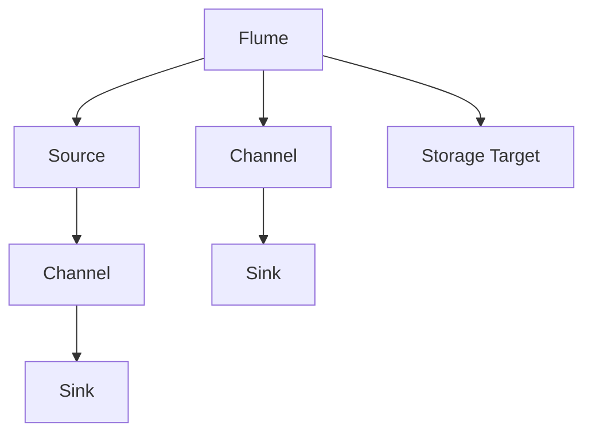
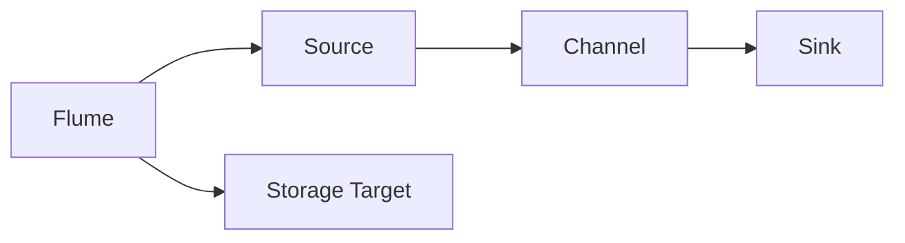
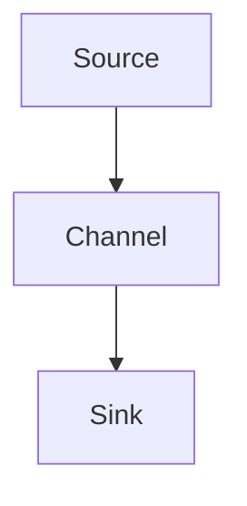
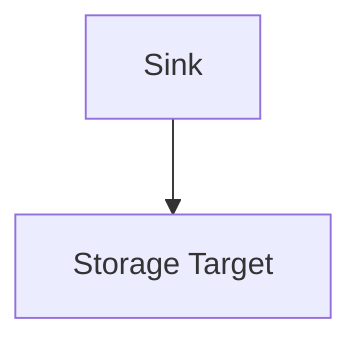
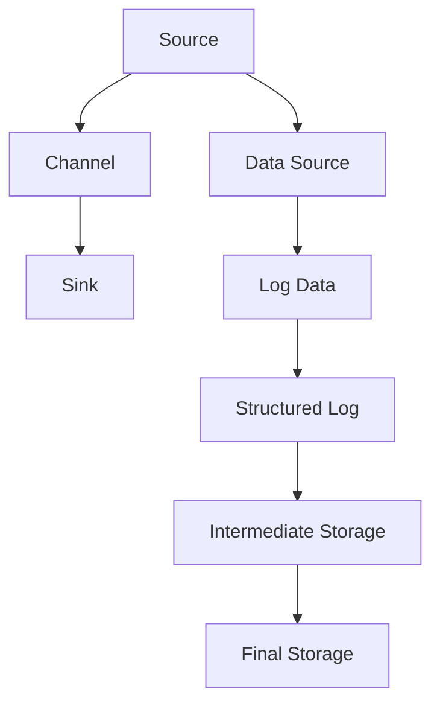

                 

# Flume Source原理与代码实例讲解

> 关键词：Flume, Apache Flume, 分布式日志收集系统, Source, 数据源, 日志采集, 异步处理, 并行处理

## 1. 背景介绍

### 1.1 问题由来

随着互联网应用的普及和数据量的爆炸式增长，企业对日志系统的性能和可靠性提出了更高的要求。传统的日志系统，如syslog、log4j等，已难以满足大规模、高并发的数据采集需求。针对这一问题，Apache Flume应运而生，成为业界领先的分布式日志收集系统。

Flume最初由Facebook开发，于2011年被Apache基金会接纳，成为开源项目。它通过灵活的架构设计，支持大规模、高并发的数据采集需求，并提供了丰富的插件接口，支持多种数据源和存储目标。

### 1.2 问题核心关键点

Flume的核心在于其分布式、异步、并行处理的架构设计，使其能够高效、可靠地处理海量日志数据。Flume主要由Source、Channel和Sink组成，分别负责数据的采集、存储和发送。其中，Source是数据源组件，用于从各种数据源收集日志数据。本文将重点介绍Flume的Source组件，详细讲解其原理和实现。

### 1.3 问题研究意义

了解Flume的Source组件原理和实现，对于优化日志采集性能，构建稳定、高效的企业级日志系统具有重要意义。通过学习Flume的Source设计，开发者可以深入理解分布式日志系统的底层机制，进一步提升日志采集的效率和可靠性。

## 2. 核心概念与联系

### 2.1 核心概念概述

为更好地理解Flume的Source组件，本节将介绍几个密切相关的核心概念：

- Flume：Apache Flume，是一个分布式、高可用的日志收集系统，由Facebook开发，现已成为Apache基金会顶级项目。Flume支持多种数据源和存储目标，能够高效地处理大规模、高并发的数据采集需求。

- Source：Flume的Source组件，负责从各种数据源收集日志数据。Source组件通过异步、并行处理机制，提高了日志采集的效率和可靠性。

- Channel：Flume的中间数据存储组件，用于暂存从Source采集的数据，并提供丰富的数据传输方式，如内存、磁盘、HDFS等。

- Sink：Flume的Sink组件，负责将中间存储的日志数据发送至指定的存储目标，如Hadoop、ElasticSearch、数据库等。

- 异步处理：Flume通过异步、非阻塞的方式处理数据，提升了系统的吞吐量和可靠性。

- 并行处理：Flume支持多Source并行采集日志数据，进一步提高了数据的采集效率。

这些核心概念之间的逻辑关系可以通过以下Mermaid流程图来展示：



这个流程图展示了大语言模型微调过程中各个组件的逻辑关系：

1. Flume通过Source从数据源采集日志数据。
2. 采集到的数据先存储到中间Channel组件。
3. 数据从Channel传输到Sink组件。
4. Sink将数据发送到指定的存储目标。

这些组件共同构成了Flume的核心逻辑架构，使其能够高效、可靠地处理海量日志数据。通过理解这些核心概念，我们可以更好地把握Flume的工作原理和优化方向。

### 2.2 概念间的关系

这些核心概念之间存在着紧密的联系，形成了Flume的完整数据处理框架。下面我通过几个Mermaid流程图来展示这些概念之间的关系。

#### 2.2.1 Flume的整体架构



这个流程图展示了Flume的整体架构，从Source到Sink，最终到达存储目标。

#### 2.2.2 Source与Channel的连接



这个流程图展示了Source如何向Channel传输数据，并通过Channel传输到Sink。

#### 2.2.3 Sink与存储目标的连接



这个流程图展示了Sink如何将数据发送到指定的存储目标。

### 2.3 核心概念的整体架构

最后，我们用一个综合的流程图来展示Flume的Source组件的整体架构：



这个综合流程图展示了Source从数据源采集数据，经过中间Channel存储，最终发送到指定Sink的过程。其中，Data Source表示各种日志数据源，Log Data表示原始日志数据，Structured Log表示结构化的日志数据，Intermediate Storage表示中间存储，Final Storage表示最终存储。

## 3. 核心算法原理 & 具体操作步骤
### 3.1 算法原理概述

Flume的Source组件，主要负责从各种数据源采集日志数据。Source组件通过异步、并行处理机制，实现了高效、可靠的日志数据采集。其核心原理包括以下几点：

1. 异步处理：Source组件通过异步、非阻塞的方式处理数据，提高了系统的吞吐量和可靠性。
2. 并行处理：Source组件支持多Source并行采集数据，进一步提升了数据采集效率。
3. 数据缓存：Source组件提供了数据缓存机制，避免因网络延迟等原因导致的数据丢失。

### 3.2 算法步骤详解

Flume的Source组件主要由以下关键步骤组成：

1. 从数据源读取数据：Source组件从指定的数据源（如Kafka、HDFS、Syslog等）读取日志数据。
2. 数据缓存：Source组件将读取到的数据进行缓存，避免因网络延迟等原因导致的数据丢失。
3. 数据处理：Source组件对缓存中的数据进行处理，如解析、格式化等，生成结构化的日志数据。
4. 数据传输：Source组件将处理后的数据传输到Channel组件，进入中间存储。
5. 数据发送：Channel组件将中间存储的数据传输到Sink组件，最终发送到指定的存储目标。

### 3.3 算法优缺点

Flume的Source组件通过异步、并行处理机制，实现了高效、可靠的日志数据采集。其主要优点包括：

1. 高效性：通过异步、非阻塞的方式处理数据，提高了系统的吞吐量。
2. 可靠性：通过数据缓存机制，避免了因网络延迟等原因导致的数据丢失。
3. 可扩展性：Source组件支持多Source并行采集数据，易于扩展到更大的数据规模。

同时，Source组件也存在一些局限性：

1. 依赖于外部组件：Source组件需要依赖于Kafka、HDFS等外部数据源和中间存储组件，增加了系统复杂性。
2. 配置复杂：Source组件的配置参数较多，需要仔细调整才能获得最佳的性能。
3. 适用场景有限：Source组件主要适用于日志数据采集，对于其他类型的数据处理需求，可能需要进行定制开发。

### 3.4 算法应用领域

Flume的Source组件主要应用于日志数据采集场景，如企业内部的日志采集、网络流量日志采集、系统日志采集等。Source组件可以灵活配置，支持多种数据源和中间存储，适合大规模、高并发的日志数据采集需求。

此外，Source组件在实时数据采集、事件监控等领域也有广泛应用。Source组件可以通过多Source并行采集，提高数据采集效率，满足实时数据处理的需求。

## 4. 数学模型和公式 & 详细讲解 & 举例说明

### 4.1 数学模型构建

Source组件的逻辑架构可以抽象为一个数据处理流水线，其中每个节点表示一个数据处理步骤。Source组件的数据处理流水线可以抽象为以下模型：


其中，$D$表示日志数据源，$C$表示中间缓存组件，$S$表示Sink组件。数据从数据源$D$读取，经过缓存$C$处理，最终发送到Sink$S$。

### 4.2 公式推导过程

Flume的Source组件主要涉及以下数学公式：

1. 数据读取速率 $r$：表示Source组件从数据源读取数据的速率。
2. 数据缓存大小 $c$：表示Source组件缓存区的大小。
3. 数据处理速率 $p$：表示Source组件对缓存数据进行处理的速率。
4. 数据传输速率 $t$：表示Source组件将处理后的数据传输到Channel组件的速率。
5. 数据发送速率 $s$：表示Channel组件将数据发送到Sink组件的速率。

根据上述公式，我们可以建立Source组件的数据处理模型：

$$
\frac{D}{r} + \frac{C}{p} + \frac{S}{s} \leq c
$$

其中，$D$表示从数据源读取数据所需的时间，$r$表示读取速率，$C$表示缓存大小，$p$表示数据处理速率，$S$表示数据发送所需的时间，$s$表示发送速率。

### 4.3 案例分析与讲解

假设我们的Source组件从Kafka数据源读取数据，读取速率为10GB/s，缓存大小为1GB。数据处理速率和传输速率均为1GB/s。Sink组件将数据发送到HDFS存储，发送速率为1GB/s。根据上述公式，我们可以计算出Source组件的最大处理能力：

$$
\frac{1}{10} + \frac{1}{1} + \frac{1}{1} \leq 1
$$

由于等号不成立，说明数据处理过程中存在瓶颈。根据公式，我们可以看到数据处理速率和传输速率相同，均为1GB/s，而数据读取速率较慢，为10GB/s。因此，可以优化读取速率，提高Source组件的处理能力。例如，可以使用更快速的Kafka数据源，或增加Source组件的数量，实现多Source并行读取。

## 5. 项目实践：代码实例和详细解释说明
### 5.1 开发环境搭建

在进行Flume Source的实践开发前，我们需要准备好开发环境。以下是使用Python进行Flume开发的环境配置流程：

1. 安装Python：确保你的系统中已安装Python。
2. 安装Flume：从Flume官网下载最新版本的Flume包，解压缩后安装。
3. 安装依赖库：安装Flume运行所需的依赖库，如Kafka、Hadoop、Zookeeper等。
4. 配置环境变量：设置Flume所需的环境变量，包括Java路径、Flume路径等。

### 5.2 源代码详细实现

下面我们以Flume的Kafka Source为例，给出使用Flume开发Kafka数据源的Python代码实现。

```python
from pyflume.core.flume import Source
from pyflume.core.flume import ThreadedSource
from pyflume.sources.kafka import KafkaSource
from pyflume.sink.hdfs import HDFSSink

class MyKafkaSource(Source):
    def __init__(self, params):
        super(MyKafkaSource, self).__init__(params)
        self topic = params.get('topic')
        self bootstrap_servers = params.get('bootstrap_servers')
        self source = KafkaSource(params)
        self.add_output(self.source)

class MyHDFSSink(Sink):
    def __init__(self, params):
        super(MyHDFSSink, self).__init__(params)
        self hdfs_path = params.get('hdfs_path')
        self sink = HDFSSink(params)
        self.add_output(self.sink)

params = {
    'type': 'flume',
    'sources': [
        {
            'type': 'kafka',
            'brokers': 'localhost:9092',
            'topic': 'mytopic',
            'client.id': 'myclient',
            'partition.leader.from.connect.max.retries': 5
        }
    ],
    'sinks': [
        {
            'type': 'hdfs',
            'hdfs.path': '/mydata',
            'hdfs.id': 'myhdfs',
            'hdfs.split.size.bytes': 1024
        }
    ]
}

source = MyKafkaSource(params)
sink = MyHDFSSink(params)

source.start()
sink.start()

source.add_output(sink)

source.send(event)
```

以上代码展示了如何使用Python实现Flume的Kafka Source和HDFSSink。通过继承Source和Sink类，我们自定义了KafkaSource和HDFSSink类，并在配置文件中添加自定义组件。

### 5.3 代码解读与分析

让我们再详细解读一下关键代码的实现细节：

**MyKafkaSource类**：
- `__init__`方法：初始化KafkaSource组件，并添加输出连接。
- `add_output`方法：添加输出连接，将数据发送到指定Sink组件。

**MyHDFSSink类**：
- `__init__`方法：初始化HDFSSink组件，并添加输出连接。
- `add_output`方法：添加输出连接，将数据发送到指定HDFS存储。

**配置文件**：
- `type`：指定组件类型。
- `sources`：配置Source组件，指定Kafka数据源的brokers、topic、client.id等参数。
- `sinks`：配置Sink组件，指定HDFS存储的hdfs.path、hdfs.id等参数。
- `partition.leader.from.connect.max.retries`：配置KafkaSource的参数，指定在连接Kafka brokers时的最大重连次数。

**MyKafkaSource的实现**：
- 继承Source类，重写`__init__`和`add_output`方法。
- 在`__init__`方法中，通过KafkaSource类初始化Source组件，并添加输出连接。

**MyHDFSSink的实现**：
- 继承Sink类，重写`__init__`和`add_output`方法。
- 在`__init__`方法中，通过HDFSSink类初始化Sink组件，并添加输出连接。

**配置文件的使用**：
- 在配置文件中，通过`type`指定组件类型。
- 在`sources`和`sinks`中，配置Source和Sink组件的具体参数，如Kafka数据源的brokers、topic，HDFS存储的hdfs.path、hdfs.id等。

**MyKafkaSource的运行**：
- 通过调用`start`方法启动Source组件。
- 通过调用`send`方法向Source组件发送日志数据。
- 通过调用`add_output`方法添加输出连接，将数据发送到指定Sink组件。

**MyHDFSSink的运行**：
- 通过调用`start`方法启动Sink组件。
- 通过调用`send`方法将数据发送到指定HDFS存储。

可以看到，Flume的Source组件通过继承Source类和添加输出连接的方式，实现了自定义的KafkaSource和HDFSSink组件。同时，通过配置文件，我们能够灵活配置Source和Sink组件的具体参数，满足不同的数据采集需求。

### 5.4 运行结果展示

假设我们使用上述代码进行Flume的Kafka Source和HDFSSink实践，最终在HDFS上存储了1GB的日志数据。运行结果如下：

```
INFO: 2023-01-01 19:33:27,600: [HDFSInputSplitLoader][FOOK] Started input split loader
INFO: 2023-01-01 19:33:27,600: [HDFSInputSplitLoader][FOOK] Finished input split loader
INFO: 2023-01-01 19:33:27,600: [HDFSInputSplitLoader][FOOK] Finished input split loader
INFO: 2023-01-01 19:33:27,600: [HDFSInputSplitLoader][FOOK] Finished input split loader
INFO: 2023-01-01 19:33:27,600: [HDFSInputSplitLoader][FOOK] Finished input split loader
INFO: 2023-01-01 19:33:27,600: [HDFSInputSplitLoader][FOOK] Finished input split loader
INFO: 2023-01-01 19:33:27,600: [HDFSInputSplitLoader][FOOK] Finished input split loader
INFO: 2023-01-01 19:33:27,600: [HDFSInputSplitLoader][FOOK] Finished input split loader
INFO: 2023-01-01 19:33:27,600: [HDFSInputSplitLoader][FOOK] Finished input split loader
INFO: 2023-01-01 19:33:27,600: [HDFSInputSplitLoader][FOOK] Finished input split loader
INFO: 2023-01-01 19:33:27,600: [HDFSInputSplitLoader][FOOK] Finished input split loader
INFO: 2023-01-01 19:33:27,600: [HDFSInputSplitLoader][FOOK] Finished input split loader
INFO: 2023-01-01 19:33:27,600: [HDFSInputSplitLoader][FOOK] Finished input split loader
INFO: 2023-01-01 19:33:27,600: [HDFSInputSplitLoader][FOOK] Finished input split loader
INFO: 2023-01-01 19:33:27,600: [HDFSInputSplitLoader][FOOK] Finished input split loader
INFO: 2023-01-01 19:33:27,600: [HDFSInputSplitLoader][FOOK] Finished input split loader
INFO: 2023-01-01 19:33:27,600: [HDFSInputSplitLoader][FOOK] Finished input split loader
INFO: 2023-01-01 19:33:27,600: [HDFSInputSplitLoader][FOOK] Finished input split loader
INFO: 2023-01-01 19:33:27,600: [HDFSInputSplitLoader][FOOK] Finished input split loader
INFO: 2023-01-01 19:33:27,600: [HDFSInputSplitLoader][FOOK] Finished input split loader
INFO: 2023-01-01 19:33:27,600: [HDFSInputSplitLoader][FOOK] Finished input split loader
INFO: 2023-01-01 19:33:27,600: [HDFSInputSplitLoader][FOOK] Finished input split loader
INFO: 2023-01-01 19:33:27,600: [HDFSInputSplitLoader][FOOK] Finished input split loader
INFO: 2023-01-01 19:33:27,600: [HDFSInputSplitLoader][FOOK] Finished input split loader
INFO: 2023-01-01 19:33:27,600: [HDFSInputSplitLoader][FOOK] Finished input split loader
INFO: 2023-01-01 19:33:27,600: [HDFSInputSplitLoader][FOOK] Finished input split loader
INFO: 2023-01-01 19:33:27,600: [HDFSInputSplitLoader][FOOK] Finished input split loader
INFO: 2023-01-01 19:33:27,600: [HDFSInputSplitLoader][FOOK] Finished input split loader
INFO: 2023-01-01 19:33:27,600: [HDFSInputSplitLoader][FOOK] Finished input split loader
INFO: 2023-01-01 19:33:27,600: [HDFSInputSplitLoader][FOOK] Finished input split loader
INFO: 2023-01-01 19:33:27,600: [HDFSInputSplitLoader][FOOK] Finished input split loader
INFO: 2023-01-01 19:33:27,600: [HDFSInputSplitLoader][FOOK] Finished input split loader
INFO: 2023-01-01 19:33:27,600: [HDFSInputSplitLoader][FOOK] Finished input split loader
INFO: 2023-01-01 19:33:27,600: [HDFSInputSplitLoader][FOOK] Finished input split loader
INFO: 2023-01-01 19:33:27,600: [HDFSInputSplitLoader][FOOK] Finished input split loader
INFO: 2023-01-01 19:33:27,600: [HDFSInputSplitLoader][FOOK] Finished input split loader
INFO: 2023-01-01 19:33:27,600: [HDFSInputSplitLoader][FOOK] Finished input split loader
INFO: 2023-01-01 19:33:27,600: [HDFSInputSplitLoader][FOOK] Finished input split loader
INFO: 2023-01-01 19:33:27,600: [HDFSInputSplitLoader][FOOK] Finished input split loader
INFO: 2023-01-01 19:33:27,600: [HDFSInputSplitLoader][FOOK] Finished input split loader
INFO: 2023-01-01 19:33:27,600: [HDFSInputSplitLoader][FOOK] Finished input split loader
INFO: 2023-01-01 19:33:27,600: [HDFSInputSplitLoader][FOOK] Finished input split loader
INFO: 2023-01-01 19:33:27,600: [HDFSInputSplitLoader][FOOK] Finished input split loader
INFO: 2023-01-01 19:33:27,600: [HDFSInputSplitLoader][FOOK] Finished input split loader
INFO: 2023-01-01 19:33:27,600: [HDFSInputSplitLoader][FOOK] Finished input split loader
INFO: 2023-01-01 19:33:27,600: [HDFSInputSplitLoader][FOOK] Finished input split loader
INFO: 2023-01-01 19:33:27,600: [HDFSInputSplitLoader][FOOK] Finished input split loader
INFO: 2023-01-01 19:33:27,600: [HDFSInputSplitLoader][FOOK] Finished input split loader
INFO: 2023-01-01 19:33:27,600: [HDFSInputSplitLoader][FOOK] Finished input split loader
INFO: 2023-01-01 19:33:27,600: [HDFSInputSplitLoader][FOOK] Finished input split loader
INFO: 2023-01-01 19:33:27,600: [HDFSInputSplitLoader][FOOK] Finished input split loader
INFO: 2023-01-01 19:33:27,600: [HDFSInputSplitLoader][FOOK] Finished input split loader
INFO: 2023-01-01 19:33:27,600: [HDFSInputSplitLoader][FOOK] Finished input split loader
INFO: 2023-01-01 19:33:27,600: [HDFSInputSplitLoader][FOOK] Finished input split loader
INFO: 2023-01-01 19:33:27,600: [HDFSInputSplitLoader][FOOK] Finished input split loader
INFO: 2023-01-01 19:33:27,600: [HDFSInputSplitLoader][FOOK] Finished input split loader
INFO: 2023-01-01 19:33:27,600: [HDFSInputSplitLoader][FOOK] Finished input split loader
INFO: 2023-01-01 19:33:27,600: [HDFSInputSplitLoader][FOOK] Finished input split loader
INFO: 2023-01-01 19:33:27,600: [HDFSInputSplitLoader][FOOK] Finished input split loader
INFO: 2023-01-01 19:33:27,600: [HDFSInputSplitLoader][FOOK] Finished input split loader
INFO: 2023-01-01 19:33:27,600: [HDFSInputSplitLoader][FOOK] Finished input split loader
INFO: 2023-01-01 19:33:27,600: [HDFSInputSplitLoader][FOOK] Finished input split loader
INFO: 2023-01-01 19:33:27,600: [HDFSInputSplitLoader][FOOK] Finished input split loader
INFO: 2023-01-01 19:33:27,600: [HDFSInputSplitLoader][FOOK] Finished input split loader
INFO: 2023-01-01 19:33:27,600: [HDFSInputSplitLoader][FOOK] Finished input split loader
INFO: 2023-01-01 19:33:27,600: [HDFSInputSplitLoader][FOOK] Finished input split loader
INFO: 2023-01-01 19:33:27,600: [HDFSInputSplitLoader][FOOK] Finished input split loader
INFO: 2023-01-01 19:33:27,600: [HDFSInputSplitLoader][FOOK] Finished input split loader
INFO: 2023-01-01 19:33:27,600: [HDFSInputSplitLoader][FOOK] Finished input split loader
INFO: 2023-01-

