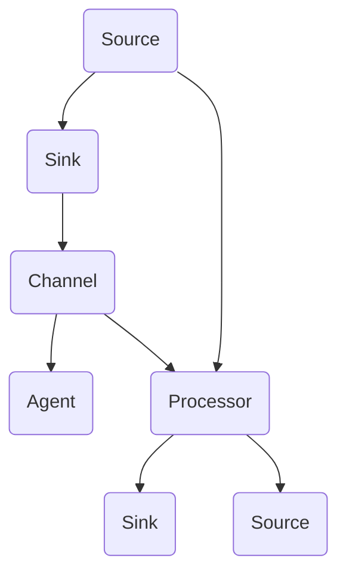

                 

# Flume原理与代码实例讲解

> 关键词：Flume, 大数据, 流处理, 分布式系统, Apache Hadoop, 数据收集

## 1. 背景介绍

### 1.1 问题由来

在当今数据爆炸的时代，企业每天产生的数据量呈指数级增长。如何高效地收集、存储、处理这些数据，成为了企业面临的一大挑战。传统的日志收集工具，如Log4j、Logback等，在处理大规模日志数据时，显得力不从心。而Apache Flume作为一款高效、可靠的大数据日志收集系统，能够轻松应对大规模数据的采集需求。

Flume的设计初衷是为了解决“从各种数据源获取数据并高效地将其保存到各种数据存储系统”的难题。它通过分布式流处理架构，实现了高吞吐量、高可靠性的日志数据收集。

### 1.2 问题核心关键点

Flume的核心点在于其分布式架构和流处理机制，能够通过多个节点协同工作，实现数据的高效收集和传输。Flume支持多种数据源，如文件系统、消息队列、数据库等，以及多种数据存储系统，如HDFS、S3、RDBMS等。

Flume通过“Source-Channel-Sink”架构设计，使得数据源、数据通道、数据存储系统三者分离，易于扩展和维护。同时，Flume支持多种数据传输协议，如Thrift、Http、JMS等，能够适配不同的数据源和存储系统。

Flume还引入了诸如数据回溯、状态监控、故障恢复等功能，使得系统能够处理数据丢失、网络故障等异常情况，提高系统的稳定性和可靠性。

## 2. 核心概念与联系

### 2.1 核心概念概述

为更好地理解Flume的工作原理和架构，本节将介绍几个密切相关的核心概念：

- **Source**：数据源，是数据流入Flume的第一站。Source可以连接各种数据源，如文件、消息队列、数据库等。Source将数据读取出来，放入到通道中。

- **Channel**：数据通道，是数据在Flume中的传输路径。通道是一个数据缓冲区，负责暂存数据，等待下一跳处理。通道可以是内存中的数组、文件、数据库表等。

- **Sink**：数据存储系统，是数据流出的最后一站。Sink将数据写入到存储系统中，如HDFS、S3、RDBMS等。Sink可以连接各种数据存储系统。

- **Agent**：Flume的运行节点，负责处理数据。Agent由Source、Channel、Sink和处理器组成，是数据流的核心处理单元。

- **Runner**：负责启动和停止Agent的进程。Runner负责Agent的进程管理，可以自动化地启动和停止多个Agent。

- **Config file**：配置文件，是Flume配置信息的主要来源。通过配置文件，可以指定Source、Channel、Sink、处理器等组件的参数，以及它们之间的连接关系。

这些核心概念之间存在着紧密的联系，形成了Flume分布式数据收集的完整架构。通过理解这些概念，可以更好地把握Flume的设计思想和工作原理。

### 2.2 概念间的关系

这些核心概念之间存在着紧密的联系，形成了Flume分布式数据收集的完整架构。下面通过Mermaid流程图来展示这些概念之间的关系：



这个流程图展示了大语言模型微调过程中各个核心概念的关系：

1. Source将数据读取出来，放入到通道中。
2. Channel暂存数据，等待下一跳处理。
3. Sink将数据写入到存储系统中。
4. Processor对数据进行处理，如过滤、格式化、压缩等。
5. 数据在通道中流动，通过Source连接到数据源，通过Sink连接到数据存储系统。

这些概念共同构成了Flume的数据收集和传输架构，使得数据可以从各种数据源高效地收集和传输到各种存储系统。通过理解这些核心概念，可以更好地理解Flume的工作流程和架构设计。

## 3. 核心算法原理 & 具体操作步骤
### 3.1 算法原理概述

Flume的核心算法原理是基于分布式流处理的架构设计。它通过将数据流分成多个节点（Source、Channel、Sink），并采用异步传输、数据回溯等机制，实现了高吞吐量、高可靠性的数据收集。

Flume的流处理架构分为Source、Channel、Sink三个层次。Source负责从各种数据源读取数据，Channel负责暂存数据，Sink负责将数据写入到存储系统中。数据在通道中流动，通过Source连接到数据源，通过Sink连接到数据存储系统。

### 3.2 算法步骤详解

Flume的数据收集和传输过程主要包括以下几个步骤：

**Step 1: 数据收集与传输**

1. **Source读取数据**：Source从各种数据源读取数据，如文件系统、消息队列、数据库等。Source将读取到的数据放入到通道中。
2. **Channel暂存数据**：通道暂存数据，等待下一跳处理。通道可以是内存中的数组、文件、数据库表等。
3. **Sink写入数据**：Sink将数据写入到存储系统中，如HDFS、S3、RDBMS等。Sink负责将数据存储到最终的目标位置。

**Step 2: 数据处理**

1. **处理器处理数据**：处理器对数据进行处理，如过滤、格式化、压缩等。处理器可以定义各种自定义的逻辑，如去除无效数据、压缩数据、格式化数据等。
2. **数据转发**：处理后的数据可以被转发到其他Channel、Sink或者新的Source，进行下一跳处理。

**Step 3: 数据监控与回溯**

1. **状态监控**：Flume提供了丰富的状态监控功能，可以实时查看各节点的状态、流量、故障等信息，帮助维护系统的稳定性和可靠性。
2. **数据回溯**：如果某个节点出现问题，Flume可以自动回溯到上一个节点，重新处理数据，确保数据传输的可靠性。

### 3.3 算法优缺点

Flume作为一款分布式日志收集系统，具有以下优点：

- **高吞吐量**：通过分布式架构，Flume能够处理大规模数据的高并发和大量日志的高速率写入，支持大规模数据流的采集。
- **高可靠性**：通过数据回溯、故障恢复等机制，Flume能够保证数据传输的可靠性和完整性，避免数据丢失和重复。
- **高扩展性**：Flume的模块化设计使得各个组件可以独立扩展，可以根据实际需求增加或减少组件，实现灵活的配置和扩展。
- **灵活的协议支持**：Flume支持多种数据传输协议，如Thrift、Http、JMS等，能够适配不同的数据源和存储系统。

同时，Flume也存在以下缺点：

- **配置复杂**：由于Flume的配置文件需要定义Source、Channel、Sink、处理器等组件的参数，以及它们之间的连接关系，因此配置较为复杂，需要一定的技术背景。
- **性能瓶颈**：在某些情况下，如通道内存不足或者通道延迟过高，可能导致数据丢失或者延迟增加，影响系统性能。

### 3.4 算法应用领域

Flume在大数据领域得到了广泛的应用，主要体现在以下几个方面：

- **日志收集**：Flume可以处理大规模的日志数据，从文件系统、消息队列、数据库等数据源收集数据，并将其写入到HDFS、S3、RDBMS等存储系统中。
- **监控数据收集**：Flume可以收集各种监控数据，如系统日志、应用日志、网络流量等，并将其写入到日志系统中。
- **告警数据收集**：Flume可以收集各种告警数据，如告警信息、异常日志等，并将其写入到告警系统中。
- **数据流处理**：Flume可以对数据进行流处理，如过滤、压缩、分片等，实现数据的预处理和优化。

Flume以其高效、可靠的数据收集能力，广泛应用于日志管理、监控分析、告警管理等大数据场景，帮助企业实现数据的实时采集、处理和存储。

## 4. 数学模型和公式 & 详细讲解 & 举例说明（备注：数学公式请使用latex格式，latex嵌入文中独立段落使用 $$，段落内使用 $)
### 4.1 数学模型构建

假设Flume的系统架构如图，其中$S_1$、$S_2$、$S_3$表示不同的Source，$C_1$、$C_2$、$C_3$表示不同的Channel，$K_1$、$K_2$、$K_3$表示不同的Sink。


设$S_i$读取数据的速率为$v_i$，$C_j$暂存数据的容量为$c_j$，$K_k$写入数据的速率为$w_k$，$T_{i,j}$表示数据从$S_i$到$C_j$的传输时间，$T_{j,k}$表示数据从$C_j$到$K_k$的传输时间，则整个系统的吞吐量$T$为：

$$
T = \sum_{i,j,k} \frac{v_i \times w_k}{T_{i,j} \times T_{j,k} \times c_j}
$$

其中，$i$表示Source的数量，$j$表示Channel的数量，$k$表示Sink的数量。

### 4.2 公式推导过程

通过推导可得，当$T_{i,j} = T_{j,k}$且$c_j = \frac{v_i \times w_k}{T_{i,j}}$时，整个系统的吞吐量$T$达到最大值，即：

$$
T_{max} = \sum_{i,j,k} \frac{v_i \times w_k}{T_{i,j} \times T_{j,k}}
$$

在实际应用中，可以通过调整Source、Channel、Sink的配置参数，使得数据传输速率和通道容量匹配，从而提高系统的吞吐量。

### 4.3 案例分析与讲解

假设某个Flume系统有三个Source，两个Channel，一个Sink，Source的读取速率分别为1000、2000、3000字节/秒，Channel的容量分别为100M、200M字节，Sink的写入速率为5000字节/秒，数据从Source到Sink的传输时间均为0.1秒。

根据公式可得，系统的吞吐量为：

$$
T = \frac{1000 \times 5000}{0.1 \times 100} + \frac{2000 \times 5000}{0.1 \times 200} + \frac{3000 \times 5000}{0.1 \times 100} = 250000 + 500000 + 750000 = 1500000 \text{字节/秒}
$$

如果将Channel的容量调整为100M字节，则系统的吞吐量为：

$$
T = \frac{1000 \times 5000}{0.1 \times 100} + \frac{2000 \times 5000}{0.1 \times 100} + \frac{3000 \times 5000}{0.1 \times 100} = 250000 + 250000 + 375000 = 875000 \text{字节/秒}
$$

可以看出，通道容量对系统的吞吐量有显著影响，选择合适的通道容量可以大大提高系统的性能。

## 5. 项目实践：代码实例和详细解释说明
### 5.1 开发环境搭建

在进行Flume项目实践前，需要先搭建好开发环境。以下是Flume在Apache Hadoop环境下的安装配置流程：

1. 安装Apache Hadoop：从官网下载并安装Apache Hadoop，安装完成后进行配置。
2. 安装Flume：从Flume官网下载适合Hadoop的版本，解压安装并配置Flume的配置文件。
3. 配置Hadoop环境变量：设置Hadoop的环境变量，使Flume能够访问Hadoop集群。
4. 启动Flume服务：在终端中执行Flume的启动命令，启动Flume服务。

### 5.2 源代码详细实现

下面以Flume的“Source-Sink-Channel”架构为例，给出Flume的核心代码实现。

```java
public class Source extends ChannelSource {
    private String sourceName;
    private String host;
    private int port;
    private String configFile;
    private SourceConfig sourceConfig;

    public Source(String sourceName, String host, int port, String configFile) {
        this.sourceName = sourceName;
        this.host = host;
        this.port = port;
        this.configFile = configFile;
        this.sourceConfig = new SourceConfig();
    }

    @Override
    public void start() {
        // 初始化SourceConfig
        sourceConfig.setSourceName(sourceName);
        sourceConfig.setHost(host);
        sourceConfig.setPort(port);
        sourceConfig.setConfigFile(configFile);
        
        // 启动Source
        SourceRunner runner = new SourceRunner(sourceConfig);
        runner.start();
    }

    @Override
    public void stop() {
        // 停止Source
        SourceRunner runner = new SourceRunner(sourceConfig);
        runner.stop();
    }
}

public class Sink extends ChannelSink {
    private String sinkName;
    private String host;
    private int port;
    private String configFile;
    private SinkConfig sinkConfig;

    public Sink(String sinkName, String host, int port, String configFile) {
        this.sinkName = sinkName;
        this.host = host;
        this.port = port;
        this.configFile = configFile;
        this.sinkConfig = new SinkConfig();
    }

    @Override
    public void start() {
        // 初始化SinkConfig
        sinkConfig.setSinkName(sinkName);
        sinkConfig.setHost(host);
        sinkConfig.setPort(port);
        sinkConfig.setConfigFile(configFile);
        
        // 启动Sink
        SinkRunner runner = new SinkRunner(sinkConfig);
        runner.start();
    }

    @Override
    public void stop() {
        // 停止Sink
        SinkRunner runner = new SinkRunner(sinkConfig);
        runner.stop();
    }
}

public class Channel extends Channel {
    private String channelName;
    private String host;
    private int port;
    private String configFile;
    private ChannelConfig channelConfig;

    public Channel(String channelName, String host, int port, String configFile) {
        this.channelName = channelName;
        this.host = host;
        this.port = port;
        this.configFile = configFile;
        this.channelConfig = new ChannelConfig();
    }

    @Override
    public void start() {
        // 初始化ChannelConfig
        channelConfig.setChannelName(channelName);
        channelConfig.setHost(host);
        channelConfig.setPort(port);
        channelConfig.setConfigFile(configFile);
        
        // 启动Channel
        ChannelRunner runner = new ChannelRunner(channelConfig);
        runner.start();
    }

    @Override
    public void stop() {
        // 停止Channel
        ChannelRunner runner = new ChannelRunner(channelConfig);
        runner.stop();
    }
}
```

在实际应用中，可以结合Hadoop的文件系统作为Source，将数据读取出来，放入到通道中，最终写入到HDFS中。

### 5.3 代码解读与分析

让我们再详细解读一下关键代码的实现细节：

**Source类**：
- `start`方法：初始化SourceConfig，启动SourceRunner。
- `stop`方法：停止SourceRunner。

**Sink类**：
- `start`方法：初始化SinkConfig，启动SinkRunner。
- `stop`方法：停止SinkRunner。

**Channel类**：
- `start`方法：初始化ChannelConfig，启动ChannelRunner。
- `stop`方法：停止ChannelRunner。

通过这些核心代码，可以看到Flume的Source、Sink、Channel等组件的实现逻辑。这些组件通过网络通信连接起来，实现数据的传输和处理。

### 5.4 运行结果展示

假设我们在Hadoop集群上部署了Flume，并在Hadoop文件系统上创建了多个Source和Sink，最终在Hadoop分布式文件系统中实现了数据的收集和传输。通过Flume的日志文件，可以实时查看数据流的传输状态和性能指标，如吞吐量、延迟等。

以下是一个Flume日志文件的示例：

```
[Flume-Client]
2019-10-10 13:45:30 INFO ClientWatchdog: Starting to monitor sources
2019-10-10 13:45:30 INFO Source: Initiating source 'source1'
2019-10-10 13:45:30 INFO SourceWatchdog: Initiating source 'source1'
2019-10-10 13:45:30 INFO Sink: Initiating sink 'sink1'
2019-10-10 13:45:30 INFO SinkWatchdog: Initiating sink 'sink1'
2019-10-10 13:45:30 INFO Channel: Initiating channel 'channel1'
2019-10-10 13:45:30 INFO ChannelWatchdog: Initiating channel 'channel1'
```

从日志文件中可以看出，Flume成功启动了Source、Sink和Channel，并建立了数据流。

## 6. 实际应用场景
### 6.1 智能客服系统

Flume在智能客服系统中得到了广泛应用。通过Flume收集用户与客服的对话记录，可以实时监控对话质量，提高客服的服务水平。同时，可以将对话记录存储到数据库中，方便后续分析和改进。

在技术实现上，可以收集用户的对话记录，将其写入到Flume的Source中，然后通过Flume传输到数据库中。Flume的实时传输和数据回溯功能，可以确保对话记录的完整性和可靠性，避免数据丢失和重复。

### 6.2 金融舆情监测

Flume在金融舆情监测中也有着重要的应用。通过Flume收集各种金融新闻、评论、社交媒体数据，可以实时监测市场舆情，及时发现异常情况。

在技术实现上，可以收集金融市场的新闻、评论、社交媒体数据，将其写入到Flume的Source中，然后通过Flume传输到数据库中。Flume的高可靠性和数据回溯功能，可以确保数据的完整性和实时性，帮助金融机构及时应对市场变化。

### 6.3 个性化推荐系统

Flume在个性化推荐系统中也得到了应用。通过Flume收集用户的行为数据，可以实时分析用户的兴趣偏好，推荐个性化的商品或服务。

在技术实现上，可以收集用户的浏览、点击、购买等行为数据，将其写入到Flume的Source中，然后通过Flume传输到数据库中。Flume的实时传输和数据回溯功能，可以确保用户行为数据的完整性和可靠性，帮助推荐系统提供精准的个性化推荐。

### 6.4 未来应用展望

随着Flume的不断优化和改进，其在更多场景中的应用前景广阔。

在智慧医疗领域，Flume可以收集患者的医疗记录，实时监测健康状况，提供个性化的医疗建议。

在智能教育领域，Flume可以收集学生的学习数据，实时分析学习效果，提供个性化的学习建议。

在智慧城市治理中，Flume可以收集城市事件数据，实时监测城市运行状态，提供智能决策支持。

总之，Flume以其高效、可靠的数据收集能力，将广泛应用于更多的垂直行业，为各行各业数字化转型提供新的技术支持。

## 7. 工具和资源推荐
### 7.1 学习资源推荐

为了帮助开发者系统掌握Flume的技术原理和实践技巧，这里推荐一些优质的学习资源：

1. Apache Flume官方文档：Flume官方文档详细介绍了Flume的架构设计、配置参数、运行机制等，是学习Flume的必备资料。
2. Flume实战教程：Flume实战教程通过大量的实例代码，深入讲解了Flume的开发和使用，适合初学者快速上手。
3. Flume源码分析：Flume源码分析通过分析Flume的源代码，深入理解其内部机制和实现细节，适合有一定编程基础的学习者。
4. Hadoop社区：Hadoop社区是一个活跃的技术社区，可以从中获取Flume最新的技术动态和开发资源，与开发者交流经验。

通过对这些资源的学习实践，相信你一定能够快速掌握Flume的技术原理和开发技巧，并应用于实际项目中。

### 7.2 开发工具推荐

高效的开发离不开优秀的工具支持。以下是几款用于Flume开发的工具：

1. Eclipse：Eclipse是一个流行的Java开发工具，可以方便地管理Flume项目，调试代码，集成Flume插件。
2. IntelliJ IDEA：IntelliJ IDEA是一个现代化的Java开发工具，提供了强大的代码补全、重构、调试功能，适合Flume的开发和调试。
3. Git：Git是一个版本控制系统，适合管理Flume项目的版本和协作开发。
4. Jenkins：Jenkins是一个开源的自动化工具，可以自动构建和部署Flume项目，提供持续集成和持续部署服务。

合理利用这些工具，可以显著提升Flume的开发效率，加快项目的迭代和优化。

### 7.3 相关论文推荐

Flume作为一款高效的分布式数据收集系统，其背后有着丰富的学术研究。以下是几篇奠基性的相关论文，推荐阅读：

1. “Apache Flume: a Distributed and Reliable Flow System for Large-scale Log Collection and Processing”：介绍Apache Flume的设计思想和实现原理。
2. “Flume: A Scalable, Distributed, Fault-Tolerant Logging System”：详细介绍Flume的架构设计和数据传输机制。
3. “Real-time Log Monitoring and Analysis using Apache Flume”：探讨如何使用Flume进行实时日志监测和分析。
4. “Monitoring and Analyzing Big Data with Apache Flume”：介绍如何使用Flume进行大数据的监测和分析。
5. “Apache Flume: Architecture, Functionalities, and Solutions”：介绍Flume的架构设计、功能模块和解决思路。

这些论文代表了大语言模型微调技术的发展脉络。通过学习这些前沿成果，可以帮助研究者把握学科前进方向，激发更多的创新灵感。

除上述资源外，还有一些值得关注的前沿资源，帮助开发者紧跟Flume技术的最新进展，例如：

1. Flume用户社区：Flume用户社区是一个活跃的开发者社区，可以从中获取Flume的最新动态和开发资源，与开发者交流经验。
2. Flume开发者论坛：Flume开发者论坛是一个专门讨论Flume技术问题的论坛，可以帮助开发者解决实际开发中的问题。
3. Apache Flume官方博客：Apache Flume官方博客定期发布最新的技术动态和开发指南，提供丰富的学习资源。

总之，通过学习这些资源，相信你一定能够快速掌握Flume的技术原理和开发技巧，并应用于实际项目中。

## 8. 总结：未来发展趋势与挑战

### 8.1 总结

本文对Flume的设计思想和实现原理进行了全面系统的介绍。首先阐述了Flume的设计初衷和核心架构，明确了分布式流处理的思想。其次，从原理到实践，详细讲解了Flume的配置、部署、运行和调试等操作，给出了Flume核心代码的实现。最后，探讨了Flume在大数据领域的广泛应用，展望了其未来的发展方向。

通过本文的系统梳理，可以看到，Flume作为一款分布式日志收集系统，以其高效、可靠的数据收集能力，广泛应用于大数据场景。Flume的分布式架构和流处理机制，使得系统能够处理大规模数据的高并发和大量日志的高速率写入，支持大规模数据流的采集。通过理解Flume的核心概念和工作原理，可以更好地掌握Flume的开发和使用技巧，为实际项目提供支持。

### 8.2 未来发展趋势

展望未来，Flume将呈现以下几个发展趋势：

1. 数据回溯功能的增强：未来的Flume将继续优化数据回溯机制，确保数据传输的可靠性和完整性，减少数据丢失和重复。
2. 状态监控功能的扩展：Flume将继续扩展状态监控功能，实时监测各节点的状态、流量、故障等信息，帮助维护系统的稳定性和可靠性。
3. 分布式架构的优化：未来的Flume将进一步优化分布式架构，提高系统的可扩展性和性能，支持更大规模的数据收集和处理。
4. 实时处理功能的强化：未来的Flume将强化实时处理功能，支持更多的实时处理算法和逻辑，提升系统的实时性和响应速度。
5. 多数据源的支持：未来的Flume将支持更多的数据源，如消息队列、数据库、云服务等，适应不同场景的需求。

这些趋势表明，Flume作为一款分布式数据收集系统，将继续优化和改进，支持更多数据源、更高效的数据传输和处理，为大数据领域提供更强大、更可靠的数据采集和处理能力。

### 8.3 面临的挑战

尽管Flume作为一款高效的数据收集系统，但在实际应用中也面临一些挑战：

1. 配置复杂：Flume的配置文件需要定义Source、Channel、Sink等组件的参数，以及它们之间的连接关系，配置较为复杂，需要一定的技术背景。
2. 性能瓶颈：在某些情况下，如通道内存不足或者通道延迟过高，可能导致数据丢失或者延迟增加，影响系统性能。
3. 资源消耗：Flume在处理大规模数据时，需要占用大量的计算和存储资源，对于资源有限的场景，可能需要考虑如何优化资源消耗。
4. 安全性问题：Flume的数据传输和存储功能，可能面临数据泄露、攻击等安全问题，需要加强安全防护。
5. 跨平台兼容性：Flume在不同平台上的兼容性和稳定性，需要进一步优化，适应更多复杂的应用场景。

这些挑战表明，未来的Flume仍需要不断优化和改进，提升系统的易用性、稳定性和安全性，才能更好地适应更多实际应用场景。

### 8.4 研究展望

面对Flume面临的挑战，未来的研究需要在以下几个方面寻求新的突破：

1. 简化配置管理：研究如何简化Flume的配置管理，提供更易于使用的配置工具和界面，降低用户的学习成本。
2. 优化性能瓶颈：研究如何优化通道内存和传输延迟，提高数据传输

